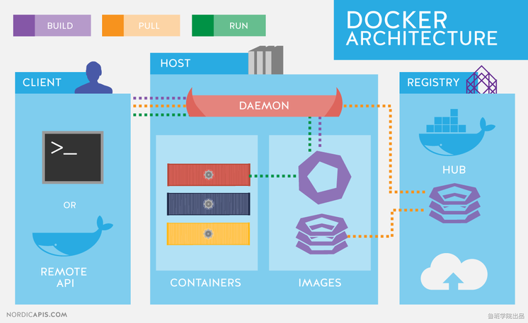
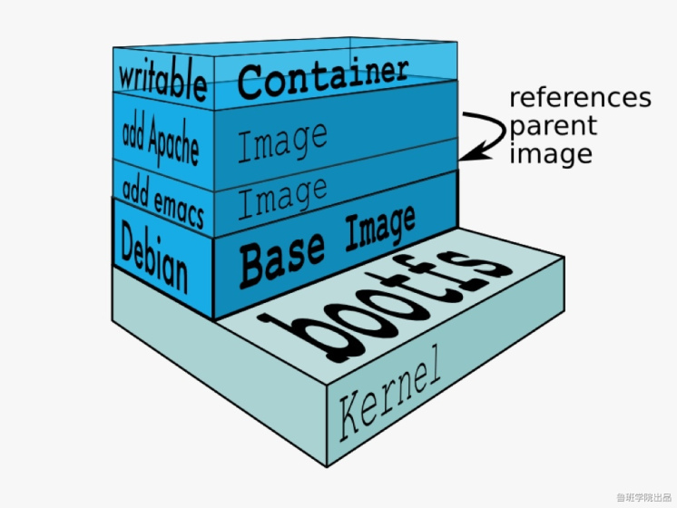
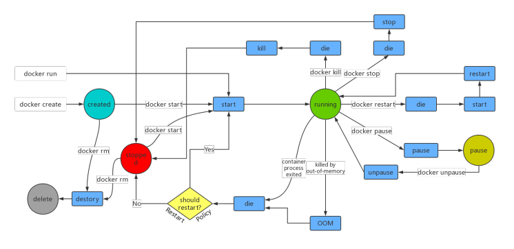
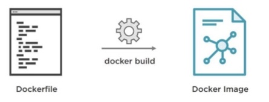

### Docker 架构
   
   Docker使用C/S架构，Client通过接口与Server进程通信实现容器的构建，运行和发布，如图：
   
   
   
#### Host(Docker 宿主机)
   
   安装了Docker程序，并运行了Docker daemon的主机。
   
##### Docker daemon(Docker 守护进程)
   
   运行在宿主机上，Docker守护进程，用户通过Docker client(Docker命令)与Docker daemon交互。
   
##### Images(镜像)：
   
   将软件环境打包好的模板，用来创建容器的，一个镜像可以创建多个容器。
   
   镜像分层结构：
   
   
   
   位于下层的镜像称为父镜像(Parent Image)，最底层的称为基础镜像(Base Image)。
   
   最上层为“可读写”层，其下的均为“只读”层。
   
   AUFS:
   
       • advanced multi-layered unification filesystem：高级多层统一文件系统
       • 用于为Linux文件系统实现“联合挂载”
       • AUFS是之前的UnionFS的重新实现
       • Docker最初使用AUFS作为容器文件系统层
       • AUFS的竞争产品是overlayFS，从3.18开始被合并入Linux内核
       • Docker的分层镜像，除了AUFS，Docker还支持btrfs，devicemapper和vfs等
       
##### Containers(容器)：
   
   Docker的运行组件，启动一个镜像就是一个容器，容器与容器之间相互隔离，并且互不影响。
   

#### Docker Client(Docker 客户端)
   
   Docker命令行工具，用户是用Docker Client与Docker daemon进行通信并返回结果给用户。也可以使用其他工具通过Docker Api(https://docs.docker.com/engine/api/sdk/) 与Docker daemon通信。
   
#### Registry(仓库服务注册)
   
   经常会和仓库(Repository)混为一谈，实际上Registry上可以有多个仓库，每个仓库可以看成是一个用户，一个用户的仓库放了多个镜像。
   仓库分为了公开仓库(Public Repository)和私有仓库(Private Repository)，最大的公开仓库是官方的Docker Hub，
   国内也有如阿里云、时速云等，可以给国内用户提供稳定快速的服务。用户也可以在本地网络内创建一个私有仓库。
   当用户创建了自己的镜像之后就可以使用 push 命令将它上传到公有或者私有仓库，这样下次在另外一台机器上使用这个镜像时候，只需要从仓库上 pull 下来就可以了。

###  Docker 安装
   
   Docker 提供了两个版本：社区版 (CE) 和企业版 (EE)。

#### 操作系统要求

   以Centos7为例，且Docker 要求操作系统必须为64位，且centos内核版本为3.1及以上。
    
   查看系统内核版本信息：

```
uname -r
```
   
#### 一、准备
   
   卸载旧版本：
   
```
yum remove docker docker-common docker-selinux docker-engine
yum remove docker-ce
```
   
   卸载后将保留/var/lib/docker的内容（镜像、容器、存储卷和网络等）。

```
rm -rf /var/lib/docker
```
   
  1.安装依赖软件包

```
yum install -y yum-utils device-mapper-persistent-data lvm2
#安装前可查看device-mapper-persistent-data和lvm2是否已经安装
rpm -qa|grep device-mapper-persistent-data
rpm -qa|grep lvm2
```
  
  2.设置yum源 

```
yum-config-manager --add-repo https://download.docker.com/linux/centos/docker-ce.repo
``` 
   
   3.更新yum软件包索引

```
yum makecache fast
```

#### 二、安装
   
   安装最新版本docker-ce

```
yum install docker-ce -y
#安装指定版本docker-ce可使用以下命令查看
yum list docker-ce.x86_64  --showduplicates | sort -r
# 安装完成之后可以使用命令查看
docker version
```
   
#### 三、配置镜像加速

   这里使用阿里云的免费镜像加速服务，也可以使用其他如时速云、网易云等
   
   1.注册登录开通阿里云容器镜像服务
   
   2.查看控制台，招到镜像加速器并复制自己的加速器地址
   
   3.找到/etc/docker目录下的daemon.json文件，没有则直接vi daemon.json
   
   4.加入以下配置

```
#填写自己的加速器地址
{
  "registry-mirrors": ["https://zfzbet67.mirror.aliyuncs.com"]
}
```
   
   5.通知systemd重载此配置文件；

```
systemctl daemon-reload
```
   
   6.重启docker服务

```
systemctl restart docker
```

### Docker常用操作
   
   输入docker可以查看Docker的命令用法，输入docker COMMAND --help查看指定命令详细用法。
   
#### 镜像常用操作
   
   查找镜像：

```
docker search 关键词
#搜索docker hub网站镜像的详细信息
```
   
   下载镜像：

```
docker pull 镜像名:TAG
# Tag表示版本，有些镜像的版本显示latest，为最新版本
```
   
   查看镜像：

```
docker images
# 查看本地所有镜像
```
   
  删除镜像：

```
docker rmi -f 镜像ID或者镜像名:TAG
# 删除指定本地镜像
# -f 表示强制删除
``` 
   
   获取元信息：

```
docker inspect 镜像ID或者镜像名:TAG
# 获取镜像的元信息，详细信息
```

#### 容器常用操作
   
   运行：

```
docker run --name 容器名 -i -t -p 主机端口:容器端口 -d -v 主机目录:容器目录:ro 镜像ID或镜像名:TAG
# --name 指定容器名，可自定义，不指定自动命名
# -i 以交互模式运行容器
# -t 分配一个伪终端，即命令行，通常-it组合来使用
# -p 指定映射端口，讲主机端口映射到容器内的端口
# -d 后台运行容器
# -v 指定挂载主机目录到容器目录，默认为rw读写模式，ro表示只读
```
   
   容器列表：

```
docker ps -a -q
# docker ps查看正在运行的容器
# -a 查看所有容器（运行中、未运行）
# -q 只查看容器的ID
```
   
   启动容器：

```
docker start 容器ID或容器名
```
   
   停止容器：

```
docker stop 容器ID或容器名
```
   
   删除容器：

```
docker rm -f 容器ID或容器名
# -f 表示强制删除
```
   
   查看日志：

```
docker logs 容器ID或容器名
```
   
   进入正在运行容器：

```
docker exec -it 容器ID或者容器名 /bin/bash
# 进入正在运行的容器并且开启交互模式终端
# /bin/bash是固有写法，作用是因为docker后台必须运行一个进程，否则容器就会退出，在这里表示启动容器后启动bash。
# 也可以用docker exec在运行中的容器执行命令
```
   
   拷贝文件：

```
docker cp 主机文件路径 容器ID或容器名:容器路径 #主机中文件拷贝到容器中
docker cp 容器ID或容器名:容器路径 主机文件路径 #容器中文件拷贝到主机中
```
   
   获取容器元信息：

```
docker inspect 容器ID或容器名
```
   
   
   
### 更新镜像
   
   有时候从Docker镜像仓库中下载的镜像不能满足要求，我们可以基于一个基础镜像构建一个自己的镜像
   
   两种方式：
    
    • 更新镜像：使用docker commit命令
    • 构建镜像：使用docker build命令，需要创建Dockerfile文件
   
   **先使用基础镜像创建一个容器，然后对容器内容进行更改，然后使用docker commit命令提交为一个新的镜像（以tomcat为例）。**
   
   1.根据基础镜像，创建容器
   
```
docker run --name mytomcat -p 80:8080 -d tomcat
```
   
   2.修改容器内容
   
```
docker exec -it mytomcat /bin/bash
cd webapps/ROOT
rm -f index.jsp
echo hello world > index.html
exit
```
   
   3.提交为新镜像

```
docker commit -m="描述消息" -a="作者" 容器ID或容器名 镜像名:TAG
# 例:
# docker commit -m="修改了首页" -a="华安" mytomcat huaan/tomcat:v1.0
```
   
   4.使用新镜像运行容器
   
```
docker run --name tom -p 8080:8080 -d huaan/tomcat:v1.0
```

### 使用Dockerfile构建镜像
   
#### 什么是Dockerfile？
    
   
    
#### 使用Dockerfile构建SpringBoot应用镜像
   
##### 一、准备
   
   1.把你的springboot项目打包成可执行jar包
   2.把jar包上传到Linux服务器

##### 二、构建
   
   1.在jar包路径下创建Dockerfile文件vi Dockerfile
   
```
# 指定基础镜像，本地没有会从dockerHub pull下来
FROM java:8
#作者
MAINTAINER huaan
# 把可执行jar包复制到基础镜像的根目录下
ADD luban.jar /luban.jar
# 镜像要暴露的端口，如要使用端口，在执行docker run命令时使用-p生效
EXPOSE 80
# 在镜像运行为容器后执行的命令
ENTRYPOINT ["java","-jar","/luban.jar"]
```
   
   2.使用docker build命令构建镜像，基本语法

```
docker build -t huaan/mypro:v1 .
# -f指定Dockerfile文件的路径
# -t指定镜像名字和TAG
# .指当前目录，这里实际上需要一个上下文路径
```
   
##### 三、运行
   
   运行自己的SpringBoot镜像
   
```
docker run --name pro -p 80:80 -d 镜像名:TAG
``` 

#### Dockerfile常用指令

##### FROM
   
   FROM指令是最重要的一个并且必须为Dockerfile文件开篇的第一个非注释行，用于为镜像文件构建过程指定基础镜像，后续的指令运行于此基础镜像提供的运行环境
   
   这个基础镜像可以是任何可用镜像，默认情况下docker build会从本地仓库找指定的镜像文件，如果不存在就会从Docker Hub上拉取
   
   语法：

```
FROM <image>
FROM <image>:<tag>
FROM <image>@<digest>
```
   
##### MAINTAINER(depreacted)
   
   Dockerfile的制作者提供的本人详细信息
   
   Dockerfile不限制MAINTAINER出现的位置，但是推荐放到FROM指令之后
   
   语法：

```
MAINTAINER <name>
```
   
   name可以是任何文本信息，一般用作者名称或者邮箱
   
##### LABEL
   
   给镜像指定各种元数据
   
   语法：
   
```
LABEL <key>=<value> <key>=<value> <key>=<value>...
```
   
   一个Dockerfile可以写多个LABEL，但是不推荐这么做，Dockerfile每一条指令都会生成一层镜像，如果LABEL太长可以使用\符号换行。构建的镜像会继承基础镜像的LABEL，并且会去掉重复的，但如果值不同，则后面的值会覆盖前面的值。

##### COPY
   
   用于从宿主机复制文件到创建的新镜像文件
   
   语法：
   
```
COPY <src>...<dest>
COPY ["<src>",..."<dest>"]
# <src>：要复制的源文件或者目录，可以使用通配符
# <dest>：目标路径，即正在创建的image的文件系统路径；建议<dest>使用绝对路径，否则COPY指令则以WORKDIR为其起始路径
```
   
   注意：如果你的路径中有空白字符，通常会使用第二种格式
   
   规则：
   
    • <src>必须是build上下文中的路径，不能是其父目录中的文件
    • 如果<src>是目录，则其内部文件或子目录会被递归复制，但<src>目录自身不会被复制
    • 如果指定了多个<src>，或在<src>中使用了通配符，则<dest>必须是一个目录，则必须以/符号结尾
    • 如果<dest>不存在，将会被自动创建，包括其父目录路径
   
##### ADD
   
   基本用法和COPY指令一样，ADD支持使用TAR文件和URL路径
   
   语法：
    
```
ADD <src>...<dest>
ADD ["<src>",..."<dest>"]
```
   
   规则：
        
    • 和COPY规则相同
    • 如果<src>为URL并且<dest>没有以/结尾，则<src>指定的文件将被下载到<dest>
    • 如果<src>是一个本地系统上压缩格式的tar文件，它会展开成一个目录；但是通过URL获取的tar文件不会自动展开
    • 如果<src>有多个，直接或间接使用了通配符指定多个资源，则<dest>必须是目录并且以/结尾
    
##### WORKDIR

   用于为Dockerfile中所有的RUN、CMD、ENTRYPOINT、COPY和ADD指定设定工作目录，只会影响当前WORKDIR之后的指令。
   
   语法：

```
WORKDIR <dirpath>
```    
   
   在Dockerfile文件中，WORKDIR可以出现多次，路径可以是相对路径，但是它是相对于前一个WORKDIR指令指定的路径
   
   另外，WORKDIR可以是ENV指定定义的变量
   
##### VOLUME
   
   用来创建挂载点，可以挂载宿主机上的卷或者其他容器上的卷
   
   语法：

```
VOLUME <mountpoint>
VOLUME ["<mountpoint>"]
```
   
   不能指定宿主机当中的目录，宿主机挂载的目录是自动生成的

##### EXPOSE
   
   用于给容器打开指定要监听的端口以实现和外部通信
   
   语法：

```
EXPOSE <port>[/<protocol>] [<port>[/<protocol>]...]
```
   
   <protocol>用于指定传输层协议，可以是TCP或者UDP，默认是TCP协议
   
   EXPOSE可以一次性指定多个端口，例如：EXPOSE 80/tcp 80/udp

##### ENV
   
   用来给镜像定义所需要的环境变量，并且可以被Dockerfile文件中位于其后的其他指令(如ENV、ADD、COPY等)所调用，调用格式：{variable_name}

```
ENV <key> <value>
ENV <key>=<value>...
```
   
   第一种格式中，<key>之后的所有内容都会被视为<value>的组成部分，所以一次只能设置一个变量
   
   第二种格式可以一次设置多个变量，如果<value>当中有空格可以使用\进行转义或者对<value>加引号进行标识；另外\也可以用来续行
   
##### ARG
   
   用法同ENV
   
```
ARG <name>[=<default value>]
```
   
   定一个变量，可以在docker build创建镜像的时候，使用--build-arg <varname>=<value>来指定参数

##### RUN
   
   用来指定docker build过程中运行指定的命令
   
```
RUN <command>
RUN ["<executable>","<param1>","<param2>"]
```
   
   第一种格式里面的参数一般是一个shell命令，以/bin/sh -c来运行它
   
   第二种格式中的参数是一个JSON格式的数组，当中<executable>是要运行的命令，后面是传递给命令的选项或者参数；但是这种格式不会用/bin/sh -c来发起，所以常见的shell操作像变量替换和通配符替换不会进行；
   如果你运行的命令依赖shell特性，可以替换成类似以下的格式

```
RUN ["/bin/bash","-c","<executable>","<param1>"]
```

##### CMD
   
   容器启动时运行的命令
   
```
CMD <command>
CMD ["<executable>","<param1>","<param2>"]
CMD ["<param1>","<param2>"]
```
   
   前两种语法和RUN相同
   
   第三种语法用于为ENTRYPOINT指令提供默认参数
   
    RUN和CMD区别：
        • RUN指令运行于镜像文件构建过程中，CMD则运行于基于Dockerfile构建出的新镜像文件启动为一个容器的时候
        • CMD指令的主要目的在于给启动的容器指定默认要运行的程序，且在运行结束后，容器也将终止；不过，CMD命令可以被docker run的命令行选项给覆盖
        • Dockerfile中可以存在多个CMD指令，但是只有最后一个会生效
        
##### ENTRYPOINT
   
   类似于CMD指令功能，用于给容器指定默认运行程序
   
```
ENTRYPOINT<command>
ENTRYPOINT["<executable>","<param1>","<param2>"]
```
   
   和CMD不同的是ENTRYPOINT启动的程序不会被docker run命令指定的参数所覆盖，而且，这些命令行参数会被当做参数传递给ENTRYPOINT指定的程序(但是，docker run命令的--entrypoint参数可以覆盖ENTRYPOINT)
   
   docker run命令传入的参数会覆盖CMD指令的内容并且附加到ENTRYPOINT命令最后作为其参数使用
   
   同样，Dockerfile中可以存在多个ENTRYPOINT指令，但是只有最后一个会生效
   
   Dockerfile中如果既有CMD又有ENTRYPOINT，并且CMD是一个完整可执行命令，那么谁在最后谁生效
   
##### ONBUILD
   
   用来在Dockerfile中定义一个触发器
   
```
ONBUILD <instruction>
```
   
   Dockerfile用来构建镜像文件，镜像文件也可以当成是基础镜像被另外一个Dockerfile用作FROM指令的参数
   
   在后面这个Dockerfile中的FROM指令在构建过程中被执行的时候，会触发基础镜像里面的ONBUILD指令
   
   ONBUILD不能自我嵌套，ONBUILD不会触发FROM和MAINTAINER指令
   
   在ONBUILD指令中使用ADD和COPY要小心，因为新构建过程中的上下文在缺少指定的源文件的时候会失败
   
   