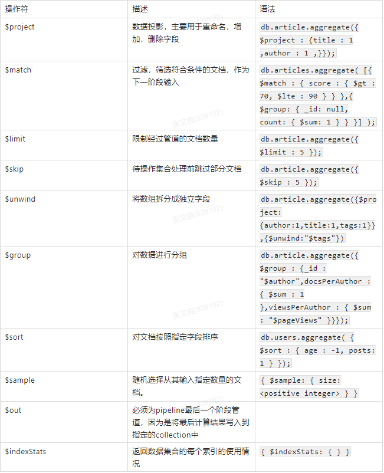
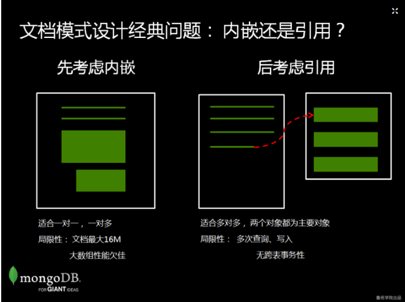
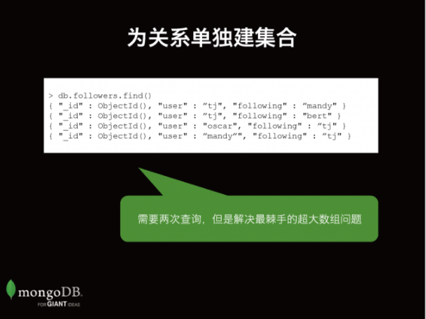

### 什么是MongoDB
   
   MongoDB是一个文档数据库，提供好的性能，领先的非关系型数据库。采用BSON存储文档数据。2007年10月，MongoDB由10gen团队所发展。2009年2月首度推出。MongoDB用c++编写的。
   
#### 优势：
   
   面向文档的存储：以 JSON 格式的文档保存数据。
   
   任何属性都可以建立索引。
   
   复制以及高可扩展性。
   
   自动分片。
   
   丰富的查询功能。
   
   快速的即时更新。
   
   来自 MongoDB 的专业支持。
   
#### elasticsearch与MongoDB相同点与不同点
   
   **相同点：**
   
   1、都是以json格式管理数据的nosql数据库。
   
   2、都支持CRUD操作。
   
   3、都支持聚合和全文检索。
   
   4、都支持分片和复制。
   
   5、都支持阉割版的join操作。
   
   6、都支持处理超大规模数据。
   
   **不同点：**
   
   1、es是java编写，通过RESTFul接口操作数据。mongodb是C++编写，通过driver操作数据。（es对java开发更有好，利于排查理解）
   
   2、mongodb的分片有hash和range两种方式，es只有hash一种。
   
   3、es是天生分布式，主副分片自动分配和复制，开箱即用。mongodb的分布式是由“前置查询路由+配置服务+shard集合”，需要手动配置集群服务。
   
   4、内部存储ES是到排索引+docvalues+fielddata。mongodb暂时未知。
   
   5、es全文检索有强大的分析器且可以灵活组合，查询时智能匹配。mongodb的全文检索字段个数有限制。
   
   6、es所有字段自动索引，mongodb的字段需要手动索引。
   
   7、MongoDB支持多文档事务
   
   mongorestore -d taibai /opt/stocks：  导入数据命令
   
   MongoDB特性：灵活性，可扩展性，强大的查询语言，优异的性能

### mongodb安装与启动
   
   mongodb下载网址:    https://www.mongodb.com/download-center/community
   
   选择版本、系统环境、包  。以下将以TGZ 为例
   
   下载完成将得到mongodb-linux-x86_64-rhel70-4.2.3.tgz包，将其上传到linux（sentos7）某个目录
   
   上传完成后解压并移动到/usr/local/mongodb目录
   
```
mv mongodb-linux-x86_64-rhel70-4.2.3 /usr/local/mongodb
```

   创建专门的负责的用户并赋予权限
```
cd /usr/local/mongodb 
groupadd mongodb
useradd -s /sbin/nologin -g mongodb -M mongodb
mkdir data log run
chown -R mongodb:mongodb data log run
```

   在/usr/local/mongodb 里面创建一个配置文件 mongodb.conf
   
   vim mongodb.conf  并写入下面的信息:

```
bind_ip=0.0.0.0
port=27017
dbpath=/usr/local/mongodb/data/
logpath=/usr/local/mongodb/log/mongodb.log
pidfilepath =/usr/local/mongodb/run/mongodb.pid
logappend=true
fork=true    
maxConns=500
noauth = true


配置解释：
fork=true   运行在后台
logappend=true  如果为 true，当 mongod/mongos 重启后，将在现有日志的尾部继续添加日志。否则，将会备份当前日志文件，然后创建一个新的日志文件；默认为 false。
noauth = true  不需要验证用户密码
maxConns=500 最大同时连接数 默认2000
```

   以上是MongoDB的安装与启动的准备工作，可直接启动  启动命令：

```
/usr/local/mongodb/bin/mongod -f /usr/local/mongodb/mongodb.conf
```
   
   配置环境变量
   
   vim /etc/profile
   
   在/etc/profile文件末尾添加一行:
   
```
 export PATH=/usr/local/mongodb/bin:$PATH
```

   让其生效:  source /etc/profile
   
   查看当前mongodb的版本:
   
```
mongod --version
```

### MongoDB的 crud

   执行mongo命令连接MongoDB
```
mongo
```

#### 数据库的操作
   
   MongoDB自带的原始数据库：
   
   admin：从权限角度来看，这是“root”数据库。如果将一个用户添加到这个数据库。这个用户自动继承所有数据库的权限。一些特定的服务器端命令也只能从这个数据库运行，比如列出所有的数据库或者关闭服务器
   
   local：这个数据永远不会被复制，可以用来存储限于本地单台服务器的任意集合
   
   config：当mongo用于分片设置时，config数据库在内部使用。用于保存分片的相关信息
   
   **查看**：show dbs
   
   **创建**：use 数据库名
   
   使用use时，如果数据库存在则会进入到相应的数 据库，如果不存在则会自动创建 – 一旦进入数据库，则可以使用db来引用当前库 ;如果是第一次创建，那个这个数据库只是存在于内存当中，直到这个数据库中创建了集合后才会持久化到磁盘上
   
   **删除**：db.dropDatabase()
   
   用于删除已经持久化的数据库，刚创建在内存中的数据库删除无效

#### 集合的操作
   
   **创建**：db.createCollection("集合名称")
   
   **查看**： show  tables  或者  show collections
   
   **删除**：db.集合名称.drop()
   
#### 文档的操作
   
   **添加：**

```
## xyj是集合名称，如果该集合还没有被创建，则会自动创建

db.xyj.insert({name:"猪八戒",age:28,gender:"男"});   

db.xyj.insertOne({_id:"workd",name:"猪八戒",age:28,gender:"男"});
```
   
   **批量添加：**
   
   当我们向集合中插入文档时，如果没有给文档指定 id属性，则数据库会自动为文档添加 id该属性用来作为文档的唯一标识  
   id我们可以自己指定，如果我们指定了数据库就不会在添加了，如果自己指定 id 也必须确保它的唯一性
   
```
db.xyj.insert([
     {name:"沙和尚",age:38,gender:"男"},
     {name:"白骨精",age:16,gender:"女"},
     {name:"蜘蛛精",age:14,gender:"女"}
]);

db.xyj.insertMany([
     {name:"沙和尚",age:38,gender:"男"},
     {name:"白骨精",age:16,gender:"女"},
     {name:"蜘蛛精",age:14,gender:"女"}
]);


db.collection.insertOne()     插入一个文档对象
db.collection.insertMany()    插入多个文档对象
```

   **额外小知识**
   
```
try{
	db.xyj.insert([
      {name:"沙和尚",age:38,gender:"男"},
      {name:"白骨精",age:16,gender:"女"},
      {name:"蜘蛛精",age:14,gender:"女"}
    ]);
}catch(e){
	print(e)
}

可以知道那条插入失败
```
   
   **覆盖修改：** db.xyj.update({_id:"hello"},{age:NumberInt(30)})
   
   执行效果： _id:hello这条数据只有age一个字段了
   
   **局部修改：** db.xyj.update({_id:"workd"},{$set:{age:NumberInt(30)}})
   
   执行效果： 只会修改这条数据的某个字段
   
   **批量修改：** db.xyj.update({name:"蜘蛛精"},{$set:{age:NumberInt(100)}},{multi:true})
   
   在修改条数据时，必须要加上第三个参数，否则只会修改一条数据
   
   **字段增加操作：** db.xyj.update({_id:"workd")},{$inc:{age:NumberInt(1)}})
   
   注意：$inc对应的字段必须是数字，而且递增或递减的值也必须是数字。
   
   **删除文档：** db.xyj.remove({_id:"workd"})
   
   **删除文档字段：** db.xyj.update({"_id":123}, {"$unset": {"name":1}})
   
   $unset指定字段的值只需是任意合法值即可。
   
   **删除所有：**  db.xyj.remove({})
   
```
插入测试数据

db.xyj.insertMany([
     {name:"沙和尚",age:38,gender:"男",hobby:["打篮球","吃喝"]},
     {name:"白骨精",age:16,gender:"女",hobby:["吃喝"]},
     {name:"蜘蛛精",age:14,gender:"女",hobby:["跑步","打乒乓球"]},
	 {name:"唐生",age:25,gender:"男",hobby:["坐禅","吃喝"]}
]);
```

   数组添加：

```
db.xyj.update({"name": "白骨精"}, {"$push": {"hobby": "念佛"}})
```
   
   删除元素（$pop）：

```
db.xyj.update({"_id": ObjectId("5e80950a2b2f5820a1958a43")}, {"$pop": {"hobby": 1}})  // 删除最后一个元素
db.xyj.update({"_id": ObjectId("5e80950a2b2f5820a1958a43")}, {"$pop": {"hobby": -1}})  // 删除第一个元素
```

   删除特定元素（$pull）：

```
db.xyj.update({"_id": ObjectId("5e80950a2b2f5820a1958a44")}, {"$pull": {"hobby": "跑步" }})
```
   
   更新嵌套数组的值：

```
db.xyj.insert({name:"猪八戒",age:28,gender:"男",address: [{place: "nanji", tel: 123}, {place: "dongbei", tel: 321}]});


db.xyj.update({"_id": ObjectId("5e809fc665a1965fdc792fc8")}, {"$set": {"address.0.tel": 213}})
```
   
   数组查询：

```
db.xyj.find({"hobby":"跑步"})

多个元素的查询
db.xyj.find({"hobby":{"$all": ["跑步", "打乒乓球"]}})
只有hobby数组同时存在跑步和打乒乓球才会匹配

限制数组长度查询
db.xyj.find({"hobby": {"$size": 2}})
只有数组的长度是2才会匹配
```

   查看所有：
   
```
mongodb:   db.xyj.find()
sql:   select * from xyj
```
   
   投影查询：
   
```
mongodb:   db.xyj.find({name:"猪八戒"},{name:1,_id:0})   
sql:   select name from xyj where name= "猪八戒"
1表示显示 0表示强制隐藏
```

   按字段条件查询：
   
```
mongodb:   db.xyj.find({name:"猪八戒"})
sql:   select * from xyj where name= "猪八戒"
```
   
   按字段条件查询并只返回一条：
   
```
db.xyj.findOne({name:"猪八戒"})
```
   
   组合查询：
   
```
语法：db.xyj.find($and:[{},{},{}])
//查询年级大于20小于50的
db.xyj.find({$and:[{age:{$gt:NumberInt(20)}},{age:{$lt:NumberInt(50)}}]})  
//查询名字里有”精“的或者年纪大于30的
db.xyj.find({$or:[{age:{$gt:NumberInt(30)}},{name:/精/}]})
```

   比较查询：
   
```
 db.xyj.find({age:{$gt:NumberInt(20)}})  //查询年级大于20岁的
 
$gt--》大于     $lt--》小于   $gte--》大于等于     $lte--》小于等于   $ne---》不等于(不等于不一定要用于数字)
```

   
   包含查询：
   
```
 db.xyj.find({age:{$in:[28,38]}})
```
   
   不包含：
   
```
 db.xyj.find({age:{$nin:[28,38]}})
```
   
   Like：

```
 db.xyj.find({"name": /精/})
```
   
   统计查询:
   
```
db.xyj.count()或者db.xyj.count({字段：条件})
```
  
  取模：

```
db.xyj.find({"age": {$mod: [5, 1]}})`
   比如我们要匹配 age % 5 == 1
```
   
  是否存在（$exists)

```
db.xyj.find({"love": {"$exists": true}})  // 如果存在字段love，就返回
db.xyj.find({"love": {"$exists": false}}) // 如果不存在字段love，就返回
```

#### 分页查询
   
   limit：显示几条记录
   
   skip：跳过几条记录
   
   第一次查询：db.xyj.find().limit(2)
   
   第一次查询：db.xyj.find().limit(2).skip(2)
   
   结合排序：db.xyj.find().limit(2).skip(2).sort({age:1})   //  1代表升序，-1代表降序
   
   执行顺序： sort > skip > limit
   
#### 聚合管道
   
   较常见的管道操作符以及他们的作用：
   
   

   插入测试数据
   
```
document1=({name:'dogOne',age:1,tags:['animal','dog'],type:'dog',money:[{min:100},{norm:200},{big:300}]});

document2=({name:'catOne',age:3,tags:['animal','cat'],type:'cat',money:[{min:50},{norm:100},{big:200}]});

document3=({name:'catTwo',age:2,tags:['animal','cat'],type:'cat',money:[{min:20},{norm:50},{big:100}]});

document4=({name:'dogTwo',age:5,tags:['animal','dog'],type:'dog',money:[{min:300},{norm:500},{big:700}]});

document5=({name:'appleOne',age:0,tags:['fruit','apple'],type:'apple',money:[{min:10},{norm:12},{big:13}]});

document6=({name:'appleTwo',age:0,tags:['fruit','apple'],type:'apple',money:[{min:10},{norm:12},{big:13}]});

document7=({name:'pineapple',age:0,tags:['fruit','pineapple'],type:'pineapple',money:[{min:8},{norm:9},{big:10}]});

db.mycol.insert(document1)

db.mycol.insert(document2)

db.mycol.insert(document3)

db.mycol.insert(document4)

db.mycol.insert(document5)

db.mycol.insert(document6)

db.mycol.insert(document7)
```

   假定我们想提取money中min为100的文档，并且只输出名称和money数组中的min那一项

```
db.mycol.aggregate(
   {$match:{'money.min':100}},
   {$project:{_id:0,name:'$name',minprice:'$money.min'}}
)
```

   假定我们想提取money中min小于100的文档，并且限制3个文档，跳过一个文档再显示
   
```
db.mycol.aggregate(

    {$match:{'money.min':{$lt:100}}},

    {$limit:3},

    {$skip:1},

    {$project:{_id:0,name:'$name',minprice:'$money.min'}}

    )
```
   
   通过type类型来对数据进行分类，并且同时统计他们的年龄age总和
   
```
db.mycol.aggregate(
    {$group:{_id:'$type',sumage:{$sum:'$age'}}}
)
```

   按照年龄对数据进行排序

```
db.mycol.aggregate(
    {$group:{_id:'$type',sumage:{$sum:'$age'}}},
    {$sort:{sumage:1}}
)
```

### 文档模式设计的基本策略
   
   其实很简单，我们一般建议的是先考虑内嵌， 直接按照你的对象模型来设计你的数据模型。如果你的对象模型数量不多，关系不是很复杂，那么恭喜你，可能直接一种对象对应一个集合就可以了。
   
   内嵌是文档模型的特色，可以充分利用MongoDB的富文档功能来享受我们刚才谈到的一些文档模型的性能和扩展性等特性。一般的一对一、一对多关系，比如说一个人多个地址多个电话等等都可以放在一个文档里用内嵌来完成。
   
   但是有一些时候，使用引用则难以避免。比如说， 一个明星的博客可能有几十万或者几百万的回复，这个时候如果把comments放到一个数组里，可能会超出16M的限制。这个时候你可以考虑使用引用的方式，在主表里存储一个id值，指向另一个表中的 id 值。使用引用要注意的就是：从性能上讲，一般我们可能需要两次以上才能把需要的数据取回来。更加重要的是：需要把数据存放到两个集合里，但是目前为止MongoDB并不支持跨表的事务性，所以对于强事务的应用场景要谨慎使用。

   
   
   **设计原则：**
   
   为应用程序提供服务，而不是为了存储优化
   
   为实现最佳性能而设计
   
   **购物车场景设计：**
   
```
db.cart.insert({
  "userid": 1000,
  "last_activity": new Date(),
  "status": "active",
  "items": [
    {
    "itemid": 1000,
    "title": "mianbao",
    "price": 5.00,
    "quantity": 1,
    "img_rul":["mianbao.jpg"]
    }
  ]
});
```
   
   在这里我们把商品的一些主要信息放到购物车里了，比如说 name,price, quantity，为什么？ 读一次所有信息都拿到了：价格、数量等等，不需要再去查另一张表。这是一种比较常见的优化手段，用冗余的方式来提供读取性能。
   
   向购物车添加数据：
   
   比如说，如果我们想要往购物车里增加一个价值2元的面包，我们可以用下面的update语句。注意$push的用法。$push 类似于javascript的操作符，意思是往数组尾部增加一个元素。
   
```
db.cart.update({"_id": ObjectId("5e96a6e5064b2cd766b2b4de")},{"$push": {"items":{"itemid": 1001,"title": "niupai","price": 2.00,"quantity": 1,"img_url": "bread.jpg"}},$set:{"last_activity": new Date()}});
```

   更新数量：
   
```
db.cart.update({"_id": ObjectId("5e833a5acaea32e75f6f5b5e"),"items.itemid":1001}, {$set:{"items.$.quantity":5,"last_activity": new Date()}})
```

   统计所有商品的总价：

```
db.cart.aggregate(
   [
   {"$match":{"_id": ObjectId("5e96aa9f3bbe036e72bbc946")}},{"$unwind":"$items"},
      {
        $group : {
           _id : null,
           totalPrice: { $sum: { $multiply: [ "$items.price", "$items.quantity" ] } },
           count: { $sum: 1 }
        }
      }
   ]
)

$sum:1 :如果前面的情况出现一次,就加1, 如果后面$sum:2 那么每次前面条件满足一次就加2
使用了$group:_id ：强制必须存在。可以为 null。
 _id : null：则意为对所有行进行分组统计
```

   统计单个商品的总价：

```
db.cart.aggregate(
   [
   {"$match":{"_id": ObjectId("5e833a5acaea32e75f6f5b5e")}},{"$unwind":"$items"},
      { $project: {total_price: { $multiply: [ "$items.price", "$items.quantity" ] } } }
   ]
)
```
   
  **社交网络案例：**
  
  对于关系描述，使用文档模型的内嵌数组特性，我们可以很容易地把我关注的用户（following）和关注我的用户表示出来。下例表示TJ我的关注的用户是mandy和bert，而oscar和mandy则在关注我。这种模式是文档模型中最经典的。但是有一个潜在问题就是如果TJ我是一个明星，他们关注我的人可能有千万。一个千万级的数组会有两个问题：1） 有可能超出一个文档最大16M的硬性限制； 2） MongoDB数组太大会严重影响性能。
  
  
  
  怎么办？我们可以建立一个专门的集合来描述关注关系。这里就是一个内嵌和引用的经典选择。我们希望用内嵌，但是如果数组维度太大，就需要考虑用另外一个集合的方式来表示一对多的关系（用户 1–N 关注者）
  
  
  

### 索引
   
##### 索引的类型
   
   **单字段索引**
   
   **复合索引**
   
   **其他类型索引**
   
   	    哈希索引：是指按照某个字段的hash值来建立索引，目前主要用于MongoDB Sharded Cluster的Hash分片，hash索引只能满足字段完全匹配的查询，不能满足范围查询等。
   	    地理位置索引：能很好的解决O2O的应用场景，比如『查找附近的美食』、『查找某个区域内的车站』等。
   	    文本索引：能解决快速文本查找的需求，比如有一个博客文章集合，需要根据博客的内容来快速查找，则可以针对博客内容建立文本索引。
   
##### 索引的操作
   
   创建匿名索引

```
## 准备测试数据：
for (var i = 1; i<= 100;i++) {
   db.xyj.insert({name: 'taibai'+i,num: i});
}
```

   查找{num: 100}文档的过程分析
   
```
 db.xyj.find({num: 100}).explain(true)
 
返回信息中：
 "stage" : "COLLSCAN",        意思为全表扫描
 executionTimeMillis" : 144   查询时间
```
  
  创建匿名索引
  
```
db.xyj.createIndex({num: 1})
{
        "createdCollectionAutomatically" : false,
        "numIndexesBefore" : 1,  // 添加本次索引之前的索引数
        "numIndexesAfter" : 2,   // 添加本次索引之后的索引数
        "ok" : 1
}
```

   建立索引后再次查找
   
```
 db.xyj.find({num: 100}).explain(true)
 
 "stage" : "IXSCAN", // 通过扫描索引进行查找
 "indexName" : "num_1",  // 如果没有指定索引名称的话， 默认格式为 ‘字段_1’ 或者 ‘字段_-1’ , 1 代表正序， -1 代表 倒序
 "executionTimeMillis" : 0,  // 本次执行时间的毫秒数为 0ms !!!
```

   创建命名索引
   
   如果没有指定索引名称的话， 默认格式为 fieldName_1 或者 fieldName_-1，如果想要自定义索引名称的话，可以在创建的时候指定名称，如下：

```
db.xyj.createIndex({name: 1}, {name:' myIndexName'})
```
   
   查询索引：db.xyj.getIndexes()
   
```
[
        {
                "v" : 2,
                "key" : {
                        "_id" : 1
                },
                "name" : "_id_",
                "ns" : "test.xyj"
        },
        {
                "v" : 2,
                "key" : {
                        "num" : 1
                },
                "name" : "num_1",
                "ns" : "test.xyj"
        },
        {
                "v" : 2,
                "key" : {
                        "name" : 1
                },
                "name" : " myIndexName",
                "ns" : "test.xyj"
        }
]

v:版本号
key： 在那个字段创建了索引，是升序还是降序的
name: 索引的名字
ns： 那个数据库的集合下
```

   指定需要使用的索引
   
```
db.xyj.find({num: "100"}).hint({num:1}).explain(true)   //hint指定强制使用哪个索引
```
   
   创建复合索引
   
   查询的条件不止一个，需要用复合索引
   
```
db.xyj.createIndex({name:1,num:1});
```

   创建ttl（过期）索引
   
   mongodb也可以像redis一样给文档设置过期数据，建立ttl索引，这里设置了10秒钟的过期时间，10秒钟之后过期
   
```
db.classTwo.insert({time:new Date()});
db.classTwo.createIndex({time:1},{expireAfterSeconds:10});
```
   
   索引字段的值必须Date对象，不能是其它类型比如时间戳
   
   删除时间不精确，每60秒跑一次。删除也要时间，所以有误差。
   
   创建全文索引
   
```
## 准备测试数据：
db.xyj.insertMany([
 {"name" : "Lily", "content" : "I am a girl" },
 {"name" : "Tom", "content" : "I am a boy" },
 {"name" : "Carl", "content" : "I do not know boy girl"}
 ])
```
   
   创建全文索引：
   
```
db.xyj.createIndex({content: 'text'})
```
   
```
// 查找包含 ‘girl’ 的文档
 db.xyj.find({$text: {$search: 'girl'}})
//查找包含 ‘girl’ 或者 ‘boy’ 的文档（多次查找是 与 的关系）
db.xyj.find({$text: {$search: 'boy girl'}})
// 查找仅包含‘girl’ 不包含‘boy’的文档
db.xyj.find({$text: {$search: 'girl -boy'}})
// 就是要查找包含 ‘girl boy’ 字符的文档（需要转义）
db.xyj.find({$text: {$search: '\"boy girl\"'}})
```

   最大的问题,全文索引不支持中文。准确的来说，支持中文的能力没有想象中强大。
   
```
db.textIndexTest.insert({author:"杜甫",title:"绝句",article:"两个黄鹂鸣翠柳， 　　一行白鹭上青天。窗含西岭千秋雪，门泊东吴万里船。"})
db.textIndexTest.insert({author:"李白",title:"静夜思",article:"床前明月光，疑是地上霜。 举头望明月，低头思故乡。"})
db.textIndexTest.insert({author:"张 王",title:"你好",article:"测试数据"})

创建索引
db.textIndexTest.createIndex( { author: "text" } )

db.textIndexTest.find({$text:{$search:"李白"}}) 
db.textIndexTest.find({$text:{$search:"李"}}) 
db.textIndexTest.find({$text:{$search:"王"}})
```
   
   二维（地理位置）索引
   
```
## 准备测试数据：
db.dili.insertMany([
{ "gis" : [ 1, 1 ] },
{ "gis" : [ 1, 2 ] },
{ "gis" : [ 1, 3 ] },
{ "gis" : [ 2, 1 ] },
{ "gis" : [ 2, 2 ] },
{ "gis" : [ 2, 3 ] },
{ "gis" : [ 3, 1 ] },
{ "gis" : [ 3, 2 ] },
{ "gis" : [ 3, 3 ] }
]);
```

   创建二维索引
   
```
db.dili.ensureIndex({gis:'2d'})
```
   
   查询距离[1,1]最近的四个点

```
 db.dili.find({gis:{$near: [1,1]}}).limit(4)
```
   
   查询以点[1,2]和点[3,3]为对角线的正方形中的所有的点

```
db.dili.find({gis: {$within:{$box: [[1,2],[3,3]]}}})
```
   
   查出以[2,2]为圆心，以1 为半径为规则下圆心面积中的点

```
db.dili.find({gis: {$within:{$center: [[2,2],1]}}})
```
  
  删除索引： db.集合名称.dropIndex( 索引名称或者 创建时的条件 )    //如果是文本索引，只能通过名字删

```
db.xyj.dropIndex({age:1})  //条件
   db.xyj.dropIndex("age_1")//名称
   db.xyj.dropIndexes()   //删除所有索引   自带的这个id的索引是不会删除的
```

   