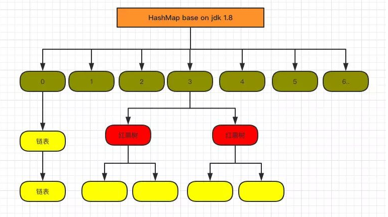

### HashMap 

   HashMap 线程不安全
   
   HashMap 底层是基于数组 + 链表组成的, 头插法  (jdk.1.7) 
   
   HashMap 底层是基于数组 + 链表+ 红黑树组成的,尾插法  (jdk.1.8)

#### 1,7 HashMap
  1.7 数据结构图
  
  
  
  1.7 中HashMap 的实现
  
    

负载因子 
    由于给定的 HashMap 的容量大小是固定的，比如默认初始化：
    
  
    

  给定的默认容量为 16，默认负载因子为 0.75。Map 在使用过程中不断的往里面存放数据，当数量达到了16 * 0.75 = 12 就需要将当前 16 的容量进行扩容，而扩容这个过程涉及到 rehash、复制数据等操作，所以非常消耗性能。因此通常建议能提前预估 HashMap 的大小最好，尽量的减少扩容带来的性能损耗。

根据代码可以看到其实真正存放数据的是
   `transient Entry<K,V>[] table = (Entry<K,V>[]) EMPTY_TABLE;`
Entry 是 HashMap 中的一个内部类，从他的成员变量很容易看出：
  
  
  
put 方法
   
   
   
   
    
    1. 根据key 通过 哈希算法与 与运算 得出数组下标
    2. 如果数组下标位置元素为空，则将key 和 value 封装为Entry 对象， 并放入该位置
    3. 如果数组下标元素不为空，则先判断是否需要扩容，如果需要扩容则进行扩容，如果不用扩容，就生成Entry 对象，并使用 头插法添加到当前位置的链表中去。
  
get 方法

   
   
#### 1,8 HashMap
   
   1.8 HashMap 结构图
   
    
   
   1.8 的核心成员变量和1.7 大致相同，有几个重要的区别:
        
        TREEIFY_THRESHOLD 用于判断是否需要将链表转换为红黑树的阈值。
        HashEntry 改为 Node 。
        Node 的核心组成其实和1.7 的 HashEntry 一样，存放的也是key ,value ,hashcode,next 等数据。 

put 方法
   
   
    
    1.判断当前桶是否为空，为空的话就需要初始化（resize 中会判断是否进行初始化）
    2.根据当前key 的hashcode 定位到具体桶中并判断是否为空，为空之前在当前位置创建一个新桶
    3.如果桶有值（hash 冲突）,比较当前桶的 key hashcode 与写入的key 是否相等，相等就赋值给e ,第八步的时候会统一进行赋值及返回。
    4.如果当前桶为红黑树，就按照红黑树方式写入数据.
    5.如果是链表，就将当前的key，value 封装成新节点写入到当前桶的后面（形成链表）。
    6.接着判断当前链表的大小是否大于预设的阈值，大于时转换为红黑树。
    7.如果在遍历过程中找到key 相同时直接退出遍历
    8.如果 e != null 将相当于存在相同的key,就需要将值覆盖。
    9.判断是否需要扩容。
    
get 方法
   
    
    
    1.将key hash 之后取得所定位的桶
    2.如果桶为空直接返回null.
    3.否则判断桶的第一个位置（可能为链表，可能是红黑树）的key是否为查询的key ,如果是直接返回value.
    4.如果不匹配，则判断它的下一个是红黑树还是链表
    5.是红黑树就按照树的查找方式返回值，是链表就按照链表的方式遍历匹配返回值。
    
从两个核心方法（get/put）可以看出1.8 中对大链表做了优化，修改为红黑树查询效率直接提高了 0（logn）.
    但是HashMap 原有的问题还是存在，比如在并发场景下使用时容易出现死循环。
    
    
   
    在上文的HashMap 扩容的时候会调用 resize() 方法，就是这里的并发操作容易在一个桶上形成环形链表；这样当获取一个不存在的key 时，计算出的index 正好是环形链表的下标就会出现死循环。
 
    

###  ConcurrentHashMap 

   线程安全的（但不是绝对安全）
   
   1.7  底层是基于 数组 + 链表 组成的,头插法  (ReentrantLock+Segment 数组、HashEntry 组成) 分段锁
   
   1·.8  底层是基于数组 + 链表 + 红黑树 组成的，尾插法  (synchronized+CAS+HashEntry+红黑树) 
   
   sizeCtl 含义：
        它是一个控制标识符，很多地方都有用到
        负数代表正在进行初始化或扩容操作
        -1代表正在初始化，
        -N表示有N-1个线程正在进行扩容操作
        正数或0代表hash表还没有被初始化：这个数值表示初始化或下一代进行扩容的大小，它的值是当前ConcurrentHashMap 容量的0。75倍，这与loadfactor 是对应的。
   
####  1.7 concurrentHashMap
    
  结构图
    
   
    

   如图所示，是由 Segment 数组、HashEntry 组成，和 HashMap 一样，仍然是数组加链表。它的核心成员变量：

   
   

   Segment 是 ConcurrentHashMap 的一个内部类，主要的组成如下：
    
   
    
 
看看其中 HashEntry 的组成：

   

和 HashMap 非常类似，唯一的区别就是其中的核心数据如 value ，以及链表都是 volatile 修饰的，保证了获取时的可见性。原理上来说：ConcurrentHashMap 采用了分段锁技术，其中 Segment 继承于 ReentrantLock。不会像 HashTable 那样不管是 put 还是 get 操作都需要做同步处理，理论上 ConcurrentHashMap 支持 CurrencyLevel (Segment 数组数量)的线程并发。每当一个线程占用锁访问一个 Segment 时，不会影响到其他的 Segment。

下面也来看看核心的 put get 方法。
   
   

首先是通过 key 定位到 Segment，之后在对应的 Segment 中进行具体的 put。
   
   
    
 
虽然 HashEntry 中的 value 是用 volatile 关键词修饰的，但是并不能保证并发的原子性，所以 put 操作时仍然需要加锁处理。首先第一步的时候会尝试获取锁，如果获取失败肯定就有其他线程存在竞争，则利用 scanAndLockForPut() 自旋获取锁。
    
   
    
1.尝试自旋获取锁。
2.如果重试的次数达到了 MAX_SCAN_RETRIES 则改为阻塞锁获取，保证能获取成功。
    
   
    
再结合图看看 put 的流程。
  1.将当前Segment 中的table 通过key 的 hashcode 定位到HashEntry.
  2.遍历该HashEntry,如果不为空则判断传入的key 和当前遍历的key 是否相等，相等则覆盖旧的value。
  3. 不为空则需要新建一个HashEntry 并加入到Segment 中，同时会先判断是否需要扩容。
  4.最后会解除在1 中所获取当前Segment 的锁。
  
 get 方法
    
   
    

只需要将 Key 通过 Hash 之后定位到具体的 Segment ，再通过一次 Hash 定位到具体的元素上。由于 HashEntry 中的 value 属性是用 volatile 关键词修饰的，保证了内存可见性，所以每次获取时都是最新值。ConcurrentHashMap 的 get 方法是非常高效的，因为整个过程都不需要加锁。

#### 1.8 ConcurrentHashMap 
    
1.7 已经解决了并发问题，并且能支持 N 个 Segment 这么多次数的并发，但依然存在 HashMap 在 1.7 版本中的问题。
    那就是查询遍历链表效率太低。
1.8 结构图

   
    
 
看起来是不是和 1.8 HashMap 结构类似？其中抛弃了原有的 Segment 分段锁，而采用了 CAS + synchronized 来保证并发安全性。
    
   
  
也将 1.7 中存放数据的 HashEntry 改为 Node，但作用都是相同的。其中的 val next 都用了 volatile 修饰，保证了可见性。

put 方法:
    
   
    
1.根据key 计算出hashcode.
2.判断是否需要进行初始化。
3.f 即为当前key 定位的Node,如果为空表示当前位置可以写入数据，利用CAS 尝试写入，失败则自旋保证成功。
4.如果当前位置 hashcode == MOVED == -1,则需要扩容。
5.如果都不满足，则利用synchronized 锁写入数据。
6. 如果数量大于 TREEIFY_THRESHOLD 则要转换为红黑树。

get  方法
   
   
   
 1.根据计算出来的hashcode 寻址，如果就在桶上那么直接返回值。
 2.如果是红黑树就按照树的方式获取值。
 3.不是就按照链表的方式遍历获取值。
 
 
1.8 在 1.7 的数据结构上做了大的改动，采用红黑树之后可以保证查询效率（O(logn)），甚至取消了 ReentrantLock 改为了 synchronized，这样可以看出在新版的 JDK 中对 synchronized 优化是很到位的

### HashMap && ConcurrentHashMap 
   
   1.为什么用数组加链表,因为解决hash 冲突,
   2.为什么使用红黑树 ，因为解决链表查询慢的问题

### JDK8中的ConcurrentHashMap为什么使用synchronized来进行加锁？
   
   JDK8中使用synchronized加锁时，是对链表头结点和红黑树根结点来加锁的，而ConcurrentHashMap会保证，数组中某个位置的元素一定是链表的头结点或红黑树的根结点，
   所以JDK8中的ConcurrentHashMap在对某个桶进行并发安全控制时，只需要使用synchronized对当前那个位置的数组上的元素进行加锁即可，对于每个桶，只有获取到了第一个元素上的锁，才能操作这个桶，
   不管这个桶是一个链表还是红黑树。
   想比于JDK7中使用ReentrantLock来加锁，因为JDK7中使用了分段锁，所以对于一个ConcurrentHashMap对象而言，分了几段就得有几个ReentrantLock对象，表示得有对应的几把锁。
   而JDK8中使用synchronized关键字来加锁就会更节省内存，并且jdk也已经对synchronized的底层工作机制进行了优化，效率更好。

### JDK8中的ConcurrentHashMap是如何扩容的？

   首先，JDK8中是支持多线程扩容的，JDK8中的ConcurrentHashMap不再是分段，或者可以理解为每个桶为一段，在需要扩容时，首先会生成一个双倍大小的数组，生成完数组后，线程就会开始转移元素，在扩容的过程中，
   如果有其他线程在put，那么这个put线程会帮助去进行元素的转移，虽然叫转移，但是其实是基于原数组上的Node信息去生成一个新的Node的，也就是原数组上的Node不会消失，因为在扩容的过程中，如果有其他线程在get也是可以的。

### HashMap 的扩容机制 

#### 1.7 版本 

    1. 先生成数组
    2. 遍历老数组中的每一个位置上的链表的每个元素
    3. 取每个元素key，并基于新数组长度，计算出每个元素在新数组中的下标。
    4. 将元素添加到新数组中去。
    5. 所有元素转移完成后，将新数组赋值给 HashMap 对象的table 属性

#### 1.8 版本 

    1. 先生成新的数组
    2. 遍历老数组中的每个位置上的链表或红黑树
    3. 如果是链表，则直接将链表中的每个元素重新计算下标，并添加到新数组中去
    4. 如果是红黑树，则先遍历红黑树，先计算出红黑树中每个元素对应在新数组中的下标位置。
        a. 统计每个下标位置的元素个数。
        b. 如果该位置下的元素超过8，则新生成一个新的红黑树，并将根节点添加到新数组的对应位置
        c. 如果该位置下的元素没有超过8，那么则生成一个链表，并将链表的头节点添加到新数组的对应位置。
    5. 所以元素转移完之后，将新数组赋值给 HashMap 对象的 table 属性。

### ConcurrentHashMap 的扩容机制 

#### 1.7 版本 

    1. 1.7 版本的 ConcurrentHashMap 是基于 segment 分段实现的
    2. 每个 segment 相对于一个小型的 HashMap
    3. 每个 segment 内部 会进行扩容，和 HashMap 的扩容机制类似
    4. 先 生成新的数组，然后转移元素到新数组中去。
    5. 扩容的判断也是每个 segment 内部单独判断的，判断是否超过阈值

#### 1.8 版本 

    1. 1.8 版本的 ConcurrentHashMap 不在基于 Segment 实现。
    2. 当某个线程进行put 时，如果发现 ConcurrentHashMap 正在进行扩容，那么该线程跟着一起扩容。
    3. 如果 某个线程put 时，发现没有正在进行扩容，则将key-value 添加大 ConcurrentHashMap 中去，然后判断是否超过阈值，超过则进行扩容。
    4. ConcurrentHashMap 是支持多个线程同时扩容的。
    5. 扩容之前也先生成一个新的数组
    6. 在转移元素时，先将原数组分组，将每组分给不同的线程来进行元素转移，每个线程负责负责一组数据或多组的元素转移工作。

### 问题
    
    1. hashCode为什么要取模（或者是与操作）--》节省空间
    2. 为什么要用链表，hash 冲突
    3. 1.7 hashmap 扩容的时候，会出现死循环导致，线程安全的问题，因为使用的是头插法（1.8 使用尾插法解决了这个问题）
    4. 为什么jdk1.8 使用红黑树--》因为当链表过长，查询效率低（链表是从头节点开始遍历的）
    5. 1.8 hashmap 转为红黑树 条件--》 链表长度为(8-1=>7 )并且并且数组的长度大于64 才转换为红黑树
    6. concurrenthashmap 1.8 红黑树为什么是 TreeBin 而hashmap 1.8 是TreeNode :  因为concurrenthashmap 在put 的时候会加锁，TreeBin 里有一个root 的引用，红黑树的根节点会随着数值的
        插入而改变，使用root 应用从而保证只会锁根节点

### jdk1.7 到 jdk1.8 HashMap 发生了什么变化? 

    1. 1.7 中底层是 数组 + 链表， 1.8 中底层是 数组+链表+红黑树，加红黑树的目的是提高HashMap 插入和查询的整体效率。 

    2. 1.7 中链表插入使用的是头插法，1.8 中链表插入使用的是尾插法，因为1.8 中插入key和value 时需要判断链表元素的个数，所以需要遍历链表统计元素个数，所以正好使用尾插法。

    3. 1.7 中 哈希算法比较复杂，存在各种右移与异或运算，1.8 中进行了简化，因为复杂的哈希算法的目的就是提高散列性，来提供HashMap 的整体效率，而 1.8 中新增了 
    红黑树，所以可以适当的简化哈希算法，节省CPU 资源。