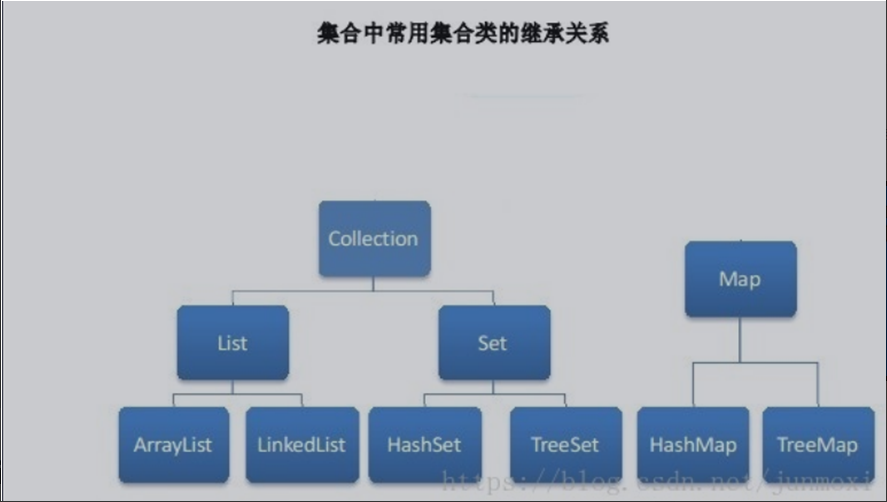

## java 集合
    
  

### List
   Java中常用的数据类型。List是有序的collection。
    
   一共有三个实现类:
        
        1.ArrayList:最常用的list实现类,内部通过数组实现,数组的缺点是每个元素之间不能有分隔，当数组的大小不能满足需要，
        需要增加存储能力，就要将已经有数组的数据复制到新的存储空间。
        优缺点:适合随机查询，不利于删除，插入。
        2.Vector:与ArrayList一样，也是通过数组来实现,不同的是它支持多线程的同步，即某一个时刻只有一个线程能够写vector，
        避免多线程同时写引起的数据不一致，当实现同步也是要很高的消费的，因此访问比ArrayList要慢。
        3.LinkedList:使用链表结构存储数据
        优缺点: 适合动态的插入,删除，查询慢
        
### Map
    
   实现类
       
       1.HashMap ：线程不安全的，基于哈希表实现。Key值和value值都可以为null 。根据键的hashcode值来存储数据，
        底层实现使用数组+链表+红黑树。
       2.HashTable ：线程安全的，基于哈希表实现。Key值和value值不能为null。是一个遗留类，不建议使用。
       通过synchronized把这个table表锁住来实现线程安全，效率十分低下。
       3.TreeMap ：线程不安全的，保存元素key-value不能为null，允许key-value重复；遍历元素时随机排列。
       红黑树实现。在需要对一个有序的key集合进行遍历的时候建议使用。
       4.synchronizedMap：它其实就是加了一个对象锁，每次操作hashmap都需要先获取这个对象锁，
       这个对象锁有加了synchronized修饰，锁性能跟hashtable差不多。
       5.ConcurrentHashMap:是线程安全的。
       6.LinkHashMap：是HashMap的一个子类，增加了一条双向链表，从而可以保存记录的插入顺序。

### Set
   Set注重独一无二的性质。无序，不重复。
   
   实现类:
        
       HashSet：基于hash表实现的，存入数据按照hash值，所以无序，不是按照我们存储的顺序来排序。
        为了保证存入的一致性，存入元素哈希值相同的时候，会使用equals方法来比较，如果不同就放在同一个哈希桶中。
       TreeSet：基于红黑树实现，支持有序操作，每增加一个对象都会进行排序，讲对象插入二叉树指定的位置。
       LinkHashSet(HashSet+LinkedHashMap):继承于HashSet,又是基于LinkedHashMap来实现的，具有hashSet的查询效率。

