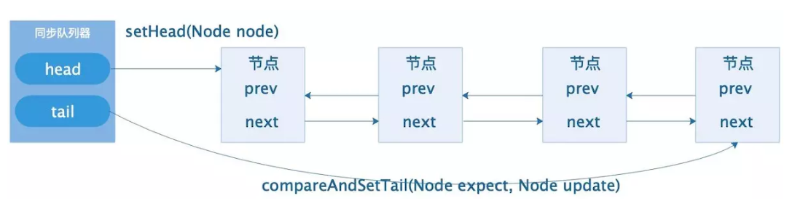
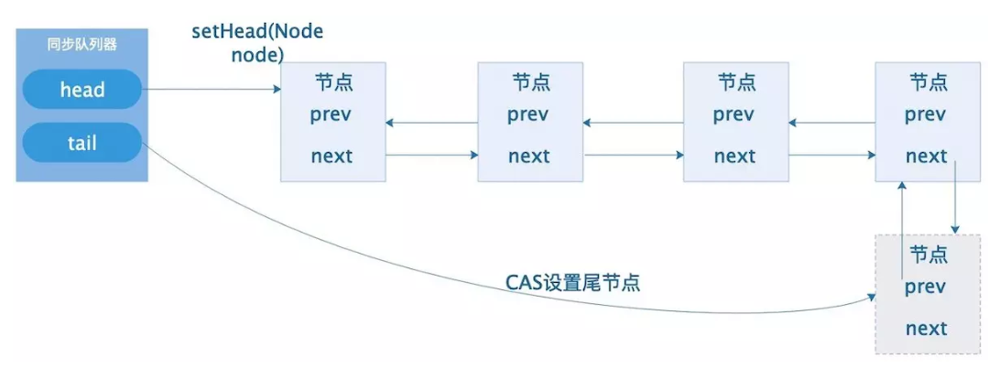
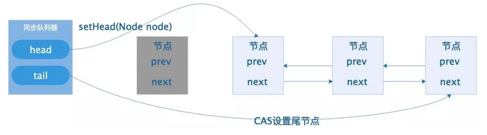
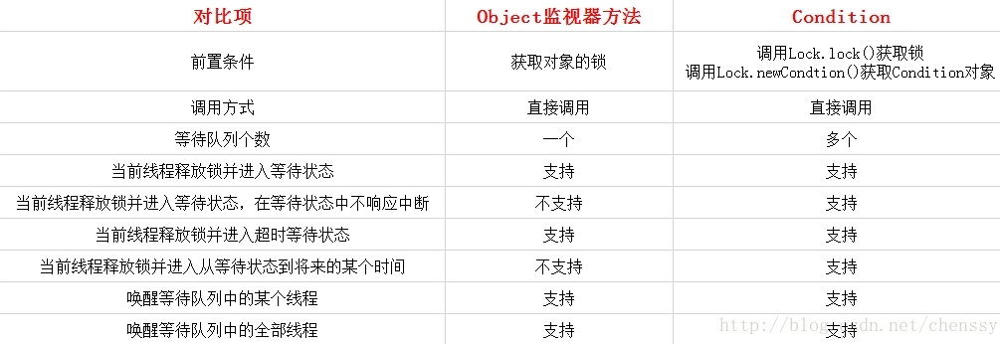
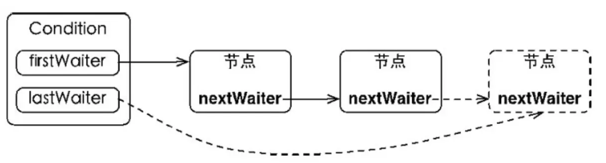
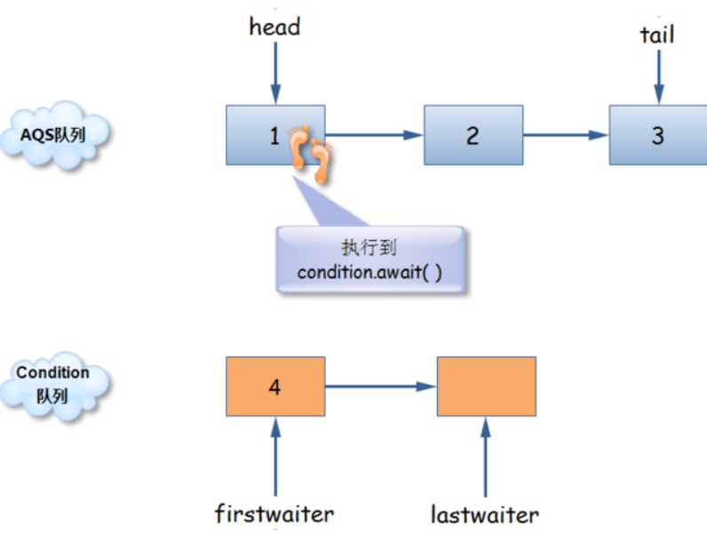
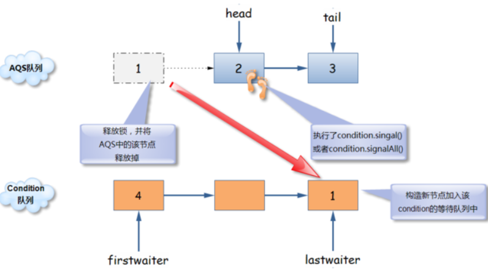
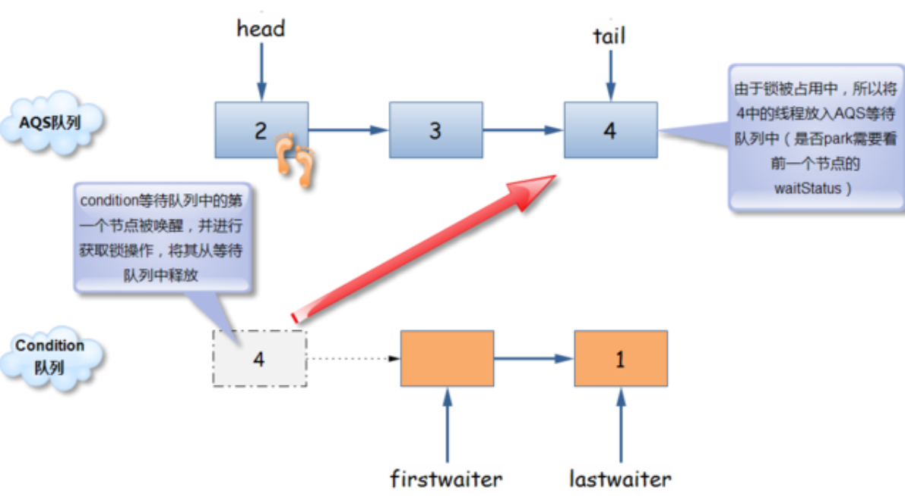

## Java线程的中断机制
    Java中断机制是一种协作机制，也就是说通过中断并不能直接终止另一个线程，而需要被中断的线程自己处理中断。
    
    API的使用：
    interrupt()： 将线程的中断标志位设置为true，不会中断线程
    isInterrupted(): 判断当前线程的中断标志位是否为true
    Thread.interrupted()：判断当前线程的中断标志位是否为true，并清除中断标志位，重置为fasle

```
    public class ThreadInterruptTest {
        static int i = 0;
        public static void main(String[] args)  {
            System.out.println("begin");
            Thread t1 = new Thread(new Runnable() {
                @Override
                public synchronized void run() {
                    while (true) {
                        i++;
                        System.out.println(i);
                        // sleep
                        // wait notify notifyAll  object monitor
    //                    try {
    //                        wait(2000);
    //                    } catch (InterruptedException e) {
    //                        e.printStackTrace();
    //                    }
    
                        //Thread.currentThread().isInterrupted();  判断标志位是否为true           不会清除中断标志位
                        //   Thread.interrupted() 判断标志位是否为true,清掉标志位，置为false        会清除中断标志位
                        if (Thread.interrupted()) {
                            System.out.println("======");
                            break;
                        }
    
                        if (i == 10) {
                           // break;
                        }
    
                    }
                }
            });
    
            t1.start();
            try {
                Thread.sleep(1000);
            } catch (InterruptedException e) {
                e.printStackTrace();
            }
    
            //  仅仅是设置一个中断标志位  interrupt flag = true
            // 唤醒 sleep,wait ，park 阻塞的线程  ，清掉标志位
            // sleep()   会被中断唤醒，抛出sleep interrupted 异常
            // wait（） & sychronized object monitor 会被中断唤醒，抛出 sleep interruptedException
            // LockSupport.park & unpark 基于Thread  等待/唤醒机制 counter= 0 阻塞 counter=1 被唤醒 ，继续执行
            t1.interrupt();
    
    
    
        }
    }
```

## Java中的锁
    在Java中，多线程的情况下需要锁来保证数据的安全，锁一般分为两类：sychronized 和 Lock。
    • sychronized利用的是指令级别的monitor-enter 和 monitor-exit。
    • Lock 使用的则是代码级别实现的。在Doug Lea大神的操刀下利用CAS + 自旋 + volatile变量实现。
    而在实现之后，并且抽象出了一个实现锁的基础类AbstractQueuedSynchronizer，通过这个类可以快速的实现符合自己要求的锁。
   
   

## AQS的内部实现
    Java并发编程的核心在于java.util.concurrent包。而juc当中大多数同步器实现都是围绕着共同的基础行为，比如等待队列、条件队列、
    独占获取、共享获取等，而这个行为的抽象就是基于AbstractQueuedSynchronizer，简称AQS。
    AQS定义了一套多线程访问共享资源的同步器框架，是一个依赖状态（state）的同步器。
 
    AQS具备特性：
    • 阻塞等待队列
    • 共享/独占
    • 公平/非公平
    • 可重入
    • 允许中断
    这些特性是怎么实现的，以ReentrantLock为例：
    • 一般通过定义内部类Sync [sɪŋk] 继承AQS
    • 将同步器所有调用都映射到Sync对应的方法
    
### AQS框架 - 管理状态
    1.AQS内部维护属性：volatile int state（32位）
        state表示资源的可用状态
    2.state三种访问方式
        getState()、setState()、compareAndSetState()
    3.AQS定义两种资源共享方式
        Exclusive 独占，只有一个线程能执行，如ReetrantLock
        Share 共享，多个线程可以同时执行，如Semaphore/CountDownLatch
    4.AQS定义两种队列
        同步等待队列 (CLH）
        条件等待队列
### 同步队列（CLH）
   CLH 同步队列是一个 FIFO 双向队列，AQS 依赖它来完成同步状态的管理：
   - 当前线程如果获取同步状态失败时，AQS则会将当前线程已经等待状态等信息构造成一个节点（Node）并将其加入到CLH同步队列，同时会阻塞当前线程
   - 当同步状态释放时，会把首节点唤醒，使其再次尝试获取同步状态。

#### Node类介绍
```
static final class Node {
    // 节点分为两种模式： 共享式和独占式
    //共享模式，资源可以同时去拿
    static final Node SHARED = new Node();
    //独占模式，只能有一个线程去拿
    static final Node EXCLUSIVE = null;

   //表示当前线程被中断了，在队列中没有任何意义，可以被剔除了
    static final int CANCELLED =  1;
    /**
     * 后继节点的线程处于等待状态，而当前节点如果释放了同步状态或者被取消，
     * 将会通知后继节点，使后继节点得以运行
     */
    static final int SIGNAL    = -1;

    /**
     * 节点在等待队列中，节点的线程等待在Condition上，当其他线程对Condition调用了signal()方法后，
     * 该节点会从等待队列中转移到同步队列中，加入到同步状态的获取中
     */
    static final int CONDITION = -2;
    /**
     * 表示下一次共享方式同步状态获取将会被无条件的传播下去
     */
    static final int PROPAGATE = -3;

    /**
     * 标记当前节点的信号量状态（1,0,-1,-2,-3）5种状态
     * 使用CAS更改状态，volatile保证线程可见性，并发场景下，
     * 即被一个线程修改后，状态会立马让其他线程可见
     */
    volatile int waitStatus;

    /**
     * 前驱节点，当前节点加入到同步队列中被设置
     */
    volatile Node prev;

    /**
     * 后继节点
     */
    volatile Node next;

    /**
     * 节点同步状态的线程
     */
    volatile Thread thread;

    /**
     * 等待队列中的后继节点，如果当前节点是共享的，那么这个字段是一个SHARED常量
     * 也就是说节点类型（独占和共享）和等待队列中的后继节点公用一个字段
     * （用在条件队列里面）
     */
    Node nextWaiter;
    }
```
   
  
  
#### 入队操作
  通过“自旋”也就是死循环的方式来保证该节点能顺利的加入到队列尾部，只有加入成功才会退出循环，否则会一直循序直到成功。 
```
private Node addWaiter(Node mode) {
// 以给定的模式来构建节点， mode有两种模式 
//  共享式SHARED， 独占式EXCLUSIVE;
  Node node = new Node(Thread.currentThread(), mode);
    // 尝试快速将该节点加入到队列的尾部
    Node pred = tail;
     if (pred != null) {
        node.prev = pred;
            if (compareAndSetTail(pred, node)) {
                pred.next = node;
                return node;
            }
        }
        // 如果快速加入失败，则通过 anq方式入列
        enq(node);
        return node;
    }

private Node enq(final Node node) {
// CAS自旋，直到加入队尾成功        
for (;;) {
    Node t = tail;
        if (t == null) { // 如果队列为空，则必须先初始化CLH队列，新建一个空节点标识作为Hader节点,并将tail 指向它
            if (compareAndSetHead(new Node()))
                tail = head;
            } else {// 正常流程，加入队列尾部
                node.prev = t;
                    if (compareAndSetTail(t, node)) {
                        t.next = node;
                        return t;
                }
            }
        }
    }
```  

 

#### 出队操作
   同步队列（CLH）遵循FIFO，首节点是获取同步状态的节点，首节点的线程释放同步状态后，将会唤醒它的后继节点（next），而后继节点将会在获取同步状态成功时将自己设置为首节点         
```
private void setHead(Node node) {
    head = node;
    node.thread = null;
    node.prev = null;
}
```
 

### Condition队列 （条件队列）
   Condition 将 Object 监视器方法（wait、notify 和 notifyAll）分解成截然不同的对象，以便通过将这些对象与任意 Lock 实现组合使用，为每个对象提供多个等待 set（wait-set）。
   其中，Lock 替代了 synchronized 方法和语句的使用，Condition 替代了 Object 监视器方法的使用。
   
   
```
// ========== 阻塞 ==========   man  pthread_cond_wait
// 造成当前线程在接到信号或被中断之前一直处于等待状态。
void await() throws InterruptedException; 
// 造成当前线程在接到信号之前一直处于等待状态。
void awaitUninterruptibly(); 
// 造成当前线程在接到信号、被中断或到达指定等待时间之前一直处于等待状态。返回值表示剩余时间，
// 如果在`nanosTimeout` 之前唤醒，那么返回值 `= nanosTimeout - 消耗时间` ，如果返回值 `<= 0` ,
//则可以认定它已经超时了。
long awaitNanos(long nanosTimeout) throws InterruptedException; 
// 造成当前线程在接到信号、被中断或到达指定等待时间之前一直处于等待状态。
boolean await(long time, TimeUnit unit) throws InterruptedException; 
// 造成当前线程在接到信号、被中断或到达指定最后期限之前一直处于等待状态。如果没有到指定时间就被通知，则返回 // true ，否则表示到了指定时间，返回返回 false 。
boolean awaitUntil(Date deadline) throws InterruptedException; 

// ========== 唤醒 ==========
// 唤醒一个等待线程。该线程从等待方法返回前必须获得与Condition相关的锁。 pthread_cond_signal
void signal(); 
// 唤醒所有等待线程。能够从等待方法返回的线程必须获得与Condition相关的锁。
void signalAll(); 
```
 AQS内部定义了ConditionObject
```
public class ConditionObject implements Condition, java.io.Serializable {    
    /** First node of condition queue. */   
    private transient Node firstWaiter; // 头节点   
    /** Last node of condition queue. */   
    private transient Node lastWaiter; // 尾节点        
    public ConditionObject() {    }    // ... 省略内部代码
}
```
 

AQS 等待队列与 Condition 队列是**两个相互独立的队列**
- `#await()` 就是在当前线程持有锁的基础上释放锁资源，并新建 Condition 节点加入到 Condition 的队列尾部，阻塞当前线程 。
- `#signal()` 就是将 Condition 的头节点移动到 AQS 等待节点尾部，让其等待再次获取锁。

#### 条件队列和同步队列的转换
   **初始化状态**：AQS等待队列有 3 个Node，Condition 队列有 1 个Node(也有可能 1 个都没有) 
   
   

  **节点1执行 Condition.await()** 
      1. 将 head 后移
      2. 释放节点 1 的锁并从 AQS 等待队列中移除
      3. 将节点 1 加入到 Condition 的等待队列中
      4. 更新 lastWaiter 为节点 1
  
    
    
  **节点 2 执行 Condition.signal() 操作** 
      1. 将 firstWaiter后移
      2. 将节点 4 移出 Condition 队列
      3. 将节点 4 加入到 AQS 的等待队列中去
      4. 更新 AQS 的等待队列的 tail
      
  
  
#### 入队操作
```
public final void await() throws InterruptedException {
    // 当前线程中断
    if (Thread.interrupted())
        throw new InterruptedException();
    //当前线程加入等待队列
    Node node = addConditionWaiter();
    //释放锁
    long savedState = fullyRelease(node);
    int interruptMode = 0;
    /**
     * 检测此节点的线程是否在同步队上，如果不在，则说明该线程还不具备竞争锁的资格，则继续等待
     * 直到检测到此节点在同步队列上
     */
    while (!isOnSyncQueue(node)) {
        //线程挂起
        LockSupport.park(this);
        //如果已经中断了，则退出
        if ((interruptMode = checkInterruptWhileWaiting(node)) != 0)
            break;
    }
    //竞争同步状态
    if (acquireQueued(node, savedState) && interruptMode != THROW_IE)
        interruptMode = REINTERRUPT;
    // 清理下条件队列中的不是在等待条件的节点
    if (node.nextWaiter != null) // clean up if cancelled
        unlinkCancelledWaiters();
    if (interruptMode != 0)
        reportInterruptAfterWait(interruptMode);
}
```
```
private Node addConditionWaiter() {
    Node t = lastWaiter;    //尾节点
    //Node的节点状态如果不为CONDITION，则表示该节点不处于等待状态，需要清除节点
    if (t != null && t.waitStatus != Node.CONDITION) {
        //清除条件队列中所有状态不为Condition的节点
        unlinkCancelledWaiters();
        t = lastWaiter;
    }
    //当前线程新建节点，状态 CONDITION
    Node node = new Node(Thread.currentThread(), Node.CONDITION);
    /**
     * 将该节点加入到条件队列中最后一个位置
     */
    if (t == null)
        firstWaiter = node;
    else
        t.nextWaiter = node;
    lastWaiter = node;
    return node;
}
```
#### 出队操作
  调用 ConditionObject的 `#signal()` 方法，将会唤醒在等待队列中等待最长时间的节点（条件队列里的首节点），在唤醒节点前，会将节点移到CLH同步队列中。 
```
public final void signal() {
    //检测当前线程是否为拥有锁的独
    if (!isHeldExclusively())
        throw new IllegalMonitorStateException();
    //头节点，唤醒条件队列中的第一个节点
    Node first = firstWaiter;
    if (first != null)
        doSignal(first);    //唤醒
}

private void doSignal(Node first) {
    do {
        //修改头结点，完成旧头结点的移出工作
        if ( (firstWaiter = first.nextWaiter) == null)
            lastWaiter = null;
        first.nextWaiter = null;
    } while (!transferForSignal(first) &&
            (first = firstWaiter) != null);
}

 final boolean transferForSignal(Node node) {
    //将该节点从状态CONDITION改变为初始状态0,
    if (!compareAndSetWaitStatus(node, Node.CONDITION, 0))
        return false;

    //将节点加入到CLH 同步队列中去，返回的是CLH 同步队列中node节点前面的一个节点
    Node p = enq(node);
    int ws = p.waitStatus;
    //如果结点p的状态为cancel 或者修改waitStatus失败，则直接唤醒
    if (ws > 0 || !compareAndSetWaitStatus(p, ws, Node.SIGNAL))
        LockSupport.unpark(node.thread);
    return true;
}
```


### ReentrantLock
  同步队列
  
```
public class ReentrantLockTest {

    private static int sum = 0;

    private static ReentrantLock lock = new ReentrantLock();

    public static void main(String[] args) {

        for (int i = 0; i < 3; i++) {
            Thread thread = new Thread(() -> {
                lock.lock(); // state=1
                for (int j = 0; j < 10000; j++) {
                    sum++;

                    //     lock.lock(); // state=2
                    // todo
                    //    lock.unlock();// state=1
                }
                lock.unlock(); // state=0
            });
            thread.start();
        }
        try {
            Thread.sleep(2000);
        } catch (InterruptedException e) {
            e.printStackTrace();
        }
        System.out.println(sum);
    }
}
```
  
  
  
  加锁解锁过程
    
  
  