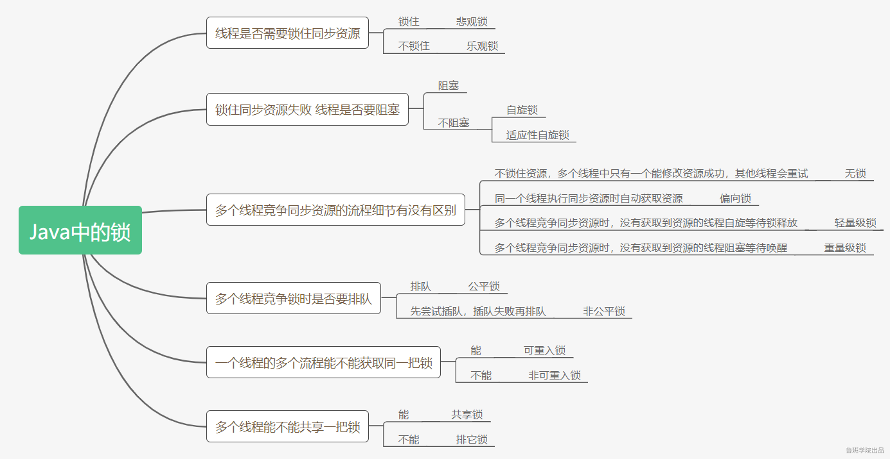
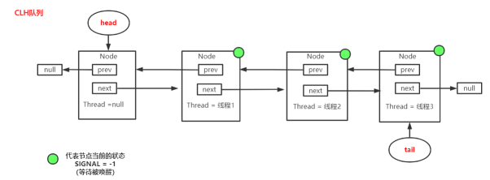
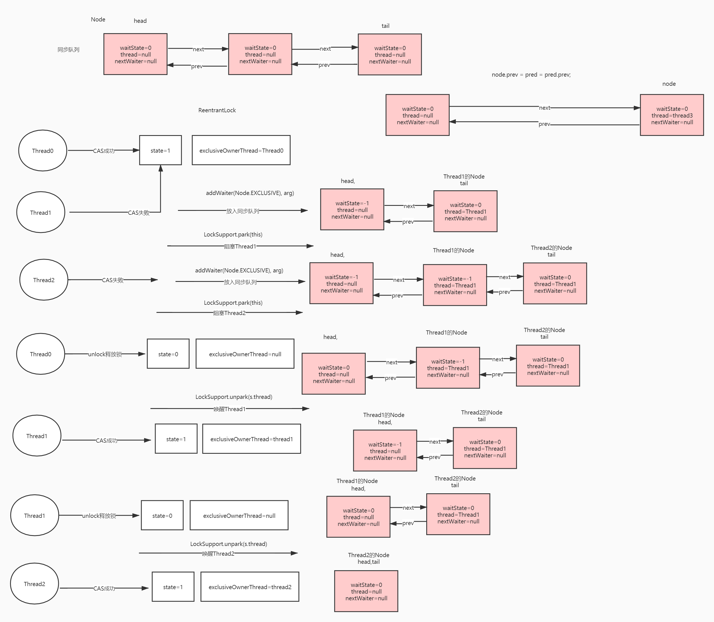
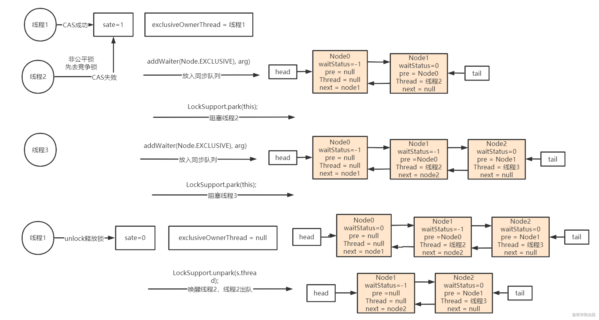

### Java线程的中断机制
    Java中断机制是一种协作机制，也就是说通过中断并不能直接终止另一个线程，而需要被中断的线程自己处理中断。
    
    API的使用：
    interrupt()： 将线程的中断标志位设置为true，不会中断线程
    isInterrupted(): 判断当前线程的中断标志位是否为true
    Thread.interrupted()：判断当前线程的中断标志位是否为true，并清除中断标志位，重置为fasle

```
    public class ThreadInterruptTest {
        static int i = 0;
        public static void main(String[] args)  {
            System.out.println("begin");
            Thread t1 = new Thread(new Runnable() {
                @Override
                public synchronized void run() {
                    while (true) {
                        i++;
                        System.out.println(i);
                        // sleep
                        // wait notify notifyAll  object monitor
    //                    try {
    //                        wait(2000);
    //                    } catch (InterruptedException e) {
    //                        e.printStackTrace();
    //                    }
    
                        //Thread.currentThread().isInterrupted();  判断标志位是否为true           不会清除中断标志位
                        //   Thread.interrupted() 判断标志位是否为true,清掉标志位，置为false        会清除中断标志位
                        if (Thread.interrupted()) {
                            System.out.println("======");
                            break;
                        }
    
                        if (i == 10) {
                           // break;
                        }
    
                    }
                }
            });
    
            t1.start();
            try {
                Thread.sleep(1000);
            } catch (InterruptedException e) {
                e.printStackTrace();
            }
    
            //  仅仅是设置一个中断标志位  interrupt flag = true
            // 唤醒 sleep,wait ，park 阻塞的线程  ，清掉标志位
            // sleep()   会被中断唤醒，抛出sleep interrupted 异常
            // wait（） & sychronized object monitor 会被中断唤醒，抛出 sleep interruptedException
            // LockSupport.park & unpark 基于Thread  等待/唤醒机制 counter= 0 阻塞 counter=1 被唤醒 ，继续执行
            t1.interrupt();
    
    
    
        }
    }
```

### Java中的锁
    在Java中，多线程的情况下需要锁来保证数据的安全，锁一般分为两类：sychronized 和 Lock。
    • sychronized利用的是指令级别的monitor-enter 和 monitor-exit。
    • Lock 使用的则是代码级别实现的。在Doug Lea大神的操刀下利用CAS + 自旋 + volatile变量实现。
    而在实现之后，并且抽象出了一个实现锁的基础类AbstractQueuedSynchronizer，通过这个类可以快速的实现符合自己要求的锁。
   
   

### AQS的内部实现
    Java并发编程的核心在于java.util.concurrent包。而juc当中大多数同步器实现都是围绕着共同的基础行为，比如等待队列、条件队列、
    独占获取、共享获取等，而这个行为的抽象就是基于AbstractQueuedSynchronizer，简称AQS。
    AQS定义了一套多线程访问共享资源的同步器框架，是一个依赖状态（state）的同步器。
 
    AQS具备特性：
    • 阻塞等待队列
    • 共享/独占
    • 公平/非公平
    • 可重入
    • 允许中断
    这些特性是怎么实现的，以ReentrantLock为例：
    • 一般通过定义内部类Sync [sɪŋk] 继承AQS
    • 将同步器所有调用都映射到Sync对应的方法
    
 ### AQS框架 - 管理状态
    1.AQS内部维护属性：volatile int state（32位）
        state表示资源的可用状态
    2.state三种访问方式
        getState()、setState()、compareAndSetState()
    3.AQS定义两种资源共享方式
        Exclusive 独占，只有一个线程能执行，如ReetrantLock
        Share 共享，多个线程可以同时执行，如Semaphore/CountDownLatch
    4.AQS定义两种队列
        同步等待队列
        条件等待队列
### Node类介绍
```
static final class Node {
    //共享模式，资源可以同时去拿
    static final Node SHARED = new Node();
    //独占模式，只能有一个线程去拿
    static final Node EXCLUSIVE = null;

   //表示当前线程被中断了，在队列中没有任何意义，可以被剔除了
    static final int CANCELLED =  1;
    /**
     * 后继节点的线程处于等待状态，而当前节点如果释放了同步状态或者被取消，
     * 将会通知后继节点，使后继节点得以运行
     */
    static final int SIGNAL    = -1;

    /**
     * 节点在等待队列中，节点的线程等待在Condition上，当其他线程对Condition调用了signal()方法后，
     * 该节点会从等待队列中转移到同步队列中，加入到同步状态的获取中
     */
    static final int CONDITION = -2;
    /**
     * 表示下一次共享方式同步状态获取将会被无条件的传播下去
     */
    static final int PROPAGATE = -3;

    /**
     * 标记当前节点的信号量状态（1,0,-1,-2,-3）5种状态
     * 使用CAS更改状态，volatile保证线程可见性，并发场景下，
     * 即被一个线程修改后，状态会立马让其他线程可见
     */
    volatile int waitStatus;

    /**
     * 前驱节点，当前节点加入到同步队列中被设置
     */
    volatile Node prev;

    /**
     * 后继节点
     */
    volatile Node next;

    /**
     * 节点同步状态的线程
     */
    volatile Thread thread;

    /**
     * 等待队列中的后继节点，如果当前节点是共享的，那么这个字段是一个SHARED常量
     * 也就是说节点类型（独占和共享）和等待队列中的后继节点公用一个字段
     * （用在条件队列里面）
     */
    Node nextWaiter;
    }
```

### ReentrantLock
  同步队列
  
```
public class ReentrantLockTest {

    private static int sum = 0;

    private static ReentrantLock lock = new ReentrantLock();

    public static void main(String[] args) {

        for (int i = 0; i < 3; i++) {
            Thread thread = new Thread(() -> {
                lock.lock(); // state=1
                for (int j = 0; j < 10000; j++) {
                    sum++;

                    //     lock.lock(); // state=2
                    // todo
                    //    lock.unlock();// state=1
                }
                lock.unlock(); // state=0
            });
            thread.start();
        }
        try {
            Thread.sleep(2000);
        } catch (InterruptedException e) {
            e.printStackTrace();
        }
        System.out.println(sum);
    }
}
```
  
  
  
  加锁解锁过程
    
  
  