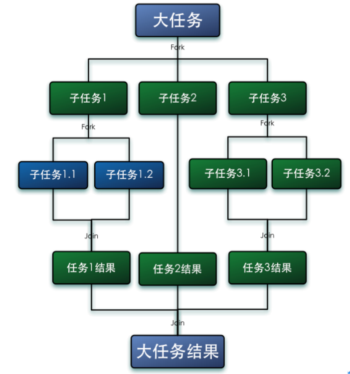
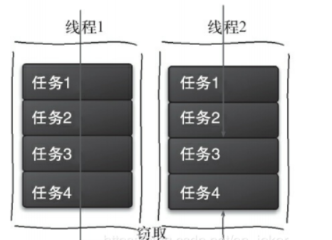
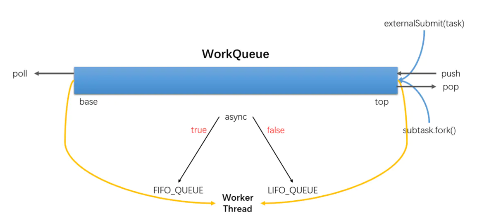
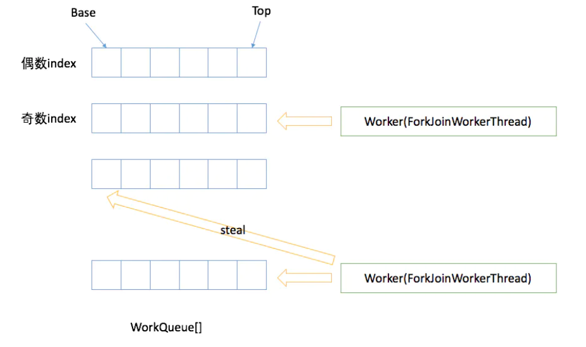
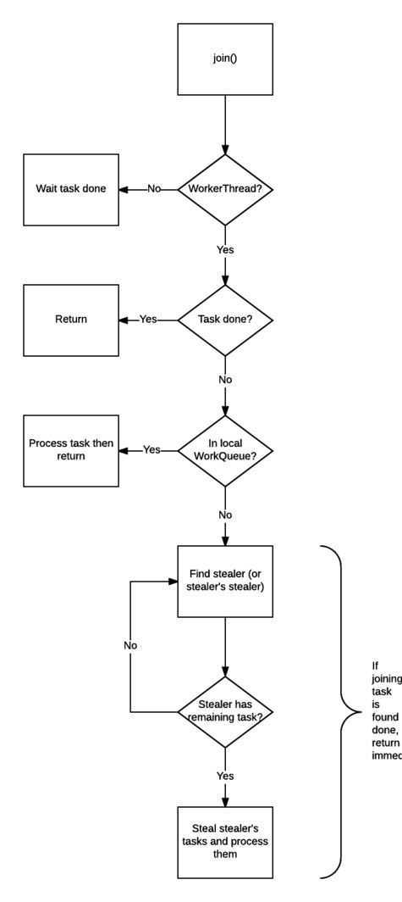
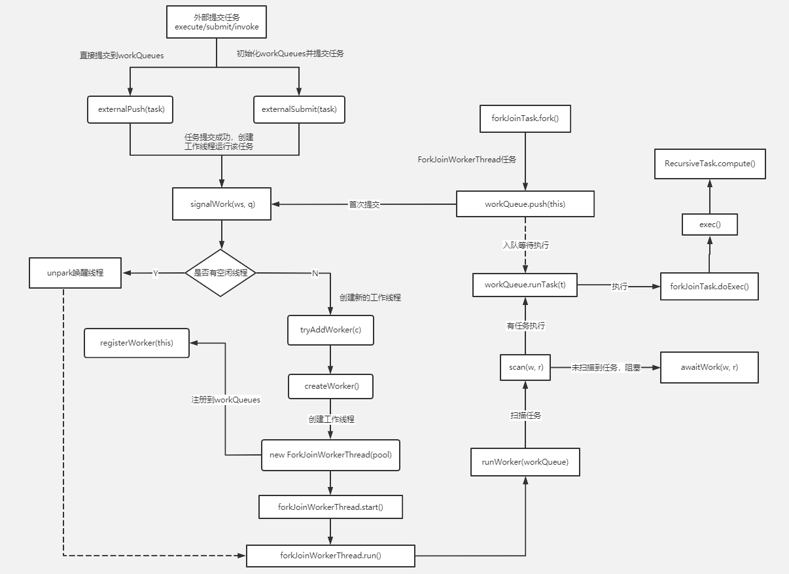

## 任务类型

### CPU密集型（CPU-bound）
   
    CPU密集型也叫计算密集型，指的是系统的硬盘、内存性能相对CPU要好很多，此时，系统运作大部分的状况是CPU Loading 100%，CPU要读/写I/O(硬盘/内存)，I/O在很短的时间就可以完成，
    而CPU还有许多运算要处理，CPU Loading很高。在多重程序系统中，大部份时间用来做计算、逻辑判断等CPU动作的程序称之CPUbound。例如一个计算圆周率至小数点一千位以下的程序，
    在执行的过程当中绝大部份时间用在三角函数和开根号的计算，便是属于CPU bound的程序。CPU bound的程序一般而言CPU占用率相当高。这可能是因为任务本身不太需要访问I/O设备，
    也可能是因为程序是多线程实现因此屏蔽掉了等待I/O的时间。
    线程数一般设置为：
    线程数 = CPU核数+1 
### IO密集型（I/O bound）
    
    IO密集型指的是系统的CPU性能相对硬盘、内存要好很多，此时，系统运作，大部分的状况是CPU在等I/O (硬盘/内存) 的读/写操作，此时CPU Loading并不高。
    I/O bound的程序一般在达到性能极限时，CPU占用率仍然较低。这可能是因为任务本身需要大量I/O操作，而pipeline做得不是很好，没有充分利用处理器能力。
    线程数一般设置为： 
    线程数 = （（线程等待时间+线程CPU运行时间）/线程CPU运行时间 ）* CPU核数

### CPU密集型 vs IO密集型
    
    我们可以把任务分为计算密集型和IO密集型。
    计算密集型任务的特点是要进行大量的计算，消耗CPU资源，比如计算圆周率、对视频进行高清解码等等，全靠CPU的运算能力。这种计算密集型任务虽然也可以用多任务完成，
    但是任务越多，花在任务切换的时间就越多，CPU执行任务的效率就越低，所以，要最高效地利用CPU，计算密集型任务同时进行的数量应当等于CPU的核心数。
    计算密集型任务由于主要消耗CPU资源，因此，代码运行效率至关重要。Python这样的脚本语言运行效率很低，完全不适合计算密集型任务。对于计算密集型任务，最好用C语言编写。
    第二种任务的类型是IO密集型，涉及到网络、磁盘IO的任务都是IO密集型任务，这类任务的特点是CPU消耗很少，任务的大部分时间都在等待IO操作完成（因为IO的速度远远低于CPU和内存的速度）。
    对于IO密集型任务，任务越多，CPU效率越高，但也有一个限度。常见的大部分任务都是IO密集型任务，比如Web应用。IO密集型任务执行期间，99%的时间都花在IO上，花在CPU上的时间很少，
    因此，用运行速度极快的C语言替换用Python这样运行速度极低的脚本语言，完全无法提升运行效率。对于IO密集型任务，最合适的语言就是开发效率最高（代码量最少）的语言，脚本语言是首选，C语言最差。  
    
### Fork-Join框架
#### 定义和特性
     
     Fork-Join 框架是 Java7 提供了的一个用于并行执行任务的框架， 是一个把大任务分割成若干个小任务，最终汇总每个小任务结果后得到大任务结果的框架。
     Fork 就是把一个大任务切分为若干子任务并行的执行，Join 就是合并这些子任务的执行结果，最后得到这个大任务的结果。比如计算1+2+.....＋10000，
     可以分割成 10 个子任务，每个子任务分别对 1000 个数进行求和，最终汇总这 10 个子任务的结果。如下图所示：  
  
  
  
  Fork-Jion特性:
  
    1. ForkJoinPool 不是为了替代 ExecutorService，而是它的补充，在某些应用场景下性能比 ExecutorService 更好。
    2. ForkJoinPool 主要用于实现“分而治之”的算法，特别是分治之后递归调用的函数，例如 quick sort 等。
    3. ForkJoinPool 最适合的是计算密集型的任务，如果存在 I/O，线程间同步，sleep() 等会造成线程长时间阻塞的情况时，
    最好配合使用 ManagedBlocker。  
#### 工作窃取算法
    
    ForkJoin 框架的核心在于轻量级调度机制，使用了 **工作窃取（Work-Stealing）**所采用的基本调度策略。
    
    工作窃取（work-stealing）算法是指某个线程从其他队列里窃取任务来执行。我们需要做一个比较大的任务，我们可以把这个任务分割为若干互不依赖的子任务，为了减少线程间的竞争，
    于是把这些子任务分别放到不同的队列里，并为每个队列创建一个单独的线程来执行队列里的任务，线程和队列一一对应，比如A线程负责处理A队列里的任务。
    但是有的线程会先把自己队列里的任务干完，而其他线程对应的队列里还有任务等待处理。干完活的线程与其等着，不如去帮其他线程干活，于是它就去其他线程的队列里窃取一个任务来执行。
    而在这时它们会访问同一个队列，所以为了减少窃取任务线程和被窃取任务线程之间的竞争，通常会使用双端队列，被窃取任务线程永远从双端队列的top拿任务执行，
    而窃取任务的线程永远从双端队列的base拿任务执行。
   
   工作窃取的运行流程如下图所示 ：
   
   
   
   - 工作窃取算法的优点是充分利用线程进行并行计算，并减少了线程间的竞争，
   - 工作窃取算法缺点是在某些情况下还是存在竞争，比如双端队列里只有一个任务时。并且消耗了更多的系统资源，比如创建多个线程和多个双端队列。

#### 工作原理
      
      1. ForkJoinPool 的每个工作线程都维护着一个工作队列（WorkQueue），这是一个双端队列（Deque），里面存放的对象是任务（ForkJoinTask）。
      2. 每个工作线程在运行中产生新的任务（通常是因为调用了 fork()）时，会放入工作队列的top，并且工作线程在处理自己的工作队列时，使用的是 LIFO 方式，
      也就是说每次从top取出任务来执行。
      3. 每个工作线程在处理自己的工作队列同时，会尝试窃取一个任务（或是来自于刚刚提交到 pool 的任务，或是来自于其他工作线程的工作队列），
      窃取的任务位于其他线程的工作队列的队首，也就是说工作线程在窃取其他工作线程的任务时，使用的是FIFO 方式。
      4. 在遇到 join() 时，如果需要 join 的任务尚未完成，则会先处理其他任务，并等待其完成。
      5. 在既没有自己的任务，也没有可以窃取的任务时，进入休眠 。   
  
  ForkJoinPool:
  
        ForkJoinPool 是用于执行 ForkJoinTask 任务的执行池，不再是传统执行池 Worker+Queue 的组合式，而是维护了一个队列数组 WorkQueue（WorkQueue[]），
        这样在提交任务和线程任务的时候大幅度减少碰撞。
  
  WorkQueue:
        
        - WorkQueue 是双向列表，用于任务的有序执行，如果 WorkQueue 用于自己的执行线程 Thread，线程默认将会从尾端选取任务用来执行 LIFO。
        - 每个 ForkJoinWorkThread 都有属于自己的 WorkQueue，但不是每个 WorkQueue 都有对应的 ForkJoinWorkThread。
        - 没有 ForkJoinWorkThread 的 WorkQueue 保存的是 submission，来自外部提交，在WorkQueue[] 的下标是 **偶数** 位。
  
  
  
  ForkJoinWorkThread:
        
        ForkJoinWorkThread 是用于执行任务的线程，用于区别使用非 ForkJoinWorkThread 线程提交task。
        启动一个该 Thread，会自动注册一个 WorkQueue 到 Pool，拥有 Thread 的 WorkQueue 只能出现在 WorkQueue[] 的 **奇数** 位。
  
  
  
  ForkJoinTask:
        
        ForkJoinTask 是任务，它比传统的任务更加轻量，不再是 Runnable 的子类，提供 Fork/Join 方法用于分割任务以及聚合结果。
  
  fork 方法:
        
        `fork()` 做的工作只有一件事，既是把任务推入当前工作线程的工作队列里。
```
public final ForkJoinTask<V> fork() {
    Thread t;
    if ((t = Thread.currentThread()) instanceof ForkJoinWorkerThread)
        ((ForkJoinWorkerThread)t).workQueue.push(this);
    else
        ForkJoinPool.common.externalPush(this);
    return this;
}
```
   join 方法:
        
        `join()` 的工作则复杂得多，也是它可以使得线程免于被阻塞的原因。 
        检查调用 `join()` 的线程是否是 ForkJoinThread 线程。如果不是（例如 main 线程），则阻塞当前线程，等待任务完成。如果是，则不阻塞。
        查看任务的完成状态，如果已经完成，直接返回结果。
        如果任务尚未完成，但处于自己的工作队列内，则完成它。
        如果任务已经被其他的工作线程偷走，则窃取这个小偷的工作队列内的任务（以 FIFO 方式）执行，以期帮助它早日完成预 join 的任务。
        如果偷走任务的小偷也已经把自己的任务全部做完，正在等待需要 Join 的任务时，则找到小偷的小偷，帮助它完成它的任务。
        递归地执行第 5 步。
   
   
####  ForkJoin原理图
   
   
        
