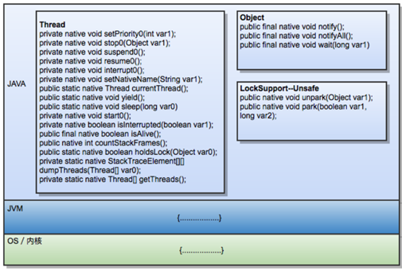
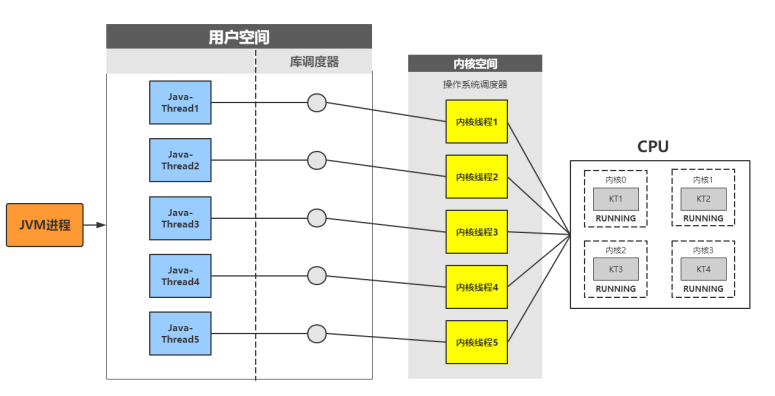
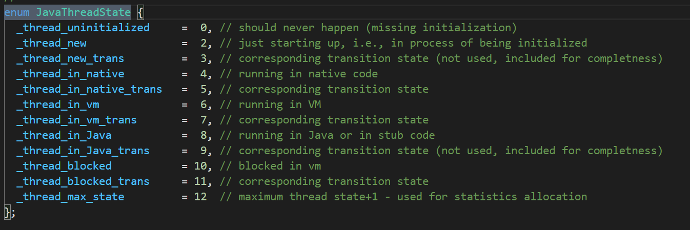
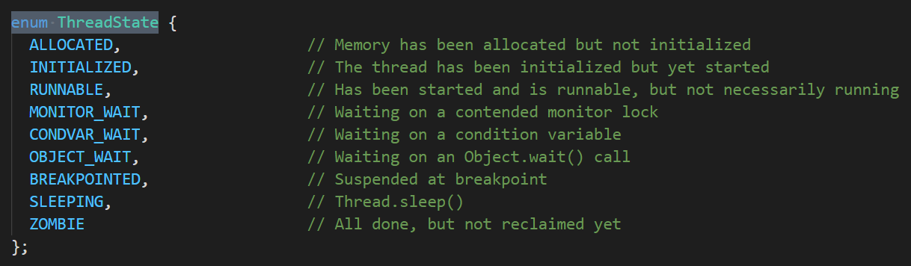
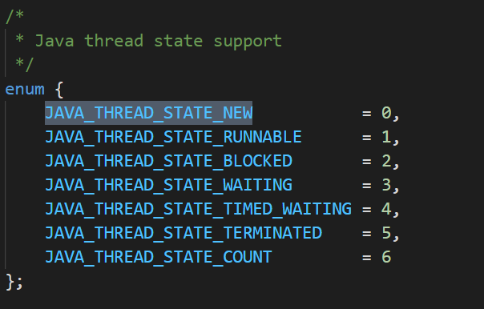
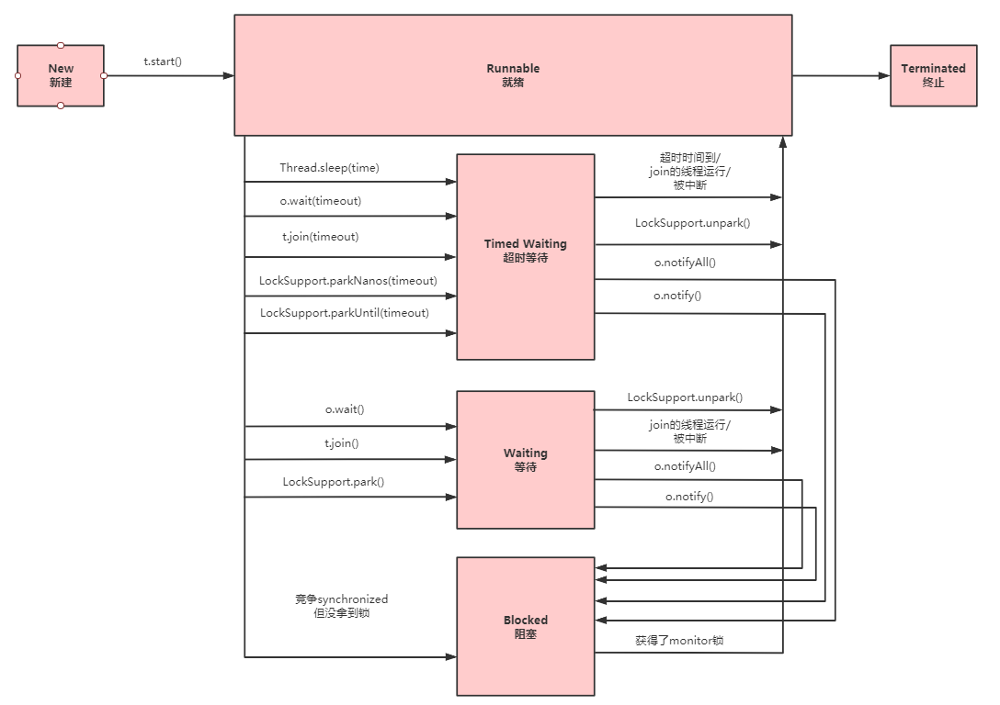

### JVM线程调度
    JVM线程调度：依赖JVM内部实现，主要是Native thread scheduling，是依赖操作系统的，所以java也不能完全是跨平台独立的，对线程调度处理非常敏感的业务开发必须关注底层操作系统的线程调度差异。
    Green Thread Schedule 或者叫用户级线程（User Level Thread，ULT）：操作系统内核不知道应用线程的存在。
    Native thread scheduling 或者 内核级线程（Kernel Level Thread ，KLT）：它们是依赖于内核的，即无论是用户进程中的线程，还是系统进程中的线程，它们的创建、撤消、切换都由内核实现。

 
 
 Java线程与内核线程关系
       
    
    java.lang.Thread: 这个是Java语言里的线程类，由这个Java类创建的instance都会 1:1 映射到一个操作系统的osthread
    
    JavaThread: JVM中C++定义的类，一个JavaThread的instance代表了在JVM中的java.lang.Thread的instance, 它维护了线程的状态，并且维护一个指针指向java.lang.Thread创建的对象(oop)。它同时还维护了一个指针指向对应的OSThread，来获取底层操作系统创建的osthread的状态
    
    OSThread: JVM中C++定义的类，代表了JVM中对底层操作系统的osthread的抽象，它维护着实际操作系统创建的线程句柄handle，可以获取底层osthread的状态
    
    VMThread: JVM中C++定义的类，这个类和用户创建的线程无关，是JVM本身用来进行虚拟机操作的线程，比如GC。


### 拓展
    内核线程：由操作系统内核创建和撤销，内核维护进程及线程的上下文信息以及线程的切换，一个内核线程由于I/O操作而阻塞，
            不会影响其他线程的运行，windows NT和2000 支持内核线程。
    用户线程：由应用进程利用线程库创建和管理，不依赖操作系统的核心，不需要用户态/内核态的切换，速度快，操作系统内核不知道
            多线程的存在，因此一个线程阻塞将使得整个进程(包括它的所有的线程)阻塞，由于这里的处理器时间片分配是以进程为基本单位的。
            所以每个线程执行的时间相对减少。
    对于NPTL的一些介绍：
    POSIX Thread Library (NPTL)使Linux内核可以非常有效的运行使用POSIX线程标准写的程序。
    这里有一个测试数据，在32位机下，NPTL成功启动100000个线程只用了2秒，而不使用NPTL将需要大约15分钟左右的时间。
 
### Thread#start() 源码分析
   源码分析.jpg)  
    

### 线程的创建
 
 **JAVA中创建线程有1种方式**
 1. new Thread()
   
 **JAVA中线程的运行(实现)方式**
 
 1. 继承Thread类，重写run方法
 2. 实现Runnable接口，重写run方法，实现Runnable接口的实现类的实例对象作为Thread构造函数的target
 3. 通过Callable和FutureTask创建线程 
 4. 通过线程池创建线程
 
 前面两种可以归结为一类：无返回值，原因很简单，通过重写run方法，run方式的返回值是void，所以没有办法返回结果。
 后面两种可以归结成一类：有返回值，通过Callable接口，就要实现call方法，这个方法的返回值是Object，所以返回的结果可以放在Object对象中。
  
 **JVM中创建线程有2种方式**
 1. new java.lang.Thread().start()
 2. 使用JNI将一个native thread attach到JVM中
 
 针对 new java.lang.Thread().start()这种方式，只有调用start()方法的时候，才会真正的在JVM中去创建线程，主要的生命周期步骤有：
 
 1. 创建对应的JavaThread的instance
 2. 创建对应的OSThread的instance
 3. 创建实际的底层操作系统的native thread
 4. 准备相应的JVM状态，比如ThreadLocal存储空间分配等
 5. 底层的native thread开始运行，调用java.lang.Thread生成的Object的run()方法
 6. 当java.lang.Thread生成的Object的run()方法执行完毕返回后,或者抛出异常终止后，
 终止native thread
 
 针对JNI将一个native thread attach到JVM中，主要的步骤有： 
 
 1. 通过JNI call AttachCurrentThread申请连接到执行的JVM实例
 2. JVM创建相应的JavaThread和OSThread对象
 3. 创建相应的java.lang.Thread的对象
 4. 一旦java.lang.Thread的Object创建之后，JNI就可以调用Java代码了
 5. 当通过JNI call DetachCurrentThread之后，JNI就从JVM实例中断开连接
 6. JVM清除相应的JavaThread, OSThread, java.lang.Thread对象  
 
### 线程的状态
 
 **从JVM的角度来看待线程状态的状态**有以下几种:  
 
 globalDefinitions.hpp
 
 
 
 其中主要的状态是这5种:
 
 **_thread_new**: 新创建的线程
 
 **_thread_in_Java**: 在运行Java代码
 
 **_thread_in_vm**: 在运行JVM本身的代码
 
 **_thread_in_native**: 在运行native代码
 
 **_thread_blocked**: 线程被阻塞了，包括等待一个锁，等待一个条件，sleep，执行一个阻塞的IO等
 
 
 
 **从OSThread的角度**，JVM还定义了一些线程状态给外部使用，比如用jstack输出的线程堆栈信息中线程的状态:
 
 osThread.hpp
 
 
 
 比较常见有:
 
 **Runnable**: 可以运行或者正在运行的
 
 **MONITOR_WAIT**: 等待锁
 
 **OBJECT_WAIT**: 执行了Object.wait()之后在条件队列中等待的
 
 **SLEEPING**: 执行了Thread.sleep()的
 
 
 
 **从JavaThread的角度**，JVM定义了一些针对Java Thread对象的状态，基本类似，多了一个TIMED_WAITING的状态，用来表示定时阻塞的状态  
 
 jvm.h
 
 
 
 
 **JVM内部的VM Threads**，主要有几类:
 
 ```markdown
 VMThread: 执行JVM本身的操作
 
 Periodic task thread: JVM内部执行定时任务的线程
 
 GC threads: GC相关的线程，比如单线程/多线程的GC收集器使用的线程
 
 Compiler threads: JIT用来动态编译的线程
 
 Signal dispatcher thread: Java解释器Interceptor用来辅助safepoint操作的线程
 ```
 
### 线程生命周期
 
 java.lang.Thread.State
 
 ```java
 public enum State {
 
         NEW,
 
         RUNNABLE,
 
         BLOCKED,
 
         WAITING,
 
         TIMED_WAITING,
 
         TERMINATED;
 }
 ```
 
 
 
