#### 多线程编程：（并发编程的本质）
    分工: 任务拆解
    同步: 线程间协作
    互斥: 独占

####  并发如何去学？
1. JMM 模型   JAVA 线程的内存模式。（cpu缓存一致性协议 volatile  CAS）  
   并发的特性：原子性， 有序性，可见性 
2. 锁机制 内置锁（synchronized） juc（AQS 独占锁 共享锁 读写锁 等） 同步器 （队列 同步队列 条件队列）
3. 线程  是重量级线程   pthread_create (操作系统内核)   JavaThread ---- osThread  ----- nativeThread (系统底层)
4. 线程池 --线程复用（降低线程创建销毁的开销）
5. 并发容器
6. 并行 fork-join   物理架构   同一时刻，多条指令在多个处理器上同时执行，无论是微观还是宏观都是一起执行
7. 并发             逻辑架构   同一时刻，只能有一条指令执行，但多个进程指令快速轮转执行，使得在宏观上是多个进程同时执行的效果，微观上并不是同时执行的，可以在一个核执行，也可以在多个核执行

### 并发编程优势: 并发可以将多核cpu 的计算能力发挥到极致，提升性能
并发编程的风险：
1. 高并发场景下，频繁上下文切换反而损耗性能
2. 活跃性（一个并发应用程序能及时执行的能力）问题，容易出现死锁 ，饥饿（while），活锁
    死锁的四个条件 （互斥，请求与保持，不可剥夺，循环等待）都满足也不一定发生死锁 -- 互相等（阻塞）-- 出现情况 lock
    饥饿 常见场景  有  while(true){}  情况下  
    活锁   -- 互相让 （没有阻塞，但是一直在彼此相让，做无用功）  -- 出现情况 try lock 但是场景少
3. 线程安全，多个线程共享数据时可能会产生与期望不相符的结果 

### 计算机组成原理

现代计算机硬件原理图

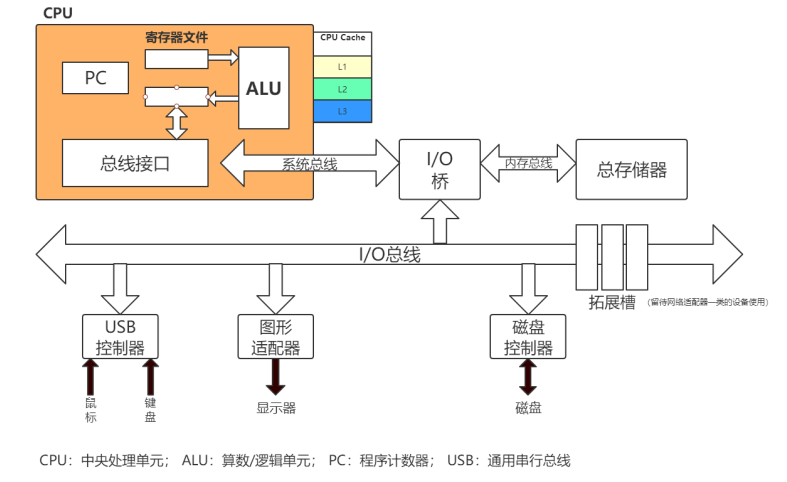

冯·诺依曼计算机的特点

1. 计算机由运算器、存储器、控制器、输入设备和输出设备五大部件组成
2. 指令(程序)和数据以二进制不加区别地存储在存储器中
3. 程序自动运行

运算器和控制器封装到一起，加上寄存器组和cpu内部总线构成中央处理器（CPU）。cpu的根本任务，就是执行指令，对计算机来说，都是0，1组成的序列，cpu从逻辑上可以划分为3个模块：控制单元、运算单元和存储单元。这三个部分由cpu总线连接起来。 

cpu原理图

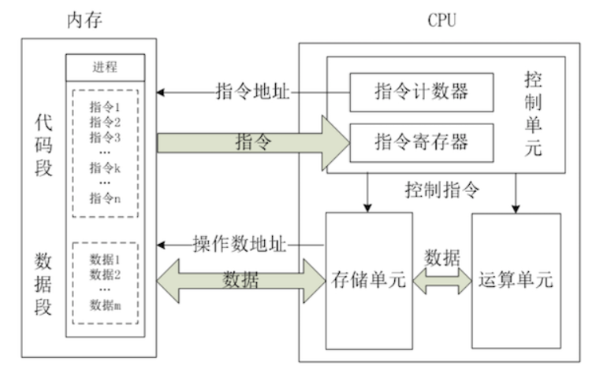

CPU的运行原理就是：控制单元在时序脉冲的作用下，将指令计数器里所指向的指令地址(这个地址是在内存里的)送到地址总线上去，然后CPU将这个地址里的指令读到指令寄存器进行译码。对于执行指令过程中所需要用到的数据，会将数据地址也送到地址总线，然后CPU把数据读到CPU的内部存储单元(就是内部寄存器)暂存起来，最后命令运算单元对数据进行处理加工。周而复始，一直这样执行下去。 


### CPU缓存架构

**多cup** ： 多个物理CPU，CPU通过总线进行通信，效率比较低。  多cpu的运行，对应进程的运行状态 。

**多核cup**： 不同的核可以通过L3 cache进行通信，存储和外设通过总线与CPU通信 。 多核cpu的运行，对应线程的运行状态。 

**CPU寄存器**：每个CPU都包含一系列的寄存器，它们是CPU内内存的基础。CPU在寄存器上执行操作的速度远大于在主存上执行的速度。这是因为CPU访问寄存器的速度远大于主存。
**CPU缓存**：即高速缓冲存储器，是位于CPU与主内存间的一种容量较小但速度很高的存储器。由于CPU的速度远高于主内存，CPU直接从内存中存取数据要等待一定时间周期，Cache中保存着CPU刚用过或循环使用的一部分数据，当CPU再次使用该部分数据时可从Cache中直接调用,减少CPU的等待时间，提高了系统的效率。

**内存** ： 一个计算机还包含一个主存，所有的CPU都可以访问主存。主存通常比CPU中的缓存大得多。

多cpu和多核cup架构图：  

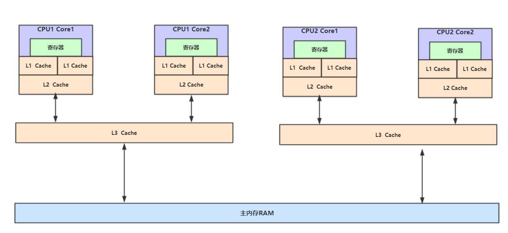

**缓存一致性问题**
在多处理器系统中，每个处理器都有自己的高速缓存，而它们又共享同一主内存（MainMemory）。基于高速缓存的存储交互很好地解决了处理器与内存的速度矛盾，但是也引入了新的问题：缓存一致性（CacheCoherence）。当多个处理器的运算任务都涉及同一块主内存区域时，将可能导致各自的缓存数据不一致的情况，如果真的发生这种情况，那同步回到主内存时以谁的缓存数据为准呢？为了解决一致性的问题，需要各个处理器访问缓存时都遵循一些协议，在读写时要根据协议来进行操作，这类协议有MSI、
MESI（IllinoisProtocol）、MOSI、Synapse、Firefly及DragonProtocol  等等。

### 进程和线程

进程是程序的一次执行，一个程序有至少一个进程，是**资源分配的最小单位**，资源分配包括cpu、内存、磁盘IO等。线程是**程序执行的最小单位**,**CPU调度的基本单元**，一个进程有至少一个线程。

（1）进程是资源的分配和调度的一个独立单元，而线程是CPU调度的基本单元
（2）同一个进程中可以包括多个线程，并且线程共享整个进程的资源（寄存器、堆栈、上下文），一个进程至少包括一个线程。
（3）进程的创建调用fork或者vfork，而线程的创建调用pthread_create，进程结束后它拥有的所有线程都将销毁，而线程的结束不会影响同个进程中的其他线程的结束
（4）线程是轻量级的进程，它的创建和销毁所需要的时间比进程小很多，所有操作系统中的执行功能都是创建线程去完成的
（5）线程中执行时一般都要进行同步和互斥，因为他们共享同一进程的所有资源
（6）线程有自己的私有属性线程控制块TCB，线程id，寄存器、上下文，而进程也有自己的私有属性进程控制块PCB，这些私有属性是不被共享的，用来标示一个进程或一个线程的标志

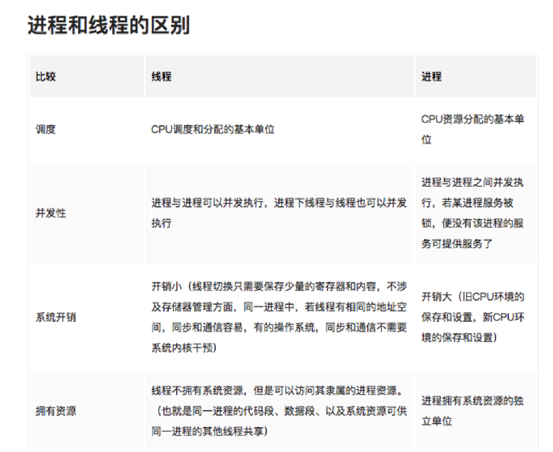

### 并发和并行

目标都是最大化CPU的使用率

**并行(parallel)**：指在同一时刻，有多条指令在多个处理器上同时执行。所以无论从微观还是从宏观来看，二者都是一起执行的。

  


 **并发(concurrency)**：指在同一时刻只能有一条指令执行，但多个进程指令被快速的轮换执行，使得在宏观上具有多个进程同时执行的效果，但在微观上并不是同时执行的，只是把时间分成若干段，使多个进程快速交替的执行。 

  

 并行在多处理器系统中存在，而并发可以在单处理器和多处理器系统中都存在，并发能够在单处理器系统中存在是因为并发是并行的假象，并行要求程序能够同时执行多个操作，而并发只是要求程序假装同时执行多个操作（每个小时间片执行一个操作，多个操作快速切换执行） 


### 线程上下文切换

线程上下文的切换巧妙的利用了**时间片轮转**的方式，CPU给每个任务都服务一定的时间，然后把当前任务的状态保存下来，在加载下一任务的状态后，继续服务下一个任务；**线程状态的保存及其再加载，就是线程的上下文切换**。时间片轮询保证CPU的利用率。

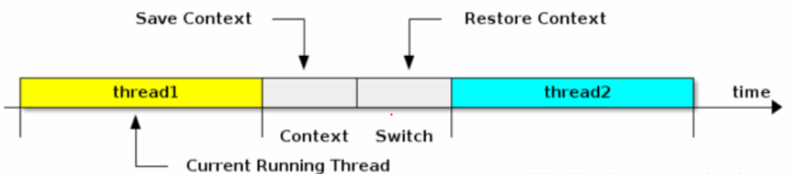

**上下文**：是指在某一时间CPU寄存器和程序计数器的内容；

**寄存器**：是CPU内部数量少但是速度很快的内存。寄存器通常对常用值的快速访问来提高计算机程序运行的速度；

**程序计数器**：是一个专门的寄存器，用于存放下一条指令所在单元的地址的地方。当执行一条指令时，首先需要根据PC中存放的指令地址，将指令由内存取到指令寄存器中，此过程称为“取指令”

**上下文切换的活动**：
a.挂起一个线程，将这个进程在CPU中的状态存储于内存中的某处；
b.在内存中检索下一个进程的上下文并将其CPU的寄存器恢复；
c.跳转到程序计数器所指定的位置；


### 编译原理

 在编译原理中, 将源代码编译成机器码, 主要经过下面几个步骤: 

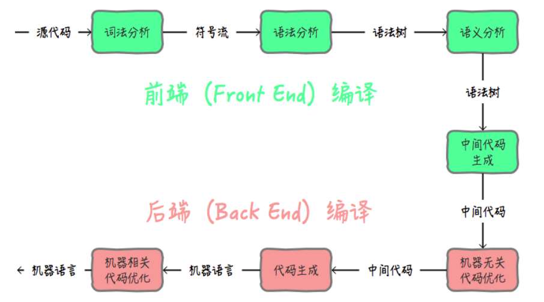

在Java中**前端编译**是指把**.java**文件转变成**.class**文件的过程; **后端编译**是指把字节码转变成机器码的过程。

前端编译就是javac命令。 

在后端编译阶段， JVM 通过解释字节码将其翻译成对应的机器指令，逐条读入，逐条解释翻译 。 很显然，经过**解释执行**，其执行速度必然会比可执行的二进制字节码程序慢很多。这就是传统的JVM的解释器（Interpreter）的功能。为了解决这种效率问题，引入了 JIT（即时编译） 技术。 

 JAVA程序还是通过解释器进行解释执行，当JVM发现某个方法或代码块运行特别频繁的时候，就会认为这是“热点代码”（Hot Spot Code)。然后JIT会把部分“热点代码”**翻译**成本地机器相关的机器码，并进行**优化**，然后再把翻译后的机器码**缓存**起来，以备下次使用。 

 **JIT(Just In Time Compiler)工作原理**：

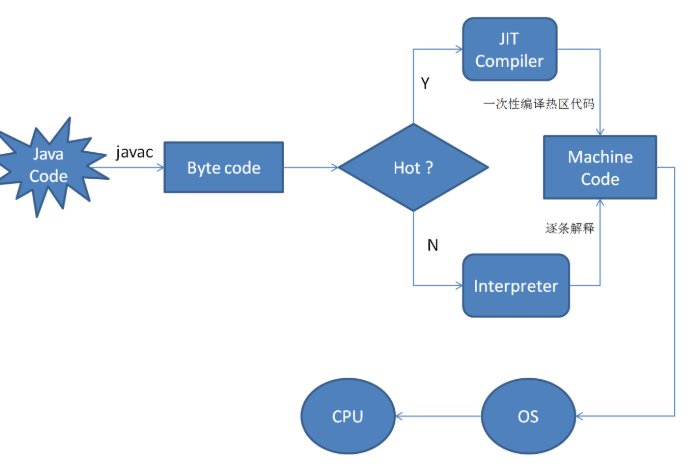

- 热点探测 （Hot Spot Detection） 

  触发JIT，需要识别出热点代码， 有两种方式

  - 基于采样的方式探测（Sample Based Hot Spot Detection) ：周期性检测各个线程的栈顶，发现某个方法经常出现在栈顶，就认为是热点方法。好处就是简单，缺点就是无法精确确认一个方法的热度。容易受线程阻塞或别的原因干扰热点探测。 
  - 基于计数器的热点探测（Counter Based Hot Spot Detection)。采用这种方法的虚拟机会为每个方法，甚至是代码块建立计数器，统计方法的执行次数，某个方法超过阀值就认为是热点方法，触发JIT编译。 

在HotSpot虚拟机中使用的是第二种——基于计数器的热点探测方法，因此它为每个方法准备了两个计数器：方法调用计数器和回边计数器。

方法计数器：就是记录一个方法被调用次数的计数器。

回边计数器：是记录方法中的for或者while的运行次数的计数器。

- 编译优化 

  JIT除了具有缓存的功能外，还会对代码做各种优化。比如 逃逸分析、 锁消除、 锁膨胀、 方法内联、 空值检查消除、 类型检测消除、 公共子表达式消除 。

JIT相关的JVM参数

```
-XX:CompileThreshold，方法调用计数器触发JIT编译的阀值

-XX:BackEdgeThreshold，回边计数器触发OSR编译的阀值

-XX:-BackgroundCompilation，禁止JIT后台编译
```

### JMM(线程) 内存模型
	JSR133定义的规范，JMM描述的是一种抽象的概念，一组规则，通过这组规则控制程序中各个变量在共享数据区域和私有数据区域的访问方式，JMM是围绕原子性、有序性、可见性展开的

 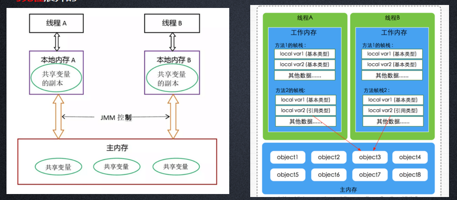

### JMM与硬件内存架构的关系
	JMM模型跟CPU缓存模型结构类似，是基于CPU缓存模型建立起来的，JMM模型是标准化的，屏蔽掉了底层不同计算机的区别。对于硬件内存来说只有寄存器、缓存内存、主内存的概念，并没有工作内存(线程私有数据区域)和主内存(堆内存)之分，因为JMM只是一种抽象的概念，是一组规则，并不实际存在，不管是工作内存的数据还是主内存的数据，对于计算机硬件来说都会存储在计算机主内存中，当然也有可能存储到CPU缓存或者寄存器中。


### volatile 
 volatile是Java虚拟机提供的轻量级的同步机制
 volatile语义有如下两个作用
	可见性：保证被volatile修饰的共享变量对所有线程总数可见的，也就是当一个线程修改了一个被volatile修饰共享变量的值，新值总是可以被其他线程立即得知。
	有序性：禁止指令重排序优化。

 volatile缓存可见性实现原理
	JMM内存交互层面：volatile修饰的变量的read、load、use操作和assign、store、write必须是连续的，即修改后必须立即同步会主内存，使用时必须从主内存刷新，由此保证volatile变量的可见性。
	底层实现：通过汇编lock前缀指令，它会锁定变量缓存行区域并写回主内存，这个操作称为“缓存锁定”，缓存一致性机制会阻止同时修改被两个以上处理器缓存的内存区域数据。一个处理器的缓存回写到内存内存会导致其他处理器的缓存无效
 汇编代码查看
	-XX:+UnlockDiagnosticVMOptions -XX:+PrintAssembly -Xcomp

### 指令重排、可见性、原子性、顺序一致性

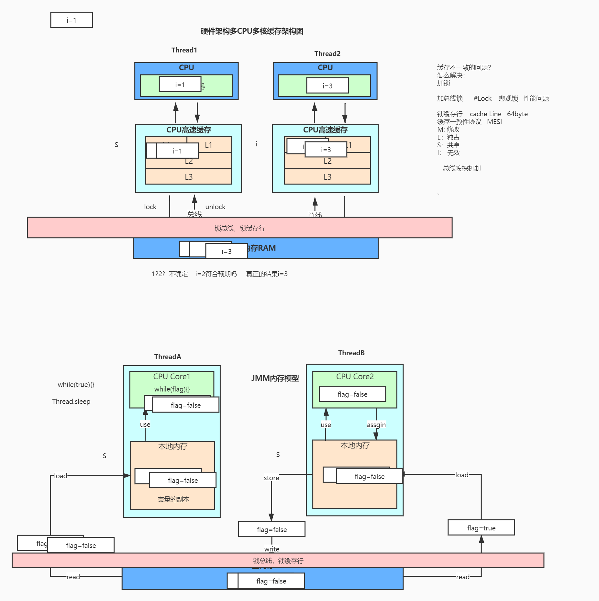

   可见性
```
public class VisibilityTest {
    // JMM内存模型
    // 可见性的问题： 线程A读不到线程B修改的值
    // volatile保证可见性   底层  汇编指令  lock addl $0x0,(%rsp)
    // 通过lock触发缓存一致性协议
    private  volatile boolean  flag = true;

    public void refresh(){
        flag = false;
        System.out.println(Thread.currentThread().getName()+"修改flag");
    }
    public void load(){
        System.out.println(Thread.currentThread().getName()+"开始执行.....");
        int i=0;
        while (flag){
            i++;
            //TODO   可以 又不可以
//            shortWait(100000000);  缓存过期
//            shortWait(100000);
//            shortWait(1000);
            // 可以  synchronized可见性 内存屏障
//            System.out.println("======");
            // 可以    sleep 让出cpu时间片
//            try { 
//                Thread.sleep(1);
//            } catch (InterruptedException e) {
//                e.printStackTrace();
//            }
        }
        System.out.println(Thread.currentThread().getName()+"跳出循环: i="+ i);
    }
    
    public static void main(String[] args){
        VisibilityTest test = new VisibilityTest();
        new Thread(() -> test.load(), "threadA").start();
        try {
            Thread.sleep(2000);
            new Thread(()->test.refresh(),"threadB").start();
        } catch (InterruptedException e) {
            e.printStackTrace();
        }
    }
    public static void shortWait(long interval){
        long start = System.nanoTime();
        long end;
        do{
            end = System.nanoTime();
        }while(start + interval >= end);
    }
}
```

    可见性的问题： 线程A读不到线程B修改的值,加volatile 可保证可见性，但不能保证原子性
    volatile保证可见性   底层  汇编指令  lock addl $0x0,(%rsp)
    通过lock触发缓存一致性协议
    
    缓存一致性协议会出现的问题
    伪共享: （导致缓存行失效）
        Cache Line大小是64Byte。
        如果多个核的线程在操作同一个缓存行中的不同变量数据，那么就会出现频繁的缓存失效，
        即使在代码层面看这两个线程操作的数据之间完全没有关系。这种不合理的资源竞争情况就是伪共享（False Sharing）
     避免伪共享:
        缓存行填充
        使用@sun.misc.Contended 注解（Java8）

    
  有序性
```
//DCL（双重锁定检查(DCL,Double Check Lock)）为什么要使用volatile
public class SingletonFactory {
    private volatile static SingletonFactory myInstance;
    public static SingletonFactory getMyInstance() {
        if (myInstance == null) {
            synchronized (SingletonFactory.class) {
                if (myInstance == null) {
                    // 有序性
                    // 对象是如何创建的？  16字节
//                    1. 在堆中开辟一片内存空间 （申请内存）
//                     2.  对象初始化 （设置初始化）
//                    3. myInstance指向内存空间的地址 （建立关联）

                    myInstance = new SingletonFactory();
                }
            }
        }
        return myInstance;
    }
    public static void main(String[] args) {
        SingletonFactory.getMyInstance();
    }
}
```
   指令重排（重排序）
```
public class ReOrderTest {
    private static int x = 0, y = 0;
    // 重排序      内存屏障--jvm级别实现（StoreLoad  StoreStore LoadLoad LoadStore） 禁止重排序 
    //底层如何实现的？
    // lock; addl $0,0(%%rsp)
    // volatile有序性
    private static  int a = 0, b = 0;
    public static void main(String[] args) throws InterruptedException{
        int i=0;
        while (true) {
            i++;
            x = 0;
            y = 0;
            a = 0;
            b = 0;
            /**
             *  x,y:   01     10     11   00
             */
            Thread thread1 = new Thread(new Runnable() {
                @Override
                public void run() {
                    shortWait(20000);
                    a = 1;  // volatile写   StoreLoad   保守策略  return
                    // 手动添加内存屏障
                    UnsafeFactory.getUnsafe().storeFence();
                    x = b;

                }
            });
            Thread thread2 = new Thread(new Runnable() {
                @Override
                public void run() {
                    b = 1;
                    // 手动添加内存屏障
                    UnsafeFactory.getUnsafe().storeFence();
                    y = a;
                }
            });
            thread1.start();
            thread2.start();
            thread1.join();
            thread2.join();
            System.out.println("第" + i + "次（" + x + "," + y + ")");

            if (x==0&&y==0){
                break;
            }
        }
    }
    public static void shortWait(long interval){
        long start = System.nanoTime();
        long end;
        do{
            end = System.nanoTime();
        }while(start + interval >= end);
    }
}
```

### CAS -- 比较与交换（保证原子性）
 CAS可以看做是乐观锁的一种实现方式，Java原子类中的递增操作就通过CAS自旋实现的。
 CAS全称Compare And Swap (比较与交换)，是一种无锁算法。在不使用锁(没有线程被阻塞)的情况下实现多线程之间的变量同步。
	LOCK_IF_MP(%4) "cmpxchgl %1,(%3)“     lock  cmpxchgl

 unsafe.compareAndSwapInt(this, valueOffset, expect, update)
 上面的方法，有几个重要的参数：
	this，Unsafe 对象本身，需要通过这个类来获取 value 的内存偏移地址
	valueOffset，value 变量的内存偏移地址
	expect，期望更新的值
	update，要更新的最新值
 如果原子变量中的 value 值等于 expect，则使用 update 值更新该值并返回 true，否则返回 false。

 缺点：
	
	只能保证对一个变量的原子性操作
	长时间自旋会给CPU带来压力
	ABA问题 （加版本号可解决）
	
 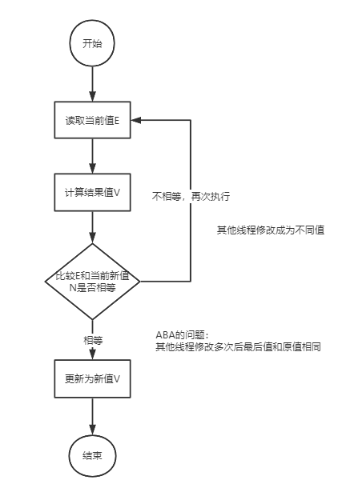

 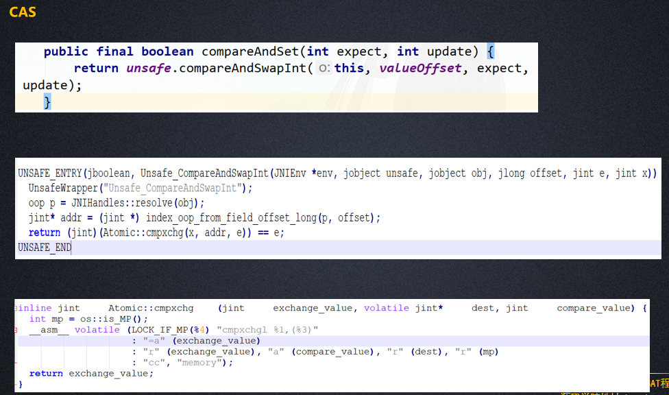

### as-if-serial  

as-if-serial语义的意思是：不管怎么重排序（编译器和处理器为了提高并行度），（单线程）程序的执行结果不能被改变。编译器、runtime和处理器都必须遵守as-if-serial语义。  

为了遵守as-if-serial语义，编译器和处理器不会对存在数据依赖关系的操作做重排序，因为这种重排序会改变执行结果。但是，如果操作之间不存在数据依赖关系，这些操作就可能被编译器和处理器重排序。  

```java
double pi = 3.14; // A
double r = 1.0; // B
double area = pi * r * r; // C
```

A和C之间存在数据依赖关系，同时B和C之间也存在数据依赖关系。因此在最终执行的指令序列中，C不能被重排序到A和B的前面（C排到A和B的前面，程序的结果将会被改变）。但A和B之间没有数据依赖关系，编译器和处理器可以重排序A和B之间的执行顺序。 


### happens-before

从JDK 5 开始，JMM使用happens-before的概念来阐述多线程之间的内存可见性。**在JMM中，如果一个操作执行的结果需要对另一个操作可见，那么这两个操作之间必须存在happens-before关系。** happens-before和JMM关系如下图：

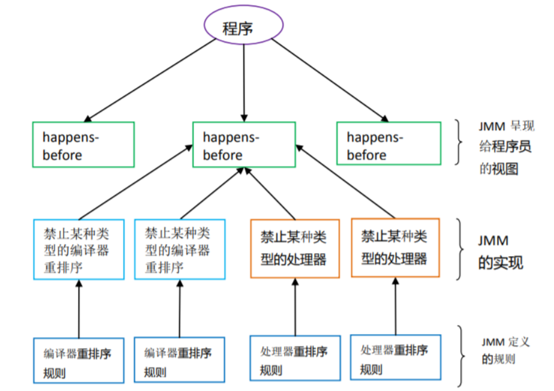


happens-before原则非常重要，它是判断数据是否存在竞争、线程是否安全的主要依据，依靠这个原则，我们解决在并发环境下两操作之间是否可能存在冲突的所有问题。下面我们就一个简单的例子稍微了解下happens-before ；

```
i = 1;       //线程A执行
j = i ;      //线程B执行
```

j 是否等于1呢？假定线程A的操作（i = 1）happens-before线程B的操作（j = i）,那么可以确定线程B执行后j = 1 一定成立，如果他们不存在happens-before原则，那么j = 1 不一定成立。这就是happens-before原则的威力。

**happens-before原则定义如下**：

1. 如果一个操作happens-before另一个操作，那么第一个操作的执行结果将对第二个操作可见，而且第一个操作的执行顺序排在第二个操作之前。 
2. 两个操作之间存在happens-before关系，并不意味着一定要按照happens-before原则制定的顺序来执行。如果重排序之后的执行结果与按照happens-before关系来执行的结果一致，那么这种重排序并不非法。

**下面是happens-before原则规则**：

    1.程序次序规则：一个线程内，按照代码顺序，书写在前面的操作先行发生于书写在后面的操作；
    
    2.锁定规则：一个unLock操作先行发生于后面对同一个锁的lock操作；
    
    3.volatile变量规则：对一个变量的写操作先行发生于后面对这个变量的读操作；
    
    4.传递规则：如果操作A先行发生于操作B，而操作B又先行发生于操作C，则可以得出操作A先行发生于操作C；
    
    5.线程启动规则：Thread对象的start()方法先行发生于此线程的每个一个动作；
    
    6.线程中断规则：对线程interrupt()方法的调用先行发生于被中断线程的代码检测到中断事件的发生；
    
    7.线程终结规则：线程中所有的操作都先行发生于线程的终止检测，我们可以通过Thread.join()方法结束、Thread.isAlive()的返回值手段检测到线程已经终止执行；
    
    8.对象终结规则：一个对象的初始化完成先行发生于他的finalize()方法的开始；


我们来详细看看上面每条规则（摘自《深入理解Java虚拟机第12章》）：

**程序次序规则**：一段代码在单线程中执行的结果是有序的。注意是执行结果，因为虚拟机、处理器会对指令进行重排序（重排序后面会详细介绍）。虽然重排序了，但是并不会影响程序的执行结果，所以程序最终执行的结果与顺序执行的结果是一致的。故而这个规则只对单线程有效，在多线程环境下无法保证正确性。

**锁定规则**：这个规则比较好理解，无论是在单线程环境还是多线程环境，一个锁处于被锁定状态，那么必须先执行unlock操作后面才能进行lock操作。

**volatile变量规则**：这是一条比较重要的规则，它标志着volatile保证了线程可见性。通俗点讲就是如果一个线程先去写一个volatile变量，然后一个线程去读这个变量，那么这个写操作一定是happens-before读操作的。

**传递规则**：提现了happens-before原则具有传递性，即A happens-before B , B happens-before C，那么A happens-before C

**线程启动规则**：假定线程A在执行过程中，通过执行ThreadB.start()来启动线程B，那么线程A对共享变量的修改在接下来线程B开始执行后确保对线程B可见。

**线程终结规则**：假定线程A在执行的过程中，通过制定ThreadB.join()等待线程B终止，那么线程B在终止之前对共享变量的修改在线程A等待返回后可见。

**上面八条是原生Java满足Happens-before关系的规则，但是我们可以对他们进行推导出其他满足happens-before的规则**：

    1.将一个元素放入一个线程安全的队列的操作Happens-Before从队列中取出这个元素的操作
    
    2.将一个元素放入一个线程安全容器的操作Happens-Before从容器中取出这个元素的操作
    
    3.在CountDownLatch上的倒数操作Happens-Before CountDownLatch#await()操作
    
    4.释放Semaphore许可的操作Happens-Before获得许可操作
    
    5.Future表示的任务的所有操作Happens-Before Future#get()操作
    
    6.向Executor提交一个Runnable或Callable的操作Happens-Before任务开始执行操作

这里再说一遍happens-before的概念：**如果两个操作不存在上述（前面8条 + 后面6条）任一一个happens-before规则，那么这两个操作就没有顺序的保障，JVM可以对这两个操作进行重排序。如果操作A happens-before操作B，那么操作A在内存上所做的操作对操作B都是可见的。**

下面就用一个简单的例子来描述下happens-before原则：

```
private int i = 0;
 
public void write(int j ){
    i = j;
}
 
public int read(){
    return i;
}
```

我们约定线程A执行write()，线程B执行read()，且线程A优先于线程B执行，那么线程B获得结果是什么？；我们就这段简单的代码一次分析happens-before的规则（规则5、6、7、8 + 推导的6条可以忽略，因为他们和这段代码毫无关系）：

- 由于两个方法是由不同的线程调用，所以肯定不满足程序次序规则；
- 两个方法都没有使用锁，所以不满足锁定规则；
- 变量i不是用volatile修饰的，所以volatile变量规则不满足；
- 传递规则肯定不满足；

所以我们无法通过happens-before原则推导出线程A happens-before线程B，虽然可以确认在时间上线程A优先于线程B指定，但是就是无法确认线程B获得的结果是什么，所以这段代码不是线程安全的。那么怎么修复这段代码呢？满足规则2、3任一即可。

**happens-before原则是JMM中非常重要的原则，它是判断数据是否存在竞争、线程是否安全的主要依据，保证了多线程环境下的可见性。**

### ThreadLocal
    