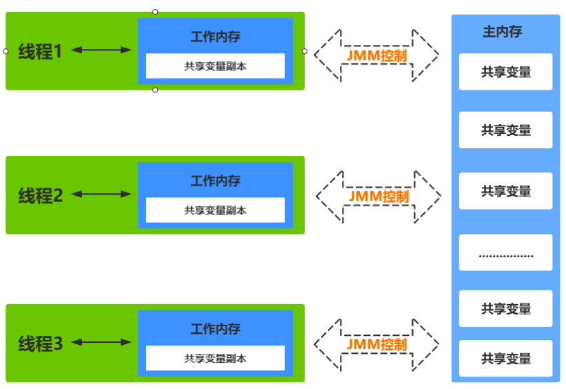
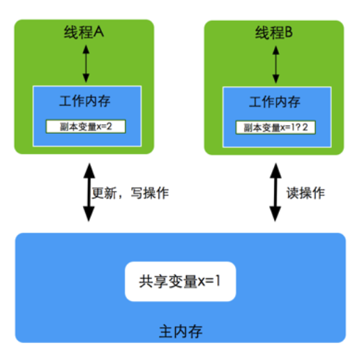
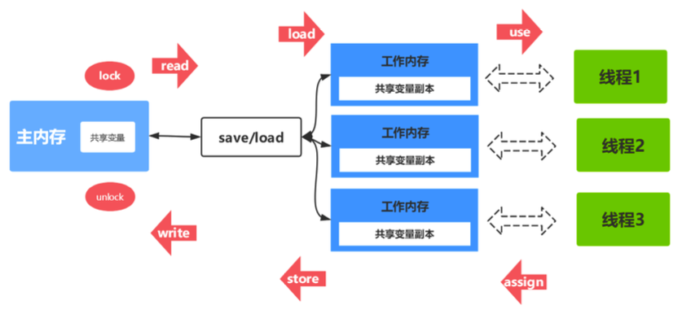
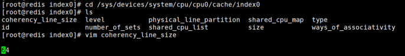
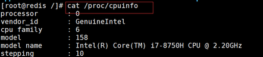
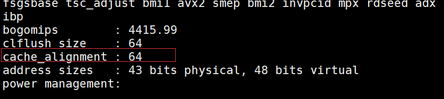
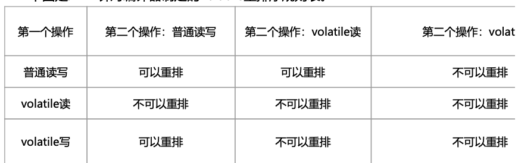
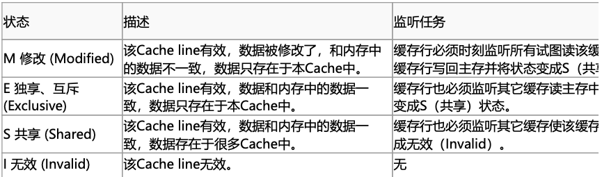
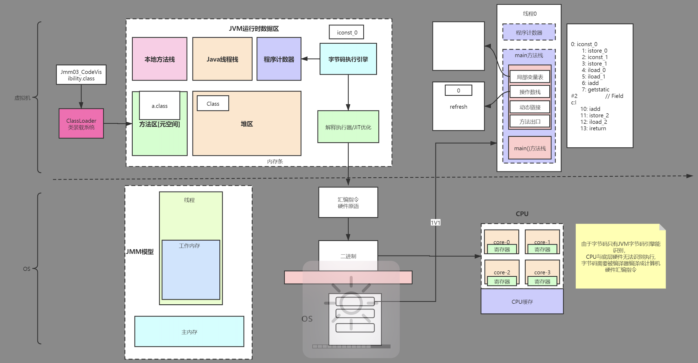

### 1. 多线程编程：（并发编程的本质）
    分工: 任务拆解
    同步: 线程间协作
    互斥: 独占

###  2. 并发如何去学？
1. JMM 模型   JAVA 线程的内存模式。（cpu缓存一致性协议 volatile  CAS）  
   并发的特性：原子性， 有序性，可见性 
2. 锁机制 内置锁（synchronized） juc（AQS 独占锁 共享锁 读写锁 等） 同步器 （队列 同步队列 条件队列）
3. 线程  是重量级线程   pthread_create (操作系统内核)   JavaThread ---- osThread  ----- nativeThread (系统底层)
4. 线程池 --线程复用（降低线程创建销毁的开销）
5. 并发容器
6. 并行 fork-join   物理架构   同一时刻，多条指令在多个处理器上同时执行，无论是微观还是宏观都是一起执行
7. 并发             逻辑架构   同一时刻，只能有一条指令执行，但多个进程指令快速轮转执行，使得在宏观上是多个进程同时执行的效果，微观上并不是同时执行的，可以在一个核执行，也可以在多个核执行

### 3. 并发编程的优缺点：
    并发编程优势: 并发可以将多核cpu 的计算能力发挥到极致，提升性能
    并发编程的风险：
    1. 高并发场景下，频繁上下文切换反而损耗性能
    2. 活跃性（一个并发应用程序能及时执行的能力）问题，容易出现死锁 ，饥饿（while），活锁
        死锁的四个条件 （互斥，请求与保持，不可剥夺，循环等待）都满足也不一定发生死锁 -- 互相等（阻塞）-- 出现情况 lock
        饥饿 常见场景  有  while(true){}  情况下  
        活锁   -- 互相让 （没有阻塞，但是一直在彼此相让，做无用功）  -- 出现情况 try lock 但是场景少
    3. 线程安全，多个线程共享数据时可能会产生与期望不相符的结果

### 4. JMM 

#### 4.1. 什么是jmm 模型?

  Java内存模型(Java Memory Model简称JMM)是一种抽象的概念，并不真实存在，它 描述的是一组规则或规范，通过这组规范定义了程序中各个变量
  (包括实例字段，静态字段 和构成数组对象的元素)的访问方式。JVM运行程序的实体是线程，而每个线程创建时 JVM都会为其创建一个工作内存
  (有些地方称为栈空间)，用于存储线程私有的数据，而Java 内存模型中规定所有变量都存储在主内存，主内存是共享内存区域，所有线程都可以访问，
  但线程对变量的操作(读取赋值等)必须在工作内存中进行，首先要将变量从主内存拷贝的自 己的工作内存空间，然后对变量进行操作，
  操作完成后再将变量写回主内存，不能直接操作 主内存中的变量，工作内存中存储着主内存中的变量副本拷贝，前面说过，工作内存是每个线程的私有数据区域，
  因此不同的线程间无法访问对方的工作内存，线程间的通信(传值)必 须通过主内存来完成。

#### 4.2 JMM 不同于 JVM 内存区域模型

  JMM与JVM内存区域的划分是不同的概念层次，更恰当说JMM描述的是一组规则，通过这组规则控制程序中各个变量在共享数据区域和私有数据区域的访问方式，
  JMM是围绕 原子性，有序性、可见性展开。JMM与Java内存区域唯一相似点，都存在共享数据区域和 私有数据区域，在JMM中主内存属于共享数据区域，
  从某个程度上讲应该包括了堆和方法 区，而工作内存数据线程私有数据区域，从某个程度上讲则应该包括程序计数器、虚拟机栈 以及本地方法栈。
  线程，工作内存，主内存工作交互图(基于JMM规范):



##### 4.2.1 主内存 

  主要存储的是Java实例对象，所有线程创建的实例对象都存放在主内存中，不管该实例对象是成员变量还是方法中的本地变量(也称局部变量)，
  当然也包括了共享的类信息、常 量、静态变量。由于是共享数据区域，多条线程对同一个变量进行访问可能会发生线程安全 问题。

##### 4.2.2 工作内存 

   主要存储当前方法的所有本地变量信息(工作内存中存储着主内存中的变量副本拷贝)，每个线程只能访问自己的工作内存，即线程中的本地变量对其它线程是不可见的，
   就算是两 个线程执行的是同一段代码，它们也会各自在自己的工作内存中创建属于当前线程的本地变 量，当然也包括了字节码行号指示器、相关Native方法的信息。
   注意由于工作内存是每个 线程的私有数据，线程间无法相互访问工作内存，因此存储在工作内存的数据不存在线程安全问题。

   根据JVM虚拟机规范主内存与工作内存的数据存储类型以及操作方式，对于一个实例对 象中的成员方法而言，如果方法中包含本地变量是基本数据类型 
   (boolean,byte,short,char,int,long,float,double)，将直接存储在工作内存的帧栈结构 中，但倘若本地变量是引用类型，那么该变量的引用会存储在
   功能内存的帧栈中，而对象实 例将存储在主内存(共享数据区域，堆)中。但对于实例对象的成员变量，不管它是基本数据 类型或者包装类型
   (Integer、Double等)还是引用类型，都会被存储到堆区。至于static变 量以及类本身相关信息将会存储在主内存中。需要注意的是，
   在主内存中的实例对象可以被多线程共享，倘若两个线程同时调用了同一个对象的同一个方法，那么两条线程会将要操作的数据拷贝一份到自己的工作内存中，执行完成操作后才刷新到主内存

   模型如下图所示: 


#### 4.3 JMM与硬件内存架构的关系

  JMM模型跟CPU缓存模型结构类似，是基于CPU缓存模型建立起来的，JMM模型是标准化的，屏蔽掉了底层不同计算机的区别。
  对于硬件内存来说只有寄存器、缓存内存、主内存的概念，并没有工作内存(线程私有数据区域)和主内存(堆内存)之分，因为JMM只是一种抽象的概念，
  是一组规则，并不实际存在，不管是工作内存的数据还是主内存的数据，对于计算机硬件来说都会存储在计算机主内存中，当然也有可能存储到CPU缓存或者寄存器中。


#### 4.4 JMM 存在的必要性 

   明白了Java内存区域划分、硬件内存架构、Java多线程的实现原理与Java内存模型 的具体关系后，接着来谈谈Java内存模型存在的必要性。
   由于JVM运行程序的实体是线 程，而每个线程创建时JVM都会为其创建一个工作内存(有些地方称为栈空间)，用于存储线 程私有的数据，
   线程与主内存中的变量操作必须通过工作内存间接完成，主要过程是将变量 从主内存拷贝的每个线程各自的工作内存空间，然后对变量进行操作，
   操作完成后再将变量 写回主内存，如果存在两个线程同时对一个主内存中的实例对象的变量进行操作就有可能诱 发线程安全问题。

   假设主内存中存在一个共享变量x，现在有A和B两条线程分别对该变量x=1进行操作， A/B线程各自的工作内存中存在共享变量副本x。
   假设现在A线程想要修改x的值为2，而B线程却想要读取x的值，那么B线程读取到的值是A线程更新后的值2还是更新前的值1呢?答案 是，不确定，
   即B线程有可能读取到A线程更新前的值1，也有可能读取到A线程更新后的值 2，这是因为工作内存是每个线程私有的数据区域，而线程A变量x时，
   首先是将变量从主内 存拷贝到A线程的工作内存中，然后对变量进行操作，操作完成后再将变量x写回主内，而 对于B线程的也是类似的，
   这样就有可能造成主内存与工作内存间数据存在一致性问题，假 如A线程修改完后正在将数据写回主内存，而B线程此时正在读取主内存，
   即将x=1拷贝到自己的工作内存中，这样B线程读取到的值就是x=1，但如果A线程已将x=2写回主内存后， B线程才开始读取的话，
   那么此时B线程读取到的就是x=2，但到底是哪种情况先发生呢?



   以上关于主内存与工作内存之间的具体交互协议，即一个变量如何从主内存拷贝到工作 内存、如何从工作内存同步到主内存之间的实现细节，
   Java内存模型定义了以下八种操作来 完成。

#### 4.5 数据同步八大原子操作 

    (1)lock(锁定):作用于主内存的变量，把一个变量标记为一条线程独占状态 

    (2)unlock(解锁):作用于主内存的变量，把一个处于锁定状态的变量释放出来，释放后 的变量才可以被其他线程锁定 
  
    (3)read(读取):作用于主内存的变量，把一个变量值从主内存传输到线程的工作内存 中，以便随后的load动作使用 

    (4)load(载入):作用于工作内存的变量，它把read操作从主内存中得到的变量值放入工 作内存的变量副本中

    (5)use(使用):作用于工作内存的变量，把工作内存中的一个变量值传递给执行引擎
 
    (6)assign(赋值):作用于工作内存的变量，它把一个从执行引擎接收到的值赋给工作内 存的变量

    (7)store(存储):作用于工作内存的变量，把工作内存中的一个变量的值传送到主内存 中，以便随后的write的操作

    (8)write(写入):作用于工作内存的变量，它把store操作从工作内存中的一个变量的值 传送到主内存的变量中

  如果要把一个变量从主内存中复制到工作内存中，就需要按顺序地执行read和load操 作，如果把变量从工作内存中同步到主内存中，
  就需要按顺序地执行store和write操作。但Java内存模型只要求上述操作必须按顺序执行，而没有保证必须是连续执行。




### 5. 并发编程的可见性、原子性与有序性


#### 5.1 原子性 

  原子性指的是一个操作是不可中断的，即使是在多线程环境下，一个操作一旦开始就不会被其他线程影响。

  在java中，对基本数据类型的变量的读取和赋值操作是原子性操作有点要注意的是，对 于32位系统的来说，long类型数据和double类型数据(对于基本数据类型，
  byte,short,int,float,boolean,char读写是原子操作)，它们的读写并非原子性的，也就是说 如果存在两条线程同时对long类型或者double类型的数据进
  行读写是存在相互干扰的，因 为对于32位虚拟机来说，每次原子读写是32位的，而long和double则是64位的存储单元， 这样会导致一个线程在写时，
  操作完前32位的原子操作后，轮到B线程读取时，恰好只读取 到了后32位的数据，这样可能会读取到一个既非原值又不是线程修改值的变量，
  它可能 是“半个变量”的数值，即64位数据被两个线程分成了两次读取。但也不必太担心，因为 读取到“半个变量”的情况比较少见，至少在目前的商用的虚拟机中，
  几乎都把64位的数 据的读写操作作为原子操作来执行，因此对于这个问题不必太在意，

#### 5.2 可见性 

  理解了指令重排现象后，可见性容易了，可见性指的是当一个线程修改了某个共享变量的值，其他线程是否能够马上得知这个修改的值。对于串行程序来说，
  可见性是不存在的，因为我们在任何一个操作中修改了某个变量的值，后续的操作中都能读取这个变量值，并且是修改过的新值。

  但在多线程环境中可就不一定了，前面我们分析过，由于线程对共享变量的操作都是线 程拷贝到各自的工作内存进行操作后才写回到主内存中的，
  这就可能存在一个线程A修改了 共享变量x的值，还未写回主内存时，另外一个线程B又对主内存中同一个共享变量x进行操 作，但此时A线程工作内存中共享变量x
  对线程B来说并不可见，这种工作内存与主内存同步 延迟现象就造成了可见性问题，另外指令重排以及编译器优化也可能导致可见性问题，通过 前面的分析，
  我们知道无论是编译器优化还是处理器优化的重排现象，在多线程环境下，确 实会导致程序轮序执行的问题，从而也就导致可见性问题。

#### 5.3 有序性 

  有序性是指对于单线程的执行代码，我们总是认为代码的执行是按顺序依次执行的，这样的理解并没有毛病，毕竟对于单线程而言确实如此，
  但对于多线程环境，则可能出现乱序 现象，因为程序编译成机器码指令后可能会出现指令重排现象，重排后的指令与原指令的顺 序未必一致，
  要明白的是，在Java程序中，倘若在本线程内，所有操作都视为有序行为，如 果是多线程环境下，一个线程中观察另外一个线程，所有操作都是无序的，
  前半句指的是单线程内保证串行语义执行的一致性，后半句则指指令重排现象和工作内存与主内存同步延迟现象。

### 6. jmm 如果解决原子性、可见性、有序性问题

#### 6.1 原子性问题 

   除了JVM自身提供的对基本数据类型读写操作的原子性外，可以通过 synchronized和Lock实现原子性。因为synchronized和Lock能够保证任一时刻只有一个线程访问该代码 块。

##### 6.1.1  CAS -- 比较与交换（保证原子性）

  CAS可以看做是乐观锁的一种实现方式，Java原子类中的递增操作就通过CAS自旋实现的。
  
  CAS全称Compare And Swap (比较与交换)，是一种无锁算法。在不使用锁(没有线程被阻塞)的情况下实现多线程之间的变量同步。

  LOCK_IF_MP(%4) "cmpxchgl %1,(%3)“     lock  cmpxchgl

    unsafe.compareAndSwapInt(this, valueOffset, expect, update)
    上面的方法，有几个重要的参数：
    this，Unsafe 对象本身，需要通过这个类来获取 value 的内存偏移地址
    valueOffset，value 变量的内存偏移地址 
    expect，期望更新的值
    update，要更新的最新值
    如果原子变量中的 value 值等于 expect，则使用 update 值更新该值并返回 true，否则返回 false。

  缺点：

	只能保证对一个变量的原子性操作
	长时间自旋会给CPU带来压力
	ABA问题 （加版本号可解决）


#### 6.2 可见性问题 

   volatile关键字保证可见性。当一个共享变量被volatile修饰时，它会保证修改的值立即 被其他的线程看到，即修改的值立即更新到主存中，
   当其他线程需要读取时，它会去内存中 读取新值。synchronized和Lock也可以保证可见性，因为它们可以保证任一时刻只有一个 线程能访问共享资源，
   并在其释放锁之前将修改的变量刷新到内存中。

```
public class VisibilityTest {
    // JMM内存模型
    // 可见性的问题： 线程A读不到线程B修改的值
    // volatile保证可见性   底层  汇编指令  lock addl $0x0,(%rsp)
    // 通过lock触发缓存一致性协议
    private  volatile boolean  flag = true;

    public void refresh(){
        flag = false;
        System.out.println(Thread.currentThread().getName()+"修改flag");
    }
    public void load(){
        System.out.println(Thread.currentThread().getName()+"开始执行.....");
        int i=0;
        while (flag){
            i++;
            //TODO   可以 又不可以
//            shortWait(100000000);  缓存过期
//            shortWait(100000);
//            shortWait(1000);
            // 可以  synchronized可见性 内存屏障
//            System.out.println("======");
            // 可以    sleep 让出cpu时间片
//            try { 
//                Thread.sleep(1);
//            } catch (InterruptedException e) {
//                e.printStackTrace();
//            }
        }
        System.out.println(Thread.currentThread().getName()+"跳出循环: i="+ i);
    }
    
    public static void main(String[] args){
        VisibilityTest test = new VisibilityTest();
        new Thread(() -> test.load(), "threadA").start();
        try {
            Thread.sleep(2000);
            new Thread(()->test.refresh(),"threadB").start();
        } catch (InterruptedException e) {
            e.printStackTrace();
        }
    }
    public static void shortWait(long interval){
        long start = System.nanoTime();
        long end;
        do{
            end = System.nanoTime();
        }while(start + interval >= end);
    }
}
```

    可见性的问题： 线程A读不到线程B修改的值,加volatile 可保证可见性，但不能保证原子性
    volatile保证可见性   底层  汇编指令  lock addl $0x0,(%rsp)
    通过lock触发缓存一致性协议(或 总线锁)
    
    缓存一致性协议会出现的问题
    伪共享: （导致缓存行失效）
        Cache Line大小是64Byte。
        如果多个核的线程在操作同一个缓存行中的不同变量数据，那么就会出现频繁的缓存失效，
        即使在代码层面看这两个线程操作的数据之间完全没有关系。这种不合理的资源竞争情况就是伪共享（False Sharing）
    举个例子: 现在有2个long 型变量 a 、b，如果有t1在访问a，t2在访问b，而a与b刚好在同一个 cache line中，此时t1先修改a，将导致b被刷新!

     避免伪共享:
        缓存行填充
        使用@sun.misc.Contended 注解（Java8）加上这个注解的类会自动补齐缓 存行，需要注意的是此注解默认是无效的，需要在jvm启动时设置 -XX:- RestrictContended 才会生效。

linux下查看缓存行大小



或者




#### 6.3 有序性问题 

   在Java里面，可以通过volatile关键字来保证一定的“有序性”。另外可以通过synchronized和Lock来保证有序性，很显然， 
   synchronized和Lock保证每个时刻是有一个线程执行同步代码，相当于是让线程顺序执行 同步代码，自然就保证了有序性。

```
//DCL（双重锁定检查(DCL,Double Check Lock)）为什么要使用volatile
public class SingletonFactory {
    private volatile static SingletonFactory myInstance;
    public static SingletonFactory getMyInstance() {
        if (myInstance == null) {
            synchronized (SingletonFactory.class) {
                if (myInstance == null) {
                    // 有序性
                    // 对象是如何创建的？  16字节
//                    1. 在堆中开辟一片内存空间 （申请内存）
//                     2.  对象初始化 （设置初始化）
//                    3. myInstance指向内存空间的地址 （建立关联）

                    myInstance = new SingletonFactory();
                }
            }
        }
        return myInstance;
    }
    public static void main(String[] args) {
        SingletonFactory.getMyInstance();
    }
}
```

##### 6.3.1 Java内存模型:

   每个线程都有自己的工作内存(类似于前面的高速缓存)。线程对变 量的所有操作都必须在工作内存中进行，而不能直接对主存进行操作。
   并且每个线程不能访 问其他线程的工作内存。Java内存模型具备一些先天的“有序性”，即不需要通过任何手段 就能够得到保证的有序性，
   这个通常也称为happens-before 原则。如果两个操作的执行次 序无法从happens-before原则推导出来，那么它们就不能保证它们的有序性，
   虚拟机可以随意地对它们进行重排序。

##### 6.3.2 指令重排序:

   java语言规范规定JVM线程内部维持顺序化语义。即只要程序的最终结果 与它顺序化情况的结果相等，那么指令的执行顺序可以与代码顺序不一致，
   此过程叫指令的 重排序。指令重排序的意义是什么?JVM能根据处理器特性(CPU多级缓存系统、多核处 理器等)适当的对机器指令进行重排序，
   使机器指令能更符合CPU的执行特性，最大限度的 发挥机器性能。


```
public class ReOrderTest {
    private static int x = 0, y = 0;
    // 重排序      内存屏障--jvm级别实现（StoreLoad  StoreStore LoadLoad LoadStore） 禁止重排序 
    //底层如何实现的？
    // lock; addl $0,0(%%rsp)
    // volatile有序性
    private static  int a = 0, b = 0;
    public static void main(String[] args) throws InterruptedException{
        int i=0;
        while (true) {
            i++;
            x = 0;
            y = 0;
            a = 0;
            b = 0;
            /**
             *  x,y:   01     10     11   00
             */
            Thread thread1 = new Thread(new Runnable() {
                @Override
                public void run() {
                    shortWait(20000);
                    a = 1;  // volatile写   StoreLoad   保守策略  return
                    // 手动添加内存屏障
                    UnsafeFactory.getUnsafe().storeFence();
                    x = b;

                }
            });
            Thread thread2 = new Thread(new Runnable() {
                @Override
                public void run() {
                    b = 1;
                    // 手动添加内存屏障
                    UnsafeFactory.getUnsafe().storeFence();
                    y = a;
                }
            });
            thread1.start();
            thread2.start();
            thread1.join();
            thread2.join();
            System.out.println("第" + i + "次（" + x + "," + y + ")");

            if (x==0&&y==0){
                break;
            }
        }
    }
    public static void shortWait(long interval){
        long start = System.nanoTime();
        long end;
        do{
            end = System.nanoTime();
        }while(start + interval >= end);
    }
}
```


### 7. volatile

   volatile是Java虚拟机提供的轻量级的同步机制

   volatile语义有如下两个作用

    可见性：保证被volatile修饰的共享变量对所有线程总数可见的，也就是当一个线程修改了一个被volatile修饰共享变量的值，新值总是可以被其他线程立即得知。
  
    有序性：禁止指令重排序优化。

   volatile缓存可见性实现原理


    JMM内存交互层面：volatile修饰的变量的read、load、use操作和assign、store、write必须是连续的，即修改后必须立即同步会主内存，使用时必须从主内存刷新，由此保证volatile变量的可见性。
   
    底层实现：通过汇编lock前缀指令，它会锁定变量缓存行区域并写回主内存，这个操作称为“缓存锁定”，缓存一致性机制会阻止同时修改被两个以上处理器缓存的内存区域数据。一个处理器的缓存回写到内存内存会导致其他处理器的缓存无效

    汇编代码查看
        
        -XX:+UnlockDiagnosticVMOptions -XX:+PrintAssembly -Xcomp


### 8. as-if-serial  

as-if-serial语义的意思是：不管怎么重排序（编译器和处理器为了提高并行度），（单线程）程序的执行结果不能被改变。编译器、runtime和处理器都必须遵守as-if-serial语义。  

为了遵守as-if-serial语义，编译器和处理器不会对存在数据依赖关系的操作做重排序，因为这种重排序会改变执行结果。但是，如果操作之间不存在数据依赖关系，这些操作就可能被编译器和处理器重排序。  

```java
double pi = 3.14; // A
double r = 1.0; // B
double area = pi * r * r; // C
```

A和C之间存在数据依赖关系，同时B和C之间也存在数据依赖关系。因此在最终执行的指令序列中，C不能被重排序到A和B的前面（C排到A和B的前面，程序的结果将会被改变）。但A和B之间没有数据依赖关系，编译器和处理器可以重排序A和B之间的执行顺序。 


### 9. happens-before

从JDK 5 开始，JMM使用happens-before的概念来阐述多线程之间的内存可见性。**在JMM中，如果一个操作执行的结果需要对另一个操作可见，那么这两个操作之间必须存在happens-before关系。** happens-before和JMM关系如下图：


happens-before原则非常重要，它是判断数据是否存在竞争、线程是否安全的主要依据，依靠这个原则，我们解决在并发环境下两操作之间是否可能存在冲突的所有问题。下面我们就一个简单的例子稍微了解下happens-before ；

```
i = 1;       //线程A执行
j = i ;      //线程B执行
```

j 是否等于1呢？假定线程A的操作（i = 1）happens-before线程B的操作（j = i）,那么可以确定线程B执行后j = 1 一定成立，如果他们不存在happens-before原则，那么j = 1 不一定成立。这就是happens-before原则的威力。

**happens-before原则定义如下**：

1. 如果一个操作happens-before另一个操作，那么第一个操作的执行结果将对第二个操作可见，而且第一个操作的执行顺序排在第二个操作之前。 
2. 两个操作之间存在happens-before关系，并不意味着一定要按照happens-before原则制定的顺序来执行。如果重排序之后的执行结果与按照happens-before关系来执行的结果一致，那么这种重排序并不非法。

**下面是happens-before原则规则**：

    1.程序次序规则：一个线程内，按照代码顺序，书写在前面的操作先行发生于书写在后面的操作；
    
    2.锁定规则：一个unLock操作先行发生于后面对同一个锁的lock操作；
    
    3.volatile变量规则：对一个变量的写操作先行发生于后面对这个变量的读操作；
    
    4.传递规则：如果操作A先行发生于操作B，而操作B又先行发生于操作C，则可以得出操作A先行发生于操作C；
    
    5.线程启动规则：Thread对象的start()方法先行发生于此线程的每个一个动作；
    
    6.线程中断规则：对线程interrupt()方法的调用先行发生于被中断线程的代码检测到中断事件的发生；
    
    7.线程终结规则：线程中所有的操作都先行发生于线程的终止检测，我们可以通过Thread.join()方法结束、Thread.isAlive()的返回值手段检测到线程已经终止执行；
    
    8.对象终结规则：一个对象的初始化完成先行发生于他的finalize()方法的开始；


我们来详细看看上面每条规则（摘自《深入理解Java虚拟机第12章》）：

**程序次序规则**：一段代码在单线程中执行的结果是有序的。注意是执行结果，因为虚拟机、处理器会对指令进行重排序（重排序后面会详细介绍）。虽然重排序了，但是并不会影响程序的执行结果，所以程序最终执行的结果与顺序执行的结果是一致的。故而这个规则只对单线程有效，在多线程环境下无法保证正确性。

**锁定规则**：这个规则比较好理解，无论是在单线程环境还是多线程环境，一个锁处于被锁定状态，那么必须先执行unlock操作后面才能进行lock操作。

**volatile变量规则**：这是一条比较重要的规则，它标志着volatile保证了线程可见性。通俗点讲就是如果一个线程先去写一个volatile变量，然后一个线程去读这个变量，那么这个写操作一定是happens-before读操作的。

**传递规则**：提现了happens-before原则具有传递性，即A happens-before B , B happens-before C，那么A happens-before C

**线程启动规则**：假定线程A在执行过程中，通过执行ThreadB.start()来启动线程B，那么线程A对共享变量的修改在接下来线程B开始执行后确保对线程B可见。

**线程终结规则**：假定线程A在执行的过程中，通过制定ThreadB.join()等待线程B终止，那么线程B在终止之前对共享变量的修改在线程A等待返回后可见。

**上面八条是原生Java满足Happens-before关系的规则，但是我们可以对他们进行推导出其他满足happens-before的规则**：

    1.将一个元素放入一个线程安全的队列的操作Happens-Before从队列中取出这个元素的操作
    
    2.将一个元素放入一个线程安全容器的操作Happens-Before从容器中取出这个元素的操作
    
    3.在CountDownLatch上的倒数操作Happens-Before CountDownLatch#await()操作
    
    4.释放Semaphore许可的操作Happens-Before获得许可操作
    
    5.Future表示的任务的所有操作Happens-Before Future#get()操作
    
    6.向Executor提交一个Runnable或Callable的操作Happens-Before任务开始执行操作

这里再说一遍happens-before的概念：**如果两个操作不存在上述（前面8条 + 后面6条）任一一个happens-before规则，那么这两个操作就没有顺序的保障，JVM可以对这两个操作进行重排序。如果操作A happens-before操作B，那么操作A在内存上所做的操作对操作B都是可见的。**

下面就用一个简单的例子来描述下happens-before原则：

```
private int i = 0;
 
public void write(int j ){
    i = j;
}
 
public int read(){
    return i;
}
```

我们约定线程A执行write()，线程B执行read()，且线程A优先于线程B执行，那么线程B获得结果是什么？；我们就这段简单的代码一次分析happens-before的规则（规则5、6、7、8 + 推导的6条可以忽略，因为他们和这段代码毫无关系）：

- 由于两个方法是由不同的线程调用，所以肯定不满足程序次序规则；
- 两个方法都没有使用锁，所以不满足锁定规则；
- 变量i不是用volatile修饰的，所以volatile变量规则不满足；
- 传递规则肯定不满足；

所以我们无法通过happens-before原则推导出线程A happens-before线程B，虽然可以确认在时间上线程A优先于线程B指定，但是就是无法确认线程B获得的结果是什么，所以这段代码不是线程安全的。那么怎么修复这段代码呢？满足规则2、3任一即可。

**happens-before原则是JMM中非常重要的原则，它是判断数据是否存在竞争、线程是否安全的主要依据，保证了多线程环境下的可见性。**

### 10. 内存屏障

#### 10.1 硬件层的内存屏障 

硬件层提供了一系列的内存屏障 memory barrier / memory fence(Intel的提法)来提供一致性的能力。拿X86平台来说，有几种主要的内存屏障：

    1. lfence，是一种Load Barrier 读屏障
    2. sfence, 是一种Store Barrier 写屏障
    3. mfence, 是一种全能型的屏障，具备lfence和sfence的能力
    4. Lock前缀，Lock不是一种内存屏障，但是它能完成类似内存屏障的功能。Lock会对CPU总线和高速缓存加锁，可以理解为CPU指令级的一种锁。它后面可以跟ADD, ADC, AND, BTC, BTR, BTS, CMPXCHG, CMPXCH8B, DEC, INC, NEG, NOT, OR, SBB, SUB, XOR, XADD, and XCHG等指令。

内存屏障有两个能力：
    
    1. 阻止屏障两边的指令重排序
    2. 刷新处理器缓存/冲刷处理器缓存

对Load Barrier来说，在读指令前插入读屏障，可以让高速缓存中的数据失效，重新从主内存加载数据

对Store Barrier来说，在写指令之后插入写屏障，能让写入缓存的最新数据写回到主内存

Lock前缀实现了类似的能力，它先对总线和缓存加锁，然后执行后面的指令，最后释放锁后会把高速缓存中的数据刷新回主内存。在Lock锁住总线的时候，其他CPU的读写请求都会被阻塞，直到锁释放。

不同硬件实现内存屏障的方式不同，Java内存模型屏蔽了这种底层硬件平台的差异，由JVM来为不同的平台生成相应的机器码。

#### 10.2 volatile内存语义的实现(软件层的内存屏障)

   为了实现volatile内存语义， JMM会分别限制这两种类型的重排序类型。



  为了实现volatile的内存语义，编译器在生成字节码时，会在指令序列中插入内存屏障来禁止特定类型的处理器重排序。对于编译器来说，
  发现一个最优布置来最小化插入屏障的 总数几乎不可能。为此，JMM采取保守策略。下面是基于保守策略的JMM内存屏障插入策略。

    ∙在每个volatile写操作的前面插入一个StoreStore屏障。 
    
    ∙在每个volatile写操作的后面插入一个StoreLoad屏障。 
    
    ∙在每个volatile读操作的后面插入一个LoadLoad屏障。
    
    ∙在每个volatile读操作的后面插入一个LoadStore屏障。

### 11. 多核CPU多级缓存一致性协议MESI 

  多核CPU的情况下有多个一级缓存，如何保证缓存内部数据的一致,不让系统数据混乱。这里就引出了一个 一致性的协议MESI。

#### 11.1 MESI协议缓存状态

  MESI 是指4中状态的首字母。每个Cache line有4个状态，可用2个bit表示，它们分别是:



#### 11.2 缓存行伪共享 

    伪共享: （导致缓存行失效）
        Cache Line大小是64Byte。
        如果多个核的线程在操作同一个缓存行中的不同变量数据，那么就会出现频繁的缓存失效，
        即使在代码层面看这两个线程操作的数据之间完全没有关系。这种不合理的资源竞争情况就是伪共享（False Sharing）
    举个例子: 现在有2个long 型变量 a 、b，如果有t1在访问a，t2在访问b，而a与b刚好在同一个 cache line中，此时t1先修改a，将导致b被刷新!

     避免伪共享:
        缓存行填充
        使用@sun.misc.Contended 注解（Java8）加上这个注解的类会自动补齐缓 存行，需要注意的是此注解默认是无效的，需要在jvm启动时设置 -XX:- RestrictContended 才会生效。


### 12. JVM-JMM-CPU底层全执行流程




