### 线程安全问题
多线程编程中，有可能会出现多个线程同时访问同一个共享、可变资源的情况；这种资源可能是：对象、变量、文件等。由于线程执行的过程是不可控的，容易产生线程安全问题。
共享：资源可以由多个线程同时访问
可变：资源可以在其生命周期内被修改

如何解决线程安全问题：
所有的并发模式在解决线程安全问题时，采用的方案都是序列化访问临界资源。

###  Synchronized和Lock

  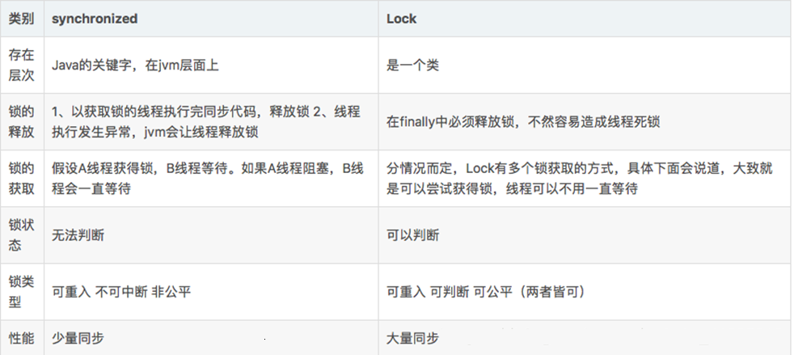

### Java锁体系
  
  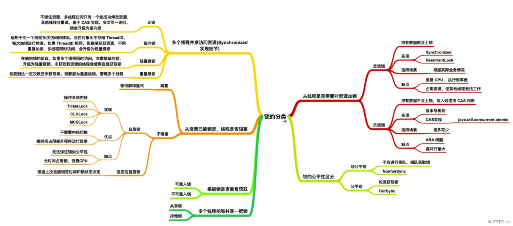

### Synchronized加锁方式

1. 同步实例方法，锁是当前实例对象
2. 同步类方法，锁是当前类对象
3. 同步代码块，锁是括号里面的对象

   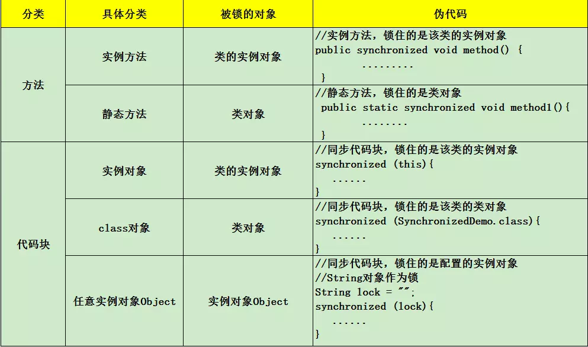

### Synchronized原理
    互斥性 ：Synchronized修饰的代码块、实例方法、静态方法，多线程并发访问时，只能有一个线程获取到锁，其它线程都处于阻塞等待
    可见性： 某线程 A 对于进入 同步块之前或在 synchronized 中对于共享变量的操作，对于后续的持有同一个监视器锁的其他线程可见

### 重量级锁底层原理
    同步方法和同步代码块底层都是通过monitor来实现同步的。每个对象都与一个monitor相关联。
    同步方法是通过方法中的access_flags中设置ACC_SYNCHRONIZED标志来实现；
    同步代码块是通过monitorenter和monitorexit来实现。
    两个指令的执行是JVM通过调用操作系统的互斥原语mutex来实现，被阻塞的线程会被挂起、等待重新调度，
    会导致“用户态和内核态”两个态之间来回切换，对性能有较大影响。

### Synchronized优化
    从JDK6开始，就对synchronized的实现机制进行了较大调整，包括使用JDK5引进的CAS自旋之外，还增加了自适应的CAS自旋、锁消除、锁粗化、偏向锁、轻量级锁这些优化策略。在 JDK 1.6 中默认是开启偏向锁的，可以通过-XX:-UseBiasedLocking来禁用偏向锁。使用-XX:-UseSpinning参数关闭自旋锁优化；-XX:PreBlockSpin参数修改默认的自旋次数。
    偏向锁：无实际竞争，且将来只有第一个申请锁的线程会使用锁。
    轻量级锁：无实际竞争，多个线程交替使用锁；允许短时间的锁竞争。
    重量级锁：有实际竞争，且锁竞争时间长。
  
  
  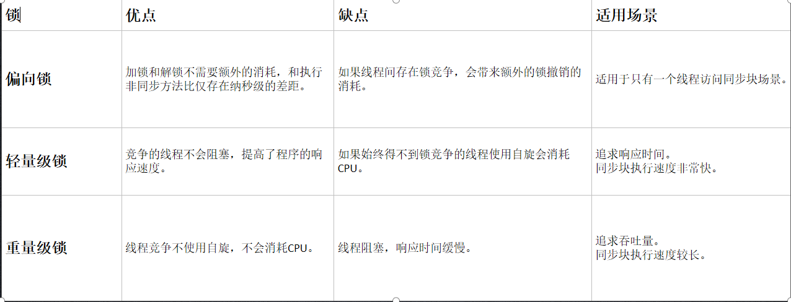

### 对象内存结构
Java 对象存储在内存中，分别分为三个部分，即对象头、实例数据和对齐填充，而在其对象头中，保存了锁标识。 
    
    hash： 保存对象的哈希码
    age： 保存对象的分代年龄
    biased_lock： 偏向锁标识位
    lock： 锁状态标识位
    Thread ID： 保存持有偏向锁的线程epoch： 保存偏向时间戳
  
  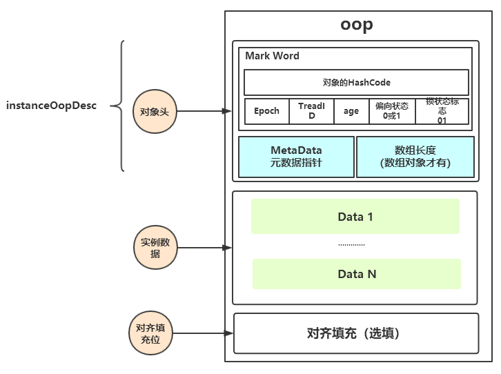

### Mark Word
以32位JVM中存储内容为例
  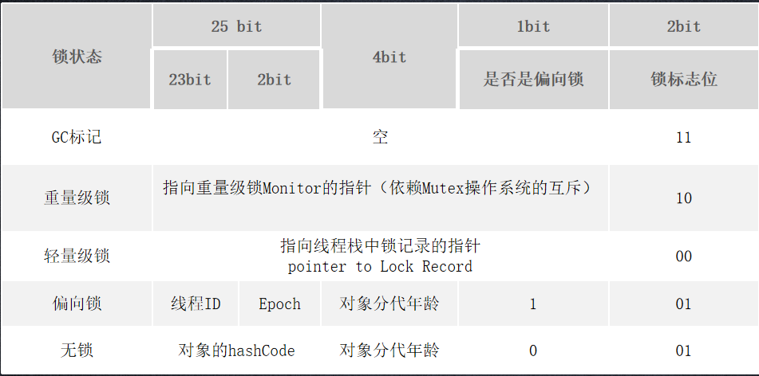

### 锁记录（ Lock Record）
    当字节码解释器执行monitorenter字节码轻度锁住一个对象时，就会在获取锁的线程的栈上显式或者隐式分配一个锁记录（ lock record ）,用于存储锁对象的Mark Word的拷贝。
    Lock Record是线程私有的数据结构，每一个线程都有一个可用Lock Record列表，同时还有一个全局的可用列表。
    每一个被锁住的对象Mark Word都会和一个Lock Record关联（对象头的锁记录指针指向Lock Record的起始地址），
    同时Lock Record中有一个Owner字段存放拥有该锁的线程的唯一标识（object mark word），表示该锁被这个线程占用。
  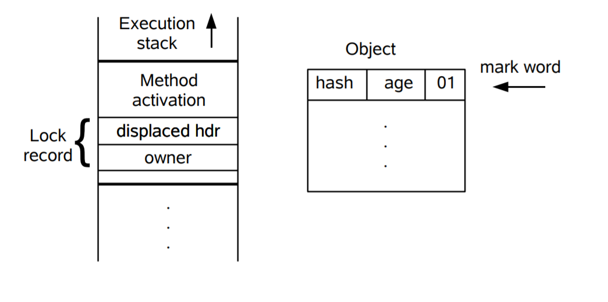   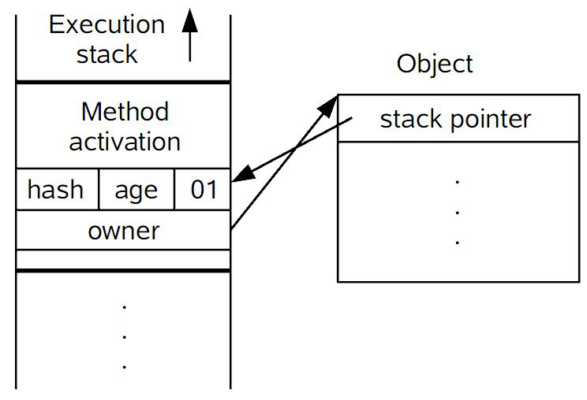

### Monitor机制
#### Monitor概念
    管程，监视器。在操作系统中，存在着semaphore和mutex，即信号量和互斥量，使用基本的mutex进行开发时，
    需要小心的使用mutex的down和up操作，否则容易引发死锁问题。
    为了更好的编写并发程序，在mutex和semaphore基础上，提出了更高层次的同步原语，
    实际上，monitor属于编程语言的范畴，C语言不支持monitor，而java支持monitor机制。
    一个重要特点是，在同一时间，只有一个线程/进程能进入monitor所定义的临界区，
    这使得monitor能够实现互斥的效果。无法进入monitor的临界区的进程/线程，应该被阻塞，
    并且在适当的时候被唤醒。显然，monitor作为一个同步工具，也应该提供这样管理线程/进程的机制。

#### Monitor基本元素
    • 临界区
    • monitor对象和锁
    • 条件变量以及定义在monitor对象上的wait，signal操作
    使用monitor主要是为了互斥进入临界区，为了能够阻塞无法进入临界区的进程，线程，需要一个monitor object来协助，这个object内部会有相应的数据结构，例如列表，用来保存被阻塞的线程；同时由于monitor机制本质是基于mutex原语的，所以object必须维护一个基于mutex的锁。

#### 临界区的圈定
    被synchronized关键字修饰的方法，代码块，就是monitor机制的临界区

#### Monitor object
    java.lang.Object 类定义了 wait()，notify()，notifyAll() 方法，这些方法的具体实现，依赖于一个叫 ObjectMonitor 模式的实现，这是 JVM 内部基于 C++ 实现的一套机制
    monitor 的机制中，monitor object 充当着维护 mutex以及定义 wait/signal API 来管理线程的阻塞和唤醒的角色。任何一个 Java 对象都可以作为 monitor 机制的 monitor object
    
    当一个线程需要获取 Object 的锁时，会被放入 EntrySet 中进行等待，如果该线程获取到了锁，
    成为当前锁的 owner。如果根据程序逻辑，一个已经获得了锁的线程缺少某些外部条件，
    而无法继续进行下去（例如生产者发现队列已满或者消费者发现队列为空），那么该线程可以通过调用
     wait 方法将锁释放，进入 wait set 中阻塞进行等待，其它线程在这个时候有机会获得锁，去干其它的事情，
     从而使得之前不成立的外部条件成立，这样先前被阻塞的线程就可以重新进入 EntrySet 去竞争锁。
     这个外部条件在 monitor 机制中称为条件变量。
   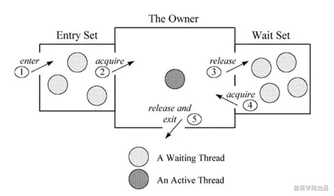

### Synchronized锁升级过程
   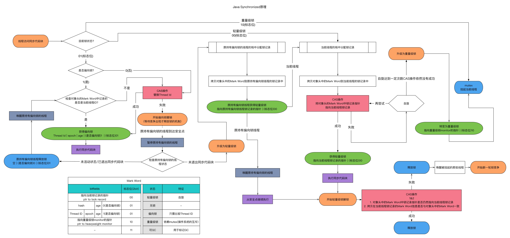
   
   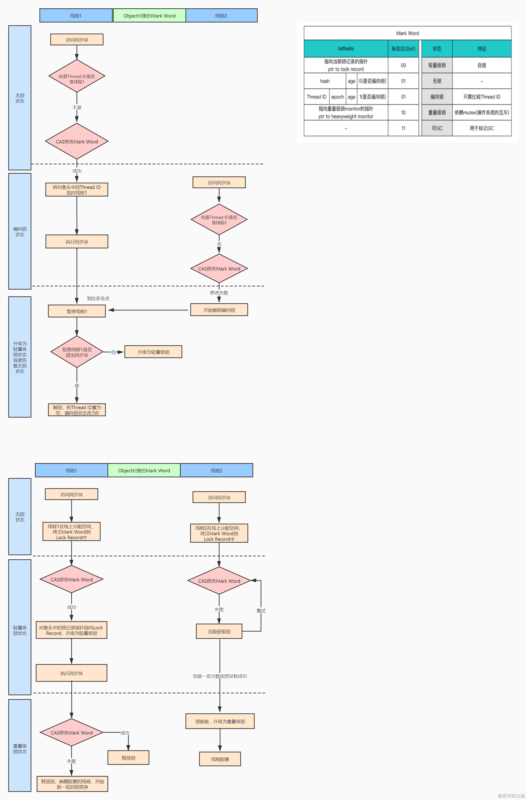

