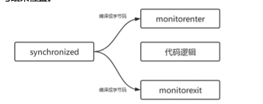
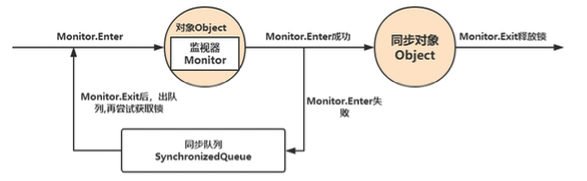

### 1. 线程安全问题
多线程编程中，有可能会出现多个线程同时访问同一个共享、可变资源的情况；这种资源可能是：对象、变量、文件等。由于线程执行的过程是不可控的，容易产生线程安全问题。
共享：资源可以由多个线程同时访问
可变：资源可以在其生命周期内被修改

如何解决线程安全问题：
所有的并发模式在解决线程安全问题时，采用的方案都是序列化访问临界资源。

###  2. Synchronized和Lock

  

### 3. Java锁体系
  
  

### 4. Synchronized 

  Synchronized 内置锁是一种对象锁(锁的是对象而非引用)，作用粒度是对象，可以用来实现对临界资源的同步互斥访问，是可以重入的。

#### 4.1 Synchronized加锁方式

1. 同步实例方法，锁是当前实例对象
2. 同步类方法，锁是当前类对象
3. 同步代码块，锁是括号里面的对象

   

#### 4.2 Synchronized原理

    互斥性 ：Synchronized修饰的代码块、实例方法、静态方法，多线程并发访问时，只能有一个线程获取到锁，其它线程都处于阻塞等待
    可见性： 某线程 A 对于进入 同步块之前或在 synchronized 中对于共享变量的操作，对于后续的持有同一个监视器锁的其他线程可见

  synchronized 是基于JVM 内置锁实现，通过内部对象Monitor(监视器锁)实现，基于进入与退出Monitor 对象实现方法与代码块同步，监视器锁的实现依赖底层
  操作系统的*Mutex Lock*(互斥锁)实现，是一个重量级锁性能较低，但 JVM 在jdk1.5 之后的版本做了很大的优化，如锁粗化，锁消除，轻量级锁，偏向锁，适应性自旋，
  等技术来减少锁操作的开销，它的并发性能已经基本和lock 持平。

   synchronized 关键字被编译成字节码后会被翻译为 monitorenter 和 monitorexit 两条指令分别在同步块逻辑的起始位置和结束位置



   每个同步对象都有一个自己的Monitor(监视器锁), 加锁过程如下: 



#### 4.3 重量级锁底层原理

    同步方法和同步代码块底层都是通过monitor来实现同步的。每个对象都与一个monitor相关联。
    同步方法是通过方法中的access_flags中设置ACC_SYNCHRONIZED标志来实现；
    同步代码块是通过monitorenter和monitorexit来实现。
    两个指令的执行是JVM通过调用操作系统的互斥原语mutex来实现，被阻塞的线程会被挂起、等待重新调度，
    会导致“用户态和内核态”两个态之间来回切换，对性能有较大影响。

  任何一个对象都有一个Monitor与之关联，当且一个Monitor被持有后，它将处于锁定状态。Synchronized在JVM里的实现都是基于进入和退出Monitor
  对象来实现方法同步和代码块同步，虽然具体实现细节不一样，但是都可以通过成对的MonitorEnter和 MonitorExit指令来实现。

  monitorenter:每个对象都是一个监视器锁(monitor)。当monitor被占用时就会处于锁定状态，线程执行 monitorenter指令时尝试获取monitor的所有权，
  过程如下:

    a. 如果monitor的进入数为0，则该线程进入monitor，然后将进入数设置为1，该线程即为monitor 的所有者;
    b. 如果线程已经占有该monitor，只是重新进入，则进入monitor的进入数加1;
    c. 如果其他线程已经占用了monitor，则该线程进入阻塞状态，直到monitor的进入数为0，再重新尝 试获取monitor的所有权;

  monitorexit:执行monitorexit的线程必须是objectref所对应的monitor的所有者。指令执行时，monitor的进入数减 1，如果减1后进入数为0，
  那线程退出monitor，不再是这个monitor的所有者。其他被这个monitor阻塞的线程可以尝试去 获取这个 monitor 的所有权。

  monitorexit，指令出现了两次，第1次为同步正常退出释放锁;第2次为发生异步退出释放锁;

  通过描述，我们应该能很清楚的看出Synchronized的实现原理，Synchronized的语义底层是通过一个monitor的对象来 完成，
  其实wait/notify等方法也依赖于monitor对象，这就是为什么只有在同步的块或者方法中才能调用wait/notify等方法，
  否则会抛出java.lang.IllegalMonitorStateException的异常的原因。

  同步方法: 

```java
package com.wlz.learnjuc.sync;

public class SynchronizedMethod {

    public synchronized void method() {
        System.out.println(".....");
    }
}

```

``` 
public synchronized void method();
    descriptor: ()V
    flags: ACC_PUBLIC, ACC_SYNCHRONIZED
    Code:
      stack=2, locals=1, args_size=1
         0: getstatic     #2                  // Field java/lang/System.out:Ljava/io/PrintStream;
         3: ldc           #3                  // String .....
         5: invokevirtual #4                  // Method java/io/PrintStream.println:(Ljava/lang/String;)V
         8: return
      LineNumberTable:
        line 10: 0
        line 11: 8
      LocalVariableTable:
        Start  Length  Slot  Name   Signature
            0       9     0  this   Lcom/wlz/learnjuc/sync/SynchronizedMethod;
```

  从编译的结果来看，方法的同步并没有通过指令 monitorenter 和 monitorexit 来完成(理论上其实也可以通过这两条指令来 实现)，
  不过相对于普通方法，其常量池中多了 ACC_SYNCHRONIZED 标示符。JVM就是根据该标示符来实现方法的同步的:
     
    当方法调用时，调用指令将会检查方法的 ACC_SYNCHRONIZED 访问标志是否被设置，如果设置了，执行线程将先获取 monitor，获取成功之后才能执行方法体，
    方法执行完后再释放monitor。在方法执行期间，其他任何线程都无法再获得同一个 monitor对象。

   两种同步方式本质上没有区别，只是方法的同步是一种隐式的方式来实现，无需通过字节码来完成。两个指令的执行是JVM通过调用操作系统的
   互斥原语mutex来实现，被阻塞的线程会被挂起、等待重新调度，会导致“用户态和内核态”两个态之间来回切 换，对性能有较大影响。

#### 4.4  Synchronized优化
    从JDK6开始，就对synchronized的实现机制进行了较大调整，包括使用JDK5引进的CAS自旋之外，还增加了自适应的CAS自旋、锁消除、锁粗化、偏向锁、轻量级锁这些优化策略。在 JDK 1.6 中默认是开启偏向锁的，可以通过-XX:-UseBiasedLocking来禁用偏向锁。使用-XX:-UseSpinning参数关闭自旋锁优化；-XX:PreBlockSpin参数修改默认的自旋次数。
    偏向锁：无实际竞争，且将来只有第一个申请锁的线程会使用锁。
    轻量级锁：无实际竞争，多个线程交替使用锁；允许短时间的锁竞争。
    重量级锁：有实际竞争，且锁竞争时间长。
  
  
  

### 5. Monitor机制

  什么是monitor : 可以把它理解为 一个同步工具，也可以描述为 一种同步机制，它通常被 描述为一个对象。与一切皆对象一样，
  所有的Java对象是天生的Monitor，每一个Java对象都有成为Monitor的潜质，因为在Java的设计中 ，每一个Java对象自打娘胎里出来就带了一把看不见的锁，
  它叫做内部锁或者Monitor锁。也就是通常说Synchronized的对象锁，MarkWord锁标识位为10，其中指针指向的 是Monitor对象的起始地址。
  在Java虚拟机(HotSpot)中，Monitor是由ObjectMonitor实现的，其主要数据结构如下
  (位于 HotSpot虚拟机源码ObjectMonitor.hpp文件，C++实现的):

```c++
ObjectMonitor() {
  _header = NULL;
  _count = 0; // 记录个数
  _waiters = 0,
  _recursions = 0;
  _object = NULL;
  _owner = NULL;
  _WaitSet = NULL; // 处于wait状态的线程，会被加入到_WaitSet
  _WaitSetLock = 0 ;
  _Responsible = NULL ;
  _succ = NULL ;
  _cxq = NULL ;
  FreeNext = NULL ;
  _EntryList = NULL ; // 处于等待锁block状态的线程，会被加入到该列表
  _SpinFreq = 0 ;
  _SpinClock = 0 ;
 OwnerIsThread = 0 ;
}
```

  ObjectMonitor中有两个队列，_WaitSet 和 _EntryList，用来保存ObjectWaiter对象列表( 每个等待锁的线程都会被封装成 ObjectWaiter对象 )，
  _owner指向持有ObjectMonitor对象的线程，当多个线程同时访问一段同步代码时:

    1. 首先会进入 _EntryList 集合，当线程获取到对象的monitor后，进入 _Owner区域并把monitor中的owner变量设置为当 前线程，同时monitor中的计数器count加1;
    2. 若线程调用 wait() 方法，将释放当前持有的monitor，owner变量恢复为null，count自减1，同时该线程进入 WaitSet 集合中等待被唤醒;
    3. 若当前线程执行完毕，也将释放monitor(锁)并复位count的值，以便其他线程进入获取monitor(锁);

  同时，Monitor对象存在于每个Java对象的对象头Mark Word中(存储的指针的指向)，Synchronized锁便是通过这种方式获取锁的，
  也是为什么Java中任意对象可以作为锁的原因，同时notify/notifyAll/wait等方法会使用到Monitor锁对象，所以必须在同步代码块中使用。
  监视器Monitor有两种同步方式:互斥与协作。多线程环境下线程之间如果需要共享数据，需要解决互斥访问 数据的问题，
  监视器可以确保监视器上的数据在同一时刻只会有一个线程在访问。

  那么有个问题来了，我们知道synchronized加锁加在对象上，对象是如何记录锁状态的呢?答案是锁状态是被记录在每个对象的对象头(Mark Word)中。


#### 5.1 Monitor概念
    管程，监视器。在操作系统中，存在着semaphore和mutex，即信号量和互斥量，使用基本的mutex进行开发时，
    需要小心的使用mutex的down和up操作，否则容易引发死锁问题。
    为了更好的编写并发程序，在mutex和semaphore基础上，提出了更高层次的同步原语，
    实际上，monitor属于编程语言的范畴，C语言不支持monitor，而java支持monitor机制。
    一个重要特点是，在同一时间，只有一个线程/进程能进入monitor所定义的临界区，
    这使得monitor能够实现互斥的效果。无法进入monitor的临界区的进程/线程，应该被阻塞，
    并且在适当的时候被唤醒。显然，monitor作为一个同步工具，也应该提供这样管理线程/进程的机制。

#### 5.2 Monitor基本元素
    • 临界区
    • monitor对象和锁
    • 条件变量以及定义在monitor对象上的wait，signal操作
    使用monitor主要是为了互斥进入临界区，为了能够阻塞无法进入临界区的进程，线程，需要一个monitor object来协助，这个object内部会有相应的数据结构，例如列表，用来保存被阻塞的线程；同时由于monitor机制本质是基于mutex原语的，所以object必须维护一个基于mutex的锁。

#### 5.3 临界区的圈定
    被synchronized关键字修饰的方法，代码块，就是monitor机制的临界区

#### 5.4 Monitor object
    java.lang.Object 类定义了 wait()，notify()，notifyAll() 方法，这些方法的具体实现，依赖于一个叫 ObjectMonitor 模式的实现，这是 JVM 内部基于 C++ 实现的一套机制
    monitor 的机制中，monitor object 充当着维护 mutex以及定义 wait/signal API 来管理线程的阻塞和唤醒的角色。任何一个 Java 对象都可以作为 monitor 机制的 monitor object
    
    当一个线程需要获取 Object 的锁时，会被放入 EntrySet 中进行等待，如果该线程获取到了锁，
    成为当前锁的 owner。如果根据程序逻辑，一个已经获得了锁的线程缺少某些外部条件，
    而无法继续进行下去（例如生产者发现队列已满或者消费者发现队列为空），那么该线程可以通过调用
     wait 方法将锁释放，进入 wait set 中阻塞进行等待，其它线程在这个时候有机会获得锁，去干其它的事情，
     从而使得之前不成立的外部条件成立，这样先前被阻塞的线程就可以重新进入 EntrySet 去竞争锁。
     这个外部条件在 monitor 机制中称为条件变量。
   


### 6. 对象内存结构

Java 对象存储在内存中，分别分为三个部分，即对象头、实例数据和对齐填充，而在其对象头中，保存了锁标识。

    hash： 保存对象的哈希码
    age： 保存对象的分代年龄
    biased_lock： 偏向锁标识位
    lock： 锁状态标识位
    Thread ID： 保存持有偏向锁的线程epoch： 保存偏向时间戳


#### 6.1 Mark Word
以32位JVM中存储内容为例


#### 6.2 锁记录（ Lock Record）
    当字节码解释器执行monitorenter字节码轻度锁住一个对象时，就会在获取锁的线程的栈上显式或者隐式分配一个锁记录（ lock record ）,用于存储锁对象的Mark Word的拷贝。
    Lock Record是线程私有的数据结构，每一个线程都有一个可用Lock Record列表，同时还有一个全局的可用列表。
    每一个被锁住的对象Mark Word都会和一个Lock Record关联（对象头的锁记录指针指向Lock Record的起始地址），
    同时Lock Record中有一个Owner字段存放拥有该锁的线程的唯一标识（object mark word），表示该锁被这个线程占用。
   

#### 6.3 对象头分析工具 

运行时对象头锁状态分析工具JOL，他是OpenJDK开源工具包，引入下方maven依赖

```xml
<dependency>
    <groupId>org.openjdk.jol</groupId>
    <artifactId>jol‐core</artifactId>
    <version>0.10</version>
</dependency>
```

 打印markword

```java
package com.wlz.learnjuc.sync;

import org.openjdk.jol.info.ClassLayout;

public class PrintMarkWord {

    public static void main(String[] args) {
        Object o = new Object();
        System.out.println(ClassLayout.parseInstance(o).toPrintable());
    }
}

// 结果
java.lang.Object object internals:
        OFFSET  SIZE   TYPE DESCRIPTION                               VALUE
        0     4        (object header)                           01 00 00 00 (00000001 00000000 00000000 00000000) (1)
        4     4        (object header)                           00 00 00 00 (00000000 00000000 00000000 00000000) (0)
        8     4        (object header)                           28 0f 00 00 (00101000 00001111 00000000 00000000) (3880)
        12     4        (loss due to the next object alignment)
        Instance size: 16 bytes
        Space losses: 0 bytes internal + 4 bytes external = 4 bytes total
```

### 7. Synchronized锁升级过程

#### 7.1 偏向锁

  偏向锁是Java 6之后加入的新锁，它是一种针对加锁操作的优化手段，经过研究发现，在大多数情况下，锁不仅不存在多线程竞争，而且总是由同一线程多次获得，
  因此为了减少同一线程获取锁(会涉及到一些CAS操作,耗时)的代价而引入偏向锁。偏向锁的核心 思想是，如果一个线程获得了锁，那么锁就进入偏向模式，
  此时Mark Word 的结构也变为偏向锁结构，当这个线程再次请求锁时， 无需再做任何同步操作，即获取锁的过程，这样就省去了大量有关锁申请的操作，
  从而也就提供程序的性能。所以，对于没有锁竞争 的场合，偏向锁有很好的优化效果，毕竟极有可能连续多次是同一个线程申请相同的锁。
  但是对于锁竞争比较激烈的场合，偏向锁就 失效了，因为这样场合极有可能每次申请锁的线程都是不相同的，因此这种场合下不应该使用偏向锁，
  否则会得不偿失，需要注意的 是，偏向锁失败后，并不会立即膨胀为重量级锁，而是先升级为轻量级锁。

```
默认开启偏向锁
开启偏向锁:-XX:+UseBiasedLocking -XX:BiasedLockingStartupDelay=0 关闭偏向锁:-XX:-UseBiasedLocking
```

#### 7.2 轻量级锁 

  倘若偏向锁失败，虚拟机并不会立即升级为重量级锁，它还会尝试使用一种称为轻量级锁的优化手段(1.6之后加入的)，此时Mark Word 的结构也变为轻量级锁的结构。
  轻量级锁能够提升程序性能的依据是“对绝大部分的锁，在整个同步周期内都不存在竞 争”，注意这是经验数据。需要了解的是，
  轻量级锁所适应的场景是线程交替执行同步块的场合，如果存在同一时间访问同一锁的场 合，就会导致轻量级锁膨胀为重量级锁。

#### 7.3 自旋锁

  轻量级锁失败后，虚拟机为了避免线程真实地在操作系统层面挂起，还会进行一项称为自旋锁的优化手段。这是基于在大多数情况下，线程持有锁的时间都不会太长，
  如果直接挂起操作系统层面的线程可能会得不偿失，毕竟操作系统实现线程之间的切换时需要 从用户态转换到核心态，这个状态之间的转换需要相对比较长的时间，
  时间成本相对较高，因此自旋锁会假设在不久将来，当前的线 程可以获得锁，因此虚拟机会让当前想要获取锁的线程做几个空循环(这也是称为自旋的原因)，
  一般不会太久，可能是50个循环或 100循环，在经过若干次循环后，如果得到锁，就顺利进入临界区。如果还不能获得锁，那就会将线程在操作系统层面挂起，
  这就是 自旋锁的优化方式，这种方式确实也是可以提升效率的。最后没办法也就只能升级为重量级锁了。
  

#### 7.4 锁消除 

  消除锁是虚拟机另外一种锁的优化，这种优化更彻底，Java虚拟机在JIT编译时(可以简单理解为当某段代码即将第一次被执行时进行编译，又称即时编译)，
  通过对运行上下文的扫描，去除不可能存在共享资源竞争的锁，通过这种方式消除没有必要的锁，可以 节省毫无意义的请求锁时间，
  如下StringBuffer的append是一个同步方法，但是在add方法中的StringBuffer属于一个局部变量，并 且不会被其他线程所使用，
  因此StringBuffer不可能存在共享资源竞争的情景，JVM会自动将其锁消除。锁消除的依据是逃逸分析的 数据支持。

```
锁消除，前提是java必须运行在server模式(server模式会比client模式作更多的优化)，同时必须开启逃逸分析:
-XX:+DoEscapeAnalysis 开启逃逸分析 
-XX:+EliminateLocks 表示开启锁消除。
```


```java
package com.wlz.learnjuc.sync;

/**
 * @author wlz
 * @date 2022-04-11  10:27 下午
 */
public class LockClearTest {

    public static void main(String[] args) {
        LockClearTest lockClearTest = new LockClearTest();
        for (int i = 0; i < 100000; i++) {
            lockClearTest.append("aa", "bb");
        }
    }

    public void append(String str1, String str2) {
        StringBuffer stringBuffer = new StringBuffer();
        stringBuffer.append(str1).append(str2);
    }
}


// StringBuffer.append()
@Override
public synchronized StringBuffer append(String str) {
  toStringCache = null;
  super.append(str);
  return this;
}
```

  从上述代码看出来，StringBuffer的append是个同步方法，但是LockClearTest中的 StringBuffer 属于一个局部变量，
  不可能从该方法中逃逸出去（即stringBuffer的引用没有传递到该方法外，不会被其他线程引用），因此其实这过程是线程安全的，可以将锁消除。


#### 7.5 锁粗化

  假设一系列的连续操作都会对同一个对象反复*加锁及解锁*，甚至加锁操作是出现在循环体中的，即使没有出现线程竞争，
  频繁地进行互斥同步操作也会导致不必要的性能损耗。

  如果JVM检测到有一连串零碎的操作都是对同一对象的加锁，将会扩大加锁同步的范围（即锁粗化）到整个操作序列的外部。

```java
package com.wlz.learnjuc.sync;

/**
 * @author wlz
 * @date 2022-04-11  10:31 下午
 */
public class LockAddTest {

    StringBuffer stringBuffer = new StringBuffer();

    public void append() {
        stringBuffer.append("a").append("b").append("c");
    }

    public static void main(String[] args) {
        LockAddTest lockAddTest = new LockAddTest();
        lockAddTest.append();
    }
}

```

  上述代码每次调用 stringBuffer.append 方法都需要加锁和解锁，如果JVM检测到有一连串的对同一个对象加锁和解锁的操作，
  就会将其合并成一次范围更大的加锁和解锁操作，即在第一次append方法时进行加锁，最后一次append方法结束后进行解锁。


### 锁升级过程

   
   
   


