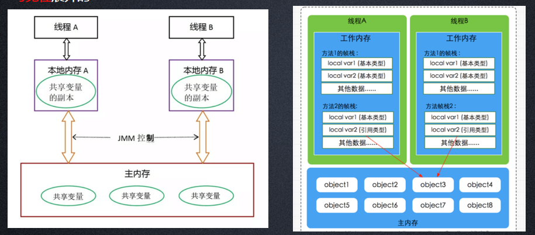

###  并发编程的本质是解决什么问题的？

#### 多线程编程：

​	分工: 任务拆解

​	同步：线程间协作

​	互斥：独占

####  并发如何去学？
1. JMM 模型   JAVA 线程的内存模式。（cpu缓存一致性协议 volatile  CAS）  
   并发的特性：原子性， 有序性，可见性 
2. 锁机制 内置锁（synchronized） juc（AQS 独占锁 共享锁 读写锁 等） 同步器 （队列 同步队列 条件队列）
3. 线程  是重量级线程   pthread_create (操作系统内核)   JavaThread ---- osThread  ----- nativeThread (系统底层)
4. 线程池 线程复用
5. 并发容器
6. 并行 fork-join   物理架构   同一时刻，多条指令在多个处理器上同时执行，无论是微观还是宏观都是一起执行
7. 并发          		  逻辑架构   同一时刻，只能有一条指令执行，但多个进程指令快速轮转执行，使得在宏观上是多个进程同时执行的效果，微观上并不是同时执行的，可以在一个核执行，也可以在多个核执行

并发编程优势: 并发可以将多核cpu 的计算能力发挥到极致，提升性能
并发编程的风险：
1. 高并发场景下，频繁上下文切换反而损耗性能
2. 活跃性（一个并发应用程序能及时执行的能力）问题，容易出现死锁 ，饥饿（while），活锁
3. 线程安全，多个线程共享数据时可能会产生与期望不相符的结果 
	 死锁的四个条件 （互斥，请求与保持，不可剥夺，循环等待）都满足也不一定发生死锁
	 饥饿 常见场景  有  while(true){}  情况下

### JMM(线程) 内存模型
	JSR133定义的规范，JMM描述的是一种抽象的概念，一组规则，通过这组规则控制程序中各个变量在共享数据区域和私有数据区域的访问方式，JMM是围绕原子性、有序性、可见性展开的

 

### JMM与硬件内存架构的关系
	JMM模型跟CPU缓存模型结构类似，是基于CPU缓存模型建立起来的，JMM模型是标准化的，屏蔽掉了底层不同计算机的区别。对于硬件内存来说只有寄存器、缓存内存、主内存的概念，并没有工作内存(线程私有数据区域)和主内存(堆内存)之分，因为JMM只是一种抽象的概念，是一组规则，并不实际存在，不管是工作内存的数据还是主内存的数据，对于计算机硬件来说都会存储在计算机主内存中，当然也有可能存储到CPU缓存或者寄存器中。

### volatile 
 volatile是Java虚拟机提供的轻量级的同步机制
 volatile语义有如下两个作用
	可见性：保证被volatile修饰的共享变量对所有线程总数可见的，也就是当一个线程修改了一个被volatile修饰共享变量的值，新值总是可以被其他线程立即得知。
	有序性：禁止指令重排序优化。

 volatile缓存可见性实现原理
	JMM内存交互层面：volatile修饰的变量的read、load、use操作和assign、store、write必须是连续的，即修改后必须立即同步会主内存，使用时必须从主内存刷新，由此保证volatile变量的可见性。
	底层实现：通过汇编lock前缀指令，它会锁定变量缓存行区域并写回主内存，这个操作称为“缓存锁定”，缓存一致性机制会阻止同时修改被两个以上处理器缓存的内存区域数据。一个处理器的缓存回写到内存内存会导致其他处理器的缓存无效
 汇编代码查看
	-XX:+UnlockDiagnosticVMOptions -XX:+PrintAssembly -Xcomp

### CAS 
 CAS可以看做是乐观锁的一种实现方式，Java原子类中的递增操作就通过CAS自旋实现的。
 CAS全称Compare And Swap (比较与交换)，是一种无锁算法。在不使用锁(没有线程被阻塞)的情况下实现多线程之间的变量同步。
	LOCK_IF_MP(%4) "cmpxchgl %1,(%3)“     lock  cmpxchgl

 unsafe.compareAndSwapInt(this, valueOffset, expect, update)
 上面的方法，有几个重要的参数：
	this，Unsafe 对象本身，需要通过这个类来获取 value 的内存偏移地址
	valueOffset，value 变量的内存偏移地址
	expect，期望更新的值
	update，要更新的最新值
 如果原子变量中的 value 值等于 expect，则使用 update 值更新该值并返回 true，否则返回 false。

 缺点：
	只能保证对一个变量的原子性操作
	长时间自旋会给CPU带来压力
	ABA问题 （加版本号可解决）
	
 

 

