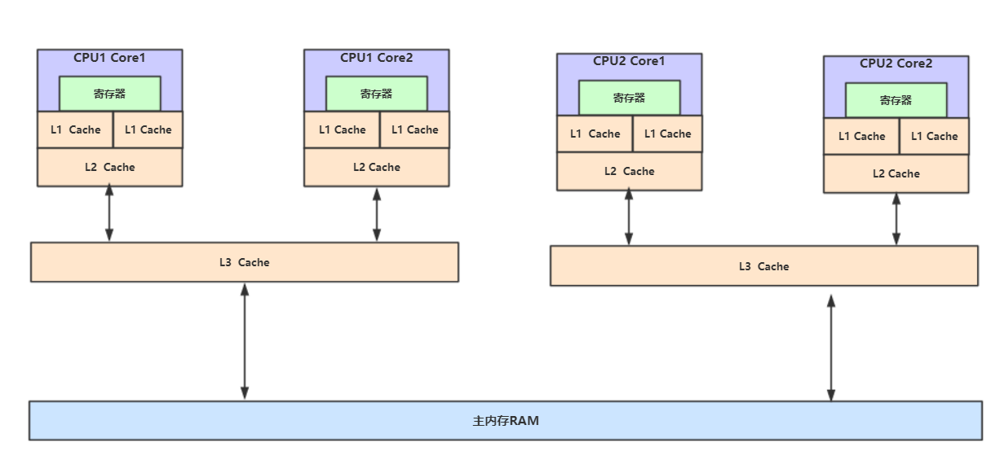
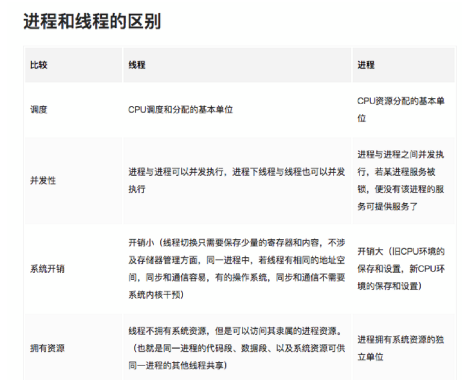
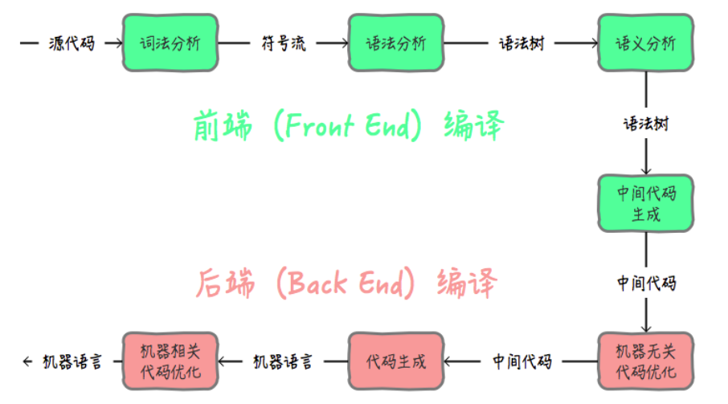

### 1. 冯诺伊曼计算机模型详解

  现代计算机模型是基于-冯诺依曼计算机模型

  计算机在运行时，先从内存中取出第一条指令，通过控制器的译码，按指令的要求，从存储器中取出数据进行指定的运算和逻辑操作等加工，
  然后再按地址把结果送到内存中去。 接下来，再取出第二条指令，在控制器的指挥下完成规定操作。依此进行下去。直至遇到停 止指令。
  
  程序与数据一样存贮，按程序编排的顺序，一步一步地取出指令，自动地完成指令规定 的操作是计算机最基本的工作模型。
  这一原理最初是由美籍匈牙利数学家冯.诺依曼于1945 年提出来的，故称为冯.诺依曼计算机模型。
  
#### 1.1 计算机五大核心组成部分

    1. 控制器(Control):是整个计算机的中枢神经，其功能是对程序规定的控制信息进行解释，根据其要求进行控制，调度程序、数据、地址，
      协调计算机各部分工作及内存与外设的访问等。
    
    2. 运算器(Datapath):运算器的功能是对数据进行各种算术运算和逻辑运算，即对数据 进行加工处理。

    3. 存储器(Memory):存储器的功能是存储程序、数据和各种信号、命令等信息，并在 需要时提供这些信息。

    4. 输入(Input system):输入设备是计算机的重要组成部分，输入设备与输出设备合你 为外部设备，简称外设，输入设备的作用是将程序、原始数据、
    文字、字符、控制命令或现 场采集的数据等信息输入到计算机。常见的输入设备有键盘、鼠标器、光电输入机、磁带 机、磁盘机、光盘机等。
    
    5. 输出(Output system):输出设备与输入设备同样是计算机的重要组成部分，它把外 算机的中间结果或最后结果、机内的各种数据符号及文字或各种
    控制信号等信息输出出来。 微机常用的输出设备有显示终端CRT、打印机、激光印字机、绘图仪及磁带、光盘机等。

 

  上面的模型是一个理论的抽象简化模型，它的具体应用就是现代计算机当中的硬件结构设计:

 

  在上图硬件结构当中，配件很多，但最核心的只有两部分:CPU、内存。
  
#### 1.2 CPU指令结构

  CPU内部结构: 控制单元、运算单元、数据单元

 

##### 1.2.1 控制单元

  控制单元是整个CPU的指挥控制中心，由指令寄存器IR(Instruction Register)、指 令译码器ID(Instruction Decoder)和 
  操作控制器OC(Operation Controller) 等组 成，对协调整个电脑有序工作极为重要。它根据用户预先编好的程序，依次从存储器中取出 各条指令，
  放在指令寄存器IR中，通过指令译码(分析)确定应该进行什么操作，然后通过 操作控制器OC，按确定的时序，向相应的部件发出微操作控制信号。
  操作控制器OC中主要 包括:节拍脉冲发生器、控制矩阵、时钟脉冲发生器、复位电路和启停电路等控制逻辑。
  
##### 1.2.2 运算单元

  运算单元是运算器的核心。可以执行算术运算(包括加减乘数等基本运算及其附加运算)和逻辑运算(包括移位、逻辑测试或两个值比较)。
  相对控制单元而言，运算器接受控制单元的命令而进行动作，即运算单元所进行的全部操作都是由控制单元发出的控制信号来指挥的，所以它是执行部件。
  
##### 1.2.3 存储单元

  存储单元包括 CPU 片内缓存Cache和寄存器组，是 CPU 中暂时存放数据的地方，里 面保存着那些等待处理的数据，或已经处理过的数据，
  CPU 访问寄存器所用的时间要比访 问内存的时间短。 寄存器是CPU内部的元件，寄存器拥有非常高的读写速度，所以在寄存 器之间的数据传送非常快。
  采用寄存器，可以减少 CPU 访问内存的次数，从而提高了 CPU 的工作速度。寄存器组可分为专用寄存器和通用寄存器。专用寄存器的作用是固定的，
  分别 寄存相应的数据;而通用寄存器用途广泛并可由程序员规定其用途。
  
#### 1.3 CPU 缓存结构

  现代CPU为了提升执行效率，减少CPU与内存的交互(交互影响CPU效率)，一般在CPU上集 成了多级缓存架构，常见的为三级缓存结构
  
    L1 Cache，分为数据缓存和指令缓存，逻辑核独占 
    
    L2 Cache，物理核独占，逻辑核共享
    
    L3 Cache，所有物理核共享


   存储器存储空间大小:内存>L3>L2>L1>寄存器; 

   存储器速度快慢排序:寄存器>L1>L2>L3>内存; 
   
   还有一点值得注意的是:缓存是由最小的存储区块-缓存行(cacheline)组成，缓存行大小通 常为64byte。

   缓存行是什么意思呢?

    比如你的L1缓存大小是512kb,而cacheline = 64byte,那么就是L1里有512 * 1024/64个cacheline

##### 1.3.1 CPU读取存储器数据过程

   1、CPU要取寄存器X的值，只需要一步:直接读取。

   2、CPU要取L1 cache的某个值，需要1-3步(或者更多):把cache行锁住，把某个数据拿来，解 锁，如果没锁住就慢了。

   3、CPU要取L2 cache的某个值，先要到L1 cache里取，L1当中不存在，在L2里，L2开始加锁，加 锁以后，把L2里的数据复制到L1，再执行读L1的过程，上面的3步，再解锁。
   
   4、CPU取L3 cache的也是一样，只不过先由L3复制到L2，从L2复制到L1，从L1到CPU。

   5、CPU取内存则最复杂:通知内存控制器占用总线带宽，通知内存加锁，发起内存读请求，等待 回应，回应数据保存到L3(如果没有就到L2)，再从L3/2到L1，再从L1到CPU，之后解除总线锁 定。
   
##### 1.3.2 CPU为何要有高速缓存

  CPU在摩尔定律的指导下以每18个月翻一番的速度在发展，然而内存和硬盘的发展速度远远不及CPU。这就造成了高性能能的内存和硬盘价格及其昂贵。
  然而CPU的高度运算需要高速的数据。为了解决 这个问题，CPU厂商在CPU中内置了少量的高速缓存以解决I\O速度和CPU运算速度之间的不匹配问题。
  在CPU访问存储设备时，无论是存取数据抑或存取指令，都趋于聚集在一片连续的区域中，这就被称为局部性原理。

    1. 时间局部性(Temporal Locality):如果一个信息项正在被访问，那么在近期它很可能还会被再次访问。 比如循环、递归、方法的反复调用等。

    2. 空间局部性(Spatial Locality):如果一个存储器的位置被引用，那么将来他附近的位置也会被引用。 比如顺序执行的代码、连续创建的两个对象、数组等。

###### 1.3.2.1 示例 

```java
package cpu;

/**
 *  空间局部性原则
 * @author wlz
 * @date 2022-03-30  10:13 下午
 */
public class TwoDimensionalArraySum {

    private static final int RUNS = 100;

    private static final int DIMENSION_1 = 1024 * 1024;

    private static final int DIMENSION_2 = 6;

    private static long[][] longs;

    public static void main(String[] args) {
        // 初始化数组
        longs = new long[DIMENSION_1][];
        for (int i = 0; i < DIMENSION_1; i++) {
            longs[i] = new long[DIMENSION_2];
            for (int j = 0; j < DIMENSION_2; j++) {
                longs[i][j] = 1L;
            }
        }
        System.out.println("array初始化完成......");

        long sum = 0L;
        long start = System.currentTimeMillis();
        for (int r = 0; r < RUNS; r++) {
            for (int i = 0; i < DIMENSION_1; i++) {
                for (int j = 0; j < DIMENSION_2; j++) {
                    sum += longs[i][j];
                }
            }
        }

        System.out.println("spend time1:" + (System.currentTimeMillis() - start));
        System.out.println("sum1:" + sum);

        sum = 0L;
        start = System.currentTimeMillis();
        for (int r = 0; r < RUNS; r++) {
            for (int j = 0; j < DIMENSION_2; j++) {
                for (int i = 0; i < DIMENSION_1; i++) {
                    sum += longs[i][j];
                }
            }
        }
        System.out.println("spend time2:" + (System.currentTimeMillis() - start));
        System.out.println("sum2:" + sum);

    }
}

// 结果
array初始化完成......
        spend time1:515
        sum1:629145600
        spend time2:1261
        sum2:629145600

```

##### 1.3.3 带有高速缓存的CPU执行计算的流程

   1. 程序以及数据被加载到主内存
   2. 指令和数据被加载到CPU的高速缓存 
   3. CPU执行指令，把结果写到高速缓存 
   4. 高速缓存中的数据写回主内存

#### 1.4 CPU 运行安全等级

   CPU有4个运行级别，分别为: ring0、ring1、 ring2、 ring3
  
   Linux与Windows只用到了2个级别:ring0、ring3，操作系统内部内部程序指令通常运 行在ring0级别，操作系统以外的第三方程序运行在ring3级别，
   第三方程序如果要调用操作 系统内部函数功能，由于运行安全级别不够,必须切换CPU运行状态，从ring3切换到ring0, 然后执行系统函数，
   所以为什么JVM创建线程，线程阻塞唤醒是重型操作了，因为CPU要切换运行状态。

##### 1.4.2 JVM创建线程CPU的工作过程

   step1:CPU从ring3切换ring0创建线程
   
   step2:创建完毕,CPU从ring0切换回ring3 
   
   step3:线程执行JVM程序 
   
   step4:线程执行完毕，销毁还得切会ring0

### 2. 操作系统内存管理

#### 2.1 执行空间保护

   操作系统有用户空间与内核空间两个概念，目的也是为了做到程序运行安全隔离与稳定，以 32位操作系统4G大小的内存空间为例


   Linux为内核代码和数据结构预留了几个页框，这些页永远不会被转出到磁盘上。从 0x00000000 到 0xc0000000(PAGE_OFFSET) 的线性地址可由
   用户代码 和 内核代码进 行引用(即用户空间)。从0xc0000000(PAGE_OFFSET)到 0xFFFFFFFFF的线性地址只 能由内核代码进行访问(即内核空间)。
   内核代码及其数据结构都必须位于这 1 GB的地址 空间中，但是对于此地址空间而言，更大的消费者是物理地址的虚拟映射。

   这意味着在 4 GB 的内存空间中，只有 3 GB 可以用于用户应用程序。进程与线程只能 运行在用户方式(usermode)或内核方式(kernelmode)下。
   用户程序运行在用户方式 下，而系统调用运行在内核方式下。在这两种方式下所用的堆栈不一样:用户方式下用的是 一般的堆栈(用户空间的堆栈)，
   而内核方式下用的是固定大小的堆栈(内核空间的对战，一 般为一个内存页的大小)，即每个进程与线程其实有两个堆栈，分别运行与用户态与内核态。

   由空间划分我们再引深一下，CPU调度的基本单位线程，也划分为:

    1、内核线程模型(KLT) 
    
    2、用户线程模型(ULT)

##### 2.1.1 内核线程模型


   内核线程(KLT):系统内核管理线程(KLT),内核保存线程的状态和上下文信息，线程阻塞不会 引起进程阻塞。在多处理器系统上，
   多线程在多处理器上并行运行。线程的创建、调度和管 理由内核完成，效率比ULT要慢，比进程操作快。
   
##### 2.1.2 用户线程模型


   用户线程(ULT):用户程序实现,不依赖操作系统核心,应用提供创建、同步、调度和管理线程的函数来控制用户线程。不需要用户态/内核态切换，速度快。
   内核对ULT无感知，线程阻塞则进程(包括它的所有线程)阻塞。 (jvm 采用的是 内核线程模型)

### 3. 虚拟机指令集架构

Java符合典型的栈指令集架构特征，像Python、Go都属于这种架构。

#### 3.1 栈指令集架构

1. 设计和实现更简单,适用于资源受限的系统;

2. 避开了寄存器的分配难题:使用零地址指令方式分配;

3. 指令流中的指令大部分是零地址指令,其执行过程依赖与操作栈,指令集更小,编译器 容易实现;

4. 不需要硬件支持,可移植性更好,更好实现跨平台。

#### 3.2 寄存器指令集架构

1. 典型的应用是x86的二进制指令集:比如传统的PC以及Android的Davlik虚拟机。

2. 指令集架构则完全依赖硬件,可移植性差。

3. 性能优秀和执行更高效。

4. 花费更少的指令去完成一项操作。

5. 在大部分情况下,基于寄存器架构的指令集往往都以一地址指令、二地址指令和三 地址指令为主,而基于栈式架构的指令集却是以零地址指令为主。


### 4. CPU缓存架构

**多cup** ： 多个物理CPU，CPU通过总线进行通信，效率比较低。  多cpu的运行，对应进程的运行状态 。

**多核cup**： 不同的核可以通过L3 cache进行通信，存储和外设通过总线与CPU通信 。 多核cpu的运行，对应线程的运行状态。

**CPU寄存器**：每个CPU都包含一系列的寄存器，它们是CPU内内存的基础。CPU在寄存器上执行操作的速度远大于在主存上执行的速度。这是因为CPU访问寄存器的速度远大于主存。
**CPU缓存**：即高速缓冲存储器，是位于CPU与主内存间的一种容量较小但速度很高的存储器。由于CPU的速度远高于主内存，CPU直接从内存中存取数据要等待一定时间周期，Cache中保存着CPU刚用过或循环使用的一部分数据，当CPU再次使用该部分数据时可从Cache中直接调用,减少CPU的等待时间，提高了系统的效率。

**内存** ： 一个计算机还包含一个主存，所有的CPU都可以访问主存。主存通常比CPU中的缓存大得多。

多cpu和多核cup架构图：



**缓存一致性问题**
在多处理器系统中，每个处理器都有自己的高速缓存，而它们又共享同一主内存（MainMemory）。基于高速缓存的存储交互很好地解决了处理器与内存的速度矛盾，但是也引入了新的问题：缓存一致性（CacheCoherence）。当多个处理器的运算任务都涉及同一块主内存区域时，将可能导致各自的缓存数据不一致的情况，如果真的发生这种情况，那同步回到主内存时以谁的缓存数据为准呢？为了解决一致性的问题，需要各个处理器访问缓存时都遵循一些协议，在读写时要根据协议来进行操作，这类协议有MSI、
MESI（IllinoisProtocol）、MOSI、Synapse、Firefly及DragonProtocol  等等。

### 5. 进程和线程

#### 5.1 什么是进程?

进程是*OS(操作系统)资源分配的最小单位*，现代操作系统在运行一个程序时，会为其创建一个进程;例如，启动一个Java程序，操作系统就会创建一个Java进程。

#### 5.2 什么是线程？

线程是*OS(操作系统)调度CPU的最小单元*，也叫轻量级进程(Light Weight Process)， 在一个进程里可以创建多个线程，这些线程都拥有各自的计数器、
堆栈和局部变量等属性， 并且能够访问共享的内存变量。CPU在这些线程上高速切换，让使用者感觉到这些线程在同 时执行，即并发的概念，
相似的概念还有并行!

线程上下文切换过程:

进程是程序的一次执行，一个程序有至少一个进程，是**资源分配的最小单位**，资源分配包括cpu、内存、磁盘IO等。线程是**程序执行的最小单位**,**CPU调度的基本单元**，一个进程有至少一个线程。

（1）进程是资源的分配和调度的一个独立单元，而线程是CPU调度的基本单元
（2）同一个进程中可以包括多个线程，并且线程共享整个进程的资源（寄存器、堆栈、上下文），一个进程至少包括一个线程。
（3）进程的创建调用fork或者vfork，而线程的创建调用pthread_create，进程结束后它拥有的所有线程都将销毁，而线程的结束不会影响同个进程中的其他线程的结束
（4）线程是轻量级的进程，它的创建和销毁所需要的时间比进程小很多，所有操作系统中的执行功能都是创建线程去完成的
（5）线程中执行时一般都要进行同步和互斥，因为他们共享同一进程的所有资源
（6）线程有自己的私有属性线程控制块TCB，线程id，寄存器、上下文，而进程也有自己的私有属性进程控制块PCB，这些私有属性是不被共享的，用来标示一个进程或一个线程的标志



### 6. 并发和并行

目标都是最大化CPU的使用率

**并行(parallel)**：指在同一时刻，有多条指令在多个处理器上同时执行。所以无论从微观还是从宏观来看，二者都是一起执行的。


**并发(concurrency)**：指在同一时刻只能有一条指令执行，但多个进程指令被快速的轮换执行，使得在宏观上具有多个进程同时执行的效果，但在微观上并不是同时执行的，只是把时间分成若干段，使多个进程快速交替的执行。


并行在多处理器系统中存在，而并发可以在单处理器和多处理器系统中都存在，并发能够在单处理器系统中存在是因为并发是并行的假象，并行要求程序能够同时执行多个操作，而并发只是要求程序假装同时执行多个操作（每个小时间片执行一个操作，多个操作快速切换执行）


### 7. 线程上下文切换

线程上下文的切换巧妙的利用了**时间片轮转**的方式，CPU给每个任务都服务一定的时间，然后把当前任务的状态保存下来，在加载下一任务的状态后，继续服务下一个任务；**线程状态的保存及其再加载，就是线程的上下文切换**。时间片轮询保证CPU的利用率。


**上下文**：是指在某一时间CPU寄存器和程序计数器的内容；

**寄存器**：是CPU内部数量少但是速度很快的内存。寄存器通常对常用值的快速访问来提高计算机程序运行的速度；

**程序计数器**：是一个专门的寄存器，用于存放下一条指令所在单元的地址的地方。当执行一条指令时，首先需要根据PC中存放的指令地址，将指令由内存取到指令寄存器中，此过程称为“取指令”

**上下文切换的活动**：
a.挂起一个线程，将这个进程在CPU中的状态存储于内存中的某处；
b.在内存中检索下一个进程的上下文并将其CPU的寄存器恢复；
c.跳转到程序计数器所指定的位置；


### 8. 编译原理

在编译原理中, 将源代码编译成机器码, 主要经过下面几个步骤:



在Java中**前端编译**是指把**.java**文件转变成**.class**文件的过程; **后端编译**是指把字节码转变成机器码的过程。

前端编译就是javac命令。

在后端编译阶段， JVM 通过解释字节码将其翻译成对应的机器指令，逐条读入，逐条解释翻译 。 很显然，经过**解释执行**，其执行速度必然会比可执行的二进制字节码程序慢很多。这就是传统的JVM的解释器（Interpreter）的功能。为了解决这种效率问题，引入了 JIT（即时编译） 技术。

JAVA程序还是通过解释器进行解释执行，当JVM发现某个方法或代码块运行特别频繁的时候，就会认为这是“热点代码”（Hot Spot Code)。然后JIT会把部分“热点代码”**翻译**成本地机器相关的机器码，并进行**优化**，然后再把翻译后的机器码**缓存**起来，以备下次使用。

**JIT(Just In Time Compiler)工作原理**：


- 热点探测 （Hot Spot Detection）

  触发JIT，需要识别出热点代码， 有两种方式

    - 基于采样的方式探测（Sample Based Hot Spot Detection) ：周期性检测各个线程的栈顶，发现某个方法经常出现在栈顶，就认为是热点方法。好处就是简单，缺点就是无法精确确认一个方法的热度。容易受线程阻塞或别的原因干扰热点探测。
    - 基于计数器的热点探测（Counter Based Hot Spot Detection)。采用这种方法的虚拟机会为每个方法，甚至是代码块建立计数器，统计方法的执行次数，某个方法超过阀值就认为是热点方法，触发JIT编译。

在HotSpot虚拟机中使用的是第二种——基于计数器的热点探测方法，因此它为每个方法准备了两个计数器：方法调用计数器和回边计数器。

方法计数器：就是记录一个方法被调用次数的计数器。

回边计数器：是记录方法中的for或者while的运行次数的计数器。

- 编译优化

  JIT除了具有缓存的功能外，还会对代码做各种优化。比如 逃逸分析、 锁消除、 锁膨胀、 方法内联、 空值检查消除、 类型检测消除、 公共子表达式消除 。

JIT相关的JVM参数

```
-XX:CompileThreshold，方法调用计数器触发JIT编译的阀值

-XX:BackEdgeThreshold，回边计数器触发OSR编译的阀值

-XX:-BackgroundCompilation，禁止JIT后台编译
```


