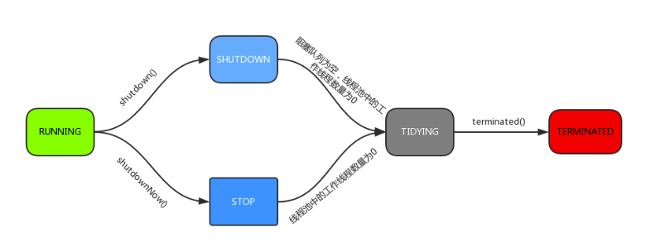
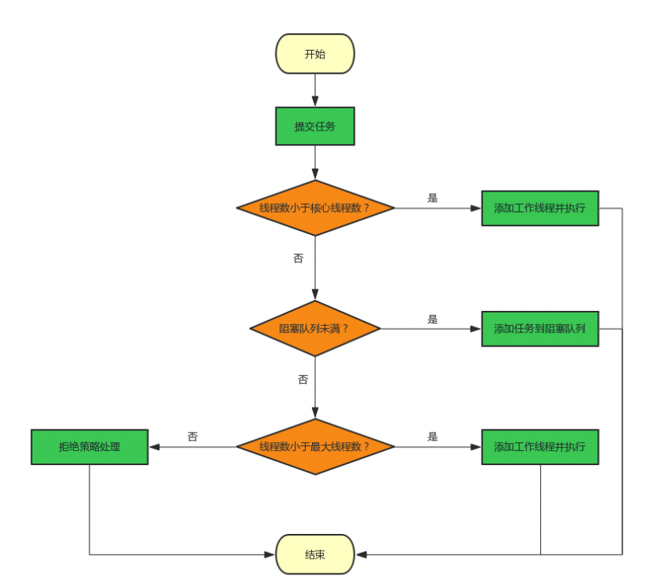
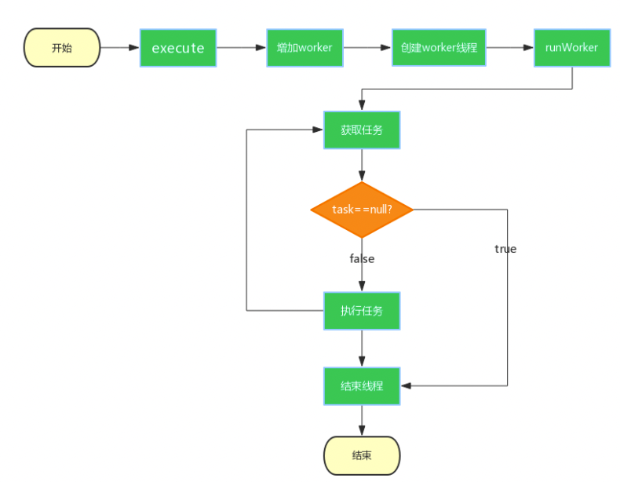
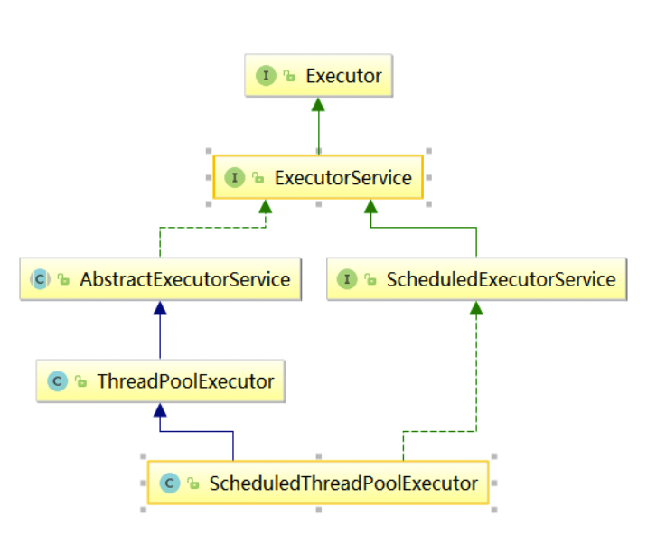
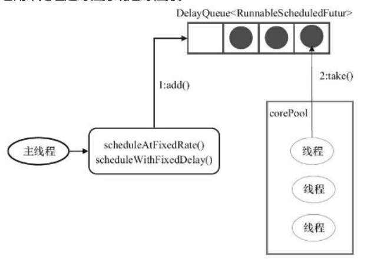
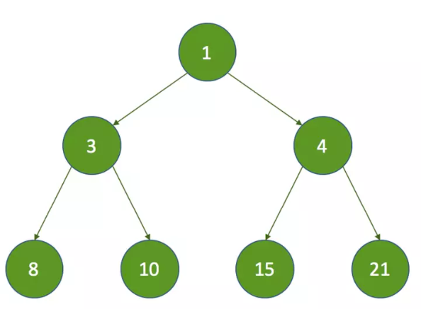

## Java线程池原理详解
### 线程池工作流程图
  
  
    
### 为什么使用线程池？
   减少了创建和销毁线程的次数，每个工作线程都可以被重复利用，可执行多个任务。 
   可以根据系统的承受能力，调整线程池中工作线线程的数目，防止因为消耗过多的内存

### 什么是线程池
   在面向对象编程中，创建和销毁对象是很费时间的，因为创建一个对象要获取内存资源或者其它更多资源。在Java中更是如此，虚拟机将试图跟踪每一个对象，以便能够在对象销毁后进行垃圾回收。
   所以提高服务程序效率的一个手段就是尽可能减少创建和销毁对象的次数，特别是一些很耗资源的对象创建和销毁，这就是”池化资源”技术产生的原因。
   线程池顾名思义就是事先创建若干个可执行的线程放入一个池（容器）中，需要的时候从池中获取线程不用自行创建，使用完毕不需要销毁线程而是放回池中，从而减少创建和销毁线程对象的开销。

### 源码图
   
   

### 常见问题
   线程池什么时候创建线程？线程池中的线程是否在创建线程池的时候就创建了？
   
    1.在创建了线程池后，默认情况下，线程池中并没有任何线程，而是等待有任务到来才创建线程去执行任务
    2.调用prestartAllCoreThreads()或者prestartCoreThread()可以在启动时创建线程，但是一般都不需要这样做
    3.当池中线程数量小于corePoolSize时，即使有线程空闲，线程池也会优先创建新线程处理，直至线程数量 = corePoolSize，
      如果任务数量超过corePoolSize时，会先进入队列排队，直至队列存储已满，才会继续从非corePoolSize中创建线程，直至线程数量=maximumPoolSize,才会停止创建
   
   线程池中的线程什么销毁?
        
        当线程空闲时间超过keepAliveTime时，变回自动回收线程，直至线程数量 = corePoolSize，换句话说，corePoolSize中的线程永远不会被回收（除非制定了allowCoreThreadTimeOut(true)，
        才会一并回收corePoolSize的线程），系统只会回收非corePoolSize的线程
   
   系统中最多有几个正在运行的任务？最多可以等待几个待执行的任务？
        
        最多运行maximumPoolSize个线程，等待的任务数量由队列长度决定，也就是说，队列无界时，那么可以存储任意个任务，直到系统资源耗尽为止
   
   scheduleAtFixedRate是一直使用同一个线程在运行任务吗？
        
        不是，scheduleAtFixedRate运行的大致原理是运行完当前任务后，将该任务重新放入延迟队列中，等待下一次运行，而从延迟队列中获取任务的线程不止一个线程，所以会有不同的线程运行该定时任务
    

### 线程池的行为 (ExecutorService 类中)

    1，execute(Runnable command):履行Ruannable类型的任务,

    2，submit(task):可用来提交Callable或Runnable任务，并返回代表此任务的Future 对象
    
    3，shutdown():在完成已提交的任务后封闭办事，不再接管新任务, 

    4，shutdownNow():停止所有正在履行的任务并封闭办事。

    5，isTerminated():测试是否所有任务都履行完毕了。 

    6，isShutdown():测试是否该ExecutorService已被关闭。

### 线程池的 状态 

```
    1. RUNNING = ‐1 << COUNT_BITS; //高3位为111

    2. SHUTDOWN = 0 << COUNT_BITS; //高3位为000
    
    3. STOP = 1 << COUNT_BITS; //高3位为001

    4. TIDYING = 2 << COUNT_BITS; //高3位为010

    5. TERMINATED = 3 << COUNT_BITS; //高3位为011
```

1、RUNNING

    (1) 状态说明:线程池处在RUNNING状态时，能够接收新任务，以及对已添加的任务进行 处理。
    (02) 状态切换:线程池的初始化状态是RUNNING。换句话说，线程池被一旦被创建，就处 于RUNNING状态，并且线程池中的任务数为0!

2、 SHUTDOWN

    (1) 状态说明:线程池处在SHUTDOWN状态时，不接收新任务，但能处理已添加的任务。 
    (2) 状态切换:调用线程池的shutdown()接口时，线程池由RUNNING -> SHUTDOWN。

3、STOP

    (1) 状态说明:线程池处在STOP状态时，不接收新任务，不处理已添加的任务，并且会中 断正在处理的任务。
    (2) 状态切换:调用线程池的shutdownNow()接口时，线程池由(RUNNING or SHUTDOWN ) -> STOP。

4、TIDYING

    (1) 状态说明:当所有的任务已终止，ctl记录的”任务数量”为0，线程池会变为TIDYING 状态。当线程池变为TIDYING状态时，会执行钩子函数terminated()。terminated()在 ThreadPoolExecutor类中是空的，若用户想在线程池变为TIDYING时，进行相应的处理; 可以通过重载terminated()函数来实现。

    (2) 状态切换:当线程池在SHUTDOWN状态下，阻塞队列为空并且线程池中执行的任务也 为空时，就会由 SHUTDOWN -> TIDYING。 当线程池在STOP状态下，线程池中执行的 任务为空时，就会由STOP -> TIDYING。

5、 TERMINATED

    (1) 状态说明:线程池彻底终止，就变成TERMINATED状态。
    (2) 状态切换:线程池处在TIDYING状态时，执行完terminated()之后，就会由 TIDYING - > TERMINATED。
    进入TERMINATED的条件如下:
        线程池不是RUNNING状态; 
        线程池状态不是TIDYING状态或TERMINATED状态; 
        如果线程池状态是SHUTDOWN并且workerQueue为空; 
        workerCount为0;
        设置TIDYING状态成功。



### 使用线程池

  线程池的具体实现
  
    1. ThreadPoolExecutor 默认线程池 
    2. ScheduledThreadPoolExecutor 定时线程池

#### ThreadPoolExecutor
   
   java.uitl.concurrent.ThreadPoolExecutor类是线程池中最核心的一个类，因此如果要透彻地了解Java中的线程池，必须先了解这个类
   
   完整的构造函数:
      
        public ThreadPoolExecutor(int corePoolSize,int maximumPoolSize,long keepAliveTime,TimeUnit unit,BlockingQueue<Runnable> workQueue,ThreadFactory threadFactory,RejectedExecutionHandler handler)
   
   构造函数参数详解:
        
        corePoolSize:
           1.核心线程数量
           2.默认情况下，在创建了线程池后，线程池中的线程数为0，当有任务来之后，就会创建一个线程去执行任务，当线程池中的线程数目达到corePoolSize后，就会把到达的任务放到缓存队列当中；
           3.当线程数小于核心线程数时，即使有线程空闲，线程池也会优先创建新线程处理，直至线程数量 = corePoolSize
           4.未设置allowCoreThreadTimeOut(true)池中线程数量最少保持在corePoolSize的数量
        maximumPoolSize:
            1.线程池最大线程数，这个参数也是一个非常重要的参数，它表示在线程池中最多能创建多少个线程；
            2.此参数受队列类型的影响，错误的队列类型将导致此类型无效
        keepAliveTime: (针对的是非核心线程数)
            1.表示线程没有任务执行时最多保持多久时间会终止。
            2.默认情况下，只有当线程池中的线程数大于corePoolSize时，keepAliveTime才会起作用，直到线程池中的线程数不大于corePoolSize，即当线程池中的线程数大于corePoolSize时，
            如果一个线程空闲的时间达到keepAliveTime，则会终止（如果设置为0则线程执行完毕后立即回收），直到线程池中的线程数不超过corePoolSize
            3.但是如果调用了allowCoreThreadTimeOut(boolean)方法，在线程池中的线程数不大于corePoolSize时，keepAliveTime参数也会起作用，直到线程池中的线程数为0；
            4.默认是1分钟超时
        unit:
            参数keepAliveTime的时间单位，有7种取值，在TimeUnit类中有7种静态属性
        workQueue:
            1.一个阻塞队列，用来存储等待执行的任务，这个参数的选择也很重要，会对线程池的运行过程产生重大影响，选择错误的队列将会导致系统资源耗尽
            2.在没有空闲的核心线程执行提交的任务时，任务会被存储在队列中等待执行
            3.注意：如果无法将任务加入BlockingQueue（队列已满），则在非corePool中创建新的线程来处理任务，也就是说，在队列未满之前，所有的任务都将阻塞在队列中等待执行，而不是新创建一个非corePool中的线程去执行任务
            4.如果指定了一个非常大的队列长度（如:Integer.MAX_VALUE），那么maximumPoolSize将不生效
            队列类型:
                【直接提交】SynchronousQueue（默认使用队列）
                它将任务直接提交给线程而不存储它们。在此，如果不存在可用于立即运行任务的线程，则试图把任务加入队列将失败，因此会构造一个新的线
                使用此队列maximumPoolSize将直接决定最大等待运行的任务数量
                实际上它不是一个真正的队列，因为它不会为队列中元素维护存储空间。与其他队列不同的是，它维护一组线程，这些线程在等待着把元素加入或移出队列。
                该队列在某次添加元素后必须等待其他线程取走后才能继续添加
                使用SynchronousQueue的目的就是保证“对于提交的任务，如果有空闲线程，则使用空闲线程来处理；否则新建一个线程来处理任务”。
                
                【有界队列】ArrayBlockingQueue（不常用）
                指定一个队列长度，当这个队列已满时，才会去使用非corePool的线程执行新的任务
                
                【无界队列】LinkedBlockingQueue
                其实也是有长度限制的，只是这个长度为Integer.MAX_VALUE，也可以设置小一点的长度，将队列变为有界队列
                无界队列将导致maximumPoolSize的值无效
                当每个任务完全独立于其他任务，即任务执行互不影响时，适合于使用无界队列
                无界队列在某些不适用的场合下将会导致系统资源耗尽
                
                DelayQueue
                队列内元素必须实现Delayed接口，这就意味着你传进去的任务必须先实现Delayed接口。这个队列接收到任务时，首先先入队，只有达到了指定的延时时间，才会执行任务
                
        threadFactory
            1.线程工厂，主要用来创建线程
            2.默认使用Executors.defaultThreadFactory()
            3.自定义线程工厂可以使用自定义的规则来生成线程
            4.大多数情况下不需要自定义线程工厂，使用默认即可
        handler
        表示当线程已满时执行的策略，接口实现非常简单，有以下四种取值
        
            1.ThreadPoolExecutor.AbortPolicy(默认策略)
            丢弃任务并抛出RejectedExecutionException异常。
            
            2.ThreadPoolExecutor.DiscardPolicy
            也是丢弃任务，但是不抛出异常。
            
            3.ThreadPoolExecutor.DiscardOldestPolicy
            丢弃队列最前面的(老的)任务，然后重新尝试执行任务（重复此过程）
            
            4.ThreadPoolExecutor.CallerRunsPolicy
            由调用线程处理该任务
            自定义的饱和策略
            实现 RejectedExecutionHandler 即可自定义饱和策略

#### ScheduledThreadPoolExecutor
    
   1.提供了一组接口，用来在指定延时之后执行或者以固定的频率周期性的执行提交的任务
   
   2.完整构造函数
        public ScheduledThreadPoolExecutor(int corePoolSize,ThreadFactory threadFactory,RejectedExecutionHandler handler)
   
   3.是一个 corePoolSize = 自定义大小，maximumPoolSize=Integer.MAX_VALUE,workQueue=DelayedWorkQueue 的线程池
   
   4.DelayedWorkQueue
        (1)DelayQueue是基于优先级队列来实现的，是一种无界延迟阻塞队列

        (2)DelayedWorkQueue保证添加到队列中的任务，会按照任务的延时时间进行排序，延时时间少的任务首先被获取。

   5. 三种提交任务的方式:
      
        1. schedule()   该方法是指任务在指定延迟时间到达后触发，只会执行一次。
      
        2. scheduledAtFixedRate(Runnable command,long initialDelay,long period, TimeUnit unit)  
           
                该方法是指任务在指定延迟时间到达后触发，period 表示每 period 执行一次, 不会等到任务执行完再执行，到了period 就会执行
      
        3. scheduledWithFixedDelay(Runnable command, long initialDelay, long delay, TimeUnit unit)  

           该方法是指任务在指定延迟时间到达后触发，period 表示每 delay 执行一次, 会等到任务执行完再执行， 然后再 延迟 delay 再执行 
    
   6. Timer 

      Timer 也是周期性的  但是它是单线程的

#####  方法

   1.scheduleAtFixedRate:定时的一个速率执行
 
   2.scheduleWithFixedDelay:延时的速率执行，需要等当前认为执行完之后再执行下一次认为
  

#### Executors
    
   Executors类，提供了一系列工厂方法用于创建线程池，返回的线程池都实现了ExecutorService接口。
   
   1.newSingleThreadPool
   
       (1)特点：池中只有一个线程，如果扔5个任务进来，那么有4个任务将排队
       (2)作用是保证任务的顺序执行。
       (3)corePoolSize = maximumPoolSize = 1 ，有且仅有一个永不回收的线程不断等待任务，其他任务在无界队列中等待执行
       (4)大量线程阻塞可能会导致系统资源耗尽
   
   SingleThreadExecutor是使用单个线程工作的线程池。其创建源码如下：
   
```
public static ExecutorService newSingleThreadExecutor() {
    return new FinalizableDelegatedExecutorService
        (new ThreadPoolExecutor(1, 1,
                                0L, TimeUnit.MILLISECONDS,
                                new LinkedBlockingQueue<Runnable>()));
}
我们可以看到总线程数和核心线程数都是1，所以就只有一个核心线程。该线程池才用链表阻塞队列LinkedBlockingQueue，先进先出原则，
所以保证了任务的按顺序逐一进行。
```

   
   
   2.newFixedThreadPool
        
       (1)创建一个 corePoolSize = maximumPoolSize的线程池 
       (2)使用无界队列
   
   可重用固定线程数的线程池，超出的线程会在队列中等待，在Executors类中我们可以找到创建方式：
```
public static ExecutorService newFixedThreadPool(int nThreads) {
        return new ThreadPoolExecutor(nThreads, nThreads,
                                      0L, TimeUnit.MILLISECONDS,
                                      new LinkedBlockingQueue<Runnable>());
}
FixedThreadPool的corePoolSize和maximumPoolSize都设置为参数nThreads，也就是只有固定数量的核心线程，不存在非核心线程。keepAliveTime为0L表示多余的线程立刻终止，
因为不会产生多余的线程，所以这个参数是无效的。FixedThreadPool的任务队列采用的是LinkedBlockingQueue。
```
  
   
   
   3.newCachedThreadPool
   
       (1)特点：用newCachedThreadPool()方法创建该线程池对象，创建之初里面一个线程都没有，当execute方法或submit方法向线程池提交任务时，会自动新建线程；如果线程池中有空余线程，则不会新建；这种线程池一般最多情况可以容纳几万个线程，里面的线程空余60s会被回收。
       (2)创建一个corePoolSize=0,maximumPoolSize=Integer.MAX_VALUE 线程池
       (3)当corePoolSize = 0 时，说明没有核心线程，那么所有线程空闲时间大于 keepAliveTime时都会被回收
   
   CachedThreadPool是一个根据需要创建线程的线程池:
   
```
public static ExecutorService newCachedThreadPool() {
        return new ThreadPoolExecutor(0, Integer.MAX_VALUE,
                                      60L, TimeUnit.SECONDS,
                                      new SynchronousQueue<Runnable>());
}
CachedThreadPool的corePoolSize是0，maximumPoolSize是Int的最大值，也就是说CachedThreadPool没有核心线程，全部都是非核心线程，并且没有上限。keepAliveTime是60秒，就是说空闲线程等待新任务60秒，
超时则销毁。此处用到的队列是阻塞队列SynchronousQueue,这个队列没有缓冲区，所以其中最多只能存在一个元素,有新的任务则阻塞等待。
```
   
   
   
   4.newScheduledThreadpool
   
       (1)创建一个可执行定时任务的线程池
       (2)调用方法 ->schedule()
   
   ScheduledThreadPool是一个能实现定时和周期性任务的线程池，它的创建源码如下：
   这里创建了ScheduledThreadPoolExecutor，继承自ThreadPoolExecutor，主要用于定时延时或者定期处理任务。ScheduledThreadPoolExecutor的构造如下：
```
public ScheduledThreadPoolExecutor(int corePoolSize) {
    super(corePoolSize, Integer.MAX_VALUE,
          DEFAULT_KEEPALIVE_MILLIS, MILLISECONDS,
          new DelayedWorkQueue());
}
可以看出corePoolSize是传进来的固定值，maximumPoolSize无限大，因为采用的队列DelayedWorkQueue是无解的，所以maximumPoolSize参数无效。该线程池执行如下：
```

   

   当执行scheduleAtFixedRate或者scheduleWithFixedDelay方法时，会向DelayedWorkQueue添加一个实现RunnableScheduledFuture接口的ScheduledFutureTask(任务的包装类)，
   并会检查运行的线程是否达到corePoolSize。如果没有则新建线程并启动ScheduledFutureTask，然后去执行任务。如果运行的线程达到了corePoolSize时，则将任务添加到DelayedWorkQueue中。
   DelayedWorkQueue会将任务进行排序，先要执行的任务会放在队列的前面。在跟此前介绍的线程池不同的是，当执行完任务后，会将ScheduledFutureTask中的time变量改为下次要执行的时间并放回到DelayedWorkQueue中。

### 默认线程池 源码分析 

#### 1. execute 方法 

```java
public class ThreadPoolExecutor extends AbstractExecutorService {
    public void execute(Runnable command) {
        // clt记录着runState和workerCount
        int c = ctl.get();
        /*
         *  workerCountOf方法取出低29位的值，表示当前活动的线程数;
         *  如果当前活动线程数小于corePoolSize，则新建一个线程放入线程池中; 并把任务添加到该线程中。
         */
        if (workerCountOf(c) < corePoolSize) {
            /*
             *  addWorker 中的第二个参数表示限制添加线程数量是根据corePoolSize 来判断还是根据maximumPoolSize 来判断
             *    如果为 true, 根据corePoolSize 来判断
             *    如果为 false, 则根据maximumPoolSize 来判断
             */
            if (addWorker(command, true))
                return;
            // 如果添加失败，则重新获取ctl 的值
            c = ctl.get();
        }
        // 如果当前线程池是运行状态并且任务添加到队列成功
        if (isRunning(c) && workQueue.offer(command)) {
            // 重新获取ctl 的值
            int recheck = ctl.get();
            // 再次判断线程池的运行状态，如果不是运行状态，由于之前已经把command 添加到了workQueue 中了，
            // 这时 需要移除该commond 
            // 执行过后通过handler 使用拒绝策略对该任务进行处理，整个方法返回
            if (!isRunning(recheck) && remove(command))
                reject(command);
            // 获取线程池中有效线程数，如果数量为0，则执行addWorker 方法
            // 参数：
            // 1. 第一个参数为null,表示在线程池中创建一个线程，但不去启动；
            // 2. 第二个参数为false, 将线程池的有限线程数量的上限设置为maximumPoolSize, 添加线程时根据maximumPoolSize 来判断；
            // 如果 判断workerCount 大于0 ，则直接返回，在workQueue 中新增的commond 会在将来的某个时刻被执行。
            else if (workerCountOf(recheck) == 0)
                addWorker(null, false);
            // 如果 执行 这里 两种情况
            // 1. 线程池已经不是RUNNING 状态
            // 2. 线程池是RUNNING 状态，但是 workerCount >= corePoolSize 并且 WorkQueue 已满。
            // 这时，再次调用addWorker 方法，但是第二个参数为false, 将线程池的有限数量的上限设置为maximumPoolSize;
            // 如果失败则拒绝该任务（或者是执行 对应的拒绝策略）
        } else if (!addWorker(command, false))
            reject(command);
    }
}
```

 归纳为:
   在执行execute()方法时如果状态一直是RUNNING时，的执行过程如下:

    1. 如果workerCount < corePoolSize，则创建并启动一个线程来执行新提交的任 务;
    2. 如果workerCount >= corePoolSize，且线程池内的阻塞队列未满，则将任务添 加到该阻塞队列中;
    3. 如 果 workerCount >= corePoolSize && workerCount < maximumPoolSize，且线程池内的阻塞队列已满，则创建并启动一个线程来执行新
        提交的任务;
    4. 如果workerCount >= maximumPoolSize，并且线程池内的阻塞队列已满, 则根 据拒绝策略来处理该任务, 默认的处理方式是直接抛异常。

  注意一下 addWorker(null, false);，也就是创建一个线程，但并没有传入任务，因为 任务已经被添加到workQueue中了，
  所以worker在执行的时候，会直接从workQueue中 获取任务。所以，在workerCountOf(recheck) == 0时执行addWorker(null, false);
  也是为了保证线程池在RUNNING状态下必须要有一个线程来执行任务。


  execute方法执行流程： 




#### 2. addWorker 方法

  addWorker方法的主要工作是在线程池中创建一个新的线程并执行，firstTask参数 用 于指定新增的线程执行的第一个任务，
  core参数为true表示在新增线程时会判断当前活动线 程数是否少于corePoolSize，false表示新增线程前需要判断当前活动线程数是否少于
  maximumPoolSize，代码如下:

```java
public class ThreadPoolExecutor extends AbstractExecutorService {
    private boolean addWorker(Runnable firstTask, boolean core) {
        retry:
        for (; ; ) {
            // clt记录着runState和workerCount
            int c = ctl.get();
            // 获取运行状态
            int rs = runStateOf(c);

            // Check if queue empty only if necessary.
            // 如果 rs >= SHUTDOWN，则表示此时不再接收新任务；
            // 接下来判断下面三个条件，只要有一个不满足，则返回false 
            // 1. rs == SHUTDOWN ,这是表示线程池为关闭状态，不再接收新提交的任务，但是却可以继续处理阻塞队列中已保存的任务
            // 2. firstTask 为空
            // 3. 阻塞队列不为空
            // 首先考虑 rs == SHUTDOWN 的情况
            // 这种情况下不会接收新提交的任务，所以在firstTask 不为空的时候返回false
            // 然后 如果 firstTask 为空，并且 workQueue 也为空，则返回 false, 因为队列中已经没有任务了，不需要再添加线程了
            if (rs >= SHUTDOWN &&
                    !(rs == SHUTDOWN &&
                            firstTask == null &&
                            !workQueue.isEmpty()))
                return false;

            for (; ; ) {
                // 获取线程数
                int wc = workerCountOf(c);
                // 如果wc 大于等一 CAPACITY，也就是ctl的低29位的最大值， 返回 false;
                // 这里的core 是addWorker 方法的第二个参数， 如果为true 表述 根据 corePoolSize 来比较，
                // 如果为false 则根据 maximumPoolSize来比较
                if (wc >= CAPACITY ||
                        wc >= (core ? corePoolSize : maximumPoolSize))
                    return false;
                // 尝试增加 workerCount，如果成功 ，则跳出 第一个 for 循环
                if (compareAndIncrementWorkerCount(c))
                    break retry;
                // 如果增加workerCount 失败，则重新获取ctl 的值。
                c = ctl.get();  // Re-read ctl
                // 如果当前 运行状态 不等于 rs ,说明状态已经被改变，返回第一个for 循环 继续执行 
                if (runStateOf(c) != rs)
                    continue retry;
                // else CAS failed due to workerCount change; retry inner loop
            }
        }

        boolean workerStarted = false;
        boolean workerAdded = false;
        Worker w = null;
        try {
            // 根据 firstTask 来创建 Worker 对象
            w = new Worker(firstTask);
            // 每个 Worker 对象都会创建一个线程 
            final Thread t = w.thread;
            if (t != null) {
                final ReentrantLock mainLock = this.mainLock;
                mainLock.lock();
                try {
                    // Recheck while holding lock.
                    // Back out on ThreadFactory failure or if
                    // shut down before lock acquired.
                    int rs = runStateOf(ctl.get());
                    // rs < SHUTDOWN 表示是 RUNNING 状态；
                    // 如果rs 是 RUNNING 状态或者rs 是 SHUTDOWN 状态 并且 firstTask 为null,向线程池中添加线程；
                    // 因为在 SHUTDOWN 是不会再添加新的任务，但还是会执行workQueue 中的任务
                    if (rs < SHUTDOWN ||
                            (rs == SHUTDOWN && firstTask == null)) {
                        if (t.isAlive()) // precheck that t is startable
                            throw new IllegalThreadStateException();
                        // workers 是一个HashSet 
                        workers.add(w);
                        int s = workers.size();
                        // largestPoolSize 记录着线程池中出现过最大线程数量
                        if (s > largestPoolSize)
                            largestPoolSize = s;
                        workerAdded = true;
                    }
                } finally {
                    mainLock.unlock();
                }
                if (workerAdded) {
                    //启动线程
                    t.start();
                    workerStarted = true;
                }
            }
        } finally {
            if (!workerStarted)
                addWorkerFailed(w);
        }
        return workerStarted;
    }
}
```

#### 3. Worker 类 

  线程池中的每一个线程被封装成一个Worker对象，ThreadPool维护的其实就是一组 Worker对象，请参见JDK源码。

  Worker类继承了AQS，并实现了Runnable接口，注意其中的firstTask和thread属 性:firstTask用它来保存传入的任务;
  thread是在调用构造方法时通过ThreadFactory来创 建的线程，是用来处理任务的线程。

  在调用构造方法时，需要把任务传入，这里通过 getThreadFactory().newThread(this); 来 新 建 一 个 线 程 ，
  newThread 方 法 传 入 的 参 数 是 this，因为Worker本身继承了Runnable接口，也就是一个线程，所以一个Worker对象在 
  启动的时候会调用Worker类中的run方法。
   
  Worker继承了AQS，使用AQS来实现独占锁的功能。为什么不使用ReentrantLock来 实现呢?可以看到tryAcquire方法，它是不允许重入的，
  而ReentrantLock是允许重入的:

#### 4. runWorker 方法 

  在Worker类中的run方法调用了runWorker方法来执行任务，runWorker方法的代码如 下:

```java
public class ThreadPoolExecutor extends AbstractExecutorService {
    final void runWorker(Worker w) {
        Thread wt = Thread.currentThread();
        // 获取 第一个任务
        Runnable task = w.firstTask;
        w.firstTask = null;
        // 允许中断
        w.unlock(); // allow interrupts
        // 是否因为异常退出循环
        boolean completedAbruptly = true;
        try {
            // 如果 task 为空，则通过 getTask 来获取任务
            // getTask 用来从阻塞队列中 获取任务
            while (task != null || (task = getTask()) != null) {
                w.lock();
                if ((runStateAtLeast(ctl.get(), STOP) ||
                        (Thread.interrupted() &&
                                runStateAtLeast(ctl.get(), STOP))) &&
                        !wt.isInterrupted())
                    wt.interrupt();
                try {
                    beforeExecute(wt, task);
                    Throwable thrown = null;
                    try {
                        task.run();
                    } catch (RuntimeException x) {
                        thrown = x;
                        throw x;
                    } catch (Error x) {
                        thrown = x;
                        throw x;
                    } catch (Throwable x) {
                        thrown = x;
                        throw new Error(x);
                    } finally {
                        afterExecute(task, thrown);
                    }
                } finally {
                    task = null;
                    w.completedTasks++;
                    w.unlock();
                }
            }
            completedAbruptly = false;
        } finally {
            // processWorkerExit执行完之后，工作线程被销毁
            processWorkerExit(w, completedAbruptly);
        }
    }
}
```

#### 5. 流程: 



### ScheduledThreadPoolExecutor 定时 线程池源码分析

  类图: 



  用来处理 延迟任务或者定时任务



  接收SchduledFutureTask 类型的任务，是线程池调度任务的最小单位，有三种提交方式

        1. schedule(Runnable command,long delay,TimeUnit unit)
        2. scheduledAtFixedRate(Runnable command,long initialDelay,long period,TimeUnit unit)
        3. scheduledWithFixedDelay(Runnable command,long initialDelay,long delay,TimeUnit unit)

  采用DelayQueue存储等待的任务

     1. DelayQueue内部封装了一个PriorityQueue，它会根据time的先后时间排序，若 time相同则根据sequenceNumber排序;
     
     2. DelayQueue也是一个无界队列;

#### 1. SchduledFutureTask

SchduledFutureTask 接收的参数(成员变量):

    1. private long time:任务开始的时间
    2. private final long sequenceNumber;:任务的序号 3. private final long period:任务执行的时间间隔

    工作线程的执行过程:

        工作线程会从DelayQueue取已经到期的任务去执行; 
        执行结束后重新设置任务的到期时间，再次放回DelayQueue

#### 2. compareTo 

   ScheduledThreadPoolExecutor会把待执行的任务放到工作队列DelayQueue中， DelayQueue封装了一个PriorityQueue，
   PriorityQueue 会对队列中的 ScheduledFutureTask进行排序，具体的排序算法实现如下:

```java
public class ScheduledThreadPoolExecutor
        extends ThreadPoolExecutor
        implements ScheduledExecutorService {
    public int compareTo(Delayed other) {
        if (other == this) // compare zero if same object
            return 0;
        if (other instanceof ScheduledFutureTask) {
            ScheduledFutureTask<?> x = (ScheduledFutureTask<?>) other;
            long diff = time - x.time;
            if (diff < 0)
                return -1;
            else if (diff > 0)
                return 1;
            else if (sequenceNumber < x.sequenceNumber)
                return -1;
            else
                return 1;
        }
        long diff = getDelay(NANOSECONDS) - other.getDelay(NANOSECONDS);
        return (diff < 0) ? -1 : (diff > 0) ? 1 : 0;
    }
}
```

    1. 首先按照time排序，time小的排在前面，time大的排在后面;
    2. 如果time相同，按照sequenceNumber排序，sequenceNumber小的排在前 面，sequenceNumber大的排在后面，换句话说，
    如果两个task的执行时间相同， 优先执行先提交的task。

#### 3. SchduledFutureTask之run方法实现

  SchduledFutureTask之run方法实现 run方法是调度task的核心，task的执行实际上是run方法的执行。

```java
public class ScheduledThreadPoolExecutor
        extends ThreadPoolExecutor
        implements ScheduledExecutorService {
    public void run() {
        // 如果当前线程池已经不支持执行任务，则取消
        boolean periodic = isPeriodic();
        if (!canRunInCurrentRunState(periodic))
            cancel(false);
        // 如果不需要周期性执行， 则直接执行 run 方法 然后结束
        else if (!periodic)
            ScheduledFutureTask.super.run();
        // 如果 需要周期执行，则在执行完任务以后，设置下一次执行时间
        else if (ScheduledFutureTask.super.runAndReset()) {
            // 计算下一次执行时间
            setNextRunTime();
            // 重复执行任务
            reExecutePeriodic(outerTask);
        }
    }
}
```

    1. 如果当前线程池运行状态不可以执行任务，取消该任务，然后直接返回，否则执行 步骤2;
    2. 如果不是周期性任务，调用FutureTask中的run方法执行，会设置执行结果，然后 直接返回，否则执行步骤3;
    3. 如果是周期性任务，调用FutureTask中的runAndReset方法执行，不会设置执行 结果，然后直接返回，否则执行步骤4和步骤5;
    4. 计算下次执行该任务的具体时间; 
    5. 重复执行任务。

#### 4. 线程池任务提交 

  首先是schedule方法，该方法是指任务在指定延迟时间到达后触发，只会执行一次。

````java
public class ScheduledThreadPoolExecutor
        extends ThreadPoolExecutor
        implements ScheduledExecutorService {
    public <V> ScheduledFuture<V> schedule(Callable<V> callable,
                                           long delay,
                                           TimeUnit unit) {
        // 参数校验 
        if (callable == null || unit == null)
            throw new NullPointerException();
        // 这里是一个嵌套结构，首先吧用户提交的任务包装成 ScheduledFutureTask 
        // 然后 再调用 decorateTask 进行包装，而且此方法 是留给用户扩展的，默认是空方法
        RunnableScheduledFuture<V> t = decorateTask(callable,
                new ScheduledFutureTask<V>(callable,
                        triggerTime(delay, unit)));
        // 包装好任务， 就进行提交 
        delayedExecute(t);
        return t;
    }
}
````

````java
public class ScheduledThreadPoolExecutor
        extends ThreadPoolExecutor
        implements ScheduledExecutorService {
    private void delayedExecute(RunnableScheduledFuture<?> task) {
        // 如果线程关闭，则使用拒绝策略把提交的任务拒绝掉
        if (isShutdown())
            reject(task);
        else {
            // 这里 与 ThreadPoolExecutor 不同，是直接把任务加入到延迟队列
            super.getQueue().add(task);
            // 如果当前状态无法执行任务，则取消任务
            if (isShutdown() &&
                    !canRunInCurrentRunState(task.isPeriodic()) &&
                    remove(task))
                task.cancel(false);
            else
                // 这里增加 一个 worker 线程，避免提交的任务没有worker 去执行
                // 原因是 该类没有想 ThreadPoolExecutor 一样，worker 满了才放入队列
                ensurePrestart();
        }
    }
    
}
````

#### 5. DelayedWorkQueue

   ScheduledThreadPoolExecutor之所以要自己实现阻塞的工作队列，是因为 ScheduledThreadPoolExecutor要求的工作队列有些特殊。

   DelayedWorkQueue是一个基于堆的数据结构，类似于DelayQueue和 PriorityQueue。在执行定时任务的时候，每个任务的执行时间都不同，
   所以 DelayedWorkQueue的工作就是按照执行时间的升序来排列，执行时间距离当前时间越近 的任务在队列的前面
   (注意:这里的顺序并不是绝对的，堆中的排序只保证了子节点的下次 执行时间要比父节点的下次执行时间要大，而叶子节点之间并不一定是顺序的）


   堆结构: 




   可见，DelayedWorkQueue是一个基于最小堆结构的队列。堆结构可以使用数 组表示，可以转换成如下的数组:


### 问题
   
   1.  线程池提交、执行线程顺序：
        提交：核心->队列->非核心
        执行：核心->非核心-> 队列