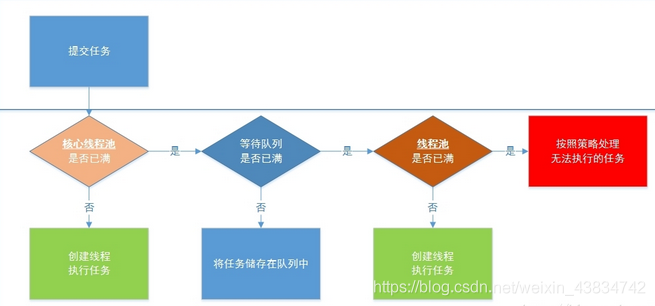
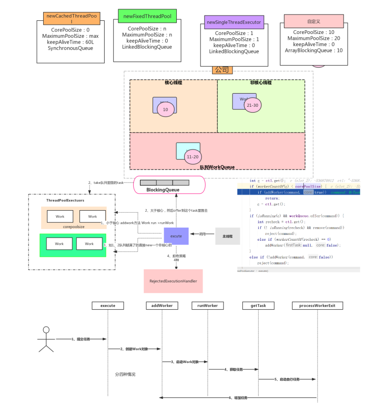
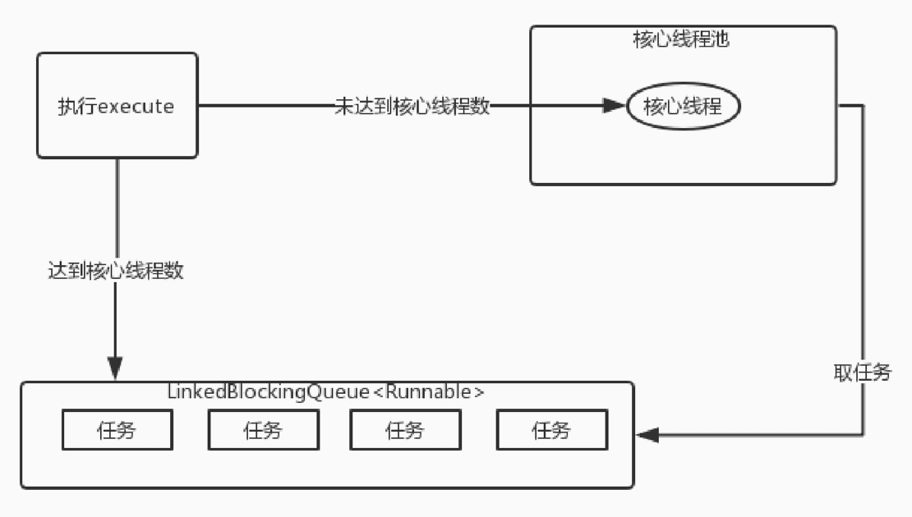
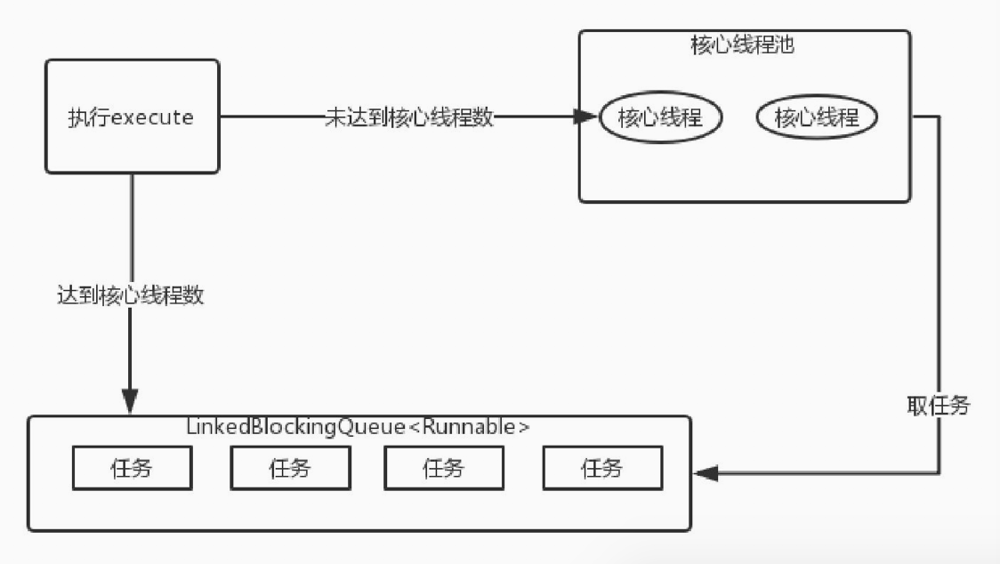
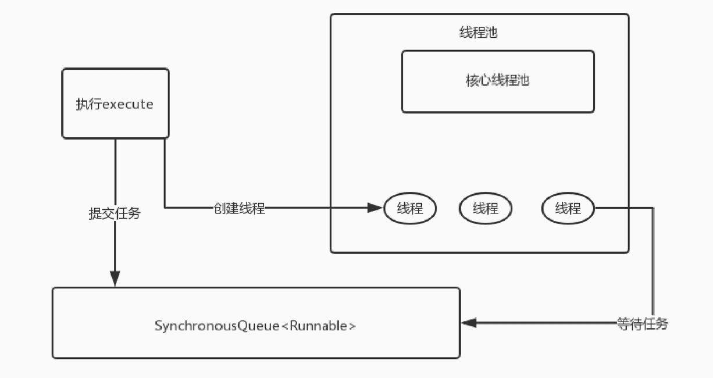
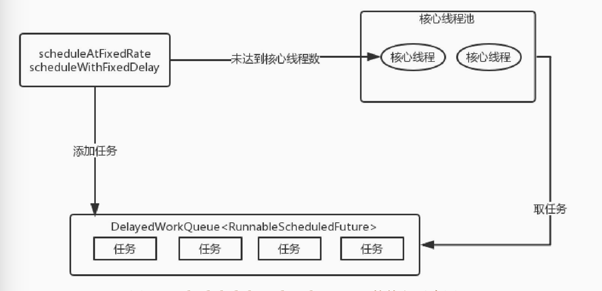

## Java线程池原理详解
### 线程池工作流程图
  
  
    
### 为什么使用线程池？
   减少了创建和销毁线程的次数，每个工作线程都可以被重复利用，可执行多个任务。 
   可以根据系统的承受能力，调整线程池中工作线线程的数目，防止因为消耗过多的内存

### 什么是线程池
   在面向对象编程中，创建和销毁对象是很费时间的，因为创建一个对象要获取内存资源或者其它更多资源。在Java中更是如此，虚拟机将试图跟踪每一个对象，以便能够在对象销毁后进行垃圾回收。
   所以提高服务程序效率的一个手段就是尽可能减少创建和销毁对象的次数，特别是一些很耗资源的对象创建和销毁，这就是”池化资源”技术产生的原因。
   线程池顾名思义就是事先创建若干个可执行的线程放入一个池（容器）中，需要的时候从池中获取线程不用自行创建，使用完毕不需要销毁线程而是放回池中，从而减少创建和销毁线程对象的开销。

### 源码图
   
   

### 常见问题
   线程池什么时候创建线程？线程池中的线程是否在创建线程池的时候就创建了？
   
    1.在创建了线程池后，默认情况下，线程池中并没有任何线程，而是等待有任务到来才创建线程去执行任务
    2.调用prestartAllCoreThreads()或者prestartCoreThread()可以在启动时创建线程，但是一般都不需要这样做
    3.当池中线程数量小于corePoolSize时，即使有线程空闲，线程池也会优先创建新线程处理，直至线程数量 = corePoolSize，
      如果任务数量超过corePoolSize时，会先进入队列排队，直至队列存储已满，才会继续从非corePoolSize中创建线程，直至线程数量=maximumPoolSize,才会停止创建
   
   线程池中的线程什么销毁?
        
        当线程空闲时间超过keepAliveTime时，变回自动回收线程，直至线程数量 = corePoolSize，换句话说，corePoolSize中的线程永远不会被回收（除非制定了allowCoreThreadTimeOut(true)，
        才会一并回收corePoolSize的线程），系统只会回收非corePoolSize的线程
   
   系统中最多有几个正在运行的任务？最多可以等待几个待执行的任务？
        
        最多运行maximumPoolSize个线程，等待的任务数量由队列长度决定，也就是说，队列无界时，那么可以存储任意个任务，直到系统资源耗尽为止
   
   scheduleAtFixedRate是一直使用同一个线程在运行任务吗？
        
        不是，scheduleAtFixedRate运行的大致原理是运行完当前任务后，将该任务重新放入延迟队列中，等待下一次运行，而从延迟队列中获取任务的线程不止一个线程，所以会有不同的线程运行该定时任务
    
### 使用线程池

#### ThreadPoolExecutor
   
   java.uitl.concurrent.ThreadPoolExecutor类是线程池中最核心的一个类，因此如果要透彻地了解Java中的线程池，必须先了解这个类
   
   完整的构造函数:
      
        public ThreadPoolExecutor(int corePoolSize,int maximumPoolSize,long keepAliveTime,TimeUnit unit,BlockingQueue<Runnable> workQueue,ThreadFactory threadFactory,RejectedExecutionHandler handler)
   
   构造函数参数详解:
        
        corePoolSize:
           1.核心线程数量
           2.默认情况下，在创建了线程池后，线程池中的线程数为0，当有任务来之后，就会创建一个线程去执行任务，当线程池中的线程数目达到corePoolSize后，就会把到达的任务放到缓存队列当中；
           3.当线程数小于核心线程数时，即使有线程空闲，线程池也会优先创建新线程处理，直至线程数量 = corePoolSize
           4.未设置allowCoreThreadTimeOut(true)池中线程数量最少保持在corePoolSize的数量
        maximumPoolSize:
            1.线程池最大线程数，这个参数也是一个非常重要的参数，它表示在线程池中最多能创建多少个线程；
            2.此参数受队列类型的影响，错误的队列类型将导致此类型无效
        keepAliveTime:
            1.表示线程没有任务执行时最多保持多久时间会终止。
            2.默认情况下，只有当线程池中的线程数大于corePoolSize时，keepAliveTime才会起作用，直到线程池中的线程数不大于corePoolSize，即当线程池中的线程数大于corePoolSize时，
            如果一个线程空闲的时间达到keepAliveTime，则会终止（如果设置为0则线程执行完毕后立即回收），直到线程池中的线程数不超过corePoolSize
            3.但是如果调用了allowCoreThreadTimeOut(boolean)方法，在线程池中的线程数不大于corePoolSize时，keepAliveTime参数也会起作用，直到线程池中的线程数为0；
            4.默认是1分钟超时
        unit:
            参数keepAliveTime的时间单位，有7种取值，在TimeUnit类中有7种静态属性
        workQueue:
            1.一个阻塞队列，用来存储等待执行的任务，这个参数的选择也很重要，会对线程池的运行过程产生重大影响，选择错误的队列将会导致系统资源耗尽
            2.在没有空闲的核心线程执行提交的任务时，任务会被存储在队列中等待执行
            3.注意：如果无法将任务加入BlockingQueue（队列已满），则在非corePool中创建新的线程来处理任务，也就是说，在队列未满之前，所有的任务都将阻塞在队列中等待执行，而不是新创建一个非corePool中的线程去执行任务
            4.如果指定了一个非常大的队列长度（如:Integer.MAX_VALUE），那么maximumPoolSize将不生效
            队列类型:
                【直接提交】SynchronousQueue（默认使用队列）
                它将任务直接提交给线程而不存储它们。在此，如果不存在可用于立即运行任务的线程，则试图把任务加入队列将失败，因此会构造一个新的线
                使用此队列maximumPoolSize将直接决定最大等待运行的任务数量
                实际上它不是一个真正的队列，因为它不会为队列中元素维护存储空间。与其他队列不同的是，它维护一组线程，这些线程在等待着把元素加入或移出队列。
                该队列在某次添加元素后必须等待其他线程取走后才能继续添加
                使用SynchronousQueue的目的就是保证“对于提交的任务，如果有空闲线程，则使用空闲线程来处理；否则新建一个线程来处理任务”。
                
                【有界队列】ArrayBlockingQueue（不常用）
                指定一个队列长度，当这个队列已满时，才会去使用非corePool的线程执行新的任务
                
                【无界队列】LinkedBlockingQueue
                其实也是有长度限制的，只是这个长度为Integer.MAX_VALUE，也可以设置小一点的长度，将队列变为有界队列
                无界队列将导致maximumPoolSize的值无效
                当每个任务完全独立于其他任务，即任务执行互不影响时，适合于使用无界队列
                无界队列在某些不适用的场合下将会导致系统资源耗尽
                
                DelayQueue
                队列内元素必须实现Delayed接口，这就意味着你传进去的任务必须先实现Delayed接口。这个队列接收到任务时，首先先入队，只有达到了指定的延时时间，才会执行任务
                
        threadFactory
            1.线程工厂，主要用来创建线程
            2.默认使用Executors.defaultThreadFactory()
            3.自定义线程工厂可以使用自定义的规则来生成线程
            4.大多数情况下不需要自定义线程工厂，使用默认即可
        handler
        表示当线程已满时执行的策略，接口实现非常简单，有以下四种取值
        
            1.ThreadPoolExecutor.AbortPolicy(默认策略)
            丢弃任务并抛出RejectedExecutionException异常。
            
            2.ThreadPoolExecutor.DiscardPolicy
            也是丢弃任务，但是不抛出异常。
            
            3.ThreadPoolExecutor.DiscardOldestPolicy
            丢弃队列最前面的任务，然后重新尝试执行任务（重复此过程）
            
            4.ThreadPoolExecutor.CallerRunsPolicy
            由调用线程处理该任务
            自定义的饱和策略
            实现 RejectedExecutionHandler 即可自定义饱和策略

#### ScheduledExecutorService
    
   1.提供了一组接口，用来在指定延时之后执行或者以固定的频率周期性的执行提交的任务
   
   2.完整构造函数
        public ScheduledThreadPoolExecutor(int corePoolSize,ThreadFactory threadFactory,RejectedExecutionHandler handler)
   
   3.是一个 corePoolSize = 自定义大小，maximumPoolSize=Integer.MAX_VALUE,workQueue=DelayedWorkQueue 的线程池
   
   4.DelayedWorkQueue
        (1)DelayQueue是基于优先级队列来实现的，是一种无界延迟阻塞队列
        (2)DelayedWorkQueue保证添加到队列中的任务，会按照任务的延时时间进行排序，延时时间少的任务首先被获取。

#####  方法
   1.scheduleAtFixedRate:定时的一个速率执行
 
   2.scheduleWithFixedDelay:延时的速率执行，需要等当前认为执行完之后再执行下一次认为
  

#### Executors
    
   Executors类，提供了一系列工厂方法用于创建线程池，返回的线程池都实现了ExecutorService接口。
   
   1.newSingleThreadPool
   
       (1)特点：池中只有一个线程，如果扔5个任务进来，那么有4个任务将排队
       (2)作用是保证任务的顺序执行。
       (3)corePoolSize = maximumPoolSize = 1 ，有且仅有一个永不回收的线程不断等待任务，其他任务在无界队列中等待执行
       (4)大量线程阻塞可能会导致系统资源耗尽
   
   SingleThreadExecutor是使用单个线程工作的线程池。其创建源码如下：
   
```
public static ExecutorService newSingleThreadExecutor() {
    return new FinalizableDelegatedExecutorService
        (new ThreadPoolExecutor(1, 1,
                                0L, TimeUnit.MILLISECONDS,
                                new LinkedBlockingQueue<Runnable>()));
}
我们可以看到总线程数和核心线程数都是1，所以就只有一个核心线程。该线程池才用链表阻塞队列LinkedBlockingQueue，先进先出原则，
所以保证了任务的按顺序逐一进行。
```

   
   
   2.newFixedThreadPool
        
       (1)创建一个 corePoolSize = maximumPoolSize的线程池 
       (2)使用无界队列
   
   可重用固定线程数的线程池，超出的线程会在队列中等待，在Executors类中我们可以找到创建方式：
```
public static ExecutorService newFixedThreadPool(int nThreads) {
        return new ThreadPoolExecutor(nThreads, nThreads,
                                      0L, TimeUnit.MILLISECONDS,
                                      new LinkedBlockingQueue<Runnable>());
}
FixedThreadPool的corePoolSize和maximumPoolSize都设置为参数nThreads，也就是只有固定数量的核心线程，不存在非核心线程。keepAliveTime为0L表示多余的线程立刻终止，
因为不会产生多余的线程，所以这个参数是无效的。FixedThreadPool的任务队列采用的是LinkedBlockingQueue。
```
  
   
   
   3.newCachedThreadPool
   
       (1)特点：用newCachedThreadPool()方法创建该线程池对象，创建之初里面一个线程都没有，当execute方法或submit方法向线程池提交任务时，会自动新建线程；如果线程池中有空余线程，则不会新建；这种线程池一般最多情况可以容纳几万个线程，里面的线程空余60s会被回收。
       (2)创建一个corePoolSize=0,maximumPoolSize=Integer.MAX_VALUE 线程池
       (3)当corePoolSize = 0 时，说明没有核心线程，那么所有线程空闲时间大于 keepAliveTime时都会被回收
   
   CachedThreadPool是一个根据需要创建线程的线程池:
   
```
public static ExecutorService newCachedThreadPool() {
        return new ThreadPoolExecutor(0, Integer.MAX_VALUE,
                                      60L, TimeUnit.SECONDS,
                                      new SynchronousQueue<Runnable>());
}
CachedThreadPool的corePoolSize是0，maximumPoolSize是Int的最大值，也就是说CachedThreadPool没有核心线程，全部都是非核心线程，并且没有上限。keepAliveTime是60秒，就是说空闲线程等待新任务60秒，
超时则销毁。此处用到的队列是阻塞队列SynchronousQueue,这个队列没有缓冲区，所以其中最多只能存在一个元素,有新的任务则阻塞等待。
```
   
   
   
   4.newScheduledThreadpool
   
       (1)创建一个可执行定时任务的线程池
       (2)调用方法 ->schedule()
   
   ScheduledThreadPool是一个能实现定时和周期性任务的线程池，它的创建源码如下：
   这里创建了ScheduledThreadPoolExecutor，继承自ThreadPoolExecutor，主要用于定时延时或者定期处理任务。ScheduledThreadPoolExecutor的构造如下：
```
public ScheduledThreadPoolExecutor(int corePoolSize) {
    super(corePoolSize, Integer.MAX_VALUE,
          DEFAULT_KEEPALIVE_MILLIS, MILLISECONDS,
          new DelayedWorkQueue());
}
可以看出corePoolSize是传进来的固定值，maximumPoolSize无限大，因为采用的队列DelayedWorkQueue是无解的，所以maximumPoolSize参数无效。该线程池执行如下：
```

   

   当执行scheduleAtFixedRate或者scheduleWithFixedDelay方法时，会向DelayedWorkQueue添加一个实现RunnableScheduledFuture接口的ScheduledFutureTask(任务的包装类)，
   并会检查运行的线程是否达到corePoolSize。如果没有则新建线程并启动ScheduledFutureTask，然后去执行任务。如果运行的线程达到了corePoolSize时，则将任务添加到DelayedWorkQueue中。
   DelayedWorkQueue会将任务进行排序，先要执行的任务会放在队列的前面。在跟此前介绍的线程池不同的是，当执行完任务后，会将ScheduledFutureTask中的time变量改为下次要执行的时间并放回到DelayedWorkQueue中。

### 问题
   
   1.  线程池提交、执行线程顺序：
        提交：核心->队列->非核心
        执行：核心->非核心-> 队列