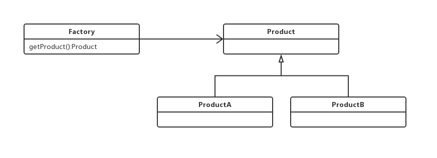
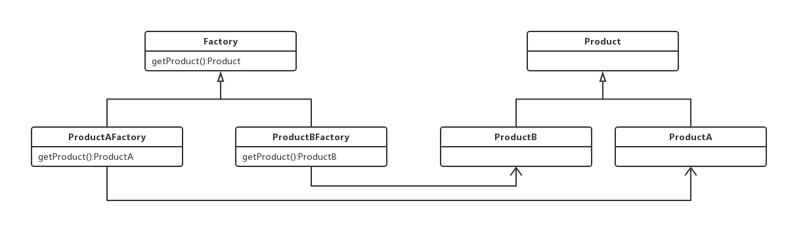
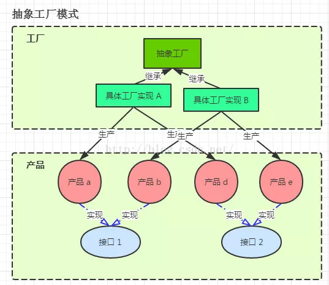

### 单例模式

#### 饿汉式 （静态常量，静态代码块）
    
    * 饿汉式在类加载时已经创建好该对象，在程序调用时直接返回该单例对象即可，
    * 即我们在编码时就已经指明了要马上创建这个对象，不需要等到被调用时再去创建。
    * 不会存在并发安全和性能问题。
    * 优点:写法简单。也没有线程同步问题，因为在类装载的时候就完成了实例化
    * 缺点：类装载的时候就完成了实例化，如果说一直没有用到这个实例，可能会造成内存中的浪费。
    * 可以用

#### 懒汉式 (线程不安全、同步方法、同步代码块)
   
   1.该懒汉式写法也被称为DCL：Double Check（双重校验） + Lock（加锁）
   
   创建一个对象：
        
        1.为 singleton 分配内存空间
        
        2.初始化 singleton 对象
        
        3.将 singleton 指向分配好的内存空间
   指令重排序是指：JVM 在保证最终结果正确的情况下，可以不按照程序编码的顺序执行语句，尽可能提高程序的性能
   
   2.非线程安全
   
   3.线程安全  同步方法
    
    缺点：影响效率，每个线程在想要获得实例的时候都需要加锁。
    其实只要有一次是实例化就够了，其他的线程直接return。
    
#### 静态内部类
   
   StaticClassSingleton装载的时候，还不会装载静态内部类StaticClassSingletonInstance
   
   只有在使用到静态内部类的时候才会装载。
   
   类的静态属性也只会在第一次加载类的时候初始化，jvm会保证线程安全
   
   推荐使用 

#### 枚举实现单例模式
     
   线程安全，还能防止序列化
   
   推荐使用

### 工厂模式
   
#### 简单工厂模式
   
   
    
   简单工厂模式的实质是由一个工厂类根据传入的参数，动态决定应该创建哪一个产品类。
   
   类型：创建型，但不属于GOF23设计模式。
   
   适用场景：
   
   工厂类负责创建的对象比较少
   
   客户端（应用层）只需要知道传入工厂类的参数，对于如何创建对象（逻辑）不关心
   
   优点：只需要传入一个正确的参数，就可以获取你所需要的对象，而无需知道其细节创建
   
   缺点：工厂类的职责相对过重，增加新的产品，需要修改工厂类的判断逻辑，违背了开闭原则

#### 工厂方法模式
   
   
   
   工厂方法模式（Factory Method）是简单工厂的仅一步深化， 在工厂方法模式中，我们不再提供一个统一的工厂类来创建所有的对象，而是针对不同的对象提供不同的工厂。也就是说每个对象都有一个与之对应的工厂。
   
   组成要素 
    
    1、一个抽象产品类
    2、多个具体产品类
    3、一个抽象工厂
    4、多个具体工厂 - 每一个具体产品对应一个具体工厂
    5、符合 - OCP开放封闭原则

  优点  
    
    1、降低了代码耦合度，对象的生成交给子类去完成（这里的耦合度是相对于简单工厂模式的工厂类比较的）
    
    2、降低了代码耦合度，对象的生成交给子类去完成
  
  缺点 
    
    1、增加了代码量，每个具体产品都需要一个具体工厂（在具体的业务中可能会产生大量的重复代码） 
    
    2、当增加抽象产品 也就是添加一个其他产品族 需要修改工厂 违背OCP
    
#### 抽象工厂方法模式
   
   
   
   工厂方法
   
   创建对象需要大量重复的代码
   
   客户端（应用层）不依赖于产品类实现如何被创建、实现等细节
   一个类通过其子类来指定创建哪个对象
    
   优点：
   
   用户只需要关系所需产品对应的工厂，无须关心创建细节
   
   加入新产品符合开闭原则，提高可扩展性
    
   缺点：
   
   类的个数容易过多，增加复杂度
   
   增加了系统的抽象性和理解难度

### 建造者
   
   简化版的建造者模式  链式调用创建对象
   
   适用于属性超过4个，并且有的属性有的是可选。
   
   优点：
    
       封装性好，创建和使用分离
    
       扩展性好、建造类之间独立、一定程度上解耦
   
   缺点:
    
      产生多余的Builder对象
    
      产品内部发生变化，建造者都要修改，成本较大

### 代理模式
   
   为其他对象提供一种代理，以控制对这个对象的访问代理对象在客户端和目标对象之间起到中介的作用
      
   优点：
        
        代理模式能将代理对象与真实被调用的目标对象分离
        
        一定程度上降低了系统 的耦合度，扩展性好
        
        保护目标对象
        
        增强目标对象
   
   缺点：
       
       代理模式会造成系统设计中类的数目增加
        
        在客户端和目标对象增加一个代理对象
        
        增加系统的复杂度
   
   扩展：
   
       静态代理
        
       动态代理(jdk 动态代理，cglib 动态代理)

### 装饰器模式
   
   在不改变原有对象的基础之上，将功能附加到对象上,提供了比继承更有弹性的代替方案（扩展原有对象功能）
   
   优点：
   
    继承的有力补充，比继承灵活，不改变原有对象的情况下给一个对象扩展功能
    
    通过使用不同装饰类以及这些装饰类的排列组合，可以实现不同效果
    
    符合开闭原则
   
   缺点：
   
    会出现更多的代码，跟多的类，增加程序复杂性
    
    动态装饰时，多层装饰时会更复杂

### 适配器模式
   
   将一个类的接口转换成客户期望的另一个接口。使原本接口不兼容的类可以一起工作
   
   适用场景:
    
    已经存在的类，它的方法和需求不匹配时（方法结果相同或者相似）
    
    不是软件设计阶段考虑的设计模式，是随着软件维护，由于不同产品、不同厂家造成功能类似而接口不相同情况下的解决方案

### 外观模式(门面模式)
   
   又叫门面模式，提供了一个统一的接口，用来访问子系统中的一群接口
   
   外观模式定义了一个高层接口，让子系统更容易使用
   
   适用场景：
    
    子系统越来越复杂，增加外观模式提供简单接口调用
    
    构建多层系统结构，利用外观对象作为每层的入口，简化层间调用

### 策略模式
   
   定义了算法家族，分别封装起来，让它们之间可以互相替换，此模式让算法的变化不会影响到使用算法的用户
   
   适用场景:
    
    系统有很多类，而他们的区别仅仅在于他们的行为不同
    
    一个系统需要动态地在几种算法中选择一种
   
   优点：
    
    符合开闭原则
    
    避免使用多重条件转移语句
    
    提高算法的保密性和安全性
   
   缺点：
    
    客户端必须知道所有的策略类，并自行决定使用哪个策略类
    
    每一个策略都是一个类， 复用的可能性很小 

### 模板方法模式
   
   定义了一个算法的骨架，并允许子类为一个或多个步骤提供实现,模板方法使得子类可以在不改变算法结构的情况下，重新定义算法的某些步骤

   适用场景:
       
       一次性实现一个算法的不变部分，并将可变的行为留给子类来实现
       
       各个子类中公共的行为被提取出来并集中到一个公共父类中，从而避免代码重复

   优点：
   
        提高复用性
        
        提高扩展性
        
        符合开闭原则

   缺点：
        
        类数目增加
        
        增加了系统实现的复杂度
        
        继承关系自身缺点，如果父类添加新的抽象方法，所有子类都要改一遍

### 观察者模式（发布订阅模式 ）
   
   定义了对象之间的一对多依赖，让多个观察者对象同时监听某一个主题对象，当主题对象发生变化时，它的所有依赖者（观察者）都会收到通知并更新
   
   适用场景：关联行为场景，建立一套触发机制
   
   优点：
    
    观测者和被观测者之间建立一个抽象的耦合
    
    观测者模式支持广播通信
   
   缺点：
    
    观测者之间有过多的细节依赖、提高时间消耗及程序复杂度
    
    使用要得当，要避免循环调用

### 责任链模式
   
   为请求创建一个接收此次请求对象的链。给予请求的类型，对请求的发送者和接收者进行解耦。
   
   
   适用场景:
    
    一个请求的处理需要多个对象当中的一个或几个协作处理

   优点：
        
        请求的发送者和接收者（请求的处理）解耦
        
        责任链可以动态组合

   缺点：
        
        责任链太长或者处理时间过长，影响性能
        
        责任链可能过多

### 状态模式
   
   允许一个对象在其内部状态改变时，改变它的行为
   
   一个对象存在多个状态（不同状态下行为不同），且状态可互相转换
   
   优点：
    
    将不同的状态隔离
    
    把各种状态的转换逻辑，分布到State的子类中，减少互相间依赖
    
    增加新的状态非常简单
   
   缺点：
    状态多的业务场景导致类数目增加，系统变复杂
