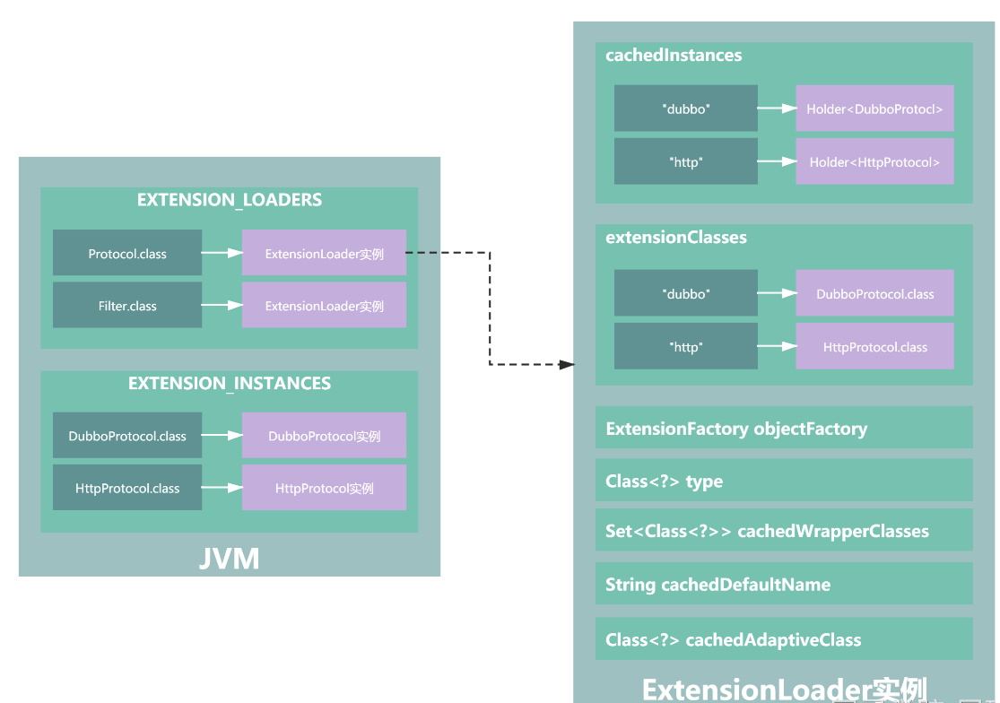
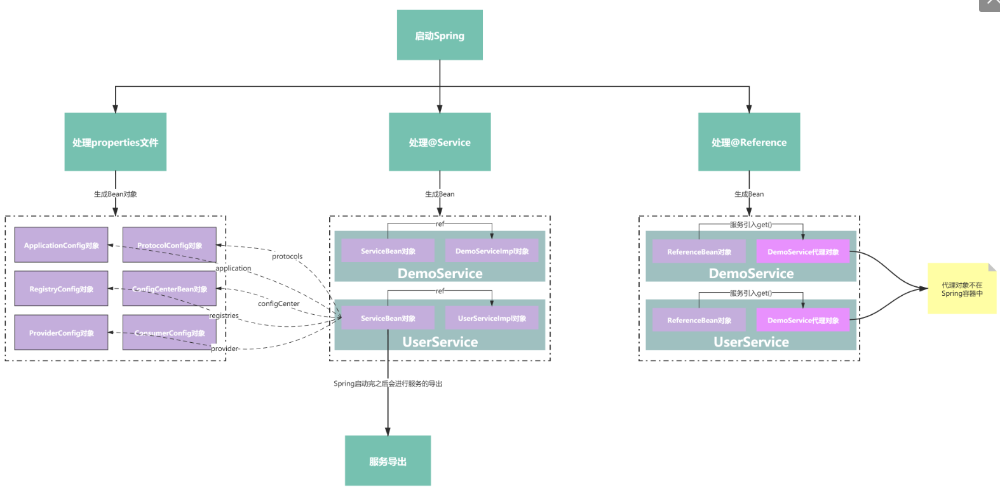
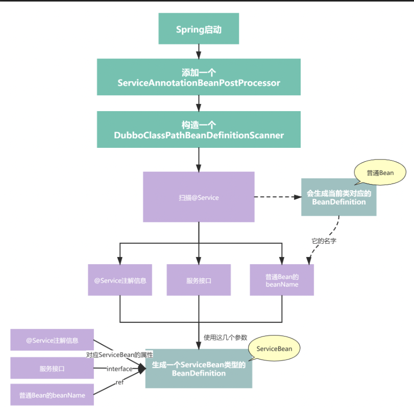
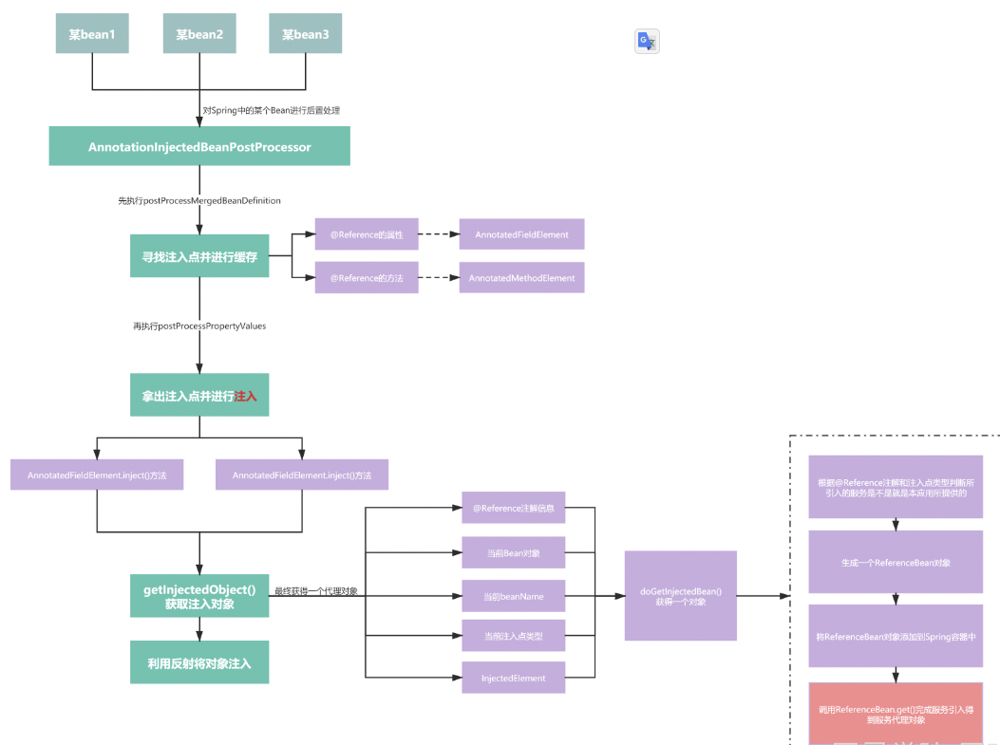

### 1. Dubbo的可扩展机制SPI源码解析

#### 1.1 Demo
```
ExtensionLoader<Protocol> extensionLoader = ExtensionLoader.getExtensionLoader(Protocol.class);
Protocol http = extensionLoader.getExtension("dubbo");
System.out.println(http);
```
   
   上面这个Demo就是Dubbo常见的写法，表示获取"dubbo"对应的Protocol扩展点。Protocol是一个接口。
   
   在ExtensionLoader类的内部有一个static的ConcurrentHashMap，用来缓存某个接口类型所对应的ExtensionLoader实例
 

#### 1.2 dubbo spi 架构图



#### 1.3 ExtensionLoader
   
   ExtensionLoader表示一个扩展点加载器，在这个类中除开有上文的Map外，还有两个非常重要的属性：
    
    1. Class<?> type：表示当前ExtensionLoader实例是哪个接口的扩展点加载器
    2. ExtensionFactory objectFactory：表示当前ExtensionLoader实例的扩展点生成器（一个扩展点，就是一个接口的实现类的对象）
   
   构造方法如下：
```
private ExtensionLoader(Class<?> type) {
    this.type = type;
    objectFactory = (type == ExtensionFactory.class ? null : ExtensionLoader.getExtensionLoader(ExtensionFactory.class).getAdaptiveExtension());
}
```
  
  从上面的构造方法中可以看到一段比较特殊的代码：
```
ExtensionLoader.getExtensionLoader(ExtensionFactory.class).getAdaptiveExtension()
```
   
   在ExtensionLoader中有三个常用的方法：
       
       1. getExtension("dubbo")：表示获取名字为dubbo的扩展点实例
       2. getAdaptiveExtension()：表示获取一个自适应的扩展点实例
       3. getActivateExtension(URL url, String[] values, String group)：表示一个可以被url激活的扩展点实例.
   
   其中，什么是自适应的扩展点实例？它其实就是当前这个接口类型的一个代理类，可以通过这个代理类去获取某个名字的扩展点。那为什么要这么设计呢？
   
   这是因为对于某个接口的实现类实例，并不是仅仅只能通过Dubbo框架来生成，比如通过getExtension("dubbo")方法所获得扩展点实例，是由Dubbo框架根据名字对应的实现类帮我们生成的一个实例对象。而有的时候，我们需要从Dubbo之外去获取实例对象，比如从Spring容器中根据名字取获取bean，来作为一个扩展点实例。
   
   所以ExtensionFactory表示一个扩展点工厂，在Dubbo中有三个实现类：
       
       1. AdaptiveExtensionFactory：负责从SpiExtensionFactory或SpringExtensionFactory中得到扩展点实例对象
       2. SpiExtensionFactory：利用Dubbo的Spi机制获取一个扩展点实例
       3. SpringExtensionFactory：从Spring的ApplicationContext中获取bean作为一个扩展点实例
   
   所以回到上文的那么代码，它拿到的就是一个AdaptiveExtensionFactory实例， objectFactory表示一个扩展点实例工厂。

#### 1.4 getExtension(String name)方法
   
   在调用getExtension去获取一个扩展点实例后，会对实例进行缓存，下次再获取同样名字的扩展点实例时就会从缓存中拿了。
   
#### 1.5 createExtension(String name)方法
   
   在调用createExtension(String name)方法去创建一个扩展点实例时，要经过以下几个步骤：
       
       1. 根据name找到对应的扩展点实现类
       2. 根据实现类生成一个实例，把实现类和对应生成的实例进行缓存
       3. 对生成出来的实例进行依赖注入（给实例的属性进行赋值）
       4. 对依赖注入后的实例进行AOP（Wrapper）,把当前接口类的所有的Wrapper全部一层一层包裹在实例对象上，没包裹个Wrapper后，也会对Wrapper对象进行依赖注入
       5. 返回最终的Wrapper对象


#### 1.6 getExtensionClasses
   
   getExtensionClasses()是用来加载当前接口所有的扩展点实现类的，返回一个Map。之后可以从这个Map中按照指定的name获取对应的扩展点实现类。
   
   当把当前接口的所有扩展点实现类都加载出来后也会进行缓存，下次需要加载时直接拿缓存中的。
   
   Dubbo在加载一个接口的扩展点时，思路是这样的：
       
       1. 根据接口的全限定名去META-INF/dubbo/internal/目录下寻找对应的文件，调用loadResource方法进行加载
       2. 根据接口的全限定名去META-INF/dubbo/目录下寻找对应的文件，调用loadResource方法进行加载
       3. 根据接口的全限定名去META-INF/services/目录下寻找对应的文件，调用loadResource方法进行加载

#### 1.7 loadResource方法
   
   loadResource方法就是完成对文件内容的解析，按行进行解析，会解析出"="两边的内容，"="左边的内容就是扩展点的name，右边的内容就是扩展点实现类，并且会利用ExtensionLoader类的类加载器来加载扩展点实现类。
   
   然后调用loadClass方法对name和扩展点实例进行详细的解析，并且最终把他们放到Map中去。

#### 1.8 loadClass方法
   
   loadClass方法会做如下几件事情：
       
       1. 当前扩展点实现类上是否存在@Adaptive注解，如果存在则把该类认为是当前接口的默认自适应类（接口代理类），并把该类存到cachedAdaptiveClass属性上。
       
       2. 当前扩展点实现是否是一个当前接口的一个Wrapper类，如果判断的？就是看当前类中是否存在一个构造方法，该构造方法只有一个参数，参数类型为接口类型，如果存在这一的构造方法，那么这个类就是该接口的Wrapper类，如果是，则把该类添加到cachedWrapperClasses中去， cachedWrapperClasses是一个set。
       
       3. 如果不是自适应类，或者也不是Wrapper类，则判断是有存在name，如果没有name，则报错。
       
       4. 如果有多个name，则判断一下当前扩展点实现类上是否存在@Activate注解，如果存在，则把该类添加到cachedActivates中，cachedWrapperClasses是一个map。
       
       5. 最后，遍历多个name，把每个name和对应的实现类存到extensionClasses中去，extensionClasses就是上文所提到的map。
   
   至此，加载类就走完了。
   
   回到createExtension(String name)方法中的逻辑，当前这个接口的所有扩展点实现类都扫描完了之后，就可以根据用户所指定的名字，找到对应的实现类了，然后进行实例化，然后进行IOC(依赖注入)和AOP。

#### 1.9 Dubbo中的IOC

   1. 根据当前实例的类，找到这个类中的setter方法，进行依赖注入
   
   2. 先分析出setter方法的参数类型pt
   
   3. 在截取出setter方法所对应的属性名property
   
   4. 调用objectFactory.getExtension(pt, property)得到一个对象，这里就会从Spring容器或通过DubboSpi机制得到一个对象，比较特殊的是，如果是通过DubboSpi机制得到的对象，是pt这个类型的一个自适应对象。
   
   5. 再反射调用setter方法进行注入

#### 1.10 Dubbo中的AOP
   
   dubbo中也实现了一套非常简单的AOP，就是利用Wrapper，如果一个接口的扩展点中包含了多个Wrapper类，那么在实例化完某个扩展点后，就会利用这些Wrapper类对这个实例进行包裹，
   比如：现在有一个DubboProtocol的实例，同时对于Protocol这个接口还有很多的Wrapper，比如ProtocolFilterWrapper、ProtocolListenerWrapper，那么，
   当对DubboProtocol的实例完成了IOC之后，就会先调用new ProtocolFilterWrapper(DubboProtocol实例)生成一个新的Protocol的实例，再对此实例进行IOC，完了之后，
   会再调用new ProtocolListenerWrapper(ProtocolFilterWrapper实例)生成一个新的Protocol的实例，然后进行IOC，从而完成DubboProtocol实例的AOP。

#### 1.11 AdaptiveClass
   
   上文多次提到了Adaptive，表示一个接口的自适应类，这里详细的来讲讲。
   
   通过getAdaptiveExtension方法获得的实例就是Adaptive类的实例，在Dubbo中有两种方式来针对某个接口得到一个Adaptive类，一种是在某个接口的实现类上指定一个@Adaptive注解，
   那么该类就是这个接口的Adaptive类，或者利用Dubbo的默认实现来得到一个Adaptive类，一个接口只能有一个Adaptive类。
   
   如果是手动实现的Adaptive类，那么自适应逻辑就是自己实现的。如果是有Dubbo默认实现的，那么我们就看看Dubbo是如何实现Adaptive类的。

#### 1.12 createAdaptiveExtensionClass方法
   
   createAdaptiveExtensionClass方法就是Dubbo中默认生成Adaptive类实例的逻辑。说白了，这个实例就是当前这个接口的一个代理对象。比如下面的代码：
```
ExtensionLoader<Protocol> extensionLoader = ExtensionLoader.getExtensionLoader(Protocol.class);
Protocol protocol = extensionLoader.getAdaptiveExtension();
```
   
   这个代码就是Protocol接口的一个代理对象，那么代理逻辑就是在new AdaptiveClassCodeGenerator(type, cachedDefaultName).generate()方法中。
    
    1. type就是接口
    
    2. cacheDefaultName就是该接口默认的扩展点实现的名字
  
  看个例子，Protocol接口的Adaptive类：
```
package org.apache.dubbo.rpc;
import org.apache.dubbo.common.extension.ExtensionLoader;
public class Protocol$Adaptive implements org.apache.dubbo.rpc.Protocol {
    
	public void destroy()  {
		throw new UnsupportedOperationException("The method public abstract void org.apache.dubbo.rpc.Protocol.destroy() of interface org.apache.dubbo.rpc.Protocol is not adaptive method!");
	}

    public int getDefaultPort()  {
		throw new UnsupportedOperationException("The method public abstract int org.apache.dubbo.rpc.Protocol.getDefaultPort() of interface org.apache.dubbo.rpc.Protocol is not adaptive method!");
	}
    
	public org.apache.dubbo.rpc.Exporter export(org.apache.dubbo.rpc.Invoker arg0) throws org.apache.dubbo.rpc.RpcException {
		if (arg0 == null) 
            throw new IllegalArgumentException("org.apache.dubbo.rpc.Invoker argument == null");
		if (arg0.getUrl() == null) 
            throw new IllegalArgumentException("org.apache.dubbo.rpc.Invoker argument getUrl() == null");
		
        org.apache.dubbo.common.URL url = arg0.getUrl();
		
        String extName = ( url.getProtocol() == null ? "dubbo" : url.getProtocol() );

        if(extName == null) 
            throw new IllegalStateException("Failed to get extension (org.apache.dubbo.rpc.Protocol) name from url (" + url.toString() + ") use keys([protocol])");
        
        org.apache.dubbo.rpc.Protocol extension = (org.apache.dubbo.rpc.Protocol)ExtensionLoader.getExtensionLoader(org.apache.dubbo.rpc.Protocol.class).getExtension(extName);
 		
        return extension.export(arg0);
	}

    public org.apache.dubbo.rpc.Invoker refer(java.lang.Class arg0, org.apache.dubbo.common.URL arg1) throws org.apache.dubbo.rpc.RpcException {

        if (arg1 == null) throw new IllegalArgumentException("url == null");

        org.apache.dubbo.common.URL url = arg1;

        String extName = ( url.getProtocol() == null ? "dubbo" : url.getProtocol() );

        if(extName == null) throw new IllegalStateException("Failed to get extension (org.apache.dubbo.rpc.Protocol) name from url (" + url.toString() + ") use keys([protocol])");

        org.apache.dubbo.rpc.Protocol extension = (org.apache.dubbo.rpc.Protocol)ExtensionLoader.getExtensionLoader(org.apache.dubbo.rpc.Protocol.class).getExtension(extName);

        return extension.refer(arg0, arg1);
	}
}
```

  可以看到，Protocol接口中有四个方法，但是只有export和refer两个方法进行代理。为什么？因为Protocol接口中在export方法和refer方法上加了@Adaptive注解。但是，不是只要在方法上加了@Adaptive注解就可以进行代理，还有其他条件，比如：
    
    1. 该方法如果是无参的，那么则会报错
    
    2. 该方法有参数，可以有多个，并且其中某个参数类型是URL，那么则可以进行代理
    
    3. 该方法有参数，可以有多个，但是没有URL类型的参数，那么则不能进行代理
    
    4. 该方法有参数，可以有多个，没有URL类型的参数，但是如果这些参数类型，对应的类中存在getUrl方法（返回值类型为URL），那么也可以进行代理
  
  所以，可以发现，某个接口的Adaptive对象，在调用某个方法时，是通过该方法中的URL参数，通过调用ExtensionLoader.getExtensionLoader(com.wlz.Car.class).getExtension(extName);得到一个扩展点实例，然后调用该实例对应的方法。
  
####  1.13 Activate扩展点
  
  上文说到，每个扩展点都有一个name，通过这个name可以获得该name对应的扩展点实例，但是有的场景下，希望一次性获得多个扩展点实例，可以通过传入多个name来获取，可以通过识别URL上的信息来获取：
  
  extensionLoader.getActivateExtension(url, new String[]{"car1", "car2"}); 这个可以拿到name为car1和car2的扩展类实例，同时还会通过传入的url寻找可用的扩展类，  怎么找的呢？
  
  在一个扩展点类上，可以添加@Activate注解，这个注解的属性有：
   
    1. String[] group()：表示这个扩展点是属于拿组的，这里组通常分为PROVIDER和CONSUMER，表示该扩展点能在服务提供者端，或者消费端使用
    
    2. String[] value()：指示的是URL中的某个参数key，当利用getActivateExtension方法来寻找扩展点时，如果传入的url中包含的参数的所有key中，包括了当前扩展点中的value值，那么则表示当前url可以使用该扩展点。

### 2. Spring与Dubbo整合原理



#### 2.1 demo 

```
public class Application {
    public static void main(String[] args) throws Exception {
        AnnotationConfigApplicationContext context = new AnnotationConfigApplicationContext(ProviderConfiguration.class);
        context.start();
        System.in.read();
    }

    @Configuration
    @EnableDubbo(scanBasePackages = "org.apache.dubbo.demo.provider")
    @PropertySource("classpath:/spring/dubbo-provider.properties")
    static class ProviderConfiguration {
       
    }
}
```
   应用配置类为ProviderConfiguration, 在配置上有两个比较重要的注解
       
      1. @PropertySource表示将dubbo-provider.properties中的配置项添加到Spring容器中，可以通过@Value的方式获取到配置项中的值
      
      2. @EnableDubbo(scanBasePackages = "org.apache.dubbo.demo.provider")表示对指定包下的类进行扫描，扫描@Service与@Reference注解，并且进行处理

#### @EnableDubbo
   
   在EnableDubbo注解上，有另外两个注解，也是研究Dubbo最重要的两个注解
   
   1. @EnableDubboConfig
   
   2. @DubboComponentScan
```
@Target({ElementType.TYPE})
@Retention(RetentionPolicy.RUNTIME)
@Inherited
@Documented
@Import(DubboConfigConfigurationRegistrar.class)
public @interface EnableDubboConfig {
    boolean multiple() default true;
}
```
```
@Target(ElementType.TYPE)
@Retention(RetentionPolicy.RUNTIME)
@Documented
@Import(DubboComponentScanRegistrar.class)
public @interface DubboComponentScan {
    String[] value() default {};

    String[] basePackages() default {};

    Class<?>[] basePackageClasses() default {};

}
``` 
   
   注意两个注解中对应的@Import注解所导入的类：
    
    1. DubboConfigConfigurationRegistrar
    
    2. DubboComponentScanRegistrar
   
   Spring在启动时会解析这两个注解，并且执行对应的Registrar类中的registerBeanDefinitions方法（这是Spring中提供的扩展功能。）
   
#### DubboConfigConfigurationRegistrar
   
   Spring启动时，会调用DubboConfigConfigurationRegistrar的registerBeanDefinitions方法，会对Properties文件进行解析，主要完成的事情是根据Properties文件的每个配置项的前缀、参数名、参数值生成对应的Bean。
   
   比如前缀为"dubbo.application"的配置项，会生成一个ApplicationConfig类型的BeanDefinition。
   
   比如前缀为"dubbo.protocol"的配置项，会生成一个ProtocolConfig类型的BeanDefinition。
   
   其他前缀对应关系如下：
   
```
@EnableDubboConfigBindings({
    @EnableDubboConfigBinding(prefix = "dubbo.application", type = ApplicationConfig.class),
    @EnableDubboConfigBinding(prefix = "dubbo.module", type = ModuleConfig.class),
    @EnableDubboConfigBinding(prefix = "dubbo.registry", type = RegistryConfig.class),
    @EnableDubboConfigBinding(prefix = "dubbo.protocol", type = ProtocolConfig.class),
    @EnableDubboConfigBinding(prefix = "dubbo.monitor", type = MonitorConfig.class),
    @EnableDubboConfigBinding(prefix = "dubbo.provider", type = ProviderConfig.class),
    @EnableDubboConfigBinding(prefix = "dubbo.consumer", type = ConsumerConfig.class),
    @EnableDubboConfigBinding(prefix = "dubbo.config-center", type = ConfigCenterBean.class),
    @EnableDubboConfigBinding(prefix = "dubbo.metadata-report", type = MetadataReportConfig.class),
    @EnableDubboConfigBinding(prefix = "dubbo.metrics", type = MetricsConfig.class)
})
public static class Single {

}
```
   
   默认情况下开启了multiple模式，multiple模式表示开启多配置模式，意思是这样的：
   
   如果没有开启multiple模式，那么只支持配置一个dubbo.protocol，比如：
```
dubbo.protocol.name=dubbo
dubbo.protocol.port=20880
dubbo.protocol.host=0.0.0.0
```
   
   如果开启了multiple模式，那么可以支持多个dubbo.protocol，比如：
```
dubbo.protocols.p1.name=dubbo
dubbo.protocols.p1.port=20880
dubbo.protocols.p1.host=0.0.0.0

dubbo.protocols.p2.name=http
dubbo.protocols.p2.port=8082
dubbo.protocols.p2.host=0.0.0.0
```

   DubboConfigConfigurationRegistrar的registerBeanDefinitions方法源码流程：
   
    1. 根据DubboConfigConfiguration.Single.class的定义来注册BeanDefinition，如果开启了multiple模式，则根据DubboConfigConfiguration.Multiple.class的定义来注册BeanDefinition
    2. 两者都是调用的registerBeans(BeanDefinitionRegistry registry, Class<?>... annotatedClasses)方法
    3. 在registerBeans方法内，会利用Spring中的AnnotatedBeanDefinitionReader类来加载annotatedClasses参数所指定的类（上面所Single或Multiple类），Spring的AnnotatedBeanDefinitionReader类会识别annotatedClasses上的注解，然后开启解析annotatedClasses类上的注解
    4. 可以发现，不管是Single类，还是Multiple类，类上面定义的注解都是@EnableDubboConfigBindings，所以Spring会解析这个注解，在这个注解的定义上Import了一个DubboConfigBindingsRegistrar类，所以这是Spring会去调用DubboConfigBindingsRegistrar类的registerBeanDefinitions方法
    5. 在DubboConfigBindingsRegistrar类的registerBeanDefinitions方法中，会去取EnableDubboConfigBindings注解的value属性的值，该值是一个数组，数组中存的内容为@EnableDubboConfigBinding注解。此时DubboConfigBindingsRegistrar会去处理各个@EnableDubboConfigBinding注解，使用DubboConfigBindingRegistrar类的registerBeanDefinitions(AnnotationAttributes attributes, BeanDefinitionRegistry registry)去处理各个@EnableDubboConfigBinding注解
    6. attributes表示@EnableDubboConfigBinding注解中的参数对，比如prefix = "dubbo.application", type = ApplicationConfig.class。
    7. 获取出对应当前@EnableDubboConfigBinding注解的prefix和AbstractConfig类，ApplicationConfig、RegistryConfig、ProtocolConfig等等都是AbstractConfig类的子类
    8. 从environment.getPropertySources()中获取对应的prefix的properties，相当于从Properties文件中获取对应prefix的属性，后面在生成了AplicationConfig类型的BeanDefinition之后，会把这些属性值赋值给对应的BeanDefinition，但是这里获取属性只是为了获取beanName
    9. 在生成Bean之前，需要确定Bean的名字，可以通过在Properties文件中配置相关的id属性，那么则对应的值就为beanName，否则自动生成一个beanName
    10. 对于Multiple模式的配置，会存在多个bean以及多个beanName
    11. 得到beanName之后，向Spring中注册一个空的BeanDefinition对象，并且向Spring中添加一个DubboConfigBindingBeanPostProcessor(Bean后置处理器)，在DubboConfigBindingBeanPostProcessor中有一个构造方法，需要传入prefix和beanName。
    12. 总结一下：一个AbstractConfig的子类会对应一个bean（Multiple模式下会有多个），每个bean对应一个DubboConfigBindingBeanPostProcessor后置处理器。
    13. 至此，Spring扫描逻辑走完了。
    14. 接下来，Spring会根据生成的BeanDefinition生成一个对象，然后会经过DubboConfigBindingBeanPostProcessor后置处理器的处理。
    15. DubboConfigBindingBeanPostProcessor主要用来对其对应的bean进行属性赋值
    16. 首先通过DubboConfigBinder的默认实现类DefaultDubboConfigBinder，来从Properties文件中获取prefix对应的属性值，然后把这些属性值赋值给AbstractConfig对象中的属性
    17. 然后看AbstractConfig类中是否存在setName()方法，如果存在则把beanName设置进去
    18. 这样一个AbstractConfig类的bean就生成好了
    19. 总结一下：Spring在启动时，会去生成ApplicationConfig、RegistryConfig、ProtocolConfig等等AbstractConfig子类的bean对象，然后从Properties文件中获取属性值并赋值到bean对象中去。
   
  DubboConfigConfigurationRegistrar的逻辑整理完后，就开始整理DubboComponentScanRegistrar的逻辑。
  
#### DubboComponentScanRegistrar
   
   DubboConfigConfigurationRegistrar的registerBeanDefinitions方法中：
   
    1. 首先获得用户指定的扫描包路径
    2. 然后分别生成ServiceAnnotationBeanPostProcessor和ReferenceAnnotationBeanPostProcessor类的BeanDefinition，并注册到Spring中，注意这两个类看上去像，但完全不是一个层面的东西。
    3. ServiceAnnotationBeanPostProcessor是一个BeanDefinitionRegistryPostProcessor，是在Spring扫描过程中执行的。
    4. ReferenceAnnotationBeanPostProcessor的父类是AnnotationInjectedBeanPostProcessor，是一个InstantiationAwareBeanPostProcessorAdapter，是在Spring对容器中的bean进行依赖注入时使用的。

##### ServiceAnnotationBeanPostProcessor


   
   在执行postProcessBeanDefinitionRegistry()方法时，会先生成一个DubboClassPathBeanDefinitionScanner，它负责扫描。接下来的流程：
       
       1. 从指定的包路径下扫描@Service注解，扫描得到BeanDefinition
       2. 遍历每个BeanDefinition
       3. 得到服务实现类、@Service注解信息、服务实现类实现的接口、服务实现类的beanName
       4. 生成一个ServiceBean对应的BeanDefinition，下面称为serviceBeanBeanDefinition
       5. 根据@Service注解上的信息对serviceBeanBeanDefinition中的属性进行赋值
       6. 对ref属性进行赋值（PropertyReference），赋值为服务实现类的beanName
       7. 对interface属性进行赋值（PropertyValue），赋值为接口名
       8. 对parameters属性进行赋值，把注解中的parameters属性值转化为map进行赋值
       9. 对methods属性进行赋值，把注解中的methods属性值转化为List<MethodConfig>进行赋值
       10. 如果@Service注解中配置了provider属性，则对provider属性进行赋值（PropertyReference，表示一个beanName）
       11. monitor、application、module和provider类似
       12. 如果@Service注解中配置了registry属性，会对registries属性进行赋值（RuntimeBeanReference）
       13. 如果@Service注解中配置了protocol属性，会对protocols属性进行赋值（RuntimeBeanReference）
       14. 到此生成了一个ServiceBean的BeanDefinition
       15. 然后生成一个ServiceBeanName，并把对应的BeanDefinition注册到Spring中去
       
       16. 总结一下：ServiceAnnotationBeanPostProcessor主要用来扫描指定包下面的@Service注解，把扫描到的@Service注解所标注的类都生成一个对应的BeanDefinition
      (会随着Spring的生命周期生成一个对应的Bean)，然后遍历扫描出来的BeanDefinition，根据@Service注解中的参数配置，会生成一个ServiceBean类型的BeanDefinition，
      并添加到Spring容器中去，所以相当于一个@Service注解会生成两个Bean，一个当前类的Bean，一个ServiceBean类型的Bean。需要注意的是ServiceBean实现了ApplicationListener接口，
      当Spring启动完后，会发布ContextRefreshedEvent事件，ServiceBean会处理该事件，调用ServiceBean中的export()，该方法就是服务导出的入口。

##### ReferenceAnnotationBeanPostProcessor


   
   ReferenceAnnotationBeanPostProcessor的父类是AnnotationInjectedBeanPostProcessor，是一个InstantiationAwareBeanPostProcessorAdapter，是在Spring对容器中的bean进行
   依赖注入时使用的。
   
   当Spring根据BeanDefinition生成了实例对象后，就需要对对象中的属性进行赋值，此时会：
       
       1. 调用AnnotationInjectedBeanPostProcessor类中的postProcessPropertyValues方法，查找注入点，查找到注入点后就会进行属性注入，注入点分为被@Reference注解了的属性字段，被@Reference注解了的方法
       2. 调用AnnotationInjectedBeanPostProcessor类中的findFieldAnnotationMetadata方法查找属性注入点，返回类型为List<AnnotationInjectedBeanPostProcessor.AnnotatedFieldElement>
       3. 调用AnnotationInjectedBeanPostProcessor类中的findAnnotatedMethodMetadata方法查找方法注入点，返回类型为List<AnnotationInjectedBeanPostProcessor.AnnotatedMethodElement>
       4. 注解掉找到后，就调用InjectionMetadata的inject方法进行注入。
       5. 针对AnnotatedFieldElement，调用getInjectedObject方法得到注入对象injectedObject，然后通过反射field.set(bean, injectedObject);
       6. 针对AnnotatedMethodElement，调用getInjectedObject方法得到注入对象injectedObject，然后通过反射method.invoke(bean, injectedObject);
       7. 在getInjectedObject方法中，调用doGetInjectedBean方法得到注入对象，doGetInjectedBean方法在ReferenceAnnotationBeanPostProcessor类中提供了实现
       8. 根据@Reference注解中的参数信息与待注入的属性类型，生成一个serviceBeanName，查看在本应用的Spring容器中是否存在这个名字的bean，如果存在，则表示现在引入的服务就在本地Spring容器中
       9. 根据@Reference注解中的参数信息与待注入的属性类型，生成一个referenceBeanName
       10. 根据referenceBeanName、@Reference注解中的参数信息与待注入的属性类型生成一个ReferenceBean对象（注意，这里直接就是对象了，最终返回的就是这个对象的get方法的返回值）
       11. 把ReferenceBean对象通过beanFactory注册到Spring中
       12. 那么ReferenceBean对象是怎么产生的呢？
       13. AnnotatedInterfaceConfigBeanBuilder类的build方法来生成这个ReferenceBean对象
       14. 先new ReferenceBean<Object>();得到一个ReferenceBean实例
       15. 然后调用configureBean(ReferenceBean实例);给ReferenceBean实例的属性进行赋值
       16. 调用preConfigureBean(attributes, ReferenceBean实例);，把Reference注解的参数值赋值给ReferenceBean实例，除开"application", "module", "consumer", "monitor", "registry"这几个参数
       17. 调用configureRegistryConfigs对ReferenceBean实例的registries属性进行赋值，通过@Reference注解中所配置的registry属性获得到值，然后根据该值从Spring容器中获得到bean
       18. 同样的，通过调用configureMonitorConfig、configureApplicationConfig、configureModuleConfig方法分别进行赋值
       19. 调用postConfigureBean方法对applicationContext、interfaceName、consumer、methods属性进行赋值
       20. 最后调用ReferenceBean实例的afterPropertiesSet方法
       21. ReferenceBean生成后了之后，就会调用ReferenceBean的get方法得到一个接口的代理对象，最终会把这个代理对象注入到属性中去
       22. 总结一下：ReferenceAnnotationBeanPostProcessor主要在Spring对容器中的Bean进行属性注入时进行操作，当Spring对一个Bean进行属性注入时，先查找@Reference的注入点，
      然后对注入点进行调用，在调用过程中，会根据属性类型，@Reference注解信息生成一个ReferenceBean，然后对ReferenceBean对象的属性进行赋值，最后调用ReferenceBean的get方法得到一个代理对象，
      最终把这个代理对象注入给属性。需要注意的是ReferenceBean的get()方法就是服务引入流程的入口。
       
   