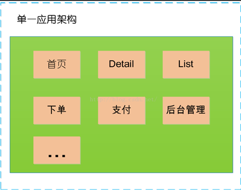
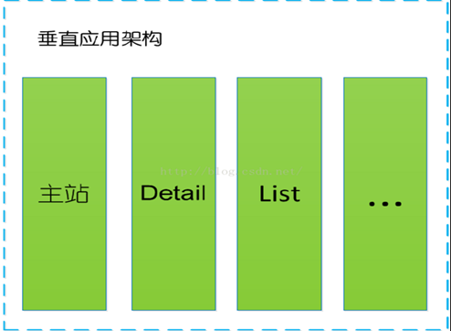
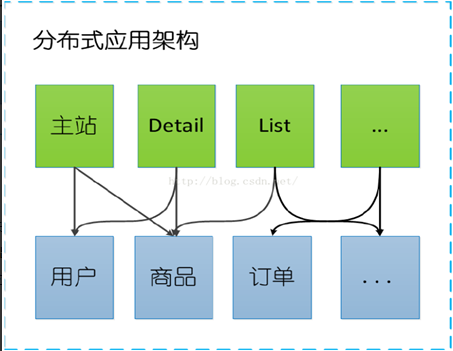
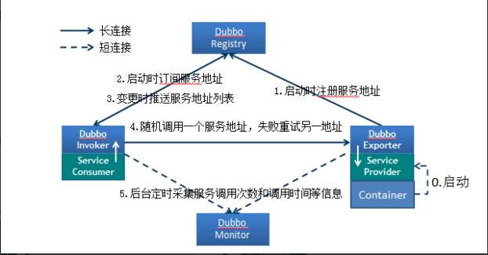
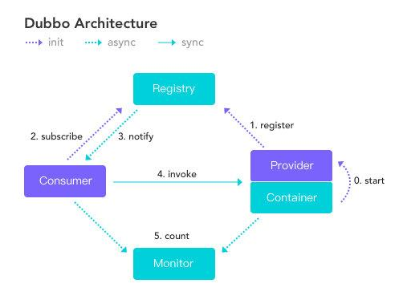
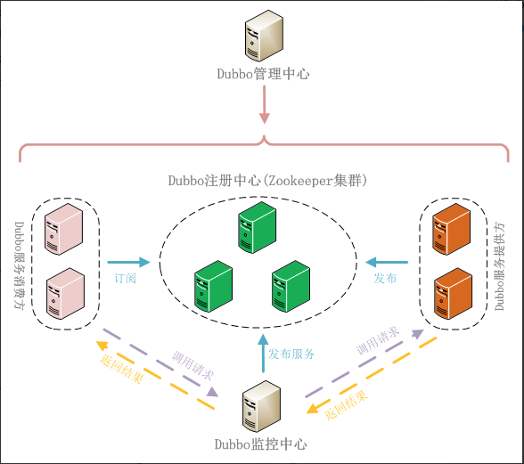
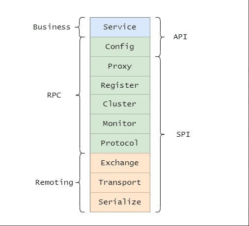

### 架构演变

#### 单一应用框架(ORM)
   
   当网站流量很小时，只需一个应用，将所有功能如下单支付等都部署在一起，以减少部署节点和成本。
   
   此时，用于简化增删改查工作量的 数据访问框架(ORM) 是关键。
   
   缺点：单一的系统架构，使得在开发过程中，占用的资源越来越多，而且随着流量的增加越来越难以维护。
   
   
   
#### 垂直应用框架(MVC)
   
   垂直应用架构解决了单一应用架构所面临的扩容问题，流量能够分散到各个子系统当中，且系统的体积可控，一定程度上降低了开发人员之间协同以及维护的成本，提升了开发效率。
   
   当访问量逐渐增大，单一应用增加机器带来的加速度越来越小，将应用拆成互不相干的几个应用，以提升效率。
   
   此时，用于加速前端页面开发的 Web框架(MVC) 是关键。
   
   缺点：但是在垂直架构中相同逻辑代码需要不断的复制，不能复用。
   
   
   
#### 分布式应用架构(RPC)
   
   当垂直应用越来越多，应用之间交互不可避免，将核心业务抽取出来，作为独立的服务，逐渐形成稳定的服务中心。
   
   使前端应用能更快速的响应多变的市场需求。
   
   此时，用于提高业务复用及整合的 分布式服务框架(RPC) 是关键。
   
   
   
#### 流动计算架构(SOA)
   
   随着服务化的进一步发展，服务越来越多，服务之间的调用和依赖关系也越来越复杂，诞生了面向服务的架构体系(SOA)，也因此衍生出了一系列相应的技术，
   如对服务提供、服务调用、连接处理、通信协议、序列化方式、服务发现、服务路由、日志输出等行为进行封装的服务框架。
   
   当服务越来越多，容量的评估，小服务资源的浪费等问题逐渐显现，此时需增加一个调度中心基于访问压力实时管理集群容量，提高集群利用率。 此时，用于提高机器利用率的 资源调度和治理中心(SOA) 是关键。

### RPC 
   
   RPC(Remote Procedure Call Protocol)：远程过程调用
   
#### 关于RPC
   
   两台服务器A、B，分别部署不同的应用a,b。当A服务器想要调用B服务器上应用b提供的函数或方法的时候，由于不在一个内存空间，不能直接调用，需要通过网络来表达调用的语义传达调用的数据。
   
   说白了，就是你在你的机器上写了一个程序，我这边是无法直接调用的，这个时候就出现了一个远程服务调用的概念。
   
   RPC是一种通过网络从远程计算机程序上请求服务，而不需要了解底层网络技术的协议。RPC协议假定某些传输协议的存在，如TCP或UDP，为通信程序之间携带信息数据。在OSI网络通信模型中，RPC跨越了传输层和应用层。RPC使得开发包括网络分布式多程序在内的应用程序更加容易。
   RPC采用客户机/服务器模式。请求程序就是一个客户机，而服务提供程序就是一个服务器。首先，客户机调用进程发送一个有进程参数的调用信息到服务进程，然后等待应答信息。在服务器端，进程保持睡眠状态直到调用信息到达为止。当一个调用信息到达，服务器获得进程参数，计算结果，发送答复信息，然后等待下一个调用信息，最后，客户端调用进程接收答复信息，获得进程结果，然后调用执行继续进行。
   
####  RPC需要解决的问题
   
##### 通讯问题 :
   
   主要是通过在客户端和服务器之间建立TCP连接，远程过程调用的所有交换的数据都在这个连接里传输。连接可以是按需连接，调用结束后就断掉，也可以是长连接，多个远程过程调用共享同一个连接。
   
##### 寻址问题：
   
   A服务器上的应用怎么告诉底层的RPC框架，如何连接到B服务器（如主机或IP地址）以及特定的端口，方法的名称名称是什么，这样才能完成调用。比如基于Web服务协议栈的RPC，就要提供一个endpoint URI，或者是从UDDI服务上查找。如果是RMI调用的话，还需要一个RMI Registry来注册服务的地址。
   
##### 序列化 与 反序列化 ：
   
   当A服务器上的应用发起远程过程调用时，方法的参数需要通过底层的网络协议如TCP传递到B服务器，由于网络协议是基于二进制的，内存中的参数的值要序列化成二进制的形式，也就是序列化（Serialize）或编组（marshal），通过寻址和传输将序列化的二进制发送给B服务器。
   同理，B服务器接收参数要将参数反序列化。B服务器应用调用自己的方法处理后返回的结果也要序列化给A服务器，A服务器接收也要经过反序列化的过程。
   
### Dubbo
   
   其本质都是远程调用框架，而对于远程调用如果没有分布式的需求，其实是不需要用这么重的框架，只有在分布式的时候，才有Dubbo这样的分布式服务框架的需求，说白了就是个远程服务调用的分布式框架，其重点在于分布式的治理。

#### Dubbo简介
   
   Dubbo 是阿里巴巴 2011年开源的一个基于 Java 的 RPC 框架，中间沉寂了一段时间，不过其他一些企业还在用 Dubbo 并自己做了扩展，比如当当网的 Dubbox，还有网易考拉的 Dubbok。
   
   但是在 2017 年阿里巴巴又重启了对 Dubbo 维护。在 2017 年荣获了开源中国 2017 最受欢迎的中国开源软件 Top 3。
   
   在 2018 年和 Dubbox 进行了合并，并且进入 Apache 孵化器，在 2019 年毕业正式成为 Apache 顶级项目。
   
   目前 Dubbo 社区主力维护的是 2.6.x 和 2.7.x 两大版本，2.6.x 版本主要是 bug 修复和少量功能增强为准，是稳定版本。
   
   而 2.7.x 是主要开发版本，更新和新增新的 feature 和优化，并且 2.7.5 版本的发布被 Dubbo 认为是里程碑式的版本发布。
   
   它实现了面向接口的代理 RPC 调用，并且可以配合 ZooKeeper 等组件实现服务注册和发现功能，并且拥有负载均衡、容错机制等。
   

#### Dubbo核心功能
   
   1.Remoting:远程通讯，提供对多种NIO框架抽象封装，包括“同步转异步”和“请求-响应”模式的信息交换方式。
   
   2.Cluster: 服务框架，提供基于接口方法的透明远程过程调用，包括多协议支持，以及软负载均衡，失败容错，地址路由，动态配置等集群支持。
   
   3.Registry: 服务注册中心，基于注册中心目录服务，使服务消费方能动态的查找服务提供方，使地址透明，使服务提供方可以平滑增加或减少机器。

#### Dubbo组件角色
   
   
   
   

| 组件角色     | 说明                      |
| ---------- | -------------------------|
| Provider   | 暴露服务的服务提供方          |
| Consumer   |调用远程服务的服务消费方       |
| Registry   |服务注册与发现的注册中心       |
| Monitor    |统计服务的调用次调和调用时间的监控中心 |
| Container   |服务运行容器       |

##### 调用关系说明：
   
   1.服务容器Container负责启动，加载，运行服务提供者。
   
   2.服务提供者Provider在启动时，向注册中心注册自己提供的服务。
   
   3.服务消费者Consumer在启动时，向注册中心订阅自己所需的服务。
   
   4.注册中心Registry返回服务提供者地址列表给消费者，如果有变更，注册中心将基于长连接推送变更数据给消费者。
   
   5.服务消费者Consumer，从提供者地址列表中，基于软负载均衡算法，选一台提供者进行调用，如果调用失败，再选另一台调用。
   
   6.服务消费者Consumer和提供者Provider，在内存中累计调用次数和调用时间，定时每分钟发送一次统计数据到监控中心Monitor。
   
   
   
#### Dubbo 分层架构
   
   
   
   大的三层分别为 Business（业务层）、RPC 层、Remoting，并且还分为 API 层和 SPI 层。
   
   分为大三层其实就是和我们知道的网络分层一样的意思，只有层次分明，职责边界清晰才能更好的扩展。
   
   而分 API 层和 SPI 层这是 Dubbo 成功的一点，采用微内核设计+SPI扩展，使得有特殊需求的接入方可以自定义扩展，做定制的二次开发。
   
   Service，业务层，就是咱们开发的业务逻辑层。
   
   
   Config，配置层，主要围绕 ServiceConfig 和 ReferenceConfig，初始化配置信息。
   
   
   Proxy，代理层，服务提供者还是消费者都会生成一个代理类，使得服务接口透明化，代理层做远程调用和返回结果。
   
   
   Register，注册层，封装了服务注册和发现。
   
   
   Cluster，路由和集群容错层，负责选取具体调用的节点，处理特殊的调用要求和负责远程调用失败的容错措施。
   
   
   Monitor，监控层，负责监控统计调用时间和次数。
   
   
   Portocol，远程调用层，主要是封装 RPC 调用，主要负责管理 Invoker，Invoker代表一个抽象封装了的执行体，之后再做详解。
   
   
   Exchange，信息交换层，用来封装请求响应模型，同步转异步。
   
   
   Transport，网络传输层，抽象了网络传输的统一接口，这样用户想用 Netty 就用 Netty，想用 Mina 就用 Mina。
   
   
   Serialize，序列化层，将数据序列化成二进制流，当然也做反序列化。

### Dubbo在Zookeeper中数据模型
   
   Dubbo会利用Zookeeper实现很多的功能，比如：
    
    1. 注册中心
    
    2. 配置中心
    
    3. 元数据中心
   
   Zookeeper在实现这些中心的时候，会需要存储很多的数据，结构如:
   
    • dubbo
    
        • metadata
            
            • consumers
            
            • routers
            
            • configurators
            
            • providers
            
            • 某接口名：表示一个服务
        
        • config（2.7版本新增）
            
            • dubbo
            
            • dubbo-demo-provider-application.configurators：表示某个应用的配置
            
            • org.apache.dubbo.demo.DemoService.condition-router：表示某个服务的条件路由
            
            • org.apache.dubbo.demo.DemoService.configurators：表示某个服务的配置（2.7版本之后的Dubbo会从这个位置读取服务配置），既可以是针对服务提供者的配置，也可以是针对服务消费者的配置，这个节点的内容是yaml格式的。
            
            • dubbo-demo-provider-application.condition-router：表示某个应用的条件路由
            
            • dubbo-demo-provider-application.tag-router：表示某个应用的标签路由
        
        • consumers
        
        • routers
        
        • configurators
        
        • providers
    
    • 某接口名：表示一个服务
        
        • consumers：表示调用当前服务的服务消费者
            
            • consumer://192.168.40.17/org.apache.dubbo.demo.DemoService?application=dubbo-demo-consumer-application&category=consumers&check=false&dubbo=2.0.2&interface=org.apache.dubbo.demo.DemoService&lazy=false&methods=sayHello&pid=13564&release=2.7.0&side=consumer&sticky=false&timestamp=1585913509778
        
        • configurators：表示当前服务的配置（2.7版本之前的Dubbo只能从这个位置读取服务配置）
        
            • override://0.0.0.0/org.apache.dubbo.demo.DemoService?category=configurators&compatible_config=true&dynamic=false&enabled=true&timeout=6001
        
        • routers：表示当前服务的条件路由（2.7版本之前）
            
            • route://0.0.0.0/org.apache.dubbo.demo.DemoService?category=routers&compatible_config=true&dynamic=false&enabled=true&force=true&name=null&priority=0&router=condition&rule=+%3D%3E+host+%21%3D+172.22.3.91&runtime=false
        
        • providres：表示当前服务提供者
            
            • http://192.168.40.17:8081/org.apache.dubbo.demo.DemoService?anyhost=true&application=dubbo-demo-provider-application&bean.name=ServiceBean:org.apache.dubbo.demo.DemoService&deprecated=false&dubbo=2.0.2&dynamic=true&generic=false&interface=org.apache.dubbo.demo.DemoService&methods=sayHello&pid=21548&release=2.7.0&side=provider&timeout=6001&timestamp=1585912730742
