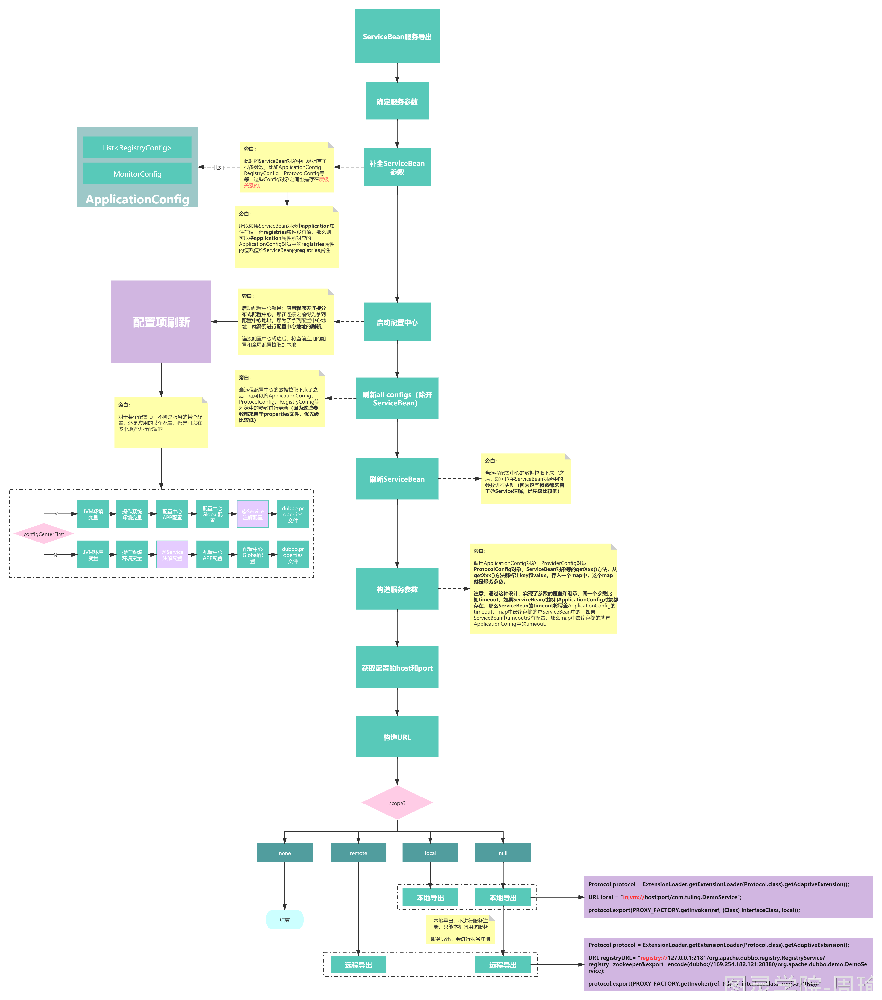
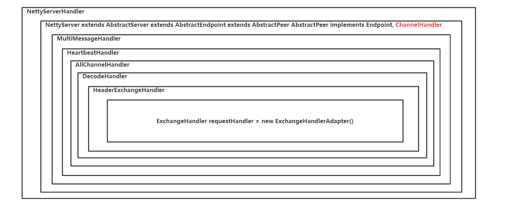
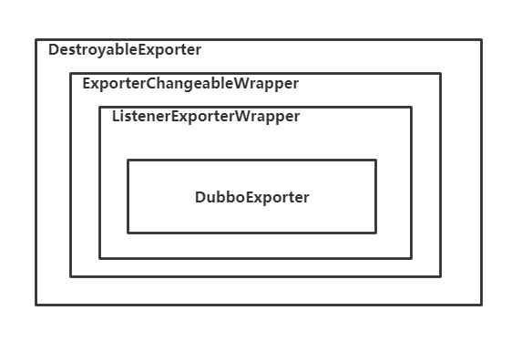
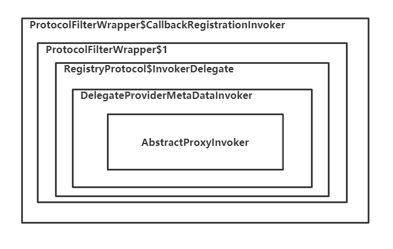
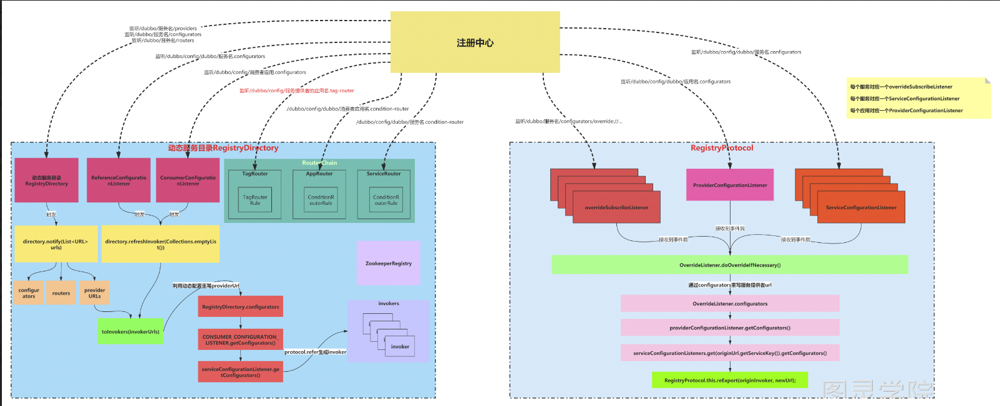
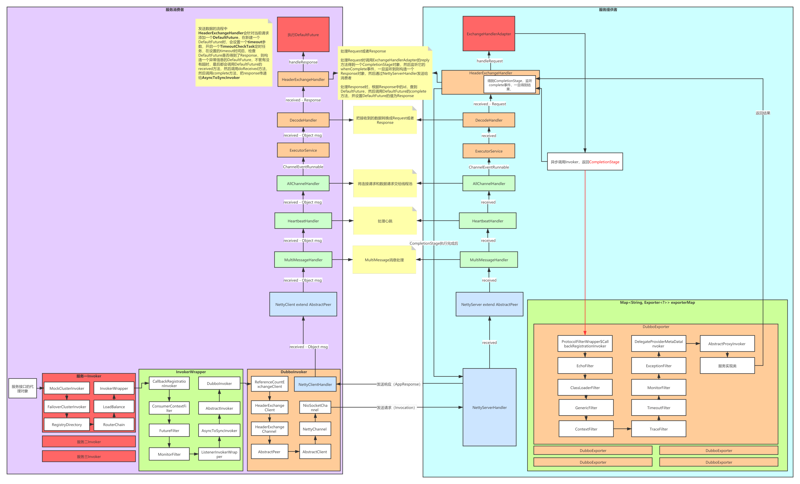

### 1. Dubbo服务导出源码解析

#### 1.1 服务导出入口

   服务导出的入口方法为ServiceBean.export()，此方法会调用ServiceConfig.export()方法，进行真正的服务导出。
   
   服务概念的演化：
      
      1. DemoService接口表示一个服务，此时的服务表示服务定义
      2. DemoServiceImpl表示DemoService服务的具体实现，此时的服务表示服务的具体实现
      3. DemoService+group+version表示一个服务，此时的服务增加了分组和版本概念
      4. http://192.168.1.112:80/com.luban.DemoService表示一个服务，此时的服务增加了机器IP和Port，表示远程机器可以访问这个URL来使用com.luban.DemoService这个服务
      5. http://192.168.1.112:80/com.luban.DemoService?timeout=3000&version=1.0.1&application=dubbo-demo-provider-application表示一个服务，此时的服务是拥有参数的，比如超时时间、版本号、所属应用
   
   在dubbo中就是用的最后一种方式来表示服务的。
   
   服务导出要做的几件事情：
       
       1. 确定服务的参数
       2. 确定服务支持的协议
       3. 构造服务最终的URL
       4. 将服务URL注册到注册中心去
       5. 根据服务支持的不同协议，启动不同的Server，用来接收和处理请求
       6. 因为Dubbo支持动态配置服务参数，所以服务导出时还需要绑定一个监听器Listener来监听服务的参数是否有修改，如果发现有修改，则需要重新进行导出



#### 1.2 确定服务的参数
   
   在执行ServiceConfig.export()时，此时ServiceConfig对象就是一个服务，我们已经知道了这个服务的名字（就是接口的名字），并且此时这个服务可能已经有一些参数了，就是@Service注解上所定义的参数。
   
   但是在Dubbo中，除开可以在@Service注解中给服务配置参数，还有很多地方也可以给服务配置参数，比如：
       
       1. dubbo.properties文件，你可以建立这个文件，dubbo会去读取这个文件的内容作为服务的参数，Dubob的源码中叫做PropertiesConfiguration
       
       2. 配置中心，dubbo在2.7版本后就支持了分布式配置中心，你可以在Dubbo-Admin中去操作配置中心，分布式配置中心就相当于一个远程的dubbo.properties文件，你可以在Dubbo-Admin中去修改这个dubbo.properties文件，当然配置中心支持按应用进行配置，也可以按全局进行配置两种，在Dubbo的源码中AppExternalConfiguration表示应用配置，ExternalConfiguration表示全局配置。
       
       3. 系统环境变量，你可以在启动应用程序时，通过-D的方式来指定参数，在Dubbo的源码中叫SystemConfiguration
       
       4. 再加上通过@Service注解所配置的参数，在Dubbo的源码中叫AbstractConfig
   
   服务的参数可以从这四个位置来，这四个位置上如果配了同一个参数的话，优先级从高到低如下：
    
    SystemConfiguration -> AppExternalConfiguration -> ExternalConfiguration -> AbstractConfig -> PropertiesConfiguration
   
   可以看出，-D方式配置的参数优先级最高，配置中心次之，注解随后，dubbo.properties最后。
   
   你可以在dubbo.properties文件或配置中心中通过一下形式去给一个服务配置参数：
```
dubbo.service.{interface-name}[.{method-name}].timeout=3000
```

   -D方式也类似。
   
   从以上分析我们可以看出，在服务导出时，首先得确定服务的参数。
   
   当然，服务的参数除开来自于服务的自身配置外，还可以来自其上级。
   
   比如如果服务本身没有配置timeout参数，但是如果服务所属的应用的配置了timeout，那么这个应用下的服务都会继承这个timeout配置。
   
   **所以在确定服务参数时，需要先从上级获取参数，获取之后，如果服务本身配置了相同的参数，那么则进行覆盖。**
   
#### 1.3 确定服务支持的协议
   
   确定服务所支持的协议还是比较简单的，就是看用户配了多少个Protocol。和服务参数意义，Protocol也是可以在各个配置点进行配置的。
   
       1. 首先在SpringBoot的application.properties文件中就可能配置了协议
       2. 也可能在dubbo.properties文件中配置了协议
       3. 也可能在配置中心中也配置了协议
       4. 也可能通过-D的方式也配置了协议
   
   所以在服务导出时，需要从以上几个地方获取协议，结果可能是一个协议，也可能是多个协议，从而确定出协议。
   
#### 1.4 构造服务最终的URL
   
   有了确定的协议，服务名，服务参数后，自然就可以组装成服务的URL了。
   
   但是还有一点是非常重要的，在Dubbo中支持服务动态配置，注意，这个和配置中心不是同一概念，动态配置是可以在服务导出后动态的去修改服务配置的，而配置中心则不能达到这一的效果（这个我要在确定一下）。
   
   动态配置，其实就是继续给服务增加了一些参数，所以在把服务的URL注册到注册中心去之前，得先按照动态配置中所添加的配置重写一下URL，也就是应用上动态配置中的参数。
   
   只有这样作完之后得到的URL才是真正准确的服务提供者URL。

#### 1.5 将服务URL注册到注册中心去
   
   有了准确的服务URL之后，就可以把URL注册到注册中心上去了。
   
   这个步骤并不麻烦，只不过这里要去寻找用户是否配置了多个注册中心，将服务URL注册到每个注册中心去。

#### 1.6 根据服务URL启动Server
   
   在服务URL中指定了协议，比如Http协议、Dubbo协议。根据不同的协议启动对应的Server。
   
   比如Http协议就启动Tomcat、Jetty。
   
   比如Dubbo协议就启动Netty。
   
   不能只启动Server，还需要绑定一个RequestHandler，用来处理请求。
   
   比如，Http协议对应的就是InternalHandler。Dubbo协议对应的就是ExchangeHandler。
   
   这里来详细分析一下Dubbo协议所启动的Server。
       
       1. 调用DubboProtocol的openServer(URL url)方法开启启动Server
       2. 调用DubboProtocol的createServer(url)方法，在createServer()方法中调用Exchangers.bind(url, requestHandler)得到一个ExchangeServer
       3. 其中requestHandler表示请求处理器，用来处理请求
       4. 在Exchangers.bind(url, requestHandler)中，先会根据URL得到一个Exchanger，默认为HeaderExchanger
       5. HeaderExchanger中包括HeaderExchangeClient、HeaderExchangeServer
       6. HeaderExchangeClient负责发送心跳，HeaderExchangeServer负责接收心跳，如果超时则会关闭channel
       7. 在构造HeaderExchangeServer之前，会通过调用Transporters.bind(url, new DecodeHandler(new HeaderExchangeHandler(handler)))方法的到一个Server
       8. 默认会使用getTransporter去bind(URL url, ChannelHandler listener)从而得到一个Servlet，此时的listener就是外部传进来的DecodeHandler
       9. 在NettyTransporter的bind方法中会去new NettyServer(url, listener)，所以上面返回的Server默认就是NettyServer
       10. 在构造NettyServer时，会调用ChannelHandlers.wrap(handler, ExecutorUtil.setThreadName(url, SERVER_THREAD_POOL_NAME))再构造一个ChannelHandler。
       11. wrap中的handler就是上面的listener
       12. 在wrap方法中会调用new MultiMessageHandler(new HeartbeatHandler(ExtensionLoader.getExtensionLoader(Dispatcher.class).getAdaptiveExtension().dispatch(handler, url)));构造一个ChannelHandler。
       13. 构造完ChannelHandler后，就是真正的去开启Server了，会调用AbstractServer抽象类的doOpen方法。
       14. 在NettyServer中，会实现doOpen方法，会调用new NettyServerHandler(getUrl(), this)构造一个NettyServerHandler，并bind地址
       15. 至此，DubboProtocol协议的启动Server流程就结束。

   总结一下DubboProtocol协议的RequestHandler链路：
   
   
   
       1. NettyServerHandler：与NettyServer直接绑定的请求处理器，负责从Netty接收到请求，channelRead()方法获取到请求，然后调用下一层的Handler（NettyServer）的received()方法将请求传递下去，此时的请求还是Object msg
       2. NettyServer：NettyServer的父类AbstractPeer中存在received()，该方法没有做什么，直接把msg传递给下一层Handler（MultiMessageHandler）
       3. MultiMessageHandler：此Handler会判断msg是否是一个MultiMessage，如果是，则对MultiMessage进行拆分，则把拆分出来的msg传递给下层Handler（HeartbeatHandler），如果不是，则直接把msg传递给下层Handler（HeartbeatHandler）
       4. HeartbeatHandler：此Handler通过received()方法接收到msg，然后判断该msg是不是一个心跳请求或心跳响应，如果是心跳请求，则此Handler返回一个Response对象（很简单的一个对象），如果是心跳响应，则打印一个日志，不会有其他逻辑，如果都不是，则把msg传递给下层Handler（AllChannelHandler）。
       5. AllChannelHandler：此Handler通过received()方法接收到msg，然后把msg封装为一个ChannelEventRunnable对象，并把ChannelEventRunnable扔到线程池中去，异步去处理该msg。在ChannelEventRunnable中会把msg交给下一个Handler（DecodeHandler）
       6. DecodeHandler：此Handler通过received()方法接收到msg，会对msg解析decode解码，然后交给下一个Handler(HeaderExchangeHandler)
       7. HeaderExchangeHandler：此Handler通过received()方法接收到msg，会判断msg的类型
       a. 如果Request是TwoWay，则会调用下一个Handler(DubboProtocol中的requestHandler)的reply方法得到一个结果，然后返回
       b. 如果Request不是TwoWay，则会调用下一个Handler(DubboProtocol中的requestHandler)的received方法处理该请求，不会返回结果
       8. requestHandler：此Handler是真正的处理请求逻辑，在received()方法中，如果msg是Invocation，则会调用reply方法，但不会返回reply方法所返回的结果，在reply方法中把msg强制转换为Invocation类型 inv，然后根据inv得到对应的服务Invoker，然后调用invoke(inv)方法，得到结果。
       
#### 1.7 服务导出源码流程
       
   1. ServiceBean.export()方法是导出的入口方法，会执行ServiceConfig.export()方法完成服务导出，导出完了之后会发布一个Spring事件ServiceBeanExportedEvent
   
   2. 在ServiceConfig.export()方法中会先调用checkAndUpdateSubConfigs()，这个方法主要完成AbstractConfig的参数刷新(从配置中心获取参数等等)，AbstractConfig是指ApplicationConfig、ProtocolConfig、ServiceConfig等等，刷新完后会检查stub、local、mock等参数是否配置正确
   
   3. 参数刷新和检查完成了之后，就会开始导出服务，如果配置了延迟导出，那么则按指定的时间利用ScheduledExecutorService来进行延迟导出
   
   4. 否则调用doExport()进行服务导出
   
   5. 继续调用doExportUrls()进行服务导出
   
   6. 首先通过loadRegistries()方法获得所配置的注册中心的URL，可能配了多个配置中心，那么当前所导出的服务需要注册到每个配置中心去，这里，注册中心的是以URL的方式来表示的，使用的是什么注册中心、注册中心的地址和端口，给注册中心所配置的参数等等，都会存在在URL上，此URL以registry://开始
   
   7. 获得到注册中心的registryURLs之后，就会遍历当前服务所有的ProtocolConfig，调用doExportUrlsFor1Protocol(protocolConfig, registryURLs);方法把当前服务按每个协议每个注册中心分别进行导出
   
   8. 在doExportUrlsFor1Protocol()方法中，会先构造一个服务URL，包括
       
       a. 服务的协议dubbo://,
       
       b. 服务的IP和PORT，如果指定了就取指定的，没有指定IP就获取服务器上网卡的IP，
       
       c. 以及服务的PATH，如果没有指定PATH参数，则取接口名
       
       d. 以及服务的参数，参数包括服务的参数，服务中某个方法的参数
       
       e. 最终得到的URL类似： dubbo://192.168.1.110:20880/com.luban.DemoService?timeout=3000&&sayHello.loadbalance=random
   
   9. 得到服务的URL之后，会把服务URL作为一个参数添加到registryURL中去，然后把registryURL、服务的接口、当前服务实现类ref生成一个Invoker代理对象，再把这个代理对象和当前ServiceConfig对象包装成一个DelegateProviderMetaDataInvoker对象，DelegateProviderMetaDataInvoker就表示了完整的一个服务
   
   10. 接下来就会使用Protocol去export导出服务了，导出之后将得到一个Exporter对象（该Exporter对象，可以理解为主要可以用来卸载（unexport）服务，什么时候会卸载服务？在优雅关闭Dubbo应用的时候）
   
   11. 接下来我们来详细看看Protocol是怎么导出服务的？
   
   12. 但调用protocol.export(wrapperInvoker)方法时，因为protocol是Protocol接口的一个Adaptive对象，所以此时会根据wrapperInvoker的genUrl方法得到一个url，根据此url的协议找到对应的扩展点，此时扩展点就是RegistryProtocol，但是，因为Protocol接口有两个包装类，一个是ProtocolFilterWrapper、ProtocolListenerWrapper，所以实际上在调用export方法时，会经过这两个包装类的export方法，但是在这两个包装类的export方法中都会Registry协议进行了判断，不会做过多处理，所以最终会直接调用到RegistryProtocol的export(Invoker<T> originInvoker)方法
   
   13. 在RegistryProtocol的export(Invoker<T> originInvoker)方法中，主要完成了以下几件事情：
       
       a. 生成监听器，监听动态配置中心此服务的参数数据的变化，一旦监听到变化，则重写服务URL，并且在服务导出时先重写一次服务URL
       
       b. 拿到重写之后的URL之后，调用doLocalExport()进行服务导出，在这个方法中就会调用DubboProtocol的export方法去导出服务了，导出成功后将得到一个ExporterChangeableWrapper
            
            ⅰ. 在DubboProtocol的export方法中主要要做的事情就是启动NettyServer，并且设置一系列的RequestHandler，以便在接收到请求时能依次被这些RequestHandler所处理
            
            ⅱ. 这些RequestHandler在上文已经整理过了
       
       c. 从originInvoker中获取注册中心的实现类，比如ZookeeperRegistry
       
       d. 将重写后的服务URL进行简化，把不用存到注册中心去的参数去除
       
       e. 把简化后的服务URL调用ZookeeperRegistry.registry()方法注册到注册中心去
       
       f. 最后将ExporterChangeableWrapper封装为DestroyableExporter对象返回，完成服务导出
       
#### 1.8 Exporter架构
   
   
   
   一个服务导出成功后，会生成对应的Exporter：
    
    1. DestroyableExporter：Exporter的最外层包装类，这个类的主要作用是可以用来unexporter对应的服务
    
    2. ExporterChangeableWrapper：这个类主要负责在unexport对应服务之前，把服务URL从注册中心中移除，把该服务对应的动态配置监听器移除
    
    3. ListenerExporterWrapper：这个类主要负责在unexport对应服务之后，把服务导出监听器移除
    
    4. DubboExporter：这个类中保存了对应服务的Invoker对象，和当前服务的唯一标志，当NettyServer接收到请求后，会根据请求中的服务信息，找到服务对应的DubboExporter对象，然后从对象中得到Invoker对象
    
#### 1.9 服务端Invoker架构
   
   
   
   1.ProtocolFilterWrapper$CallbackRegistrationInvoker：会去调用下层Invoker，下层Invoker执行完了之后，会遍历过滤器，查看是否有过滤器实现了ListenableFilter接口，如果有，则回调对应的onResponse方法，比如TimeoutFilter，当调用完下层Invoker之后，就会计算服务的执行时间
   
   2.ProtocolFilterWrapper$1：ProtocolFilterWrapper中的过滤器组成的Invoker，利用该Invoker，可以执行服务端的过滤器，执行完过滤器之后，调用下层Invoker
   
   3.RegistryProtocol$InvokerDelegate：服务的的委托类，里面包含了DelegateProviderMetaDataInvoker对象和服务对应的providerUrl，执行时直接调用下层Invoker
   
   4.DelegateProviderMetaDataInvoker：服务的的委托类，里面包含了AbstractProxyInvoker对象和ServiceConfig对象，执行时直接调用下层Invoker
   
   5.AbstractProxyInvoker：服务接口的代理类，绑定了对应的实现类，执行时会利用反射调用服务实现类实例的具体方法，并得到结果

#### 1.10 服务监听器原理总结
   
   服务在导出的过程中需要向动态配置中心的数据进行订阅，以便当管理人员修改了动态配置中心中对应服务的参数后，服务提供者能及时做出变化。
   
   此功能涉及到版本兼容，因为在Dubbo2.7之前也存在此功能，Dubbo2.7开始对此功能进行了调整。
   
   在Dubbo2.7之前，仅支持多某个服务的动态配置
   
   在Dubbo2.7之后，不仅支持对单个服务的动态配置，也支持对某个应用的动态配置（相当于对这个应用下的所有服务生效）
   
   为了达到这个功能，需要利用Zookeeper的Watcher机制，所以对于服务提供者而言，我到底监听哪个Zookeeper节点的数据变化呢？
   
   这个节点是有规则的，并且在Dubbo2.7前后也不一样：
   
   Dubbo2.7之前：
   
   监听的zk路径是：
   /dubbo/org.apache.dubbo.demo.DemoService/configurators/override://0.0.0.0/org.apache.dubbo.demo.DemoService?category=configurators&compatible_config=true&dynamic=false&enabled=true&timeout=6000
   
   注意，注意监听的是节点名字的变化，而不是节点内容
   
   Dubbo2.7之后
   
   监听的zk路径是：
    
    • 服务： /dubbo/config/dubbo/org.apache.dubbo.demo.DemoService.configurators节点的内容
    
    • 应用： /dubbo/config/dubbo/dubbo-demo-provider-application.configurators节点的内容
   
   注意，要和配置中心的路径区分开来，配置中心的路径是：
    
    • 应用：/dubbo/config/dubbo/org.apache.dubbo.demo.DemoService/dubbo.properties节点的内容
    
    • 全局：/dubbo/config/dubbo/dubbo.properties节点的内容
   
   所以在一个服务进行导出时，需要在服务提供者端给当前服务生成一个对应的监听器实例，这个监听器实例为OverrideListener，它负责监听对应服务的动态配置变化，并且根据动态配置中心的参数重写服务URL。
   
   除开有OverrideListener之外，在Dubbo2.7之后增加了另外两个：
       
       1. ProviderConfigurationListener：监听的是应用的动态配置数据修改，所以它是在RegistryProtocol类中的一个属性，并且是随着RegistryProtocol实例化而实例化好的，一个应用中只有一个
       2. ServiceConfigurationListener：监听的是服务的动态配置数据修改，和OverrideListener类似，也是对应一个服务的，所以在每个服务进行导出时都会生成一个，实际上ServiceConfigurationListener的内部有一个属性就是OverrideListener，所以当ServiceConfigurationListener监听数据发生了变化时，就会把配置中心的最新数据交给OverrideListener去重写服务URL。
       3. 同时在RegistryProtocol类中报存了所有服务所对应的OverrideListener，所以实际上当ProviderConfigurationListener监听到数据发生了变化时，也会把它所得到的最新数据依次调用每个OverrideListener去重写服务对应的服务URL。
       4. ProviderConfigurationListener会监听/dubbo/config/dubbo/dubbo-demo-provider-application.configurators节点
       5. ServiceConfigurationListener会监听/dubbo/config/dubbo/org.apache.dubbo.demo.DemoService.configurators节点
   
   整理修改动态配置触发流程：
   
   1. 修改服务动态配置，底层会修改Zookeeper中的数据，
        
        a. /dubbo/config/dubbo/org.apache.dubbo.demo.DemoService.configurators节点的内容
   
   2. ServiceConfigurationListener会监听到节点内容的变化，会触发ServiceConfigurationListener的父类AbstractConfiguratorListener的process(ConfigChangeEvent event)方法
   3. ConfigChangeEvent表示一个事件，事件中有事件类型，还有事件内容（节点内容），还有触发这个事件的节点名字，事件类型有三个：
        
        a. ADDED
        
        b. MODIFIED
        
        c. DELETED
   
   4. 当接收到一个ConfigChangeEvent事件后，会根据事件类型做对应的处理
        
        a. ADDED、MODIFIED：会根据节点内容去生成override://协议的URL，然后根据URL去生成Configurator， Configurator对象很重要，表示一个配置器，根据配置器可以去重写URL
        
        b. DELETED：删除ServiceConfigurationListener内的所有的Configurator
   
   5. 生成了Configurator后，调用notifyOverrides()方法对服务URL进行重写
   
   6. 注意，每次重写并不仅仅只是用到上面所生成的Configurator，每次重写要用到所有的Configurator，包括本服务的Configurator，也包括本应用的Configurator，也包括老版本管理台的Configurator，重写URL的逻辑如下：
        
        a. 从exporter中获取目前已经导出了的服务URL-currentUrl
        
        b. 根据老版本管理台的Configurator重写服务URL
        
        c. 根据providerConfigurationListener中的Configurator重写服务URL
        
        d. 根据serviceConfigurationListeners中对应的服务的Configurator重写服务URL
        
        e. 如果重写之后newUrl和currentUrl相等，那么不需要做什么了
        
        f. 如果重写之后newUrl和currentUrl不相等，则需要进行服务重新导出：
            
            ⅰ. 根据newUrl进行导出，注意，这里只是就是调用DubboProtocol的export，再次去启动NettyServer
            
            ⅱ. 对newUrl进行简化，简化为registeredProviderUrl
            
            ⅲ. 调用RegistryProtocol的unregister()方法，把当前服务之前的服务提供URL从注册中心删掉
            
            ⅳ. 调用RegistryProtocol的register()方法，把新的registeredProviderUrl注册到注册中心


###  2. Dubbo服务引入源码解析
   
   当Spring启动过程中，会去给@Reference注解标注了的属性去进行赋值，赋值的对象为ReferenceBean中get()方法所返回的对象，这个对象是一个代理对象。
   
   对于ReferenceBean，它表示应用想要引入的服务的信息，在执行get()时会做如下几步：
   
   1. 调用checkAndUpdateSubConfigs()，检查和更新参数，和服务提供者类似，把ReferenceBean里的属性的值更新为优先级最高的参数值
   
   2. 调用init()去生成代理对象ref，get()方法会返回这个ref
   
   3. 在生成代理对象ref之前，先把消费者所引入服务设置的参数添加到一个map中，等会根据这个map中的参数去从注册中心查找服务
   
   4. 把消费者配置的所有注册中心获取出来
        
        a. 如果只有一个注册中心，那么直接调用Protocol的refer(interfaceClass, urls.get(0));得到一个Invoker对象
        
        b. 如果有多个注册中心，则遍历每个注册中心，分别调用Protocol的refer(interfaceClass, url);得到一个Invoker对象添加到invokers中，然后把invokers调用CLUSTER.join(new StaticDirectory(u, invokers));封装所有invokers得到一个invoker，
   
   5. 把最终得到的invoker对象调用PROXY_FACTORY.getProxy(invoker);得到一个代理对象，并返回，这个代理对象就是ref
   
   6. 总结：上文的Invoker对象，表示服务执行者，从注册中心refer下来的是一个服务执行者，合并invokers后得到的invoker也是一个服务执行者（抽象范围更大了）
   
   接下来，来看Protorol.refer(interfaceClass, url)方法是怎么生成一个Invoker的
   
   1. 首先interfaceClass表示要引入的服务接口，url是注册中心的url（registry://），该url中有一个refer参数，参数值为当前所要引入服务的参数
   
   2. 调用doRefer(cluster, registry, type, url)
   
   3. 在doRefer方法中会生成一个RegistryDirectory
   
   4. 然后获取新版本中的路由器链，并添加到RegistryDirectory中去
   
   5. RegistryDirectory监听几个目录（注意，完成监听器的订阅绑定后，会自动触发一次去获取这些目录上的当前数据）
        
        a. 当前所引入的服务的动态配置目录：/dubbo/config/dubbo/org.apache.dubbo.demo.DemoService:1.1.1:g1.configurators
        
        b. 当前所引入的服务的提供者目录：/dubbo/org.apache.dubbo.demo.DemoService/providers
        
        c. 当前所引入的服务的老版本动态配置目录：/dubbo/org.apache.dubbo.demo.DemoService/configurators
        
        d. 当前所引入的服务的老版本路由器目录：/dubbo/org.apache.dubbo.demo.DemoService/routers
   
   6. 调用cluster.join(directory)得到一个invoker
   
   7. 返回invoker（如果消费者引入了多个group中的服务，那么这里返回的是new MergeableClusterInvoker<T>(directory);，否则返回的是new FailoverClusterInvoker<T>(directory);）
   
   8. 但是，上面返回的两个Invoker都会被MockClusterInvoker包装，所以最终返回的是MockClusterInvoker。
   
####  2.1 新版本构造路由链
   
   RouterChain.buildChain(url)方法赋值得到路由链。
   
   这里的url是这样的：consumer://192.168.0.100/org.apache.dubbo.demo.DemoService?application=dubbo-demo-consumer-application&dubbo=2.0.2&group=g1&interface=org.apache.dubbo.demo.DemoService&lazy=false&methods=sayHello&pid=19852&release=2.7.0&revision=1.1.1&side=consumer&sticky=false&timestamp=1591332529643&version=1.1.1
   
   表示所引入的服务的参数，在获得路由链时就要根据这些参数去匹配得到符合当前的服务的Router.
   
   1. RouterChain.buildChain(url)
   
   2. new RouterChain<>(url)
   
   3. List<RouterFactory> extensionFactories = ExtensionLoader.getExtensionLoader(RouterFactory.class).getActivateExtension(url, (String[]) null);根据url去获取可用的RouterFactory，可以拿到四个：
        
        a. MockRouterFactory：Mock路由，没有order，相当于order=0
        
        b. TagRouterFactory: 标签路由，order = 100
        
        c. AppRouterFactory: 应用条件路由，order = 200
        
        d. ServiceRouterFactory: 服务条件路由，order = 300
   
   4. 遍历每个RouterFactory，调用getRouter(url)方法得到Router，存到List<Router> routers中
   
   5. 对routers按order从小到大的顺序进行排序
   
   AppRouter和ServiceRouter是非常类似，他们的父类都是ListenableRouter，在创建AppRouter和ServiceRouter时，会绑定一个监听器，比如：
   
   1. AppRouter监听的是：/dubbo/config/dubbo/dubbo-demo-consumer-application.condition-router节点的内容
   
   2. ServiceRouter监听的是：/dubbo/config/dubbo/org.apache.dubbo.demo.DemoService:1.1.1:g1.condition-router节点的内容
   
   绑定完监听器之后，会主动去获取一下对应节点的内容（也就是所配置的路由规则内容），然后会去解析内容得到ConditionRouterRule routerRule，再调用generateConditions(routerRule);方法解析出一个或多个ConditionRouter，并存入到List<ConditionRouter> conditionRouters中。
   
   注意routerRule和conditionRouters是ListenableRouter的属性，就是在AppRouter和ServiceRouter中的。
   
   对于TagRouter就比较特殊，首先标签路由是用在，当消费者在调用某个服务时，通过在请求中设置标签，然后根据所设置的标签获得可用的服务提供者地址。而且目前TagRouter只支持应用级别的配置(而且是服务提供者应用)。
   
   所以对于服务消费者而言，在引用某个服务时，需要知道提供这个服务的应用名，然后去监听这个应用名对应的.tag-router节点内容，比如/dubbo/config/dubbo/dubbo-demo-provider-application.tag-router。
   
   那么问题来了，怎么才能知道提供这个服务的服务提供者的应用名呢？
   
   答案是，需要先获取到当前所引入服务的服务提供者URL，从URL中得到服务提供者的应用名。
   
   拿到应用名之后才能去想应用名对应的.tag-router节点去绑定监听器。
   
   这就是TagRouter和AppRouter、ServiceRouter的区别，对于AppRouter而言，监听的是本消费者应用的路由规则，对于ServiceRouter而言，监听的是所引入服务的路由规则，都比较简单。
   
   **所以，TagRouter是在引入服务时，获取到服务的提供者URL之后，才会去监听.tag-router节点中的内容，并手动获取一次节点中的内容，设置TagRouter对象中tagRouterRule属性，表示标签路由规则。**
   
   到此，新版本路由链构造完毕。
   
#### 2.2 服务目录
   
   消费端每个服务对应一个服务目录RegistryDirectory。
   
   一个服务目录中包含了：
   
   1. serviceType：表示服务接口
   
   2. serviceKey：表示引入的服务key，serviceclass+version+group
   
   3. queryMap：表示引入的服务的参数配置
   
   4. configurators：动态配置
   
   5. routerChain：路由链
   
   6. invokers：表示服务目录当前缓存的服务提供者Invoker
   
   7. ConsumerConfigurationListener：监听本应用的动态配置
   
   8. ReferenceConfigurationListener：监听所引入的服务的动态配置

   在服务消费端有几个监听器：
   
   1. ConsumerConfigurationListener：监听本应用的动态配置，当应用的动态配置发生了修改后，会调用RegistryDirectory的refreshInvoker()方法，对应的路径为："/dubbo/config/dubbo/dubbo-demo-consumer-application.configurators"
   
   2. ReferenceConfigurationListener：监听所引入的服务的动态配置，当服务的动态配置发生了修改后，会调用RegistryDirectory的refreshInvoker()方法，对应的路径为："/dubbo/config/dubbo/org.apache.dubbo.demo.DemoService:1.1.1:g1.configurators"
   
   3. RegistryDirectory：RegistryDirectory本身也是一个监听器，它会监听所引入的服务提供者、服务动态配置（老版本）、服务路由，路径分别为：
        
        a. "/dubbo/org.apache.dubbo.demo.DemoService/providers"
        
        b. "/dubbo/org.apache.dubbo.demo.DemoService/configurators"
        
        c. "/dubbo/org.apache.dubbo.demo.DemoService/routers"
   
   4. 路由器Router：每个Router自己本身也是一个监听器，负责监听对应的路径
        
        a. AppRouter：应用路由，监听的路径为"/dubbo/config/dubbo/dubbo-demo-consumer-application.condition-router"
        
        b. ServiceRouter: 服务路由，监听的路径为"/dubbo/config/dubbo/org.apache.dubbo.demo.DemoService:1.1.1:g1.condition-router"
        
        c. TagRouter: 标签路由，标签路由和应用路由、服务路由有所区别，应用路由和服务路由都是在消费者启动，在构造路由链时会进行监听器的绑定，但是标签路由不是消费者启动的时候绑定监听器的，是在引入服务时，获取到服务的提供者URL之后，才会去监听.tag-router节点中的内容，监听的路径为"/dubbo/config/dubbo/dubbo-demo-provider-application.tag-router"
   
   当ConsumerConfigurationListener接收到了消费者应用的动态配置数据变化后，会调用当前消费者应用中的所有RegistryDirectory的refreshInvoker()方法，表示刷新消费者应用中引入的每个服务对应的Invoker
   
   当ReferenceConfigurationListener接收到了某个服务的动态配置数据变化后，会调用该服务对应的RegistryDirectory的refreshInvoker()方法，表示刷新该服务对应的Invoker
   
   当AppRouter和ServiceRouter接收到条件路由的数据变化后，就会更新Router内部的routerRule和conditionRouters属性。这两个属性在服务调用过程中会用到。
   
   当TagRouter接收到标签路由的数据变化后，就会更新TagRouter内部的tagRouterRule的属性，这个属性在服务调用过程中会用到。
   
   当RegistryDirectory接收到"/dubbo/org.apache.dubbo.demo.DemoService/configurators"节点数据变化后，会生成configurators
   
   当RegistryDirectory接收到"/dubbo/org.apache.dubbo.demo.DemoService/routers"节点数据变化后，会生成Router并添加到routerChain中
   
   当RegistryDirectory接收到"/dubbo/org.apache.dubbo.demo.DemoService/providers"节点数据变化后，会调用refreshOverrideAndInvoker()方法。这个方法是就用来针对每个服务提供者来生成Invoker的。
   
   1. refreshOverrideAndInvoker方法中首先调用overrideDirectoryUrl()方法利用Configurators重写目录地址，目录地址是这样的：zookeeper://127.0.0.1:2181/org.apache.dubbo.registry.RegistryService?application=dubbo-demo-consumer-application&dubbo=2.0.2&group=g1&interface=org.apache.dubbo.demo.DemoService&lazy=false&methods=sayHello&pid=49964&register.ip=192.168.40.17&release=2.7.0&revision=1.1.1&side=consumer&sticky=false&timestamp=1591339005022&version=1.1.1，在注册中心URL基础上把当前引入服务的参数作为URL的Parameters，所以这个地址既包括了注册中心的信息，也包括了当前引入服务的信息
   
   2. 利用老版本configurators，Consumer应用的configurators，引入的服务的configurators去重写目录地址。
   
   3. 重写往目录地址后，调用refreshInvoker(urls)方法去刷新Invoker
   
   4. 在refreshInvoker(urls)方法中会把从注册中心获取到的providers节点下的服务URL，调用toInvokers(invokerUrls)方法得到Invoker
   
   5. 先按Protocol进行过滤，并且调用DubboProtocol.refer方法得到Invoker
   
   6. 将得到的invokers设置到RouterChain上，并且调用RouterChain上所有的routers的notify(invokers)方法，实际上这里只有TagRouter的notify方法有用
   
   7. 再把属于同一个group中的invoker合并起来
   
   8. 这样Invoker就生成好了



#### 2.3 DubboProtocol的服务引入（Refer）
   
   DubboProtocol中并没有refer方法，是在它的父类AbstractProtocol中才有的refer方法

```
@Override
public <T> Invoker<T> refer(Class<T> type, URL url) throws RpcException {
	// 异步转同步Invoker , type是接口，url是服务地址
	// DubboInvoker是异步的，而AsyncToSyncInvoker会封装为同步的
	return new AsyncToSyncInvoker<>(protocolBindingRefer(type, url));
}
```
   
   调用protocolBindingRefer()方法得到一个Invoker后，会包装为一个AsyncToSyncInvoker然后作为refer方法的结果返回。
   
   在DubboProtocol的protocolBindingRefer()方法中会new一个DubboInvoker，然后就返回了。
   
   在构造DubboInvoker时，有一个非常重要的步骤，构造clients。DubboInvoker作为消费端服务的执行者，在调用服务时，是需要去发送Invocation请求的，而发送请求就需要client，之所以有多个client，是因为DubboProtocol支持多个。
   
   假如在一个DubboInvoker中有多个Client，那么在使用这个DubboInvoker去调用服务时，就可以提高效率，比如一个服务接口有多个方法，那么在业务代码中，可能会不断的调用该接口中的方法，并且由于DubboProtocol底层会使用异步去发送请求，所以在每次需要发送请求时，就可以从clients轮询一个client去发送这个数据，从而提高效率。
   
   接下来，来看看clients是如何生成的。
   
   1. 首先，一个DubboInvoker到底支持多少个Client呢？这是可以配置的，参数为connections，按指定的数字调用initClient(url)得到ExchangeClient。
   
   2. initClient(url)的实现逻辑为
        
        a. 获取client参数，表示是用netty还是mina等等
        
        b. 获取codec参数，表示数据的编码方式
        
        c. 获取heartbeat参数，表示长连接的心跳时间，超过这个时间服务端没有收到数据则关闭socket，默认为1分钟
        
        d. 如果所指定的client没有对应的扩展点，则抛异常
        
        e. 获取lazy参数，默认为false，如果为true，那么则直接返回一个LazyConnectExchangeClient，表示真正在发送数据时才建立socket
        
        f. 否则调用Exchangers.connect(url, requestHandler)获得一个client
        
        g. 在connect()方法中调用HeaderExchanger的connect方法去建立socket连接并得到一个HeaderExchangeClient
        
        h. 在构造HeaderExchangeClient时需要先执行Transporters.connect()方法得到一个Client
        
        i. 会调用NettyTransporter的connect()去构造一个NettyClient
        
        j. 在构造NettyClient的过程中，会去初始化Netty的客户端，然后连接Server端，建立一个Socket连接

#### 2.4 最复杂情况下的Invoker链
    
```
@Reference(url = "dubbo://192.168.40.17:20881/org.apache.dubbo.demo.DemoService;registry://127.0.0.1:2181/org.apache.dubbo.registry.RegistryService?registry=zookeeper")
private DemoService demoService; 
```

   在@Reference注解上定义了url参数，有两个值
   
   1. dubbo://192.168.40.17:20881/org.apache.dubbo.demo.DemoService
    
   2. registry://127.0.0.1:2181/org.apache.dubbo.registry.RegistryService?registry=zookeeper

   最终refer处理的invoker链路为：
   
       • MockClusterInvoker
          
          • invoker=RegistryAwareClusterInvoker
            
            • directory=StaticDirectory
                • 0=ProtocolFilterWrapper$CallbackRegistrationInvoke子流程
                • 1=MockClusterInvoker
                    • FailoverClusterInvoker
                    • RegistryDirectory
                        • invokers=UnmodifiableRandomAccessList size=1
                            • 0=RegistryDirectory$InvokerDelegate
                                • ProtocolFilterWrapper$CallbackRegistrationInvoke子流程
   
    • ProtocolFilterWrapper$CallbackRegistrationInvoke子流程
        • filterInvoker=ProtocolFilterWrapper$1
            • filter=ConsumerContextFilter
            • next=ProtocolFilterWrapper$1
                • filter=FutureFilter
                • next=ProtocolFilterWrapper$1
                   • filter=MonitorFilter
                   • next=ListenerInvokerWrapper
                        • invoker=AsyncToSyncInvoker
                            • invoker=DubboInvoker

#### 2.5 Invoker总结
   
   MockClusterInvoker： 完成Mock功能，由MockClusterWrapper生成，MockClusterWrapper是Cluster接口的包装类，通过Cluster.join()方法得到MockClusterInvoker
   
   FailoverClusterInvoker：完成集群容错功能，是MockClusterInvoker的下级
   
   RegistryAwareClusterInvoker：如果指定了多个注册中心，那么RegistryAwareClusterInvoker完成选择默认的注册中心的进行调用，如果没有指定默认的，则会遍历注册中心进行调用，如果该注册中心没有对应的服务则跳过。
   
   DubboInvoker：完成Dubbo协议底层发送数据
   
   ProtocolFilterWrapper$CallbackRegistrationInvoker：完成对filter的调用，ProtocolFilterWrapper是Protocol接口的包装类，通过Protocol.refer()方法得到CallbackRegistrationInvoke。


### 3. Dubbo服务调用源码解析
   
   
   
   processon链接：https://www.processon.com/view/link/5eda2e5ff346fb1712e3303b
   
#### 3.1 服务消费端执行逻辑
   
   1.MockClusterInvoker.invoke(new RpcInvocation(method, args))：Mock逻辑
   
   2.AbstractClusterInvoker.invoke(invocation)：把RpcContext中设置的Attachments添加到invocation对象上，调用路由链从服务目录上筛选出适合的服务Invoker，获得服务均衡策略loadbalance
   
   3.FailoverClusterInvoker.doInvoke(invocation, invokers, loadbalance)：根据负载均衡策略选出一个invoker，然后执行
   
   4.InvokerWrapper.invoke(invocation)：没做什么事情
   
   5.CallbackRegistrationInvoker.invoke(invocation)：开始执行Filter链，执行完得到结果后，会获取ListenableFilter中的listener，执行listener的onResponse方法
   
   6.ConsumerContextFilter.invoke(invocation)：设置RpcContext中LocalAddress、RemoteAddress、RemoteApplicationName参数
   
   7.FutureFilter.invoke(invocation)：
   
   8.MonitorFilter.invoke(invocation)：方法的执行次数+1
   
   9.ListenerInvokerWrapper.invoke(invocation)：没做什么事情
   
   10.AsyncToSyncInvoker.invoke(invocation)：异步转同步，会先用下层Invoker去异步执行，然后阻塞Integer.MAX_VALUE时间，直到拿到了结果
   
   11.AbstractInvoker.invoke(invocation)：主要调用DubboInvoker的doInvoke方法，如果doInvoker方法出现了异常，会进行包装，包装成AsyncRpcResult
   
   12.DubboInvoker.doInvoke(invocation)：从clients轮询出一个client进行数据发送，如果配置了不关心结果，则调用ReferenceCountExchangeClient的send方法，否则调用ReferenceCountExchangeClient的request方法
   
   13.ReferenceCountExchangeClient.request(Object request, int timeout)：没做什么事情
   
   14.HeaderExchangeClient.request(Object request, int timeout)：没做什么事情
   
   15.HeaderExchangeChannel.request(Object request, int timeout)：构造一个Request对象，并且会构造一个DefaultFuture对象来阻塞timeout的时间来等待结果，在构造DefaultFuture对象时，会把DefaultFuture对象和req的id存入FUTURES中，FUTURES是一个Map，当HeaderExchangeHandler接收到结果时，会从这个Map中根据id获取到DefaultFuture对象，然后返回Response。
   
   16.AbstractPeer.send(Object message)：从url中获取send参数，默认为false
   
   17.AbstractClient.send(Object message, boolean sent)：没做什么
   
   18.NettyChannel.send(Object message, boolean sent)：调用NioSocketChannel的writeAndFlush发送数据，然后判断send如果是true，那么则阻塞url中指定的timeout时间，因为如果send是false，在HeaderExchangeChannel中会阻塞timeout时间
   
   19.NioSocketChannel.writeAndFlush(Object msg)：最底层的Netty非阻塞式的发送数据
   
   总结一下上面调用流程：
   
   1. 最外层是Mock逻辑，调用前，调用后进行Mock
   
   2. 从服务目录中，根据当前调用的方法和路由链，筛选出部分服务Invoker（DubboInvoker）
   
   3. 对服务Invoker进行负载均衡，选出一个服务Invoker
   
   4. 执行Filter链
   
   5. AsyncToSyncInvoker完成异步转同步，因为DubboInvoker的执行是异步非阻塞的，所以如果是同步调用，则会在此处阻塞，知道拿到响应结果
   
   6. DubboInvoker开始异步非阻塞的调用
   
   7. HeaderExchangeChannel中会阻塞timeout的时间来等待结果，该timeout就是用户在消费端所配置的timeout

#### 3.2 服务提供端执行逻辑
   
   1. NettyServerHandler：接收数据
   
   2. MultiMessageHandler：判断接收到的数据是否是MultiMessage，如果是则获取MultiMessage中的单个Message，传递给HeartbeatHandler进行处理
   
   3. HeartbeatHandler：判断是不是心跳消息，如果是不是则把Message传递给AllChannelHandler
   
   4. AllChannelHandler：把接收到的Message封装为一个ChannelEventRunnable对象，扔给线程池进行处理
   
   5. ChannelEventRunnable：在ChannelEventRunnable的run方法中会调用DecodeHandler处理Message
   
   6. DecodeHandler：按Dubbo协议的数据格式，解析当前请求的path，versio，方法，方法参数等等，然后把解析好了的请求交给HeaderExchangeHandler
   
   7. HeaderExchangeHandler：处理Request数据，首先构造一个Response对象，然后调用ExchangeHandlerAdapter得到一个CompletionStage future，然后给future通过whenComplete绑定一个回调函数，当future执行完了之后，就可以从回调函数中得到ExchangeHandlerAdapter的执行结果，并把执行结果设置给Response对象，通过channel发送出去。
   
   8. ExchangeHandlerAdapter：从本机已经导出的Exporter中根据当前Request所对应的服务key，去寻找Exporter对象，从Exporter中得到Invoker，然后执行invoke方法，此Invoker为ProtocolFilterWrapper$CallbackRegistrationInvoker
   
   9. ProtocolFilterWrapper$CallbackRegistrationInvoker：负责执行过滤器链，并且在执行完了之后回调每个过滤器的onResponse或onError方法
   
   10. EchoFilter：判断当前请求是不是一个回升测试，如果是，则不继续执行过滤器链了（服务实现者Invoker也不会调用了）
   
   11. ClassLoaderFilter：设置当前线程的classloader为当前要执行的服务接口所对应的classloader
   
   12. GenericFilter：把泛化调用发送过来的信息包装为RpcInvocation对象
   
   13. ContextFilter：设置RpcContext.getContext()的参数
   
   14. TraceFilter：先执行下一个invoker的invoke方法，调用成功后录调用信息
   
   15. TimeoutFilter：调用时没有特别处理，只是记录了一下当前时间，当整个filter链都执行完了之后回调TimeoutFilter的onResponse方法时，会判断本次调用是否超过了timeout
   
   16. MonitorFilter：记录当前服务的执行次数
   
   17. ExceptionFilter：调用时没有特别处理，在回调onResponse方法时，对不同的异常进行处理，详解Dubbo的异常处理
   
   18. DelegateProviderMetaDataInvoker：过滤器链结束，调用下一个Invoker
   
   19. AbstractProxyInvoker：在服务导出时，根据服务接口，服务实现类对象生成的，它的invoke方法就会执行服务实现类对象的方法，得到结果
   
#### 3.3 Dubbo的异常处理
   
   当服务消费者在调用一个服务时，服务提供者在执行服务逻辑时可能会出现异常，对于Dubbo来说，服务消费者需要在消费端抛出这个异常，那么这个功能是怎么做到的呢？
   
   服务提供者在执行服务时，如果出现了异常，那么框架会把异常捕获，捕获异常的逻辑在AbstractProxyInvoker中，捕获到异常后，会把异常信息包装为正常的AppResponse对象，只是AppResponse的value属性没有值，exception属性有值。
   
   此后，服务提供者会把这个AppResponse对象发送给服务消费端，服务消费端是在InvokerInvocationHandler中调用AppResponse的recreate方法重新得到一个结果，在recreate方法中会去失败AppResponse对象是否正常，也就是是否存在exception信息，如果存在，则直接throw这个exception，从而做到服务执行时出现的异常，在服务消费端抛出。
   
   那么这里存在一个问题，如果服务提供者抛出的异常类，在服务消费者这边不存在，那么服务消费者也就抛不出这个异常了，那么dubbo是怎么处理的呢？
   
   这里就涉及到了ExceptionFilter，它是服务提供者端的一个过滤器，它主要是在服务提供者执行完服务后会去识别异常：
   
   1. 如果是需要开发人员捕获的异常，那么忽略，直接把这个异常返回给消费者
   
   2. 如果在当前所执行的方法签名上有声明，那么忽略，直接把这个异常返回给消费者
   
   3. 如果抛出的异常不需要开发人员捕获，或者方法上没有申明，那么服务端或记录一个error日志
   
   4. 异常类和接口类在同一jar包里，那么忽略，直接把这个异常返回给消费者
   
   5. 如果异常类是JDK自带的异常，那么忽略，直接把这个异常返回给消费者
   
   6. 如果异常类是Dubbo自带的异常，那么忽略，直接把这个异常返回给消费者
   
   7. 否则，把异常信息包装成RuntimeException，并覆盖AppResponse对象中的exception属性