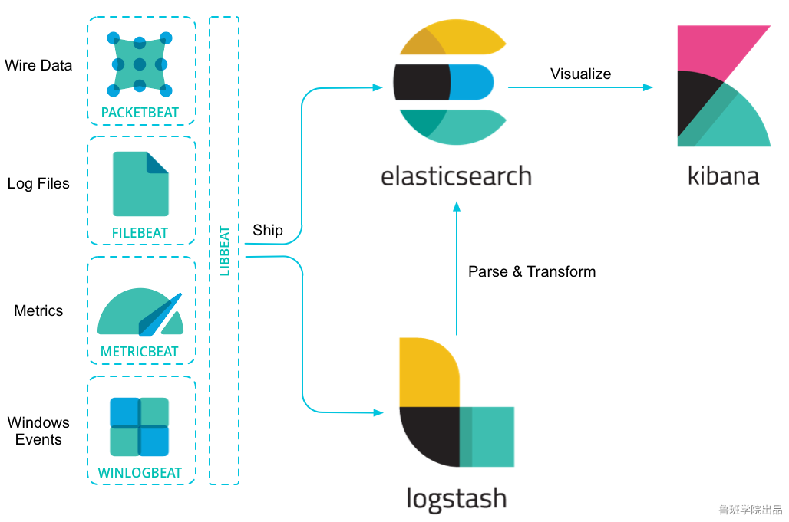
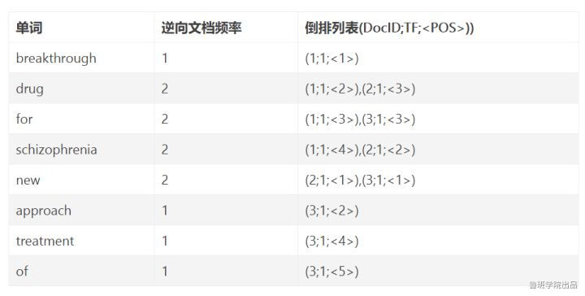
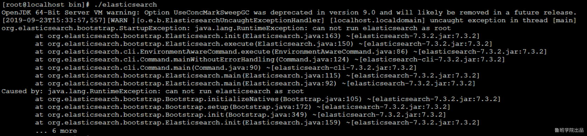
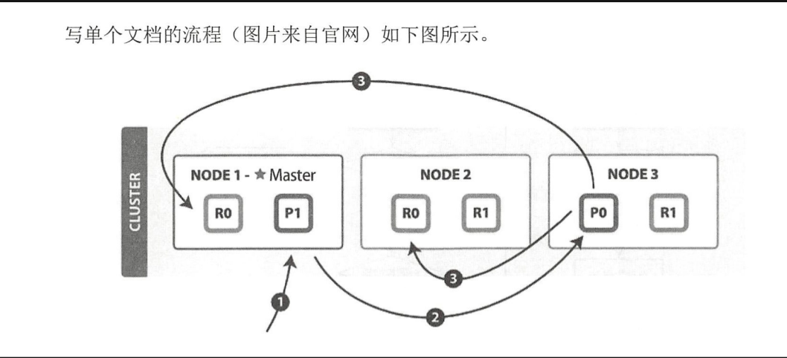
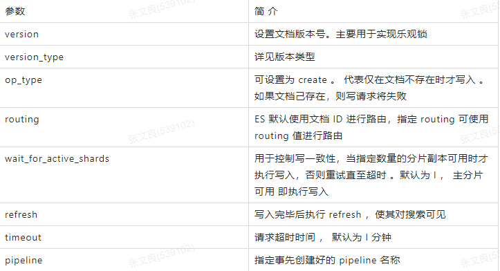

### 引言

#### 什么是elasticsearch？
   
   ElasticSearch是一个分布式，高性能、高可用、可伸缩的搜索和分析系统

#### 什么是Elastic Stack？
   
   Elastic Stack,前身缩写是ELK，就是ElasticSearch + LogStash + Kibana
   
   
   
   ES的使用场景:
   
   • 网上商场,搜索商品.
   
   • ES配合logstash,kibana,日志分析.

#### 为什么要使用elasticsearch？
   
   假设用数据库做搜索，当用户在搜索框输入“四川火锅”时，数据库通常只能把这四个字去进行全部匹配。可是在文本中，可能会出现“推荐四川好吃的火锅”，这时候就没有结果了。

### 1.elasticsearch基本概念
   
#### 近实时（NRT）
   
   ES是一个近实时的搜索引擎（平台），代表着从添加数据到能被搜索到只有很少的延迟。（大约是1s）
#### 文档
   
   Elasticsearch是面向文档的，文档是所有可搜索数据的最小单元。可以把文档理解为关系型数据库中的一条记录。文档会被序列化成json格式，保存在Elasticsearch中。同样json对象由字段组成，每个字段都有自己的类型（字符串，数值，布尔，二进制，日期范围类型）。当我们创建文档时，如果不指定类型，Elasticsearch会帮我们自动匹配类型。每个文档都一个ID，你可以自己指定，也可以让Elasticsearch自动生成。json格式，支持数组/嵌套,在一个index/type里面，你可以存储任意多的文档。注意，尽管一个文档，物理上存在于一个索引之中，文档必须被索引/赋予一个索引的type。

#### 索引
   
   索引是具有某种相似特性的文档集合。例如，您可以拥有客户数据的索引、产品目录的另一个索引以及订单数据的另一个索引。索引由一个名称（必须全部是小写）标识。在单个集群中，您可以定义任意多个索引。Index体现了逻辑空间的概念，每个索引都有自己的mapping定义，用于定义包含文档的字段名和字段类型。Index体现了物理空间的概念，索引中的数据分散在shard上。可以将其暂时理解为 MySql中的 database。

#### 类型
   
   一个索引可以有多个类型。例如一个索引下可以有文章类型，也可以有用户类型，也可以有评论类型。在一个索引中不能再创建多个类型，在以后的版本中将删除类型的整个概念。
   
   从6.0开始，type已经被逐渐废弃。在7.0之前，一个index可以设置多个types。7.0开始一个索引只能创建一个type（_doc）

#### 节点
   
   节点是一个Elasticsearch实例，本质上就是一个java进程，节点也有一个名称（默认是随机分配的），当然也可以通过配置文件配置，或者在启动的时候，-E  node.name=node1指定。此名称对于管理目的很重要，因为您希望确定网络中的哪些服务器对应于ElasticSearch集群中的哪些节点。
   
   在Elasticsearch中，节点的类型主要分为如下几种：
       
   master eligible节点：
        
       每个节点启动后，默认就是master eligible节点，可以通过node.master: false  禁止
       master eligible可以参加选主流程，成为master节点
       当第一个节点启动后，它会将自己选为master节点
       每个节点都保存了集群的状态，只有master节点才能修改集群的状态信息
       
   data节点
   
       可以保存数据的节点。负责保存分片数据，在数据扩展上起到了至关重要的作用
       
   Coordinating 节点
   
       负责接收客户端请求，将请求发送到合适的节点，最终把结果汇集到一起
       每个节点默认都起到了Coordinating node的职责
   
   开发环境中一个节点可以承担多个角色，生产环境中，建议设置单一的角色，可以提高性能等
       
#### 分片
   
   索引可能存储大量数据，这些数据可能会超出单个节点的硬件限制。例如，占用1TB磁盘空间的10亿个文档的单个索引可能不适合单个节点的磁盘，或者速度太慢，无法单独满足单个节点的搜索请求。
   
   为了解决这个问题，ElasticSearch提供了将索引细分为多个片段（称为碎片）的能力。创建索引时，只需定义所需的碎片数量。每个分片（shard）本身就是一个完全功能性和独立的“索引”，可以托管在集群中的任何节点上。
   
   为什么要分片?
   
    • 它允许您水平拆分/缩放内容量
   
    • 它允许您跨碎片（可能在多个节点上）分布和并行操作，从而提高性能/吞吐量
   
   如何分配分片以及如何将其文档聚合回搜索请求的机制完全由ElasticSearch管理，并且对作为用户的您是透明的。主分片数在索引创建时指定，后续不允许修改，除非Reindex
   

##### 分片副本
   
  在随时可能发生故障的网络/云环境中，非常有用，强烈建议在碎片/节点以某种方式脱机或因任何原因消失时使用故障转移机制。为此，ElasticSearch允许您将索引分片的一个或多个副本复制成所谓的副本分片，简称为副本分片。
  
  为什么要有副本？
  
    • 当分片/节点发生故障时提供高可用性。因此，需要注意的是，副本分片永远不会分配到复制它的原始/主分片所在的节点上。
  
    • 允许您扩展搜索量/吞吐量，因为可以在所有副本上并行执行搜索。
  
  总而言之，每个索引可以分割成多个分片。索引也可以零次（意味着没有副本）或多次复制。复制后，每个索引将具有主分片（从中复制的原始分片）和副本分片（主分片的副本）。
  
  可以在创建索引时为每个索引定义分片和副本的数量。创建索引后，您还可以随时动态更改副本的数量。您可以使用收缩和拆分API更改现有索引的分片数量，建议在创建索引时就考虑好分片和副本的数量。
  
  默认情况下，ElasticSearch中的每个索引都分配一个主分片和一个副本，这意味着如果集群中至少有两个节点，则索引将有一个主分片和另一个副本分片（一个完整副本），每个索引总共有两个分片。
  
##### 倒排索引
   
   
   
   DocID：出现某单词的文档ID
   
   TF(词频)：单词在该文档中出现的次数
   
   POS：单词在文档中的位置
   
   
   
### 2.linux ES的安装(elasticsearch-7.3.2)
   
   1.下载elasticsearch-7.3.2 tar包  下载地址https://www.elastic.co/cn/downloads/elasticsearch
   
   2.上传到linux，解压  tar -zxvf   elasticsearch-7.3.2-linux-x86_64.tar.gz
   
   3.进入解压后的 elasticsearch-7.3.2文件夹的bin目录下  执行./elasticsearch
   
   执行结果如下：
   
   
   
   这个错误，是因为使用root用户启动elasticsearch，elasticsearch是不允许使用root用户启动的
   
   在6.xx之前，可以通过root用户启动。但是发现黑客可以透过elasticsearch获取root用户密码，所以为了安全性，在6版本之后就不能通过root启动elasticsearch
   
   解决方案如下：
   
    groupadd taibai
    useradd taibai -g taibai
    cd /opt     [elasticsearch-7.3.2所在路径]
    chown -R taibai:taibai elasticsearch-7.3.2
    
##### 修改配置
   
   1、调整jvm内存大小(机器内存够也可不调整)
   
    vim config/jvm.options
    -Xms512m
    
    -Xmx512m
   
   2、修改network配置，支持通过ip访问
   
    vim config/elasticsearch.yml
    cluster.name=luban
    node.name=node-1
    network.host: 0.0.0.0
    http.port: 9200
    cluster.initial_master_nodes: ["node-1"]
    max virtual memory areas vm.max_map_count [65530] is too low, increase to at least [262144]
    vm最大虚拟内存,max_map_count[65530]太低，至少增加到[262144]
   
   **vim /etc/sysctl.conf**
   
    vm.max_map_count=655360
    sysctl -p   使配置生效
    descriptors [4096] for elasticsearch process likely too low, increase to at least [65536]
    最大文件描述符[4096]对于elasticsearch进程可能太低，至少增加到[65536]
   
   **vim /etc/security/limits.conf**
```
* soft nofile 65536
* hard nofile 131072
* soft nproc 2048
* hard nproc 4096

* 所有用户
nofile - 打开文件的最大数目
noproc - 进程的最大数目
soft 指的是当前系统生效的设置值
hard 表明系统中所能设定的最大值
```
   
   max number of threads [2048] for user [tongtech] is too low, increase to at least [4096]
   
   用户的最大线程数[2048]过低，增加到至少[4096]
   
   vim /etc/security/limits.d/90-nproc.conf
   
```
* soft nproc 4096
```

##### 启动：
   
   su taibai
   
   cd /opt/elasticsearch-7.3.2/bin
   
   ./elasticsearch 或  ./elasticsearch -d   (以后台方式运行)
   
   注意：注意开放端口或者关闭防火墙（centos7）
   
    1. 查询防火墙状态：firewall-cmd --state
    2. 关闭防火墙：systemctl stop firewalld.service
    3. 开启防火墙： systemctl start firewalld.service
    4. 禁止firewall开机启动：systemctl disable firewalld.service
   
   打开浏览器输入http://127.0.0.1:9200,能打开页面表示安装成功
   
### 3.elasticsearch-head 的安装
   
   google应用商店下载插件安装（需翻墙）：Elasticsearch Head

### 4.kibana的安装

   1.下载kibana-7.3.2-linux-x86_64.tar.gz   https://www.elastic.co/cn/downloads/kibana
   
   2.上传至linux系统中并解压     tar -zxvf kibana-7.3.2-linux-x86_64.tar.gz
   
   3.vim  kibana-7.3.2-linux-x86_64/config/kibana.yml
```
server.port: 5601
server.host: "0.0.0.0"
i18n.locale: "zh-CN"
```
    
   4.cd  kibana-7.3.2-linux-x86_64/bin
   
   5,  ./kibana --allow-root
   
   6.访问kibana
    
### 写请求原理
   
   
   
   以下是写单个文档所需的步骤：
   
   (1）客户端向 NODE I 发送写请求。
   
   (2)检查Active的Shard数。
   
   (3) NODEI 使用文档 ID 来确定文档属于分片 0，通过集群状态中的内容路由表信息获知分片 0 的主分片位于 NODE3 ，因此请求被转发到 NODE3 上。
   
   (4) NODE3 上的主分片执行写操作 。 如果写入成功，则它将请求并行转发到 NODE I 和
   
   NODE2 的副分片上，等待返回结果 。当所有的副分片都报告成功， NODE3 将向协调节点报告
   
   成功，协调节点再向客户端报告成功 。
   
   在客户端收到成功响应时 ，意味着写操作已经在主分片和所有副分片都执行完成。

   **1.为什么要检查Active的Shard数？**
   
   ES中有一个参数，叫做waitforactiveshards，这个参数是Index的一个setting，也可以在请求中带上这个参数。这个参数的含义是，在每次写入前，该shard至少具有的active副本数。假设我们有一个Index，其每个Shard有3个Replica，加上Primary则总共有4个副本。如果配置waitforactiveshards为3，那么允许最多有一个Replica挂掉，如果有两个Replica挂掉，则Active的副本数不足3，此时不允许写入。
   
   这个参数默认是1，即只要Primary在就可以写入，起不到什么作用。如果配置大于1，可以起到一种保护的作用，保证写入的数据具有更高的可靠性。但是这个参数只在写入前检查，并不保证数据一定在至少这些个副本上写入成功，所以并不是严格保证了最少写入了多少个副本。
   
   **在以前的版本中，是写一致性机制，现被替换为waitforactiveshards**
   
   one：要求我们这个写操作，只要有一个primary shard是active活跃可用的，就可以执行
   
   all：要求我们这个写操作，必须所有的primary shard和replica shard都是活跃的，才可以执行这个写操作
   
   quorum：要求所有的shard中，必须是大部分的shard都是活跃的，可用的，才可以执行这个写操作
   
   写一致性的默认策略是 quorum，即多数的分片（其中分片副本可以是主分片或副分片）在
   
   写入操作时处于可用状态。

```
put /index/type/id?consistency=quorum
quroum = int( (primary + number_of_replicas) / 2 ) + 1
```
   
   
   
   **写入Primary完成后，为何要等待所有Replica响应(或连接失败)后返回**
   
   在更早的ES版本，Primary和Replica之间是允许异步复制的，即写入Primary成功即可返回。但是这种模式下，如果Primary挂掉，就有丢数据的风险，而且从Replica读数据也很难保证能读到最新的数据。所以后来ES就取消异步模式了，改成Primary等Replica返回后再返回给客户端。
   
   因为Primary要等所有Replica返回才能返回给客户端，那么延迟就会受到最慢的Replica的影响，这确实是目前ES架构的一个弊端。之前曾误认为这里是等waitforactive_shards个副本写入成功即可返回，但是后来读源码发现是等所有Replica返回的。
   
   如果Replica写入失败，ES会执行一些重试逻辑等，但最终并不强求一定要在多少个节点写入成功。在返回的结果中，会包含数据在多少个shard中写入成功了，多少个失败了

### 5.RESTful API

#### 1.创建空索引
```
PUT /taibai 
{
	"settings": {
		"number_of_shards": "2",   //分片数
		"number_of_replicas": "0",  //副本数
		"write.wait_for_active_shards": 1
	}
}


修改副本数
PUT taibai/_settings
{
    "number_of_replicas" : "2"
}
```

#### 2.删除索引
```
DELETE /taibai
```

#### 3.插入数据
```
//指定id
POST /taibai/_doc/1001
{
  "id":1001,
  "name":"张三",
  "age":20,
  "sex":"男"
}

//不指定id  es帮我们自动生成
POST /taibai/_doc
{
  "id":1002,
  "name":"三哥",
  "age":20,
  "sex":"男"
}
```

#### 4.更新数据
   
   在Elasticsearch中，文档数据是不为修改的，但是可以通过覆盖的方式进行更新
   
```
PUT /taibai/_doc/1001
{
  "id":1009,
  "name":"太白",
  "age":21,
  "sex":"哈哈"
}
```

#### 4.1局部更新：
   
   其实es内部对partial update的实际执行和传统的全量替换方式是几乎一样的，其步骤如下
   
   1. 内部先获取到对应的document；
   
   2. 将传递过来的field更新到document的json中(这一步实质上也是一样的);
   
   3. 将老的document标记为deleted（到一定时候才会物理删除）;
   
   4. 将修改后的新的document创建出来
```
POST /taibai/_update/1001
{
  "doc":{
     "age":23
  }
}
```
   
   替换和更新的不同：替换是每次都会去替换，更新是有新的东西就更新，没有新的修改就不更新，更新比替换的性能好

#### 5.删除数据
```
DELETE /taibai/_doc/1001
```   

#### 6.0根据id搜索数据
```
GET /taibai/_doc/6_h43W0BdTjVHQ-cgnv2
```

#### 6.1搜索全部数据
```
GET /taibai/_search    默认最多返回10条数据


POST /bank/_search
{
  "query": { "match_all": {} },
  "sort": [
    {
      "属性名": {
        "order": "asc"
      }
    }
  ]
}


took      	 Elasticsearch运行查询需要多长时间(以毫秒为单位)
timed_out  	 搜索请求是否超时
_shards      搜索了多少碎片，并对多少碎片成功、失败或跳过进行了细分。
max_score    找到最相关的文档的得分
hits.total.value  找到了多少匹配的文档
hits.sort    文档的排序位置(当不根据相关性得分排序时)
hits._score  文档的相关性评分(在使用match_all时不适用)
```

#### 6.2关键字搜索数据
```
GET /taibai/_search?q=age:23    查询年龄等于23的
```

#### 6.3DSL搜索
```
POST /taibai/_search
{
  "query" : {
    "match" : {       //查询年龄等于23的
      "age" : 23
    }
  }
}


//查询地址等于mill或者lane
GET /bank/_search
{
  "query": { "match": { "address": "mill lane" } }
}

//查询地址等于（mill lane）的
GET /bank/_search
{
  "query": { "match_phrase": { "address": "mill lane" } }
}

//注意：match 中如果加空格，那么会被认为两个单词，包含任意一个单词将被查询到
//match_parase 将忽略空格，将该字符认为一个整体，会在索引中匹配包含这个整体的文档。
```

#### 6.4高亮显示
```
POST /taibai/_search   			//这里会分词搜索
{
  "query": {
    "match": {
      "name": "张三"
    }
  },
  "highlight": {
    "fields": {
      "name": {}
    }
  }
}
```

#### 6.5聚合

   https://www.elastic.co/guide/en/elasticsearch/reference/7.x/search-aggregations.html
   
   avg ：平均值
   
   max：最大值
   
   min：最小值
   
   sum：求和
   
   例如：查询平均年龄 （如果不指定size等于0，则还会返回10条数据）
```
POST /bank/_search
{
  "aggs": {
    "taibai": {   //自定义名字
      "avg": {    //什么类型
        "field": "age"    //那个字段
      }
    }
  },
  "size": 0
}
```

   
   