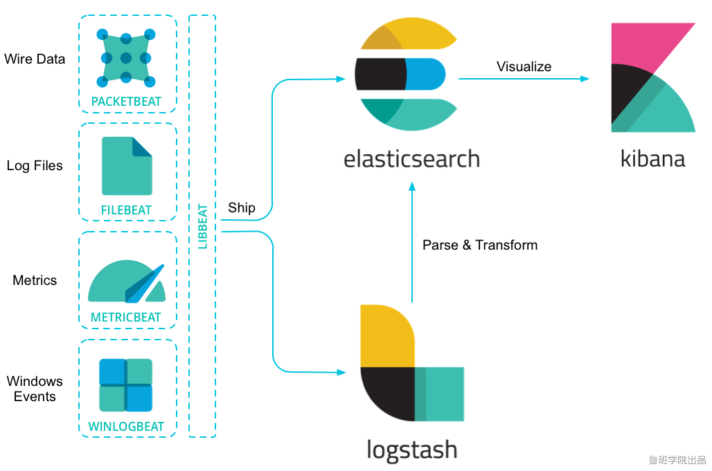

### 1. 引言

#### 1.1 什么是 elasticsearch、Logstash、Kibana？
   
   ElasticSearch是一个分布式，高性能、高可用、可伸缩的搜索和分析系统.
   
   Elasticsearch是个开源分布式搜索引擎，它的特点有：分布式，零配置，自动发现，索引自动分片，索引副本机制，restful风格接口，多数据源，自动搜索负载等。
   
   Logstash 是一个完全开源的工具，他可以对你的日志进行收集、过滤，并将其存储供以后使用（如，搜索）。
   
   Kibana 也是一个开源和免费的工具，它Kibana可以为 Logstash 和 ElasticSearch 提供的日志分析友好的 Web 界面，可以帮助您汇总、分析和搜索重要数据日志。
   
   
#### 1.2 什么是Elastic Stack？
   
   Elastic Stack,前身缩写是ELK，就是ElasticSearch + LogStash + Kibana
   
   
   
   ES的使用场景:
   
   • 网上商场,搜索商品.
   
   • ES配合logstash,kibana,日志分析.
   
   ELK 原理图:
   
   

#### 1.3 为什么要使用elasticsearch？
   
   假设用数据库做搜索，当用户在搜索框输入“四川火锅”时，数据库通常只能把这四个字去进行全部匹配。可是在文本中，可能会出现“推荐四川好吃的火锅”，这时候就没有结果了。

### 2. elasticsearch 简介 

#### 2.1 elasticsearch (简称 ES)

  elasticsearch 是用java 开发并且是当前最流行的开源的企业级搜索引擎。 能够达到实时搜索，稳定，可靠，快速，安装使用方便。

  客户端支持java, .NET(c#), PHP, Python , Ruby 等多种语言。 

  官方网站； https://www.elastic.co/cn/elasticsearch/

  下载地址: https://www.elastic.co/cn/downloads/elasticsearch

#### 2.2 应用场景

   github 搜索， 百度搜索， 商城商品搜索

#### 2.3 elasticsearch 与 Lucene 的关系 

   Lucene可以被认为是迄今为止最先进、性能最好的、功能最全的搜索引擎库(框 架)

   但是想要使用Lucene，必须使用Java来作为开发语言并将其直接集成到你的应用 中，并且Lucene的配置及使用非常复杂，你需要深入了解检索的相关知识来理解它 是如何工作的。

   Lucene缺点:

        1)只能在Java项目中使用,并且要以jar包的方式直接集成项目中. 
        
        2)使用非常复杂-创建索引和搜索索引代码繁杂 
        
        3)不支持集群环境-索引数据不同步(不支持大型项目) 
        
        4)索引数据如果太多就不行，索引库和应用所在同一个服务器,共同占用硬盘.共用空间少.

   上述Lucene框架中的缺点,ES全部都能解决.

#### 2.4 ES vs Solr 比较 

##### 2.4.1 ES vs Solr 检索速度 
 
   当单纯的对已有数据进行搜索时，Solr 更快. 


   当实时建立索引时，Solr 会阐释io 阻塞，查询性能较差，es 具有明显的优势. 


   大型互联网公司，实际生产环境测试，将搜索引擎从Solr转到 Elasticsearch以后 的平均查询速度有了50倍的提升

#### 2.5 es 与 solr 总结

  两者安装都很简单。 

  1. solr 利用 zk 进行分布式管理，而 es 自身带有分布式协调管理功能。

  2. solr 支持更多格式的数据，比如 json、xml、csv, 而 es 仅支持json 文件格式。

  3. solr 在传统的搜索应用中表现好于 es,但在处理 实时搜索应用时效率明显低于 es. 

  4. solr 是传统搜索应用 的有力解决方案，但 es 更适用于新兴的实时搜索应用。 

#### 2.5 es vs 关系型数据库 


### 3. Lucene 全文检索框架 

#### 3.1 什么是全文检索

  全文检索是指:

    通过一个程序扫描文本中的每一个单词，针对单词建立索引，并保存该单词在文本中的位置、以及出现的次数

    用户查询时，通过之前建立好的索引来查询，将索引中单词对应的文本位置、出现的次数返回给用户，因为有了具体文本的位置，所以就可以将具体内容读取出来了.

#### 3.2 分词原理之倒排索引 


### 4. elasticsearch 核心概念

#### 4.1. 近实时（NRT）
   
   ES是一个近实时的搜索引擎（平台），代表着从添加数据到能被搜索到只有很少的延迟。（大约是1s）

#### 4.2 索引（index）  --- 对应关系型数据库的 Database

   索引是具有某种相似特性的文档集合。例如，您可以拥有客户数据的索引、产品目录的另一个索引以及订单数据的另一个索引。索引由一个名称（必须全部是小写）标识。在单个集群中，您可以定义任意多个索引。
   Index体现了逻辑空间的概念，每个索引都有自己的mapping定义，用于定义包含文档的字段名和字段类型。Index体现了物理空间的概念，索引中的数据分散在shard上。
   可以将其暂时理解为 MySql中的 database。

#### 4.3 类型(type)   --- 对应关系型数据库的 Table

   一个索引可以有多个类型。例如一个索引下可以有文章类型，也可以有用户类型，也可以有评论类型。在一个索引中不能再创建多个类型，在以后的版本中将删除类型的整个概念。

   从6.0开始，type已经被逐渐废弃。在7.0之前，一个index可以设置多个types。7.0开始一个索引只能创建一个type（_doc）


#### 4.4 文档(Document) --- 对应关系型数据库的 Row
   
   Elasticsearch是面向文档的，文档是所有可搜索数据的最小单元。可以把文档理解为关系型数据库中的一条记录。文档会被序列化成json格式，保存在Elasticsearch中。
   同样json对象由字段组成，每个字段都有自己的类型（字符串，数值，布尔，二进制，日期范围类型）。当我们创建文档时，如果不指定类型，Elasticsearch会帮我们自动匹配类型。
   每个文档都一个ID，你可以自己指定，也可以让Elasticsearch自动生成。json格式，支持数组/嵌套,在一个index/type里面，你可以存储任意多的文档。
   注意，尽管一个文档，物理上存在于一个索引之中，文档必须被索引/赋予一个索引的type。

#### 4.5 字段(Field)  -- 对应关系型数据库的 Column 

  相当于是数据表的字段|列

#### 4.6 集群(Cluster) 

   一个集群就是由一个或多个节点组织在一起，它们共同持有整个的数据，并一起提供索引和搜索功能

#### 4.7 节点(node)
   
   节点是一个Elasticsearch实例，本质上就是一个java进程，节点也有一个名称（默认是随机分配的），当然也可以通过配置文件配置，或者在启动的时候，-E  node.name=node1指定。
   此名称对于管理目的很重要，因为您希望确定网络中的哪些服务器对应于ElasticSearch集群中的哪些节点。

   一个节点是集群中的一个服务器，作为集群的一部分，它存储数据，参与集群的索引和搜索功能

   在Elasticsearch中，节点的类型主要分为如下几种：
       
   master eligible节点：
        
       每个节点启动后，默认就是master eligible节点，可以通过node.master: false  禁止
       master eligible可以参加选主流程，成为master节点
       当第一个节点启动后，它会将自己选为master节点
       每个节点都保存了集群的状态，只有master节点才能修改集群的状态信息
       
   data节点
   
       可以保存数据的节点。负责保存分片数据，在数据扩展上起到了至关重要的作用
       
   Coordinating 节点
   
       负责接收客户端请求，将请求发送到合适的节点，最终把结果汇集到一起
       每个节点默认都起到了Coordinating node的职责
   
   开发环境中一个节点可以承担多个角色，生产环境中，建议设置单一的角色，可以提高性能等
       
#### 4.8 分片
   
   索引可能存储大量数据，这些数据可能会超出单个节点的硬件限制。例如，占用1TB磁盘空间的10亿个文档的单个索引可能不适合单个节点的磁盘，或者速度太慢，无法单独满足单个节点的搜索请求。
   
   为了解决这个问题，ElasticSearch提供了将索引细分为多个片段（称为碎片）的能力。创建索引时，只需定义所需的碎片数量。每个分片（shard）本身就是一个完全功能性和独立的“索引”，
   可以托管在集群中的任何节点上。
   
   为什么要分片?
   
    • 它允许您水平拆分/缩放内容量
   
    • 它允许您跨碎片（可能在多个节点上）分布和并行操作，从而提高性能/吞吐量
   
   如何分配分片以及如何将其文档聚合回搜索请求的机制完全由ElasticSearch管理，并且对作为用户的您是透明的。主分片数在索引创建时指定，后续不允许修改，除非Reindex

#### 4.9 分片副本
   
  在随时可能发生故障的网络/云环境中，非常有用，强烈建议在碎片/节点以某种方式脱机或因任何原因消失时使用故障转移机制。为此，ElasticSearch允许您将索引分片的一个或多个副本复制成所谓的副本分片，
  简称为副本分片。
  
  为什么要有副本？
  
    • 当分片/节点发生故障时提供高可用性。因此，需要注意的是，副本分片永远不会分配到复制它的原始/主分片所在的节点上。
  
    • 允许您扩展搜索量/吞吐量，因为可以在所有副本上并行执行搜索。
  
  总而言之，每个索引可以分割成多个分片。索引也可以零次（意味着没有副本）或多次复制。复制后，每个索引将具有主分片（从中复制的原始分片）和副本分片（主分片的副本）。
  
  可以在创建索引时为每个索引定义分片和副本的数量。创建索引后，您还可以随时动态更改副本的数量。您可以使用收缩和拆分API更改现有索引的分片数量，建议在创建索引时就考虑好分片和副本的数量。
  
  默认情况下，ElasticSearch中的每个索引都分配一个主分片和一个副本，这意味着如果集群中至少有两个节点，则索引将有一个主分片和另一个副本分片（一个完整副本），每个索引总共有两个分片。

#### 4.10 正排索引
   
   文档Id到文档内容，单词的关联关系
  
#### 4.11 倒排索引
   
   
   
   DocID：出现某单词的文档ID
   
   TF(词频)：单词在该文档中出现的次数
   
   POS：单词在文档中的位置
   
   
   
   
   
##### 4.11.1 倒排索引详解
   
   倒排索引是搜索引擎的核心，主要包含两部分：
     
     单词词典(Term Dictionary)
        是倒排索引的重要组成
        记录所有文档的单词，一般都比较大
        记录单词到倒排列表的关联信息
        单词字典的实现一般是用B+ Tree
     
     倒排列表(Posting List)
         记录了单词对应的文档集合，由倒排索引项(Posing)组成
         主要包含了如下信息：
         文档Id，用于获取原始信息
         单词频率(TF，Term Frequency)，记录该单词在该文档中的出现次数，用于后续相关性算分
         位置(Position)，记录单词在文档中的分词位置(多个)，用于做词语搜索(Phrase Query)
         偏移(Offset)，记录单词在文档的开始和结束位置，用于做高亮显示

### 5. linux ES的安装 (elasticsearch-7.6.1)

#### 5.1 创建普通用户 

  ES不能使用root用户来启动，必须使用普通用户来安装启动。这里我们创建一个普 通用户以及定义一些常规目录用于存放我们的数据文件以及安装包等。 创建一个es专门的用户(必须)

  在6.xx之前，可以通过root用户启动。但是发现黑客可以透过elasticsearch获取root用户密码，所以为了安全性，在6版本之后就不能通过root启动elasticsearch

```shell
# 1. 创建 elasticsearch 用户组 
groupadd elasticsearch

# 2. 创建用户 wlz_es 并设置密码
useradd wlz_es
passwd wlz_es

# 3. 创建es文件夹，并修改owner为 wlz_es 用户
mkdir -p /software/es

# 4. 用户 wlz_es 添加到 elasticsearch 用户组
usermod -G elasticsearch wlz_es
chown -R wlz_es /software/es/elasticsearch-7.6.1

# 5. 设置sudo权限
# 为了让普通用户有更大的操作权限，我们一般都会给普通用户设置sudo权限，方便普通用户的操作
# 三台机器使用root用户执行visudo命令然后为es用户添加权限

visudo

# 在root ALL=(ALL) ALL 一行下面
# 添加 wlz_es 用户 如下:
wlz_es ALL=(ALL) ALL

# 添加成功保存后切换到 wlz_es 用户操作
su wlz_es

```

#### 5.2 下载 上传压缩包并解压

   1.下载elasticsearch-7.6.1 tar包  下载地址 https://www.elastic.co/cn/downloads/elasticsearch
   
   2.上传到linux，解压  tar -zxvf   elasticsearch-7.6.1-linux-x86_64.tar.gz

```shell
su wlz_es
cd /software/es
tar -zxvf elasticsearch-7.6.1-linux-x86_64.tar.gz -C /software/es/
chown -R wlz_es /software/es/elasticsearch-7.6.1
```

#### 5.3 修改配置文件 (以下三个问题解决完成之后，可能重新连接secureCRT或者重新连接xshell生效， 如果启动没有报下面三个错误，也可以不用)

##### 5.3.1 修改elasticsearch.yml

  进入服务器使用 wlz_es 用户来修改配置文件

```shell
## 1. 进入 es 配置文件 
cd /software/es/elasticsearch-7.6.1/config

## 2. 创建 log data 目录 
mkdir -p /software/es/elasticsearch-7.6.1/log
mkdir -p /software/es/elasticsearch-7.6.1/data

## 3. 修改 默认 elasticsearch.yml 文件名， 或者直接删除 
mv elasticsearch.yml elasticsearch.yml.bak

## 4. 创建  elasticsearch.yml 文件 
cluster.name: wlz-es
node.name: node1
path.data: /software/es/elasticsearch-7.6.1/data
path.logs: /software/es/elasticsearch-7.6.1/log
network.host: 0.0.0.0
http.port: 9200
discovery.seed_hosts: ["服务器IP"]  # 106.52.11.147
cluster.initial_master_nodes: ["节点名"]  #node1
bootstrap.system_call_filter: false
bootstrap.memory_lock: false
http.cors.enabled: true
http.cors.allow-origin: "*"
```

##### 5.3.2 修改jvm.option

```shell
## 1. 进入 /software/es/elasticsearch-7.6.1/config/jvm.options
vim config/jvm.options

## 2. 修改 jvm.option配置文件，调整jvm堆内存大小 wlz_es 执行以下命令调整jvm堆内存大小，每个人根据自己 服务器的内存大小来进行调整。
-Xms512m
-Xmx512m
```

##### 5.3.2 修改系统配置，解决启动时候的问题

   由于现在使用普通用户来安装es服务，且es服务对服务器的资源要求比较多，包括 内存大小，线程数等。所以我们需要给普通用户解开资源的束缚

###### 5.3.2.1 普通用户打开文件的最大数限制

   问题错误信息描述:

    descriptors [4096] for elasticsearch process likely too low, increase to at least [65536]
    最大文件描述符[4096]对于elasticsearch进程可能太低，至少增加到[65536]

   ES因为需要大量的创建索引文件，需要大量的打开系统的文件，所以我们需要解除 linux系统当中打开文件最大数目的限制，不然ES启动就会抛错

```shell
## 1. 进入 limits.conf
sudo vi /etc/security/limits.conf

## 2. 添加如下内容: 注意*不要去掉了, 如果配置了且大于 需要设置的值，则不需要再配置
### * 所有用户
### nofile - 打开文件的最大数目
### noproc - 进程的最大数目
### soft 指的是当前系统生效的设置值
### hard 表明系统中所能设定的最大值

* soft nofile 65536
* hard nofile 131072
* soft nproc 2048
* hard nproc 4096
```

###### 5.3.2.2 普通用户启动线程数限制  (此文件修改后需要重新登录用户，才会生效)

   问题错误信息描述: 

         max number of threads [2048] for user [tongtech] is too low, increase to at least [4096]

   原因:无法创建本地线程问题,用户最大可创建线程数太小解决方案: 修改90-nproc.conf 配置文件。

   用户的最大线程数[2048]过低，增加到至少[4096]

```shell
## 1. 进入 vim /etc/security/limits.d/90-nproc.conf 或者 20-nproc.conf 或者 其他 *-nproc.conf 
### 1.1 Centos6
sudo vi /etc/security/limits.d/20-nproc.conf

### 1.2 Centos7 
sudo vi /etc/security/limits.d/20-nproc.conf

## 2. 修改 内容 
* soft nproc 4096
```

###### 5.3.2.3 普通用户调大虚拟内存

   问题错误信息描述: 

        descriptors [4096] for elasticsearch process likely too low, increase to at least [65536]

   最大文件描述符[4096]对于elasticsearch进程可能太低，至少增加到[65536]

   调大系统的虚拟内存

   原因:最大虚拟内存太小

   每次启动机器都手动执行下。

````shell
## 1. 编辑 /etc/sysctl.conf，追加以下内容:vm.max_map_count=262144 保存后，执行: sysctl -p   使配置生效
sudo vi /etc/sysctl.conf 

## 2. 追加以下内容:vm.max_map_count=262144 
vm.max_map_count=655360

## 3. 保存后，执行: sysctl -p   使配置生效
sudo sysctl -p

````

#### 5.4 启动 

```shell
## 1. 使用 wlz_es 用户 
su wlz_es

## 2. 进入 es bin 目录 
cd /software/es/elasticsearch-7.6.1/bin

## 3. 启动
### 3.1 启动1  
./elasticsearch 

### 3.2 后台启动  (以后台方式运行)
./elasticsearch -d  

```

##### 5.4.1 查看是否启动成功 

打开浏览器输入http://127.0.0.1:9200,能打开页面表示安装成功

##### 5.4.2 注意：注意开放端口或者关闭防火墙（centos7）

    1. 查询防火墙状态：firewall-cmd --state
    2. 关闭防火墙：systemctl stop firewalld.service
    3. 开启防火墙： systemctl start firewalld.service
    4. 禁止firewall开机启动：systemctl disable firewalld.service

### 6. elasticsearch-head 浏览器插件 的安装

   google应用商店下载插件安装（需翻墙）：Elasticsearch Head


### 7. linux 客户端 kibana 的安装

   客户端可以分为图形界面客户端, 和代码客户端

   es 主流客户端 kibana， 开放9200端口与图形界面客户端交互

#### 7.1 下载 上传压缩包并解压

1.下载 kibana-7.6.1-linux-x86_64.tar.gz tar包  下载地址 https://www.elastic.co/cn/downloads/kibana

2.上传到linux，解压  tar -zxvf kibana-7.6.1-linux-x86_64.tar.gz

```shell
su wlz_es
cd /software/es
tar -zxvf kibana-7.6.1-linux-x86_64.tar.gz -C /software/es/
chown -R wlz_es /software/es/kibana-7.6.1
```

#### 7.2 修改配置文件 kibana.yml

```shell
## 1. 进入 kibana.yml
cd /software/es/kibana-7.6.1-linux-x86_64/config

## 2. 修改 kibana.yml
server.port: 5601
server.host: "0.0.0.0"  # 服务器ip 
i18n.locale: "zh-CN"    # 设置成中文 
elasticsearch.hosts: ["http://IP:9200"] # 这里是elasticsearch的访问地址
```

##### 7.3 启动 kibana

```shell
## 1. 使用 wlz_es 用户 
su wlz_es

## 2. 进入 kibana bin 目录
cd /software/es/kibana-7.6.1-linux-x86_64/bin

## 3. 启动 (不能使用root 启动，所以和elasticsearch一样，使用其他用户启动)
### 3.1 启动1  
./kibana 

### 3.2 后台启动  (以后台方式运行)
nohup ./kibana & 

```

###### 7.3.1 查看是否启动成功

  访问kibana 

    打开浏览器输入 http://127.0.0.1:5601 ,能打开页面表示安装成功

  或者 

```shell
netstat -nlp | grep 5601

ps -ef|grep node

```

##### 7.3.2 注意：注意开放端口或者关闭防火墙（centos7）

    1. 查询防火墙状态：firewall-cmd --state
    2. 关闭防火墙：systemctl stop firewalld.service
    3. 开启防火墙： systemctl start firewalld.service
    4. 禁止firewall开机启动：systemctl disable firewalld.service

### 8. linux es 安装IK分词器

   我们后续也需要使用Elasticsearch来进行中文分词，所以需要单独给Elasticsearch 安装IK分词器插件。

#### 8.1 下载 这里选择了 v7.6.1 版本 

https://github.com/medcl/elasticsearch-analysis-ik/releases

#### 8.2 切换到 wlz_es 用户，并在es的安装目录下 /plugins创建ik

```shell
## 1. 创建 ik 目录
mkdir -p /software/es/elasticsearch-7.6.1/plugins/ik

## 2. 解压
unzip elasticsearch-analysis-ik-7.6.1.zip

```

#### 8.3 重启Elasticsearch

```shell
## 1. kill 掉 es 
### 1.1 查看 es 进程id 
ps -ef|grep java

### 1.2 kill 掉 es 
kill -9 

## 2. 使用 wlz_es 用户 
su wlz_es

## 3. 进入 es bin 目录 
cd /software/es/elasticsearch-7.6.1/bin

## 4. 启动
### 4.1 启动1  
./elasticsearch 

### 4.2 后台启动  (以后台方式运行)
./elasticsearch -d  

```

#### 8.4 测试分词效果

进入kibana 控制台:  http://127.0.0.1:5601/app/kibana#/dev_tools/console

```
POST _analyze 
{
  
  "analyzer" : "standard",
  "text" : "我爱你中国"
}

POST _analyze 
{
  
  "analyzer" : "ik_smart", 
  "text" : "我爱你中国"
}

#ik_smart:会做最粗粒度的拆分

POST _analyze 
{
  
  "analyzer" : "ik_max_word", 
  "text" : "中华人民共和国"
}

#ik_smart:会将文本做最细粒度的拆分

```

#### 8.5 默认使用 ik 分词器 

```
PUT /wlz_test_index
{
  "settings": {
    "index": {
      "analysis.analyzer.default.type": "ik_max_word"
    }
  }
}
```