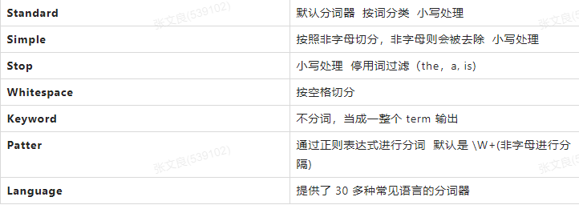
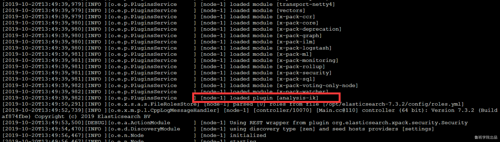
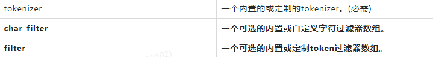
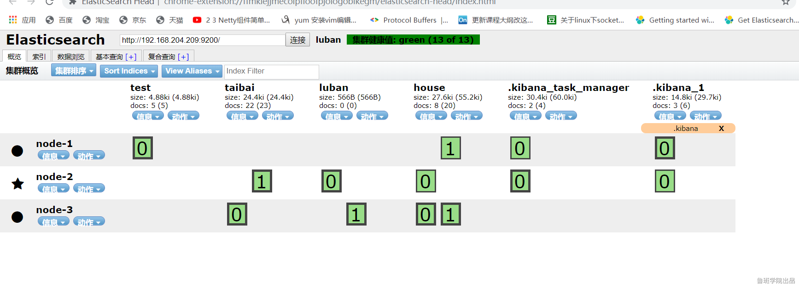
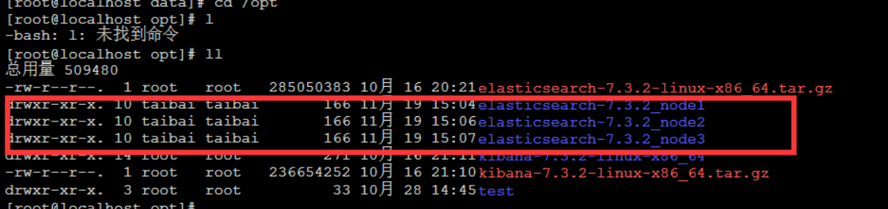
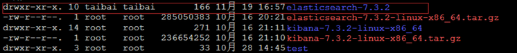
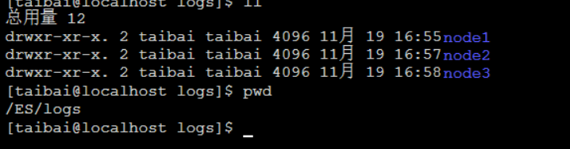

### 6.中文分词
   
##### 6.0 Analyzer 的组成
   
   Character Filters (针对原始文本处理，例如，可以使用字符过滤器将印度阿拉伯数字（ ）转换为其等效的阿拉伯语-拉丁语（0123456789）)
   
   Tokenizer（按照规则切分为单词）,将把文本 "Quick brown fox!" 转换成 terms [Quick, brown, fox!],tokenizer 还记录文本单词位置以及偏移量。
   
   Token Filter(将切分的的单词进行加工、小写、刪除 stopwords，增加同义词）
   
##### 6.1elasticsearch内置分词器
   
   
   
##### 6.2分词api
```
POST /_analyze
{
  "analyzer":"standard",
  "text":"tai bai"
}

POST /_analyze
{
  "analyzer":"standard",
  "text":"决战到天亮"
}
```
   
   英文分词  一般以空格分隔，中文分词的难点在于，在汉语中没有明显的词汇分界点，如果分隔不正确就会造成歧义。
   
   常用中文分词器，IK、jieba、THULAC等，推荐使用IK分词器。
   
##### 6.3ik分词器安装
   
   IK分词器 Elasticsearch插件地址：https://github.com/medcl/elasticsearch-analysis-ik
   
   1.下载对应版本的zip包https://github.com/medcl/elasticsearch-analysis-pinyin/releases
   
   2.可在Windows解压好，在plugins下创建pinyin文件夹
   
   3.将解压内容放置在pinyin文件夹，重启
   
   4.ik插件安装完成
   
   
   
   5.测试中文分词器效果
   
```
POST /_analyze
{
  "analyzer": "ik_max_word",   或者  //ik_smart
  "text": "决战到天亮"
}
```

##### 6.4拼音分词器
   
   1.下载对应版本的zip包https://github.com/medcl/elasticsearch-analysis-pinyin/releases
   
   2.可在Windows解压好，在plugins下创建pinyin文件夹
   
   3.将解压内容放置在pinyin文件夹，重启
   
##### 6.5自定义分词器
   
   接受参数
   
   
```
PUT my_index
{
  "settings": {
    "analysis": {
      "analyzer": {
        "my_custom_analyzer": {
          "type": "custom", 
          "tokenizer": "standard",
          "char_filter": [
            "html_strip"     //过滤HTML标签
          ],
          "filter": [
            "lowercase",    //转小写
            "asciifolding"  //ASCII-折叠令牌过滤器  例如 à to a
          ]
        }
      }
    }
  }
}


POST my_index/_analyze
{
  "analyzer": "my_custom_analyzer",
  "text": "Is this <b>déjà vu</b>?"
}
```

  创建一个中文+拼音的分词器（中文分词后拼音分词）
```
PUT my_index
{
  "settings": {
    "analysis": {
      "analyzer": {
        "ik_pinyin_analyzer": {
          "type": "custom",
          "tokenizer": "ik_smart",
          "filter": [
            "pinyin_max_word_filter"
          ]
        },
        "ik_pingying_smark": {
          "type": "custom",
          "tokenizer": "ik_smart",
          "filter": [
            "pinyin_smark_word_filter"
          ]
        }
      },
      "filter": {
        "pinyin_max_word_filter": {
          "type": "pinyin",
          "keep_full_pinyin": "true",  #分词全拼如雪花 分词xue,hua
          "keep_separate_first_letter": "true",#分词简写如雪花 分词xh
          "keep_joined_full_pinyin": true  #分词会quanpin 连接 比如雪花分词 xuehua
        },
        "pinyin_smark_word_filter": {
          "type": "pinyin",
          "keep_separate_first_letter": "false", #不分词简写如雪花 分词不分词xh
          "keep_first_letter": "false"     #不分词单个首字母 如雪花 不分词 x,h
        }
      }
    }
  }
}


PUT /my_index/_mapping
  {
  "properties": {
      "productName": {
          "type": "text",
          "analyzer": "ik_pinyin_analyzer",  #做文档所用的分词器
          "search_analyzer":"ik_pingying_smark"   #搜索使用的分词器
      }
  }
}

POST /my_index/_doc
{
  "productName": "雪花啤酒100L"
}


GET /my_index/_search
{
  "query": {
    "match": {
      "productName": "雪Hua"
    }
  }
}
```

### 7.全文搜索

#### 7.1构建数据
```
PUT /test
{
	"settings": {
		"index": {
			"number_of_shards": "1",
			"number_of_replicas": "0"
		}
	},
	"mappings": {
		"properties": {
			"age": {
				"type": "integer"
			},
			"email": {
				"type": "keyword"
			},
			"name": {
				"type": "text"
			},
			"hobby": {
				"type": "text",
				"analyzer": "ik_max_word"
			}
		}
	}
}


POST _bulk
{ "create" : { "_index" : "test","_id": "1000"} }
{"name":"张三","age": 20,"mail": "111@qq.com","hobby":"羽毛球、乒乓球、足球"}
{ "create" : { "_index" : "test","_id": "1001"} }
{"name":"李四","age": 21,"mail": "222@qq.com","hobby":"羽毛球、乒乓球、足球、篮球"}
{ "create" : { "_index" : "test","_id": "1002"} }
{"name":"王五","age": 22,"mail": "333@qq.com","hobby":"羽毛球、篮球、游泳、听音乐"}
{ "create" : { "_index" : "test","_id": "1003"} }
{"name":"赵六","age": 23,"mail": "444@qq.com","hobby":"跑步、游泳、篮球"}
{ "create" : { "_index" : "test","_id": "1004"} }
{"name":"孙七","age": 24,"mail": "555@qq.com","hobby":"听音乐、看电影、羽毛球"}
```

##### 7.2单词搜索
```
POST /test/_search
{
	"query": {
		"match": {
			"hobby": "音乐"
		}
	},
	"highlight": {
		"fields": {
			"hobby": {}
		}
	}
}
```

##### 7.3多词搜索
```
//搜索包含音乐和篮球的
POST /test/_search
{
	"query": {
		"match": {
			"hobby": "音乐 篮球"
		}
	},
	"highlight": {
		"fields": {
			"hobby": {}
		}
	}
}

//搜索包含音乐还有篮球的（and）
POST /test/_search
{
	"query": {
		"match": {
			"hobby": {
				"query": "音乐 篮球",
				"operator": "and"
			}
		}
	},
	"highlight": {
		"fields": {
			"hobby": {}
		}
	}
}


GET /goods/_search
{
  "query": {
    "bool": {
      "must": [
        {
          "range": {
            "price": {
              "gte": 1000,
              "lte": 2000
            }
          }
        },
        {
          "match": {
            "name": "2018女鞋"
          }
        },
        {
          "match": {
            "spec": "红色 黑色"
          }
        }
      ],
      "must_not": [
        {
          "match": {
            "spec": "蓝色"
          }
        }
      ]
    }
  }
}

//在Elasticsearch中也支持这样的查询，通过minimum_should_match来指定匹配度，如：70%；
POST /test/_search
{
	"query": {
		"match": {
			"hobby": {
				"query": "游泳 羽毛球",
				"minimum_should_match": "70%"
			}
		}
	},
	"highlight": {
		"fields": {
			"hobby": {}
		}
	}
}
```

##### 7.4组合搜索
```
//搜索结果中必须包含篮球，不能包含音乐，如果包含了游泳，那么它的相似度更高。
POST /test/_search
{
	"query": {
		"bool": {
			"must": {
				"match": {
					"hobby": "篮球"
				}
			},
			"must_not": {
				"match": {
					"hobby": "音乐"
				}
			},
			"should": [{
				"match": {
					"hobby": "游泳"
				}
			}]
		}
	},
	"highlight": {
		"fields": {
			"hobby": {}
		}
	}
}


//默认情况下，should中的内容不是必须匹配的，如果查询语句中没有must，那么就会至少匹配其中一个。当然了，
也可以通过minimum_should_match参数进行控制，该值可以是数字也可以的百分比。
//minimum_should_match为2，意思是should中的三个词，至少要满足2个

POST /test/_search
{
	"query": {
		"bool": {
			"should": [{
					"match": {
						"hobby": "游泳"
					}
				},
				{
					"match": {
						"hobby": "篮球"
					}
				},
				{
					"match": {
						"hobby": "音乐"
					}
				}
			],
			"minimum_should_match": 2
		}
	},
	"highlight": {
		"fields": {
			"hobby": {}
		}
	}
}
```

##### 7.5权重
   
   搜索关键字为“游泳篮球”，如果结果中包含了“音乐”权重为10，包含了“跑步”权重为2。

```
POST /test/_search
{
	"query": {
		"bool": {
			"must": {
				"match": {
					"hobby": {
						"query": "游泳篮球",
						"operator": "and"
					}
				}
			},
			"should": [{
					"match": {
						"hobby": {
							"query": "音乐",
							"boost": 10
						}
					}
				},
				{
					"match": {
						"hobby": {
							"query": "跑步",
							"boost": 2
						}
					}
				}
			]
		}
	},
	"highlight": {
		"fields": {
			"hobby": {}
		}
	}
}
```

### 8.Elasticsearch集群

##### 192.168.204.209  elasticsearch.yml
```
cluster.name: luban
node.name: node-1
node.master: true
node.data: true
network.host: 0.0.0.0
http.port: 9200
#参数设置一系列符合主节点条件的节点的主机名或 IP 地址来引导启动集群。
cluster.initial_master_nodes: ["node-1"]
# 设置新节点被启动时能够发现的主节点列表（主要用于不同网段机器连接）
discovery.zen.ping.unicast.hosts: ["192.168.204.209","192.168.204.203","192.168.204.108"]
# 该参数就是为了防止”脑裂”的产生。定义的是为了形成一个集群，有主节点资格并互相连接的节点的最小数目。
discovery.zen.minimum_master_nodes: 2
# 解决跨域问题配置
http.cors.enabled: true
http.cors.allow-origin: "*"
```

##### 192.168.204.203  elasticsearch.yml
```
cluster.name: luban
node.name: node-3
node.master: true
node.data: true
network.host: 0.0.0.0
http.port: 9200
cluster.initial_master_nodes: ["node-1"]
discovery.zen.ping.unicast.hosts: ["192.168.204.209","192.168.204.203","192.168.204.108"]
discovery.zen.minimum_master_nodes: 2
http.cors.enabled: true
http.cors.allow-origin: "*"
```

##### 192.168.204.108  elasticsearch.yml
```
cluster.name: luban
node.name: node-2
node.master: true
node.data: true
network.host: 0.0.0.0
http.port: 9200
cluster.initial_master_nodes: ["node-1"]
discovery.zen.ping.unicast.hosts: ["192.168.204.209","192.168.204.203","192.168.204.108"]
discovery.zen.minimum_master_nodes: 2
http.cors.enabled: true
http.cors.allow-origin: "*"
```
   
   启动后效果
   
   
   
#### 一台机器搭建集群(一)
   
   注意修改jvm.options
   
   
   
##### elasticsearch-7.3.2_node1
```
cluster.name: luban
node.name: node-1
node.master: true
node.data: true
network.host: 0.0.0.0
http.port: 9200
transport.port: 9300
cluster.initial_master_nodes: ["node-1"]
discovery.seed_hosts: ["192.168.204.209:9300", "192.168.204.209:9301","192.168.204.209:9302"]
discovery.zen.minimum_master_nodes: 2
http.cors.enabled: true
http.cors.allow-origin: "*"
```

##### elasticsearch-7.3.2_node2
```
cluster.name: luban
node.name: node-2
node.master: true
node.data: true
network.host: 0.0.0.0
http.port: 9201
transport.port: 9301
cluster.initial_master_nodes: ["node-1"]
discovery.seed_hosts: ["192.168.204.209:9300", "192.168.204.209:9301","192.168.204.209:9302"]
discovery.zen.minimum_master_nodes: 2
http.cors.enabled: true
http.cors.allow-origin: "*"
```

##### elasticsearch-7.3.2_node3
```
cluster.name: luban
node.name: node-3
node.master: true
node.data: true
network.host: 0.0.0.0
http.port: 9202
transport.port: 9302
cluster.initial_master_nodes: ["node-1"]
discovery.seed_hosts: ["192.168.204.209:9300", "192.168.204.209:9301","192.168.204.209:9302"]
discovery.zen.minimum_master_nodes: 2
http.cors.enabled: true
http.cors.allow-origin: "*"
```

##### 分别启动：
```
./elasticsearch -p /tmp/elasticsearch_9200_pid -d
./elasticsearch -p /tmp/elasticsearch_9201_pid -d
./elasticsearch -p /tmp/elasticsearch_9202_pid -d
```

#### 一台机器搭建集群(二)

   
   
   新建目录：
   
   
   
   注意赋予权限
   
   chown -R taibai:taibai ES
   
   分别启动：

```
./elasticsearch -d  -E node.name=node-1 -E http.port=9200 -E transport.port=9300 -E path.data=/ES/data/node1 -E path.logs=/ES/logs/node1

./elasticsearch -d  -E node.name=node-2 -E http.port=9201 -E transport.port=9301 -E path.data=/ES/data/node2 -E path.logs=/ES/logs/node2

./elasticsearch -d  -E node.name=node-3 -E http.port=9202 -E transport.port=9302 -E path.data=/ES/data/node3 -E path.logs=/ES/logs/node3
```

   https://blog.csdn.net/jiankunking/article/details/65448030
   
   https://blog.csdn.net/lixiaohai_918/article/details/89569611
   
   查看插件命令：./elasticsearch-plugin list
   
   下载插件命令：./elasticsearch-plugin install analysis-icu
   
### ElasticStack日志收集
   
   1.安装filebeat
    
   新建xxx.yml
```
filebeat.inputs:
- type: log
  enabled: true
  paths: 
   - /taibai/logs/*.log
output.logstash:
  hosts: ["192.168.204.209:5044"]
  
#output.console:
#  pretty: true
#  enable: true

#filebeat.inputs:
#  tags: ["web"] #添加自定义tag，便于后续的处理
#  fields: #添加自定义字段
#     from: taibai
#  fields_under_root: true #true为添加到根节点，false为添加到子节点中
```

  启动 ./filebeat -e -c 配置文件名       -e输出到标准输出，默认输出到syslog和logs下   -c 指定配置文件

  2.安装logstash
	
   新建xxx.conf
```
input {
   beats {
     port => "5044"
   }
}
filter {
    mutate {
      split => {"message"=>","}
    }
    mutate {
        add_field => {
         "log" => "%{[message][0]}"
         "userId" => "%{[message][1]}"
         "visit" => "%{[message][2]}"
         "date" => "%{[message][3]}"
        }
    }
    mutate {
       convert => {
          "log" => "string"
          "userId" => "integer"
          "visit" => "string"
          "date" => "string"
        }
    }
}

output {
   elasticsearch {
      hosts => [ "192.168.204.209:9200"]
   }
}


#output {
#  stdout { codec => rubydebug }
#}
```

   启动： ./logstash -f   配置文件名
   
### 数据导入

#### 1.使用logstash 导入数据
   
   1.安装解压logstash
   
   2.在conf目录下新建mysql.conf
```
input {
    jdbc {
        jdbc_driver_library => "/opt/mysql-connector-java-5.1.47.jar"
        jdbc_driver_class => "com.mysql.jdbc.Driver"
        jdbc_connection_string => "jdbc:mysql://47.94.158.155:3306/test?serverTimezone=UCT"
        jdbc_user => "taibai"
        jdbc_password => "aq1sw2de"
        schedule => "* * * * *"      #每分钟执行
        clean_run => true
        jdbc_default_timezone => "Asia/Shanghai"
        statement => "select id,sn,`name`,price,num,alert_num,image,images,weight,DATE_FORMAT(update_time,'%Y-%m-%d %T') as update_time,DATE_FORMAT(create_time,'%Y-%m-%d %T') as create_time,spu_id,category_id,category_name,brand_name,spec,sale_num,comment_num,`status` from goods where update_time>:sql_last_value and update_time<NOW() order by update_time desc
"
   }
}

filter {
    ruby {
        code => "event.set('timestamp', event.get('@timestamp').time.localtime + 8*60*60)"
    }
    ruby {
       code => "event.set('@timestamp',event.get('timestamp'))"
    }
    mutate {
        remove_field => ["timestamp"]
    }
#    ruby {
#        code => "event.set('update_time', event.get('update_time').time.localtime + 8*60*60)"
#    }
#    ruby {
#        code => "event.set('create_time', event.get('create_time').time.localtime + 8*60*60)"
#    }
}

output {
       elasticsearch{
          hosts => ["192.168.204.209"]
               index => "goods"
               document_id => "%{id}"
          }
}
```

 **schedule**
 
 
 
#### 2.canal

##### 1.mysql开启binlog日志
   
   重启：service mysqld restart

#####  2.安装启动canal_deployer
   
   1.上传到linux，解压
   
   2.修改canal_deployer/conf/example/instance.properties
   
```
## mysql serverId
canal.instance.mysql.slaveId = 1234
#position info，需要改成自己的数据库信息
canal.instance.master.address = 127.0.0.1:3306 
canal.instance.master.journal.name = 
canal.instance.master.position = 
canal.instance.master.timestamp = 
#canal.instance.standby.address = 
#canal.instance.standby.journal.name =
#canal.instance.standby.position = 
#canal.instance.standby.timestamp = 
#username/password，需要改成自己的数据库信息
canal.instance.dbUsername = canal  
canal.instance.dbPassword = canal
canal.instance.defaultDatabaseName =
canal.instance.connectionCharset = UTF-8
#table regex
canal.instance.filter.regex = .\*\\\\..\*
```

   启动：bin/startup.sh
   
   关闭：bin/stop.sh
   
##### 3.安装canal_adapter
   
   1.上传解压
   
   2.修改canal_adapter/conf/application.yml
```
canal.conf:
  canalServerHost: 127.0.0.1:11111
  batchSize: 500
  syncBatchSize: 1000
  retries: 0
  timeout:
  mode: tcp 
  srcDataSources:
    defaultDS:
      url: jdbc:mysql://127.0.0.1:3306/mytest?useUnicode=true
      username: root
      password: 121212
  canalAdapters:
  - instance: example 
    groups:
    - groupId: g1
      outerAdapters:
      - 
        key: exampleKey
        name: es6                           # or es7
        hosts: 127.0.0.1:9300               # es 集群地址, 逗号分隔
        properties:
          mode: transport # or rest         # 可指定transport模式或者rest模式
          # security.auth: test:123456      # only used for rest mode
          cluster.name: elasticsearch       # es cluster name
```

   adapter将会自动加载 conf/es 下的所有.yml结尾的配置文件
   
   3.修改适配器表映射文件
```
dataSourceKey: defaultDS        # 源数据源的key, 对应上面配置的srcDataSources中的值
outerAdapterKey: exampleKey     # 对应application.yml中es配置的key 
destination: example            # cannal的instance或者MQ的topic
groupId:                        # 对应MQ模式下的groupId, 只会同步对应groupId的数据
esMapping:
  _index: mytest_user           # es 的索引名称
  _type: _doc                   # es 的type名称, es7下无需配置此项
  _id: _id                      # es 的_id, 如果不配置该项必须配置下面的pk项_id则会由es自动分配
#  pk: id                       # 如果不需要_id, 则需要指定一个属性为主键属性
  # sql映射
  sql: "select a.id as _id, a.name as _name, a.role_id as _role_id, b.role_name as _role_name,
        a.c_time as _c_time, c.labels as _labels from user a
        left join role b on b.id=a.role_id
        left join (select user_id, group_concat(label order by id desc separator ';') as labels from label
        group by user_id) c on c.user_id=a.id"
#  objFields:
#    _labels: array:;           # 数组或者对象属性, array:; 代表以;字段里面是以;分隔的
#    _obj: object               # json对象
  etlCondition: "where a.c_time>='{0}'"     # etl 的条件参数
  commitBatch: 3000                         # 提交批大小
```

   sql支持多表关联自由组合, 但是有一定的限制:
   
       1. 主表不能为子查询语句
       
       2. 只能使用left outer join即最左表一定要是主表
       
       3. 关联从表如果是子查询不能有多张表
       
       4. 主sql中不能有where查询条件(从表子查询中可以有where条件但是不推荐, 可能会造成数据同步的不一致, 比如修改了where条件中的字段内容)
       
       5. 关联条件只允许主外键的'='操作不能出现其他常量判断比如: on a.role_id=b.id and b.statues=1
       
       6. 关联条件必须要有一个字段出现在主查询语句中比如: on a.role_id=b.id 其中的 a.role_id 或者 b.id 必须出现在主select语句中
       
       Elastic Search的mapping 属性与sql的查询值将一一对应(不支持 select *), 比如: select a.id as _id, a.name, a.email as email from user, 其中name将映射到es mapping的name field, email将 映射到mapping的email field, 这里以别名(如果有别名)作为最终的映射字段. 这里的id可以填写到配置文件的 id: id映射.

   4.bin目录下启动