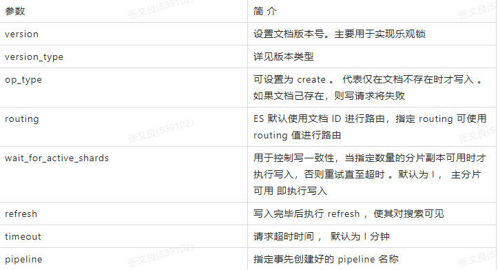

### 1. es 写请求原理
   
   
   
   以下是写单个文档所需的步骤：
   
    (1）客户端向 NODE I 发送写请求。
   
    (2)检查Active的Shard数。
   
    (3) NODEI 使用文档 ID 来确定文档属于分片 0，通过集群状态中的内容路由表信息获知分片 0 的主分片位于 NODE3 ，因此请求被转发到 NODE3 上。
   
    (4) NODE3 上的主分片执行写操作 。 如果写入成功，则它将请求并行转发到 NODE I 和 NODE2 的副分片上，等待返回结果 。当所有的副分片都报告成功，
    NODE3 将向协调节点报告成功，协调节点再向客户端报告成功 。在客户端收到成功响应时 ，意味着写操作已经在主分片和所有副分片都执行完成。

   **1.为什么要检查Active的Shard数？**
   
    ES中有一个参数，叫做waitforactiveshards，这个参数是Index的一个setting，也可以在请求中带上这个参数。这个参数的含义是，在每次写入前，该shard至少具有的active副本数。假设我们有一个Index，其每个Shard有3个Replica，加上Primary则总共有4个副本。如果配置waitforactiveshards为3，那么允许最多有一个Replica挂掉，如果有两个Replica挂掉，则Active的副本数不足3，此时不允许写入。
   
    这个参数默认是1，即只要Primary在就可以写入，起不到什么作用。如果配置大于1，可以起到一种保护的作用，保证写入的数据具有更高的可靠性。但是这个参数只在写入前检查，并不保证数据一定在至少这些个副本上写入成功，所以并不是严格保证了最少写入了多少个副本。
   
   **在以前的版本中，是写一致性机制，现被替换为waitforactiveshards**
   
    one：要求我们这个写操作，只要有一个primary shard是active活跃可用的，就可以执行
   
    all：要求我们这个写操作，必须所有的primary shard和replica shard都是活跃的，才可以执行这个写操作
   
    quorum：要求所有的shard中，必须是大部分的shard都是活跃的，可用的，才可以执行这个写操作
   
   写一致性的默认策略是 quorum，即多数的分片（其中分片副本可以是主分片或副分片）在写入操作时处于可用状态。


```
put /index/type/id?consistency=quorum
quroum = int( (primary + number_of_replicas) / 2 ) + 1
```
   
   
   
   **写入Primary完成后，为何要等待所有Replica响应(或连接失败)后返回**
   
    在更早的ES版本，Primary和Replica之间是允许异步复制的，即写入Primary成功即可返回。但是这种模式下，如果Primary挂掉，就有丢数据的风险，
    而且从Replica读数据也很难保证能读到最新的数据。所以后来ES就取消异步模式了，改成Primary等Replica返回后再返回给客户端。
   
    因为Primary要等所有Replica返回才能返回给客户端，那么延迟就会受到最慢的Replica的影响，这确实是目前ES架构的一个弊端。
    之前曾误认为这里是等waitforactive_shards个副本写入成功即可返回，但是后来读源码发现是等所有Replica返回的。
   
    如果Replica写入失败，ES会执行一些重试逻辑等，但最终并不强求一定要在多少个节点写入成功。在返回的结果中，会包含数据在多少个shard中写入成功了，多少个失败了

### 2. es 数据管理 

   ES是面向文档(document oriented)的，这意味着它可以存储整个对象或文档 (document)。
   
   然而它不仅仅是存储，还会索引(index)每个文档的内容使之可以被搜索。 在ES中，你可以对文档(而非成行成列的数据)进行索引、搜索、排序、过滤。
   
   ES使用JSON作为文档序列化格式。 JSON现在已经被大多语言所支持，而且已经成为NoSQL领域的标准格式。
   
#### 2.1 ES存储的一个员工文档的格式示例:

```json
{
  "email": "1212@qq.com",
  "name": "wlz",
  "age": 30,
  "interests": [ "篮球", "健身" ]
}
```

#### 2.2 基本操作

##### 2.2.1 创建索引 

  格式: PUT /索引名称

```
PUT /wlz_es_db
```

   修改副本数

```
PUT wlz_es_db/_settings
{
    "number_of_replicas" : "2"
}
```

##### 2.2.2 查询索引

格式: GET /索引名称

```
GET /wlz_es_db
```

##### 2.2.3 删除索引

格式: DELETE /索引名称

```
DELETE /wlz_es_db
```

##### 2.2.4 添加文档

格式: PUT /索引名称/类型/id

```
PUT /wlz_es_db/_doc/1 
{
    "name":"张三",
    "sex":1,
    "age":25, 
    "address":"广州天河公园",
    "remark":"javadeveloper"
}

PUT /wlz_es_db/_doc/2
{
    "name":"李四",
    "sex":1,
    "age":25, 
    "address":"广州荔湾大厦",
    "remark":"javaassistant"
}

PUT /wlz_es_db/_doc/3
{
    "name":"rod",
    "sex":1,
    "age":25, 
    "address":"广州白云山公园",
    "remark":"phpdeveloper"
}

PUT /wlz_es_db/_doc/4
{
    "name":"admin",
    "sex":1,
    "age":25, 
    "address":"长沙橘子洲头",
    "remark":"pythonassistant"
}


PUT /wlz_es_db/_doc/5
{
    "name":"小明",
    "sex":1,
    "age":25, 
    "address":"长沙岳麓山",
    "remark":"javaarchitectassistant"
}
```

##### 2.2.5 修改文档

格式: PUT /索引名称/类型/id

```
PUT /wlz_es_db/_doc/1 
{
    "name":"wlz",
    "sex":1,
    "age":25, 
    "address":"武汉天河机场",
    "remark":"java developer"
}
```

##### 2.2.6 查询文档

格式: GET /索引名称/类型/id

```
GET /wlz_es_db/_doc/1
```

    took      	 Elasticsearch运行查询需要多长时间(以毫秒为单位)
    timed_out  	 搜索请求是否超时
    _shards      搜索了多少碎片，并对多少碎片成功、失败或跳过进行了细分。
    max_score    找到最相关的文档的得分
    hits.total.value  找到了多少匹配的文档
    hits.sort    文档的排序位置(当不根据相关性得分排序时)
    hits._score  文档的相关性评分(在使用match_all时不适用)

##### 2.2.7 删除文档

格式: DELETE /索引名称/类型/id

```
DELETE /wlz_es_db/_doc/1
```

### 3.RESTful API 

   Restful是一种面向资源的架构风格，可以简单理解为:使用URL定位资源，用HTTP 动词(GET,POST,DELETE,PUT)描述操作。 基于Restful API ES和所有客户端的交 互都是使用JSON格式的数据.

   其他所有程序语言都可以使用RESTful API，通过9200端口的与ES进行通信

   GET查询、PUT添加、 POST修改、DELE删除

#### 3.1 使用 Restful 的好处: 

  透明性，暴露资源存在。

  充分利用 HTTP 协议本身语义，不同请求方式进行不同的操作

#### 3.2 Restful 查询操作

##### 3.2.1 查询当前类型中的所有文档 _search

  格式: GET /索引名称/类型/_search

  SQL: select * from student

```
GET /wlz_es_db/_doc/_search
```

##### 3.2.2 条件查询, 如要查询age等于28岁的 _search?q=*:***

   格式: GET /索引名称/类型/_search?q=*:***

   SQL: select * from student where age = 28

```
GET /wlz_es_db/_doc/_search?q=age:28
```

##### 3.2.3 范围查询, 如要查询age在25至26岁之间的 _search?q=***[** TO **] 注 意: TO 必须为大写

   格式: GET /索引名称/类型/_search?q=***[25 TO 26]

   SQL: select * from student where age between 25 and 26

```
GET /wlz_es_db/_doc/_search?q=age[25 TO 26]
```

##### 3.2.4 根据多个ID进行批量查询 _mget

   格式: GET /索引名称/类型/_mget

   SQL: select * from student where id in (1,2)

```
GET /wlz_es_db/_doc/_mget
{
   "ids": ["1", "2"]
}
```

##### 3.2.5 查询年龄小于等于28岁的 :<=

   格式: GET /索引名称/类型/_search?q=age:<=**

   SQL: select * from student where age <= 28

```
GET /wlz_es_db/_doc/_search?q=age:<=28
```

##### 3.2.6 查询年龄大于28前的 :>

   格式: GET /索引名称/类型/_search?q=age:>**

   SQL: select * from student where age > 28

```
GET /wlz_es_db/_doc/_search?q=age:>28
```

##### 3.2.7 分页查询 from=*&size=*

   格式: GET /索引名称/类型/_search?q=age[25 TO 26]&from=0&size=1

   SQL: select * from student where age between 25 and 26 limit 0, 1  

```
GET /wlz_es_db/_doc/_search?q=age[25 TO 26]from=0&size=1
```

##### 3.2.8 对查询结果只输出某些字段 _source=字段,字段

   格式: GET /索引名称/类型/_search?_source=字段,字段

   SQL: select name,age from student

```
GET /wlz_es_db/_doc/_search?_source=name,age
```

##### 3.2.9 对查询结果排序 sort=字段:desc/asc

   格式: GET /索引名称/类型/_search?sort=字段 desc

   SQL: select * from student order by age desc

```
GET /wlz_es_db/_doc/_search?sort=age:desc
```

#### 3.3 POST 和 PUT 的区别  (都能起到创建/更新的作用)

   1. PUT 需要对一个具体的资源进行操作也就是要确定id 才能进行 更新/创建 ， 而 POST 是可以针对 整个资源集合进行操作的，如果不写id就由es 生成一个唯一id 进行创建新文档，如果填了id 那
   就针对id 的文档进行创建/更新 
      
   2. PUT 只会将json 数据都进行替换，POST 只会更新相同字段的值

   3. PUT 与 DELETE 都是幂等性操作，即不论操作多少次，结果都一样。

##### 3.3.1 更新数据
   
   在Elasticsearch中，文档数据是不为修改的，但是可以通过覆盖的方式进行更新
   
```
PUT /wlz_es_db/_doc/1
{
  "id":1009,
  "name":"太白",
  "age":21,
  "sex":2
}
```

##### 3.3.2 局部更新：
   
   其实es内部对partial update的实际执行和传统的全量替换方式是几乎一样的，其步骤如下
   
   1. 内部先获取到对应的document；
   
   2. 将传递过来的field更新到document的json中(这一步实质上也是一样的);
   
   3. 将老的document标记为deleted（到一定时候才会物理删除）;
   
   4. 将修改后的新的document创建出来

```
POST /wlz_es_db/_update/1
{
  "doc":{
     "age":23
  }
}
```
   
   替换和更新的不同：替换是每次都会去替换，更新是有新的东西就更新，没有新的修改就不更新，更新比替换的性能好

### 4. DSL

#### 6.3 DSL搜索
```
POST /taibai/_search
{
  "query" : {
    "match" : {       //查询年龄等于23的
      "age" : 23
    }
  }
}


//查询地址等于mill或者lane
GET /bank/_search
{
  "query": { "match": { "address": "mill lane" } }
}

//查询地址等于（mill lane）的
GET /bank/_search
{
  "query": { "match_phrase": { "address": "mill lane" } }
}

//注意：match 中如果加空格，那么会被认为两个单词，包含任意一个单词将被查询到
//match_parase 将忽略空格，将该字符认为一个整体，会在索引中匹配包含这个整体的文档。
```

#### 6.4高亮显示
```
POST /taibai/_search   			//这里会分词搜索
{
  "query": {
    "match": {
      "name": "张三"
    }
  },
  "highlight": {
    "fields": {
      "name": {}
    }
  }
}
```

#### 6.5聚合

   https://www.elastic.co/guide/en/elasticsearch/reference/7.x/search-aggregations.html
   
   avg ：平均值
   
   max：最大值
   
   min：最小值
   
   sum：求和
   
   例如：查询平均年龄 （如果不指定size等于0，则还会返回10条数据）
```
POST /bank/_search
{
  "aggs": {
    "taibai": {   //自定义名字
      "avg": {    //什么类型
        "field": "age"    //那个字段
      }
    }
  },
  "size": 0
}
```
 
##### cardinality : 去重统计
```
POST /bank/_search
{
  "aggs": {
    "taibai": {
      "cardinality": {
        "field": "age"
      }
    }
  },
  "size": 0
}
```

#####  extended_stats扩展统计聚合
```
POST /bank/_search
{
  "aggs": {
    "taibai": {
      "extended_stats": {
        "field": "age"
      }
    }
  },
  "size": 0
}
```

##### extended_stats扩展统计聚合
```
POST /bank/_search
{
  "aggs": {
    "taibai": {
      "extended_stats": {
        "field": "age"
      }
    }
  },
  "size": 0
}
```

##### value_count值计数统计

  可以理解为统计个数

##### terms词聚合
 
  基于某个field，该 field 内的每一个【唯一词元】为一个桶，并计算每个桶内文档个数。默认返回顺序是按照文档个数多少排序。
```
POST /bank/_search
{
  "aggs": {
    "taibai": {
      "terms": {
        "field": "age"
      }
    }
  },
  "size": 0
}
```

##### top_hits最高匹配权值聚合
   
   获取到每组前n条数据，相当于sql 中Top（group by 后取出前n条）。它跟踪聚合中相关性最高的文档
```
POST /bank/_search
{
  "aggs": {
    "taibai": {
      "terms": {
        "field": "age"
      },
      "aggs": {
        "count": {
          "top_hits": {
            "size": 3
          }
        }
      }
    }
  },
  "size": 0
}
```

##### range范围
```
POST bank/_search
{
  "aggs": {
    "group_by_age": {
      "range": {
        "field": "age",
        "ranges": [
          {
            "from": 20,
            "to": 30
          },
          {
            "from": 30,
            "to": 40
          },
          {
            "from": 40,
            "to": 50
          }
        ]
      }
    }
  },
  "size": 0
}
```

#### 6.6查询响应
  
  如果使用浏览器工具去查询，返回的json没有格式化，可在后面加参数pretty，返回格式化后的数据
```
http://192.168.1.25:9200/wlz/_doc/_fiK3W0BdTjVHQ-c0HvY?pretty
```

#### 6.7指定响应字段
```
GET /taibai/_doc/9_iK3W0BdTjVHQ-czHuE?_source=id,name    //只返回id和name字段
```

#### 6.8去掉元数据
```
GET /taibai/_source/9_iK3W0BdTjVHQ-czHuE


还可以去掉元数据并且返回指定字段
GET /taibai/_source/9_iK3W0BdTjVHQ-czHuE?_source=id,name
```

#### 6.9判断文档是否存在
```
HEAD /taibai/_doc/9_iK3W0BdTjVHQ-czHuE
```

### 5. 批量操作

#### 7.批量操作

 语法实例
```
POST _bulk
{ "index" : { "_index" : "test", "_id" : "1" } }
{ "field1" : "value1" }
{ "delete" : { "_index" : "test", "_id" : "2" } }
{ "create" : { "_index" : "test", "_id" : "3" } }
{ "field1" : "value3" }
{ "update" : {"_id" : "1", "_index" : "test"} }
{ "doc" : {"field2" : "value2"} }
```

#### 7.1批量查询
  如果，某一条数据不存在，不影响整体响应，需要通过found的值进行判断是否查询到数据。
```
POST /taibai/_mget
{
"ids" : [ "8fiK3W0BdTjVHQ-cxntK", "9fiK3W0BdTjVHQ-cy3sI" ]
}
```

#### 7.2批量插入
```
POST _bulk
{ "create" : { "_index" : "taibai", "_id" : "3" } }
{"id":2002,"name":"name1","age": 20,"sex": "男"}
{ "create" : { "_index" : "taibai", "_id" : "4" } }
{"id":2003,"name":"name1","age": 20,"sex": "男"}
```

#### 7.3批量删除
```
POST _bulk
{ "delete" : { "_index" : "taibai", "_id" : "8PiK3W0BdTjVHQ-cxHs1" } }
{ "delete" : { "_index" : "taibai", "_id" : "6vh43W0BdTjVHQ-cHXv8" } }
```

#### 7.4批量修改
```
POST _bulk
{ "update" : {"_id" : "4", "_index" : "taibai"} }
{ "doc" : {"name" : "太白"} }
{ "update" : {"_id" : "3", "_index" : "taibai"} }
{ "doc" : {"name" : "太白"} }
```

### 6. 分页

#### 8.分页查询
```
GET /taibai/_search?size=1&from=2     size: 结果数，默认10      from: 跳过开始的结果数，默认0
```

##### 分页一
 
 浅分页，它的原理很简单，就是查询前20条数据，然后截断前10条，只返回10-20的数据。这样其实白白浪费了前10条的查询
```
GET /bank/_search
{
  "sort": [
    {
      "age": {
        "order": "desc"
      }
    }
  ],
  "size": 1000,
  "from": 0
}
```

##### 分页二

   scroll 深分页，使用scroll，每次只能获取一页的内容，然后会返回一个scroll_id。根据返回的这个scroll_id可以不断地获取下一页的内容，所以scroll并不适用于有跳页的情景
   
   1. scroll=5m表示设置scroll_id保留5分钟可用。
   
   2. 使用scroll必须要将from设置为0。
   
   3. size决定后面每次调用_search搜索返回的数量
```
GET /bank/_search?scroll=5m
{
  "size": 20,
  "from": 0,
  "sort": [
    {
      "_id": {
        "order": "desc"
      }
    }
  ]
}


会返回一个：
 "_scroll_id" : "DXF1ZXJ5QW5kRmV0Y2gBAAAAAAAAB9AWTVIyY1pKcmhUT0dBT1FXLU5ueHdDQQ=="
 
 以后调用：
GET _search/scroll
{
  "scroll_id": "DXF1ZXJ5QW5kRmV0Y2gBAAAAAAAABMIWTVIyY1pKcmhUT0dBT1FXLU5ueHdDQQ==",
  "scroll": "5m"
}

删除scroll_id
DELETE _search/scroll/DXF1ZXJ5QW5kRmV0Y2gBAAAAAAAABMIWTVIyY1pKcmhUT0dBT1FXLU5ueHdDQQ==

删除所有scroll_id
DELETE _search/scroll/_all


注意:根据官方文档的说法，scroll是非常消耗资源的，所以一个建议就是当不需要了scroll数据的时候，尽可能快的把scroll_id显式删除掉。scroll 的方式，官方的建议不用于实时的请求（一般用于数据导出），因为每一个 scroll_id 不仅会占用大量的资源，而且会生成历史快照，对于数据的变更不会反映到快照上。
```

##### 分页三
   
   search_after 深分页，是根据上一页的最后一条数据来确定下一页的位置，同时在分页请求的过程中，如果有索引数据的增删改查，这些变更也会实时的反映到游标上。但是需要注意，因为每一页的数据依赖于上一页最后一条数据，所以无法跳页请求。为了找到每一页最后一条数据，每个文档必须有一个全局唯一值，官方推荐使用 _uid 作为全局唯一值，其实使用业务层的 id 也可以。使用search_after必须要设置from=0。
```
GET /bank/_search
{
  "size": 20,
  "from": 0,
  "sort": [
    {
      "_id": {
        "order": "desc"
      }
    }
  ]
}

拿到返回最后一条数据的_id
GET /bank/_search
{
  "size": 20,
  "from": 0,
  "sort": [
    {
      "_id": {
        "order": "desc"
      }
    }
  ],
  "search_after": [
    980
  ]
}
```

### 7. 映射 

#### 9.映射
   
   前面我们创建的索引以及插入数据，都是由Elasticsearch进行自动判断类型，有些时候我们是需要进行明确字段类型的，否则，自动判断的类型和实际需求是不相符的。
   
   自动判断的规则如下：
   
   
   
  创建明确类型的索引：
```
PUT /goods
{
  "settings": {
    "number_of_replicas": 0,
    "number_of_shards": 1
  },
  "mappings": {
    "properties": {
      "id": {
        "type": "long"
      },
      "sn": {
        "type": "keyword"
      },
      "name": {
        "type": "text",
        "analyzer": "ik_max_word"
      },
      "price": {
        "type": "double"
      },
      "num": {
        "type": "integer"
      },
      "alert_num": {
        "type": "integer"
      },
      "image": {
        "type": "keyword"
      },
      "images": {
        "type": "keyword"
      },
      "weight": {
        "type": "double"
      },
      "create_time": {
        "type": "date",
        "format": "yyyy-MM-dd HH:mm:ss"
      },
      "update_time": {
        "type": "date",
        "format": "yyyy-MM-dd HH:mm:ss"
      },
      "spu_id": {
        "type": "keyword"
      },
      "category_id": {
        "type": "integer"
      },
      "category_name": {
        "type": "text",
        "analyzer": "ik_smart"
      },
      "brand_name": {
        "type": "keyword"
      },
      "spec": {
        "type": "text",
        "analyzer": "ik_max_word"
      },
      "sale_num": {
        "type": "integer"
      },
      "comment_num": {
        "type": "integer"
      },
      "status": {
        "type": "integer"
      }
    }
  }
}
```

  添加一个字段到现有的映射
```
PUT /luban/_mapping
{
  "properties": {
    "isold": {      //字段名
      "type": "keyword",  //类型
      "index": false
    }
  }
}
```
  
  更新字段的映射
```
除了支持的映射参数外，您不能更改现有字段的映射或字段类型。更改现有字段可能会使已经建立索引的数据无效。

如果您需要更改字段映射，创建具有正确映射一个新的索引和重新索引的数据转换成指数。

重命名字段会使在旧字段名称下已建立索引的数据无效。而是添加一个alias字段以创建备用字段名称。
```

  查看索引的映射
```
GET /luban/_mapping
```
  
  查看指定字段的映射信息
```
GET /luban/_mapping/field/name
```

### 8. 结构化查询 

#### 10.结构化查询

##### 10.1term查询
  term 主要用于精确匹配哪些值，比如数字，日期，布尔值或 not_analyzed 的字符串(未经分析的文本数据类型)：
```
POST /taibai/_search
{
  "query" : {
    "term" : {
      "age" : 20
    }
  }
}
```

##### 10.2terms查询
  
  terms 跟 term 有点类似，但 terms 允许指定多个匹配条件。 如果某个字段指定了多个值，那么文档需要一起去
  做匹配：
  
```
POST /taibai/_search
{
  "query" : {
    "terms" : {
      "age" : [20,27]
    }
  }
}
```

##### 10.3range查询

  range 过滤允许我们按照指定范围查找一批数据：
  
  gt :: 大于
  
  gte :: 大于等于
  
  lt :: 小于
  
  lte :: 小于等于
```
POST /taibai/_search
{
  "query": {
    "range": {
      "age": {
        "gte": 20,
        "lte": 22
      }
    }
  }
}
```

##### 10.4exists查询
  
   exists 查询可以用于查找文档中是否包含指定字段或没有某个字段，类似于SQL语句中的 IS_NULL 条件
   
   包含这个字段就返回返回这条数据
```
POST /taibai/_search
{
  "query": {
    "exists": {
      "field": "name"
    }
  }
}
```

##### 10.5 match查询
   
   match 查询是一个标准查询，不管你需要全文本查询还是精确查询基本上都要用到它。
   如果你使用 match 查询一个全文本字段，它会在真正查询之前用分析器先分析 match 一下查询字符；如果用 match 下指定了一个确切值，在遇到数字，日期，布尔值或者 not_analyzed 的字符串时，它将为你搜索你
   
   给定的值：
```
POST /taibai/_search
{
  "query" : {
    "match" : {     
      "name" : "三个小矮人"
    }
  }
}
match查询会先对搜索词进行分词,分词完毕后再逐个对分词结果进行匹配，因此相比于term的精确搜索，match是分词匹配搜索
```

##### 10.6  bool查询
   
   bool 查询可以用来合并多个条件查询结果的布尔逻辑，它包含一下操作符：
   
   must :: 多个查询条件的完全匹配,相当于 and 。
   
   must_not :: 多个查询条件的相反匹配，相当于 not 。
   
   should :: 至少有一个查询条件匹配, 相当于 or 。
   
   这些参数可以分别继承一个查询条件或者一个查询条件的数组：
```
POST /taibai/_search
{
	"query": {
		"bool": {
			"must": {
				"term": {
					"sex": "男"
				}
			},
			"must_not": {
				"term": {
					"age": "29"
				}
			},
			"should": [
			  {
					"term": {
						"sex": "男"
					}
				},
				{
					"term": {
						"id": 1003
					}
				}
			]
		}
	}
}
```

##### 10.7过滤查询
  查询年龄为20岁的用户。
```
POST /taibai/_search
{
	"query": {
		"bool": {
			"filter": {
				"term": {
					"age": 20
				}
			}
		}
	}
}
```


   