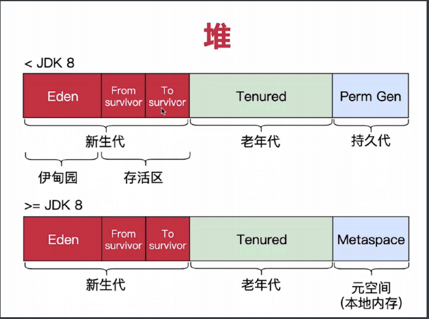
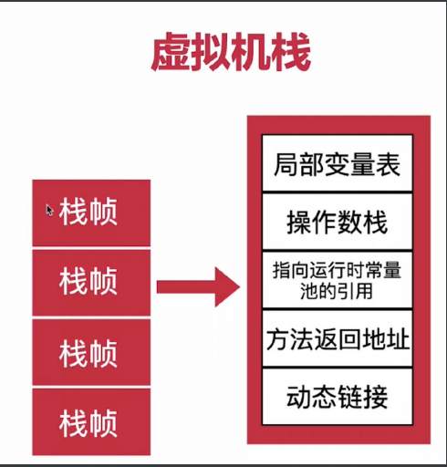
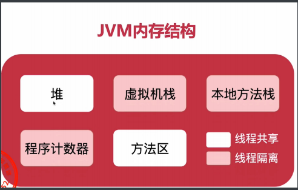
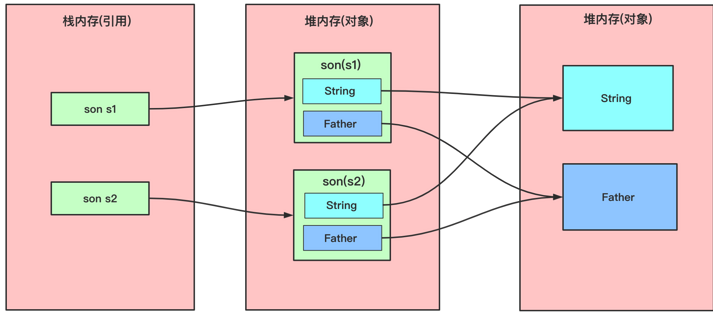
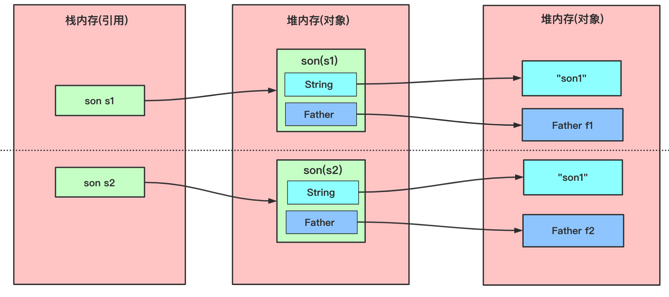
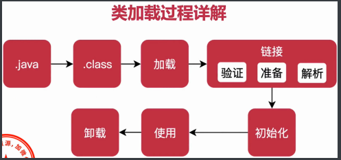

### JVM 题目

#### JVM 主要组成部分及作用

   JVM 主要包括两个子系统和两个组件组成。其中两个子系统为 Class loader(类装载) 和 Execution engine(执行引擎); 
   两个组件为 Runtime data area(运行时数据区)、Native Interface(本地接口)
   
   1. 类装载(class loader): 根据给定的全限定名(如:java.lang.Object)来 装载class文件到 运行时数据区中的方法区里。
   
   2. 执行引擎(Execution engine): 执行classes 中的指令
   
   3. 本地接口(Native Interface)： 与本地方法库交互，是其他的编程语言互相交互的接口
   
   4. 运行时数据区域(Runtime data area): 就是JVM 的内存
   
   *作用:* 首先通过编译器将java代码编译成字节码，类加载器再把字节码加载到内存,将其放到运行时数据区的方法区内。
   但是字节码文件只是JVM 的一套指令集的规范，并不能直接交给底层的操作系统去执行，所以需要特定的命令解析器(也就是执行引擎)，将字节码翻译成底层系统指令，
   然后再交给CPU 去执行， 这个过程需要调用其他语言的 本地库接口来实现整个程序的功能.

#### JVM 中有哪些数据区域？
  
  

  

####  JVM 运行时数据区域
  
  java虚拟机在执行java程序的时候会把它所管理的内存区域划分为很多个不同的数据区域，其中每个区域都有各自的用途，以及创建销毁时间，
  有些区域是随着虚拟机进程的启动而存在，有些区域是依赖线程的启动而存在。
  
  
  
  程序计数器: 指向当前线程正在执行的字节码的地址,行号，线程私有
  
  虚拟机栈: 存储局部变量表，操作数栈，动态链接，方法出口等。
  
  本地方法栈: 同虚拟机栈，不同的是，它存的是本地方法的数据。
  
  堆: 虚拟机中内存最大的一块区域，被所有线程共享，几乎所有的对象实例都在这里分配内存
  
  方法区: 存储已被虚拟机加载的类信息，常量，静态变量，即时编译后的代码等数据.

#### 堆栈的区别 
   
   物理地址: 
      
      堆的物理地址分配对对象来说是不连续的，所以性能慢些.
      
      栈的物理地址分配是连续的，性能快些。(栈使用的是数据结构中的栈，是先进后出的原则)
      
   内存区别: 
       
      由于堆是不连续的，所以分配内存是在*运行期*确认的，因此内存大小不固定。(一般来说，堆大小远远大于栈大小)
      
      栈是连续的，所以分配的内存大小需要在编译期就确认，大小是固定的
      
   存放内容： 
      
      堆中存放的是对象的实例和数组。（关注的是数据的存储）
      
      栈: 存放的是局部变量、操作数栈、返回结果。(关注的更多的是程序方法的执行)
      
      ps: 1. 静态变量是存放在方法区的。 2. 静态的对象还是放在堆中
   
   可见度: 
      
      堆： 对整个应用程序都是共享、可见的
      
      栈: 只对当前线程可见，也叫线程私有，生命周期与线程相同
 
#### java 深拷贝与浅拷贝
   
   浅拷⻉：对基本数据类型进⾏值传递，对引⽤数据类型进⾏引⽤传递般的拷⻉，此为浅拷⻉。（如果属性是基本类型(int,double,long,boolean等)，拷贝的就是基本类型的值; 如果属性是引用类型，拷贝的就是内存地址（即复制引用但不复制引用的对象） ，因此如果其中一个对象改变了这个地址，就会影响到另一个对象。）

   
   
   深拷⻉：对基本数据类型进⾏值传递，对引⽤数据类型，创建⼀个新的对象，并复制其内容，此为深拷⻉。（在具体实现深拷贝上，这里提供两个方式，重写clone()方法和序列法。）

   

#### 对象的创建、 及主要流程、 内存分配的两种方式
     
  创建方式: 
    
    1. new关键字、 Class的newInstance、Construct的newInstance、clone、序列化
    
  创建主要流程: 
    
    1.类加载》分配内存》初始化
  
  内存分配:
    
    1. 指针碰撞： 如果内存规整,即所有用过的内存放一边，空闲的放一边，分配内存时将位于中间的指针指示器向空闲的内存移动一段与对象大小相等的距离。
    
    2. 空闲列表: 内存不规整,即使用的内存和空闲的内存放到了一起，虚拟机维护一个列表来记录哪些是可用的，分配内存的时候找到一块足够大的空间分配给对象实例，并更新列表上的记录。
    
  
#### 内存泄漏
   
   内存泄漏是指不再被使用的对象或者变量一直被占据在内存中，无法被GC自动回收。
   
   java 导致内存泄漏的原因: 长生命周期的对象持有短生命周期对象的引用就很可能发生内存泄漏，因为尽管段生命周期的对象已经不再需要了，但是因为
   长生命周期对象持有它的引用而导致不能被回收。

#### JVM 的垃圾回收机制？
   
   在java 中，我们是不需要显示的去释放对象的内存的，而是由虚拟机自行执行。
   
   JVM 中，有一个垃圾回收的线程(低优先级)， 在正常情况下是不会执行，只有在虚拟机空闲或者是堆内存不足时，才会触发执行，扫描那些没有被任何引用的对象，
   并添加到要回收的集合中，进行回收。
   
   
#### 为什么要区分新生代、老年代？

   1. 共享内存区划分 （共享内存区=持久代+堆、 持久代=方法区+其他、堆=老年代+年轻代、年轻代=eden+s0+s1）
   
   2. 参数配置: 
        
         默认的，新生代 ( Young ) 与老年代 ( Old ) 的比例的值为 1:2 ，可以通过参数 –XX:NewRatio 配置。
         
         默认的，Edem : from : to = 8 : 1 : 1 ( 可以通过参数 –XX:SurvivorRatio 来设定)
         
         Survivor区中的对象被复制次数为15(对应虚拟机参数 -XX:+MaxTenuringThreshold)
    
    
   3. 为什么要分为Eden和Survivor?为什么要设置两个Survivor区？
    
        如果没有Survivor，Eden区每进行一次Minor GC，存活的对象就会被送到老年代。老年代很快被填满，触发Major GC.老年代的内存空间远大于新生代，进行一次Full GC消耗的时间比Minor GC长得多,所以需要分为Eden和Survivor。
        
        Survivor的存在意义，就是减少被送到老年代的对象，进而减少Full GC的发生，Survivor的预筛选保证，只有经历16次Minor GC还能在新生代中存活的对象，才会被送到老年代。
        
        设置两个Survivor区最大的好处就是解决了碎片化，刚刚新建的对象在Eden中，经历一次Minor GC，Eden中的存活对象就会被移动到第一块survivor space S0，Eden被清空；等Eden区再满了，就再触发一次Minor GC，Eden和S0中的存活对象又会被复制送入第二块survivor space S1（这个过程非常重要，因为这种复制算法保证了S1中来自S0和Eden两部分的存活对象占用连续的内存空间，避免了碎片化的发生）
        

#### JVM 如何进行垃圾回收？
   
   java堆=老年代+年轻代 
   
   年轻代=eden + s0 + s1 
   
   当 eden 区的空间满了，java 虚拟机会触发一次minor GC,以收集新生代的垃圾,存活下来的对象，转移到survivor区。
   
   大对象（需要大量连续内存空间的Java对象，如那种很长的字符串）直接进入老年态；
   
   如果对象在Eden出生，并经过第一次Minor GC后仍然存活，并且被Survivor容纳的话，年龄设为1，每熬过一次Minor GC，年龄+1，若年龄超过一定限制（15），则被晋升到老年态。即长期存活的对象进入老年态。
   
   老年代满了而无法容纳更多的对象，Minor GC 之后通常就会进行Full GC，Full GC  清理整个内存堆 – 包括年轻代和年老代。
   
   Major GC 发生在老年代的GC，清理老年区，经常会伴随至少一次Minor GC，比Minor GC慢10倍以上。
   
   
#### CMS 垃圾回收器的原理？

   
   是一种以获得最短回收停顿时间为目标的收集器，标记清除算法，运作过程: 初始标记、并发标记、重新标记、并发清除 ，收集结束会产生大量的空间碎片.
   

#### 标记算法有哪些? JVM 的垃圾回收算法?
  
  标记算法: 引用计数器、 可达性分析算法         
   
  垃圾回收算法: 标记-整理、标记-清除 、复制 
    
#### GC Roots 有哪些？

   线程栈的本地变量、静态变量、本地方法栈的变量等等
    
#### 简述新生代与老年代的区别？

   新生代: 主要是用来存放新生的对象。一般占据堆空间的1/3，由于频繁创建对象，所以新生代会频繁触发MinorGC进行垃圾回收。

   老年代: 老年代的对象比较稳定，所以MajorGC不会频繁执行。
   
#### 类的加载过程？什么是双亲委派机制？

   类的加载过程: 
    
   
   
    加载>> 验证>> 准备>> 解析>> 初始化>> 使用>> 卸载
   
   双亲委派机制:
    
    加载某个类时会先委托父加载器寻找目标类，找不到再 委托上层父加载器加载，如果所有父加载器在自己的加载类路径下都找不到目标类，则在自己的 类加载路径中查找并载入目标类

#### 为什么要设计双亲委派机制？
 
   沙箱安全机制：自己写的java.lang.String.class类不会被加载，这样便可以防止核心 API库被随意篡改 
   
   避免类的重复加载：当父亲已经加载了该类时，就没有必要子ClassLoader再加载一 次，保证被加载类的唯一性
   
#### raft 协议的原理？

#### JVM 调优经验？

#### 什么是三色标记？

#### 线上 GC 有问题，如何排查？

#### 什么是三色标记？什么是安全点与安全区域？

#### 简述一下 G1 垃圾回收器的原理？
   
   标记整理算法实现，运作流程主要包括以下：初始标记，并发标记，最终标记，筛选标记。不会产生空间碎片，可以精确地控制停顿。

#### 对象什么时候进入到老年代？什么是动态年龄判断？
    
   1. 对象年龄到达了设置的值(默认是15), 
   
   2. 大对象直接进入老年代 
   
   什么是动态年龄判断: survivor 区里 一批对象的总大小大于这个survivor 区域的内存大小50%(可以设置),那么此时大于等于这批对象年龄最大值的对象，就可以直接进入老年代了。

#### 你们线上服务的 QPS 有多大？机器配置是多少？JVM 的参数是怎么设置的？GC 的频率？为什么要这这样配置？

#### CMS收集器和G1收集器的区别：
   
   CMS收集器是老年代的收集器，可以配合新生代的Serial和ParNew收集器一起使用；
   
   G1收集器收集范围是老年代和新生代，不需要结合其他收集器使用；

   CMS收集器以最小的停顿时间为目标的收集器；
   
   G1收集器可预测垃圾回收的停顿时间

   CMS收集器是使用“标记-清除”算法进行的垃圾回收，容易产生内存碎片
   
   G1收集器使用的是“标记-整理”算法，进行了空间整合，降低了内存空间碎片。