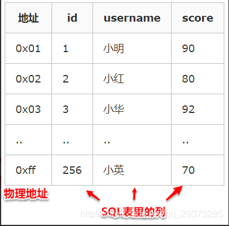
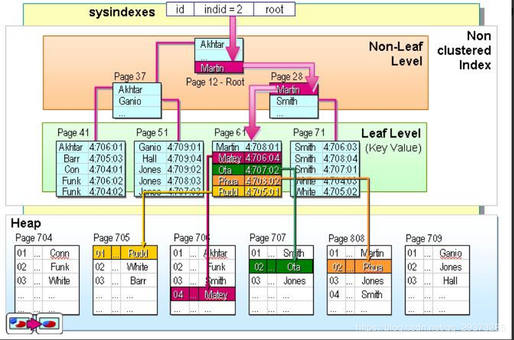

### Mysql 相关面试题

#### 索引 

   是帮助mysql 高效获取数据的*排好序* 的 *数据结构*

#### mysql 索引 底层数据结构
   
   hash 和 B+tree 平衡查询多叉树
    
     hash 是不支持范围查询的。
     
     索引虽然能提高查询效率，但是是牺牲插入和修改的性能的，因为每次修改都需要重新维护一下索引结构，带来大量的IO 开销。
     所以对一下频繁更改且唯一性差的字段，不建议创建索引

#### 红⿊树 B-tree(B树) B+tree的区别
   
   1. B树相对于红黑树的区别
       
       在大规模数据存储的时候，红黑树往往出现由于树的深度过大而造成磁盘IO 读写过过于频繁，进而导致效率低下的情况。
       为什么会出现这样的情况，我们知道要获取磁盘上数据，必须先通过磁盘移动臂移动到数据所在的柱面，然后找到指定盘面，接着旋转盘面找到数据所在的磁道
       ，最后对数据进行读写。磁盘IO 代价主要花费在查找所需的柱面上，数的深度过大会造成磁盘IO频繁读写。根据磁盘查找存取的次数
       往往由树的高度所决定，所以，只要我们通过某种较好的树结构减少树的结构尽量减少树的高度，B树可以有多个子女，从几十到上千，可以降低树的高度.
     
     红黑树不适合大规模数据存储  
     
   2. B树 和B+树的区别
       
       1. B树则所有节点都带有指向记录(数据)的指针(ROWID),B+树中只有叶子节点会带有指向记录(数据)的指针(ROWID)。
       因为B+树它把所有的卫星数据(或指向数据的指针)都存储在叶子节点中，内部节点只存放关键字和孩子指针，不会带上指向记录的指针(rowid)，
       这样，一个快中可以容纳更多的索引项，一是可以降低树的高度。二是一个内部节点可以定位更多的叶子节点(优点1)。
       
       2. B+树中每个叶子节点都包含指向下一个叶子节点的指针。所有叶子节点都是通过指针连接在一起，而B树不会。
       叶子节点之间通过指针来连接，范围扫描将十分简单(优点2)，而对于B树来说，则需要在叶子节点和内部节点不停的往返移动.
       
        B+树还有一个最大的好处，遍历更加高效，方便扫库(优点3)，B树必须用中序遍历的方法按序扫库，而B+树直接从叶子节点挨个扫一遍就完了，
        B+树支持range-query 非常方便，而B树不支持。这是数据库选用B+树的最主要原因。
        (B+树的遍历更加高效，B树需要以中序遍历的方式遍历节点，而B+树只需要把所有叶子节点串成链表就可以从头到尾遍历)。
        
       3. B+树每个节点的指针和key 一样多，B树每个节点=指针比key多1.
       
   为什么说B+树比B树更适合实际应用中操作系统的文件索引和数据库索引
       
       1) B+树的磁盘读写代价更低
        
          B+树的内部节点并没有指向关键字具体信息的指针，因为其内部节点相对B树更小。如果把所有同一内部节点的关键字存放在同一盘块中，
          那么盘块所能容纳的关键字数量也越多。一次性读入内存中的需要查找的关键字也就越多。相对于IO 读写次数也就降低了。
       
       2) B+树的查询效率更稳定
          
          由于非叶子节点并不是最终指向文件内容的节点，而只是叶子节点中关键字的索引。所以任何关键字的查找必须走一条
          从根节点到叶子节点的路。所有关键字查询的路径长度相同，导致每一个数据的查询效率相当。
          
          数据索引采用B+树的主要原因是B树在提高了磁盘IO性能的同时并没有解决元素遍历的效率低下的问题。正是为了解决这个问题，
          B+树应运而生。B+树只要遍历叶子节点就可以实现整棵树的遍历。而且在数据库中基于范围的查询是非常频繁的，而
          B树不支持这样的操作(或者说是效率太低)
          
   
   各有优点:
       
      B+树的优点:
        
        1. 非叶子节点不会带上指向记录的指针(ROWID),这样，一个块中可以容纳更多的索引项，一是可以降低树的高度。二是一个
        内部节点可以定位更多的叶子节点.
        
        2.叶子节点之间通过指针来连接，范围扫描将十分简单,而对于B树来说，则需要在叶子节点和内部节点不停的往返移动。
      
      B树的优点:
        
        对于在内部节点的数据，可直接得到，不必根据叶子节点来定位.
      
      
#### Mysql 中有哪几种锁?
   
   MyISAM 支持表锁， InnoDB 支持表锁和行锁，默认为行锁
   
   表级锁: 开销小，加锁快，不会出现死锁，锁粒度大，发生锁冲突的概率最高，并发量最低
   
   行级锁: 开销大，加锁慢，会出现死锁。锁粒度小，发生锁冲突的概率小，并发度最高
   
#### 脏读 幻读 不可重复读
   
   “未提交读（read-uncommitted）”这种隔离级别是数据一致性最差的一种，会产生“脏读”、“不可重复读”、“幻读”。
   
   “已提交读（read committed）”这种隔离级别虽然解决了“脏数据”问题。但仍然存在“不可重复读”和“幻读”。
   
   虽然“ 可重复读（ repeatable read）”级别，解决了“脏数据”和“不可重复读”的问题。但是它依然存在“幻读”现象，
   
   脏读: 一个事务在处理过程中读取了另外一个事务未提交的数据
   
   不可重复读: 一个事务范围内，多次查询某个数据，却得到不同的结果 (通俗一点就是另一个事务针对这个row执行了update操作)
   
   幻读: 同一个查询条件，返回的结果不一样（有一个隐含条件，同一个row返回的结果是一样的）。再通俗一点就是另一个事务针对这个表做了delete或者insert操作。
   
   
#### 聚集索引和⾮聚集索引
    
   

   
   聚集索引: 数据行的物理顺序与列值（一般是主键的那一列）的逻辑顺序相同，一个表中只能拥有一个聚集索引。
   
   非聚集索引: 该索引中索引的 逻辑顺序与磁盘上行的物理存储顺序不同 ，一个表中可以拥有多个非聚集索引。
   
   聚集索引: 
       
   
   
       注：第一列的地址表示该行数据在磁盘中的物理地址，后面三列才是我们SQL里面用的表里的列，其中id是主键，建立了聚集索引。
       
       结合上面的表格就可以理解这句话了吧：数据行的物理顺序与列值的顺序相同，如果我们查询id比较靠后的数据，那么这行数据的地址在磁盘中的物理地址也会比较靠后。而且由于物理排列方式与聚集索引的顺序相同，所以也就只能建立一个聚集索引了。
       
   
   
   
       从上图可以看出聚集索引的好处了，索引的叶子节点就是对应的数据节点（MySQL的MyISAM除外，此存储引擎的聚集索引和非聚集索引只多了个唯一约束，其他没什么区别），可以直接获取到对应的全部列的数据，而非聚集索引在索引没有覆盖到对应的列的时候需要进行二次查询，后面会详细讲。因此在查询方面，聚集索引的速度往往会更占优势。
      
   
   非聚集索引： 
       
       其实按照定义，除了聚集索引以外的索引都是非聚集索引，只是人们想细分一下非聚集索引，分成普通索引，唯一索引，全文索引。如果非要把非聚集索引类比成现实生活中的东西，那么非聚集索引就像新华字典的偏旁字典，他结构顺序与实际存放顺序不一定一致。
   
   
   

#### redis和mysql数据⼀致是怎么保证的
        
   读取缓存步骤一般没有什么问题，但是一旦涉及到数据更新：数据库和缓存更新，就容易出现缓存(Redis)和数据库（MySQL）间的数据一致性问题。
   
   管是先写MySQL数据库，再删除Redis缓存；还是先删除缓存，再写库，都有可能出现数据不一致的情况。
   
   
   举一个例子：
       
       1.如果删除了缓存Redis，还没有来得及写库MySQL，另一个线程就来读取，发现缓存为空，则去数据库中读取数据写入缓存，此时缓存中为脏数据。
       
       2.如果先写了库，在删除缓存前，写库的线程宕机了，没有删除掉缓存，则也会出现数据不一致情况。
       
       因为写和读是并发的，没法保证顺序,就会出现缓存和数据库的数据不一致的问题。
       
       如来解决？这里给出两个解决方案，先易后难，结合业务和技术代价选择使用。
   
   缓存和数据库一致性解决方案
   
   1. 第一种方案：采用延时双删策略
       
        
        在写库前后都进行redis.del(key)操作，并且设定合理的超时时间。
        
        public void write( String key, Object data )
        {
        	redis.delKey( key );
        	db.updateData( data );
        	Thread.sleep( 500 );
        	redis.delKey( key );
        }
        
        那么，这个500毫秒怎么确定的，具体该休眠多久呢？
        
        需要评估自己的项目的读数据业务逻辑的耗时。这么做的目的，就是确保读请求结束，写请求可以删除读请求造成的缓存脏数据。
        
        当然这种策略还要考虑redis和数据库主从同步的耗时。最后的的写数据的休眠时间：则在读数据业务逻辑的耗时基础上，加几百ms即可。比如：休眠1秒。
        
        
        3.设置缓存过期时间从理论上来说，给缓存设置过期时间，是保证最终一致性的解决方案。所有的写操作以数据库为准，只要到达缓存过期时间，则后面的读请求自然会从数据库中读取新值然后回填缓存。
        
        4.该方案的弊端结合双删策略+缓存超时设置，这样最差的情况就是在超时时间内数据存在不一致，而且又增加了写请求的耗时。
        
   
   2、第二种方案：异步更新缓存(基于订阅binlog的同步机制)
       
      1. 技术整体思路
       
        MySQL binlog增量订阅消费+消息队列+增量数据更新到redis
        
        读Redis：热数据基本都在Redis
        
        写MySQL:增删改都是操作MySQL
        
        更新Redis数据：MySQ的数据操作binlog，来更新到Redis
       
      2.Redis更新
        
        (1）数据操作主要分为两大块：一个是全量(将全部数据一次写入到redis)一个是增量（实时更新）这里说的是增量,指的是mysql的update、insert、delate变更数据。
        
        (2）读取binlog后分析 ，利用消息队列,推送更新各台的redis缓存数据。
        
            这样一旦MySQL中产生了新的写入、更新、删除等操作，就可以把binlog相关的消息推送至Redis，Redis再根据binlog中的记录，对Redis进行更新。
            
            其实这种机制，很类似MySQL的主从备份机制，因为MySQL的主备也是通过binlog来实现的数据一致性。
            
            这里可以结合使用canal(阿里的一款开源框架)，通过该框架可以对MySQL的binlog进行订阅，而canal正是模仿了mysql的slave数据库的备份请求，使得Redis的数据更新达到了相同的效果。
            
            当然，这里的消息推送工具你也可以采用别的第三方：kafka、rabbitMQ等来实现推送更新Redis!
        