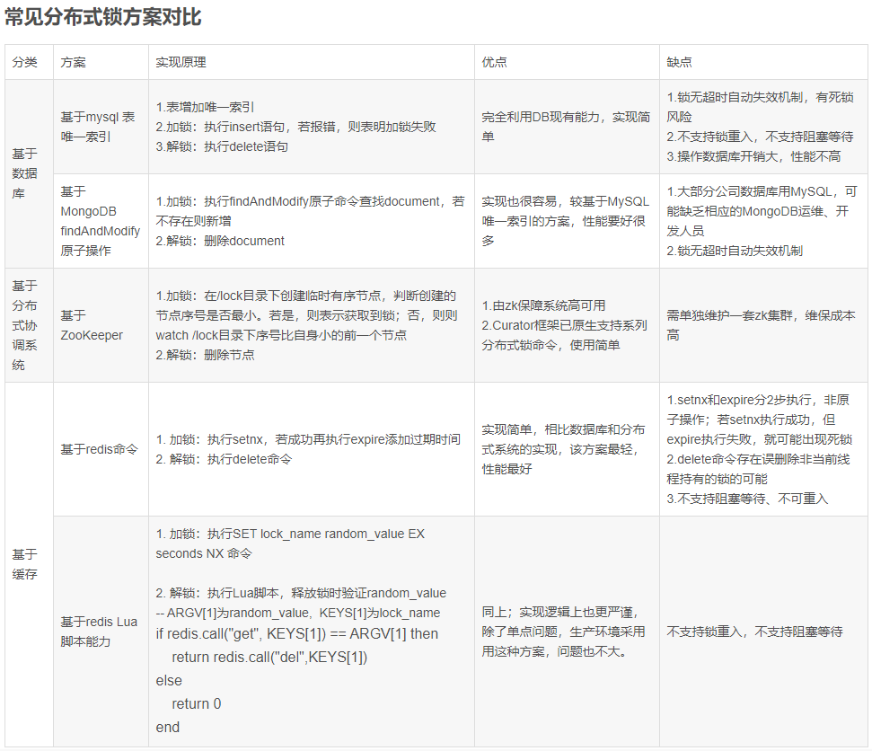

### redis 题目

#### 你们系统中分布式锁是如何实现的？
   
   采用 redis 实现，setnx +  expire  
   
#### 上面使用 redis 实现分布式锁会存在什么问题？

   实际上上面的步骤是有问题的，setnx和expire是分开的两步操作，不具有原子性，如果执行完第一条指令应用异常或者重启了，锁将无法过期。
   
   改善:  
       
       使用Lua脚本（包含setnx和expire两条指令） 
       
       使用 set key value [EX seconds][PX milliseconds][NX|XX] 命令 (正确做法)
       
   再改善: 
       
       使用 set key value [EX seconds][PX milliseconds][NX|XX] 命令 看上去很OK，实际上在Redis集群的时候也会出现问题，
       比如说A客户端在Redis的master节点上拿到了锁，但是这个加锁的key还没有同步到slave节点，master故障，发生故障转移，
       一个slave节点升级为master节点，B客户端也可以获取同个key的锁，但客户端A也已经拿到锁了，这就导致多个客户端都拿到锁。
       
       所以针对Redis集群这种情况，还有其他方案 (Redlock算法 与 Redisson 实现)
       
        
       
   
#### 项目中除了使用 redis 实现分布式锁，还有哪些使用场景？
    
  
    
#### 如何保证数据不丢失？当 redis 内存满了以后，内存的淘汰策略？
   
   RDB:  产生一个数据快照文件
   
   AOF:  实时追加命令的日志文件
   
   redis 内存满了，使用 redis的内存淘汰机制。
   
   淘汰策略:
    
    noeviction(默认策略)：若是内存的大小达到阀值的时候，所有申请内存的指令都会报错。
    
    allkeys-lru：所有key都是使用LRU(最近最少使用)算法进行淘汰。
    
    volatile-lru：所有设置了过期时间的key使用LRU算法进行淘汰。
    
    allkeys-random：所有的key使用随机淘汰的方式进行淘汰。
    
    volatile-random：所有设置了过期时间的key使用随机淘汰的方式进行淘汰。
    
    volatile-ttl：所有设置了过期时间的key根据过期时间进行淘汰，越早过期就越快被淘汰。
    
    
   
#### Redis 主从复制的原理

#### redis 中 key 的过期策略是什么？

   定时删除：创建一个定时器，定时的执行对key的删除操作。
       
   惰性删除：每次只有再访问key的时候，才会检查key的过期时间，若是已经过期了就执行删除。
       
   定期删除：每隔一段时间，就会检查删除掉过期的key。

#### redis 的持久化机制？AOF 和 RDB 的区别？

    RDB:  产生一个数据快照文件
      
    AOF:  实时追加命令的日志文件

#### 什么是缓存击穿、缓存穿透、缓存雪崩？如何处理？

#### 使用 redis 过程中遇到过什么问题？如何解决热 key 问题？

#### 你们的 redis 使用的那种模式？集群模式和哨兵模式的区别？集群模式和哨兵模式如何保证 redis 集群的高可用？redis 集群的故障转移过程？

#### redis 集群如何实现扩容？

#### redis 的 rehash 的过程？

#### Redis 有哪些数据类型？List 中数据非常多怎么办？
    
  string、 list、 hash、set、zset 
  
  
    

#### Redis 的持久化机制？AOF 和 RDB 的优缺点？

#### Redis 的高可用怎么保证？线上有多少台机器？怎么部署的？

#### Redis 实现分布式锁的原理？存在什么问题？

#### Redis 中遇到热 key 会造成什么问题？如何发现热 key？如何解决热 key 的问题？
