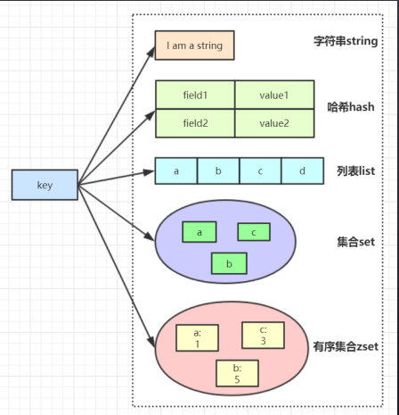

### redis 题目

#### 1. redis 是单线程还是多线程 

    redis 6.0 之前是单线程, redis 的单线程指的是其网络I/O 和键值对读写是由一个线程完成的。

    redis 6.0 之后 引入多线程，多线程指的是网络请求过程采用了多线程，而键值对读写命令仍然是单线程处理的，所以redis 依然是并发安全的。

    也就是只有网络请求模块和数据操作模块是单线程的，而其他的持久化，集群数据同步等，其实是由额外的线程执行的。

#### 2. 什么是redis 

  高性能非关系型的键值对数据库

#### 3. redis 为什么这么快? 
   
   1. 完全基于内存，一条命令在内存里操作的时间是几十纳秒
   
   2. 高效的数据结构，对数据操作也简单。(全局hash表<一维数组和二维链表组成>以及多种高效数据结构 比如: 跳表，压缩列表，链表等等)
   
   3. 采用单线程，避免了不必要的上下文切换
   
   4. 使用 I/O多路 复用模型，非阻塞I/O

#### 4. redis 底层数据是如何用跳表来存储的

    redis zset 数据类型，底层是用 压缩列表和跳表数据结构存储的。 

    跳表: 将有序链表 改造成支持近 "折半查找" 算法，可以进行快速的插入、删除、查找操作。

    跳表是由有序链表 改造优化而来 (有序链表是 插入快，查询慢)，将有序链表 添加索引层，每两个元素 取前面一个,提上去，组成索引，然后依次类推，可以一直往上提，查找的时候就根据索引查找(类似折半查找)

#### 5. redis 过期了为什么内存没释放

   1. 使用 redis 时，使用 set 命令，set 除了可以设置key-value 之外，还可以设置过期时间，此时如果修改key 的值，但是只是单纯的使用set 命令，而没有加上过期时间参数，
      那么这个key 的过期时间将被擦除，导致这个key 永远不会过期。

   2. redis 对于过期key 的处理有 惰性删除和 定时删除两种策略
        
    1）惰性删除： 当 读/写 一个已经过期的key 时，会触发 惰性删除策略，判断key 是否过期，如果过期了直接删除掉这个key 

    2）定时删除: 由于惰性删除无法保证冷数据被及时删除，所以 redis 会定期 (默认每100ms) 主动删除淘汰一批3已经过期的key,
       这里的一批只是部分过期key, 所以可能会出现部分key 已经过期 但没有被清理掉的情况，导致内存并没有释放。

#### 6. redis key 没设置过期时间为什么 被 redis 主动删除了

   当 redis 已用 内存超过 maxmemory 限定时，redis 会触发主动清理策略。

   主动清理策略在 redis 4.0 之前 一共有6种内存淘汰策略，在 4.0 之后，又增加了两种策略， 总共八种。

   a) 针对设置了过期时间的key 做处理

    1. volatile-ttl： 在刷选时，会针对 设置了 过期时间的键值对，根据过期时间的先后进行删除，越早过期越先删除。 

    2. volatile-random； 随机删除

    3. volatile-lru: 会使用 LRU 算法 刷选设置了过期时间的键值对 进行删除 

    4. volatile-lfu； 使用 LFU 算法 刷选 设置了过期时间的键值对 进行删除 

   b) 针对所有key 做处理:

    5. allkeys-random: 从所有键值对中 随机选择并 删除数据。
    
    6. allkeys-lru : 使用  LRU 算法 刷选 所有的键值对 进行删除 

    7. allkeys-lfu: LFU 算法 刷选 所有的键值对 进行删除

   c) 不处理： 

    8. noeviction: 不会删除任何数据，拒绝所有写入操作并返回客户端 错误信息 ，此时redis 只相应 读 操作。

#### 7. redis 淘汰 key 算法，LRU 与 LFU 区别

   1. LRU 算法(Least Recently Used 最近最少使用): 淘汰掉很久没被访问过的数据，以最近一次访问时间作为参考

   2. LFU 算法(Least Frequently Used 最不经常使用): 淘汰最近一段时间被访问次数最少的数据，以次数最为参考

   绝大多数情况下 都可以用 LRU ,当存在大量的热点缓存数据时，LFU 可能更好些

#### 8. 删除key 的命令 会阻塞 redis 吗 (会阻塞)

   删除 单个字符串 类型的 key ，时间复杂度为 O(1)。

   删除单个列表、集合、有序集合或哈希表类型的key， 时间复杂度为 O(M), M 为以上数据结构内的元素数量。

   当 单个字符串删除时，如果 key 的value 很大，那么执行时间可能会很长，所以会阻塞 redis 

   当 单个列表 等 删除时, 如果 列表里的 元素数量很多时，同样 也会阻塞 redis.

#### 9. redis 主从、哨兵、集群架构的优缺点 

   1. 主从: 一个主节点，多个从节点。 主节点对外提供数据访问，从节点备份数据。

   2. 哨兵: 一个主节点，多个从节点，哨兵集群, 主节点对外提供数据访问，从节点备份数据，哨兵负责监控 主节点 和 从节点的状态。

    在 redis 3.0 以前要实现集群，一般是借助哨兵 工具来监控 master 节点，如果master 节点异常，则会做 主从切换，将从节点最为主节点，

   3. 集群: 多个主从节点群 组成分布式服务器群，它具有 复制、高可用、分片等特性，redis 集群不需要 哨兵，也能完成节点移除和故障转移，需要将每个
    节点设置成 集群模式，这种集群模式设有中心节点，可水平扩展。

#### 10. redis 集群数据 hash 分片 算法是怎么回事

   redis cluster 将所有数据划分为 16384 个 slots (槽位)，每个节点负责其中一部分槽位，槽位的信息存储于每个节点中. 

   当 redis cluster 的客户端 来连接集群时，它也会得到一份集群的槽位配置信息并将其缓存在客户端本地，这样当客户端查找某个key 时，可以根据 槽位定位算法
   定位到目标节点。 

   槽位定位算法: 

    cluster 默认会对key 使用 crc16 算法 进行hash 得到一个 整数值, 然后 用这个整数值 对 16384 进行取模来得到具体槽位。

    再根据 槽位值和redis 节点的对应关系就可以定位到key 具体是落在哪个redis 节点上的。

#### 11. redis 执行命令 竟然有 死循环阻塞 bug 

   randomkey 命令 （随机查看redis 中的一个key）,这个 命令 可能导致 rdis 死循环阻塞 

   redis 对于过期key 的清理策略有两种分别为 惰性删除 和定时删除，而 randomkey 随机拿出一个key 之后，首先会先检查这个key 是否已过期，如果该 key 
   已经过期，则删除它，但是清理完还未结束，redis 还会再找出一个没有过期的key, 返回给客户端. 

   此时 redis 会继续 随机拿出一个key,然后 再判断是否已过期，直到 找出一个没过期的key 返回给客户端. 

   这里就有一个问题，如果此时redis 中，有大量的key 已经过期，但还未来的及清理，那么这个循环 就会持续很久才会结束，而且这个 耗时都花费在了 清理过期key 以及寻找key 上， 
   导致结果就是，randomkey 执行耗时变长，影响redis 性能.

   以上 流程是在 master 上执行的。

   如果是在 slave 上执行，则会更严重， 这个 bug 在 5.0 才被修复，解决方案是 在 slave 中 最多找一定次数，无论是否找到，都会退出循环。

#### 12. 一次线上事故， redis 主从切换导致缓存雪崩 

   假设，slave 的机器时钟 比 master 走的快的多。 

   此时，redis master 设置了 过期 时间的key ,从 slave 角度看，可能会有很多master 里没有过期的数据其实已经过期了.

   如果 此时操作主从切换，把slave 提升为 master. 

   它成为mater 之后，就会开始大量清除过期key, 此时 就会导致 以下结果: 

    1. master 大量清理过期key, 主线程可能会发生阻塞，无法及时处理客户端请求，

    2. redis 中数据大量过期，引发缓存雪崩

#### 13. redis 持久化 RDB、AOF、 混合持久化 是怎么回事 ？

    RDB:  产生一个数据快照文件

      rdb 是redis 默认的持久化方式，按照一定的时间将内存的数据以快照的形式保存到硬盘中，产生dump.rdb 
         
      优点: 只有一个文件，方便持久化，容灾性好，性能最大化，fork 子进程来完成写操作， 相对于数据集大时，比AOF 的启动效率更高.
      
      缺点:  数据安全性低,rdb 是间隔一段时间进行持久化，如果持久化之间redis发生故障，会发生数据丢失
      
      通过 fork 子进程 的方式 持久化 快照文件 

    AOF:  实时追加命令的日志文件， 将redis 执行的每次写命令记录到单独的日志文件里，当两种方式同时开启，数据恢复会优先选择AOF恢复
    
       优点： 数据安全，通过append

       重写：fork 子进程 进行 重写 aof 文件 

    混合持久化(4.0 版本后): rdb 和 aop 两种持久化 混合使用， aof 文件 会 存在 rdb 和 aof 两种格式数据，aof 在 重写 时，会将 aof 文件格式 变成 rdb 二进制格式 
    而 aof 持久化 时 还是会追加到 aof 文件中， 所以是 aof 文件格式。 

#### 14. 线上 redis 持久化策略 如何设置 

   如果 对性能 要求较高，在master 中最好不要做持久化，可以在 某个 slave 开启 aof 备份数据，策略设置为 每秒同步一次。

#### 15. 一次线上 事故，redis 主节点 宕机导致数据全部丢失 

   如果 redis 采用 如下模式 部署，就会发送数据 丢失问题: 

    master + slave + 哨兵 部署实例 

    master 没有开启 数据持久化功能 
    
    redis 进程使用 supervisor 管理，并配置 为进程宕机，自动重启 

    如果此时 master 宕机，哨兵 还未发起切换，此时 master 进程 立即被 supervisor 自动拉起。 

    但 master 没有开启任何 数据持久化 ，启动后是一个空实例。

    此时 slave 为了 跟 master 保持一致，它会自动 情况实例中的所有数据，slave 也会变成一个空实例。

    在这样的一个场景下，master、slave 的数据就全部 丢失了 

    这时 业务应用 访问redis 时，发现缓存中没有任何数据，就会把 请求全部打到 后端数据库中，将会进一步 引发缓存雪崩，对业务影响非常大。

    这种情况下，我们一般 不应该给 redis 主节点配置 进程宕机 自动重启策略，而应该 等哨兵 把某个 redis 从节点 切换为 主节点后 再重启之前宕机的redis 
    主节点，让其变为 slave 节点。

#### 16. redis 线上 数据如何备份 

    1. 写 crontab 定时调度脚本，每小时都copy 一份rdb 或aof 文件 到另外一台机器中去，会保留最近48 小时的备份。

    2. 每天都保留一份当日的数据备份到一个目录中去，可以保留最近一个月的备份

    3. 每次copy 备份的时候。都把太旧的备份给删除

#### 17. redis 主从数据风暴是怎么回事

    如果 redis 主节点 有很多从节点，在某一时刻，如果所有的 从节点 同时连接 主节点，那么主节点会把内存快照rdb 发给多个从节点，这样会导致
    redis 主节点 压力非常大，这就是所谓的 主从复制风暴问题。 

    这种问题可以对redis 主从架构 做一些优化得以避免，比如可以 做 那种 树形架构。

#### 18. redis 集群网络抖动 导致 频繁 主从切换怎么处理 

    真实世界中，机房网络往往不是风平浪静的，它们经常会发生各种各样的小问题，比如网络抖动就是非常场景的一种现象，突然之间部分连接变得不可访问，然后很快又恢复正常。

    为解决这种问题，redis cluster 提供了一种 选项 cluster-node-timeout ，表示当某个节点 持续 timeout 的时间 失联时，才可以认定该节点出现故障，然后再 进行 主从切换。

#### 19. redis 集群为什么 至少需要 三个 master 节点 

   因为 新 master 的选举 需要大于 半数的集群 master 节点同意才选举成功，如果只有两个 master 节点，当其中一个挂了，是达不到 选举 新 master 的条件的。

#### 20. redis 集群 为什么推荐 奇数 个节点 

    因为 新 master 的选举 需要大于 半数 的集群 master 节点同意 才能选举成功，奇数个 master 可以满足选举 该条件 的基础上节省 一个节点，比如三个 master 节点 和 四个 master 节点的集群相比
    ，如果都挂了 一个 master 节点 都能选举 master 节点，如果都挂了 两个 master 节点，都没办法选举新的 master 节点, 所以奇数 节点 更多的是 从节省机器资源的角度出发的。

#### 21. redis 集群 支持 批量操作命令吗？ 

    对于 类似 mset、mget 这样的多个key 的原生 批量操作命令，redis 集群只支持所有key 落在同一 solt 的情况下，如果有多个 key 一定要用mset 命令在redis 集群 上操作，则可以 在key 前面 加上
    {xxx}, 这样参数数据分片hash 计算 只会是大括号里的值，这样能确保不同的key 能落到 同一个solt 里去

#### 22. lua 脚本 能在 redis 集群 里执行吗 

    redis 官方规定 lua 脚本 如果想在 redis 集群里执行，需要 lua 脚本里操作的所有的key 落在集群中同一个节点上，这种的话，我们可以给lua 脚本的key 前面加上 一个相同的 hash tag ,就是 {xxx}, 
    这样能保证 lua 脚本里所有key 落在 相同的节点上。

#### 23. redis 主从切换 导致分布式锁 丢失问题 是怎么回事 

    因为， redis 主从 节点间的数据同步是 异步的方式同步，当主节点挂了，但是 锁还未 同步到 从节点，进行主从切换后，slave 变为了 master, 而 该节点并没有 这把锁，当别的线程进来时，也会加锁成功， 
    从而导致 并发问题

#### 24. RedLock 如何 解决 redis 主从切换分布式锁丢失问题 

    1. 通过 redlock 解决，redis 会往 所有的 redis master 节点 发送加锁请求，当客户端 收到 超过半数redis 节点加锁成功才算加锁成功。(如果使用 redLock ，不是说多搞从节点，而是需要搞更多的单节点)

#### 25. redis 的应用场景
    
   1. 计数器
   
   2. 缓存
   
   3. 会话缓存
   
   4. 消息队列
   
   5. 分布式锁

    
#### 26. 你们系统中分布式锁是如何实现的？
   
   采用 redis 实现，setnx +  expire  
   
#### 27. 上面使用 redis 实现分布式锁会存在什么问题？

   实际上上面的步骤是有问题的，setnx和expire是分开的两步操作，不具有原子性，如果执行完第一条指令应用异常或者重启了，锁将无法过期。
   
   改善:  
       
       使用Lua脚本（包含setnx和expire两条指令） 
       
       使用 set key value [EX seconds][PX milliseconds][NX|XX] 命令 (正确做法)
       
   再改善: 
       
       使用 set key value [EX seconds][PX milliseconds][NX|XX] 命令 看上去很OK，实际上在Redis集群的时候也会出现问题，

         EX seconds: 设定过期时间，单位为秒
         PX milliseconds: 设定过期时间，单位为毫秒
         NX: 仅当key不存在时设置值
         XX: 仅当key存在时设置值
         
         public boolean tryLock_with_set(String key, String UniqueId, int seconds) {
            return "OK".equals(jedis.set(key, UniqueId, "NX", "EX", seconds));
         }

       比如说A客户端在Redis的master节点上拿到了锁，但是这个加锁的key还没有同步到slave节点，master故障，发生故障转移，
       一个slave节点升级为master节点，B客户端也可以获取同个key的锁，但客户端A也已经拿到锁了，这就导致多个客户端都拿到锁。
       
       所以针对Redis集群这种情况，还有其他方案 (Redlock算法 与 Redisson 实现)

#### 28. 项目中除了使用 redis 实现分布式锁，还有哪些使用场景？
    
  

#### 29. Redis 有哪些数据类型？List 中数据非常多怎么办？

  string、 list、 hash、set、zset 

  

   
   string 应用场景

      计数器 （INCR article:readcount:{文章id}  GET article:readcount:{文章id} ）
      Web集群session共享（spring session + redis实现session共享）
      分布式系统全局序列号	（INCRBY  orderId  1000		//redis批量生成序列号提升性能）

   Hash应用场景

      对象缓存（HMSET  user  {userId}:name  zhuge  {userId}:balance  1888）
      电商购物车 （1）以用户id为key （2）商品id为field （3）商品数量为value
        （添加商品hset cart:1001 10088 1
         增加数量hincrby cart:1001 10088 1
         商品总数hlen cart:1001
         删除商品hdel cart:1001 10088
         获取购物车所有商品hgetall cart:1001）  
   
   List应用场景

      常用数据结构：
      Stack(栈) = LPUSH + LPOP
      Queue(队列）= LPUSH + RPOP
      Blocking MQ(阻塞队列）= LPUSH + BRPOP

      应用场景：
      1. 微博消息和微信公号消息
      2. 微博和微信公号消息流

   Set应用场景

      1. 微信抽奖小程序
         1）点击参与抽奖加入集合
            SADD key {userlD}
         2）查看参与抽奖所有用户
            SMEMBERS key	  
         3）抽取count名中奖者
            SRANDMEMBER key [count] / SPOP key [count]

      2. 微信微博点赞，收藏，标签
         1) 点赞
            SADD  like:{消息ID}  {用户ID}
         2) 取消点赞
            SREM like:{消息ID}  {用户ID}
         3) 检查用户是否点过赞
            SISMEMBER  like:{消息ID}  {用户ID}
         4) 获取点赞的用户列表
            SMEMBERS like:{消息ID}
         1) 获取点赞用户数 
            SCARD like:{消息ID}

   Zset集合操作实现排行榜

      1）点击新闻
         ZINCRBY  hotNews:20190819  1  守护香港
      2）展示当日排行前十
         ZREVRANGE  hotNews:20190819  0  9  WITHSCORES 
      3）七日搜索榜单计算
         ZUNIONSTORE  hotNews:20190813-20190819  7 hotNews:20190813  hotNews:20190814.. hotNews:20190819
      4）展示七日排行前十
         ZREVRANGE hotNews:20190813-20190819  0  9  WITHSCORES

#### 30. Redis 中遇到热 key 会造成什么问题？如何发现热 key？如何解决热 key 的问题？

   热key 遇到问题
      
      当前key是一个热点key（例如一个热门的娱乐新闻），并发量非常大。 重建缓存不能在短时间完成， 可能是一个复杂计算， 例如复杂的SQL、 多次IO、 多个依赖等。
   
   解决热key

      要解决这个问题主要就是要避免大量线程同时重建缓存。 我们可以利用互斥锁来解决，此方法只允许一个线程重建缓存， 其他线程等待重建缓存的线程执行完， 重新从缓存获取数据即可。

#### Redis 主从复制的原理

#### 什么是缓存击穿、缓存穿透、缓存雪崩？如何处理？

#### 你们的 redis 使用的那种模式？集群模式和哨兵模式的区别？集群模式和哨兵模式如何保证 redis 集群的高可用？redis 集群的故障转移过程？

#### redis 集群如何实现扩容？

#### redis 的 rehash 的过程？

#### Redis 的高可用怎么保证？线上有多少台机器？怎么部署的？

#### Redis 实现分布式锁的原理？存在什么问题？