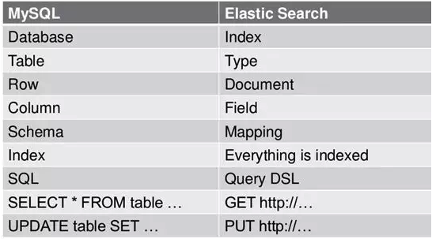

### 中间件 题目

#### 如何用 Zookeeper 实现分布式锁？存在什么问题？

#### Zookeeper 作为注册中心的实现原理？

#### Zookeeper 实现分布式锁的原理？

#### Zookeeper 集群如何部署？Zookeeper 如何实现选举？什么是 ZAB 协议？

#### Zookeeper 如何保证数据的顺序一致性？

#### Zookeeper 的使用场景？如何支撑大量的读请求？

#### 你们微服务的注册中心是如何选型的？Zookeeper 和 Eureka 作为注册中心的区别？它们有什么瓶颈？

#### 如何设计一款能支撑数十万机器组成的集群的注册中心？

#### 如何设计一个秒杀系统？在双十一当天，从浏览器中输入 www.taobao.com 到加载出页面，说一下它的完整过程。

#### zookeeper 是如何保证事务的顺序一致性的

    zookeeper 采用了全局递增的事务 Id 来标识，所有的 proposal（提议）都在 被提出的时候加上了 zxid，zxid 实际上是一个 64 位的数字，高 32 位是 epoch（ 时期; 纪元; 世; 新时代）用来标识 leader 周期，如果有新的 leader 产 生出来，epoch会自增，低 32 位用来递增计数。当新产生 proposal 的时候， 会依据数据库的两阶段过程，首先会向其他的 server 发出事务执行请求，如果 超过半数的机器都能执行并且能够成功，那么就会开始执行。

####  ZooKeeper 是什么？

    ZooKeeper 是一个开源的分布式协调服务。它是一个为分布式应用提供一致性 服务的软件，分布式应用程序可以基于 Zookeeper 实现诸如数据发布/订阅、 负载均衡、命名服务、分布式协调/通知、集群管理、Master 选举、分布式锁和 分布式队列等功能。

####  zookeeper 四种类型的数据节点 Znode

    （1）PERSISTENT-持久节点 除非手动删除，否则节点一直存在于 Zookeeper 上 
    （2）EPHEMERAL-临时节点 临时节点的生命周期与客户端会话绑定，一旦客户端会话失效（客户端与 zookeeper 连接断开不一定会话失效），那么这个客户端创建的所有临时节点 都会被移除。 
    （3）PERSISTENT_SEQUENTIAL-持久顺序节点 基本特性同持久节点，只是增加了顺序属性，节点名后边会追加一个由父节点维 护的自增整型数字。 
    （4）EPHEMERAL_SEQUENTIAL-临时顺序节点 基本特性同临时节点，增加了顺序属性，节点名后边会追加一个由父节点维护的 自增整型数字。

#### Elasticsearch与MySQL对应关系表

    MySQL 中的数据库（DataBase），等价于 ES 中的索引（Index）。

    MySQL 中一个数据库下面有 N 张表（Table），等价于1个索引 Index 下面有 N 多类型（Type）。

    MySQL 中一个数据库表（Table）下的数据由多行（Row）多列（column，属性）组成，等价于1个 Type 由多个文档（Document）和多 Field 组成。

    MySQL 中定义表结构、设定字段类型等价于 ES 中的 Mapping。举例说明，在一个关系型数据库里面，Schema 定义了表、每个表的字段，还有表和字段之间的关系。与之对应的，在 ES 中，Mapping 定义索引下的 Type 的字段处理规则，即索引如何建立、索引类型、是否保存原始索引 JSON 文档、是否压缩原始 JSON 文档、是否需要分词处理、如何进行分词处理等。

    MySQL 中的增 insert、删 delete、改 update、查 search 操作等价于 ES 中的增 PUT/POST、删 Delete、改 _update、查 GET。其中的修改指定条件的更新 update 等价于 ES 中的 update_by_query，指定条件的删除等价于 ES 中的 delete_by_query。

    MySQL 中的 group by、avg、sum 等函数类似于 ES 中的 Aggregations 的部分特性。

    MySQL 中的去重 distinct 类似 ES 中的 cardinality 操作。

    MySQL 中的数据迁移等价于 ES 中的 reindex 操作。

#### PUST 和 PUT 的区别 

    PUST 和 PUT 都能起到创建和更新的作用 

    1. PUT 需要对一个具体的资源进行操作也就是要确定id才能进行 更新/创建，而POST是可以针对整个资源集合进行操作的,如果不写id 就由es 生成一个唯一的id，如果填了id 那就针对这个id的文档进行创建/更新

    2. PUT 只会将json 数据都进行替换，POST 只会更新相同字段的值

    1. PUT 和 DELETE 都是幂等性操作，即不论操作多少次，结果都一样。 
   
#### 安装 Elasticsearch 需要依赖什么组件吗？
    
    ES 早期版本需要JDK，在7.X版本后已经集成了 JDK，已无需第三方依赖。

