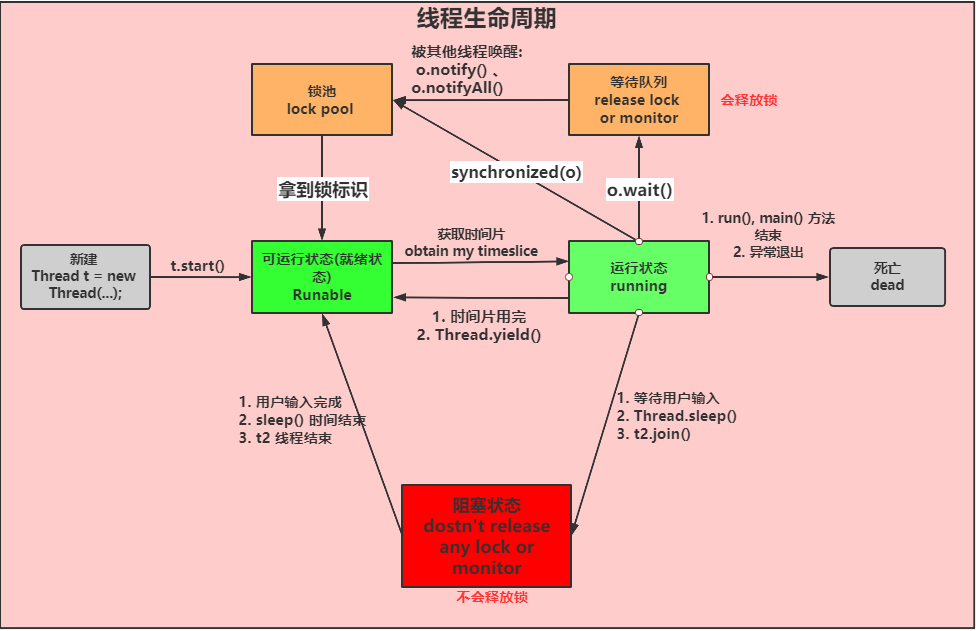

### 并发编程

#### 说说对线程安全的理解

   线程安全指的是，我们写的某段代码，在多线程同时执行这段代码时，不会产生混乱，依然能够得到正常的结果，比如 i++ ，初始值为0，那么两个线程来同时执行这两行代码，如果代码时线程安全的
   ，那么最终的结果应该就是一个线程的结果是1，一个线程的结果是2，如果出现了两个线程的结果都为1，则表示这段代码时线程不安全的。

#### 对守护线程的理解

   线程分为用户线程和守护线程，用户线程就是普通线程，守护线程就是jvm 的后天线程，比如垃圾回收线程就是一个守护线程，守护线程会在其他普通线程都停止运行之后自动关闭。
   我们可以通过设计 thread.setDaemon(true) 来把一个线程设置为守护线程。

#### 并发、并行、串行 之间的区别 

   1. 串行: 一个任务执行完，才能执行下一个任务

   2. 并行: 两个任务同时执行 

   3. 并行: 两个任务整体上看上去是同时执行，在底层，两个任务被拆成了很多份，然后一个一个执行，站在更高的角度看来两个任务是同时在执行的

#### 线程池的原理，为什么要创建线程池？创建线程池的方式；

   线程池内部是通过队列+线程实现的，当我们利用线程池执行任务时: 

      1. 如果此时线程池中的线程数量小于 corePoolSize ,即使线程池中的线程都处于空闲状态，也要创建新的线程来处理被添加的任务。
      2. 如果此时线程池中的线程数量等于 corePoolSize, 但是缓冲队列 workQueue 未满，那么任务被放在缓冲队列。
      3. 如果此时线程池中的线程数量大于等于 corePoolSize， 缓冲队列 workQueue 满，并且线程池中的数量小于 maximumPoolSize ，建新的线程来处理被添加的任务。
      4. 如果此时线程池中的线程数量大于 corePoolSize， 缓冲队列 workQueue 满，并且线程池中的数量等于 maximumPoolSize ,那么通过 handler 所指定的策略来处理此任务。
      5. 当线程池中的线程数量大于 corePoolSize， 如果某线程空闲时间超过 keepAliveTime,线程将被终止，这样线程池可以动态的调整池中的线程数. 
   
   2. 
   
   3. ThreadPoolExecutor、ThreadScheduledExecutor、ForkJoinPool

#### 线程池为什么 是先添加队列而不是先创建最大线程 

   当线程池中的核心线程都在忙时，如果继续往线程池中添加任务，那么任务会先放入对比，队列满了之后，才会新开线程。

   这就相当于一个公司有10个程序员，本来这10个程序员能正常处理各种需求，但是随着公司的发，需求在慢慢的增加，但是一开始这些需要钱只会增加在待开发列表中，然后这10个 
   程序员加班加点的从待开发列表中获取需求进行处理，但是某一天待开发列表满了，公司发现现有的10个程序员是真的处理不过来了，所以就开始新招员工了。
   

#### 线程的生命周期，什么时候会出现僵死进程；
   
  
  
  僵死进程是指子进程退出时,父进程并未对其发出的SIGCHLD信号进行适当处理，导致子进程停留在僵死状态等待其父进程为其收尸，这个状态下的子进程就是僵死进程。

#### 说说线程安全问题，什么是线程安全，如何实现线程安全
    
   线程安全 - 如果线程执行过程中不会产生共享资源的冲突，则线程安全。 
   
   线程不安全 - 如果有多个线程同时在操作主内存中的变量，则线程不安全
   
   实现线程安全的三种方式: 
    
       1. 互斥同步： 临界区:syncronized、ReentrantLock； 信号量: semaphore、 互斥量: mutex
       
       2. 非阻塞同步： CAS
       
       3. 无同步方案： 可重入代码、线程本地存储

#### java 死锁如何避免

   造成死锁的几个原因: 

      1. 一个资源每次只能被一个线程使用 (互斥条件)
      2. 一个线程在阻塞等待某个资源，不释放已占有资源 （请求与保持条件）
      3. 一个线程已经获得的资源，在未使用完之前，不能被强行剥夺。 (不剥夺条件)
      4. 若干线程形成头尾相接的循环等待资源关系 (循环等待条件)

   这是造成死锁必须要达到的四个条件，如果要避免死锁，只需要不满足其中一个条件即可，而其中前三个条件是作为锁要符合的条件，所以要避免死锁就需要打破第四个条件，
   不出现循环等待的关系。

   在开发过程中: 

      1. 要注意加锁的顺序，保证每个线程按同样的顺序进行加锁
      2. 要注意加锁时限，可以针对锁设置一个超时时间
      3. 要注意死锁的检查，这是一种预防机制，确保在第一时间发现死锁并进行解决。

#### ReentrantLock 中的公平锁 和 非公平锁 的底层实现 

   首先不管是公平锁还是非公平锁，它们的底层都会使用AQS 来进行排队，他们的区别在于，线程在使用 lock() 方法加锁时，如果是公平锁，会先检查AQS 队列中是否存在线程在排队
   ，如果有线程排队，则当前线程也进行排队，如果是非公平锁，则不会去检查是否有线程在排队，而是直接竞争锁。

   不管是公平锁还是非公平锁，一旦没有竞争到锁，都会进行排队，当锁释放时，都是唤醒排队在最前面的线程，所以非公平锁只是体现在线程加锁阶段，而没有体现在线程被唤醒阶段，

   另外 ReentrantLock 是可重入锁，不管是公平锁还是非公平锁，都是可重入的. 

#### ReentrantLock 中 的 tryLock() 和 lock() 方法的区别 

   1. tryLock() 表示尝试加锁，可能加到，也可能加不到，该方法不会阻塞线程，如果加到锁则返回true,没有加到锁则返回 false. 

   2. lock() 表示阻塞加锁，线程会阻塞直到加到锁，方法没有返回值。 

#### CountDownLatch 与 Semaphore 的区别和底层原理 

   1. CountDownLatch 表示计数器，可以给 CountDownLatch 设置一个数字，一个线程调用 CountDownLatch 的 await() 将会阻塞，其他线程可以调用 CountDownLatch
   的 countDown() 方法来对 CountDownLatch 中的数字减一，当数字被减成0后，所有await 的线程都将被唤醒。
      
   对应的底层原理就是，调用 await() 方法的线程会利用AQS 进行排队，一旦数字被减为0，则会将AQS 中排队的线程依次唤醒。

   2. Semaphore 表示信号量，可以设置许可的个数，表示同时允许最多多少个线程使用该信号量，通过 acquire() 来获取许可，如果没有许可可用则线程阻塞，
   并通过AQS 来排队，可以通过 release() 方法来释放许可，当某个线程释放了某个许可后，会从 AQS 中正在排队的第一个线程开始依次唤醒，直到没有空闲许可。

#### 谈谈对 AQS 的理解 ，AQS 如何实现可重入锁?

   1. AQS 是一个java 线程同步的框架，是jdk 中很多锁工具的核心实现框架。

   2. 在 AQS 中，维护了一个信号量 state 和一个线程组成的双向链表队列，其中这个线程队列，就是用来给线程排队的，而 state 就像是一个红绿灯，用来控制
   线程排队或者放行的，在不同的场景下，有不同的意义。
      
   3. 在可重入锁这个场景下，state 就是用来表示加锁的次数，0 表示无锁，每加一次锁，state 就加1，释放锁就 减1 。

#### AQS 实现锁的原理？与 synchronize 的区别

#### Reactor 线程模型有哪些？Netty 是如何支持这三种线程模型的？

#### 多路复用器的实现原理？

#### epoll 的实现原理？epoll、poll、select 的区别
    
#### ThreadLocal 的实现原理？

   1. ThreadLocal 是java 中所提供的*线程本地存储机制*， 可以利用该机制将*数据缓存在某个线程内部*，该线程可以在任意时刻，任意方法中获取缓存的数据。

   2. ThreadLocal 底层是通过 ThreadLocalMap 来实现的，每个 Thread 对象(注意不是 ThreadLocalMap 对象) 中都存在一个 ThreadLocalMap, Map 的
   key 为 ThreadLocal 对象，Map 的value 为需要缓存的值。
      
   3. ThreadLocal 经典的应用场景  就是连接管理(一个线程持有一个连接，该连接对象可以在不同的方法之间进行传递，线程之间不共享同一个连接)

#### 使用 ThreadLocal 需要注意哪些问题？（实际上是问 ThreadLocal 内存泄漏的问题）

   如果在 线程池中使用 ThreadLocal 会造成 内存泄漏，因为当 ThreadLocal 对象使用完毕之后，应该要把设置的key ,value ,也就是 Entry 对象进行回收，
   但是线程池中的线程不会回收，而线程对象是 通过 强引用 指向 ThreadLocalMap ,ThreadLocalMap 也是通过强引用 指向 Entry 对象，线程不被回收，Entry 对象
   也就不会回收，从而出现内存泄漏

   解决办法是，在使用了 ThreadLocal 对象之后，手动调用 ThreadLocal 的 remove 方法，手动清除 Entry 对象。

#### Java 中的锁有哪些？和 Lock 的区别

#### synchronized 的底层实现原理？

#### AQS 的实现原理？

#### volatile 的作用和实现原理？

#### 线程池的实现原理？线程池满了，再提交任务时会怎么处理？

#### Netty 的线程模型？主从多线程模型下，线程是如何分工的？

#### 线程池的实现原理是什么？如何设置线程池的参数？

#### 对于 CPU 密集型的系统，为什么线程个数设置为 CPU 核数+1？为什么要+1？

#### 对于 IO 密集型的系统，为什么线程个数为 2 倍 CPU 核数？为什么是 2 倍，而不是 3 倍、4 倍等等？

#### BIO、NIO、AIO 的区别？

#### 什么是 JMM 内存模型？

#### synchronized 的实现原理

#### 线程池的实现原理？有哪些参数，分别是什么含义？

#### Netty 的线程模型有哪些？

#### 什么是 TCP 的粘包与半包？Netty 是如何解决的？

#### epoll 的原理？

#### 什么是内存模型？

#### 什么是线程安全？

#### Java 中锁有哪些？synchronize 和 Lock 的区别？

#### synchronize 的底层实现原理

#### 对象在内存中的布局？

#### volatile 关键字的实现原理？

#### 什么是原子性、可见性、有序性？什么是 happen-before 原则？解释一下 final 的语义？

#### 什么是 CAS？CAS 存在什么问题？

#### Lock 系列锁的实现原理？

#### 什么是原子类？原子类的实现原理？

#### Java 中对象的引用有哪些类型？

#### netty 用过吗？为什么 netty 是高性能的网络框架？

#### synchronized 底层实现

1. 同步方法
   
   可以看到在add方法的flags里面多了一个ACC_SYNCHRONIZED标志，这标志用来告诉JVM这是一个同步方法，在进入该方法之前先获取相应的锁，锁的计数器加1，方法结束后计数器-1，如果获取失败就阻塞住，知道该锁被释放。

2. 同步代码块

   从反编译的同步代码块可以看到同步块是由monitorenter指令进入，然后monitorexit释放锁，在执行monitorenter之前需要尝试获取锁，如果这个对象没有被锁定，或者当前线程已经拥有了这个对象的锁，那么就把锁的计数器加1。当执行monitorexit指令时，锁的计数器也会减1。当获取锁失败时会被阻塞，一直等待锁被释放。

   但是为什么会有两个monitorexit呢？其实第二个monitorexit是来处理异常的，仔细看反编译的字节码，正常情况下第一个monitorexit之后会执行goto指令，而该指令转向的就是23行的return，也就是说正常情况下只会执行第一个monitorexit释放锁，然后返回。而如果在执行中发生了异常，第二个monitorexit就起作用了，它是由编译器自动生成的，在发生异常时处理异常然后释放掉锁。

#### volatile的原理

   为了提高处理器的执行速度，在处理器和内存之间增加了多级缓存来提升。但是由于引入了多级缓存，就存在缓存数据不一致问题。

   但是，对于volatile变量，当对volatile变量进行写操作的时候，JVM会向处理器发送一条lock前缀的指令，将这个缓存中的变量回写到系统主存中。

   但是就算写回到内存，如果其他处理器缓存的值还是旧的，再执行计算操作就会有问题，所以在多处理器下，为了保证各个处理器的缓存是一致的，就会实现缓存一致性协议

   缓存一致性协议：每个处理器通过嗅探在总线上传播的数据来检查自己缓存的值是不是过期了，当处理器发现自己缓存行对应的内存地址被修改，就会将当前处理器的缓存行设置成无效状态，当处理器要对这个数据进行修改操作的时候，会强制重新从系统内存里把数据读到处理器缓存里。

   所以，如果一个变量被volatile所修饰的话，在每次数据变化之后，其值都会被强制刷入主存。而其他处理器的缓存由于遵守了缓存一致性协议，也会把这个变量的值从主存加载到自己的缓存中。这就保证了一个volatile在并发编程中，其值在多个缓存中是可见的。

### 并发面试题汇总

 	1. java 如何开启线程？  怎么保证线程安全？  

 		1）线程和进程的区别: 进程是操作系统进行资源分配的最小单元。 线程时操作系统进行任务分配的最小单元, 线程属于进程

 		2）如何开启线程 ？ 1. 继承thread 类、重新run 方法. 2. 实现Runnable 接口，实现run 方法。 3.实现Callable接口，实现call 方法，通过FutureTaskc
 			创建一个线程，可以获取到线程执行的返回值， 通过线程池来开启线程

 		3) 怎么保证线程安全?  加锁: 1. jvm 提供的锁，synchronized 关键字 2. jdk 提供的各种lock 锁

 	2. volatile 和 synchronized 有什么区别? volatile 能不能保证线程安全？ DCL  单例为什么要加volatile ？ 

 		1）synchronized 是用来加锁，volatile 只是保证变量的线程可见性，通常适合用于一个线程写，多个线程读的场景。

 		2） 不能，volatile 关键字只能保证线程可见性，不能保证原子性

 		3）volatile 可以防止指令重排，对象的创建分为三步 1. 分配内存 2. 初始化 3. 建立引用对应关系。 cpu 执行的时候有时候会进行优化，将 1,2,3 步骤重排。

 	3. java 线程锁机制是怎样的？ 偏向锁、轻量级锁、重量级锁有什么区别？ 锁机制是如何升级的? 

 		1） java 的锁就是在对象的markword中记录的一个锁状态。 偏向锁、轻量级锁、重量级锁 对应不同的锁状态

 		2） java 的锁机制就是根据资源竞争的激烈程度不断进行锁升级  
 			 1. 首先new 对象 
 			 2. 判断是否开启偏向锁
 			 	开启： 加匿名偏向
 			 	未开启： 普通对象
 			 3. 加偏向锁 
 			 4. 轻度竞争 加轻量级锁 
 			 5. 重度竞争 加重量级锁 

 	4. 谈谈对AQS 的理解，AQS  是如何实现可重入锁？

 		1）AQS(抽象队列同步器)是一个java线程同步的框架,是jdk中中很多锁工具的核心实现框架 

 		2） 在AQS中，维护了一个信号量state和一个线程组成的双向链表队列，其中这个线程队列，就是线程用来排队的，而state就像一个红绿灯，用来控制线程排队或者放行的，在不同的
 			场景有不同的意义。

 		3） 在可重入锁的场景下，state 就是用来表示加锁的次数，0 标识无锁，每加一次锁，state 就加1 ，释放锁state 减1。

 	5. 有 A、B、C 三个线程，如何保证三个线程同时执行？ 如果在并发情况下保证三个线程依次执行？ 如何保证三个线程有序交错进行？ 

 		1） CountDownLatch: 
 			CylicBarrier:
 			Semaphore: 

 		2) 可以使用并发工具 CountDownLatch 实现 三个线程同时执行 

 		3）可以使用并发工具 CylicBarrier 实现 三个线程依次执行

 		4）可以使用并发工具 Semphore 让三个线程有序交错执行

 	6. 如何对一个字符串快速进行排序？ 

 		1）ForkJoin 框架 实现  
 		2) 分为 拆分 和汇总两个阶段 

 	7. 在java 中守护线程和本地(用户)线程的区别? 

 		java 中有两种线程: 本地(用户)线程和守护线程

 		任何线程都可以设置为守护线程和用户线程，通过方法Thread.setDaemon(boolean); true 为守护线程，反之为用户线程，Thread.setDaemon() 必须在Thread.start() 前调用

 		区别: 唯一的区别是判断虚拟机何时离开，Daemon 是为其他线程提供服务，如果全部的User Thread 已经撤离，Daemon 没有可服务的线程，jvm 撤离。也可以理解为 守护线程时jvm 创建的，用户线程是程序创建的的线程

 	8. 什么是多线程中的上下文切换？ 

 		多线程共同使用一组计算机上的CPU, 而线程数大于给程序分配的CPU数量时，为了让各个线程都有执行的机会，就需要轮转使用CPU,不同的线程切换使用CPU发送切换数据就是上下文切换

 	9. 死锁与活锁的区别？ 死锁与饥饿的区别? 

 		死锁： 两个或两个以上的线程在执行过程中，因竞争资源而造成一种互相等待的现象，若无外力作用，它们都将无法推进下去
 			产生死锁的必要条件: 互斥条件、请求与保持条件、不剥夺条件、循环等待条件

 		活锁: 任务或者执行者没有被阻塞，由于某些条件没有满足，导致一直重复尝试，失败，尝试，失败。 

 		活锁与死锁的区别: 处于活锁的实体是在不断的改变状态，所谓的“活”， 而处于死锁的实体表现为等待， 活锁有可能自行解开，但死锁不会 

 		饥饿：一个或多个线程因为种种原因无法获取所需要的资源，导致一直无法执行的状态
 			饥饿原因: 高优先级线程吞噬低优先级线程的CPU时间、线程被永久堵塞在一个等待进入同步块的状态，因为其他线程总是在它之前对该同步块进行访问

 	10. 什么是原子操作？ 在java API中 中有哪些原子类？ 

 		1. 原子操作 意为"不可被中断的一个或一系列操作", 处理器使用基于对缓存加锁或总线加锁的方式来实现多处理器直接的原子操作，在java中 可以通过锁和循环 CAS 的方式来实现
 			原子操作 

 		2. 原子类: AtomicBoolean、AtomicInteger 、AtomicLong 等 
 		   解决ABA 问题的原子类: AtomicMarkableReference (通过引入一个boolean 来反映中间有没有变过) 
 		   					  AtomicStampedReference (通过引入一个int 来累加反映中间有没有变过)

 	11. 在java 中 wait 和 sleep 方法的不同？ 

 		最大的不同是等待时wait 会释放锁，而sleep 一直持有锁，wait 通常被用于线程间的交互，sleep 通常用于暂停执行

 	12. java 中 notify 和 notifyAll 有什么区别? 

 		notify 不能唤醒某个具体的线程，所以只有一个线程在等待的时候才有用武之地。而notifyAll 唤醒所有的线程并允许他们争夺锁确保至少有一个线程能继续运行

 	13. 为什么 wait，notify 和 notifyAll 这些方法不在thread 类里面? 

 		一个很明显的原因是java提供的锁都是对象级的而不是线程级的，每个对象都有锁，通过线程获得，由于wait notify 和notifyAll都是锁级别操作，所以把它们定义在object 类中因为锁属于对象 

 	14. 什么是ThreadLocal 变量? 

 		ThreadLocal 是java 中一种特殊的变量，每个线程都有一个ThreadLocal 就是每个线程都拥有自己独立的一个变量，竞争条件被彻底消除了。它是为创建代缴高昂的对象获取线程
 		安全的好方法，比如可以用ThreadLocal 让 SimpleDateFormat 变成线程安全的，因为那个类创建代价高昂且每次调用都需要创建不同的实例所以不值得在局部范围使用它，如果为每个线程提供一个自己独有的变量拷贝，将大大提高效率。 

 	15. java 中 interrupeted 和 isInterrupted 方法的区别? 

 		interrupt 方法用于中断线程。调用该方法的线程的状态将被置为 “中断” 状态 （注意线程中断仅仅是置线程的中断状态位，不会停止线程，需要用户自己去监视线程的状态并做处理）

 		interupted 查询当前线程的中断状态，并清除原状态，如果一个线程被中断了，第一次调用interrupted 则返回true ，第二次和后面的就返回 false 了 

 		isinterrupted 仅仅是查询当前线程的中断状态

 	16.  为什么 wait 和 notify 方法要在同步块中调用? 

 		java API 强制要求这样做，如果不这么做，代码会抛异常。还有一个原因就是为了避免wait 和 notify 之间产生竞争条件

 	17. Thread 类中的 yield 方法有什么作用? 

 		使当前线程从执行状态(运行状态) 变为 可执行态(就绪状态) 

 		当前线程到了就绪状态，那么接下来哪个线程会从就绪状态变成执行状态呢? 可能是当前线程，也可能是其他线程，主要看系统分配(哪个先抢到时间片)

 	18. 什么是CAS? CAS 会产生什么问题? 

 		1) CAS是compare and swap 的缩写，即所说的比较交换
 			cas 是一种基于锁的操作，而且是乐观锁。在java中的锁分为乐观锁和悲观锁，悲观锁是将资源锁住，等一个之前获取锁的线程释放锁之后，下一个线程才能访问。
 			而乐观锁采取一种宽泛的态度，通过某种方式不加锁来处理资源，比如通过给记录加version 来获取数据，性能较 悲观锁有很大的提高。

 			cas 操作包含三个操作数，内置位置(V), 预期原值(A)，和新值(B) ,如果内存地址里面的值和A的值是一样的，那么就将内存里面的值更新成B，cas 是通过无限循环来获取到数据的，若在第一轮循环中，a线程获取地址里面的值被b 线程修改了，那么a 线程需要自旋，到下次循环才有可能机会执行。

 		2） ABA  问题: 比如一个线程one 从内存位置V 中取出A，这时候另一个线程two 也从内存中取出A，并且two 进行一些操作 变成B, 然后two 又将V位置的数据变为A，这时候
 			线程one 进行cas 操作发现内存中仍是A，然后noe 操作成功. 尽管线程noe 的cas 操作成功，但可能存在潜藏的问题 

 			循环时间长开销大： 对于资源竞争严重(线程冲突严重)的情况，cas 自旋的概率会比较大，从而浪费更多的cpu资源，效率低于 synchronized 

 			只能保证一个共享变量的原子操作： 当对一个共享变量执行操作时，我们可以使用循环cas的方式来保证原子操作，但是对于多个共享变量操作时，循环cas 就无法保证操作的
 			原子性，这时候可以使用锁。

