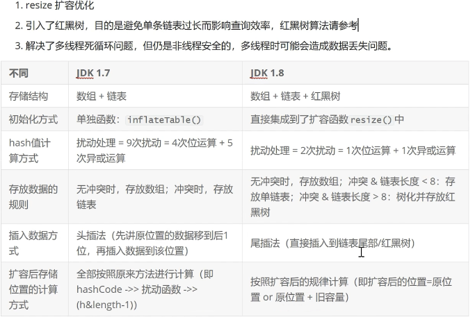

#### 集合

#### 1. HashMap 和 HashTable 

   1. 线程是否安全: hashMap 是非线程安全的，HashTable 是线程安全的，HashTable 内部方法基本都经过synchronized 修饰

   2. 效率方面: 因为是线程安全，hashMap 要比 hashTbale 效率高一些。 另外hashTable 基本被淘汰使用，不建议在代码中使用。 

   3. 对 null key 和 null value 的支持: hashMap 中，null 可以作为键，这样的键只有一个，可以有一个或多个键所对应的值为null, 但是在 
    hashtable 中，put 进的键只要有一个null ,直接抛异常 NullPointException
      
   4. 初始容量大小和每次扩容大小的不同: 
    
    1. 创建时，如果不指定容量初始值，hashtable 默认的初始化大小为11，之后每次扩容，容量变为原来的2n+1. hashmap 初始化大小为16， 之后每次扩容，容量变为原来的两倍。 

    2. 创建时，如果给定了容量的初始值，那么hashtable 会直接使用你给定的值，而hashmap 会将其扩充为2 的幂次方大小，也就是说hashmap 总是使用2 的幂作为哈希表的大小。 

   5. 数据结构方面: jdk1.8 以后hashmap 在解决哈希冲突时使用的是数组+链表+红黑树,以减少搜索时间， hashtable 没有这样的机制，使用的是 哈希表

#### 2. hashmap 1.7 和 1.8 

   1.7 : 底层是 数组+链表 结合，hashmap 通过key 的 hashcode 经过扰动函数处理得到hash 值，然后通过 (n-1) & hash 判断当前元素存放的位置(n 指的是数组长度), 
    如果当前位置存在元素的话，就判断该元素与要存入的元素的hash 值 以及key 是否相同，如果相同，直接覆盖，如果不相同 就加入链表（头插法）
    
    所谓扰动函数 指的就是 hashmap 的hash 方法.使用hash 方法也就是扰动函数是为了防止一些实现比较差的hashcode() 方法，换句话说就是为了减少哈希碰撞。 

   1.8: 底层使用的是 数组+链表+红黑树，目的是减少搜索时间. 红黑树就是为了解决二叉查找树的一些缺陷，因为二叉查找树在某些情况下会退化为链表。

#### 3. hashmap 1.7 和 1.8 有什么不同

#### 4. hashmap 加载因子为什么是 0.75 

   首先，如果加载因子比较大，那么扩容发生的频率就比较低，但是它浪费的空间比较小，不过发生hash 冲突的几率就比较大，比如加载因子是1的时候，如果hashmap 
   长度为128，那么可能hashmap 的时间存储元素数量在64 至128 直接的时间段比较多，而这个时间段发生的hash 冲突就比较大，造成数组中其中一条链表较长，就会影响性能。 

   而当加载因子比较小时，扩容的频率就会变高，因此会占用更多的空间，但是元素的存储就比较稀疏，发生哈希冲突的可能性就比较小，因为操作性能会比较高，
    比如如果设置0.5 ,同样 128 长度的hashmap ，当数量达到65 的时候就会触发 扩容，扩容后长度为256 。256 里只存储了65 个 就会有点浪费空间。 

   所以 综合了以上情况，取了一个 0.5 到 1 的一个平均数 0.75 作为 加载因子。 

#### 5. hashmap 底层为什么使用 红黑树 
    
   1. 红黑树 以一种二分查找树，但在每个节点增加一个存储位表示节点的颜色，可以是红或黑。通过对任何一条从根到叶子的路径上各个节点着色的方式的限制， 红黑树确保没有一条路径会比其它
    路径长两倍，因此，红黑树是一种弱平衡二叉树，相对于 要求严格的 avl 树来说，它的旋转次数少，所以对于搜索，插入，删除操较多的情况，通常使用红黑树。 
      
   性质: 

    1. 每个节点非红即黑。
    2. 根节点为黑
    3. 每个叶节点 都是黑的。
    4. 如果一个节点是红，则它的子节点必须是黑的。
    5. 对于任意节点而言，其他叶子节点树 null指针的每条路径都包含相同数目的黑节点。

   2. 平衡二叉树(avl 树)
    
    红黑树是在 avl 树的基础上提出来的。

    平衡二叉树又称 avl 树，是一种特殊的二叉排序树，其左右子树都是平衡二叉树，且左右子树高度之差的绝对值不超过1. 

   3. 红黑树 较 avl 树的优点: 

    avl 树是高度平衡的，频繁的插入和删除，会引起频繁的rebalance, 导致效率下降；红黑树不是高度平衡的，算是一种折中，插入最多两次旋转，删除做多三次旋转。

    所以红黑树在查找，插入删除的性能都是o(logn) ,且性能稳定，所以stl 里面很多结构包括map 底层实现都是使用红黑树。 

#### 6. hashmap 底层扩容是怎么实现的

    1. 判断当前容量大小是否为空，如果为空(未设置容量初始值)， 则把容量扩充为16 

    2. 获取 key 的hashcode ,对hashcode 进行扰动处理，计算出元素的下标。 

    3. 根据下标判断有无hash 碰撞，如果没有 则直接放入桶中。 

    4. 如果发送碰撞，比较两个 key 是否相同，相同则覆盖，不同则以链表的方式插入到尾部(尾插法)

    5. 如果 擦好人后链表的长度超过了 阈值(7), 则把链表转为红黑树。

    6. 插入成功后，如果元素个数达到阈值(size = 容量+ 阈值)，则执行扩容操作(容量最大为2 的 32 次方)

    7. 扩容成功后，对元素的下标进行重新计算。 

#### 7. ConcurrentHashMap 底层具体实现是什么？ 

   1.7: 
   
    1. 首先将数据分为一段一段存储，然后给每一段数据配一把锁，当一个线程占用锁访问其中一段数据时，其他段的数据也能被其他线程访问。

    2. ConcurrentHashMap 采用 segment + hashEntry 实现，一个 ConcurrentHashMap 里包含一个 segment 数组，segment 的结构和hashmap 类似
    ，是一种数组+链表结构，一个 segment 包含一个 hashEntry 数组，每个 hashEntry 是一个链表结构，每个 segment 守护着一个 hashEntry 数组里的元素，
    当对hashEntry 数组的数据进行修改时，必须首先获取对应的 segment 锁。

    3. 该类包含两个静态内部类 hashEntry 和 segment ，前者用来封装映射表的键值对，后者用来充当锁的角色。 

    4. segment 是一种 可重入锁 ReentrantLock ,每个 segment 守护一个 hashEntry 数组里的元素，当对 hashEetry 数组的数据进行修改时，必须先获得对应的 segment 锁。 

   1.8: 

    采用的是 node + cas + synchronized 来保证并发安全， synchronized 只锁定当前 链表或红黑树的首节点，这样只要 hash 不冲突，就不会产生并发，效率又提高n 倍。 

#### 8. java 集合 的快速失败机制 "fail-fast" 

    是java 中 一种错误检测机制，当多个线程对集合进行结构上的改变操作时，有可能产生 fail-fast 机制

    例如: 假设存在 两个线程(1,2), 线程1通过iterator 在遍历集合a 中的元素，在某个时候线程2 修改了集合 a 的结构，那么这个时候程序就会抛 异常，从而产生 fail-fast 机制。 

    原因: 迭代器在遍历时直接访问集合中的内容，并且在遍历过程中使用一个modCount 变量。集合在被遍历的期间，如果内容发送改变，就会改变 modCount 的值。
    每当迭代器使用 hashNext()/next() 遍历下一个元素之前，都会检测modCount 变量是否为 expectedmodcount 值，是的话就返回遍历，否则抛出异常，终止遍历。 

    解决办法: 
        1. 在遍历过程中，所有涉及到改变modcount 值的地方全部加锁。
        2. 使用 copyOnWriteArrayList 来替换 ArrayList。

#### HashMap 中的 hash 算法？这样的 hash 算法有什么好处(高低 16 位均参与运算)？如何寻址？

#### 使用 HashMap 会有哪些问题？(1.7 和 1.8 中有什么不同)如何解决？

#### Java 中有哪些线程安全的 Map?

#### ConcurrentHashMap 的实现原理？1.7 和 1.8 的区别？

#### ConcurrentHashMap 如何统计元素的个数？会有什么问题？

#### CucurrentHashMap 中 Node 节点是如何设计的？为什么要用 final 和 volatile 修饰 Node 节点的属性？有什么作用？

#### ConcurrentHashMap 是如何统计 size 的？

