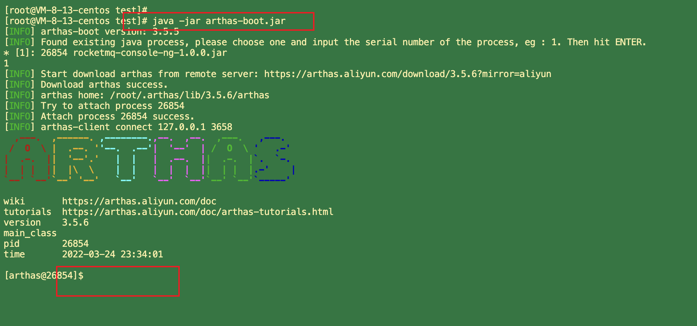
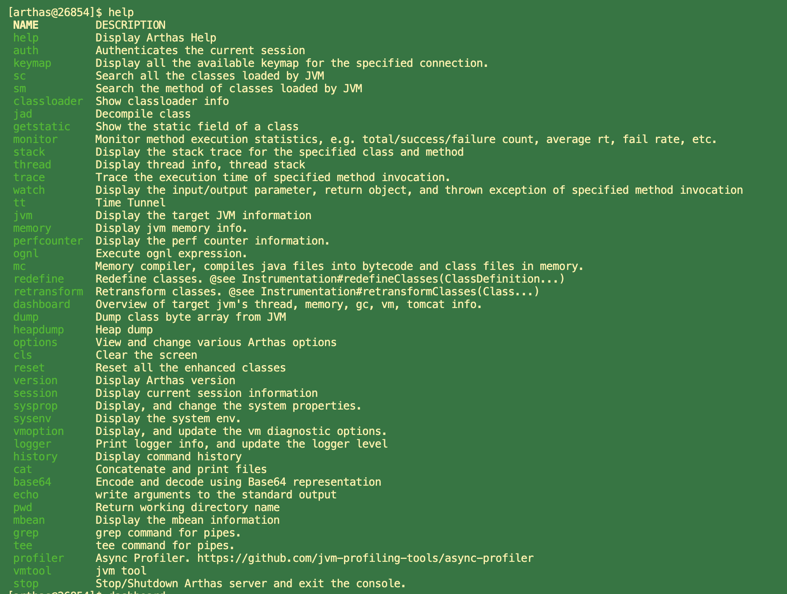
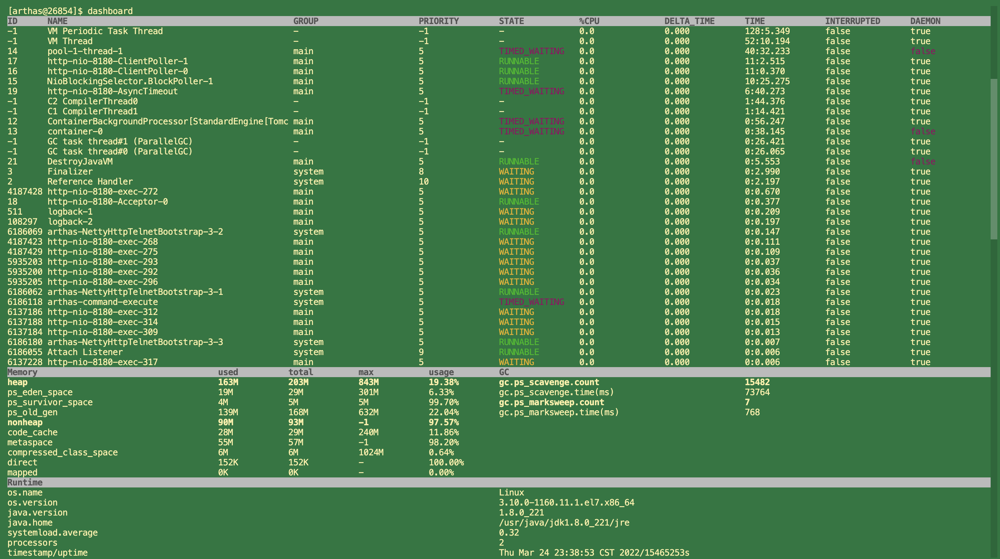
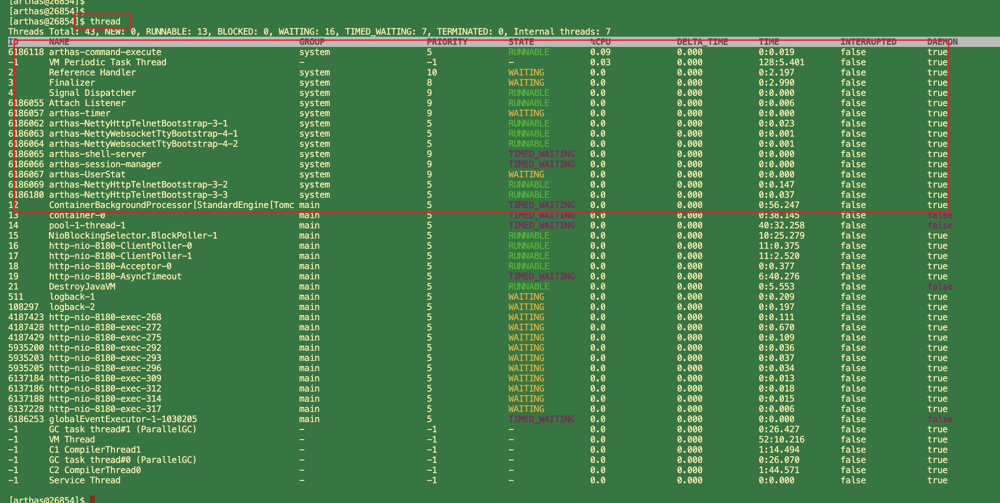
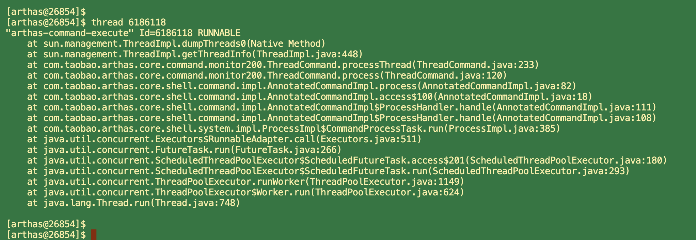
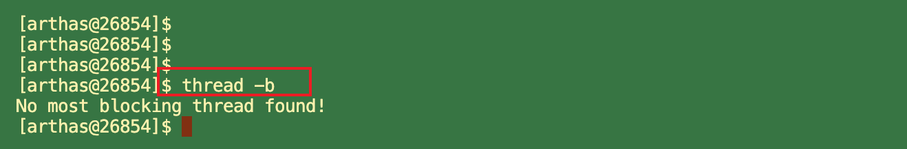

### 1. 阿里巴巴Arthas详解

   Arthas 是 Alibaba 在 2018 年 9 月开源的 Java 诊断工具。支持 JDK6+， 采用命令行交互模式，
   可以方便的定位和诊断 线上程序运行问题。Arthas 官方文档十分详细，
   
   详见: https://arthas.aliyun.com/doc/

### 2. Arthas使用

#### 2.1 下载 

```shell
#aliyun下载arthas
wget https://arthas.aliyun.com/arthas-boot.jar
```

#### 2.2 运行 

用java -jar运行即可，可以识别机器上所有Java进程(我们这里之前已经运行了一个Arthas测试程序，代码见下方)

```shell
java -jar arthas-boot.jar
```

   选择进程序号1，进入进程信息操作 (按 1 进入 具体进程)



#### 2.3 help

  输入 help 可查看所有命令 



#### 2.4 输入dashboard可以查看整个进程的运行情况，线程、内存、GC、运行环境信息:



#### 2.5 中断执行 ctrl+c 


#### 2.6 输入thread可以查看线程详细情况



##### 2.6.1 输入 thread加上线程ID 可以查看线程堆栈



##### 2.6.2 输入 thread -b 可以查看线程死锁



#### 3. 退出arthas
 
  如果只是退出当前的连接，可以用quit或者exit命令。Attach到目标进程上的arthas还会继续运行，端口会保持开放，下次连接时可以直接连接上。


  如果想完全退出arthas，可以执行stop命令。

  


   