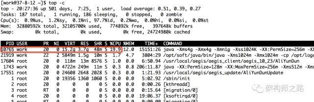
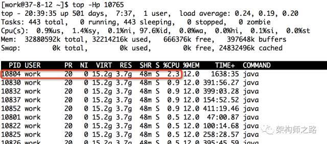
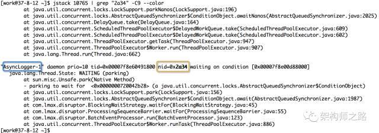

### Java服务，CPU100%问题如何快速定位？
  
  简要步骤如下：
  
  （1）找到最耗 CPU 的进程；
  
  （2）找到最耗 CPU 的线程；
  
  （3）查看堆栈，定位线程在干嘛，定位对应代码；
  
#### 步骤一、找到最耗 CPU 的进程

    工具：top
    
    方法：
    
    执行 top -c ，显示进程运行信息列表
    
    键入 P (大写 p)，进程按照 CPU 使用率排序
    
   
   
   如上图，最耗 CPU 的进程 PID 为 10765。
   
#### 步骤二：找到最耗 CPU 的线程
   
   工具：top
   
   方法：
   
   top -Hp 10765 ，显示一个进程的线程运行信息列表
   
   键入 P (大写 p)，线程按照 CPU 使用率排序
   
   
   
   如上图，进程 10765 内，最耗 CPU 的线程 PID 为 10804。
   
   
#### 步骤三：查看堆栈，定位线程在干嘛，定位对应代码

   首先，将线程 PID 转化为 16 进制。
   
   工具：printf
   
   方法：printf "%x\n" 10804
   
   
   
    如上图，10804 对应的 16 进制是 0x2a34，当然，这一步可以用计算器。
   
    之所以要转化为 16 进制，是因为堆栈里，线程 id 是用 16 进制表示的。
   
   
   接着，查看堆栈，找到线程在干嘛。
   
   工具：jstack
   
   方法：jstack 10765 | grep '0x2a34' -C5 --color
   
    打印进程堆栈
   
    通过线程 id，过滤得到线程堆栈
    
   
   
   如上图，找到了耗 CPU 高的线程对应的线程名称 “AsyncLogger-1”，以及看到了该线程正在执行代码的堆栈。
   最后，根据堆栈里的信息，找到对应的代码.
   
   
   
   
   