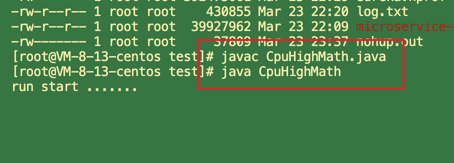

### 1. Java服务，CPU100%问题如何快速定位？
  
  简要步骤如下：
  
  （1）找到最耗 CPU 的进程；
  
  （2）找到最耗 CPU 的线程；
  
  （3）查看堆栈，定位线程在干嘛，定位对应代码；
  
#### 1.1 ``步骤一、找到最耗 CPU 的进程

    工具：top
    
    方法：
    
    执行 top -c ，显示进程运行信息列表
    
    键入 P (大写 p)，进程按照 CPU 使用率排序
    


   
   如上图，最耗 CPU 的进程 PID 为 10765。
   
#### 1.2 步骤二：找到最耗 CPU 的线程
   
   工具：top
   
   方法：
   
   top -Hp 10765 ，显示一个进程的线程运行信息列表
   
   键入 P (大写 p)，线程按照 CPU 使用率排序
   
   
   
   如上图，进程 10765 内，最耗 CPU 的线程 PID 为 10804。
   
   
#### 1.3 步骤三：查看堆栈，定位线程在干嘛，定位对应代码

   首先，将线程 PID 转化为 16 进制。
   
   工具：printf
   
   方法：printf "%x\n" 10804
   
   
   
    如上图，10804 对应的 16 进制是 0x2a34，当然，这一步可以用计算器。
   
    之所以要转化为 16 进制，是因为堆栈里，线程 id 是用 16 进制表示的。
   
   
   接着，查看堆栈，找到线程在干嘛。
   
   工具：jstack
   
   方法：jstack 10765 | grep '0x2a34' -C5 --color
   
    打印进程堆栈
   
    通过线程 id，过滤得到线程堆栈
    
   
   
   如上图，找到了耗 CPU 高的线程对应的线程名称 “AsyncLogger-1”，以及看到了该线程正在执行代码的堆栈。
   最后，根据堆栈里的信息，找到对应的代码.
   
#### 1.4 示例 

##### 1.4.1 程序 (不要带package 名，不然执行不了)
```java
/**
 *  cpu 飙高 程序
 */
public class CupHighMath {

    public static final int initData = 666;
    public static User user = new User();


    public int compute() { //一个方法对应一块栈帧内存区域
        int a = 1;
        int b = 2;
        int c = (a + b) * 10;
        return c;
    }

    public static void main(String[] args) {
        CupHighMath math = new CupHighMath();
        while (true) {
            math.compute();
        }
    }

}

```

##### 1.4.2 Linux 启动 (前提: 将CupHighMath 类源文件，上传至 linux 上)

```shell
javac CupHighMath.java 
java CupHighMath 
```



##### 1.4.3 使用 jps 找到 运行类的 进程id 

```shell
jps -l
```


##### 1.4.4 使用 top -p pid 显示java进程的内存情况，pid是java进程号

```shell
top -p 11253 
```


##### 1.4.5 按H，获取每个线程的内存情况


   如上图，进程 10765 内，最耗 CPU 的线程 PID 为 10804。

##### 1.4.6 找到内存和cpu占用最高的线程tid，比如 11254 

##### 1.4.7 转为十六进制得到 0x4cd0，此为线程id的十六进制表示

  首先，将线程 PID 转化为 16 进制。

  工具：printf

   方法：printf "%x\n" 11254

```shell
printf "%x\n" 11254
```


##### 1.4.8 执行 jstack 11253|grep -A 10 2bf6，得到线程堆栈信息中 4cd0 这个线程所在行的后面10行，从堆栈中可以发现导致cpu飙高的调 用方法

```shell
jstack 11253|grep -A 10 2bf6
```


##### 1.4.9 查看对应的堆栈信息找出可能存在问题的代码


### 2. 用jstack加进程id查找死锁

```java
package com.wlz.jvm;

/**
 *  死锁
 * @author wlz
 * @date 2022-03-23  11:52 下午
 */
public class DeadLockTest {

    private static Object lock1 = new Object();
    private static Object lock2 = new Object();

    public static void main(String[] args) {
        new Thread(() -> {
            synchronized (lock1) {
                try {
                    System.out.println("thread1 begin");
                    Thread.sleep(5000);
                }catch (InterruptedException e) {

                }
                synchronized (lock2) {
                    System.out.println("thread1 end");
                }
            }
        }).start();

        new Thread(() -> {
            synchronized (lock2) {
                try {
                    System.out.println("thread2 begin");
                    Thread.sleep(5000);
                }catch (InterruptedException e) {

                }
                synchronized (lock1) {
                    System.out.println("thread2 end");
                }
            }
        }).start();

        System.out.println("main thread end");

    }
}

```

```shell
jps -l 
jstack 50835
```

```shell
wlz@wlzdeMacBook-Pro Java_knowledge_system % jps
50834 Launcher
707 
50835 DeadLockTest
50854 Jps
31706 
wlz@wlzdeMacBook-Pro Java_knowledge_system % jstack 50835
```

  结果:

```
2022-03-23 23:55:33
Full thread dump OpenJDK 64-Bit Server VM (25.312-b07 mixed mode):

"Attach Listener" #14 daemon prio=9 os_prio=31 tid=0x0000000136130800 nid=0x5903 waiting on condition [0x0000000000000000]
   java.lang.Thread.State: RUNNABLE

"DestroyJavaVM" #13 prio=5 os_prio=31 tid=0x000000015600e800 nid=0x1603 waiting on condition [0x0000000000000000]
   java.lang.Thread.State: RUNNABLE

"Thread-1" #12 prio=5 os_prio=31 tid=0x0000000156086800 nid=0x5703 waiting for monitor entry [0x0000000172a3e000]
   java.lang.Thread.State: BLOCKED (on object monitor)
        at com.wlz.jvm.DeadLockTest.lambda$main$1(DeadLockTest.java:37)
        - waiting to lock <0x000000076ac264f0> (a java.lang.Object)
        - locked <0x000000076ac26500> (a java.lang.Object)
        at com.wlz.jvm.DeadLockTest$$Lambda$2/1096979270.run(Unknown Source)
        at java.lang.Thread.run(Thread.java:748)

"Thread-0" #11 prio=5 os_prio=31 tid=0x00000001608e0800 nid=0x5603 waiting for monitor entry [0x0000000172832000]
   java.lang.Thread.State: BLOCKED (on object monitor)
        at com.wlz.jvm.DeadLockTest.lambda$main$0(DeadLockTest.java:23)
        - waiting to lock <0x000000076ac26500> (a java.lang.Object)
        - locked <0x000000076ac264f0> (a java.lang.Object)
        at com.wlz.jvm.DeadLockTest$$Lambda$1/2003749087.run(Unknown Source)
        at java.lang.Thread.run(Thread.java:748)

"Service Thread" #10 daemon prio=9 os_prio=31 tid=0x0000000156061800 nid=0x3f03 runnable [0x0000000000000000]
   java.lang.Thread.State: RUNNABLE

"C1 CompilerThread3" #9 daemon prio=9 os_prio=31 tid=0x000000015701f800 nid=0x4103 waiting on condition [0x0000000000000000]
   java.lang.Thread.State: RUNNABLE

"C2 CompilerThread2" #8 daemon prio=9 os_prio=31 tid=0x000000016003b000 nid=0x3d03 waiting on condition [0x0000000000000000]
   java.lang.Thread.State: RUNNABLE

"C2 CompilerThread1" #7 daemon prio=9 os_prio=31 tid=0x000000016003a000 nid=0x4303 waiting on condition [0x0000000000000000]
   java.lang.Thread.State: RUNNABLE

"C2 CompilerThread0" #6 daemon prio=9 os_prio=31 tid=0x0000000160039800 nid=0x3b03 waiting on condition [0x0000000000000000]
   java.lang.Thread.State: RUNNABLE

"Monitor Ctrl-Break" #5 daemon prio=5 os_prio=31 tid=0x000000016081b000 nid=0x3903 runnable [0x00000001719de000]
   java.lang.Thread.State: RUNNABLE
        at java.net.SocketInputStream.socketRead0(Native Method)
        at java.net.SocketInputStream.socketRead(SocketInputStream.java:116)
        at java.net.SocketInputStream.read(SocketInputStream.java:171)
        at java.net.SocketInputStream.read(SocketInputStream.java:141)
        at sun.nio.cs.StreamDecoder.readBytes(StreamDecoder.java:284)
        at sun.nio.cs.StreamDecoder.implRead(StreamDecoder.java:326)
        at sun.nio.cs.StreamDecoder.read(StreamDecoder.java:178)
        - locked <0x000000076ac94678> (a java.io.InputStreamReader)
        at java.io.InputStreamReader.read(InputStreamReader.java:184)
        at java.io.BufferedReader.fill(BufferedReader.java:161)
        at java.io.BufferedReader.readLine(BufferedReader.java:324)
        - locked <0x000000076ac94678> (a java.io.InputStreamReader)
        at java.io.BufferedReader.readLine(BufferedReader.java:389)
        at com.intellij.rt.execution.application.AppMainV2$1.run(AppMainV2.java:47)

"Signal Dispatcher" #4 daemon prio=9 os_prio=31 tid=0x0000000160814000 nid=0x4403 runnable [0x0000000000000000]
   java.lang.Thread.State: RUNNABLE

"Finalizer" #3 daemon prio=8 os_prio=31 tid=0x0000000156813800 nid=0x4b03 in Object.wait() [0x0000000171422000]
   java.lang.Thread.State: WAITING (on object monitor)
        at java.lang.Object.wait(Native Method)
        - waiting on <0x000000076ab08ef0> (a java.lang.ref.ReferenceQueue$Lock)
        at java.lang.ref.ReferenceQueue.remove(ReferenceQueue.java:144)
        - locked <0x000000076ab08ef0> (a java.lang.ref.ReferenceQueue$Lock)
        at java.lang.ref.ReferenceQueue.remove(ReferenceQueue.java:165)
        at java.lang.ref.Finalizer$FinalizerThread.run(Finalizer.java:216)

"Reference Handler" #2 daemon prio=10 os_prio=31 tid=0x0000000156810800 nid=0x3003 in Object.wait() [0x0000000171216000]
   java.lang.Thread.State: WAITING (on object monitor)
        at java.lang.Object.wait(Native Method)
        - waiting on <0x000000076ab06c08> (a java.lang.ref.Reference$Lock)
        at java.lang.Object.wait(Object.java:502)
        at java.lang.ref.Reference.tryHandlePending(Reference.java:191)
        - locked <0x000000076ab06c08> (a java.lang.ref.Reference$Lock)
        at java.lang.ref.Reference$ReferenceHandler.run(Reference.java:153)

"VM Thread" os_prio=31 tid=0x000000015605b800 nid=0x2f03 runnable 

"ParGC Thread#0" os_prio=31 tid=0x0000000156010800 nid=0x2007 runnable 

"ParGC Thread#1" os_prio=31 tid=0x0000000156011000 nid=0x1e03 runnable 

"ParGC Thread#2" os_prio=31 tid=0x0000000160008800 nid=0x5403 runnable 

"ParGC Thread#3" os_prio=31 tid=0x000000015601c800 nid=0x5303 runnable 

"ParGC Thread#4" os_prio=31 tid=0x0000000160009000 nid=0x2c03 runnable 

"ParGC Thread#5" os_prio=31 tid=0x0000000160808800 nid=0x5003 runnable 

"ParGC Thread#6" os_prio=31 tid=0x0000000160809000 nid=0x2e03 runnable 

"ParGC Thread#7" os_prio=31 tid=0x000000015601d800 nid=0x4e03 runnable 

"VM Periodic Task Thread" os_prio=31 tid=0x0000000156062800 nid=0xa903 waiting on condition 

JNI global references: 320


Found one Java-level deadlock:
=============================
"Thread-1":
  waiting to lock monitor 0x00000001560614b0 (object 0x000000076ac264f0, a java.lang.Object),
  which is held by "Thread-0"
"Thread-0":
  waiting to lock monitor 0x000000015605ec20 (object 0x000000076ac26500, a java.lang.Object),
  which is held by "Thread-1"

Java stack information for the threads listed above:
===================================================
"Thread-1":
        at com.wlz.jvm.DeadLockTest.lambda$main$1(DeadLockTest.java:37)
        - waiting to lock <0x000000076ac264f0> (a java.lang.Object)
        - locked <0x000000076ac26500> (a java.lang.Object)
        at com.wlz.jvm.DeadLockTest$$Lambda$2/1096979270.run(Unknown Source)
        at java.lang.Thread.run(Thread.java:748)
"Thread-0":
        at com.wlz.jvm.DeadLockTest.lambda$main$0(DeadLockTest.java:23)
        - waiting to lock <0x000000076ac26500> (a java.lang.Object)
        - locked <0x000000076ac264f0> (a java.lang.Object)
        at com.wlz.jvm.DeadLockTest$$Lambda$1/2003749087.run(Unknown Source)
        at java.lang.Thread.run(Thread.java:748)

Found 1 deadlock.

```


### 3. 系统频繁full gc 导致系统卡顿原因分析 

#### 3.1 模拟分析 

##### 3.1.1 配置及gc 情况 

```
机器配置:2核4G
JVM内存大小:2G
系统运行时间:7天
期间发生的Full GC次数和耗时:500多次，200多秒 期间发生的Young GC次数和耗时:1万多次，500多秒
```

##### 3.1.2 初步分析 

  大致算下来每天会发生70多次Full GC，平均每小时3次，每次Full GC在400毫秒左右; 每天会发生1000多次Young GC，每分钟会发生1次，
  每次Young GC在50毫秒左右。

##### 3.1.3 jvm 参数设置如下: 

```
-Xms1536M
-Xmx1536M
-Xmn512M
-Xss512K
-XX:SurvivorRatio=6
-XX:MetaspaceSize=256M
-XX:MaxMetaspaceSize=256M
-XX:+UseParNewGC
-XX:+UseConcMarkSweepGC
-XX:CMSInitiatingOccupancyFraction=75
-XX:+UseCMSInitiatingOccupancyOnly
```


   结合对象挪动到老年代那些规则推理下我们这个程序可能存在的一些问题 经过分析感觉可能会由于对象动态年龄判断机制导致full gc较为频繁

#### 3.2 示例

##### 3.2.1 示例程序 

docs/jvm/jar/jvm-full-gc

####### 3.2.1.2 核心代码

```java
@RestController
public class IndexController {

    @RequestMapping("/user/process")
    public String processUserData() throws InterruptedException {
        ArrayList<User> users = queryUsers();

        for (User user: users) {
            //TODO 业务处理
            System.out.println("user:" + user.toString());
        }
        return "end";
    }

    /**
     * 模拟批量查询用户场景
     * @return
     */
    private ArrayList<User> queryUsers() {
        ArrayList<User> users = new ArrayList<>();
        for (int i = 0; i < 5000; i++) {
            users.add(new User(i,"zhuge"));
        }
        return users;
    }
}

public class User {

    private int id;
    private String name;

    byte[] a = new byte[1024*100];

    public User(){}

    public User(int id, String name) {
        super();
        this.id = id;
        this.name = name;
    }

    public int getId() {
        return id;
    }
    public void setId(int id) {
        this.id = id;
    }
    public String getName() {
        return name;
    }
    public void setName(String name) {
        this.name = name;
    }
}
```

####### 3.2.2 模拟请求

```java
@RunWith(SpringRunner.class)
@SpringBootTest(classes={Application.class})// 指定启动类
public class ApplicationTests {

    @Bean
    public RestTemplate restTemplate() {
        return new RestTemplate();
    }

    @Autowired
    private RestTemplate restTemplate;

    @Test
    public void test() throws Exception {
        for (int i = 0; i < 10000; i++) {
            String result = restTemplate.getForObject("http://localhost:8080/user/process", String.class);
            Thread.sleep(1000);
        }
    }

}
```

##### 3.2.2 配置参数 启动程序， 由于是springboot 项目 直接idea 启动即可 

```shell
-Xms1536M -Xmx1536M -Xmn512M -Xss512K -XX:SurvivorRatio=6 -XX:MetaspaceSize=256M -XX:MaxMetaspaceSize=256M
-XX:+UseParNewGC -XX:+UseConcMarkSweepGC -XX:CMSInitiatingOccupancyFraction=75 -XX:+UseCMSInitiatingOccupancyOnly
```

##### 3.2.3 打印 jstat gc 情况 

```shell
jstat -gc 58043 2000 10000
```


##### 3.2.4 对于对象动态年龄判断机制导致的full gc较为频繁可以先试着优化下JVM参数，把年轻代适当调大点:

```shell
-Xms1536M -Xmx1536M -Xmn1024M -Xss512K -XX:SurvivorRatio=6 -XX:MetaspaceSize=256M -XX:MaxMetaspaceSize=256M
-XX:+UseParNewGC -XX:+UseConcMarkSweepGC -XX:CMSInitiatingOccupancyFraction=75 -XX:+UseCMSInitiatingOccupancyOnly
```


  优化完发现没什么变化，full gc的次数比minor gc的次数还多了


##### 3.2.5 我们可以推测下full gc比minor gc还多的原因有哪些?

    1、元空间不够导致的多余full gc
    
    2、显示调用System.gc()造成多余的full gc，这种一般线上尽量通过­XX:+DisableExplicitGC参数禁用，如果加上了这个JVM启动参数，那 么代码中调用System.gc()没有任何效果
    
    3、老年代空间分配担保机制

##### 3.2.6 推测 

   分析完这些我们推测的原因以及优化后，我们发现young gc和full gc依然很频繁了，而且看到有大量的对象频繁的被挪动到老年代，
   这种情况我们可以借助jmap命令大概看下是什么对象

##### 3.2.7 jmap 

```shell
jps -l 
jmap -histo 58292 
```


  查到了有大量User对象产生，这个可能是问题所在，但还是不确定，还必须找到对应的代码确认，如何去找对应的代码了?

##### 3.2.8 代码分析 

  1、代码里全文搜索生成User对象的地方(适合只有少数几处地方的情况) 
  
  2、如果生成User对象的地方太多，无法定位具体代码，我们可以同时分析下占用cpu较高的线程，一般有大量对象不断产生，对应的方法 代码肯定会被频繁调用，占用的cpu必然较高

  可以用上面讲过的jstack或jvisualvm来定位cpu使用较高的代码，最终定位到的代码如下:


   同时，java的代码也是需要优化的，一次查询出500M的对象出来，明显不合适，要根据之前说的各种原则尽量优化到合适的值，
   尽量消除这种朝生夕死的对象导致的full gc

##### 3.2.9 优化代码


##### 3.2.10  再次 打印 jstat gc 情况

```shell
jps -l 
jstat -gc 58043 2000 10000
```


  发现 现在很少 full gc了，几乎没有，minor gc 也不频繁了， 其实还可以再优化，将 500 改为 100 或者更小等。

##### 3.2.11  思考 

  这里还只是 模拟循环去请求，如果是 并发请求的话，比如 每秒 1万，10万 的请求 这些就得具体去分析，优化代码了。

### 4. 内存泄露到底是怎么回事？ 

   一般电商架构可能会使用多级缓存架构，就是redis加上JVM级缓存，大多数同学可能为了图方便对于JVM级缓存就 简单使用一个hashmap，
   于是不断往里面放缓存数据，但是很少考虑这个map的容量问题，结果这个缓存map越来越大，一直占用着老 年代的很多空间，
   时间长了就会导致full gc非常频繁，这就是一种内存泄漏，对于一些老旧数据没有及时清理导致一直占用着宝贵的内存 资源，时间长了除了导致full gc，
   还有可能导致OOM。 这种情况完全可以考虑采用一些成熟的JVM级缓存框架来解决，比如ehcache等自带一些LRU数据淘汰算法的框架来作为JVM级的缓存。

   
### 5. JVM运行情况预估 

   用 jstat gc -pid 命令可以计算出如下一些关键数据，有了这些数据就可以采用之前介绍过的优化思路，先给自己的系统设置一些初始性的 JVM参数，比如堆内存大小，年轻代大小，Eden和Survivor的比例，老年代的大小，大对象的阈值，大龄对象进入老年代的阈值等。 

#### 5.1 年轻代对象增长的速率 
   
   可以执行命令 jstat -gc pid 1000 10 (每隔1秒执行1次命令，共执行10次)，通过观察EU(eden区的使用)来估算每秒eden大概新增多少对 象，如果系统负载不高，可以把频率1秒换成1分钟，甚至10分钟来观察整体情况。注意，一般系统可能有高峰期和日常期，所以需要在不 同的时间分别估算不同情况下对象增长速率。
   
#### 5.2 Young GC的触发频率和每次耗时 
   
   知道年轻代对象增长速率我们就能推根据eden区的大小推算出Young GC大概多久触发一次，Young GC的平均耗时可以通过 YGCT/YGC 公式算出，根据结果我们大概就能知道系统大概多久会因为Young GC的执行而卡顿多久。

#### 5.3 每次Young GC后有多少对象存活和进入老年代 
   
   这个因为之前已经大概知道Young GC的频率，假设是每5分钟一次，那么可以执行命令 jstat -gc pid 300000 10 ，观察每次结果eden， survivor和老年代使用的变化情况，在每次gc后eden区使用一般会大幅减少，survivor和老年代都有可能增长，这些增长的对象就是每次 Young GC后存活的对象，同时还可以看出每次Young GC后进去老年代大概多少对象，从而可以推算出老年代对象增长速率。 

#### 5.4 Full GC的触发频率和每次耗时 

知道了老年代对象的增长速率就可以推算出Full GC的触发频率了，Full GC的每次耗时可以用公式 FGCT/FGC 计算得出。 

#### 5.5 优化思路
   
   其实简单来说就是尽量让每次Young GC后的存活对象小于Survivor区域的50%，都留存在年轻代里。尽量别让对象进入老年 代。尽量减少Full GC的频率，避免频繁Full GC对JVM性能的影响。
   


