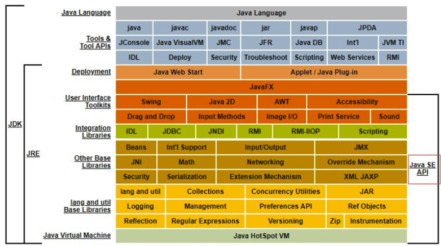
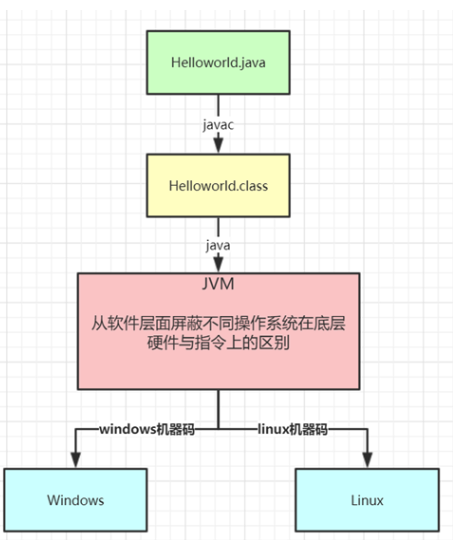
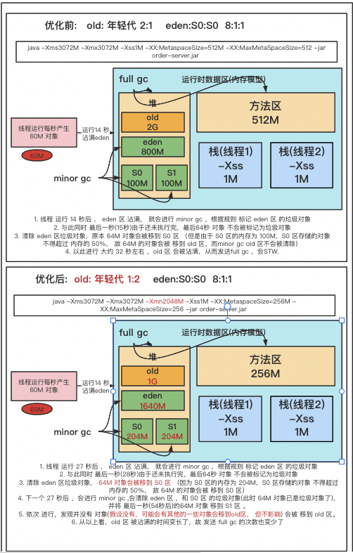

### 1. JDK  体系结构



### 2. java 跨平台特性



### 3. JVM 整体结构及内存模型

#### 3.1 内存模型


#### 3.2 jvm 内存参数设置


  Spring Boot程序的JVM参数设置格式(Tomcat启动直接加在bin目录下catalina.sh文件里):

```
java ‐Xms2048M ‐Xmx2048M ‐Xmn1024M ‐Xss512K ‐XX:MetaspaceSize=256M ‐XX:MaxMetaspaceSize=256M ‐jar demo‐server.jar
```   

关于元空间的JVM参数有两个：-XX:MetaspaceSize=N和 -XX:MaxMetaspaceSize=N

-XX：MaxMetaspaceSize： 设置元空间最大值， 默认是-1， 即不限制， 或者说只受限于本地内存大小。

-XX：MetaspaceSize： 指定元空间触发Fullgc的初始阈值(元空间无固定初始大小)， 以字节为单位，默认是21M，达到该值就会触发 full gc进行类型卸载， 同时收集器会对该值进行调整：
如果释放了大量的空间， 就适当降低该值； 如果释放了很少的空间， 那么在不超过-XX：MaxMetaspaceSize（如果设置了的话） 的情况下， 适当提高该值。这个跟早期jdk版本的-XX:PermSize参数意思不一样，- XX:PermSize代表永久代的初始容量。

XX:PermSize代表永久代的初始容量。

由于调整元空间的大小需要Full GC，这是非常昂贵的操作，如果应用在启动的时候发生大量Full GC，通常都是由于永久代或元空间发生 了大小调整，基于这种情况，一般建议在JVM参数中将MetaspaceSize和MaxMetaspaceSize设置成一样的值，并设置得比初始值要大， 对于8G物理内存的机器来说，
一般我会将这两个值都设置为256M。

#### 3.3 StackOverflowError示例:

```java
package com.wlz.jmm;

/**
 * 栈溢出 示例
 *   redo 方法不停的调用，就会不停的创建栈桢，
 * 每个线程栈默认分配的内存大小为 1m
 *
 *  -Xss256k
 *
 *  -Xss设置越小count值越小，说明一个线程栈里能分配的栈帧就越少，但是对JVM整体来说能开启的线程数会更多
 *
 */
public class StackOverflowTset {

    static int count = 0;

    static void redo() {

        count++;
        redo();
    }

    public static void main(String[] args) {
        try {
            redo();
        } catch (Throwable t) {
            t.printStackTrace();
            System.out.println(count);
        }
    }
}
```

#### 3.4 jvm 内存参数大小如何设置 示例 

  日均百万级订单交易系统如何设置JVM参数





  结论:通过上面这些内容介绍，大家应该对JVM优化有些概念了，就是尽可能让对象都在新生代里分配和回收，尽量别 让太多对象频繁进入老年代，避免频繁对老年代进行垃圾回收，同时给系统充足的内存大小，避免新生代频繁的进行垃 圾回收。

   