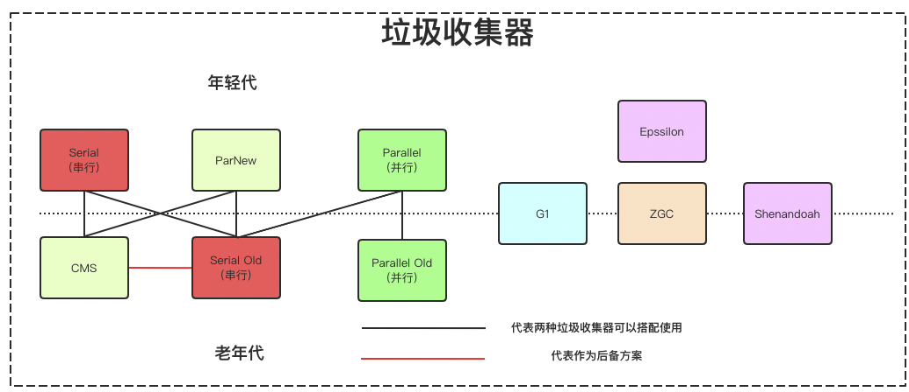
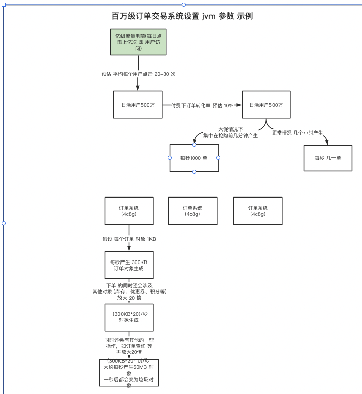
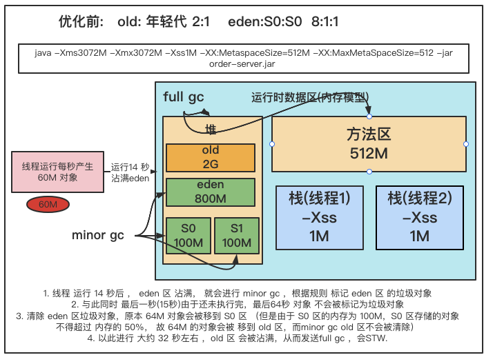
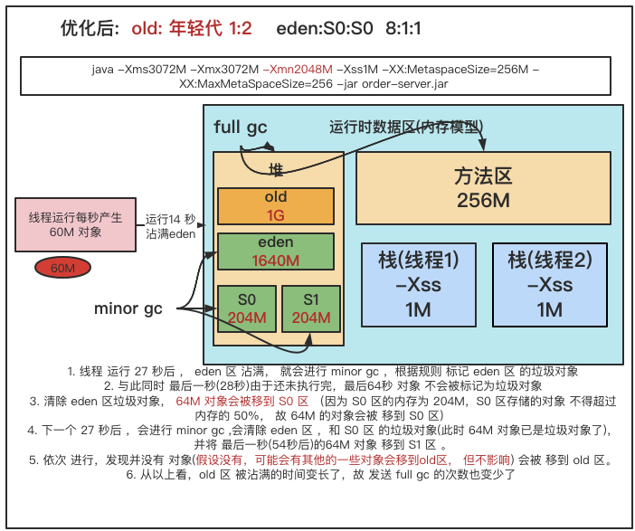
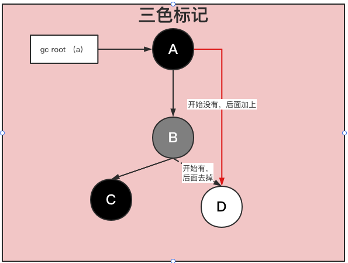

### jvm 垃圾收集
   
#### 1.垃圾收集算法
   
  

##### 1.1 分代收集理论
   
   目前虚拟机的垃圾收集都采用分代收集算法,主要是根据对象存活周期的不同将内存划分为几块不同区域，一般将堆分为年轻(新生)代和老年代, 这样就可以根据不同年代的特点使用不同的算法
   
   比如:年轻代中,每次收集都会有大量对象死去,所以可使用复制算法，将少量的对象复制出去就可以完成垃圾收集。老年代中,对象的存活率是比较高的，而且也没有额外的空间进行分配担保，所以
   需要选择 "标记-清除" 或 "标记-整理" 算法。 
   
   注意: "标记-清除" 或 "标记-整理" 算法会比复制算法慢10倍以上。
   
##### 1.2 复制算法
   
   为了解决效率问题，“复制”收集算法出现了。它可以将内存分为大小相同的两块，每次使用其中的一块。
   当这一块的 内存使用完后，就将还存活的对象复制到另一块去，然后再把使用的空间一次清理掉。这样就使每次的内存回收都是对 内存区间的一半进行回收。
   
   优点：每次都是对整个半区进行内存回收，内存分配时也就不用考虑内存碎片等复杂情况，只要移动堆顶指针，按顺序分配内存即可，实现简单，运行高效。
   
   缺点：算法的代价是将内存缩小为了原来的一半，未免太高了一点。
   
   
   
##### 1.3 标记-清除算法
   
   算法分为“标记”和“清除”两阶段：标记存活的对象， 统一回收所有未被标记的对象(一般选择这种)；也可以反过来，标 记出所有需要回收的对象，在标记完成后统一回收所有被标记的对象 。
   
   它是最基础的收集算法，比较简单，但是会带来 两个明显的问题： 
    
    1. 效率问题 (如果需要标记的对象太多，效率不高) 
    
    2. 空间问题（标记清除后会产生大量不连续的碎片）
   
   
   
##### 1.4 标记-整理算法
   
  根据老年代的特点推出的一种标记算法，标记过程仍然与“标记-清除”算法一样，但后续步骤不是直接对可回收对象回收，而是让所有存活的对象向一端移动，
  然后直接清理掉端边界以外的内存。
   
  

#### 2. 垃圾收集器
  
  垃圾收集算法只是内存回收的方法论，垃圾收集器才是内存回收的具体实现.
  
  目前为止,没有哪一种垃圾收集器是最合适的，只有不同应用场景下适用不同的垃圾收集器。
    
   
   
##### 2.1 Serial (串行)收集器(-XX:+UseSerialGC -XX:+UseSerialOldGC)
   
   Serial 收集器是最基本，时间最长的垃圾收集器，它是一个单线程收集器，它的"单线程" 的意义不仅仅意味着它只会适用一个垃圾收集线程去完成垃圾收集工作，
   更重要的是它再进行收集的过程中，必须暂停其他所有的工作线程(Stop The World -STW)，直到收集结束.
   
   年轻代采用复制算法,老年代采用标记-整理算法.
   
   
   
   Serial 优于其他垃圾收集器的地方就是*简单而高效(和其他收集器的单线程相比)*,因为没有线程交互的开销，所以可以获得很高的单线程手机效率.
   
   Serial Old 是Serial 的老年代版本,同样是一个单线程收集器，主要的两大用途为: 在JDK1.5及以前的版本与Parallel 搭配使用 和 作为CMS 的后备方案.
   
##### 2.2 Parallel Scavenge (并行) 收集器(-XX:+UseParallelGC ,-XX:+UseParallelOldGC)
   
   Parallel 是 Serial 的多线程版本,除了使用多线程进行垃圾收集，其余行为(控制参数、收集算法、回收算法等)，和Serial 类似。
   它的默认收集线程数跟cpu核数相同，但是也可以用参数(-XX:ParallelGCThreads)指定收集线程数，一般不推荐修改。
   
   Parallel 关注的是吞吐量(高效率的利用CPU). CMS 等其他垃圾收集器关注更多的是用户线程的停顿时间(主要为了提高用户体验)。吞吐量就是CPU中用于运行用户代码的时间与CPU总消耗时间的比值.
   
   年轻代采用复制算法，老年代采用标记-整理算法
   
   
   
   Parallel Old 是 Parallel Scavenge 的老年代版本, 在注重吞吐量以及CPU资源的场合，都可以优先考虑Parallel 和Parallel Old (是JDK8 默认的新生代和老年代收集器)
   
##### 2.3 ParNew 收集器(-XX:+UseParNewGC)
   
   ParNew  是Serial 的多线程版本, 是一个新生代收集器。除了使用多线程进行垃圾收集外，其余行为(控制参数、收集算法(复制算法)、STW、对象分配
   规则、回收策略等与Serial 完全相同)
   
   年轻代采用复制算法,老年代采用标记-整理算法.
   
   
   
   是许多运行在Server模式下的虚拟机的首要选择，除了Serial 外，只有它能与CMS 收集器配合工作。
   
##### 2.4 CMS 收集器(-XX:+UseConcMarkSweepGC(old))
   
   CMS(Concurrent Mark Sweep) 收集器是一种以获取最短回收停顿时间为目标的收集器。非常符合在注重用户体验的应用上使用，是HotSpot
   第一款真正意义上的并发收集器,也是第一次实现了让垃圾收集线程与用户线程(基本上)同时工作。
   
   CMS 采用的是 *标记-清除*算法实现, 它的运作过程相比于其他的垃圾收集器来说更加复杂一些，主要步骤为:
   
    初始标记: 暂停所以的其他线程(STW),并记录gc roots 直接能引用的对象，速度很快.
    
    并发标记: 并发标记阶段就是从GC Roots的直接关联对象开始遍历整个对象图的过程， 这个过程耗时较长但是不需要停顿用户线程， 
            可以与垃圾收集线程一起并发运行。因为用户程序继续运行，可能会有导致已经标记过的对象状态发生改变。
    
    重新标记: 重新标记阶段就是为了修正并发标记期间因为用户程序继续运行而导致标记产生变动的那一部分对 象的标记记录，这个阶段的停顿时间一般会比初始标记阶段的时间稍长，远远比并发标记阶段时间短。
            主要用到三 色标记里的增量更新算法做重新标记。
   
    并发清理： 开启用户线程，同时GC线程开始对未标记的区域做清扫。这个阶段如果有新增对象会被标记为黑色不做任何处理.
    
    并发重置： 重置本次GC过程中的标记数据。
    
   
   
   优点: 并发收集、低停顿
   
   缺点: 
    
    对CPU资源敏感(会抢占服务资源); 
    
    无法处理*浮动垃圾*(并发标记和并发清理阶段又产生的垃圾，只有下一次gc才会清理); 
    
    因为使用 "标记-清除"算法,所以会有大量的空间碎片，不过可以通过参数 - XX:+UseCMSCompactAtFullCollection 在执行完清除后再做整理
   
    执行过程不确定性,会存在上一次垃圾回收还没执行完，又会触发垃圾回收的情况,特别是在并发标记和并发清理阶段，系统一边回收一边运行，
    还没回收玩又触发full gc,也就是"concurrent mode failure"，此时会进入STO，用serial old垃圾收集器来回收
   
   CMS相关核心参数
    
    1. -XX:+UseConcMarkSweepGC：启用cms 
    
    2. -XX:ConcGCThreads：并发的GC线程数 
    
    3. -XX:+UseCMSCompactAtFullCollection：FullGC之后做压缩整理（减少碎片） 
    
    4. -XX:CMSFullGCsBeforeCompaction：多少次FullGC之后压缩一次，默认是0，代表每次FullGC后都会压缩一次
    
    5. -XX:CMSInitiatingOccupancyFraction: 当老年代使用达到该比例时会触发FullGC（默认是92，这是百分比） 
    
    6. -XX:+UseCMSInitiatingOccupancyOnly：只使用设定的回收阈值(-XX:CMSInitiatingOccupancyFraction设定的值)，如果不指定，JVM仅在第一次使用设定值，后续则会自动调整 
    
    7. -XX:+CMSScavengeBeforeRemark：在CMS GC前启动一次minor gc，目的在于减少老年代对年轻代的引 用，降低CMS GC的标记阶段时的开销，一般CMS的GC耗时 80%都在标记阶段 
    
    8. -XX:+CMSParallellnitialMarkEnabled：表示在初始标记的时候多线程执行，缩短STW 
    
    9. -XX:+CMSParallelRemarkEnabled：在重新标记的时候多线程执行，缩短STW;

###### 2.4.1 亿级流量系统如何优化JVM参数设置(ParNew+CMS)



  对于8G内存，一般是分配4G内存给jvm,正常的JVM 参数配置如下: 

```xml 
‐Xms3072M ‐Xmx3072M ‐Xss1M ‐XX:MetaspaceSize=256M ‐XX:MaxMetaspaceSize=256M ‐XX:SurvivorRatio=8
```

   但是 这样设计可能会 由于 动态对象年龄判断原则，导致频繁full gc。 



   更新jvm 配置 

```xml
‐Xms3072M ‐Xmx3072M ‐Xmn2048M ‐Xss1M ‐XX:MetaspaceSize=256M ‐XX:MaxMetaspaceSize=256M ‐XX:SurvivorRatio=8
```




   这样就降低了因为对象动态年龄判断原则导致的对象频繁进入老年代的问题，其实很多优化无非就是让短期存活的对象 尽量都留在survivor里，
   不要进入老年代，这样在minor gc的时候这些对象都会被回收，不会进到老年代从而导致full gc。

   对于对象年龄应该为多少才移动到老年代比较合适，本例中一次minor gc要间隔二三十秒，大多数对象一般在几秒内就 会变为垃圾，
   完全可以将默认的15岁改小一点，比如改为5，那么意味着对象要经过5次minor gc才会进入老年代，整个 时间也有一两分钟了，
   如果对象这么长时间都没被回收，完全可以认为这些对象是会存活的比较长的对象，可以移动到 老年代，而不是继续一直占用survivor区空间。 
   
   对于多大的对象直接进入老年代(参数-XX:PretenureSizeThreshold)，这个一般可以结合你自己系统看下有没有什么大对象 生成，
   预估下大对象的大小，一般来说设置为1M就差不多了，很少有超过1M的大对象，这些对象一般就是你系统初始 化分配的缓存对象，
   比如大的缓存List，Map之类的对象。

   可以适当调整JVM参数如下:

```xml
‐Xms3072M ‐Xmx3072M ‐Xmn2048M ‐Xss1M ‐XX:MetaspaceSize=256M ‐XX:MaxMetaspaceSize=256M ‐XX:SurvivorRatio=8 2 ‐XX:MaxTenuringThreshold=5‐XX:PretenureSizeThreshold=1M
```

   对于JDK8默认的垃圾回收器是-XX:+UseParallelGC(年轻代)和-XX:+UseParallelOldGC(老年代)，
   如果内存较大(超过4个G，只是经验值)，系统对停顿时间比较敏感，我们可以使用ParNew+CMS(-XX:+UseParNewGC -XX:+UseConcMarkSweepGC) 
   对于老年代CMS的参数如何设置我们可以思考下，首先我们想下当前这个系统有哪些对象可能会长期存活躲过5次以上 minor gc最终进入老年代。
   
   无非就是那些Spring容器里的Bean，线程池对象，一些初始化缓存数据对象等，这些加起来充其量也就几十MB。 还有就是某次minor gc完了之后还有超过
   一两百M的对象存活，那么就会直接进入老年代，比如突然某一秒瞬间要处理 五六百单，那么每秒生成的对象可能有一百多M，再加上整个系统可能压力剧增，
   一个订单要好几秒才能处理完，下一秒 可能又有很多订单过来。 
   
   我们可以估算下大概每隔五六分钟出现一次这样的情况，那么大概半小时到一小时之间就可能因为老年代满了触发一次 Full GC，
   Full GC的触发条件还有我们之前说过的*老年代空间分配担保机制*，历次的minor gc挪动到老年代的对象大小 肯定是非常小的，
   所以几乎不会在minor gc触发之前由于老年代空间分配担保失败而产生full gc，其实在半小时后发生 full gc，这时候已经过了抢购的最高峰期，
   后续可能几小时才做一次FullGC。 对于碎片整理，因为都是1小时或几小时才做一次FullGC，是可以每做完一次就开始碎片整理，
   或者两到三次之后再做一 次也行。

   所以，只要年轻代参数设置合理，老年代CMS的参数设置基本都可以用默认值，如下所示:

```xml
‐Xms3072M ‐Xmx3072M ‐Xmn2048M ‐Xss1M ‐XX:MetaspaceSize=256M ‐XX:MaxMetaspaceSize=256M ‐XX:SurvivorRatio=8
‐XX:MaxTenuringThreshold=5‐XX:PretenureSizeThreshold=1M‐XX:+UseParNewGC‐XX:+UseConcMarkSweepGC
‐XX:CMSInitiatingOccupancyFraction=92‐XX:+UseCMSCompactAtFullCollection‐XX:CMSFullGCsBeforeCompaction=0
 
```

#### 3. 垃圾收集器底层算法实现

##### 3.1 三色标记
   
   在并发过标记程中，标记期间应用线程还在继续执行，对象间的引用可能还会发送变化，所以会有多标和漏标情况发生。

   所以引入了 *三色标记* ，把GCRoot 可达性分析遍历对象过程中遇到的对象，按照 "是否访问过" 这个条件来标记成三种颜色：

   *黑色*： 表示*对象已经被垃圾收集器访问* , 且这个对象的所有引用都已经扫描过。黑色的对象代表已经扫描过，它是安全存活的，如果有其他对象引用指向黑色对象，无须重新再扫描一遍。黑色对象不能直接（不经过灰色对象）指向某个白色对象

   *灰色*： 表示 *对象已经被垃圾收集器访问过*，但是这个对象上至少存在一个引用还没有被扫描过。

   *白色*： 表示 *对象还未被垃圾收集器访问过*， 主要显示在可达性分析开始阶段，所有的对象都是白色。如果在分析结束的阶段，仍是白色对象，即表示不可达



###### 3.1.1 示例 

```java
package com.wlz.jvm.three;

/**
 *  三色标记
 * @author wlz
 * @date 2022-03-22  8:03 下午
 */
public class ThreeColorRemark {

    public static void main(String[] args) {
        A a = new A();
        D d = a.b.d;   // 1. 读
        a.b.d = null;  // 2. 写
        a.d = d;       // 3. 写
    }

}
class A {
    B b = new B();
    D d = null;
}
class B {
    C c = new C();
    D d = new D();
}
class C {
}
class D {
}
```

##### 3.2 多标-浮动垃圾
   
   在并发标记过程中，如果由于方法运行结束导致部分局部变量(gcroot)被销毁，这个gcroot引用的对象之前又被扫描过 (被标记为非垃圾对象)，、
   那么本轮GC不会回收这部分内存。这部分本应该回收但是没有回收到的内存，被称之为“浮动 垃圾”。
   浮动垃圾并不会影响垃圾回收的正确性，只是需要等到下一轮垃圾回收中才被清除。 另外，针对并发标记(还有并发清理)开始后产生的新对象，
   通常的做法是直接全部当成黑色，本轮不会进行清除。这部分 对象期间可能也会变为垃圾，这也算是浮动垃圾的一部分。

##### 3.3 漏标-读写屏障 

   漏标会导致被引用的对象被当成垃圾误删除，这是严重bug，必须解决，有两种解决方案： 增量更新（Incremental Update） 和原始快照（Snapshot At The Beginning，SATB） 。 
      
      1）增量更新： 就是当黑色对象插入新的指向白色对象的引用关系时， 就将这个新插入的引用记录下来， 等并发扫描结束之后， 
      再将这些记录过的引用关系中的黑色对象为根， 重新扫描一次。 这可以简化理解为，* 黑色对象一旦新插入了指向 白色对象的引用之后， 
      它就变回灰色对象了。 *

      2)原始快照: 就是当灰色对象要删除指向白色对象的引用关系时， 就将这个要删除的引用记录下来， 在并发扫描结束之后， 
      再将这些记录过的引用关系中的灰色对象为根， 重新扫描一次，这样就能扫描到白色的对象，
      将白色对象直接标记为黑色(目的就是让这种对象在本轮gc清理中能存活下来，待下一轮gc的时候重新扫描，这个对象也有可能是浮动垃圾)
      以上无论是对引用关系记录的插入还是删除， 虚拟机的记录操作都是通过写屏障实现的。


##### 3.4 读写屏障
   
   现代追踪式（可达性分析）的垃圾回收器几乎都借鉴了三色标记的算法思想，尽管实现的方式不尽相同：比如白色/黑色 集合一般都不会出现（但是有其他体现颜色的地方）、灰色集合可以通过栈/队列/缓存日志等方式进行实现、遍历方式可 以是广度/深度遍历等等。 
   
   对于读写屏障，以Java HotSpot VM为例，其并发标记时对漏标的处理方案如下： 
   
      CMS：写屏障 + 增量更新 
      
      G1：写屏障 + SATB 
      
      ZGC：读屏障 
      
      工程实现中，读写屏障还有其他功能，比如写屏障可以用于记录跨代/区引用的变化，读屏障可以用于支持移动对象的并 发执行等。功能之外，
      还有性能的考虑，所以对于选择哪种，每款垃圾回收器都有自己的想法。 

###### 3.4.1 写屏障

   给某个对象的成员变量赋值时，其底层代码大概长这样:

```c++
/**
* @param field 某对象的成员变量，如 a.b.d
* @param new_value 新值，如 null
*/
void oop_field_store(oop* field,oop new_value){
  *field = new_value; // 赋值操作
7}
```

   所谓的写屏障，其实就是指在赋值操作前后，加入一些处理(可以参考AOP的概念):

```c++
void oop_field_store(oop* field,oop new_value){
   pre_write_barrier(field); // 写屏障‐写前操作 SATB 是在写屏障中触发
   *field = new_value;
   post_write_barrier(field, value); // 写屏障‐写后操作    增量更新是在写屏障后触发
}
```

   写屏障实现SATB
   
    当对象B的成员变量的引用发生变化时，比如引用消失(a.b.d = null)，我们可以利用写屏障，将B原来成员变量的引用 对象D记录下来:

```c++
void pre_write_barrier(oop* field){
   oop old_value = *field; // 获取旧值
   remark_set.add(old_value); // 记录原来的引用对象
}
```

   写屏障实现增量更新
   
      当对象A的成员变量的引用发生变化时，比如新增引用(a.d = d)，我们可以利用写屏障，将A新的成员变量引用对象D 记录下来:

```c++
void post_write_barrier(oop* field,oopnew_value){ 
   remark_set.add(new_value); // 记录新引用的对象
}
```

###### 3.4.2 读屏障

```c++
oop oop_field_load(oop* field){
   pre_load_barrier(field); // 读屏障‐读取前操作
   return *field; 
}
```

   读屏障是直接针对第一步:D d = a.b.d，当读取成员变量时，一律记录下来:

```c++
void pre_load_barrier(oop* field){
   oop old_value = *field;
   remark_set.add(old_value); // 记录读取到的对象
}
```

   
##### 3.5 为什么G1用SATB？CMS用增量更新？ 

   SATB相对增量更新效率会高(当然SATB可能造成更多的浮动垃圾)，因为不需要在重新标记阶段再次深度扫描 被删除引用对象，
   
   而CMS对增量引用的根对象会做深度扫描，G1因为很多对象都位于不同的region，CMS就一块老年代区域，重新深度扫描对象的话G1的代价会比CMS高，
   所以G1选择SATB不深度扫描对象，只是简单标记，等到下一轮GC 再深度扫描。


#### 4. 如何选择垃圾收集器 

   1. 优先调整堆的大小让服务器自己来选择 
   
   2. 如果内存小于100M，使用串行收集器 
   
   3. 如果是单核，并且没有停顿时间的要求，串行或JVM自己选择 
   
   4. 如果允许停顿时间超过1秒，选择并行或者JVM自己选 
   
   5. 如果响应时间最重要，并且不能超过1秒，使用并发收集器 
   
   6. 4G以下可以用parallel，4-8G可以用ParNew+CMS，8G以上可以用G1，几百G以上用ZGC