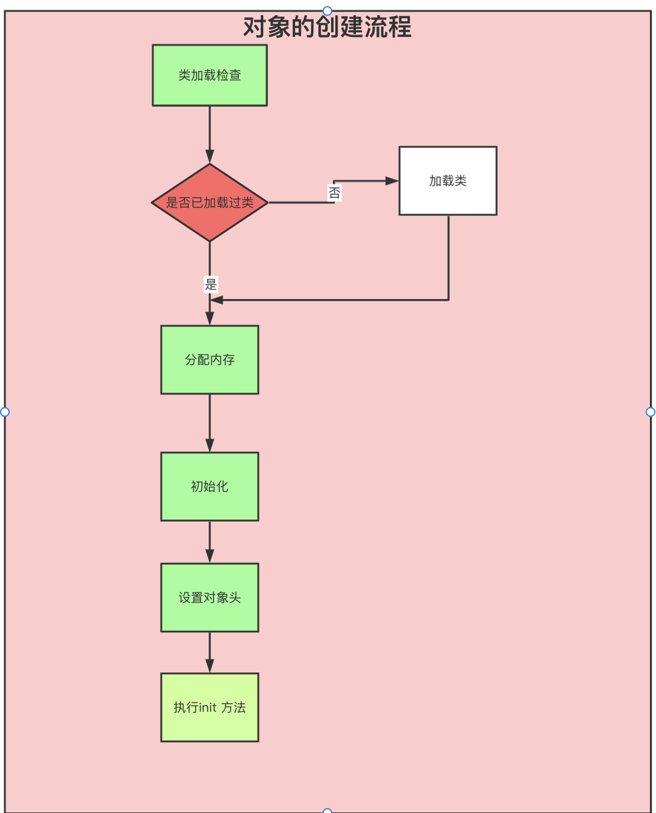
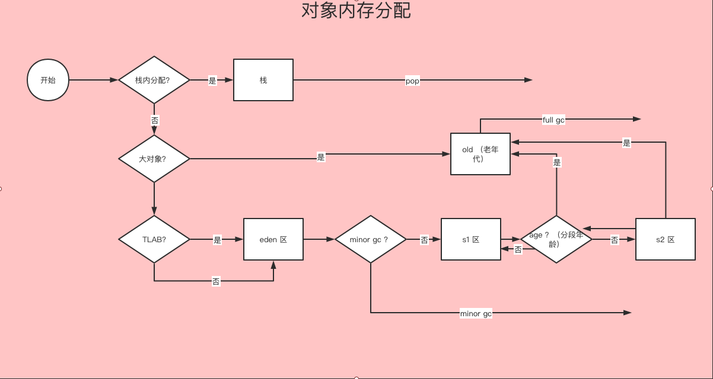

###  1. jvm 对象创建与内存分配 
#### 1.1 对象创建过程 



   *类加载检查》分配内存》初始化》设置对象头》执行<init>方法*
   
   1. 类加载检查:  虚拟机得到一条new指令，首先检查这个指令的参数是否能在*常量池*中找到类的符号引用，并检查这个符号引用代表的类是否已加载，没有的话，先执行类加载过程（new 指令代表java 层面上的 new、对象克隆、对象序列化）
   
   2. 分配内存: 在类加载检查通过后，接下来虚拟机将为新生的对象分配内存。对象所需内存的大小在类加载完成后便可完全确定，为对象分配空间的任务等同于把 一块确定大小的内存从Java堆中划分出来。 
     
    这个步骤有两个问题： 
    
      1.如何划分内存。 (指针碰撞、空闲列表) 
         1）“指针碰撞”(Bump the Pointer)(默认用指针碰撞)如果Java堆中内存是绝对规整的，所有用过的内存都放在一边，
            空闲的内存放在另一边，中间放着一个指针作为分界点 的指示器，那所分配内存就仅仅是把那个指针向空闲空间那边挪动
            一段与对象大小相等的距离。
        2)  如果Java堆中的内存并不是规整的，已使用的内存和空 闲的内存相互交错，那就没有办法简单地进行指针碰撞了，
            虚拟 机就必须维护一个列表，记 录上哪些内存块是可用的，在分配的时候从列表中找到一块足够大的空间划分给对象
            实例， 并更新列表上的记录。
      
      2.在并发情况下， 可能出现正在给对象A分配内存，指针还没来得及修改，对象B又同时使用了原来的指针来分配内存的情况。 （cas、 TLAB(本地线程分配缓存)）
        1) CAS(compare and swap) 虚拟机采用CAS配上失败重试的方式保证更新操作的原子性来对分配内存空间的动作进行同步处理。
        2) 本地线程分配缓冲(Thread Local Allocation Buffer,TLAB)把内存分配的动作按照线程划分在不同的空间之中
           进行，即每个线程在Java堆中预先分配一小块内存。通过­XX:+/­ UseTLAB参数来设定虚拟机是否使用TLAB
           (JVM会默认开启­XX:+UseTLAB)，­XX:TLABSize 指定TLAB大小。
      
   3. 初始化: 内存分配完成后，虚拟机需要将分配到的内存空间都初始化为零值（不包括对象头）， 如果使用TLAB，这一工作过程也 可以提前至TLAB分配时进行。这一步操作保证了对象的实例字段在Java代码中可以不赋初始值就直接使用，
      程序能访问 到这些字段的数据类型所对应的零值。 
  
   4. 设置对象头: 初始化零值之后，虚拟机要对对象进行必要的设置，例如这个对象是哪个类的实例、如何才能找到类的元数据信息、对 象的哈希码、对象的GC分代年龄等信息。这些信息存放在对象的对象头Object Header之中。
    
   5. 执行<init>方法: 执行<init>方法，即对象按照程序员的意愿进行初始化。对应到java语言层面上讲，就是为属性赋值（注意，这与上面的赋 零值不同，这是由程序员赋的值），和执行构造方法。
  
#### 1.2 什么是指针压缩？ 为什么要进行指针压缩？

##### 1.2.1 对象大小查看

  对象大小可以用jol­core包查看，引入依赖

```xml
<dependency>
<groupId>org.openjdk.jol</groupId> 3 <artifactId>jol‐core</artifactId>
</dependency>
```

```java
package com.wlz.jvm;

/**
 * 计算对象大小
 *
 * @author wlz
 * @date 2022-03-20  11:07 下午
 */
public class JOLSampleTest {

    public static void main(String[] args) {
        ClassLayout layout = ClassLayout.parseInstance(new Object());
        System.out.println(layout.toPrintable());

        System.out.println();
        ClassLayout layout1 = ClassLayout.parseInstance(new int[]{});
        System.out.println(layout1.toPrintable());

        System.out.println();
        ClassLayout layout2 = ClassLayout.parseInstance(new A());
        System.out.println(layout2.toPrintable());
    }

    // ‐XX:+UseCompressedOops 默认开启的压缩所有指针
    // ‐XX:+UseCompressedClassPointers 默认开启的压缩对象头里的类型指针Klass Pointer
    // Oops : Ordinary Object Pointers
    public static class A {
        //8B mark word
        //4B Klass Pointer 如果关闭压缩‐XX:‐UseCompressedClassPointers或‐XX:‐UseCompressedOops，则占用8B
        int id; //4B
        String name; //4B 如果关闭压缩‐XX:‐UseCompressedOops，则占用8B
        byte b; //1B
        Object o; //4B 如果关闭压缩‐XX:‐UseCompressedOops，则占用8B
    }

}

// 运行结果:
java.lang.Objectobjectinternals:
        OFFSET SIZE TYPE DESCRIPTION VALUE
        0 4 (object header) 01 00 00 00 (00000001 00000000 00000000 00000000) (1) //mark word
        4 4 (object header) 00 00 00 00 (00000000 00000000 00000000 00000000) (0) //mark word
        8 4 (object header) e5 01 00 f8 (11100101 00000001 00000000 11111000) (‐134217243) //Klass Pointer
        12 4 (loss due to the next object alignment)
        Instancesize:16bytes
        Spacelosses:0bytesinternal+4bytesexternal=4bytestotal
        
        [Iobjectinternals:
        OFFSET SIZE TYPE DESCRIPTION VALUE
        0 4 (object header) 01 00 00 00 (00000001 00000000 00000000 00000000) (1)
        4 4 (object header) 00 00 00 00 (00000000 00000000 00000000 00000000) (0)
        8 4 (object header) 6d 01 00 f8 (01101101 00000001 00000000 11111000) (‐134217363)
        12 4 (object header) 00 00 00 00 (00000000 00000000 00000000 00000000) (0)
        16 0 int [I.<elements> N/A
        Instancesize:16bytes
        Spacelosses:0bytesinternal+0bytesexternal=0bytestotal

        com.wlz.jvm.JOLSampleTest$Aobjectinternals:
        OFFSET SIZE TYPE DESCRIPTION VALUE
        0 4 (object header) 01 00 00 00 (00000001 00000000 00000000 00000000) (1)
        4 4 (object header) 00 00 00 00 (00000000 00000000 00000000 00000000) (0)
        8 4 (object header) 61 cc 00 f8 (01100001 11001100 00000000 11111000) (‐134165407)
        124intA.id0
        161byteA.b0
        17 3 (alignment/padding gap)
        20 4 java.lang.String A.name null
        24 4 java.lang.Object A.o null
        28 4 (loss due to the next object alignment)
        Instancesize:32bytes
        Spacelosses:3bytesinternal+4bytesexternal=7bytestotal
```
   
##### 1.2.2  什么是指针压缩？ 

   jdk1.6  开始，64bit  的操作系统支持指针压缩，即将对象进行压缩、优化处理，使对象能够占用更小的内存空间，减少内存的消耗

##### 1.2.3 为什么要进行指针压缩?
      
      1.在64位平台的HotSpot中使用32位指针，内存使用会多出1.5倍左右，使用较大指针在主内存和缓存之间移动数据， 占用较大宽带，同时GC也会承受较大压力 
      
      2.为了减少64位平台下内存的消耗，启用指针压缩功能 
      
      3.在jvm中，32位地址最大支持4G内存(2的32次方)，可以通过对对象指针的压缩编码、解码方式进行优化，使得jvm 只用32位地址就可以支持更大的内存配置(小于等于32G) 
      
      4.堆内存小于4G时，不需要启用指针压缩，jvm会直接去除高32位地址，即使用低虚拟地址空间 
      
      5.堆内存大于32G时，压缩指针会失效，会强制使用64位(即8字节)来对java对象寻址，这就会出现1的问题，所以堆内 存不要大于32G为好
   
#### 1.3 对象内存分配     

   
   
#### 1.4 栈上分配 （栈上分配依赖于逃逸分析和标量替换）
   
   我们通过JVM内存分配可以知道JAVA中的对象都是在堆上进行分配，当对象没有被引用的时候，需要依靠GC进行回收内存，如果对象数量较多的时候，会给GC带来较大压力，也间接影响了应用的性能。为了减少临时对象在堆内分配的数量，
   JVM通过逃逸分析确定该对象不会被外部访问。如果不会逃逸可以将该对象在栈上分配内存，这样该对象所占用的 内存空间就可以随栈帧出栈而销毁，就减轻了垃圾回收的压力。 
   
   对象逃逸分析：就是分析对象动态作用域，当一个对象在方法中被定义后，它可能被外部方法所引用，例如作为调用参数传递到其他地方中。

```java
package com.wlz.jvm;

/**
 * @author wlz
 * @date 2022-03-20  11:15 下午
 */
public class Test {

    public User test1() {
        User user = new User();
        user.setId(1);
        user.setName("name");
        return user;
    }

    public void test2() {
        User user = new User();
        user.setId(1);
        user.setName("name2");
    }
}

```

  很显然test1方法中的user对象被返回了，这个对象的作用域范围不确定，test2方法中的user对象我们可以确定当方法结束
  这个对象就可以认为是无效对象了，对于这样的对象我们其实可以将其分配在栈内存里，让其在方法结束时跟随栈内 存一起被回收掉。
  JVM对于这种情况可以通过开启逃逸分析参数(-XX:+DoEscapeAnalysis)来优化对象内存分配位置，
  使其通过标量替换优 先分配在栈上(栈上分配)，JDK7之后默认开启逃逸分析，如果要关闭使用参数(-XX:-DoEscapeAnalysis)
  
##### 1.4.1 标量替换:
    
    通过逃逸分析确定该对象不会被外部访问，并且对象可以被进一步分解时，JVM不会创建该对象，而是将该 对象成员变量分解若干个被这个方法使用的成员变量所代替，
    这些代替的成员变量在栈帧或寄存器上分配空间，这样就 不会因为没有一大块连续空间导致对象内存不够分配。开启标量替换参数(-XX:+EliminateAllocations)，JDK7之后默认 开启。

##### 1.4.2 标量与聚合量:

    标量即不可被进一步分解的量，而JAVA的基本数据类型就是标量(如:int，long等基本数据类型以及 reference类型等)，
    标量的对立就是可以被进一步分解的量，而这种量称之为聚合量。而在JAVA中对象就是可以被进一 步分解的聚合量。

##### 1.4.3 栈上分配 示例

```java
package com.wlz.jvm;

/**
 *   栈上分配
 *
 *   代码调用了1亿次alloc()，如果是分配到堆上，大概需要1GB以上堆空间，如果堆空间小于该值，必然会触发GC。
 *
 *   使用如下参数不会发生GC 6 * ‐Xmx15m ‐Xms15m ‐XX:+DoEscapeAnalysis ‐XX:+PrintGC ‐XX:+EliminateAllocations （开启逃逸分析）
 *
 *   使用如下参数都会发生大量GC   （关闭逃逸分析）
 *         ‐Xmx15m ‐Xms15m ‐XX:‐DoEscapeAnalysis ‐XX:+PrintGC ‐XX:+EliminateAllocations
 *
 *         ‐Xmx15m ‐Xms15m ‐XX:+DoEscapeAnalysis ‐XX:+PrintGC ‐XX:‐EliminateAllocations
 */
public class AllotOnStack {

    public static void main(String[] args) {
        long start = System.currentTimeMillis();

        for (int i = 0; i < 100000000; i++) {
            alloc();
        }
        long end = System.currentTimeMillis();

        System.out.println(end - start);
    }

    private static void alloc() {
        User user = new User();

        user.setId(1);

        user.setName("测试");
    }
}
```

  结论:栈上分配依赖于逃逸分析和标量替换

#### 1.5 对象在eden 区 分配
   
   大多数情况下，对象在年轻代中 Eden 区分配。当 Eden 区没有足够空间进行分配时，虚拟机将发起一次Minor GC。 
   
   两种GC: 
   
    Minor GC/Young GC：指发生新生代的的垃圾收集动作，Minor GC非常频繁，回收速度一般也比较快。 
   
    Major GC/Full GC：一般会回收老年代 ，年轻代，方法区的垃圾，Major GC的速度一般会比Minor GC的慢 10倍以上。
     
   Eden与Survivor区默认8:1:1 
    
    大量的对象被分配在eden区，eden区满了后会触发minor gc，可能会有99%以上的对象成为垃圾被回收掉，剩余存活 的对象会被挪到为空的那块survivor区，下一次eden区满了后又会触发minor gc，
    把eden区和survivor区垃圾对象回 收，把剩余存活的对象一次性挪动到另外一块为空的survivor区，因为新生代的对象都是朝生夕死的，存活时间很短，所 以JVM默认的8:1:1的比例是很合适的，让eden区尽量的大，survivor区够用即可，
    JVM默认有这个参数-XX:+UseAdaptiveSizePolicy(默认开启)，会导致这个8:1:1比例自动变化，如果不想这个比例有变 化可以设置参数-XX:-UseAdaptiveSizePolicy


##### 1.5.1 示例 

```java
package com.wlz.jvm;

/**
 *  添加 运行 jvm 参数  ‐XX:+PrintGCDetails （打印gc过程）
 */
public class GCTest {

    public static void main(String[] args) {

        byte[] allocation1,allocation2,allocation3,allocation4,allocation5,allocation6;

        allocation1 = new byte[60000*1024];

//        allocation2 = new byte[8000*1024];

//        allocation3 = new byte[1000*1024];
        allocation4 = new byte[1000*1024];
        allocation5 = new byte[1000*1024];
        allocation6 = new byte[1000*1024];

    }
}

```

#### 大对象直接进入老年代 

   大对象就是需要大量连续内存空间的对象（比如：字符串、数组）。JVM参数 -XX:PretenureSizeThreshold 可以设置大 对象的大小，如果对象超过设置大小会直接进入老年代，不会进入年轻代，但是这个参数只在 Serial 和ParNew两个收集器下 有效。
   
   比如设置JVM参数：-XX:PretenureSizeThreshold=1000000 (单位是字节) -XX:+UseSerialGC ，再执行下上面的第一 个程序会发现大对象直接进了老年代 
   
   为什么要这样呢？ 
        
      为了避免为大对象分配内存时的复制操作而降低效率。

#### 长期存活的对象将进入老年代
   
   虚拟机采用了分代收集的思想来管理内存，那么内存回收时就必须能识别哪些对象应放在新生代，哪些对象应放在老年代中。为了做到这一点，虚拟机给每个对象一个对象年龄（Age）计数器。 
   如果对象在 Eden 出生并经过第一次 Minor GC 后仍然能够存活，并且能被 Survivor 容纳的话，将被移动到 Survivor 空间中，并将对象年龄设为1。对象在 Survivor 中每熬过一次 MinorGC，年龄就增加1岁，
   当它的年龄增加到一定程度 （默认为15岁，CMS收集器默认6岁，不同的垃圾收集器会略微有点不同），就会被晋升到老年代中。对象晋升到老年代 的年龄阈值，可以通过参数 -XX:MaxTenuringThreshold 来设置。
   
#### 对象动态年龄判断
   
   当前放对象的Survivor区域里(其中一块区域，放对象的那块s区)，一批对象的总大小大于这块Survivor区域内存大小的 50%(-XX:TargetSurvivorRatio可以指定)，
   那么此时大于等于这批对象年龄最大值的对象，就可以直接进入老年代了，
   例如Survivor区域里现在有一批对象，年龄1+年龄2+年龄n的多个年龄对象总和超过了Survivor区域的50%，此时就会 把年龄n(含)以上的对象都放入老年代。这个规则其实是希望那些可能是长期存活的对象，尽早进入老年代。
   *对象动态年 龄判断机制一般是在minor gc之后触发的。*

#### 老年代空间分配担保机制 

   
   
#### 对象内存回收
   
   堆内放着大部分的对象实例，对堆进行垃圾回收之前，第一步是要判断哪些对象已经死亡（即不在被任何途径使用的对象）
   
##### 引用计数法 
    
   给对象中添加一个引用计数器，每当有一个地方引用它，计数器就加1；当引用失效，计数器就减1；任何时候计数器为0 的对象就是不可能再被使用的。 
    
   这个方法实现简单，效率高，但是目前主流的虚拟机中并没有选择这个算法来管理内存，其最主要的原因是它很难解决 对象之间相互循环引用的问题。 
    
   所谓对象之间的相互引用问题，如下面代码所示：除了对象objA 和 objB 相互引用着对 方之外，这两个对象之间再无任何引用。但是他们因为互相引用对方，导致它们的引用计数器都不为0，于是引用计数算 法无法通知 GC 回收器回收他们。
    
##### 可达性分析算法
   
   将“GC Roots” 对象作为起点，从这些节点开始向下搜索引用的对象，找到的对象都标记为非垃圾对象，其余未标记的 对象都是垃圾对象 
    
   GC Roots根节点：线程栈的本地变量、静态变量、本地方法栈的变量等等
   
#### 如何判断一个类是无用的类
   
   方法区主要回收的是无用的类，那么如何判断一个类是无用的类的呢？ 
   
   类需要同时满足下面3个条件才能算是 “无用的类” ： 
    
    该类所有的实例都已经被回收，也就是 Java 堆中不存在该类的任何实例。
    
    加载该类的 ClassLoader 已经被回收。 
    
    该类对应的 java.lang.Class 对象没有在任何地方被引用，无法在任何地方通过反射访问该类的方法。

#### 常量池

##### Class常量池与运行时常量池

   Class常量池可以理解为是Class文件中的资源仓库。 Class文件中除了包含类的版本、字段、方法、接口等描述信息外， 还有一项信息就是常量池(constant pool table)，用于存放编译期生成的各种字面量(Literal)和符号引用(Symbolic References)。

   字面量：

      字面量就是指由字母、数字等构成的字符串或者数值常量 字面量只可以右值出现，所谓右值是指等号右边的值，如：int a=10 这里的a为左值，10为右值。在这个例子中10就是字面量。

```
int a = 10; 
int b = 22;
int c = "abcdef";
int d = "abcdefgdsaadwfa";
```

   符号引用:
      
      符号引用是编译原理中的概念，是相对于直接引用来说的。主要包括了以下三类常量： 
         
         类和接口的全限定名 
         
         字段的名称和描述符 
         
         方法的名称和描述符 
      
      上面的a，b就是字段名称，就是一种符号引用，还有Math类常量池里的 Lcom/tuling/jvm/Math 是类的全限定名， main和compute是方法名称，()是一种UTF8格式的描述符，这些都是符号引用。

      这些常量池现在是静态信息，只有到运行时被加载到内存后，这些符号才有对应的内存地址信息，这些常量池一旦被装 入内存就变成运行时常量池，对应的符号引用在程序加载或运行时会被转变为被加载到内存区域的代码的直接引用，也 就是我们说的动态链接了。例如，compute()这个符号引用在运行时就会被转变为compute()方法具体代码在内存中的 地址，主要通过对象头里的类型指针去转换直接引用。

##### 字符串常量池

   1. 字符串的分配，和其他的对象分配一样，耗费高昂的时间与空间代价，作为最基础的数据类型，大量频繁的创建 字符串，极大程度地影响程序的性能 
   
   2. JVM为了提高性能和减少内存开销，在实例化字符串常量的时候进行了一些优化 
      
      为字符串开辟一个字符串常量池，类似于缓存区 
      
      创建字符串常量时，首先查询字符串常量池是否存在该字符串 
      
      存在该字符串，返回引用实例，不存在，实例化该字符串并放入池中

###### 三种字符串操作(Jdk1.7 及以上版本)

   直接赋值字符串

```
 String s = "wlz"; // s指向常量池中的引用
```

      这种方式创建的字符串对象，只会在常量池中。 

      因为有"wlz"这个字面量，创建对象s的时候，JVM会先去常量池中通过 equals(key) 方法，判断是否有相同的对象 
   
      如果有，则直接返回该对象在常量池中的引用； 
      
      如果没有，则会在常量池中创建一个新对象，再返回引用。
   
   new String();

```
 String s1 = new String("wlz"); // s1指向内存中的对象引用
```

      这种方式会保证字符串常量池和堆中都有这个对象，没有就创建，最后返回堆内存中的对象引用。步骤大致如下： 
      
      因为有"wlz"这个字面量，所以会先检查字符串常量池中是否存在字符串"wlz" 
      
      不存在，先在字符串常量池里创建一个字符串对象；再去内存中创建一个字符串对象"wlz"； 
      
      存在的话，就直接去堆内存中创建一个字符串对象"wlz"； 
      
      最后，将内存中的引用返回。

   intern方法

```
String s1 = new String("wlz"); 
String s2 = s1.intern();
System.out.println(s1 == s2); //false
```

      String中的intern方法是一个 native 的方法，当调用 intern方法时，如果池已经包含一个等于此String对象的字符串 （用equals(oject)方法确定），则返回池中的字符串。否则，将intern返回的引用指向当前字符串 s1(jdk1.6版本需要将 s1 复制到字符串常量池里)。

###### 字符串常量池位置

   Jdk1.6及之前： 有永久代, 运行时常量池在永久代，运行时常量池包含字符串常量池
   
   Jdk1.7：有永久代，但已经逐步“去永久代”，字符串常量池从永久代里的运行时常量池分离到堆里 
   
   Jdk1.8及之后： 无永久代，运行时常量池在元空间，字符串常量池里依然在堆里