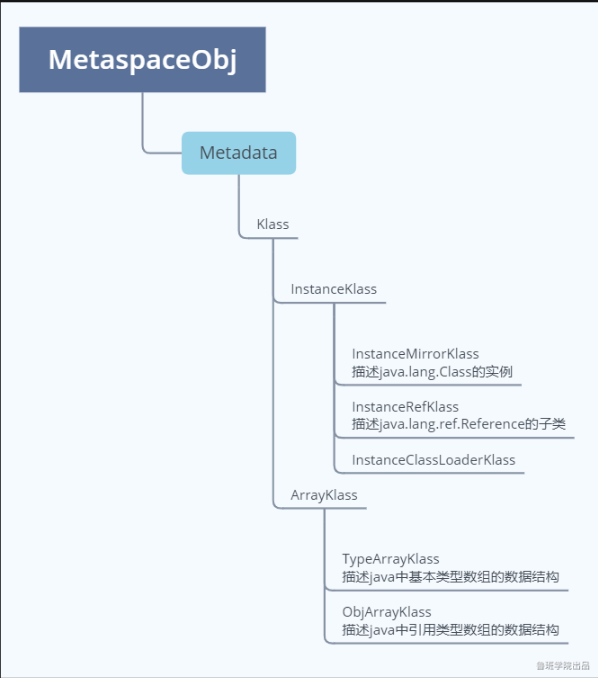

### klass模型
   
   Java的每个类，在JVM中，都有一个对应的Klass类实例与之对应，存储类的元信息如：常量池、属性信息、方法信息……
   
   看下klass模型类的继承结构
   
   
   
   从继承关系上也能看出来，类的元信息是存储在原空间的
   
   普通的Java类在JVM中对应的是instanceKlass类的实例，再来说下它的三个字类
    
    1. InstanceMirrorKlass：用于表示java.lang.Class，Java代码中获取到的Class对象，实际上就是这个C++类的实例，存储在堆区，学名镜像类
    2. InstanceRefKlass：用于表示java/lang/ref/Reference类的子类
    3. InstanceClassLoaderKlass：用于遍历某个加载器加载的类
   
   Java中的数组不是静态数据类型，是动态数据类型，即是运行期生成的，Java数组的元信息用ArrayKlass的子类来表示：
   
    1. TypeArrayKlass：用于表示基本类型的数组
    2. ObjArrayKlass：用于表示引用类型的数组
    
### 类加载的过程
   
   类加载由7个步骤完成，看图
   
   类的生命周期是由7个阶段组成，但是类的加载说的是前5个阶段
   
   
   
#### 加载
   
   1、通过类的全限定名获取存储该类的class文件（没有指明必须从哪获取）
   
   2、解析成运行时数据，即instanceKlass实例，存放在方法区
   
   3、在堆区生成该类的Class对象，即instanceMirrorKlass实例
   
   程序随便你怎么写，随便你用什么语言，只要能达到这个效果即可
   
   就是说你可以改写openjdk源码，你写的程序能达到这三个效果即可
   
   何时加载?
    
    主动使用时
    1、new、getstatic、putstatic、invokestatic
    2、反射
    3、初始化一个类的子类会去加载其父类
    4、启动类（main函数所在类）
    5、当使用jdk1.7动态语言支持时，如果一个java.lang.invoke.MethodHandle实例最后的解析结果REF_getstatic,REF_putstatic,REF_invokeStatic的方法句柄，并且这个方法句柄所对应的类没有进行初始化，则需要先出触发其初始化
   
   预加载：包装类、String、Thread
   
   因为没有指明必须从哪获取class文件，脑洞大开的工程师们开发了这些
   
    1、从压缩包中读取，如jar、war
    2、从网络中获取，如Web Applet
    3、动态生成，如动态代理、CGLIB
    4、由其他文件生成，如JSP
    5、从数据库读取
    6、从加密文件中读取
    
#### 验证
   
   1、文件格式验证
   2、元数据验证
   3、字节码验证
   4、符号引用验证
   
#### 准备
   
   为静态变量分配内存、赋初值
   
   实例变量是在创建对象的时候完成赋值的，没有赋初值一说
   
   
   
#### 解析
   
   将常量池中的符号引用转为直接引用
   
   解析后的信息存储在ConstantPoolCache类实例中
    
    1、类或接口的解析
    2、字段解析
    3、方法解析
    4、接口方法解析
    
   何时解析?
    
    思路：
    1、加载阶段解析常量池时
    2、用的时候
    openjdk是第二种思路，在执行特定的字节码指令之前进行解析：
        anewarray、checkcast、getfield、getstatic、instanceof、invokedynamic、invokeinterface、invokespecial、invokestatic、invokevirtual、ldc、ldc_w、ldc2_w、multianewarray、new、putfield
        
#### 初始化
   
   执行静态代码块，完成静态变量的赋值
   
   静态字段、静态代码段，字节码层面会生成clinit方法
   
   方法中语句的先后顺序与代码的编写顺序相关
   
### 读取静态字段的实现原理
   
```
public class Test_1 {
    public static void main(String[] args) {
        System.out.printf(Test_1_B.str);
    }
}

class Test_1_A {
    public static String str = "A str";

    static {
        System.out.println("A Static Block");
    }
}

class Test_1_B extends Test_1_A {
    static {
        System.out.println("B Static Block");
    }
}
```
   
   静态字段如何存储
   
   instanceKlass
   
   instanceMirrorKlass
   
   Test_1_A的
   
   
   
   静态变量str的值存放在StringTable中，镜像类中存放的是字符串的指针
   
   Test_1_B
   
   
   
   str是类Test_1_A的静态属性，可以看到不会存储到子类Test_1_B的镜像类中
   
   可以猜得到，通过子类Test_1_B访问父类Test_1_A的静态字段有两种实现方式：
   
    1、先去Test_1_B的镜像类中去取，如果有直接返回；如果没有，会沿着继承链将请求往上抛。很明显，这种算法的性能随继承链的death而上升，算法复杂度为O(n)
    2、借助另外的数据结构实现，使用K-V的格式存储，查询性能为O(1)
   
   Hotspot就是使用的第二种方式，借助另外的数据结构ConstantPoolCache，常量池类ConstantPool中有个属性_cache指向了这个结构。每一条数据对应一个类ConstantPoolCacheEntry。
   
   ConstantPoolCacheEntry在哪呢？在ConstantPoolCache对象后面，看代码
   
   \openjdk\hotspot\src\share\vm\oops\cpCache.hpp
   
```
ConstantPoolCacheEntry* base() const           { 
  return (ConstantPoolCacheEntry*)((address)this + in_bytes(base_offset()));
}
```
   
   这个公式的意思是ConstantPoolCache对象的地址加上ConstantPoolCache对象的内存大小
   
   *ConstantPoolCache*
   
   常量池缓存是为常量池预留的运行时数据结构。保存所有字段访问和调用字节码的解释器运行时信息。缓存是在类被积极使用之前创建和初始化的。每个缓存项在解析时被填充
   
   *如何读取*
   
   \openjdk\hotspot\src\share\vm\interpreter\bytecodeInterpreter.cpp
   
```
CASE(_getstatic):
        {
          u2 index;
          ConstantPoolCacheEntry* cache;
          index = Bytes::get_native_u2(pc+1);

          // QQQ Need to make this as inlined as possible. Probably need to
          // split all the bytecode cases out so c++ compiler has a chance
          // for constant prop to fold everything possible away.

          cache = cp->entry_at(index);
          if (!cache->is_resolved((Bytecodes::Code)opcode)) {
            CALL_VM(InterpreterRuntime::resolve_get_put(THREAD, (Bytecodes::Code)opcode),
                    handle_exception);
            cache = cp->entry_at(index);
          }
……
```
  
   从代码中可以看出，是直接去获取ConstantPoolCacheEntry

### 类加载器子系统与SPI

#### 类加载器
   
   JVM中有两种类型的类加载器，由C++编写的及由Java编写的。除了启动类加载器（Bootstrap Class Loader）是由C++编写的，其他都是由Java编写的。由Java编写的类加载器都继承自类java.lang.ClassLoader。
   
   JVM还支持自定义类加载器。
   
   各种类加载器之间存在着逻辑上的父子关系，但不是真正意义上的父子关系，因为它们直接没有从属关系。
   
   
   
##### 启动类加载器
   
   因为启动类加载器是由C++编写的，通过Java程序去查看显示的是null
   
   因此，启动类加载器无法被Java程序调用
   
   启动类加载器不像其他类加载器有实体，它是没有实体的，JVM将C++处理类加载的一套逻辑定义为启动类加载器
   
   查看启动类加载器的加载路径
   
```
URL[] urLs = Launcher.getBootstrapClassPath().getURLs();
for (URL urL : urLs) {
    System.out.println(urL);
}
```

   也可以通过-Xbootclasspath指定
   
```
int JNICALL
JavaMain(void * _args)
{
	……
    mainClass = LoadMainClass(env, mode, what);
    ……
}

static jclass
LoadMainClass(JNIEnv *env, int mode, char *name)
{
    jmethodID mid;
    jstring str;
    jobject result;
    jlong start, end;
    jclass cls = GetLauncherHelperClass(env);
    NULL_CHECK0(cls);
    if (JLI_IsTraceLauncher()) {
        start = CounterGet();
    }
    NULL_CHECK0(mid = (*env)->GetStaticMethodID(env, cls,
                "checkAndLoadMain",
                "(ZILjava/lang/String;)Ljava/lang/Class;"));

    str = NewPlatformString(env, name);
    CHECK_JNI_RETURN_0(
        result = (*env)->CallStaticObjectMethod(
            env, cls, mid, USE_STDERR, mode, str));

    if (JLI_IsTraceLauncher()) {
        end   = CounterGet();
        printf("%ld micro seconds to load main class\n",
               (long)(jint)Counter2Micros(end-start));
        printf("----%s----\n", JLDEBUG_ENV_ENTRY);
    }

    return (jclass)result;
}

jclass
GetLauncherHelperClass(JNIEnv *env)
{
    if (helperClass == NULL) {
        NULL_CHECK0(helperClass = FindBootStrapClass(env,
                "sun/launcher/LauncherHelper"));
    }
    return helperClass;
}

jclass
FindBootStrapClass(JNIEnv *env, const char* classname)
{
   if (findBootClass == NULL) {
       findBootClass = (FindClassFromBootLoader_t *)dlsym(RTLD_DEFAULT,
          "JVM_FindClassFromBootLoader");
       if (findBootClass == NULL) {
           JLI_ReportErrorMessage(DLL_ERROR4,
               "JVM_FindClassFromBootLoader");
           return NULL;
       }
   }
   return findBootClass(env, classname);
}

JVM_ENTRY(jclass, JVM_FindClassFromBootLoader(JNIEnv* env,
                                              const char* name))
  JVMWrapper2("JVM_FindClassFromBootLoader %s", name);

  // Java libraries should ensure that name is never null...
  if (name == NULL || (int)strlen(name) > Symbol::max_length()) {
    // It's impossible to create this class;  the name cannot fit
    // into the constant pool.
    return NULL;
  }

  TempNewSymbol h_name = SymbolTable::new_symbol(name, CHECK_NULL);
  Klass* k = SystemDictionary::resolve_or_null(h_name, CHECK_NULL);
  if (k == NULL) {
    return NULL;
  }

  if (TraceClassResolution) {
    trace_class_resolution(k);
  }
  return (jclass) JNIHandles::make_local(env, k->java_mirror());
JVM_END
```
   
   这套逻辑做的事情就是通过启动类加载器加载类sun.launcher.LauncherHelper，执行该类的方法checkAndLoadMain，加载main函数所在的类，启动扩展类加载器、应用类加载器也是在这个时候完成的
   
##### 扩展类加载器
   
   查看类加载器加载的路径
   
```
    public static void main(String[] args) {
        ClassLoader classLoader = ClassLoader.getSystemClassLoader().getParent();

        URLClassLoader urlClassLoader = (URLClassLoader) classLoader;

        URL[] urls = urlClassLoader.getURLs();
        for (URL url : urls) {
            System.out.println(url);
        }
    }
```
   
   可以通过java.ext.dirs指定
   
##### 应用类加载器
   
   默认加载用户程序的类加载器
   
   查看类加载器加载的路径

```
    public static void main(String[] args) {
        String[] urls = System.getProperty("java.class.path").split(":");

        for (String url : urls) {
            System.out.println(url);
        }

        System.out.println("================================");

        URLClassLoader classLoader = (URLClassLoader) ClassLoader.getSystemClassLoader();

        URL[] urls1 = classLoader.getURLs();
        for (URL url : urls1) {
            System.out.println(url);
        }
    }
```
   
   可以通过java.class.path指定
   
##### 自定义类加载器
   
   继承类java.lang.ClassLoader
   

##### 线程上下文类加载器

#### 类加载器创建链
   
   上面已经讲了启动类加载器没有实体，只是将一段加载逻辑命名成启动类加载器。启动类加载器做的事情是：加载类sun.launcher.LauncherHelper，执行该类的方法checkAndLoadMain……启动类、扩展类、应用类加载器逻辑上的父子关系就是在这个方法的调用链中生成的？
   
   1、\openjdk\jdk\src\share\classes\sun\launcher\LauncherHelper.java
   
   核心代码：ClassLoader.getSystemClassLoader();
   
```
public enum LauncherHelper {
……
	private static final ClassLoader scloader = ClassLoader.getSystemClassLoader();
……
    public static Class<?> checkAndLoadMain(boolean printToStderr,
                                            int mode,
                                            String what) {
        ……
        mainClass = scloader.loadClass(cn);
    	……
```
   
   2、\openjdk\jdk\src\share\classes\java\lang\ClassLoader.java
   
   核心代码：sun.misc.Launcher.getLauncher();
   
```
    public static ClassLoader getSystemClassLoader() {
        initSystemClassLoader();
        if (scl == null) {
            return null;
        }
        SecurityManager sm = System.getSecurityManager();
        if (sm != null) {
            checkClassLoaderPermission(scl, Reflection.getCallerClass());
        }
        return scl;
    }

	private static synchronized void initSystemClassLoader() {
        if (!sclSet) {
            if (scl != null)
                throw new IllegalStateException("recursive invocation");
            sun.misc.Launcher l = sun.misc.Launcher.getLauncher();
        ……
```

   3、\openjdk\jdk\src\share\classes\sun\misc\Launcher.java
   
   核心代码：
    
    • private static Launcher launcher = new Launcher();
    • extcl = ExtClassLoader.getExtClassLoader();
    • loader = AppClassLoader.getAppClassLoader(extcl);
    • Thread.currentThread().setContextClassLoader(loader);
    
```
public class Launcher {
    private static URLStreamHandlerFactory factory = new Factory();
    private static Launcher launcher = new Launcher();
    private static String bootClassPath =
        System.getProperty("sun.boot.class.path");

    public static Launcher getLauncher() {
        return launcher;
    }

    private ClassLoader loader;

    public Launcher() {
        // Create the extension class loader
        ClassLoader extcl;
        try {
            extcl = ExtClassLoader.getExtClassLoader();
        } catch (IOException e) {
            throw new InternalError(
                "Could not create extension class loader", e);
        }

        // Now create the class loader to use to launch the application
        try {
            loader = AppClassLoader.getAppClassLoader(extcl);
        } catch (IOException e) {
            throw new InternalError(
                "Could not create application class loader", e);
        }

        // Also set the context class loader for the primordial thread.
        Thread.currentThread().setContextClassLoader(loader);
    ……
```
   
   4、扩展类加载器的创建流程
   
```
public static ExtClassLoader getExtClassLoader() throws IOException
        {
       ……
                            return new ExtClassLoader(dirs);
  ……
  
  public ExtClassLoader(File[] dirs) throws IOException {
            super(getExtURLs(dirs), null, factory);
        }
        
   URLClassLoader(URL[] urls, ClassLoader parent,
                   AccessControlContext acc) {
```
   
   第二个参数传的是null，其实就是parent=null
   
   5、应用类加载器的创建流程
   
```
public static ClassLoader getAppClassLoader(final ClassLoader extcl)
            throws IOException {
    final String s = System.getProperty("java.class.path");
    final File[] path = (s == null) ? new File[0] : getClassPath(s);

    // Note: on bugid 4256530
    // Prior implementations of this doPrivileged() block supplied
    // a rather restrictive ACC via a call to the private method
    // AppClassLoader.getContext(). This proved overly restrictive
    // when loading  classes. Specifically it prevent
    // accessClassInPackage.sun.* grants from being honored.
    //
    return AccessController.doPrivileged(
        new PrivilegedAction<AppClassLoader>() {
            public AppClassLoader run() {
                URL[] urls =
                    (s == null) ? new URL[0] : pathToURLs(path);
                return new AppClassLoader(urls, extcl);
            }
        });
}
        
AppClassLoader(URL[] urls, ClassLoader parent) {
    super(urls, parent, factory);
}
```
   
   应用类、扩展类加载器的父子关系就是这样建立的
   
#### 类加载器加载的类如何存储
   
   
   
#### 双亲委派
   
   如果一个类加载器收到了加载某个类的请求,则该类加载器并不会去加载该类,而是把这个请求委派给父类加载器,每一个层次的类加载器都是如此,因此所有的类加载请求最终都会传送到顶端的启动类加载器;只有当父类加载器在其搜索范围内无法找到所需的类,并将该结果反馈给子类加载器,子类加载器会尝试去自己加载。
   
   每个类加载器的搜索范围上面已经讲过了
   
   
   
#### 打破双亲委派
   
   因为在某些情况下父类加载器需要委托子类加载器去加载class文件。受到加载范围的限制，父类加载器无法加载到需要的文件，以Driver接口为例，由于Driver接口定义在jdk当中的，而其实现由各个数据库的服务商来提供，比如mysql的就写了MySQL Connector，那么问题就来了，DriverManager（也由jdk提供）要加载各个实现了Driver接口的实现类，然后进行管理，但是DriverManager由启动类加载器加载，只能记载JAVA_HOME的lib下文件，而其实现是由服务商提供的，由系统类加载器加载，这个时候就需要启动类加载器来委托子类来加载Driver实现，从而破坏了双亲委派。
   
   类似这样的情况就需要打破双亲委派。
   
   打破双亲委派的意思其实就是不委派、向下委派
   
#### SPI
   
   是一种服务发现机制。它通过在ClassPath路径下的META-INF/services文件夹查找文件，自动加载文件里所定义的类。这一机制为很多框架扩展提供了可能，比如在Dubbo、JDBC中都使用到了SPI机制
   
#### 线程上下文类加载器
   
   1、是什么
    
    一种特殊的类加载器，可以通过Thread获取，基于此可实现逆向委托加载
   
   2、为什么
    
    为了解决双亲委派的缺陷而生
   
   3、怎么做

```
//获取
Thread.currentThread().getContextClassLoader()
    
// 设置
Thread.currentThread().setContextClassLoader(new Classloader_4());
```
   
#### 沙箱安全
   
   跟Linux的权限机制有点像

   
   
   看openjdk源码会看到有这样的判断AccessController.doPrivileged
   
   
   
   随便搜了一下，35个文件有80处安全判断
   
   
   
   比如我定义了一个类名为String所在包为java.lang，因为这个类本来是属于jdk的，如果没有沙箱安全机制的话，这个类将会污染到我所有的String,但是由于沙箱安全机制，所以就委托顶层的bootstrap加载器查找这个类，如果没有的话就委托extsion,extsion没有就到aapclassloader，但是由于String就是jdk的源代码，所以在bootstrap那里就加载到了，先找到先使用，所以就使用bootstrap里面的String,后面的一概不能使用，这就保证了不被恶意代码污染
   
   
   
   