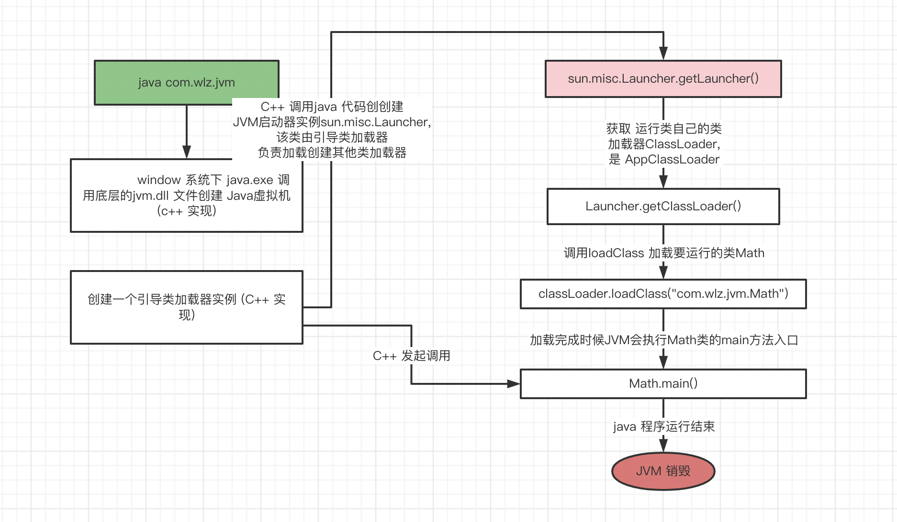
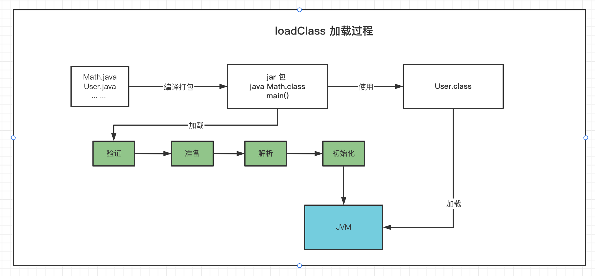
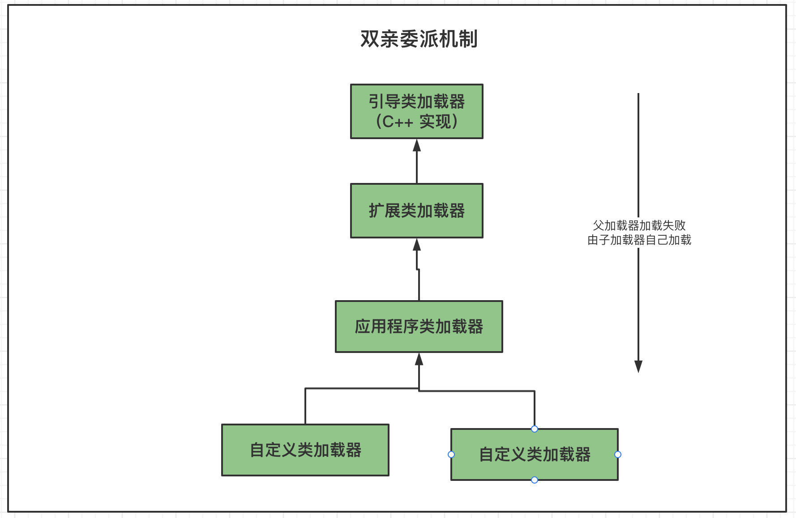
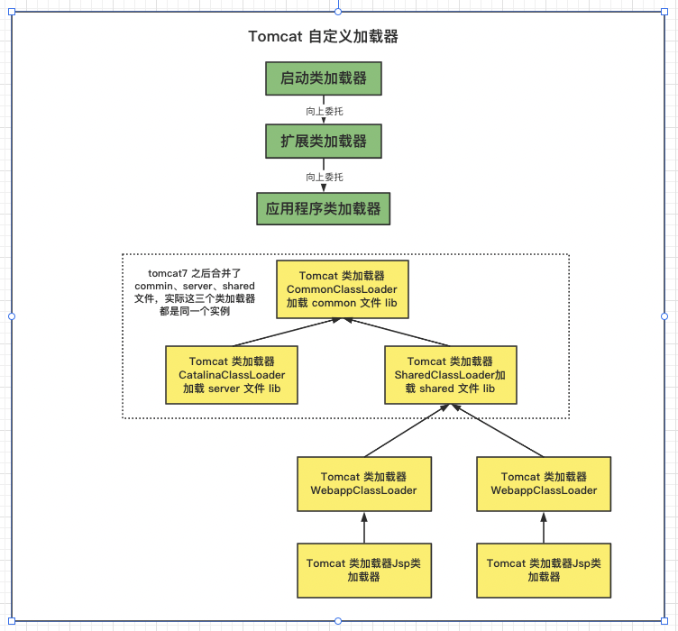

### 1. 类加载全过程 

    当我们用java命令运行某个类的main函数启动程序时，首先需要通过类加载器把主类加载到 JVM。

```java
package com.wlz.jvm;

/**
 *  类加载 全过程
 *
 *     当使用java 命令 执行某个类的 main 方法启动程序时， 首先需要通过类加载器把主类加载到jvm 中去
 *
 *     执行代码大致流程如下：
 *
 *      1. windows 系统下java.exe 调用底层的jvm.dll 文件创建java虚拟机（c++实现）
 *      2. 创建一个引导类加载器实例（c++实现）
 *
 *      3. c++ 代码调用java 代码 创建jvm启动器（sun.misc.Launcher）,该类由引导类加载器(sun.misc.Launcher.getLauncher())负责加载创建其他类加载器（扩展类加载器、应用类加载器，自定义加载器等）
 *
 *      4. 通过 getLauncher() 获取运行类自己的类加载器Classloader (AppClassloader) 的实例
 *
 *      5. 调用 Classloader 的 loadClass 加载 Math 类
 *
 *      6. c++ 发起调用 执行 Math 类的 main 方法 ，执行程序
 *
 *      7. 程序运行结束
 *
 *      8. 程序销毁
 *
 * classload 类加载的过程：
 *
 *      加载》验证》准备》解析》初始化
 *
 */
public class Math {

    public static final int initData = 666;
    public static User user = new User();


    public int compute() { //一个方法对应一块栈帧内存区域
        int a = 1;
        int b = 2;
        int c = (a + b) * 10;
        return c;
    }

    public static void main(String[] args) {
        Math math = new Math();
        math.compute();
    }

}

```



 其中loadClass的类加载过程过程如下：  加载>> 验证 >> 准备 >> 解析 >> 初始化 >> 使用 >> 卸载 

    加载: 在硬盘上查找并通过IO 读入字节码文件,使用到类时才会加载，例如 调用类的main() 方法，new 对象等等,在加载阶段会在内存中生成一个 代表这个
          类的 java.lang.Class 对象，作为方法区这个类的各种数据的访问入口。
    
    验证: 校验字节码文件的正确性

    准备: 给类 的静态变量分配内存,并赋予默认值.

    解析: 将 *符号引用* 替换为直接引用， 该阶段会把一些静态方法(符号引用，比如main()方法) 替换为指向数据所存内存的指针或句柄等(直接引用)，这就是
         所谓的*静态链接* 过程(类加载期间完成), *动态链接* 是在程序运行期间完成的将符号引用替换为直接引用.

    初始化: 对类的静态变量初始化为指定的值，执行静态代码块



   类被加载到方法区中后主要包括 *运行时常量池*、*类型信息*、 *字段信息*、 *方法信息*、 *类加载器的引用*、 *对应的class实例的引用* 等信息. 

   类加载器的引用: 这个类到类加载器实例的引用

   对应class 实例的引用: 类加载器在加载类信息放到方法区中后,会创建一个对应的Class 类型的对象实例放到堆(Heap) 中，作为开发人员访问方法区中类
    定义的入口和切入点。

   *注意*: 主类在运行过程中如果使用到其他类，会依次加载这些类. (jar 包或war包 里的类不是一次性全部加载，是使用到时才加载。)

```java
package com.wlz.jvm;

/**
 *   主类在运行过程中如果使用到其它类，会逐步加载这些类。 jar包或war包里的类不是一次性全部加载的，是使用到时才加载。
 */
public class TestDynamicLoad {

    static {
        System.out.println("load testdynamicload");
    }

    public static void main(String[] args) {
        new A();
        System.out.println("================");
        B b = null;
    }
}

class  B {

    static {
        System.out.println("load b");
    }

    public B() {
        System.out.println("load b() ");
    }
}

class  A {

    static {
        System.out.println("load a");
    }

    public A() {
        System.out.println("load a() ");
    }
}


-- 结果：
        load testdynamicload
        load a
        load a()
        ================
```


### 2. 类加载器 

   上面的类加载过程主要是通过类加载器来实现的，Java里有如下几种类加载器

    引导类加载器:负责加载支撑JVM运行的位于JRE的lib目录下的核心类库，比如 rt.jar、charsets.jar等
    扩展类加载器:负责加载支撑JVM运行的位于JRE的lib目录下的ext扩展目录中的JAR 类包
    应用程序类加载器:负责加载ClassPath路径下的类包，主要就是加载你自己写的那 些类
    自定义加载器:负责加载用户自定义路径下的类包

#### 2.1 类加载器示例 

```java
package com.wlz.jvm;

import sun.misc.Launcher;

import java.net.URL;

/**
 *  类加载器示例
 *
 */
public class TestJDKClassLoader {

    public static void main(String[] args) {
        System.out.println(String.class.getClassLoader());  // 引导类加载器 （由于引导类加载器是c++实现 所以为null ）
        System.out.println(com.sun.crypto.provider.DESedeKeyFactory.class.getClassLoader().getClass().getName());  // 扩展类加载 sun.misc.Launcher$ExtClassLoader
        System.out.println(TestJDKClassLoader.class.getClassLoader().getClass().getName());   // 应用类加载 sun.misc.Launcher$AppClassLoader

        System.out.println();

        ClassLoader appclassloader = ClassLoader.getSystemClassLoader();
        ClassLoader extclassloader = appclassloader.getParent();
        ClassLoader bootstrapclassloader = extclassloader.getParent();

        System.out.println("bootstrapclassloader:   " + bootstrapclassloader);
        System.out.println("extclassloader:   " + extclassloader);
        System.out.println("appclassloader:   " + appclassloader);

        System.out.println();

        System.out.println("bootstrapclassloader 加载以下文件： ");
        URL[] urls = Launcher.getBootstrapClassPath().getURLs();
        for (int i = 0; i < urls.length; i++) {
            System.out.println(urls[i]);
        }

        System.out.println();
        System.out.println("extclassloader 加载以下文件： ");
        System.out.println(System.getProperty("java.ext.dirs"));


        System.out.println();
        System.out.println("appclassloader 加载以下文件： ");
        System.out.println(System.getProperty("java.class.path"));

    }

}


运行结果:
        null
        sun.misc.Launcher$ExtClassLoader
        sun.misc.Launcher$AppClassLoader

        bootstrapclassloader:   null
        extclassloader:   sun.misc.Launcher$ExtClassLoader@1540e19d
        appclassloader:   sun.misc.Launcher$AppClassLoader@18b4aac2

        bootstrapclassloader 加载以下文件：
        file:/Library/Java/JavaVirtualMachines/zulu-8.jdk/Contents/Home/jre/lib/resources.jar
        file:/Library/Java/JavaVirtualMachines/zulu-8.jdk/Contents/Home/jre/lib/rt.jar
        file:/Library/Java/JavaVirtualMachines/zulu-8.jdk/Contents/Home/jre/lib/sunrsasign.jar
        file:/Library/Java/JavaVirtualMachines/zulu-8.jdk/Contents/Home/jre/lib/jsse.jar
        file:/Library/Java/JavaVirtualMachines/zulu-8.jdk/Contents/Home/jre/lib/jce.jar
        file:/Library/Java/JavaVirtualMachines/zulu-8.jdk/Contents/Home/jre/lib/charsets.jar
        file:/Library/Java/JavaVirtualMachines/zulu-8.jdk/Contents/Home/jre/lib/jfr.jar
        file:/Library/Java/JavaVirtualMachines/zulu-8.jdk/Contents/Home/jre/classes

        extclassloader 加载以下文件：
        /Users/wlz/Library/Java/Extensions:/Library/Java/JavaVirtualMachines/zulu-8.jdk/Contents/Home/jre/lib/ext:/Library/Java/Extensions:/Network/Library/Java/Extensions:/System/Library/Java/Extensions:/usr/lib/java

        appclassloader 加载以下文件：
        /Library/Java/JavaVirtualMachines/zulu-8.jdk/Contents/Home/jre/lib/charsets.jar:/Library/Java/JavaVirtualMachines/zulu-8.jdk/Contents/Home/jre/lib/ext/cldrdata.jar:/Library/Java/JavaVirtualMachines/zulu-8.jdk/Contents/Home/jre/lib/ext/dnsns.jar:/Library/Java/JavaVirtualMachines/zulu-8.jdk/Contents/Home/jre/lib/ext/jaccess.jar:/Library/Java/JavaVirtualMachines/zulu-8.jdk/Contents/Home/jre/lib/ext/legacy8ujsse.jar:/Library/Java/JavaVirtualMachines/zulu-8.jdk/Contents/Home/jre/lib/ext/localedata.jar:/Library/Java/JavaVirtualMachines/zulu-8.jdk/Contents/Home/jre/lib/ext/nashorn.jar:/Library/Java/JavaVirtualMachines/zulu-8.jdk/Contents/Home/jre/lib/ext/openjsse.jar:/Library/Java/JavaVirtualMachines/zulu-8.jdk/Contents/Home/jre/lib/ext/sunec.jar:/Library/Java/JavaVirtualMachines/zulu-8.jdk/Contents/Home/jre/lib/ext/sunjce_provider.jar:/Library/Java/JavaVirtualMachines/zulu-8.jdk/Contents/Home/jre/lib/ext/sunpkcs11.jar:/Library/Java/JavaVirtualMachines/zulu-8.jdk/Contents/Home/jre/lib/ext/zipfs.jar:/Library/Java/JavaVirtualMachines/zulu-8.jdk/Contents/Home/jre/lib/jce.jar:/Library/Java/JavaVirtualMachines/zulu-8.jdk/Contents/Home/jre/lib/jfr.jar:/Library/Java/JavaVirtualMachines/zulu-8.jdk/Contents/Home/jre/lib/jsse.jar:/Library/Java/JavaVirtualMachines/zulu-8.jdk/Contents/Home/jre/lib/management-agent.jar:/Library/Java/JavaVirtualMachines/zulu-8.jdk/Contents/Home/jre/lib/resources.jar:/Library/Java/JavaVirtualMachines/zulu-8.jdk/Contents/Home/jre/lib/rt.jar:/Library/Java/JavaVirtualMachines/zulu-8.jdk/Contents/Home/lib/dt.jar:/Library/Java/JavaVirtualMachines/zulu-8.jdk/Contents/Home/lib/jconsole.jar:/Library/Java/JavaVirtualMachines/zulu-8.jdk/Contents/Home/lib/tools.jar:/Library/java_workspace/Java_knowledge_system/jvm/target/classes:/Applications/IntelliJ IDEA.app/Contents/lib/idea_rt.jar

```

#### 2.2 类加载器初始化全过程

   参见类运行加载全过程图可知其中会创建JVM启动器实例sun.misc.Launcher。 
   sun.misc.Launcher初始化使用了单例模式设计，保证一个JVM虚拟机内只有一个 sun.misc.Launcher实例。
   
   在Launcher构造方法内部，其创建了两个类加载器，分别是 sun.misc.Launcher.ExtClassLoader(扩展类加载器)
   和sun.misc.Launcher.AppClassLoader(应 用类加载器)。 
   JVM默认使用Launcher的getClassLoader()方法返回的类加载器AppClassLoader的实例加载我们 的应用程序。
   
```java
sun.misc.Launcher
public class Launcher {

    public Launcher() {
        // Create the extension class loader
        ClassLoader extcl;
        try {
            // 扩展类加载器
            extcl = ExtClassLoader.getExtClassLoader();
        } catch (IOException e) {
            throw new InternalError(
                    "Could not create extension class loader", e);
        }

        // Now create the class loader to use to launch the application
        try {
            // 应用类加载器 
            loader = AppClassLoader.getAppClassLoader(extcl);
        } catch (IOException e) {
            throw new InternalError(
                    "Could not create application class loader", e);
        }

        // Also set the context class loader for the primordial thread.
        Thread.currentThread().setContextClassLoader(loader);

        // Finally, install a security manager if requested
        String s = System.getProperty("java.security.manager");
        if (s != null) {
            // init FileSystem machinery before SecurityManager installation
            sun.nio.fs.DefaultFileSystemProvider.create();

            SecurityManager sm = null;
            if ("".equals(s) || "default".equals(s)) {
                sm = new java.lang.SecurityManager();
            } else {
                try {
                    sm = (SecurityManager) loader.loadClass(s).newInstance();
                } catch (IllegalAccessException e) {
                } catch (InstantiationException e) {
                } catch (ClassNotFoundException e) {
                } catch (ClassCastException e) {
                }
            }
            if (sm != null) {
                System.setSecurityManager(sm);
            } else {
                throw new InternalError(
                        "Could not create SecurityManager: " + s);
            }
        }
    }
}
```

### 3. 双亲委派机制

  JVM类加载器是有亲子层级结构的，如下图



    这里类加载其实就有一个双亲委派机制，加载某个类时会先委托父加载器寻找目标类，找不到再 委托上层父加载器加载，
    如果所有父加载器在自己的加载类路径下都找不到目标类，则在自己的 类加载路径中查找并载入目标类。 比如我们的Math类，
    最先会找应用程序类加载器加载，应用程序类加载器会先委托扩展类加载 器加载，扩展类加载器再委托引导类加载器，
    顶层引导类加载器在自己的类加载路径里找了半天 没找到Math类，则向下退回加载Math类的请求，扩展类加载器收到回复就自己加载，
    在自己的 类加载路径里找了半天也没找到Math类，又向下退回Math类的加载请求给应用程序类加载器， 
    应用程序类加载器于是在自己的类加载路径里找Math类，结果找到了就自己加载了。。 
   
   *双亲委派机制说简单点就是，先找父亲加载，不行再由儿子自己加载*

   我们来看下应用程序类加载器AppClassLoader加载类的双亲委派机制源码，AppClassLoader 
   的loadClass方法最终会调用其父类ClassLoader的loadClass方法，该方法的大体逻辑如下:
    
    1. 首先，检查一下指定名称的类是否已经加载过，如果加载过了，就不需要再加载，直接 返回。
    2. 如果此类没有加载过，那么，再判断一下是否有父加载器;如果有父加载器，则由父加 载器加载(即调用parent.loadClass(name, false);).
        或者是调用bootstrap类加载器来加载。
    3. 如果父加载器及bootstrap类加载器都没有找到指定的类，那么调用当前类加载器的 findClass方法来完成类加载。

```java
java.lang.ClassLoader

public abstract class ClassLoader {
   // ClassLoader 的 loadClass 方法，里面实现了双亲委派机制
    protected Class<?> loadClass(String name, boolean resolve)
            throws ClassNotFoundException {
        synchronized (getClassLoadingLock(name)) {
            // First, check if the class has already been loaded
            // 检查当前类加载器是否已经加载了该类
            Class<?> c = findLoadedClass(name);
            if (c == null) {
                long t0 = System.nanoTime();
                try {
                    if (parent != null) {  // 如果当前加载器的父加载器不为空则委托父加载器加载该类
                        c = parent.loadClass(name, false);
                    } else {  // 如果当前加载器的父加载器为空则委托引导类加载器加载该类
                        c = findBootstrapClassOrNull(name);
                    }
                } catch (ClassNotFoundException e) {
                    // ClassNotFoundException thrown if class not found
                    // from the non-null parent class loader
                }

                if (c == null) {
                    // If still not found, then invoke findClass in order
                    // to find the class.
                    long t1 = System.nanoTime();
                    // 都会调用 URLClassLoader 的findClass 方法在加载器的类路径里查找并加载该类
                    c = findClass(name);

                    // this is the defining class loader; record the stats
                    sun.misc.PerfCounter.getParentDelegationTime().addTime(t1 - t0);
                    sun.misc.PerfCounter.getFindClassTime().addElapsedTimeFrom(t1);
                    sun.misc.PerfCounter.getFindClasses().increment();
                }
            }
            if (resolve) {  // 不会执行
                resolveClass(c);
            }
            return c;
        }
    }
}
```

#### 3.1 为什么要设计双亲委派机制? 

    1. 沙箱安全机制: 自己写的java.lang.String.class 类不会被加载，这样便可以防止可行API库被随意篡改。
   
    2. 避免类的重复加载: 当父类已经加载了该类时，就没有必要子ClassLoader 再加载一次，保证被加载的唯一性。

#### 3.2 类加载示例

```java
package java.lang;

/**
 * @author wlz
 * @date 2022-03-15  11:12 下午
 */
public class String {

    public static void main(String[] args) {
        System.out.println("************自己写的String Class 类*******************");
    }
}


结果:

        错误: 在类 java.lang.String 中找不到 main 方法, 请将 main 方法定义为:
public static void main(String[] args)
        否则 JavaFX 应用程序类必须扩展javafx.application.Application

```

#### 3.3 全盘委托机制

   全盘负责”是指当一个ClassLoder装载一个类时，除非显示的使用另外一个ClassLoder，该类 所依赖及引用的类也由这个ClassLoder载入。
   
#### 3.4 自定义加载器示例

```java
package com.wlz.jvm;

import java.io.FileInputStream;
import java.lang.reflect.Method;

/**
 *  自定义类加载
 *
 *   自定义类加载器只需要继承 java.lang.ClassLoader 类，该类有两个核心方法，一个是 loadClass(String, boolean)，
 *   实现了双亲委派机制，还有一个方法是findClass，默认实现是空 方法，所以我们自定义类加载器主要是重写findClass方法。
 */
public class MyClassLoader extends ClassLoader {

    private String classPath;

    public MyClassLoader(String classPath) {
        this.classPath = classPath;
    }

    private byte[] loadByte(String name) throws Exception {
        name = name.replaceAll("\\.", "/");
        FileInputStream fis = new FileInputStream(classPath + "/" + name + ".class");
        int len = fis.available();
        byte[] data = new byte[len];
        fis.read(data);
        fis.close();

        return data;
    }

    protected Class<?> findClass(String name) throws ClassNotFoundException {
        try {
            byte[] bytes = loadByte(name);
            // defineClass 将一个字节数组转为Class 对象，这个字节数组是class 文件读取后最终的字节数组。
            return defineClass(name, bytes, 0, bytes.length);
        } catch (Exception e) {
            e.printStackTrace();
            throw new ClassNotFoundException();
        }

    }

    /**
     * 重写loadclass 方法打破双亲委派
     * @param name
     * @param resolve
     * @return
     * @throws ClassNotFoundException
     */
    protected Class<?> loadClass(String name, boolean resolve)
            throws ClassNotFoundException
    {
        synchronized (getClassLoadingLock(name)) {
            // First, check if the class has already been loaded
            Class<?> c = findLoadedClass(name);
            if (c == null) {
                long t0 = System.nanoTime();
                    // If still not found, then invoke findClass in order
                    // to find the class.
                    long t1 = System.nanoTime();

                    // 如果 是 jvm 包下面的类 使用自定义加载类加载 ， 如果不是使用父加载类加载
                    if (!name.startsWith("com.wlz.jvm")) {
                        c = this.getParent().loadClass(name);
                    }else {
                        c = findClass(name);
                    }
                    // this is the defining class loader; record the stats
                    sun.misc.PerfCounter.getParentDelegationTime().addTime(t1 - t0);
                    sun.misc.PerfCounter.getFindClassTime().addElapsedTimeFrom(t1);
                    sun.misc.PerfCounter.getFindClasses().increment();

            }
            if (resolve) {
                resolveClass(c);
            }
            return c;
        }
    }
    
    public static void main(String[] args) throws Exception {

        MyClassLoader classLoader = new MyClassLoader("/Users/wlz/Desktop/test");

        Class clazz = classLoader.loadClass("com.wlz.jvm.User1");

        Object object = clazz.newInstance();

        Method method = clazz.getDeclaredMethod("sout",null);

        method.invoke(object,null);

        System.out.println(clazz.getClassLoader().getClass().getName());

    }
}

结果:

        init user
        自定义加载
        com.wlz.jvm.MyClassLoader

```

#### 3.5 打破双亲委派

  再来一个沙箱安全机制示例，尝试打破双亲委派机制，用自定义类加载器加载我们自己实现的 java.lang.String.class

```java
package com.wlz.jvm;

import java.io.FileInputStream;
import java.lang.reflect.Method;

/**
 *  自定义类加载
 *
 *   自定义类加载器只需要继承 java.lang.ClassLoader 类，该类有两个核心方法，一个是 loadClass(String, boolean)，
 *   实现了双亲委派机制，还有一个方法是findClass，默认实现是空 方法，所以我们自定义类加载器主要是重写findClass方法。
 */
public class MyClassLoader1 extends ClassLoader {

    private String classPath;

    public MyClassLoader1(String classPath) {
        this.classPath = classPath;
    }

    private byte[] loadByte(String name) throws Exception {
        name = name.replaceAll("\\.", "/");
        FileInputStream fis = new FileInputStream(classPath + "/" + name + ".class");
        int len = fis.available();
        byte[] data = new byte[len];
        fis.read(data);
        fis.close();

        return data;
    }

    protected Class<?> findClass(String name) throws ClassNotFoundException {
        try {
            byte[] bytes = loadByte(name);
            return defineClass(name, bytes, 0, bytes.length);
        } catch (Exception e) {
            e.printStackTrace();
            throw new ClassNotFoundException();
        }

    }

    /**
     * 重写loadclass 方法打破双亲委派
     * @param name
     * @param resolve
     * @return
     * @throws ClassNotFoundException
     */
    protected Class<?> loadClass(String name, boolean resolve)
            throws ClassNotFoundException
    {
        synchronized (getClassLoadingLock(name)) {
            // First, check if the class has already been loaded
            Class<?> c = findLoadedClass(name);
            if (c == null) {
                long t0 = System.nanoTime();


                // If still not found, then invoke findClass in order
                // to find the class.
                long t1 = System.nanoTime();
                c = findClass(name);
                // this is the defining class loader; record the stats
                sun.misc.PerfCounter.getParentDelegationTime().addTime(t1 - t0);
                sun.misc.PerfCounter.getFindClassTime().addElapsedTimeFrom(t1);
                sun.misc.PerfCounter.getFindClasses().increment();

            }
            if (resolve) {
                resolveClass(c);
            }
            return c;
        }
    }
    
    public static void main(String[] args) throws Exception {

        MyClassLoader1 classLoader = new MyClassLoader1("/Users/wlz/Desktop/test");

        Class clazz = classLoader.loadClass("java.lang.String");

        Object object = clazz.newInstance();

        Method method = clazz.getDeclaredMethod("sout",null);

        method.invoke(object,null);

        System.out.println(clazz.getClassLoader().getClass().getName());

    }
}


运行结果:
        74 java.lang.SecurityException:Prohibitedpackagename:java.lang
        75 at java.lang.ClassLoader.preDefineClass(ClassLoader.java:659)
        76 at java.lang.ClassLoader.defineClass(ClassLoader.java:758)
```

### 4. Tomcat 打破双亲委派机制

   以Tomcat类加载为例，Tomcat 如果使用默认的双亲委派类加载机制行不行? 我们思考一下:Tomcat是个web容器， 那么它要解决什么问题:

    1. 一个web容器可能需要部署两个应用程序，不同的应用程序可能会依赖同一个第三方类库的 不同版本，不能要求同一个类库在同一个服务器只有一份，因此要保证每个应用程序的类库都是 独立的，保证相互隔离。
    2. 部署在同一个web容器中相同的类库相同的版本可以共享。否则，如果服务器有10个应用程 序，那么要有10份相同的容器类库加载进虚拟机。
    3. web容器也有自己依赖的类库，不能与应用程序的类库混淆。基于安全考虑，应该让容器的 类库和程序的类库隔离开来。
    4. web容器要支持jsp的修改，我们知道，jsp 文件最终也是要编译成class文件才能在虚拟机中 运行，但程序运行后修改jsp已经是司空见惯的事情， web容器需要支持 jsp 修改后不用重启。

#### 4.1 Tomcat 如果使用默认的双亲委派类加载机制行不行?

 答案是不行的。为什么? 
 
  第一个问题，如果使用默认的类加载器机制，那么是无法加载两个相同类库的不同版本的，默认 的类加器是不管你是什么版本的，只在乎你的全限定类名，
  并且只有一份。 
  
  第二个问题，默认的类加载器是能够实现的，因为他的职责就是保证唯一性。
  
  第三个问题和第一个问题一样。 
  
  我们再看第四个问题，我们想我们要怎么实现jsp文件的热加载，jsp 文件其实也就是class文 件，那么如果修改了，但类名还是一样，
  类加载器会直接取方法区中已经存在的，修改后的jsp 是不会重新加载的。那么怎么办呢?我们可以直接卸载掉这jsp文件的类加载器，所以你应该想到了，
  每个jsp文件对应一个唯一的类加载器，当一个jsp文件修改了，就直接卸载这个jsp类加载器。重新创建类加载器，重新加载jsp文件。



  tomcat的几个主要类加载器: 
  
    commonLoader:Tomcat最基本的类加载器，加载路径中的class可以被Tomcat容器本身以及各个Webapp访问;
    catalinaLoader:Tomcat容器私有的类加载器，加载路径中的class对于Webapp不可见; 
    sharedLoader:各个Webapp共享的类加载器，加载路径中的class对于所有Webapp可见，但是对于Tomcat容器不可见; 
    WebappClassLoader:各个Webapp私有的类加载器，加载路径中的class只对当前Webapp可见，比如加载war包里相关的类，每个war包应用都有自己的WebappClassLoader，实现相互隔离，比如不同war包应用引入了不同的spring版本， 这样实现就能加载各自的spring版本;

   从图中的委派关系中可以看出: 
   
    CommonClassLoader能加载的类都可以被CatalinaClassLoader和SharedClassLoader使用， 从而实现了公有类库的共用，
    而CatalinaClassLoader和SharedClassLoader自己能加载的类则 与对方相互隔离。 

    WebAppClassLoader可以使用SharedClassLoader加载到的类，但各个WebAppClassLoader 实例之间相互隔离。 

    而JasperLoader的加载范围仅仅是这个JSP文件所编译出来的那一个.Class文件，它出现的目的 就是为了被丢弃:当Web容器检测到JSP文件被修改时，
    会替换掉目前的JasperLoader的实例， 并通过再建立一个新的Jsp类加载器来实现JSP文件的热加载功能。

  
   tomcat 这种类加载机制违背了java 推荐的双亲委派模型了吗?答案是:违背了。 
   
    很显然，tomcat 不是这样实现，tomcat 为了实现隔离性，没有遵守这个约定，每个webappClassLoader加载自己的目录下的class文件，
    不会传递给父类加载器，打破了双亲委派机制。

#### 4.2 模拟实现Tomcat的webappClassLoader加载自己war包应用内不同版本类实现相互共存与隔离

```java
package com.wlz.jvm;

import java.io.FileInputStream;
import java.lang.reflect.Method;

/**
 *  自定义类加载
 *
 *   自定义类加载器只需要继承 java.lang.ClassLoader 类，该类有两个核心方法，一个是 loadClass(String, boolean)，
 *   实现了双亲委派机制，还有一个方法是findClass，默认实现是空 方法，所以我们自定义类加载器主要是重写findClass方法。
 */
public class MyClassLoader extends ClassLoader {

    private String classPath;

    public MyClassLoader(String classPath) {
        this.classPath = classPath;
    }

    private byte[] loadByte(String name) throws Exception {
        name = name.replaceAll("\\.", "/");
        FileInputStream fis = new FileInputStream(classPath + "/" + name + ".class");
        int len = fis.available();
        byte[] data = new byte[len];
        fis.read(data);
        fis.close();

        return data;
    }

    protected Class<?> findClass(String name) throws ClassNotFoundException {
        try {
            byte[] bytes = loadByte(name);
            return defineClass(name, bytes, 0, bytes.length);
        } catch (Exception e) {
            e.printStackTrace();
            throw new ClassNotFoundException();
        }

    }

    /**
     * 重写loadclass 方法打破双亲委派
     * @param name
     * @param resolve
     * @return
     * @throws ClassNotFoundException
     */
    protected Class<?> loadClass(String name, boolean resolve)
            throws ClassNotFoundException
    {
        synchronized (getClassLoadingLock(name)) {
            // First, check if the class has already been loaded
            Class<?> c = findLoadedClass(name);
            if (c == null) {
                long t0 = System.nanoTime();


                    // If still not found, then invoke findClass in order
                    // to find the class.
                    long t1 = System.nanoTime();

                    // 非自定义的类还是走双亲委派加载
                    if (!name.startsWith("com.wlz.jvm")) {
                        c = this.getParent().loadClass(name);
                    }else {
                        c = findClass(name);
                    }
                    // this is the defining class loader; record the stats
                    sun.misc.PerfCounter.getParentDelegationTime().addTime(t1 - t0);
                    sun.misc.PerfCounter.getFindClassTime().addElapsedTimeFrom(t1);
                    sun.misc.PerfCounter.getFindClasses().increment();

            }
            if (resolve) {
                resolveClass(c);
            }
            return c;
        }
    }
    
    public static void main(String[] args) throws Exception {

        MyClassLoader classLoader = new MyClassLoader("/Users/wlz/Desktop/test");

        Class clazz = classLoader.loadClass("com.wlz.jvm.User1");

        Object object = clazz.newInstance();

        Method method = clazz.getDeclaredMethod("sout",null);

        method.invoke(object,null);

        System.out.println(clazz.getClassLoader().getClass().getName());

    }
}


结果:

        init user
        自定义加载
        com.wlz.jvm.MyClassLoader
        init user111
        自定义加载11111
        com.wlz.jvm.MyClassLoader
```

  *注意*: 同一个JVM内，两个相同包名和类名的类对象可以共存，因为他们的类加载器可以不一 样，所以看两个类对象是否是同一个，除了看类的包名和类名是否都相同之外，还需要他们的类 加载器也是同一个才能认为他们是同一个。