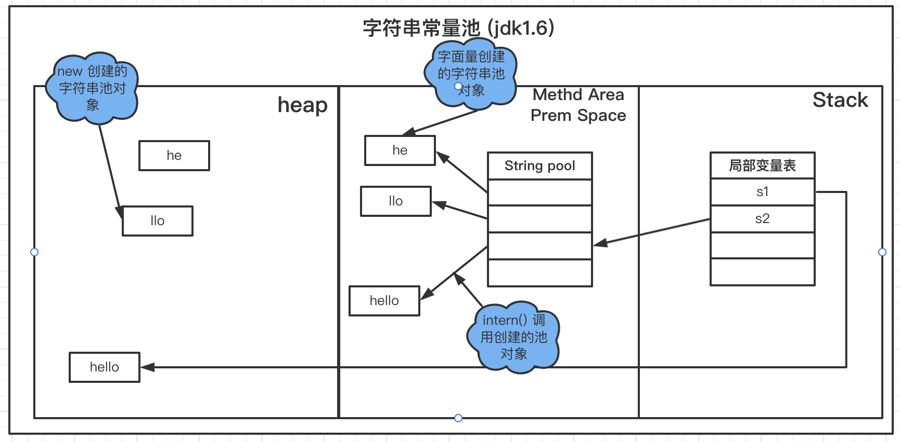
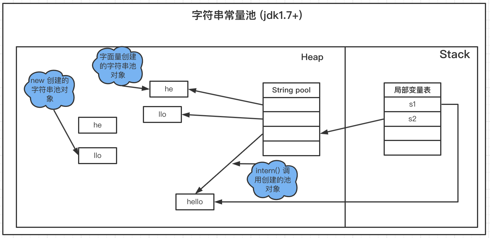

### 常量池

#### 1. Class常量池与运行时常量池

  Class常量池可以理解为是Class文件中的资源仓库。 Class文件中除了包含类的版本、字段、方法、接口等描述信息外， 还有一项信息就是常量池(constant pool table)，
  用于存放编译期生成的各种字面量(Literal)和符号引用(Symbolic References)。

##### 1.1 字面量：

      字面量就是指由字母、数字等构成的字符串或者数值常量 字面量只可以右值出现，所谓右值是指等号右边的值，如：int a=10 这里的a为左值，10为右值。在这个例子中10就是字面量。

```
int a = 10; 
int b = 22;
int c = "abcdef";
int d = "abcdefgdsaadwfa";
```

##### 1.2 符号引用:

      符号引用是编译原理中的概念，是相对于直接引用来说的。主要包括了以下三类常量： 
         
         类和接口的全限定名 
         
         字段的名称和描述符 
         
         方法的名称和描述符 
      
      上面的a，b就是字段名称，就是一种符号引用，还有Math类常量池里的 Lcom/tuling/jvm/Math 是类的全限定名， main和compute是方法名称，()是一种UTF8格式的描述符，这些都是符号引用。

      这些常量池现在是静态信息，只有到运行时被加载到内存后，这些符号才有对应的内存地址信息，这些常量池一旦被装 入内存就变成运行时常量池，
      对应的符号引用在程序加载或运行时会被转变为被加载到内存区域的代码的直接引用，也 就是我们说的动态链接了。例如，compute()这个符号引用在运行时就会被转变为compute()方法具体代码在内存中的地址，
      主要通过对象头里的类型指针去转换直接引用。

#### 2. 字符串常量池

1. 字符串的分配，和其他的对象分配一样，耗费高昂的时间与空间代价，作为最基础的数据类型，大量频繁的创建字符串，极大程度地影响程序的性能

2. JVM为了提高性能和减少内存开销，在实例化字符串常量的时候进行了一些优化

   为字符串开辟一个字符串常量池，类似于缓存区

   创建字符串常量时，首先查询字符串常量池是否存在该字符串

   存在该字符串，返回引用实例，不存在，实例化该字符串并放入池中

##### 2.1 三种字符串操作(Jdk1.7 及以上版本)

直接赋值字符串

```
 String s = "wlz"; // s指向常量池中的引用
```

      这种方式创建的字符串对象，只会在常量池中。 

      因为有"wlz"这个字面量，创建对象s的时候，JVM会先去常量池中通过 equals(key) 方法，判断是否有相同的对象 
   
      如果有，则直接返回该对象在常量池中的引用； 
      
      如果没有，则会在常量池中创建一个新对象，再返回引用。

new String();

```
 String s1 = new String("wlz"); // s1指向内存中的对象引用
```

      这种方式会保证字符串常量池和堆中都有这个对象，没有就创建，最后返回堆内存中的对象引用。步骤大致如下： 
      
      因为有"wlz"这个字面量，所以会先检查字符串常量池中是否存在字符串"wlz" 
      
      不存在，先在字符串常量池里创建一个字符串对象；再去内存中创建一个字符串对象"wlz"； 
      
      存在的话，就直接去堆内存中创建一个字符串对象"wlz"； 
      
      最后，将内存中的引用返回。

intern方法

```
String s1 = new String("wlz"); 
String s2 = s1.intern();
System.out.println(s1 == s2); //false
```

      String中的intern方法是一个 native 的方法，当调用 intern方法时，如果池已经包含一个等于此String对象的字符串 （用equals(oject)方法确定），则返回池中的字符串。否则，将intern返回的引用指向当前字符串 s1(jdk1.6版本需要将 s1 复制到字符串常量池里)。

##### 2.2 字符串常量池位置

Jdk1.6及之前： 有永久代, 运行时常量池在永久代，运行时常量池包含字符串常量池 

Jdk1.7：有永久代，但已经逐步“去永久代”，字符串常量池从永久代里的运行时常量池分离到堆里 （字符串常量池在堆中）

Jdk1.8及之后： 无永久代，运行时常量池在元空间，字符串常量池里依然在堆里

###### 2.2.1 示例

```java
package com.wlz.jvm;

import java.util.ArrayList;

/**
 *  运行时常量池 示例
 *
 *   参数:
 *   jdk6: -Xms6M -Xmx6M -XX:PermSize=6M -XX:MaxPermSize=6M
 *   jdk8: -Xms6M -Xmx6M -XX:MetaspaceSize=6M -XX:MaxMetaspaceSize=6M
 * @author wlz
 * @date 2022-03-28  8:12 上午
 */
public class RuntimeConstantPoolOOM {

    public static void main(String[] args) {
        ArrayList<String> list = new ArrayList<>();
        for (int i = 0; i < 10000000; i++) {
            String str = String.valueOf(i).intern();
            list.add(str);
        }
    }

}


// 结果:
    jdk7+ 
Exception in thread "main" java.lang.OutOfMemoryError: Java heap space
        at java.util.Arrays.copyOf(Arrays.java:3210)
        at java.util.Arrays.copyOf(Arrays.java:3181)
        at java.util.ArrayList.grow(ArrayList.java:267)
        at java.util.ArrayList.ensureExplicitCapacity(ArrayList.java:241)
        at java.util.ArrayList.ensureCapacityInternal(ArrayList.java:233)
        at java.util.ArrayList.add(ArrayList.java:464)
        at com.wlz.jvm.RuntimeConstantPoolOOM.main(RuntimeConstantPoolOOM.java:20)

   jdk6 
Exceptioninthread"main"java.lang.OutOfMemoryError:PermGenspace
```

##### 2.3 字符串常量池原理

   字符串常量池底层是hotspot的C++实现的，底层类似一个 HashTable， 保存的本质上是字符串对象的引用。 
   
   下面的代码创建了多少个 String 对象?
   
```java
package com.wlz.jvm;

/**
 * @author wlz
 * @date 2022-03-28  8:22 上午
 */
public class StringConstantPool {

    public static void main(String[] args) {
        String s1 = new String("he") + new String("llo");
        String s2 = s1.intern();

        System.out.println(s1 == s2); // ture
    }
}

// 结果 
       //在 JDK 1.6 下输出是 false，创建了 6 个对象
       // 在 JDK 1.7 及以上的版本输出是 true，创建了 5 个对象
```

###### 2.3.1 为什么输出会有这些变化呢?主要还是字符串池从永久代中脱离、移入堆区的原因， intern() 方法也相应发生了变化:

 1、在 JDK 1.6 中，调用 intern() 首先会在字符串池中寻找 equal() 相等的字符串，假如字符串存在就返回该字符串在字 符串池中的引用;假如字符串不存在，
    虚拟机会重新在永久代上创建一个实例，将 StringTable 的一个表项指向这个新 创建的实例。



 2、在 JDK 1.7 (及以上版本)中，由于字符串池不在永久代了，intern() 做了一些修改，更方便地利用堆中的对象。字符 串存在时和 JDK 1.6一样，但是字符串不存在时不再需要重新创建实例，
     可以直接指向堆上的实例。



  由上面两个图，也不难理解为什么 JDK 1.6 字符串池溢出会抛出 OutOfMemoryError: PermGen space(永久代空间) ，而在 JDK 1.7 及以上版本抛出 OutOfMemoryError: Java heap space 。