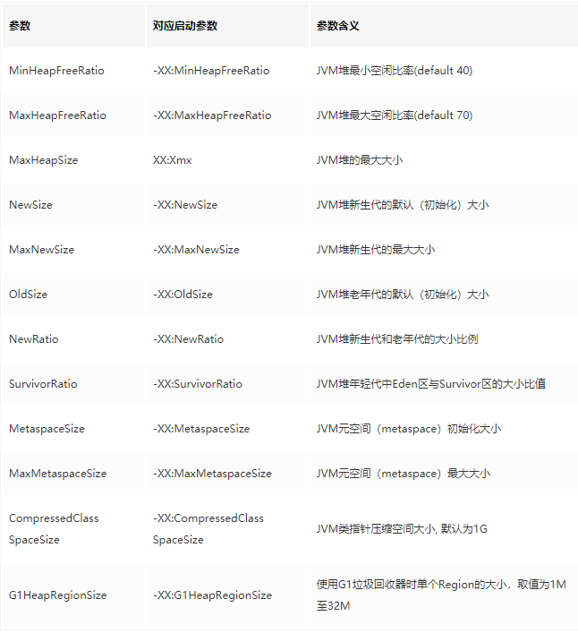

## 线上经常会遇见的几个问题：
   内存泄露；
   某个进程突然 CPU 飙升；
   线程死锁；
   响应变慢。
   
   如果遇到了以上这种问题，在 线下环境 可以有各种 可视化的本地工具 支持查看。但是一旦到 线上环境，就没有这么多的 本地调试工具 支持，
   我们该如何基于 监控工具 来进行定位问题？
   我们一般会基于 数据收集 来定位问题，而数据的收集离不开 监控工具 的处理，比如：运行日志、异常堆栈、GC 日志、线程快照、堆内存快照 等。
   为了解决以上问题，我们常用的 JVM 性能调优监控工具 大致有：jps、jstat、jstack、jmap、jhat、hprof、jinfo。

   如果想要查看 Java 进程中 线程堆栈 的信息，可以选择 jstack 命令。如果要查看 堆内存，可以使用 jmap 导出并使用 jhat 来进行分析，
   包括查看 类的加载信息，GC 算法，对象 的使用情况等。可以使用 jstat 来对 JVM 进行 统计监测，包括查看各个 区内存 和 GC 的情况，
   还可以使用 hprof 查看 CPU 使用率，统计 堆内存 使用情况。下面会详细的介绍这几个工具的用法。
    
## JVM常见监控工具 & 指令
    
### jps进程监控工具
   jps 是用于查看有权访问的 hotspot 虚拟机 的进程。当未指定 hostid 时，默认查看 本机 jvm 进程，
   否则查看指定的 hostid 机器上的 jvm 进程，此时 hostid 所指机器必须开启 jstatd 服务。
   jps 可以列出 jvm 进程 lvmid，主类类名，main 函数参数, jvm 参数，jar 名称等信息。
   
   命令格式如下：
```
usage: jps [-help]
       jps [-q] [-mlvV] [<hostid>]

Definitions:
    <hostid>:      <hostname>[:<port>]
``` 
  参数含义如下：
      
     -q: 不输出 类名称、Jar 名称 和传入 main 方法的 参数；
     -l: 输出 main 类或 Jar 的 全限定名称；
     -m: 输出传入 main 方法的 参数；
     -v: 输出传入 JVM 的参数。
     示例：jps、 jps -q、 jps -v 等
      
### 1.jinfo配置信息查看工具
   jinfo（JVM Configuration info）这个命令作用是实时查看和调整 虚拟机运行参数。
   之前的 jps -v 命令只能查看到显示 指定的参数，如果想要查看 未显示 的参数的值就要使用 jinfo 命令。
    
```
Usage:
    jinfo [option] <pid>
        (to connect to running process)
    jinfo [option] <executable <core>
        (to connect to a core file)
    jinfo [option] [server_id@]<remote server IP or hostname>
        (to connect to remote debug server)
```
   参数含义如下：
      
    pid：本地 jvm 服务的进程 ID；
    executable core：打印 堆栈跟踪 的核心文件；
    remote server IP/hostname：远程 debug 服务的 主机名 或 IP 地址；
    server id：远程 debug 服务的 进程 ID。
    示例：jinfo pid    -- 查看正在运行的 jvm 进程的所有 参数信息。
         jinfo -flags pid -- 查看正在运行的 jvm 进程的 扩展参数
         jinfo -sysprops pid  -- 查看正在运行的 jvm 进程的 环境变量信息。
         
  参数选项说明如下：
  
   
  
  查看正在运行的 jvm 进程的 扩展参数。
```
$ jinfo -flags 9871 
Attaching to process ID 31983, please wait… 
Debugger attached successfully. 
Server compiler detected. 
JVM version is 25.91-b14 
Non-default VM flags: -XX:CICompilerCount=3 -XX:InitialHeapSize=20971520 -XX:MaxHeapFreeRatio=90 -XX:MaxHeapSize=20971520 -XX:MaxNewSize=2097152 -XX:MinHeapDeltaBytes=524288 -XX:NewSize=2097152 -XX:OldSize=18874368 -XX:+PrintGC -XX:+PrintGCDetails -XX:+UseCompressedClassPointers -XX:+UseCompressedOops -XX:+UseFastUnorderedTimeStamps -XX:+UseParallelGC 
Command line: -Xmx20m -Xms20m -Xmn2m -javaagent:/opt/idea-IU-181.4668.68/lib/idea_rt.jar=34989:/opt/idea-IU-181.4668.68/bin -Dfile.encoding=UTF-8
```
   查看正在运行的 jvm 进程的所有 参数信息。
```
$ jinfo 9871
Attaching to process ID 9871, please wait...
Debugger attached successfully.
Server compiler detected.
JVM version is 25.91-b14
Java System Properties:

java.runtime.name = Java(TM) SE Runtime Environment
java.vm.version = 25.91-b14
sun.boot.library.path = /opt/jdk1.8.0_91/jre/lib/amd64
java.vendor.url = http://java.oracle.com/
java.vm.vendor = Oracle Corporation
path.separator = :
file.encoding.pkg = sun.io
java.vm.name = Java HotSpot(TM) 64-Bit Server VM
sun.os.patch.level = unknown
sun.java.launcher = SUN_STANDARD
user.country = CN
user.dir = /home/linchen/projects
java.vm.specification.name = Java Virtual Machine Specification
java.runtime.version = 1.8.0_91-b14
java.awt.graphicsenv = sun.awt.X11GraphicsEnvironment
os.arch = amd64
java.endorsed.dirs = /opt/jdk1.8.0_91/jre/lib/endorsed
java.io.tmpdir = /tmp
line.separator = 

java.vm.specification.vendor = Oracle Corporation
os.name = Linux
sun.jnu.encoding = UTF-8
java.library.path = /usr/java/packages/lib/amd64:/usr/lib64:/lib64:/lib:/usr/lib
java.specification.name = Java Platform API Specification
java.class.version = 52.0
sun.management.compiler = HotSpot 64-Bit Tiered Compilers
os.version = 4.15.0-24-generic
user.home = /home/linchen
user.timezone = 
java.awt.printerjob = sun.print.PSPrinterJob
file.encoding = UTF-8
java.specification.version = 1.8
user.name = linchen
java.class.path = /opt/jdk1.8.0_91/jre/lib/charsets.jar:/opt/jdk1.8.0_91/jre/lib/deploy.jar:/opt/jdk1.8.0_91/jre/lib/ext/cldrdata.jar:/opt/jdk1.8.0_91/jre/lib/ext/dnsns.jar:/opt/jdk1.8.0_91/jre/lib/ext/jaccess.jar:/opt/jdk1.8.0_91/jre/lib/ext/jfxrt.jar:/opt/jdk1.8.0_91/jre/lib/ext/localedata.jar:/opt/jdk1.8.0_91/jre/lib/ext/nashorn.jar:/opt/jdk1.8.0_91/jre/lib/ext/sunec.jar:/opt/jdk1.8.0_91/jre/lib/ext/sunjce_provider.jar:/opt/jdk1.8.0_91/jre/lib/ext/sunpkcs11.jar:/opt/jdk1.8.0_91/jre/lib/ext/zipfs.jar:/opt/jdk1.8.0_91/jre/lib/javaws.jar:/opt/jdk1.8.0_91/jre/lib/jce.jar:/opt/jdk1.8.0_91/jre/lib/jfr.jar:/opt/jdk1.8.0_91/jre/lib/jfxswt.jar:/opt/jdk1.8.0_91/jre/lib/jsse.jar:/opt/jdk1.8.0_91/jre/lib/management-agent.jar:/opt/jdk1.8.0_91/jre/lib/plugin.jar:/opt/jdk1.8.0_91/jre/lib/resources.jar:/opt/jdk1.8.0_91/jre/lib/rt.jar:/home/linchen/IdeaProjects/core_java/target/classes:/home/linchen/.m2/repository/io/netty/netty-all/4.1.7.Final/netty-all-4.1.7.Final.jar:/home/linchen/.m2/repository/junit/junit/4.12/junit-4.12.jar:/home/linchen/.m2/repository/org/hamcrest/hamcrest-core/1.3/hamcrest-core-1.3.jar:/home/linchen/.m2/repository/com/lmax/disruptor/3.3.0/disruptor-3.3.0.jar:/home/linchen/.m2/repository/com/rabbitmq/amqp-client/5.3.0/amqp-client-5.3.0.jar:/home/linchen/.m2/repository/org/slf4j/slf4j-api/1.7.25/slf4j-api-1.7.25.jar:/opt/idea-IU-181.4668.68/lib/idea_rt.jar
java.vm.specification.version = 1.8
sun.arch.data.model = 64
sun.java.command = com.own.learn.jvm.JinfoTest
java.home = /opt/jdk1.8.0_91/jre
user.language = zh
java.specification.vendor = Oracle Corporation
awt.toolkit = sun.awt.X11.XToolkit
java.vm.info = mixed mode
java.version = 1.8.0_91
java.ext.dirs = /opt/jdk1.8.0_91/jre/lib/ext:/usr/java/packages/lib/ext
sun.boot.class.path = /opt/jdk1.8.0_91/jre/lib/resources.jar:/opt/jdk1.8.0_91/jre/lib/rt.jar:/opt/jdk1.8.0_91/jre/lib/sunrsasign.jar:/opt/jdk1.8.0_91/jre/lib/jsse.jar:/opt/jdk1.8.0_91/jre/lib/jce.jar:/opt/jdk1.8.0_91/jre/lib/charsets.jar:/opt/jdk1.8.0_91/jre/lib/jfr.jar:/opt/jdk1.8.0_91/jre/classes
java.vendor = Oracle Corporation
file.separator = /
java.vendor.url.bug = http://bugreport.sun.com/bugreport/
sun.io.unicode.encoding = UnicodeLittle
sun.cpu.endian = little
sun.desktop = gnome
sun.cpu.isalist = 

VM Flags:
Non-default VM flags: -XX:CICompilerCount=3 -XX:InitialHeapSize=20971520 -XX:MaxHeapFreeRatio=90 -XX:MaxHeapSize=20971520 -XX:MaxNewSize=2097152 -XX:MinHeapDeltaBytes=524288 -XX:NewSize=2097152 -XX:OldSize=18874368 -XX:+PrintGC -XX:+PrintGCDetails -XX:+UseCompressedClassPointers -XX:+UseCompressedOops -XX:+UseFastUnorderedTimeStamps -XX:+UseParallelGC 
Command line:  -Xmx20m -Xms20m -Xmn2m -javaagent:/opt/idea-IU-181.4668.68/lib/idea_rt.jar=34989:/opt/idea-IU-181.4668.68/bin -Dfile.encoding=UTF-8
```
  查看正在运行的 jvm 进程的 环境变量信息。
```
$ jinfo -sysprops 9871 
Attaching to process ID 9871, please wait… 
Debugger attached successfully. 
Server compiler detected. 
JVM version is 25.91-b14 
java.runtime.name = Java(TM) SE Runtime Environment 
java.vm.version = 25.91-b14 
sun.boot.library.path = /opt/jdk1.8.0_91/jre/lib/amd64 
java.vendor.url = http://java.oracle.com/ 
java.vm.vendor = Oracle Corporation 
path.separator = : 
file.encoding.pkg = sun.io 
java.vm.name = Java HotSpot(TM) 64-Bit Server VM 
sun.os.patch.level = unknown 
sun.java.launcher = SUN_STANDARD 
user.country = CN 
user.dir = /home/linchen/projects 
java.vm.specification.name = Java Virtual Machine Specification 
java.runtime.version = 1.8.0_91-b14 
java.awt.graphicsenv = sun.awt.X11GraphicsEnvironment 
os.arch = amd64 
java.endorsed.dirs = /opt/jdk1.8.0_91/jre/lib/endorsed 
java.io.tmpdir = /tmp 
line.separator =
```

### 2.jstat信息统计监控工具
  jstat 是用于识别 虚拟机 各种 运行状态信息 的命令行工具。它可以显示 本地 或者 远程虚拟机 进程中的 类装载、内存、垃圾收集、
  jit 编译 等运行数据，它是 线上 定位 jvm 性能 的首选工具。

  jstat 工具提供如下的 jvm 监控功能：
    
    1.类的加载 及 卸载 的情况；
    2.查看 新生代、老生代 及 元空间（MetaSpace）的 容量 及使用情况；
    3.查看 新生代、老生代 及 元空间（MetaSpace）的 垃圾回收情况，包括垃圾回收的 次数，垃圾回收所占用的 时间；
    4.查看 新生代 中 Eden 区及 Survior 区中 容量 及 分配情况 等。
  命令格式如下：
```
Usage: jstat -help|-options
       jstat -<option> [-t] [-h<lines>] <vmid> [<interval> [<count>]]
```
  参数含义如下:

    option: 参数选项。
        -t: 可以在打印的列加上 timestamp 列，用于显示系统运行的时间。
        -h: 可以在 周期性数据 的时候，可以在指定输出多少行以后输出一次 表头。
    vmid: Virtual Machine ID（进程的 pid）。
    lines: 表头 与 表头 的间隔行数。
    interval: 执行每次的 间隔时间，单位为 毫秒。
    count: 用于指定输出记录的 次数，缺省则会一直打印。
    示例:jstat -gc pid 
        jstat -gc pid 250 10 -- 250(时间ms) 10 打印10次
  参数选项说明如下：
    
    class: 显示 类加载 ClassLoad 的相关信息；
    compiler: 显示 JIT 编译 的相关信息；
    gc: 显示和 gc 相关的 堆信息；
    gccapacity: 显示 各个代 的 容量 以及 使用情况；
    gcmetacapacity: 显示 元空间 metaspace 的大小；
    gcnew: 显示 新生代 信息；
    gcnewcapacity: 显示 新生代大小 和 使用情况；
    gcold: 显示 老年代 和 永久代 的信息；
    gcoldcapacity: 显示 老年代 的大小；
    gcutil: 显示 垃圾回收信息；
    gccause: 显示 垃圾回收 的相关信息（同 -gcutil），同时显示 最后一次 或 当前 正在发生的垃圾回收的 诱因；
    printcompilation: 输出 JIT 编译 的方法信息；

#### 2.1. class 
   显示和监视 类装载、卸载数量、总空间 以及 耗费的时间。
```
$ jstat -class 9871
Loaded  Bytes     Unloaded  Bytes      Time
  7271 13325.8        1      0.9       2.98
```
  参数列表及含义如下：
  
  

#### 2.2. compiler 
   显示虚拟机 实时编译（JIT）的 次数 和 耗时 等信息。
```
$ jstat -compiler 9871
Compiled   Failed  Invalid  Time     FailedType   FailedMethod
  3886        0       0     1.29          0
```
  参数列表及含义如下：
  
  

#### 2.3. gc 
   显示 垃圾回收（gc）相关的 堆信息，查看 gc 的 次数 及 时间。
```
$ jstat -gc 9871
 S0C      S1C    S0U    S1U      EC       EU        OC         OU       MC     MU    CCSC   CCSU   YGC     YGCT    FGC    FGCT     GCT   
20480.0 10752.0  0.0    0.0   262128.0 130750.7  165376.0   24093.7   35456.0 33931.0 4992.0 4582.0      5    0.056   2      0.075    0.131
```
  比如下面输出的是 GC 信息，采样 时间间隔 为 250ms，采样数为 4：
```
$ jstat -gc 9871 250 4
 S0C      S1C    S0U    S1U      EC       EU        OC         OU       MC     MU    CCSC   CCSU   YGC     YGCT    FGC    FGCT     GCT   
20480.0 10752.0  0.0    0.0   262144.0 130750.7  165376.0   24093.7   35456.0 33931.0 4992.0 4582.0      5    0.056   2      0.075    0.131
20480.0 10752.0  0.0    0.0   262872.0 130750.7  165376.0   24093.7   35456.0 33931.0 4992.0 4582.0      5    0.056   2      0.075    0.131
20480.0 10752.0  0.0    0.0   262720.0 130750.7  165376.0   24093.7   35456.0 33931.0 4992.0 4582.0      5    0.056   2      0.075    0.131
20480.0 10752.0  0.0    0.0   262446.0 130750.7  165376.0   24093.7   35456.0 33931.0 4992.0 4582.0      5    0.056   2      0.075    0.131
```

  参数列表及含义如下：
  
  

#### 2.4. gccapacity 
   显示 虚拟机内存 中三代 年轻代（young)，老年代（old），元空间（metaspace）对象的使用和占用大小。
```
$ jstat -gccapacity 9871
 NGCMN     NGCMX     NGC      S0C     S1C      EC       OGCMN      OGCMX       OGC        OC         MCMN   MCMX       MC        CCSMN  CCSMX     CCSC      YGC    FGC 
 87040.0 1397760.0 372736.0 20480.0 10752.0 262144.0   175104.0  2796544.0   165376.0   165376.0      0.0 1079296.0  35456.0      0.0 1048576.0   4992.0      5     2
```
  参数列表及含义如下：
  
  

#### 2.5. gcmetacapacity 
   显示 元空间（metaspace）中 对象 的信息及其占用量。
```
$ jstat -gcmetacapacity 9871
MCMN       MCMX        MC       CCSMN      CCSMX       CCSC     YGC   FGC    FGCT     GCT   
0.0      1079296.0   35456.0     0.0     1048576.0    4992.0     5     2    0.075    0.131
```
  参数列表及含义如下：
  
  
 
#### 2.6. gcnew 
   显示 年轻代对象 的相关信息，包括两个 survivor 区和 一个 Eden 区。
```
$ jstat -gcnew 9871
 S0C      S1C      S0U    S1U TTv MTT  DSS      EC       EU       YGC     YGCT  
20480.0 10752.0    0.0    0.0  6  15 20480.0 262144.0 131406.0      5    0.056

```
  参数列表及含义如下：
  
  

#### 2.7. gcnewcapacity 
   显示 年轻代对象 的相关信息，包括两个 survivor 区和 一个 Eden 区。
```
$ jstat -gcnewcapacity 9871
  NGCMN      NGCMX       NGC      S0CMX     S0C     S1CMX     S1C       ECMX        EC      YGC   FGC 
 87040.0   1397760.0   372736.0  465920.0  20480.0 465920.0  10752.0  1396736.0   262144.0   5     2
```
  参数列表及含义如下：
  
  

#### 2.8. gcold 
   显示 老年代对象 的相关信息。
```
$ jstat -gcold 9871
   MC       MU      CCSC     CCSU       OC          OU       YGC    FGC    FGCT     GCT   
 35456.0  33931.0   4992.0   4582.0    165376.0     24093.7      5     2    0.075    0.131
```
  参数列表及含义如下：
  
  


#### 2.9. gcoldcapacity 
   查看 老年代 对象的信息及其占用量。
```
$ jstat -gcoldcapacity 9871
   OGCMN       OGCMX        OGC         OC        YGC   FGC    FGCT     GCT   
  175104.0   2796544.0    165376.0    165376.0     5     2    0.075    0.131
```
  参数列表及含义如下：
  
  

#### 2.10. gcutil 
   显示 垃圾回收（gc）过程中的信息，包括各个 内存的使用占比，垃圾回收 时间 和回收 次数。
```
$ jstat -gcutil 9871
   S0     S1     E      O      M     CCS     YGC     YGCT    FGC    FGCT     GCT   
  0.00   0.00  50.13  14.57  95.70  91.79      5    0.056     2    0.075    0.131
```
  参数列表及含义如下：
  
  

### 3.jmap堆内存统计工具
   jmap (JVM Memory Map) 命令用来查看 堆内存 使用状况，一般结合 jhat 使用，用于生成 heap dump 文件。
   jmap 不仅能生成 dump 文件，还可以查询 finalize 执行队列、Java 堆 和 元空间 metaspace 的详细信息，
   如当前 使用率、当前使用的是哪种 收集器 等等。
    
    如果不使用这个命令，还可以使用 -XX:+HeapDumpOnOutOfMemoryError 参数来让虚拟机出现 OOM 的时候，自动生成 dump 文件。
   
   命令格式如下：
```
Usage:
    jmap [option] <pid>
        (to connect to running process)
    jmap [option] <executable <core>
        (to connect to a core file)
    jmap [option] [server_id@]<remote server IP or hostname>
        (to connect to remote debug server)
```
   参数含义如下：
    
    pid：本地 jvm 服务的进程 ID；
    executable core：打印 堆栈跟踪 的核心文件；
    remote server IP/hostname：远程 debug 服务的 主机名 或 IP 地址；
    server id：远程 debug 服务的 进程 ID。
    示例：
        jmap -heap pid  -- 显示堆中摘要信息
        jmap -histo pid   --  显示堆中对象的统计信息
        jmap -histo pid > ./log.txt  -- 将堆中对象的统计信息输出到文件
         jmap ‐dump:format=b,file=eureka.hprof pid 导出堆内存文件 
         （也可以设置内存溢出自动导出dump文件(内存很大的时候，可能会导不出来) 1. -XX:+HeapDumpOnOutOfMemoryError 2. -XX:HeapDumpPath=./ （路径））
   
  参数选项说明如下：
  
   

  注意：dump 内存快照分析基本上包含了 histo、clstats、finalizerinfo 等功能。


#### 3.1. heap 
   显示 堆 中的摘要信息。包括 堆内存 的使用情况，正在使用的 GC 算法、堆配置参数 和 各代中堆内存 使用情况。
   可以用此来判断内存目前的 使用情况 以及 垃圾回收 情况。
```
$ jmap -heap 9871
Attaching to process ID 9871, please wait...
Debugger attached successfully.
Server compiler detected.
JVM version is 25.101-b13

using thread-local object allocation.
Parallel GC with 2 thread(s)

Heap Configuration:
   MinHeapFreeRatio         = 0
   MaxHeapFreeRatio         = 100
   MaxHeapSize              = 2684354560 (2560.0MB)
   NewSize                  = 1073741824 (1024.0MB)
   MaxNewSize               = 1073741824 (1024.0MB)
   OldSize                  = 1610612736 (1536.0MB)
   NewRatio                 = 2
   SurvivorRatio            = 8
   MetaspaceSize            = 21807104 (20.796875MB)
   CompressedClassSpaceSize = 1073741824 (1024.0MB)
   MaxMetaspaceSize         = 17592186044415 MB
   G1HeapRegionSize         = 0 (0.0MB)

Heap Usage:
PS Young Generation
Eden Space:
   capacity = 852492288 (813.0MB)
   used     = 420427144 (400.95056915283203MB)
   free     = 432065144 (412.04943084716797MB)
   49.31741317993014% used
From Space:
   capacity = 113770496 (108.5MB)
   used     = 2299712 (2.19317626953125MB)
   free     = 111470784 (106.30682373046875MB)
   2.021360617079493% used
To Space:
   capacity = 107479040 (102.5MB)
   used     = 0 (0.0MB)
   free     = 107479040 (102.5MB)
   0.0% used
PS Old Generation
   capacity = 1610612736 (1536.0MB)
   used     = 50883368 (48.526161193847656MB)
   free     = 1559729368 (1487.4738388061523MB)
   3.1592552860577903% used

27595 interned Strings occupying 3138384 bytes.
```
  参数列表及含义如下：
  
  

#### 3.2. histo 
   打印堆的 对象统计，包括 对象实例数、内存大小 等等。因为在 histo:live 前会进行 full gc，如果带上 live 则只统计 活对象。
   不加 live 的堆大小要大于加 live 堆的大小。
```
$ jmap -histo:live 9871
 num     #instances         #bytes  class name
----------------------------------------------
   1:         50358        7890344  [C
   2:         22887        2014056  java.lang.reflect.Method
   3:          3151        1485512  [B
   4:         49267        1182408  java.lang.String
   5:          7836         871384  java.lang.Class
   6:         24149         772768  java.util.concurrent.ConcurrentHashMap$Node
   7:         20785         482256  [Ljava.lang.Class;
   8:          8357         435248  [Ljava.lang.Object;
   9:         10035         401400  java.util.LinkedHashMap$Entry
  10:          4803         369488  [Ljava.util.HashMap$Node;
  11:         10763         344416  java.util.HashMap$Node
  12:          5205         291480  java.util.LinkedHashMap
  13:          3055         219960  java.lang.reflect.Field
  14:           120         193408  [Ljava.util.concurrent.ConcurrentHashMap$Node;
  15:         11224         179584  java.lang.Object
  16:          1988         146152  [Ljava.lang.reflect.Method;
  17:          3036         145728  org.aspectj.weaver.reflect.ShadowMatchImpl
  18:          1771         141680  java.lang.reflect.Constructor
  19:          4903         117672  org.springframework.core.MethodClassKey
  20:          3263         104416  java.lang.ref.WeakReference
  21:          2507         100280  java.lang.ref.SoftReference
  22:          2523          97600  [I
  23:          3036          97152  org.aspectj.weaver.patterns.ExposedState
  24:          2072          95280  [Ljava.lang.String;
  25:           954          91584  org.springframework.beans.GenericTypeAwarePropertyDescriptor
  26:          1633          91448  java.lang.Class$ReflectionData
  27:          3142          90520  [Z
  28:          1671          80208  java.util.HashMap
  29:          3244          77856  java.util.ArrayList
  30:          3037          72880  [Lorg.aspectj.weaver.ast.Var;
  31:          1809          72360  java.util.WeakHashMap$Entry
  32:          1967          62944  java.util.LinkedList
```
  其中，class name 是 对象类型，对象 缩写类型 与 真实类型 的对应说明如下：
  
  

#### 3.3. dump 
   dump 用于导出内存转储快照。常用的方式是通过 jmap 把进程 内存使用情况 dump 到文件中，再用 jhat 分析查看。
   jmap 进行 dump 的命令格式如下：
```
jmap -dump:format=b,file=dumpFileName pid 
```
  参数含义如下：
  
  
  
  通过 jmap 导出 内存快照，文件命名为 dump.dat：
```
jmap -dump:format=b,file=dump.dat 9871
Dumping heap to /Users/XXX/dump.dat ...
Heap dump file created
```

   导出的 dump 文件可以通过 MAT、VisualVM 和 jhat、perfMa 等工具查看分析，后面会详细介绍。

##### 3.3.1 示例代码

```java
package com.wlz.jvm;

import java.util.ArrayList;
import java.util.List;
import java.util.UUID;

/**
 * @author wlz
 * @date 2022-03-21  9:22 下午
 */
public class OOMTest {

    // JVM设置
    // -Xms10M -Xmx10M -XX:+PrintGCDetails -XX:+HeapDumpOnOutOfMemoryError -XX:HeapDumpPath=/Users/wlz/Desktop/jvm.dump
    public static void main(String[] args) {

        List<Object> list = new ArrayList<>();
        int i = 0;
        int j = 0;
        while (true) {
            list.add(new User(i++, UUID.randomUUID().toString()));
            new User(j--, UUID.randomUUID().toString());
        }
    }
}

```

可以用jvisualvm命令工具导入该dump文件分析

### 4.jhat堆快照分析工具
   jhat（JVM Heap Analysis Tool）命令通常与 jmap 搭配使用，用来分析 jmap 生成的 dump。
   jhat 内置了一个微型的 HTTP/HTML 服务器，生成 dump 的分析结果后，可以在浏览器中查看。
    
    注意：一般不会直接在 服务器 上 进行分析，因为使用 jhat 是一个 耗时 并且 耗费硬件资源 的过程，一般的做法是，
    把 服务器 生成的 dump 文件复制到 本地 或 其他机器 上进行分析。

  命令格式如下：
```
Usage:  jhat [-stack <bool>] [-refs <bool>] [-port <port>] [-baseline <file>] [-debug <int>] [-version] [-h|-help] <file>

	-J<flag>          Pass <flag> directly to the runtime system. For
			  example, -J-mx512m to use a maximum heap size of 512MB
	-stack false:     Turn off tracking object allocation call stack.
	-refs false:      Turn off tracking of references to objects
	-port <port>:     Set the port for the HTTP server.  Defaults to 7000
	-exclude <file>:  Specify a file that lists data members that should
			  be excluded from the reachableFrom query.
	-baseline <file>: Specify a baseline object dump.  Objects in
			  both heap dumps with the same ID and same class will
			  be marked as not being "new".
	-debug <int>:     Set debug level.
			    0:  No debug output
			    1:  Debug hprof file parsing
			    2:  Debug hprof file parsing, no server
	-version          Report version number
	-h|-help          Print this help and exit
	<file>            The file to read
```
  参数含义如下：
  
  

  前面提到，通过 jmap dump 出来的文件可以用 MAT、VisualVM 等工具查看，这里我们用 jhat 查看：
```
$ jhat -port 7000 dump.dat
Reading from dump.dat...
Dump file created Sun Aug 12 12:15:02 CST 2018
Snapshot read, resolving...
Resolving 1788693 objects...
Chasing references, expect 357 dots.....................................................................................................................................................................................................................................................................................................................................................................
Eliminating duplicate references.....................................................................................................................................................................................................................................................................................................................................................................
Snapshot resolved.
Started HTTP server on port 7000
Server is ready.
```
  打开浏览器，输入 http://localhost:7000，查看 jhat 的分析报表页面：

### 5.jstack堆栈跟踪工具
   jstack 用于生成 java 虚拟机当前时刻的 线程快照。线程快照 是当前 java 虚拟机内 每一条线程 正在执行的 方法堆栈 的 集合。
   生成线程快照的主要目的是定位线程出现 长时间停顿 的原因，如 线程间死锁、死循环、请求外部资源 导致的 长时间等待 等等。
   
   线程出现 停顿 的时候，通过 jstack 来查看 各个线程 的 调用堆栈，就可以知道没有响应的线程到底在后台做什么事情，或者等待什么资源。
   如果 java 程序 崩溃 生成 core 文件，jstack 工具可以通过 core 文件获取 java stack 和 native stack 的信息，从而定位程序崩溃的原因。
   
  命令格式如下：
```
Usage:
    jstack [-l] <pid>
        (to connect to running process)
    jstack -F [-m] [-l] <pid>
        (to connect to a hung process)
    jstack [-m] [-l] <executable> <core>
        (to connect to a core file)
    jstack [-m] [-l] [server_id@]<remote server IP or hostname>
        (to connect to a remote debug server)
```
  参数含义如下：
    
    pid：本地 jvm 服务的进程 ID；
    executable core：打印 堆栈跟踪 的核心文件；
    remote server IP/hostname：远程 debug 服务的 主机名 或 IP 地址；
    server id：远程 debug 服务的 进程 ID。
    示例:
        jstack -l pid
        jstack -F pid 
        jstack pid     查找死锁

  
  参数选项说明如下:
  
   
  
    注意：在实际运行中，往往一次 dump 的信息，还不足以确认问题。建议产生三次 dump 信息，如果每次 dump 都指向同一个问题，才能确定问题的典型性。

#### jstack找出占用cpu最高的线程堆栈信息

  1. 使用命令top -p <pid> ，显示你的java进程的内存情况，pid是你的java进程号，比如19661
  
  2，按H，获取每个线程的内存情况

  3，找到内存和cpu占用最高的线程tid，比如19664 
  
  4，转为十六进制得到 0x4cd0，此为线程id的十六进制表示

  5，执行 jstack 19663|grep -A 10 4cd0，得到线程堆栈信息中 4cd0 这个线程所在行的后面10行，从堆栈中可以发现导致cpu飙高的调用方法

  6，查看对应的堆栈信息找出可能存在问题的代码

 
#### 5.1. 系统线程状态 
   在 dump 文件里，值得关注的 线程状态 有：
    
    1.死锁：Deadlock（重点关注）
    2.执行中：Runnable
    3.等待资源：Waiting on condition（重点关注）
    4.等待获取监视器：Waiting on monitor entry（重点关注）
    5.暂停：Suspended
    6.对象等待中：Object.wait() 或 TIMED_WAITING
    7.阻塞：Blocked（重点关注）
    8.停止：Parked
    
  具体的含义如下所示：
  
    (a). Deadlock
        死锁线程，一般指多个线程调用期间发生 资源的相互占用，导致一直等待无法释放的情况。
    (b). Runnable
        一般指该线程正在 执行状态 中，该线程占用了 资源，正在 处理某个请求。有可能正在传递 SQL 到数据库执行，有可能在对某个文件操作，
        有可能进行数据类型等转换。
    (c). Waiting on condition
        该状态在线程等待 某个条件 的发生。具体是什么原因，可以结合 stacktrace 来分析。线程处于这种 等待状态，一旦有数据准备好读之后，线程会重新激活，读取并处理数据。


### 参考
   https://juejin.im/post/6844903655456374792#heading-5


