## JAVA日志体系 

### 1. 日志框架发展史 

  早期，在日志里使用了log4j框架来输出，于是代码是这么写的

```java
import org.apache.log4j.Logger;

public class Test {
    public static void main(String[] args) {
        Logger logger = Logger.getLogger(Test.class);
        logger.trace("trace.....");
    }
}
```

  但是随着时间的流逝， sun公司对log4j的出现内心隐隐表示嫉妒.于是在jdk1.4版本后，增加了一个包为java.util.logging, 简称jul, 
  用以对抗log4j. 于是你的代码里得把日志框架改为jul, 这时候只能一行行的将log4j 的api 改为 jul 的api, 如下所示: 
  
```java
import java.util.logging.Logger;
public class Test {
    public static void main(String[] args) {
        Logger logger = Logger.getLogger(Test.class.getName());
        logger.finest("finest.....");
    }
}
```

  可以看出，api 是完成不同的，那么有没有办法，将这些api 抽象出来，这样以后调用的时候，就调用这些接口就好了呢？ 
  
  这个时候jcl(Jakarta Commons Logging) 出现了，说jcl 可能有些陌生，但是说 commons-logging-xx.jar 组件，可能会有些熟悉。
  jcl 只提供Log接口，具体的实现则是在运行时动态寻找。这样一来组价开发者只需要针对jcl 接口开发，而调用组件的应用程序则可以在运行时
  搭配自己喜好的日志实践工具。jcl 可以实现的集成方案如下:

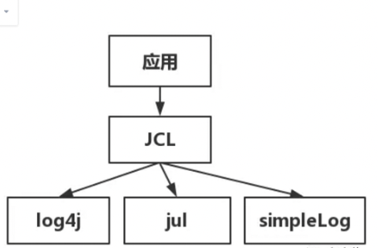

  jcl 默认的配置： 如果能够找到Log4j 则默认使用Log4j 实现，如果没有则使用jul(jdk自带的)实现，再没有则使用jcl 内部提供的SimpleLog 实现。 
  
  如是，代码里变成了这样:

```java
import org.apache.commons.logging.Log;
import org.apache.commons.logging.LogFactory;

public class Test {
  public static void main(String[] args) {
    Log log = Logger.getLog(Test.class);
    log.trace("trace ....");
  }
}
```

  至于这个Log 具体的实现类，JCL会在ClassLoader中进行查找，这样做，有三个缺点，一是效率低，二是容易引发混乱，三是在使用了自定义ClassLoader 的程序中，使用jcl 
  会引发内存泄漏. 
  
  于是log4j的作者觉得jcl不好用，自己又写了一个新的接口api, 就是slf4j. slf4j的集成图如下: 

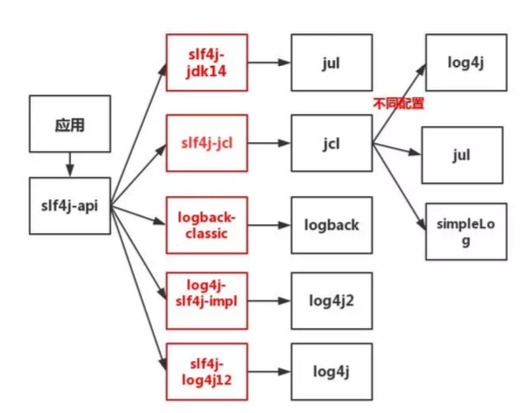

  如图所示, 应用调了slf4j-api ，即门面接口，日志门面接口本身通常没有实际的日志输出能力，它的底层还是需要去调用具体的日志框架API的，
  也就是实际上它需要跟具体的日志框架结合使用，由于具体日志框架比较多，而且互相也大都不兼容，日志门面接口想要实现与任意日志框架结合可能
  需要对应的桥接器，上图红框中的组件即是对应的各种桥接器

  那么我们代码中需要写日志，变成了这样写:

```java
import com.sun.source.doctree.TextTree;
import org.slf4j.Logger;
import org.slf4j.LoggerFactory;

public class Test {
  public static void main(String[] args) {
    Logger logger = LoggerFactory.getLogger(Test.class);
    logger.info("info .....");
  }
}
```

  在代码中，并不会出现具体日志框架的api。程序根据classpath中的桥接器类型，和日志框架类型，判断logger.info 应该以什么框架输出 
  
   注意： 如果classpath 中不小心引入了两个桥接器，那么会直接报错。 
   
   因此，在阿里的开发者手册中有这么一条: 
    
    强制: 应用中不可直接使用日志系统(log4j、logback) 中的API,而应依赖使用日志框架 SLF4J 中的api, 使用门面模式的日志框架，有利于
    维护和各个类的日志处理方式的统一. 


   如果要将jcl 或jul 转是slf4j 呢? 

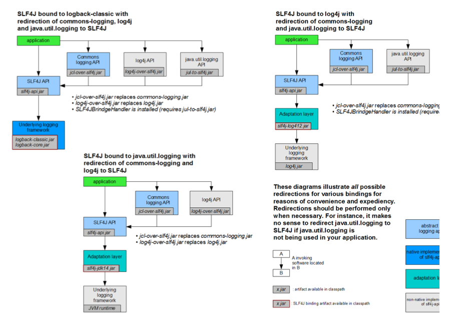

### 2. 日志实战 

#### 2.1 案例1 

  一个项目中，一个模块使用log4j, 另一个模块使用slf4j+log4j2，如何统一输出? 

  在很多项目中，这种情况是很常见的。我曾经见过有些项目，因为研发不懂底层的日志原理，日志文件里头既有 log4j.properties,又有log4j2.xml，各种API混用，惨不忍睹! 
  还有人用着jul的API，然后拿着log4j.properties，跑来问我，为什么配置不生效!简直是一言难尽! 
  OK，回到我们的问题，如何统一输出!OK，这里就要用上slf4j的适配器，slf4j提供了各种各样的适配器，用来将某种日志框架 委托给slf4j。
  其最明显的集成工作方式有如下:

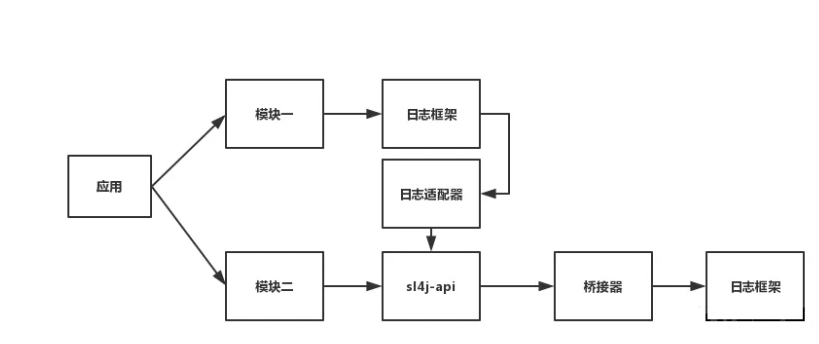

  进行选择填空，将案例里的条件填入，根据题意应该选log4j-over-slf4j 适配器， 如实变成下面: 

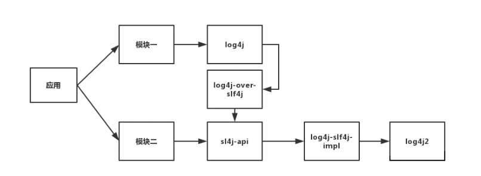

就可以实现日志统一为log4j2来输出! 

  ps:根据适配器工作原理的不同，被适配的日志框架并不是一定要删除!以上图为例，
  log4j这个日志框架删不删都可以，你只要 能保证log4j的加载顺序在log4j-over-slf4j后即可。
  因为log4j-over-slf4j这个适配器的工作原理是，内部提供了和log4j一模一样 的api接口，因此你在程序中调用log4j的api的时候，
  你必须想办法让其走适配器的api。如果你删了log4j这个框架，那你程序里 肯定是走log4j-over-slf4j这个组件里的api。
  如果不删log4j，只要保证其在classpth里的顺序比log4j前即可!

#### 2.2 案例2 

  如何让spring以log4j2的形式输出?

  spring 默认使用的是jcl输出日志，由于此时并没有引入Log4j的日志框架，jcl 会以jul 作为日志框架，此时集成图如下: 

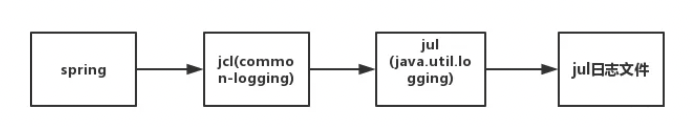

  而自己的应用中, 采用了 slf4j+log4j-core ，即log4j进行日志记录，那么此时集成图为: 

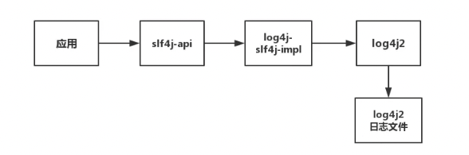

  那我们现在需要让spring以log4j2的形式输出?怎么办?

  第一种方案，走jcl-over-slf4j适配器，此时集成图就变成下面这样了

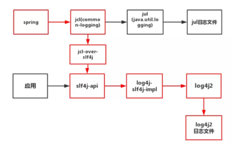

  spring框架中遇到日志输出的语句，就会如上图红线流程一样，最终以log4J2的形式输出! OK，有第二种方案么?

  有，走jul-to-slf4j适配器，此时集成图如下

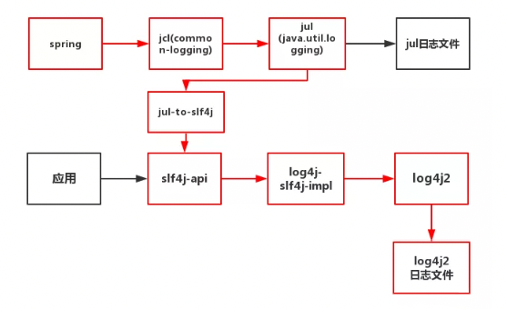

  ps:这种情况下，记得在代码中执行
  
```
  SLF4JBridgeHandler.removehandlersForRootLogger();
  SLF4JBridgeHandler.install();
```

  这样jul-to-slf4j适配器才能正常工作，详情可以查询该适配器工作原理。

  假设，我们在应用中调用了sl4j-api，但是呢，你引了四个jar包，slf4j-api-xx.jar,slf4j-log4j12-xx.jar,log4j-xx.jar,log4j-over- slf4j-xx.jar，于是你就会出现如下尴尬的场面

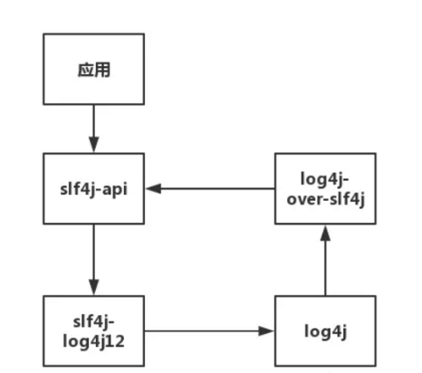

  如上图所示，在这种情况下，你调用了slf4j-api，就会陷入死循环中!slf4j-api去调了slf4j-log4j12,slf4j-log4j12又去调用了 log4j，log4j去调用了log4j-over-slf4j。最终，log4j-over-slf4j又调了slf4j-api，陷入死循环!

### 3. spring4和spring5日志中的不同

#### 3.1 spring4 日志体系

##### 3.1.1 构建spring4 项目 
 
  采用java+注解的方式快速构建，pom 中只引入spring-context 包 
  
```xml
 <dependencies>
        <dependency>
            <groupId>org.springframework</groupId>
            <artifactId>spring-context</artifactId>
            <version>4.3.14.RELEASE</version>
        </dependency>
    </dependencies>
```

```java
public class LogTest {

    public static void main(String[] args) {
        AnnotationConfigApplicationContext context = new AnnotationConfigApplicationContext(AppConfig.class);

    }
}
```

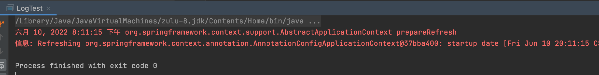

