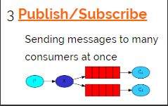

### 1. Rabbitmq 基本概念

#### 1.1 RabbitMQ 简介

AMQP，即 Advanced Message Queuing Protocol（高级消息队列协议），是一个网络协议，是应用层协议的一个开放标准，
为面向消息的中间件设计。基于此协议的客户端与消息中间件可传递消息，并不受客户端/中间件不同产品，不同的开发语言等条件的限制。
2006年，AMQP 规范发布。类比HTTP。

2007年，Rabbit 技术公司基于 AMQP 标准开发的 RabbitMQ 1.0 发布。RabbitMQ 采用 Erlang 语言开发。
Erlang 语言由 Ericson 设计，专门为开发高并发和分布式系统的一种语言，在电信领域使用广泛。

### 2. RabbitMQ 各个成员 
   
   Server : 又称Broker, 接受客户端连接, 实现AMQP实体服务
   
   Connection : 连接, 应用程序与Broker的网络连接
   
   Channel : 网络信道, 几乎所有的操作都在Channel中进行, Channel是进行消息读写的通道。客户端可以建立多个Channel, 每个Channel代表一个会话任务。
   
   Message : 消息, 服务器和应用程序之间传送的数据, 有Properties和Body组成。Properties可以对消息进行修饰, 比如消息的优先级, 延迟等高级特性; Body就是消息体内容。
   
   Virtual Host : 虚拟地址, 用于进行逻辑隔离, 最上层的消息路由。一个Virtual Host里面可以有若干个Exchange和Queue, 同一个Virtual Host里面不能有相同名称的Exchange或Queue
   
   Exchange : 交换机, 用于接收消息, 根据路由键转发消息到绑定的队列
   
   Binding : Exchange和Queue之间的虚拟连接, binding中可以包含routing key
   
   Routing Key : 一个路由规则, 虚拟机可用它来确定如何路由一个特定消息
   
   Queue : 也成Message Queue, 消息队列, 用于保存消息并将它们转发给消费者

#### 2.1 RabbitMQ成员简介

##### 2.3.1 Binding-绑定
   
   Exchange和Exchange, Queue之间的连接关系
   
   绑定中可以包含RoutingKey或者参数

##### 2.3.2 Queue-消息队列
   
   消息队列, 实际存储消息数据
   
   Durability : 是否持久化
   
   Auto delete : 如选yes,代表当最后一个监听被移除之后, 该Queue会自动被删除
   
##### 2.3.3 Message-消息
   
   服务和应用程序之间传送的数据
   
   本质上就是一段数据, 由Properties和Payload(Body)组成
   
   常用属性 : delivery mode, headers(自定义属性)
   
   其他属性
   
       content_type, content_encoding, priority
       correlation_id : 可以认为是消息的唯一id
       replay_to : 重回队列设定
       expiration : 消息过期时间
       message_id : 消息id
       timestamp, type, user_id, app_id, cluster_id
   
##### 2.3.4 Virtual Host-虚拟主机 (相当于 数据库-库)
   
   虚拟地址, 用于进行逻辑隔离, 最上层的消息路由
   
   一个Virtual Host里面可以有若干个Exchange和Queue
   
   同一个Virtual Host里面不能有相同名称的Exchange或Queue
   
##### 2.3.5 Exchange交换机
   
   接收消息，并根据路由键转发消息到所绑定的队列
   
   注：交换机不会存储消息，如果消息发送到没有绑定消费队列的交换机，消息则丢失。
   
   
   
##### 2.3.6 交换机的属性
   
   Name : 交换机名称
   
   Type : 交换机类型, direct, topic, fanout, headers
   
   Durability : 是否需要持久化, true为持久化
   
   Auto Delete : 当最后一个绑定到Exchange上的队列删除后, 自动删除该Exchange
   
   Internal : 当前Exchange是否用于RabbitMQ内部使用, 默认为False, 这个属性很少会用到
   
   Arguments : 扩展参数, 用于扩展AMQP协议制定化使用

### 3. 交换机的四种类型

Exchange：交换机（X）。一方面，接收生产者发送的消息。另一方面，知道如何处理消息，例如递交给某个特别队列、递交给所有队列、或是将消息丢弃。到底如何操作，取决于Exchange的类型。Exchange有常见以下3种类型：

    Fanout：广播，将消息交给所有绑定到交换机的队列
    
    Direct：定向，把消息交给符合指定routing key 的队列
    
    Topic：通配符，把消息交给符合routing pattern（路由模式） 的队列

#### 3.1 Direct exchange（直连交换机）

**Direct exchange（直连交换机）是根据消息携带的路由键（routing key）将消息投递给对应队列的**
   
   注意 : Direct模式可以使用RabbitMQ自带的Exchange(default Exchange), 所以不需要将Exchange进行任何绑定(binding)操作, 消息传递时, RoutingKey必须完全匹配才会被队列接收, 否则该消息会被抛弃
   
   

#### 3.2 Fanout exchange（扇型交换机）

** Fanout exchange（扇型交换机）将消息路由给绑定到它身上的所有队列
   
   不处理路由键, 只需要简单的将队列绑定到交换机上
   
   发送到交换机的消息都会被转发到与该交换机绑定的所有队列上
   
   Fanout交换机转发消息是最快的
   
   
   
#### 3.3 Topic exchange（主题交换机）

**Topic exchange（主题交换机）队列通过路由键绑定到交换机上，然后，交换机根据消息里的路由值，将消息路由给一个或多个绑定队列（模糊匹配）**
   
   “#” : 匹配一个或多个词
   
   “*” : 匹配一个词
   
   
   
#### Headers exchange（头交换机）

**Headers exchange（头交换机）类似主题交换机，但是头交换机使用多个消息属性来代替路由键建立路由规则。通过判断消息头的值能否与指定的绑定相匹配来确立路由规则。**

### 4. 交换机的几种工作模式(6种)

RabbitMQ 提供了 6 种工作模式：简单模式、work queues、Publish/Subscribe 发布与订阅模式、Routing 路由模式、Topics 主题模式、RPC 远程调用模式（远程调用，不太算 MQ；暂不作介绍）。
官网对应模式介绍：https://www.rabbitmq.com/getstarted.html

 
#### 4.1、点对点(简单)的队列
   
     
 
   不需要交换机
   
   一个生产者，一个消费者

#### 4.2、工作队列（公平性）

   
   
   不需要交换机
   
   一个生产者，多个消费者，但是一个消息只会发送给一个队列（竞争的消费者模式）
   
   默认是轮询，即会将消息轮流发给多个消费者，但这样对消费得比较慢的消费者不公平
   
   可采用公平分配，即能者多劳
   
    channel.basicQos(1);// 限定：发送一条信息给消费者A，消费者A未反馈处理结果之前，不会再次发送信息给消费者A
    boolean autoAck = false;// 取消自动反馈
    channel.basicConsume(QUEUE_NAME, autoAck, consumer);// 接收信息
    channel.basicAck(envelope.getDeliveryTag(), false);// 反馈消息处理完毕
   
##### 4.2.1 应用场景 

  应用场景：对于任务过重或任务较多情况使用工作队列可以提高任务处理的速度。

#### 4.3、发布/订阅
   
   
   
   一个生产者，多个消费者
   
   每一个消费者都有自己的一个队列
   
   生产者没有直接发消息到队列中，而是发送到交换机
   
   每个消费者的队列都绑定到交换机上
   
   消息通过交换机到达每个消费者的队列
   
   该模式就是Fanout Exchange（扇型交换机）将消息路由给绑定到它身上的所有队列

##### 4.3.1 应用场景 

  发布订阅模式 因为所有消费者获得相同的消息，所以特别适合 "数据提供商与应用商"。 

  例如: 中国气象局提供 "天气预报" 送入交换机，网易、新浪、百度、搜狐 等门户接入通过队列绑定到该交换机，自动获取气象局推送的气象数据. 

   
#### 4.4、路由
   
   
   
   生产者发送消息到交换机并指定一个路由key，消费者队列绑定到交换机时要制定路由key（key匹配就能接受消息，key不匹配就不能接受消息）
   
   该模式采用Direct exchange（直连交换机）

#### 4.5、主题（通配符）
   
   
   
   此模式实在路由key模式的基础上，使用了通配符来管理消费者接收消息。生产者P发送消息到交换机X，交换机根据绑定队列的routing key的值进行通配符匹配
   
   符号#：匹配一个或者多个词lazy.# 可以匹配lazy.irs或者lazy.irs.cor
   
   符号*：只能匹配一个词lazy.* 可以匹配lazy.irs或者lazy.cor
   
   该模式采用Topic exchange（主题交换机）

### 5. 消息确认机制 

  rabbitmq 在传递消息的过程中充当代理人(Broker) 的角色，那生产者(producer) 怎么知道消息被正确投递到 Broker 呢? 

  rabbitmq 提供了监听器(Listener) 来接收消息投递的状态。 

  消息确认涉及两种状态: Confirm 和 Return 

  Confirm 代码生产者将消息送到Broker 时产生的状态，后续会出现两种情况:

    - ack： 代表 Broker 已经将数据接收 

    - nack： 代表 Broker 拒收消息，原因有多种，队列已满，限流，IO 异常。 

  Return 代表 消息被Broker 正常接收(ack) 后，但Broker 没有对应的队列进行投递时产生的状态，消息被退回给生产者。 

  注意: 上面两种状态只代表 生成者 与 broker 直接消息投递的情况。 与消费者是否接收/确认消息无关。

   

   
   
   