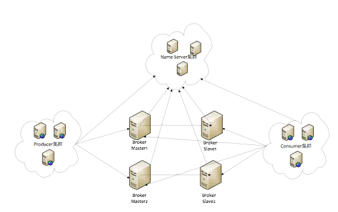
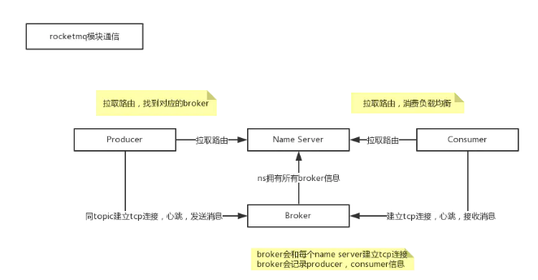
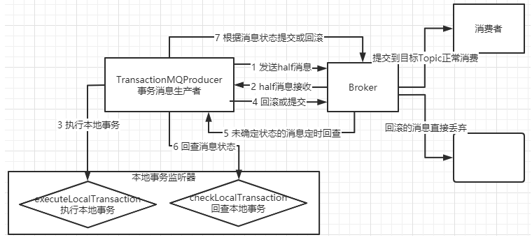
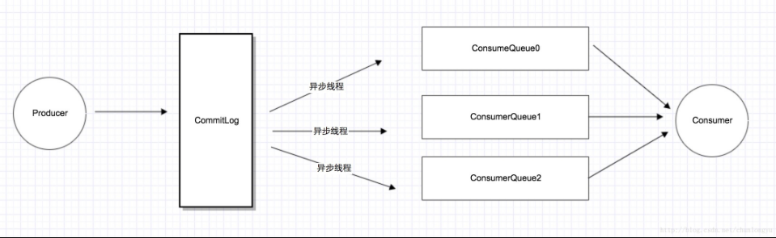

### 1. rocketmq的物理部署结构
   
   
   
   
   Name Server是一个几乎无状态节点，可集群部署，节点之间无任何信息同步。
   
   Broker部署相对复杂，Broker分为Master与Slave，一个Master可以对应多个Slave，但是一个Slave只能对应一个Master，Master与Slave的对应关系通过指定相同的BrokerName，
   不同的BrokerId来定义，BrokerId为0表示Master，非0表示Slave。Master也可以部署多个。每个Broker与Name Server集群中的所有节点建立长连接，定时注册Topic信息到所有Name Server。
   
   Producer与Name Server集群中的其中一个节点（随机选择）建立长连接，定期从Name Server取Topic路由信息，并向提供Topic服务的Master建立长连接，
   且定时向Master发送心跳。Producer完全无状态，可集群部署。

### 2. rocketmq 架构
   
   producer集群：拥有相同的producerGroup,一般来讲，Producer不必要有集群的概念，这里的集群仅仅在RocketMQ的分布式事务中有用到
   
   Name Server集群：提供topic的路由信息，路由信息数据存储在内存中，broker会定时的发送路由信息到nameserver中的每一个机器，来进行更新，所以name server集群可以简单理解为无状态
   （实际情况下可能存在每个nameserver机器上的数据有短暂的不一致现象，但是通过定时更新，大部分情况下都是一致的）
   
   broker集群：一个集群有一个统一的名字，即brokerClusterName，默认是DefaultCluster。一个集群下有多个master，每个master下有多个slave。master和slave算是一组，拥有相同的brokerName,
   不同的brokerId，master的brokerId是0，而slave则是大于0的值。master和slave之间可以进行同步复制或者是异步复制。
   
   consumer集群：拥有相同的consumerGroup。

#### 2.1 . 通信关系：
   
   

### 3. rocketmq 编程模型
  
  rocketmq 的生产者和消费者的编程模型都是有个固定的步骤

#### 3.1 消息者发送的步骤 
 
   1. 创建消息生产者producer, 并制定生产者组名 

   2. 指定 Nameserver 地址

   3. 启动 producer

   4. 创建消息对象，指定主题 topic、Tag 和消息体

   5. 发送消息

   6. 关闭 生产者 producer

#### 3.2 消费者接收步骤 

   1. 创建消费者Consumer ，制定消费者组名 

   2. 指定Nameserver 地址

   3. 订阅主题 Topic 和 Tag

   4. 设置回调函数，处理消息

   5. 启动消费者 consumer 

### 4. rocketmq 消息样例 

#### 4.1 基本样例 

   基本样例部分我们使用消息生产者分别通过三种方式发送消息，同步发送、异步发送以及单向发送。 

   然后使用消费者来消费这些消息。

##### 4.1.1 同步发送样例

  等待消息返回后再继续进行下面的操作。

```java
@Slf4j
public class SyncProducer {

    public static void main(String[] args) throws Exception{

        DefaultMQProducer producer = new DefaultMQProducer("productGroupName");

        producer.setNamesrvAddr(Constants.NAMESVADDR);

        producer.start();

        for (int i = 0; i < 20; i++) {
            try {
                Message msg = new Message("TopicTest", "TagA", "OrderID188",
                        "hello world".getBytes(RemotingHelper.DEFAULT_CHARSET));
                //同步传递消息，消息会发给集群中的一个Broker节点。
               SendResult sendResult = producer.send(msg);
                log.info(" sendResult {}", sendResult);
            } catch (Exception e) {
              log.info("SyncProducer error : {}", e);
            }
        }
        producer.shutdown();
    }
}
```

##### 4.1.2 异步发送样例

```java
@Slf4j
public class AsyncProducer {

    public static void main(String[] args) throws Exception{

        DefaultMQProducer producer = new DefaultMQProducer("AsyncProducer");

        producer.setNamesrvAddr(Constants.NAMESVADDR);

        producer.start();

        // 重试次数
        producer.setRetryTimesWhenSendAsyncFailed(0);

        int messageCount = 100;

        //由于是异步发送，这里引入一个countDownLatch，保证所有Producer发送消息的回调方法都执行完了再停止Producer服务。
        final CountDownLatch countDownLatch = new CountDownLatch(messageCount);

        for (int i = 0; i < messageCount; i++) {
            try {
                final int index = i;
                Message msg = new Message("TopicTest", "TagA", "OrderID188",
                        "hello world".getBytes(RemotingHelper.DEFAULT_CHARSET));

                producer.send(msg, new SendCallback() {
                    @Override
                    public void onSuccess(SendResult sendResult) {
                        countDownLatch.countDown();
                        log.info("%-10d OK {}, {}", index, sendResult.getMsgId());
                    }

                    @Override
                    public void onException(Throwable e) {
                        countDownLatch.countDown();
                        log.info("%-10d Exception {}, {}", index, e);
                    }
                });
                log.info("消息发送完成");
            }catch (Exception e) {
                log.info("error: {}",e);
            }
        }
        countDownLatch.await();
        producer.shutdown();

    }
}
```

##### 4.1.3 单向发送样例

   关键点就是使用producer.sendOneWay方式来发送消息，这个方法没有返回值，也没有回调。就是只管把消息发出去就行了。

```java
@Slf4j
public class SyncProducer {

    public static void main(String[] args) throws Exception{

        DefaultMQProducer producer = new DefaultMQProducer("productGroupName");

        producer.setNamesrvAddr(Constants.NAMESVADDR);

        producer.start();

        for (int i = 0; i < 20; i++) {
            try {
                Message msg = new Message("TopicTest", "TagA", "OrderID188",
                        "hello world".getBytes(RemotingHelper.DEFAULT_CHARSET));
                //单项发送
               producer.sendOneway(msg);
            } catch (Exception e) {
              log.info("SyncProducer error : {}", e);
            }
        }

        producer.shutdown();


    }
}
```

##### 4.1.4 使用消费者消费消息

   消费者消费消息有两种模式，一种是消费者主动去Broker上拉取消息的拉模式，另一种是消费者等待Broker把消息推送过来的推模式。

   通常情况下，用推模式比较简单。

   实际上RocketMQ的推模式也是由拉模式封装出来的。

###### 拉模式  

  4.7.1版本中DefaultMQPullConsumerImpl这个消费者类已标记为过期，但是还是可以使用的。替换的类是DefaultLitePullConsumerImpl。

```java
@Slf4j
public class PullConsumer {

    private static final Map<MessageQueue, Long> OFFSE_TABLE = new HashMap<MessageQueue, Long>();

    public static void main(String[] args) throws Exception{
        DefaultMQPullConsumer consumer = new DefaultMQPullConsumer("please_rname_unique_group_name_5");

        consumer.setNamesrvAddr(Constants.NAMESVADDR);
        consumer.start();

        Set<MessageQueue> mqs = consumer.fetchSubscribeMessageQueues("TopicTest");
        for (MessageQueue mq: mqs) {
            log.info("consume from the queue : {}", mq);
            SINGLE_MQ:
            while (true) {
                PullResult pullResult = consumer.pullBlockIfNotFound(mq, null, getMessageQueueOffset(mq), 32);
                log.info("pullResulet: {}", pullResult);
                putMessageQueueOffset(mq, pullResult.getNextBeginOffset());
                switch (pullResult.getPullStatus()) {
                    case FOUND:
                        break;
                    case NO_MATCHED_MSG:
                        break;
                    case NO_NEW_MSG:
                        break SINGLE_MQ;
                    case OFFSET_ILLEGAL:
                        break;
                    default:
                        break;
                }
            }
        }

        consumer.shutdown();


    }

    private static long getMessageQueueOffset(MessageQueue mq) {
        Long offset = OFFSE_TABLE.get(mq);
        if (offset != null)
            return offset;

        return 0;
    }

    private static void putMessageQueueOffset(MessageQueue mq, long offset) {
        OFFSE_TABLE.put(mq, offset);
    }
}
```

###### 推模式 

```java
@Slf4j
public class PushConsumer {

    public static void main(String[] args) throws Exception{
        DefaultMQPushConsumer consumer = new DefaultMQPushConsumer("PushConsumer");

        consumer.setNamesrvAddr(Constants.NAMESVADDR);

        consumer.subscribe("TopicTest", "*");

        consumer.setConsumeFromWhere(ConsumeFromWhere.CONSUME_FROM_FIRST_OFFSET);

        consumer.setConsumeTimestamp("20220701200000");

        consumer.registerMessageListener(new MessageListenerConcurrently() {
            @Override
            public ConsumeConcurrentlyStatus consumeMessage(List<MessageExt> msgs, ConsumeConcurrentlyContext consumeConcurrentlyContext) {
                log.info(" Receice new Messages: {}, {}", Thread.currentThread().getName(), msgs);
                return ConsumeConcurrentlyStatus.CONSUME_SUCCESS;
            }
        });

        consumer.start();

        log.info("Consumer started ....");
    }
}
```

#### 4.2 顺序消息 

   验证时，可以启动多个Consumer实例，观察下每一个订单的消息分配以及每个订单下多个步骤的消费顺序。不管订单在多个Consumer实例之前是如何分配的，每个订单下的多条消息顺序都是固定从0~5的。

   RocketMQ保证的是消息的局部有序，而不是全局有序。

   实际上，RocketMQ也只保证了每个OrderID的所有消息有序(发到了同一个queue)，而并不能保证所有消息都有序。所以这就涉及到了RocketMQ消息有序的原理。
   要保证最终消费到的消息是有序的，需要从Producer、Broker、Consumer三个步骤都保证消息有序才行。

   首先在发送者端：在默认情况下，消息发送者会采取Round Robin轮询方式把消息发送到不同的MessageQueue(分区队列)，而消费者消费的时候也从多个MessageQueue上拉取消息，
   这种情况下消息是不能保证顺序的。而只有当一组有序的消息发送到同一个MessageQueue上时，才能利用MessageQueue先进先出的特性保证这一组消息有序。

   而Broker中一个队列内的消息是可以保证有序的。

   然后在消费者端：消费者会从多个消息队列上去拿消息。这时虽然每个消息队列上的消息是有序的，但是多个队列之间的消息仍然是乱序的。消费者端要保证消息有序，
   就需要按队列一个一个来取消息，即取完一个队列的消息后，再去取下一个队列的消息。而给consumer注入的MessageListenerOrderly对象，
   在RocketMQ内部就会通过锁队列的方式保证消息是一个一个队列来取的。MessageListenerConcurrently这个消息监听器则不会锁队列，每次都是从多个Message中取一批数据（默认不超过32条）。
   因此也无法保证消息有序。

##### 4.2.1 顺序消息-生产者

```java
public class Producer {

    public static void main(String[] args) throws Exception{
        DefaultMQProducer producer = new DefaultMQProducer("please_rename_unique_group_name_5");

        producer.setNamesrvAddr(Constants.NAMESVADDR);

        producer.start();

        for (int i = 0; i < 10; i++) {
            int orderId = i;
            for (int j = 0; j < 5; j++) {
                Message msg = new Message("OrderTopicTest", "order_" + orderId,
                        ("order_" + orderId + " step " + j).getBytes(RemotingHelper.DEFAULT_CHARSET));
                SendResult send = producer.send(msg, new MessageQueueSelector() {
                    @Override
                    public MessageQueue select(List<MessageQueue> mqs, Message message, Object o) {
                        Integer id = (Integer) o;
                        int index = id % mqs.size();
                        return mqs.get(index);
                    }
                }, orderId);

                log.info(" SendResult : {}", send);
            }
        }

        producer.shutdown();


    }
}
```

##### 4.2.1 顺序消息-消费者

```java
@Slf4j
public class Consumer {

    public static void main(String[] args) throws Exception{
        DefaultMQPushConsumer consumer = new DefaultMQPushConsumer("pleace_rename_unique_group_name_3");
        consumer.setNamesrvAddr(Constants.NAMESVADDR);

        consumer.setConsumeFromWhere(ConsumeFromWhere.CONSUME_FROM_LAST_OFFSET);

        consumer.subscribe("OrderTopicTest", "*");

        consumer.registerMessageListener(new MessageListenerOrderly() {
            @Override
            public ConsumeOrderlyStatus consumeMessage(List<MessageExt> msgs, ConsumeOrderlyContext context) {
                context.setAutoCommit(true);
                for (MessageExt msg : msgs) {
                    log.info("收到的消息内容: {}", new String(msg.getBody()));
                }
                return ConsumeOrderlyStatus.SUCCESS;
            }
        });

        // 这个是保证不了 最终消费 顺序一致性
//        consumer.registerMessageListener(new MessageListenerConcurrently() {
//            @Override
//            public ConsumeConcurrentlyStatus consumeMessage(List<MessageExt> msgs, ConsumeConcurrentlyContext consumeConcurrentlyContext) {
//                for (MessageExt msg : msgs) {
//                    log.info("收到的消息内容: {}", new String(msg.getBody()));
//                }
//                return ConsumeConcurrentlyStatus.CONSUME_SUCCESS;
//            }
//        });

        consumer.start();
        log.info(" Consumer started ...... ");

    }
}
```


#### 4.3 广播消息 

   广播消息并没有特定的消息消费者样例，这是因为这涉及到消费者的集群消费模式。在集群状态(MessageModel.CLUSTERING)下，
   每一条消息只会被同一个消费者组中的一个实例消费到(这跟kafka和rabbitMQ的集群模式是一样的)。而广播模式则是把消息发给了所有订阅了对应主题的消费者，而不管消费者是不是同一个消费者组。

```java
@Slf4j
public class Producer {

    public static void main(String[] args) throws Exception{
        DefaultMQProducer producer = new DefaultMQProducer("please_rename_unique_group_name");

        producer.setNamesrvAddr(Constants.NAMESVADDR);

        producer.start();

        for (int i = 0; i < 2; i++) {

            try {
                Message msg = new Message("TopicTest", "TagA", ("hello world" + i).getBytes(RemotingHelper.DEFAULT_CHARSET));
                SendResult sendResult = producer.send(msg);
                log.info("sendResult: {}", sendResult);
            } catch (Exception e) {
                e.printStackTrace();
                Thread.sleep(1000);
            }
        }
        producer.shutdown();
    }
}
```

```java
@Slf4j
public class PushConsumer {

    public static void main(String[] args) throws Exception{
        DefaultMQPushConsumer consumer = new DefaultMQPushConsumer("please_rename_unique_group_name_1");

        consumer.setNamesrvAddr(Constants.NAMESVADDR);

        consumer.setConsumeFromWhere(ConsumeFromWhere.CONSUME_FROM_LAST_OFFSET);

        // 设置广播模式, 在所有 消费者里共享
        consumer.setMessageModel(MessageModel.BROADCASTING);

        consumer.subscribe("TopicTest", "*");

        consumer.registerMessageListener(new MessageListenerConcurrently() {
            @Override
            public ConsumeConcurrentlyStatus consumeMessage(List<MessageExt> msgs, ConsumeConcurrentlyContext consumeConcurrentlyContext) {
                log.info("Receive new message : {}, {}", Thread.currentThread().getName(), msgs);
                return ConsumeConcurrentlyStatus.CONSUME_SUCCESS;
            }
        });

        consumer.start();
        log.info("Broadcast Consumer started ....");

    }
}
```

#### 4.4 延迟消息 

   延迟消息实现的效果就是在调用producer.send方法后，消息并不会立即发送出去，而是会等一段时间再发送出去。这是RocketMQ特有的一个功能。

   那会延迟多久呢？延迟时间的设置就是在Message消息对象上设置一个延迟级别message.setDelayTimeLevel(3);

   开源版本的RocketMQ中，对延迟消息并不支持任意时间的延迟设定(商业版本中支持)，而是只支持18个固定的延迟级别，1到18分别对应
   messageDelayLevel=1s 5s 10s 30s 1m 2m 3m 4m 5m 6m 7m 8m 9m 10m 20m 30m 1h 2h。这从哪里看出来的？其实从rocketmq-console控制台就能看出来。
   而这18个延迟级别也支持自行定义，不过一般情况下最好不要自定义修改。

##### 4.4.1 延迟消息-生产者 

```java
@Slf4j
public class DelayProducer {

    public static void main(String[] args) throws Exception{
        DefaultMQProducer producer = new DefaultMQProducer("please_rename_unique_group_name");

        producer.setNamesrvAddr(Constants.NAMESVADDR);

        producer.start();

        for (int i = 0; i < 2; i++) {

            try {
                Message msg = new Message("TopicTest", "TagA", ("hello world" + i).getBytes(RemotingHelper.DEFAULT_CHARSET));

                // 设置延迟 等级
                //messageDelayLevel=1s 5s 10s 30s 1m 2m 3m 4m 5m 6m 7m 8m 9m 10m 20m 30m 1h 2h
                msg.setDelayTimeLevel(3);

                SendResult sendResult = producer.send(msg);

                log.info("sendResult: {}", sendResult);
            } catch (Exception e) {
                e.printStackTrace();
                Thread.sleep(1000);
            }
        }
        producer.shutdown();
    }
}
```

##### 4.4.1 延迟消息-消费者

```java
@Slf4j
public class DelayConsumer {

    public static void main(String[] args) throws Exception{
        DefaultMQPushConsumer consumer = new DefaultMQPushConsumer("please_rename_unique_group_name_4");

        consumer.setNamesrvAddr(Constants.NAMESVADDR);

        consumer.setConsumeFromWhere(ConsumeFromWhere.CONSUME_FROM_LAST_OFFSET);

        consumer.subscribe("TopicTest", "*");

        consumer.registerMessageListener(new MessageListenerConcurrently() {
            @Override
            public ConsumeConcurrentlyStatus consumeMessage(List<MessageExt> msgs, ConsumeConcurrentlyContext consumeConcurrentlyContext) {
                log.info("Receive New Message: {} , {}", Thread.currentThread().getName(), msgs);
                return ConsumeConcurrentlyStatus.CONSUME_SUCCESS;
            }
        });

        consumer.start();

        log.info("Consumer Started ......");
    }
}
```

#### 4.5 批量消息 

   批量消息是指将多条消息合并成一个批量消息，一次发送出去。这样的好处是可以减少网络IO，提升吞吐量。

   如果批量消息大于1MB就不要用一个批次发送，而要拆分成多个批次消息发送。也就是说，一个批次消息的大小不要超过1MB

   实际使用时，这个1MB的限制可以稍微扩大点，实际最大的限制是4194304字节，大概4MB。但是使用批量消息时，这个消息长度确实是必须考虑的一个问题。而且批量消息的使用是有一定限制的，这些消息应该有相同的Topic，相同的waitStoreMsgOK。而且不能是延迟消息、事务消息等。

##### 4.5.1 批量消息- 生产者 

```java
@Slf4j
public class SplitBatchProducer {

    public static void main(String[] args) throws Exception{
        DefaultMQProducer producer = new DefaultMQProducer("batch_producer_group_name");

        producer.setNamesrvAddr(Constants.NAMESVADDR);

        producer.start();

        String topic = "BatchTopic";

        List<Message> messages = new ArrayList<>(100 * 1000);
        for (int i = 0; i < 100 * 1000; i++) {
            messages.add(new Message(topic, "Tag", "OrderID" + i, ("Hello world " + i).getBytes()));
        }

        // 这里 发送，如果消息过多，会报错: CODE: 13  DESC: the message body size over max value, MAX: 4194304
//        producer.send(messages);

        ListSplitter splitter = new ListSplitter(messages);
        while (splitter.hasNext()) {
            List<Message> next = splitter.next();
            producer.send(next);
        }

        producer.shutdown();

    }
}


class ListSplitter implements Iterator<List<Message>> {
    private int sizeLimit = 1000 * 1000;
    private final List<Message> messages;
    private int currIndex;

    public ListSplitter(List<Message> messages) {
        this.messages = messages;
    }

    @Override
    public boolean hasNext() {
        return currIndex < messages.size();
    }

    @Override
    public List<Message> next() {
        int nextIndex = currIndex;
        int totalSize = 0;
        for (; nextIndex < messages.size(); nextIndex++) {
            Message message = messages.get(nextIndex);
            int tmpSize = message.getTopic().length() + message.getBody().length;
            Map<String, String> properties = message.getProperties();
            for (Map.Entry<String, String> entry : properties.entrySet()) {
                tmpSize += entry.getKey().length() + entry.getValue().length();
            }
            tmpSize = tmpSize + 20; //for log overhead
            if (tmpSize > sizeLimit) {
                //it is unexpected that single message exceeds the sizeLimit
                //here just let it go, otherwise it will block the splitting process
                if (nextIndex - currIndex == 0) {
                    //if the next sublist has no element, add this one and then break, otherwise just break
                    nextIndex++;
                }
                break;
            }
            if (tmpSize + totalSize > sizeLimit) {
                break;
            } else {
                totalSize += tmpSize;
            }

        }
        List<Message> subList = messages.subList(currIndex, nextIndex);
        currIndex = nextIndex;
        return subList;
    }

    @Override
    public void remove() {
        throw new UnsupportedOperationException("Not allowed to remove");
    }
}
```

##### 4.5.1 批量消息- 消费者

```java
@Slf4j
public class BatchConsumer {

    public static void main(String[] args) throws Exception{
        DefaultMQPushConsumer consumer = new DefaultMQPushConsumer("please_rename_unique_group_name_1");

        consumer.setNamesrvAddr(Constants.NAMESVADDR);

        consumer.setConsumeFromWhere(ConsumeFromWhere.CONSUME_FROM_LAST_OFFSET);

        consumer.subscribe("BatchTopic", "*");

        consumer.registerMessageListener(new MessageListenerConcurrently() {
            @Override
            public ConsumeConcurrentlyStatus consumeMessage(List<MessageExt> msgs, ConsumeConcurrentlyContext consumeConcurrentlyContext) {
                log.info("Receive new message : {}, {}", Thread.currentThread().getName(), msgs);
                return ConsumeConcurrentlyStatus.CONSUME_SUCCESS;
            }
        });

        consumer.start();
        log.info("Batch  Consumer started ....");

    }
}
```

#### 4.6 过滤消息 

   在大多数情况下，可以使用Message的Tag属性来简单快速的过滤信息。

   但是，这种方式有一个很大的限制，就是一个消息只能有一个TAG，这在一些比较复杂的场景就有点不足了。 这时候，可以使用SQL表达式来对消息进行过滤。

   使用注意：只有推模式的消费者可以使用SQL过滤。拉模式是用不了的。

   注意: 这个消息过滤是在Broker端进行。

##### 4.6.1 过滤消息- 生产者 

```java
@Slf4j
public class TagFilterProducer {

    public static void main(String[] args) throws Exception{

        DefaultMQProducer producer = new DefaultMQProducer("TagFilterProducer");
        producer.setNamesrvAddr(Constants.NAMESVADDR);

        producer.start();

        String[] tags = new String[] {"TagA", "TagB", "TagC"};

        for (int i = 0; i < 15; i++) {
            Message msg = new Message("TagFilterTopic", tags[i % tags.length], ("hello world" + i).getBytes(RemotingHelper.DEFAULT_CHARSET));

            SendResult send = producer.send(msg);

            log.info("TagFilterProducer SendResult : {}", send);

        }

        producer.shutdown();

    }
}
```

```java
@Slf4j
public class SqlFilterProducer {

    public static void main(String[] args) throws Exception{

        DefaultMQProducer producer = new DefaultMQProducer("SqlFilterProducer");

        producer.setNamesrvAddr(Constants.NAMESVADDR);
        producer.start();

        String[] tags = new String[] {"TagA", "TagB", "TagC"};

        for (int i = 0; i < 15; i++) {
            Message msg = new Message("SqlFilterTopic", tags[i % tags.length], ("hello world" + i).getBytes(RemotingHelper.DEFAULT_CHARSET));

            msg.putUserProperty("a", String.valueOf(i));

            SendResult send = producer.send(msg);

            log.info("SqlFilterProducer SendResult : {}", send);

        }

        producer.shutdown();

    }
}
```

##### 4.6.1 过滤消息- 消费者

```java
@Slf4j
public class TagFilterConsumer {

    public static void main(String[] args) throws Exception{
        DefaultMQPushConsumer consumer = new DefaultMQPushConsumer("TagFilterConsumer");

        consumer.setNamesrvAddr(Constants.NAMESVADDR);

        consumer.subscribe("TagFilterTopic", "TagA || TagB");

        consumer.registerMessageListener(new MessageListenerConcurrently() {
            @Override
            public ConsumeConcurrentlyStatus consumeMessage(List<MessageExt> msgs, ConsumeConcurrentlyContext consumeConcurrentlyContext) {
                log.info(" Receive new message : {}, {} ", Thread.currentThread().getName(), msgs);
                return ConsumeConcurrentlyStatus.CONSUME_SUCCESS;
            }
        });

        consumer.start();

        log.info("TagFilterConsumer started ....");

    }
}
```

```java
@Slf4j
public class SqlFilterConsumer {

    public static void main(String[] args) throws Exception{

        DefaultMQPushConsumer consumer = new DefaultMQPushConsumer("SqlFilterConsumer");

        consumer.setNamesrvAddr(Constants.NAMESVADDR);

        consumer.subscribe("SqlFilterTopic",
                MessageSelector.bySql("(TAGS is not null and TAGS in ('TagA', 'TagB'))" +
                        "and (a is not null and a between 0 and 3)"));

        consumer.registerMessageListener(new MessageListenerConcurrently() {
            @Override
            public ConsumeConcurrentlyStatus consumeMessage(List<MessageExt> msgs, ConsumeConcurrentlyContext consumeConcurrentlyContext) {
                log.info("Receive new messages : {}, {} ", Thread.currentThread().getName(), msgs);
                return ConsumeConcurrentlyStatus.CONSUME_SUCCESS;
            }
        });

        consumer.start();
        log.info("SqlFilterConsumer started .....");
    }
}
```

#### 4.7 事务消息 

   这个事务消息是RocketMQ提供的一个非常有特色的功能，需要着重理解。

   首先，我们了解下什么是事务消息。官网的介绍是：事务消息是在分布式系统中保证最终一致性的两阶段提交的消息实现。他可以保证本地事务执行与消息发送两个操作的原子性，也就是这两个操作一起成功或者一起失败。
 
   其次，我们来理解下事务消息的编程模型。事务消息只保证消息发送者的本地事务与发消息这两个操作的原子性，因此，事务消息的示例只涉及到消息发送者，对于消息消费者来说，并没有什么特别的。

##### 4.7.1 事务消息 -- 生产者 

```java
@Slf4j
public class TransactionProducer {

    public static void main(String[] args) throws Exception{
        TransactionListener transactionListener = new TransactionListenerImpl();

        TransactionMQProducer producer = new TransactionMQProducer("TransactionProducer");

        producer.setNamesrvAddr(Constants.NAMESVADDR);
        ExecutorService executorService = new ThreadPoolExecutor(2, 5, 100, TimeUnit.SECONDS, new ArrayBlockingQueue<Runnable>(2000), new ThreadFactory() {
            @Override
            public Thread newThread(Runnable r) {
                Thread thread = new Thread(r);
                thread.setName("client-transaction-msg-check-thread");
                return thread;
            }
        });

        producer.setExecutorService(executorService);

        producer.setTransactionListener(transactionListener);

        producer.start();

        String[] tags = new String[] {"TagA", "TagB", "TagC", "TagD", "TagE"};

        for (int i = 0; i < 10; i++) {

            try {
                Message msg = new Message("TransactionTopic", tags[i % tags.length],
                        "KEY" + i, ("hello world" + i).getBytes(RemotingHelper.DEFAULT_CHARSET));

                TransactionSendResult transactionSendResult = producer.sendMessageInTransaction(msg, null);

                log.info("TransactionSendResult : {}", transactionSendResult);

                Thread.sleep(10);
            } catch (Exception e) {
                log.error("TransactionProducer error: {}", e);
            }
        }

        for (int i = 0; i < 100000; i++) {
            Thread.sleep(1000);
        }
        producer.shutdown();


    }
}

```

   事务消息的关键是在TransactionMQProducer中指定了一个TransactionListener事务监听器，这个事务监听器就是事务消息的关键控制器。

```java
public class TransactionListenerImpl implements TransactionListener {

   //在提交完事务消息后执行。
   //返回COMMIT_MESSAGE状态的消息会立即被消费者消费到。
   //返回ROLLBACK_MESSAGE状态的消息会被丢弃。
   //返回UNKNOWN状态的消息会由Broker过一段时间再来回查事务的状态。
   @Override
   public LocalTransactionState executeLocalTransaction(Message msg, Object o) {
      String tags = msg.getTags();
      //TagA的消息会立即被消费者消费到
      if (StringUtils.contains(tags, "TagA")) {
         return LocalTransactionState.COMMIT_MESSAGE;
      }
      // TagB的消息会被丢弃
      else if (StringUtils.contains(tags, "TagB")) {
         return LocalTransactionState.ROLLBACK_MESSAGE;
      }
      //其他消息会等待Broker进行事务状态回查。
      else {
         return LocalTransactionState.UNKNOW;
      }
   }

   @Override
   public LocalTransactionState checkLocalTransaction(MessageExt msg) {
      String tags = msg.getTags();
      //TagC的消息过一段时间会被消费者消费到
      if (StringUtils.contains(tags, "TagC")) {
         return LocalTransactionState.COMMIT_MESSAGE;
      }
      //TagD的消息也会在状态回查时被丢弃掉
      else if (StringUtils.contains(tags, "TagD")) {
         return LocalTransactionState.ROLLBACK_MESSAGE;
      }
      //剩下TagE的消息会在多次状态回查后最终丢弃 ( 默认 15次)
      else {
         return LocalTransactionState.UNKNOW;
      }
   }
}
```

##### 4.7.2 事务消息 -- 消费者

```java
@Slf4j
public class TransationConsumer {

    public static void main(String[] args) throws Exception{
        DefaultMQPushConsumer consumer = new DefaultMQPushConsumer("TransationConsumer");

        consumer.setNamesrvAddr(Constants.NAMESVADDR);

        consumer.setConsumeFromWhere(ConsumeFromWhere.CONSUME_FROM_LAST_OFFSET);

        consumer.subscribe("TransactionTopic", "*");

        consumer.registerMessageListener(new MessageListenerConcurrently() {
            @Override
            public ConsumeConcurrentlyStatus consumeMessage(List<MessageExt> msgs, ConsumeConcurrentlyContext consumeConcurrentlyContext) {
                log.info("Receive New Message: {} , {}", Thread.currentThread().getName(), msgs);
                return ConsumeConcurrentlyStatus.CONSUME_SUCCESS;
            }
        });

        consumer.start();

        log.info("TransationConsumer Started ......");
    }
}
```

##### 4.7.3 事务消息的使用限制

   1、事务消息不支持延迟消息和批量消息。

   2、为了避免单个消息被检查太多次而导致半队列消息累积，我们默认将单个消息的检查次数限制为 15 次，但是用户可以通过 Broker 配置文件的 transactionCheckMax参数来修改此限制。
   如果已经检查某条消息超过 N 次的话（ N = transactionCheckMax ） 则 Broker 将丢弃此消息，并在默认情况下同时打印错误日志。用户可以通过重写 AbstractTransactionCheckListener 
   类来修改这个行为。

      回查次数是由BrokerConfig.transactionCheckMax这个参数来配置的，默认15次，可以在broker.conf中覆盖。
      然后实际的检查次数会在message中保存一个用户属性MessageConst.PROPERTY_TRANSACTION_CHECK_TIMES。这个属性值大于transactionCheckMax，就会丢弃。         
      这个用户属性值会按回查次数递增，也可以在Producer中自行覆盖这个属性。

   3、事务消息将在 Broker 配置文件中的参数 transactionMsgTimeout 这样的特定时间长度之后被检查。当发送事务消息时，用户还可以通过设置用户属性 CHECK_IMMUNITY_TIME_IN_SECONDS 
   来改变这个限制，该参数优先于 transactionMsgTimeout 参数。
   
      由BrokerConfig.transactionTimeOut这个参数来配置。默认6秒，可以在broker.conf中进行修改。
      另外，也可以给消息配置一个MessageConst.PROPERTY_CHECK_IMMUNITY_TIME_IN_SECONDS属性来给消息指定一个特定的消息回查时间。
      msg.putUserProperty(MessageConst.PROPERTY_CHECK_IMMUNITY_TIME_IN_SECONDS, "10000"); 这样就是10秒。

   4、事务性消息可能不止一次被检查或消费。

   5、提交给用户的目标主题消息可能会失败，目前这依日志的记录而定。它的高可用性通过 RocketMQ 本身的高可用性机制来保证，如果希望确保事务消息不丢失、并且事务完整性得到保证，
      建议使用同步的双重写入机制。

   6、事务消息的生产者 ID 不能与其他类型消息的生产者 ID 共享。与其他类型的消息不同，事务消息允许反向查询、MQ服务器能通过它们的生产者 ID 查询到消费者。

##### 4.7.4 事务消息的实现机制



   事务消息机制的关键是在发送消息时，会将消息转为一个half半消息，并存入RocketMQ内部的一个 RMQ_SYS_TRANS_HALF_TOPIC 这个Topic，这样对消费者是不可见的。
   再经过一系列事务检查通过后，再将消息转存到目标Topic，这样对消费者就可见了。

##### 4.7.5 事务消息的作用 

   这个事务消息跟分布式事务有什么关系？为什么扯到了分布式事务相关的两阶段提交上了？事务消息只保证了发送者本地事务和发送消息这两个操作的原子性，但是并不保证消费者本地事务的原子性，
   所以，事务消息只保证了分布式事务的一半。但是即使这样，对于复杂的分布式事务，RocketMQ提供的事务消息也是目前业内最佳的降级方案。

### 消息存储
   
   为提高消息读写并发能力，将一个topic消息进行拆分，kafka称为分区，rocketmq称为队列。
   
   对于kafka：为了防止一个分区的消息文件过大，会拆分成一个个固定大小的文件，所以一个分区就对应了一个目录。分区与分区之间是相互隔离的。
   
   对于RocketMQ：则是所有topic的数据混在一起进行存储，默认超过1G的话，则重新创建一个新的文件。消息的写入过程即写入该混杂的文件中，然后又有一个线程服务，在不断的读取分析该混杂文件，将消息进行分拣，
   然后存储在对应队列目录中（存储的是简要信息，如消息在混杂文件中的offset，消息大小等）
   
   所以RocketMQ需要2次寻找，第一次先找队列中的消息概要信息，拿到概要信息中的offset，根据这个offset再到混杂文件中找到想要的消息。而kafka则只需要直接读取分区中的文件即可得到想要的消息。

### producer端发现
   
   Producer端如何来发现新的broker地址。
   
   对于kafka来说：Producer端需要配置broker的列表地址，Producer也从一个broker中来更新broker列表地址（从中发现新加入的broker）。
   
   对于RocketMQ来说：Producer端需要Name Server的列表地址，同时还可以定时从一个HTTP地址中来获取最新的Name Server的列表地址，然后从其中的一台Name Server来获取全部的路由信息，从中发现新的broker。

### 消费offset的存储
   
   对于kafka：Consumer将消费的offset定时存储到ZooKeeper上，利用ZooKeeper保障了offset的高可用问题。
   
   对于RocketMQ:Consumer将消费的offset定时存储到broker所在的机器上，这个broker优先是master，如果master挂了的话，则会选择slave来存储，broker也是将这些offset定时刷新到本地磁盘上，
   同时slave会定时的访问master来获取这些offset。

### consumer负载均衡
    
   对于负载均衡，在出现分区或者队列增加或者减少的时候、Consumer增加或者减少的时候都会进行reblance(reblance相等于jvm 的full gc操作)操作。
    
   对于RocketMQ:客户端自己会定时对所有的topic的进行reblance操作，对于每个topic，会从broker获取所有Consumer列表，从broker获取队列列表，按照负载均衡策略，计算各自负责哪些队列。
   这种就要求进行负载均衡的时候，各个Consumer获取的数据是一致的，不然不同的Consumer的reblance结果就不同。
    
   对于kafka：kafka之前也是客户端自己进行reblance，依靠ZooKeeper的监听，来监听上述2种情况的出现，一旦出现则进行reblance。现在的版本则将这个reblance操作转移到了broker端来做，
   不但解决了RocketMQ上述的问题，同时减轻了客户端的操作，是的客户端更加轻量级，减少了和其他语言集成的工作量。
    

### RocketMq消息存储
   
   RocketMQ采用了单一的日志文件，即把同1台机器上面所有topic的所有queue的消息，存放在一个文件里面，从而避免了随机的磁盘写入。
   
   
   
   如上图所示，所有消息都存在一个单一的CommitLog文件里面，然后有后台线程异步的同步到ConsumeQueue，再由Consumer进行消费。
   
   这里至所以可以用“异步线程”，也是因为消息队列天生就是用来“缓冲消息”的。只要消息到了CommitLog，发送的消息也就不会丢。只要消息不丢，那就有了“充足的回旋余地”，用一个后台线程慢慢同步到ConsumeQueue，
   再由Consumer消费。
   
   可以说，这也是在消息队列内部的一个典型的“最终一致性”的案例：Producer发了消息，进了CommitLog，此时Consumer并不可见。但没关系，只要消息不丢，消息最终肯定会进入ConsumeQueue，让Consumer可见。

   