### 1. RocketMq核心概念
   
   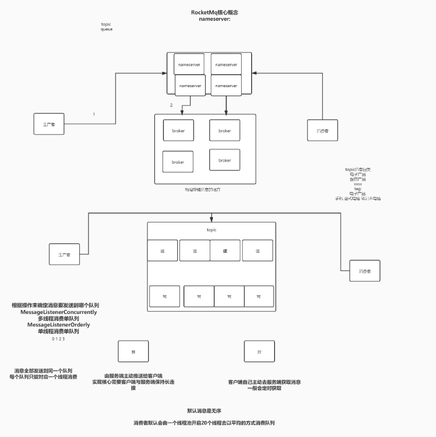

#### 1.1 消息模型（Message Model）
   
   RocketMQ主要由 Producer、Broker、Consumer 三部分组成，其中Producer 负责生产消息，Consumer 负责消费消息，Broker 负责存储消息。Broker 在实际部署过程中对应一台服务器，每个 Broker 可以存储多个Topic的消息，每个Topic的消息也可以分片存储于不同的 Broker。Message Queue 用于存储消息的物理地址，每个Topic中的消息地址存储于多个 Message Queue 中。ConsumerGroup 由多个Consumer 实例构成。
   
#### 1.2 消息生产者（Producer）
   
   负责生产消息，一般由业务系统负责生产消息。一个消息生产者会把业务应用系统里产生的消息发送到broker服务器。RocketMQ提供多种发送方式，同步发送、异步发送、顺序发送、单向发送。同步和异步方式均需要Broker返回确认信息，单向发送不需要。

#### 1.3 消息消费者（Consumer）
   
   负责消费消息，一般是后台系统负责异步消费。一个消息消费者会从Broker服务器拉取消息、并将其提供给应用程序。从用户应用的角度而言提供了两种消费形式：拉取式消费、推动式消费。

#### 1.4 主题（Topic）
    
   表示一类消息的集合，每个主题包含若干条消息，每条消息只能属于一个主题，是RocketMQ进行消息订阅的基本单位。

#### 1.5 代理服务器（Broker Server）
     
   消息中转角色，负责存储消息、转发消息。代理服务器在RocketMQ系统中负责接收从生产者发送来的消息并存储、同时为消费者的拉取请求作准备。代理服务器也存储消息相关的元数据，包括消费者组、消费进度偏移和主题和队列消息等。
   
#### 1.6 名字服务（Name Server）
   
   名称服务充当路由消息的提供者。生产者或消费者能够通过名字服务查找各主题相应的Broker IP列表。多个Namesrv实例组成集群，但相互独立，没有信息交换。

#### 1.7 拉取式消费（Pull Consumer）
     
   Consumer消费的一种类型，应用通常主动调用Consumer的拉消息方法从Broker服务器拉消息、主动权由应用控制。一旦获取了批量消息，应用就会启动消费过程。

#### 1.8 推动式消费（Push Consumer）
   
   Consumer消费的一种类型，该模式下Broker收到数据后会主动推送给消费端，该消费模式一般实时性较高。
   
#### 1.9 生产者组（Producer Group）
   
   同一类Producer的集合，这类Producer发送同一类消息且发送逻辑一致。如果发送的是事务消息且原始生产者在发送之后崩溃，则Broker服务器会联系同一生产者组的其他生产者实例以提交或回溯消费。

#### 1.10 消费者组（Consumer Group）
     
   同一类Consumer的集合，这类Consumer通常消费同一类消息且消费逻辑一致。消费者组使得在消息消费方面，实现负载均衡和容错的目标变得非常容易。要注意的是，消费者组的消费者实例必须订阅完全相同的Topic。RocketMQ 支持两种消息模式：集群消费（Clustering）和广播消费（Broadcasting）。

####  1.11 集群消费（Clustering）
   
   集群消费模式下,相同Consumer Group的每个Consumer实例平均分摊消息。
   
#### 1.12 广播消费（Broadcasting）
     
   广播消费模式下，相同Consumer Group的每个Consumer实例都接收全量的消息。

#### 1.13 普通顺序消息（Normal Ordered Message）
   
   普通顺序消费模式下，消费者通过同一个消费队列收到的消息是有顺序的，不同消息队列收到的消息则可能是无顺序的。

#### 1.14 严格顺序消息（Strictly Ordered Message）
   
   严格顺序消息模式下，消费者收到的所有消息均是有顺序的。

#### 1.15 消息（Message）
   
   消息系统所传输信息的物理载体，生产和消费数据的最小单位，每条消息必须属于一个主题。RocketMQ中每个消息拥有唯一的Message ID，且可以携带具有业务标识的Key。系统提供了通过Message ID和Key查询消息的功能。

#### 1.16 标签（Tag）
   
   为消息设置的标志，用于同一主题下区分不同类型的消息。来自同一业务单元的消息，可以根据不同业务目的在同一主题下设置不同标签。标签能够有效地保持代码的清晰度和连贯性，并优化RocketMQ提供的查询系统。消费者可以根据Tag实现对不同子主题的不同消费逻辑，实现更好的扩展性。

### 2. rocketmq 的特性(features)
   
#### 2.1 订阅与发布
   
   消息的发布是指某个生产者向某个topic发送消息；消息的订阅是指某个消费者关注了某个topic中带有某些tag的消息，进而从该topic消费数据。

#### 2.2 消息顺序
   
   消息有序指的是一类消息消费时，能按照发送的顺序来消费。例如：一个订单产生了三条消息分别是订单创建、订单付款、订单完成。消费时要按照这个顺序消费才能有意义，但是同时订单之间是可以并行消费的。RocketMQ可以严格的保证消息有序。
   
   顺序消息分为全局顺序消息与分区顺序消息，全局顺序是指某个Topic下的所有消息都要保证顺序；部分顺序消息只要保证每一组消息被顺序消费即可。
   
   全局顺序 对于指定的一个 Topic，所有消息按照严格的先入先出（FIFO）的顺序进行发布和消费。 适用场景：性能要求不高，所有的消息严格按照 FIFO 原则进行消息发布和消费的场景
   
   分区顺序 对于指定的一个 Topic，所有消息根据 sharding key 进行区块分区。 同一个分区内的消息按照严格的 FIFO 顺序进行发布和消费。 Sharding key 是顺序消息中用来区分不同分区的关键字段，和普通消息的 Key 是完全不同的概念。 适用场景：性能要求高，以 sharding key 作为分区字段，在同一个区块中严格的按照 FIFO 原则进行消息发布和消费的场景。
   
#### 2.3 消息过滤
   
   RocketMQ的消费者可以根据Tag进行消息过滤，也支持自定义属性过滤。消息过滤目前是在Broker端实现的，优点是减少了对于Consumer无用消息的网络传输，缺点是增加了Broker的负担、而且实现相对复杂。
   
#### 2.4 消息可靠性
   
   RocketMQ支持消息的高可靠，影响消息可靠性的几种情况：
   
       1.Broker非正常关闭
       2.Broker异常Crash
       3.OS Crash
       4.机器掉电，但是能立即恢复供电情况
       5.机器无法开机（可能是cpu、主板、内存等关键设备损坏）
       6.磁盘设备损坏
   
   1)、2)、3)、4) 四种情况都属于硬件资源可立即恢复情况，RocketMQ在这四种情况下能保证消息不丢，或者丢失少量数据（依赖刷盘方式是同步还是异步）。
   
   5)、6)属于单点故障，且无法恢复，一旦发生，在此单点上的消息全部丢失。RocketMQ在这两种情况下，通过异步复制，可保证99%的消息不丢，但是仍然会有极少量的消息可能丢失。通过同步双写技术可以完全避免单点，同步双写势必会影响性能，适合对消息可靠性要求极高的场合，例如与Money相关的应用。注：RocketMQ从3.0版本开始支持同步双写。

#### 2.5 至少一次
   
   至少一次(At least Once)指每个消息必须投递一次。Consumer先Pull消息到本地，消费完成后，才向服务器返回ack，如果没有消费一定不会ack消息，所以RocketMQ可以很好的支持此特性。

#### 2.6 回溯消费
   
   回溯消费是指Consumer已经消费成功的消息，由于业务上需求需要重新消费，要支持此功能，Broker在向Consumer投递成功消息后，消息仍然需要保留。并且重新消费一般是按照时间维度，例如由于Consumer系统故障，恢复后需要重新消费1小时前的数据，那么Broker要提供一种机制，可以按照时间维度来回退消费进度。RocketMQ支持按照时间回溯消费，时间维度精确到毫秒。

#### 2.7 事务消息
   
   RocketMQ事务消息（Transactional Message）是指应用本地事务和发送消息操作可以被定义到全局事务中，要么同时成功，要么同时失败。RocketMQ的事务消息提供类似 X/Open XA 的分布事务功能，通过事务消息能达到分布式事务的最终一致。

#### 2.8 定时消息
   
   定时消息（延迟队列）是指消息发送到broker后，不会立即被消费，等待特定时间投递给真正的topic。 broker有配置项messageDelayLevel，默认值为“1s 5s 10s 30s 1m 2m 3m 4m 5m 6m 7m 8m 9m 10m 20m 30m 1h 2h”，18个level。可以配置自定义messageDelayLevel。注意，messageDelayLevel是broker的属性，不属于某个topic。发消息时，设置delayLevel等级即可：msg.setDelayLevel(level)。level有以下三种情况：
   
       level == 0，消息为非延迟消息
       1<=level<=maxLevel，消息延迟特定时间，例如level==1，延迟1s
       level > maxLevel，则level== maxLevel，例如level==20，延迟2h
   
   定时消息会暂存在名为SCHEDULE_TOPIC_XXXX的topic中，并根据delayTimeLevel存入特定的queue，queueId = delayTimeLevel – 1，即一个queue只存相同延迟的消息，保证具有相同发送延迟的消息能够顺序消费。broker会调度地消费SCHEDULE_TOPIC_XXXX，将消息写入真实的topic。
   
   需要注意的是，定时消息会在第一次写入和调度写入真实topic时都会计数，因此发送数量、tps都会变高。

#### 2.9 消息重试
   
   Consumer消费消息失败后，要提供一种重试机制，令消息再消费一次。Consumer消费消息失败通常可以认为有以下几种情况：
   
    由于消息本身的原因，例如反序列化失败，消息数据本身无法处理（例如话费充值，当前消息的手机号被注销，无法充值）等。这种错误通常需要跳过这条消息，再消费其它消息，而这条失败的消息即使立刻重试消费，99%也不成功，所以最好提供一种定时重试机制，即过10秒后再重试。
   
    由于依赖的下游应用服务不可用，例如db连接不可用，外系统网络不可达等。遇到这种错误，即使跳过当前失败的消息，消费其他消息同样也会报错。这种情况建议应用sleep 30s，再消费下一条消息，这样可以减轻Broker重试消息的压力。
   
   RocketMQ会为每个消费组都设置一个Topic名称为“%RETRY%+consumerGroup”的重试队列（这里需要注意的是，这个Topic的重试队列是针对消费组，而不是针对每个Topic设置的），用于暂时保存因为各种异常而导致Consumer端无法消费的消息。考虑到异常恢复起来需要一些时间，会为重试队列设置多个重试级别，每个重试级别都有与之对应的重新投递延时，重试次数越多投递延时就越大。RocketMQ对于重试消息的处理是先保存至Topic名称为“SCHEDULE_TOPIC_XXXX”的延迟队列中，后台定时任务按照对应的时间进行Delay后重新保存至“%RETRY%+consumerGroup”的重试队列中。

#### 2.10 消息重投
   
   生产者在发送消息时，同步消息失败会重投，异步消息有重试，oneway没有任何保证。消息重投保证消息尽可能发送成功、不丢失，但可能会造成消息重复，消息重复在RocketMQ中是无法避免的问题。消息重复在一般情况下不会发生，当出现消息量大、网络抖动，消息重复就会是大概率事件。另外，生产者主动重发、consumer负载变化也会导致重复消息。如下方法可以设置消息重试策略：
   
   retryTimesWhenSendFailed:同步发送失败重投次数，默认为2，因此生产者会最多尝试发送retryTimesWhenSendFailed + 1次。不会选择上次失败的broker，尝试向其他broker发送，最大程度保证消息不丢。超过重投次数，抛出异常，由客户端保证消息不丢。当出现RemotingException、MQClientException和部分MQBrokerException时会重投。
   retryTimesWhenSendAsyncFailed:异步发送失败重试次数，异步重试不会选择其他broker，仅在同一个broker上做重试，不保证消息不丢。
   retryAnotherBrokerWhenNotStoreOK:消息刷盘（主或备）超时或slave不可用（返回状态非SEND_OK），是否尝试发送到其他broker，默认false。十分重要消息可以开启。

### 3. 消息存储 

#### 3.1 何时存储消息

分布式队列因为有高可靠性的要求，所以数据要进行持久化存储。

   1. MQ收到一条消息后，需要向生产者返回一个ACK响应，并将消息存储起来。

   2. MQ Push一条消息给消费者后，等待消费者的ACK响应，需要将消息标记为已消费。如果没有标记为消费，MQ会不断的尝试往消费者推送这条消息。

   3. MQ需要定期删除一些过期的消息，这样才能保证服务一直可用。

#### 3.2 消息存储介质 

rocketMQ采用的是类似于Kafka的文件存储机制，即直接用磁盘文件来保存消息，而不需要借助MySQL这一类索引工具。

##### 3.2.1 磁盘保存文件慢吗？ 

   磁盘如果使用得当，磁盘的速度完全可以匹配上网络 的数据传输速度。目前的高性能磁盘，顺序写速度可以达到600MB/s， 
   超过了一般网卡的传输速度。但是磁盘随机写的速度只有大概100KB/s，和顺序写的性能相差6000倍！因为有如此巨大的速度差别，好的消息队列系统会比普通的消息队列系统速度快多个数量级。
   RocketMQ的消息用顺序写,保证了消息存储的速度。

##### 3.2.2 零拷贝技术加速文件读写

   Linux操作系统分为【用户态】和【内核态】，文件操作、网络操作需要涉及这两种形态的切换，免不了进行数据复制。

   一台服务器 把本机磁盘文件的内容发送到客户端，一般分为两个步骤：

      1）read；读取本地文件内容；

      2）write；将读取的内容通过网络发送出去。

   这两个看似简单的操作，实际进行了4 次数据复制，分别是：

      1. 从磁盘复制数据到内核态内存；
      2. 从内核态内存复 制到用户态内存；
      3. 然后从用户态 内存复制到网络驱动的内核态内存；
      4. 最后是从网络驱动的内核态内存复 制到网卡中进行传输。

   而通过使用mmap的方式，可以省去向用户态的内存复制，提高速度。这种机制在Java中是通过NIO包中的MappedByteBuffer实现的。RocketMQ充分利用了上述特性，也就是所谓的“零拷贝”技术，
   提高消息存盘和网络发送的速度。

      这里需要注意的是，采用MappedByteBuffer这种内存映射的方式有几个限制，其中之一是一次只能映射1.5~2G 的文件至用户态的虚拟内存，
      这也是为何RocketMQ默认设置单个CommitLog日志数据文件为1G的原因了

      关于零拷贝，JAVA的NIO中提供了两种实现方式，mmap和sendfile，其中mmap适合比较小的文件，而sendfile适合传递比较大的文件。

#### 3.3 消息存储结构

   文件存储位置: 默认存储在 user.home 

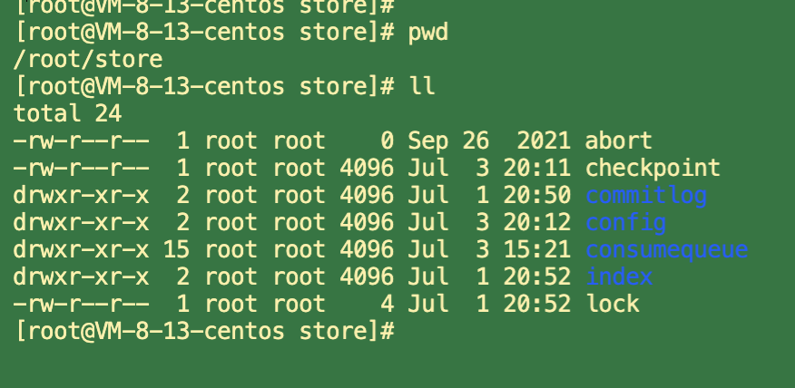

   RocketMQ消息的存储分为三个部分：

      CommitLog：存储消息的元数据。所有消息都会顺序存入到CommitLog文件当中。CommitLog由多个文件组成，每个文件固定大小1G。以第一条消息的偏移量为文件名。
      ConsumerQueue：存储消息在CommitLog的索引。一个MessageQueue一个文件，记录当前MessageQueue被哪些消费者组消费到了哪一条CommitLog。
      IndexFile：为了消息查询提供了一种通过key或时间区间来查询消息的方法，这种通过IndexFile来查找消息的方法不影响发送与消费消息的主流程

   整体的消息存储结构如下图：

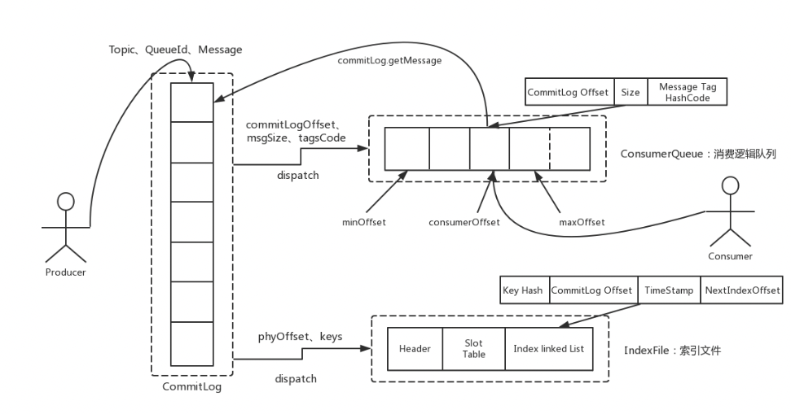

   还有几个文件可以了解下。

      abort：这个文件是RocketMQ用来判断程序是否正常关闭的一个标识文件。正常情况下，会在启动时创建，而关闭服务时删除。但是如果遇到一些服务器宕机，或者kill -9这样一些非正常关闭服务的情况，
      这个abort文件就不会删除，因此RocketMQ就可以判断上一次服务是非正常关闭的，后续就会做一些数据恢复的操作。

      checkpoint：数据存盘检查点

      config/*.json：这些文件是将RocketMQ的一些关键配置信息进行存盘保存。例如Topic配置、消费者组配置、消费者组消息偏移量Offset 等等一些信息。

#### 3.4 刷盘机制 

   RocketMQ需要将消息存储到磁盘上，这样才能保证断电后消息不会丢失。同时这样才可以让存储的消息量可以超出内存的限制。RocketMQ为了提高性能，会尽量保证磁盘的顺序写。
   消息在写入磁盘时，有两种写磁盘的方式，同步刷盘和异步刷盘

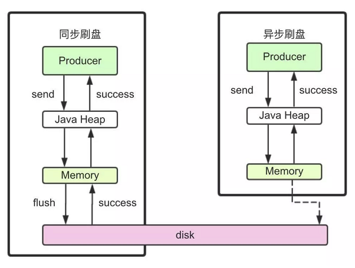

   同步刷盘：

      在返回写成功状态时，消息已经被写入磁盘。具体流程是，消息写入内存的PAGECACHE后，立刻通知刷盘线程刷盘， 然后等待刷盘完成，刷盘线程执行完成后唤醒等待的线程，返回消息写 成功的状态。

   异步刷盘：

      在返回写成功状态时，消息可能只是被写入了内存的PAGECACHE，写操作的返回快，吞吐量大；当内存里的消息量积累到一定程度时，统一触发写磁盘动作，快速写入。

   配置方式：

      刷盘方式是通过Broker配置文件里的flushDiskType 参数设置的，这个参数被配置成SYNC_FLUSH、ASYNC_FLUSH 中的 一个。(默认异步刷盘ASYNC_FLUSH)

#### 3.5 消息主从复制 

   如果Broker以一个集群的方式部署，会有一个master节点和多个slave节点，消息需要从Master复制到Slave上。而消息复制的方式分为同步复制和异步复制。

   同步复制：

      同步复制是等Master和Slave都写入消息成功后才反馈给客户端写入成功的状态。

      在同步复制下，如果Master节点故障，Slave上有全部的数据备份，这样容易恢复数据。但是同步复制会增大数据写入的延迟，降低系统的吞吐量。
   
   异步复制：

      异步复制是只要master写入消息成功，就反馈给客户端写入成功的状态。然后再异步的将消息复制给Slave节点。

      在异步复制下，系统拥有较低的延迟和较高的吞吐量。但是如果master节点故障，而有些数据没有完成复制，就会造成数据丢失。

   配置方式：

      消息复制方式是通过Broker配置文件里的brokerRole参数进行设置的，这个参数可以被设置成 ASYNC_MASTER、 SYNC_MASTER、SLAVE三个值中的一个。(默认异步复制 ASYNC_MASTER)

#### 3.6 负载均衡 

##### 3.6.1  Producer 复制均衡 

   Producer发送消息时，默认会轮询目标Topic下的所有MessageQueue，并采用递增取模的方式往不同的MessageQueue上发送消息，以达到让消息平均落在不同的queue上的目的。
   而由于MessageQueue是分布在不同的Broker上的，所以消息也会发送到不同的broker上。

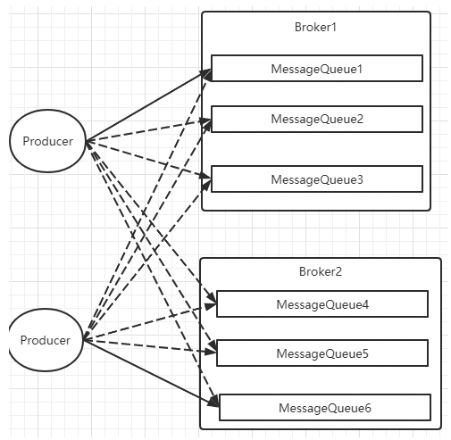

   同时生产者在发送消息时，可以指定一个MessageQueueSelector。通过这个对象来将消息发送到自己指定的MessageQueue上。这样可以保证消息局部有序。

##### 3.6.2  Consumer 负载均衡 

   Consumer也是以MessageQueue为单位来进行负载均衡。分为集群模式和广播模式。

###### Consumer负载均衡 -- 集群模式 

   在集群消费模式下，每条消息只需要投递到订阅这个topic的Consumer Group下的一个实例即可。RocketMQ采用主动拉取的方式拉取并消费消息，在拉取的时候需要明确指定拉取哪一条message queue。

   而每当实例的数量有变更，都会触发一次所有实例的负载均衡，这时候会按照queue的数量和实例的数量平均分配queue给每个实例。

   每次分配时，都会将MessageQueue和消费者ID进行排序后，再用不同的分配算法进行分配。内置的分配的算法共有六种，分别对应AllocateMessageQueueStrategy下的六种实现类，可以在consumer中直接set来指定。默认情况下使用的是最简单的平均分配策略。

      AllocateMachineRoomNearby： 将同机房的Consumer和Broker优先分配在一起。

   这个策略可以通过一个machineRoomResolver对象来定制Consumer和Broker的机房解析规则。然后还需要引入另外一个分配策略来对同机房的Broker和Consumer进行分配。一般也就用简单的平均分配策略或者轮询分配策略。

   源码中有测试代码AllocateMachineRoomNearByTest。

   在示例中：Broker的机房指定方式： messageQueue.getBrokerName().split("-")[0]，而Consumer的机房指定方式：clientID.split("-")[0]

   clinetID的构建方式：见ClientConfig.buildMQClientId方法。按他的测试代码应该是要把clientIP指定为IDC1-CID-0这样的形式。

      AllocateMessageQueueAveragely：平均分配。将所有MessageQueue平均分给每一个消费者

      AllocateMessageQueueAveragelyByCircle： 轮询分配。轮流的给一个消费者分配一个MessageQueue。

      AllocateMessageQueueByConfig： 不分配，直接指定一个messageQueue列表。类似于广播模式，直接指定所有队列。

      AllocateMessageQueueByMachineRoom：按逻辑机房的概念进行分配。又是对BrokerName和ConsumerIdc有定制化的配置。

      AllocateMessageQueueConsistentHash。源码中有测试代码AllocateMessageQueueConsitentHashTest。这个一致性哈希策略只需要指定一个虚拟节点数，
      是用的一个哈希环的算法，虚拟节点是为了让Hash数据在换上分布更为均匀。

###### Consumer负载均衡 -- 广播模式

   广播模式下，每一条消息都会投递给订阅了Topic的所有消费者实例，所以也就没有消息分配这一说。而在实现上，就是在Consumer分配Queue时，所有Consumer都分到所有的Queue。

#### 3.7 消息重试

   首先对于广播模式的消息， 是不存在消息重试的机制的，即消息消费失败后，不会再重新进行发送，而只是继续消费新的消息。

   而对于普通的消息，当消费者消费消息失败后，你可以通过设置返回状态达到消息重试的结果。

##### 3.7.1 如何让消息进行重试

   集群消费方式下，消息消费失败后期望消息重试，需要在消息监听器接口的实现中明确进行配置。可以有三种配置方式：

      1. 返回Action.ReconsumeLater-推荐
      2. 返回null
      3. 抛出异常

##### 3.7.2 重试消息如何处理 

   重试的消息会进入一个 “%RETRY%”+ConsumeGroup 的队列中。

   然后RocketMQ默认允许每条消息最多重试16次。 每次重试的间隔时间不一样。 
   
   重试次数：
      
      如果消息重试16次后仍然失败，消息将不再投递。转为进入死信队列。

      另外一条消息无论重试多少次，这些重试消息的MessageId始终都是一样的。

      然后关于这个重试次数，RocketMQ可以进行定制。例如通过consumer.setMaxReconsumeTimes(20);将重试次数设定为20次。当定制的重试次数超过16次后，消息的重试时间间隔均为2小时。

   关于MessageId：

      在老版本的RocketMQ中，一条消息无论重试多少次，这些重试消息的MessageId始终都是一样的。

      但是在4.7.1版本中，每次重试MessageId都会重建。

   配置覆盖：

      消息最大重试次数的设置对相同GroupID下的所有Consumer实例有效。并且最后启动的Consumer会覆盖之前启动的Consumer的配置。

#### 3.8 死信队列 

   当一条消息消费失败，RocketMQ就会自动进行消息重试。而如果消息超过最大重试次数，RocketMQ就会认为这个消息有问题。但是此时，RocketMQ不会立刻将这个有问题的消息丢弃，
   而会将其发送到这个消费者组对应的一种特殊队列：死信队列。

   死信队列的名称是%DLQ%+ConsumGroup

   死信队列的特征：

      一个死信队列对应一个ConsumGroup，而不是对应某个消费者实例。
      如果一个ConsumeGroup没有产生死信队列，RocketMQ就不会为其创建相应的死信队列。
      一个死信队列包含了这个ConsumeGroup里的所有死信消息，而不区分该消息属于哪个Topic。
      死信队列中的消息不会再被消费者正常消费。
      死信队列的有效期跟正常消息相同。默认3天，对应broker.conf中的fileReservedTime属性。超过这个最长时间的消息都会被删除，而不管消息是否消费过。

   通常，一条消息进入了死信队列，意味着消息在消费处理的过程中出现了比较严重的错误，并且无法自行恢复。此时，一般需要人工去查看死信队列中的消息，对错误原因进行排查。
   然后对死信消息进行处理，比如转发到正常的Topic重新进行消费，或者丢弃。

      注：默认创建出来的死信队列，他里面的消息是无法读取的，在控制台和消费者中都无法读取。这是因为这些默认的死信队列，他们的权限perm被设置成了2:禁读(这个权限有三种 2:禁读，4:禁写,6:可读可写)。
      需要手动将死信队列的权限配置成6，才能被消费(可以通过mqadmin指定或者web控制台)。

#### 3.9 消息幂等 

   在MQ系统中，对于消息幂等有三种实现语义：

      at most once 最多一次：每条消息最多只会被消费一次
      at least once 至少一次：每条消息至少会被消费一次
      exactly once 刚刚好一次：每条消息都只会确定的消费一次

   这三种语义都有他适用的业务场景。

   其中，at most once是最好保证的。RocketMQ中可以直接用异步发送、sendOneWay等方式就可以保证。

   而at least once这个语义，RocketMQ也有同步发送、事务消息等很多方式能够保证。

   而这个exactly once是MQ中最理想也是最难保证的一种语义，需要有非常精细的设计才行。RocketMQ只能保证at least once，保证不了exactly once。所以，使用RocketMQ时，需要由业务系统自行保证消息的幂等性。

##### 3.9.1 消息幂等的必要性

   在互联网应用中，尤其在网络不稳定的情况下，消息队列 RocketMQ 的消息有可能会出现重复，这个重复简单可以概括为以下情况：

   发送时消息重复

      当一条消息已被成功发送到服务端并完成持久化，此时出现了网络闪断或者客户端宕机，导致服务端对客户端应答失败。 如果此时生产者意识到消息发送失败并尝试再次发送消息，消费者后续会收到两条内容相同并且 Message ID 也相同的消息。

   投递时消息重复

      消息消费的场景下，消息已投递到消费者并完成业务处理，当客户端给服务端反馈应答的时候网络闪断。 为了保证消息至少被消费一次，消息队列 RocketMQ 的服务端将在网络恢复后再次尝试投递之前已被处理过的消息，消费者后续会收到两条内容相同并且 Message ID 也相同的消息。

   负载均衡时消息重复（包括但不限于网络抖动、Broker 重启以及订阅方应用重启）

      当消息队列 RocketMQ 的 Broker 或客户端重启、扩容或缩容时，会触发 Rebalance，此时消费者可能会收到重复消息。

##### 3.9.2 处理方式

   我们知道，在RocketMQ中，是无法保证每个消息只被投递一次的，所以要在业务上自行来保证消息消费的幂等性。

   而要处理这个问题，RocketMQ的每条消息都有一个唯一的MessageId，这个参数在多次投递的过程中是不会改变的，所以业务上可以用这个MessageId来作为判断幂等的关键依据。

   但是，这个MessageId是无法保证全局唯一的，也会有冲突的情况。所以在一些对幂等性要求严格的场景，最好是使用业务上唯一的一个标识比较靠谱。例如订单ID。
   而这个业务标识可以使用Message的Key来进行传递。

### 4. Rocketmq 实践问题 

#### 4.1 使用RocketMQ如何保证消息不丢失？

##### 4.1.1 哪些环节会有丢消息的可能？

   我们考虑一个通用的MQ场景：

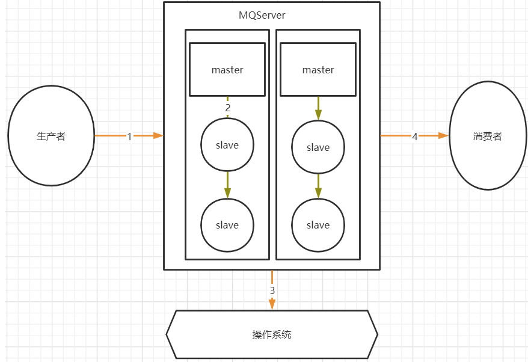
   
   其中，1，2，4三个场景都是跨网络的，而跨网络就肯定会有丢消息的可能。

   然后关于3这个环节，通常MQ存盘时都会先写入操作系统的缓存page cache中，然后再由操作系统异步的将消息写入硬盘。这个中间有个时间差，就可能会造成消息丢失。
   如果服务挂了，缓存中还没有来得及写入硬盘的消息就会丢失。

   这个是MQ场景都会面对的通用的丢消息问题。

#### 4.2 RocketMQ消息零丢失方案

##### 4.2.1 生产者使用事务消息机制保证消息零丢失

   这个结论比较容易理解，因为RocketMQ的事务消息机制就是为了保证零丢失来设计的

   但是如果深入一点的话，我们还是要理解下这个事务消息到底是不是靠谱。我们以最常见的电商订单场景为例，
   来简单分析下事务消息机制如何保证消息不丢失。我们看下下面这个流程图：

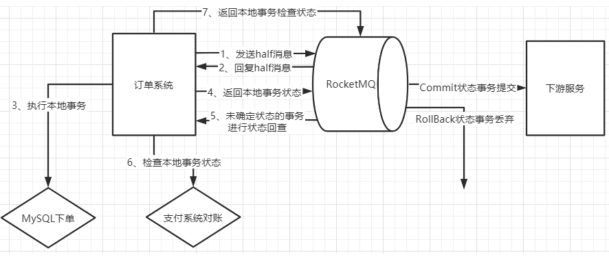

###### 1. 为什么要发送个half消息？有什么用？

   这个half消息是在订单系统进行下单操作前发送，并且对下游服务的消费者是不可见的。那这个消息的作用更多的体现在确认RocketMQ的服务是否正常。相当于嗅探下RocketMQ服务是否正常，并且通知RocketMQ，我马上就要发一个很重要的消息了，你做好准备。

###### 2.half消息如果写入失败了怎么办？

   如果没有half消息这个流程，那我们通常是会在订单系统中先完成下单，再发送消息给MQ。这时候写入消息到MQ如果失败就会非常尴尬了。
   而half消息如果写入失败，我们就可以认为MQ的服务是有问题的，这时，就不能通知下游服务了。我们可以在下单时给订单一个状态标记，
   然后等待MQ服务正常后再进行补偿操作，等MQ服务正常后重新下单通知下游服务。

###### 3.订单系统写数据库失败了怎么办？

   这个问题我们同样比较下没有使用事务消息机制时会怎么办？如果没有使用事务消息，我们只能判断下单失败，抛出了异常，那就不往MQ发消息了，这样至少保证不会对下游服务进行错误的通知。
   但是这样的话，如果过一段时间数据库恢复过来了，这个消息就无法再次发送了。当然，也可以设计另外的补偿机制，例如将订单数据缓存起来，再启动一个线程定时尝试往数据库写。
   而如果使用事务消息机制，就可以有一种更优雅的方案。

   如果下单时，写数据库失败(可能是数据库崩了，需要等一段时间才能恢复)。那我们可以另外找个地方把订单消息先缓存起来(Redis、文本或者其他方式)，然后给RocketMQ返回一个UNKNOWN状态。
   这样RocketMQ就会过一段时间来回查事务状态。我们就可以在回查事务状态时再尝试把订单数据写入数据库，如果数据库这时候已经恢复了，那就能完整正常的下单，再继续后面的业务。
   这样这个订单的消息就不会因为数据库临时崩了而丢失。

###### 4.half消息写入成功后RocketMQ挂了怎么办？

   我们需要注意下，在事务消息的处理机制中，未知状态的事务状态回查是由RocketMQ的Broker主动发起的。也就是说如果出现了这种情况，那RocketMQ就不会回调到事务消息中回查事务状态的服务。
   这时，我们就可以将订单一直标记为"新下单"的状态。而等RocketMQ恢复后，只要存储的消息没有丢失，RocketMQ就会再次继续状态回查的流程。

###### 5.下单成功后如何优雅的等待支付成功？

   在订单场景下，通常会要求下单完成后，客户在一定时间内，例如10分钟，内完成订单支付，支付完成后才会通知下游服务进行进一步的营销补偿。

   如果不用事务消息，那通常会怎么办？

   最简单的方式是启动一个定时任务，每隔一段时间扫描订单表，比对未支付的订单的下单时间，将超过时间的订单回收。这种方式显然是有很大问题的，需要定时扫描很庞大的一个订单信息，这对系统是个不小的压力。

   那更进一步的方案是什么呢？是不是就可以使用RocketMQ提供的延迟消息机制。往MQ发一个延迟1分钟的消息，消费到这个消息后去检查订单的支付状态，如果订单已经支付，就往下游发送下单的通知。而如果没有支付，就再发一个延迟1分钟的消息。最终在第十个消息时把订单回收。这个方案就不用对全部的订单表进行扫描，而只需要每次处理一个单独的订单消息。

   那如果使用上了事务消息呢？我们就可以用事务消息的状态回查机制来替代定时的任务。在下单时，给Broker返回一个UNKNOWN的未知状态。而在状态回查的方法中去查询订单的支付状态。这样整个业务逻辑就会简单很多。我们只需要配置RocketMQ中的事务消息回查次数(默认15次)和事务回查间隔时间(messageDelayLevel)，就可以更优雅的完成这个支付状态检查的需求。

###### 6. 事务消息机制的作用

   整体来说，在订单这个场景下，消息不丢失的问题实际上就还是转化成了下单这个业务与下游服务的业务的分布式事务一致性问题。而事务一致性问题一直以来都是一个非常复杂的问题。
   而RocketMQ的事务消息机制，实际上只保证了整个事务消息的一半，他保证的是订单系统下单和发消息这两个事件的事务一致性，而对下游服务的事务并没有保证。
   但是即便如此，也是分布式事务的一个很好的降级方案。目前来看，也是业内最好的降级方案。

##### 4.2.2 RocketMQ配置同步刷盘+Dledger主从架构保证MQ自身不会丢消息

###### 1、同步刷盘

   这个从我们之前的分析，就很好理解了。我们可以简单的把RocketMQ的刷盘方式 flushDiskType配置成同步刷盘就可以保证消息在刷盘过程中不会丢失了。

###### 2、Dledger的文件同步

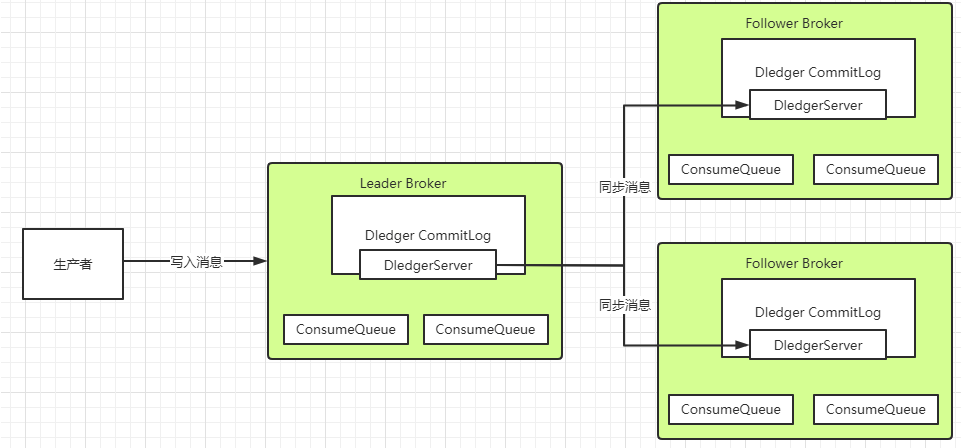

   简单来说，数据同步会通过两个阶段，一个是uncommitted阶段，一个是commited阶段。

   Leader Broker上的Dledger收到一条数据后，会标记为uncommitted状态，然后他通过自己的DledgerServer组件把这个uncommitted数据发给Follower Broker的DledgerServer组件。

   接着Follower Broker的DledgerServer收到uncommitted消息之后，必须返回一个ack给Leader Broker的Dledger。
   然后如果Leader Broker收到超过半数的Follower Broker返回的ack之后，就会把消息标记为committed状态。

   再接下来， Leader Broker上的DledgerServer就会发送committed消息给Follower Broker上的DledgerServer，让他们把消息也标记为committed状态。
   这样，就基于Raft协议完成了两阶段的数据同步。

##### 4.2.3 消费者端不要使用异步消费机制

   正常情况下，消费者端都是需要先处理本地事务，然后再给MQ一个ACK响应，这时MQ就会修改Offset，将消息标记为已消费，从而不再往其他消费者推送消息。
   所以在Broker的这种重新推送机制下，消息是不会在传输过程中丢失的。但是也会有下面这种情况会造成服务端消息丢失：

```
     DefaultMQPushConsumer consumer = new DefaultMQPushConsumer("please_rename_unique_group_name_4");
     consumer.registerMessageListener(new MessageListenerConcurrently() {
         @Override
         public ConsumeConcurrentlyStatus consumeMessage(List<MessageExt> msgs,
                                                         ConsumeConcurrentlyContext context) {
             new Thread(){
                 public void run(){
                     //处理业务逻辑
                     System.out.printf("%s Receive New Messages: %s %n", Thread.currentThread().getName(), msgs);
                 }
             };
             return ConsumeConcurrentlyStatus.CONSUME_SUCCESS;
         }
     });
```

这种异步消费的方式，就有可能造成消息状态返回后消费者本地业务逻辑处理失败造成消息丢失的可能。

##### 4.2.4 RocketMQ特有的问题，NameServer挂了如何保证消息不丢失？

   NameServer在RocketMQ中，是扮演的一个路由中心的角色，提供到Broker的路由功能。但是其实路由中心这样的功能，在所有的MQ中都是需要的。
   kafka是用zookeeper和一个作为Controller的Broker一起来提供路由服务，整个功能是相当复杂纠结的。而RabbitMQ是由每一个Broker来提供路由服务。
   而只有RocketMQ把这个路由中心单独抽取了出来，并独立部署。

   这个NameServer之前都了解过，集群中任意多的节点挂掉，都不会影响他提供的路由功能。那如果集群中所有的NameServer节点都挂了呢？

   有很多人就会认为在生产者和消费者中都会有全部路由信息的缓存副本，那整个服务可以正常工作一段时间。其实这个问题大家可以做一下实验，当NameServer全部挂了后，生产者和消费者是立即就无法工作了的。

   那再回到我们的消息不丢失的问题，在这种情况下，RocketMQ相当于整个服务都不可用了，那他本身肯定无法给我们保证消息不丢失了。我们只能自己设计一个降级方案来处理这个问题了。
   例如在订单系统中，如果多次尝试发送RocketMQ不成功，那就只能另外找给地方(Redis、文件或者内存等)把订单消息缓存下来，然后起一个线程定时的扫描这些失败的订单消息，尝试往RocketMQ发送。
   这样等RocketMQ的服务恢复过来后，就能第一时间把这些消息重新发送出去。整个这套降级的机制，在大型互联网项目中，都是必须要有的。

##### 4.2.5 RocketMQ消息零丢失方案总结

   完整分析过后，整个RocketMQ消息零丢失的方案其实挺简单

      生产者使用事务消息机制。
      Broker配置同步刷盘+Dledger主从架构
      消费者不要使用异步消费。
      整个MQ挂了之后准备降级方案

   那这套方案是不是就很完美呢？其实很明显，这整套的消息零丢失方案，在各个环节都大量的降低了系统的处理性能以及吞吐量。在很多场景下，这套方案带来的性能损失的代价可能远远大于部分消息丢失的代价。
   所以，我们在设计RocketMQ使用方案时，要根据实际的业务情况来考虑。例如，如果针对所有服务器都在同一个机房的场景，完全可以把Broker配置成异步刷盘来提升吞吐量。
   而在有些对消息可靠性要求没有那么高的场景，在生产者端就可以采用其他一些更简单的方案来提升吞吐，而采用定时对账、补偿的机制来提高消息的可靠性。
   而如果消费者不需要进行消息存盘，那使用异步消费的机制带来的性能提升也是非常显著的。

#### 4.2 使用RocketMQ如何保证消息顺序

##### 4.2.1 为什么要保证消息有序？

   这个也是面试时最常见的问题，需要对MQ场景有一定的深入理解。例如如果我们有个大数据系统，需要对业务系统的日志进行收集分析，这时候为了减少对业务系统的影响，通常都会通过MQ来做消息中转。
   而这时候，对消息的顺序就有一定的要求了。例如我们考虑下面这一系列的操作。

      1. 用户的积分默认是0分，而新注册用户设置为默认的10分。
      2. 用户有奖励行为，积分+2分。
      3. 用户有不正当行为，积分-3分。

   这样一组操作，正常用户积分要变成9分。但是如果顺序乱了，这个结果就全部对不了。这时，就需要对这一组操作，保证消息都是有序的。

##### 4.2.2 如何保证消息有序？

   MQ的顺序问题分为全局有序和局部有序。

      全局有序：整个MQ系统的所有消息严格按照队列先入先出顺序进行消费。
      局部有序：只保证一部分关键消息的消费顺序。

   首先 我们需要分析下这个问题，在通常的业务场景中，全局有序和局部有序哪个更重要？其实在大部分的MQ业务场景，我们只需要能够保证局部有序就可以了。例如我们用QQ聊天，
   只需要保证一个聊天窗口里的消息有序就可以了。而对于电商订单场景，也只要保证一个订单的所有消息是有序的就可以了。至于全局消息的顺序，并不会太关心。
   而通常意义下，全局有序都可以压缩成局部有序的问题。例如以前我们常用的聊天室，就是个典型的需要保证消息全局有序的场景。但是这种场景，通常可以压缩成只有一个聊天窗口的QQ来理解。
   即整个系统只有一个聊天通道，这样就可以用QQ那种保证一个聊天窗口消息有序的方式来保证整个系统的全局消息有序。

   然后 落地到RocketMQ。通常情况下，发送者发送消息时，会通过MessageQueue轮询的方式保证消息尽量均匀的分布到所有的MessageQueue上，而消费者也就同样需要从多个MessageQueue上消费消息。
   而MessageQueue是RocketMQ存储消息的最小单元，他们之间的消息都是互相隔离的，在这种情况下，是无法保证消息全局有序的。

   而对于局部有序的要求，只需要将有序的一组消息都存入同一个MessageQueue里，这样MessageQueue的FIFO设计天生就可以保证这一组消息的有序。RocketMQ中，
   可以在发送者发送消息时指定一个MessageSelector对象，让这个对象来决定消息发入哪一个MessageQueue。这样就可以保证一组有序的消息能够发到同一个MessageQueue里。

   另外，通常所谓的保证Topic全局消息有序的方式，就是将Topic配置成只有一个MessageQueue队列(默认是4个)。这样天生就能保证消息全局有序了。
   这个说法其实就是我们将聊天室场景压缩成只有一个聊天窗口的QQ一样的理解方式。而这种方式对整个Topic的消息吞吐影响是非常大的，如果这样用，基本上就没有用MQ的必要了。

#### 4.3 使用RocketMQ如何快速处理积压消息？

##### 4.3.1 如何确定RocketMQ有大量的消息积压？

   在正常情况下，使用MQ都会要尽量保证他的消息生产速度和消费速度整体上是平衡的，但是如果部分消费者系统出现故障，就会造成大量的消息积累。这类问题通常在实际工作中会出现得比较隐蔽。
   例如某一天一个数据库突然挂了，大家大概率就会集中处理数据库的问题。等好不容易把数据库恢复过来了，这时基于这个数据库服务的消费者程序就会积累大量的消息。或者网络波动等情况，也会导致消息大量的积累。
   这在一些大型的互联网项目中，消息积压的速度是相当恐怖的。所以消息积压是个需要时时关注的问题。

   对于消息积压，如果是RocketMQ或者kafka还好，他们的消息积压不会对性能造成很大的影响。而如果是RabbitMQ的话，那就惨了，大量的消息积压可以瞬间造成性能直线下滑。

   对于RocketMQ来说，有个最简单的方式来确定消息是否有积压。那就是使用web控制台，就能直接看到消息的积压情况。

   在Web控制台的主题页面，可以通过 Consumer管理 按钮实时看到消息的积压情况。

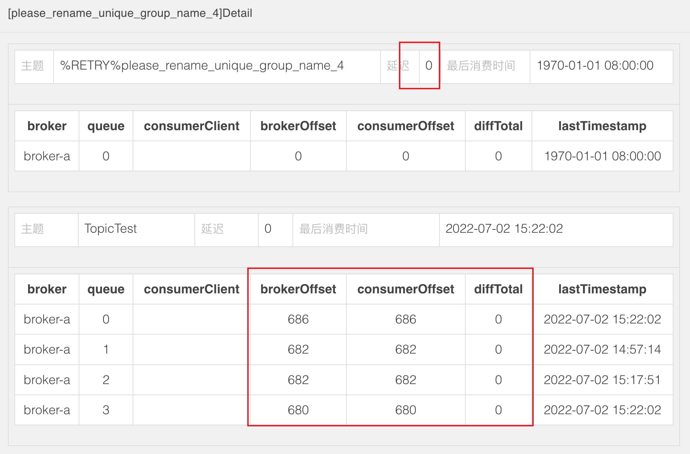
   
   另外，也可以通过mqadmin指令在后台检查各个Topic的消息延迟情况。

   还有RocketMQ也会在他的 ${storePathRootDir}/config 目录下落地一系列的json文件，也可以用来跟踪消息积压情况。

##### 4.3.2 如何处理大量积压的消息？

   其实我们回顾下RocketMQ的负载均衡的内容就不难想到解决方案。

   如果Topic下的MessageQueue配置得是足够多的，那每个Consumer实际上会分配多个MessageQueue来进行消费。这个时候，就可以简单的通过增加Consumer的服务节点数量来加快消息的消费，
   等积压消息消费完了，再恢复成正常情况。最极限的情况是把Consumer的节点个数设置成跟MessageQueue的个数相同。但是如果此时再继续增加Consumer的服务节点就没有用了。

   而如果Topic下的MessageQueue配置得不够多的话，那就不能用上面这种增加Consumer节点个数的方法了。这时怎么办呢？ 这时如果要快速处理积压的消息，可以创建一个新的Topic，
   配置足够多的MessageQueue。然后把所有消费者节点的目标Topic转向新的Topic，并紧急上线一组新的消费者，只负责消费旧Topic中的消息，并转储到新的Topic中，这个速度是可以很快的。
   然后在新的Topic上，就可以通过增加消费者个数来提高消费速度了。之后再根据情况恢复成正常情况。

   在官网中，还分析了一个特殊的情况。就是如果RocketMQ原本是采用的普通方式搭建主从架构，而现在想要中途改为使用Dledger高可用集群，这时候如果不想历史消息丢失，就需要先将消息进行对齐，
   也就是要消费者把所有的消息都消费完，再来切换主从架构。因为Dledger集群会接管RocketMQ原有的CommitLog日志，所以切换主从架构时，如果有消息没有消费完，这些消息是存在旧的CommitLog中的，
   就无法再进行消费了。这个场景下也是需要尽快的处理掉积压的消息。

#### 4.4 RocketMQ的消息轨迹

   RocketMQ默认提供了消息轨迹的功能：

##### 4.4.1 RocketMQ消息轨迹数据的关键属性：

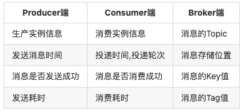

##### 4.4.2 消息轨迹配置

   打开消息轨迹功能，需要在broker.conf中打开一个关键配置：

```
traceTopicEnable=true
```

   这个配置的默认值是false。也就是说默认是关闭的。

##### 4.4.3 消息轨迹数据存储

   默认情况下，消息轨迹数据是存于一个系统级别的Topic ,RMQ_SYS_TRACE_TOPIC。这个Topic在Broker节点启动时，会自动创建出来。

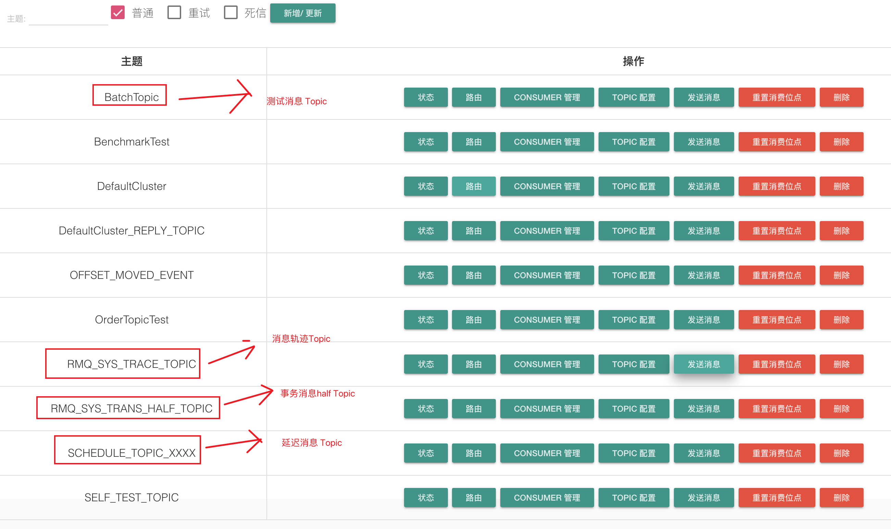

   另外，也支持客户端自定义轨迹数据存储的Topic。

   在客户端的两个核心对象 DefaultMQProducer和DefaultMQPushConsumer，他们的构造函数中，都有两个可选的参数来打开消息轨迹存储

      1. enableMsgTrace：是否打开消息轨迹。默认是false。
      2. customizedTraceTopic：配置将消息轨迹数据存储到用户指定的Topic 。

###  5. RocketMq的一些细节

   1： RocketMq 默认消费行为是无序的， 但是可以保证局部有序（单队列内） 具体解决方案为：
   
   生产者发送消息时指定队列（根据业务IDHash等等。。。） ，同时消费者使用有序消费监听器（MessageListenerOrderly） 两者同时实现 即可保证局部有序
   
   2：rocketmq的消息通讯机制是由推（push）拉（pull）两种方式实现 不过rocketmq对推送机制做了优化现在已不需要拉取了 
    
   rocketmq的推送机制原理： 由客户端定时与mq发起pull长连接  若无消息返回 则间隔一定时间断开连接重连
   
   3：消息长度的计算公式：topic名称长度+消息传递过去的参数+消息体大小+20b(日志数据大小)）=单条消息大小
   
   单次批量发送消息大小最好不要超过1MB（会影响性能） 不能超过4MB（会直接报错） 可以通过消息分割解决(单条消息不能用消息分割)
    
   4: MQ分布式事务解决方案的思想为数据最终一致
   
   即 A B 2个微服务事务操作， 不保证A B 事务操作的原子性  但保证2者100%执行成功

   **生产者组：**
      
   当生产者组内有生产者无法提供事务回调的时候
   
   就会由组内其他生产提供事务回调
   
   **消费者组 ：** 
   
   同一组内消费者可以通过负载均衡和广播的形式消费topic    
   
   负载均衡：
    
   此消费方式会按照6种逻辑均摊topic的消息：
    
         1 AllocateMessageQueueAveragely：顺序分页
         2:AllocateMessageQueueAveragelyByCircle 环状分页
         3:AllocateMachineRoomNearby 就近机房
         4: AllocateMessageQueueByMachineRoom 指定机房
         5:AllocateMessageQueueByConfig 指定队列
         6: AllocateMessageQueueConsistentHash hash环
   
   注意 当消费者数量大于队列数量的时候 就会有消费者无法消费

   广播：
      
      此消费方式当topic每收到一条消息 所有以广播形式监听的消费者 都会收到这一条消息
   
   消息重试：
     
     当mq没有接收到消费者消费响应 或是接收到重试响应 或是发生异常时
     mq就会重发此条消息
     每次重发会间隔不相等时间  间隔时间越来越大 最大2小时
    当重试默认到达16次时此消息就会进入死信队列
    死信队列默认禁止读写（即不能往里面发送消息和不能消费消息） 可以通过配置开启读写功能
    当产生死信消息时死信队列才会跟着创建
   
   集群：
   
   rocketmq集群 总共4种角色
   
   1.生产者集群（组）
   2.消费者集群（组）
        
   3.nameserver集群
   
   nameserver集群之间并没有数据同步，  也没有任何的交互  当有新的nameserver加入集群时 broker会把自己的数据上报到新的nameserver 保持nameserver之间数据统一
   
   4.broker集群
   
   broker集群分为4种模式
   
   **单主**
       
   此模式即单独搭建一个 broker 就是咱们测试的模式， 一般只能作用于测试使用，不推荐线上使用， 一旦broker宕机 整个消息服务不可用
   
   **多主**
   
   此模式优点在于配置简单且支持容错， 但是单主节点宕机会导致部分消息(存在于此节点上的消息)无法消费(无法消费不代表消息丢失， 当此节点恢复时 依然可以消费，也就是消息存在延迟) 
   
   **多主多从:**
   
   多主多从模式 采用 主节点与从节点配合工作的模式架构  主节点提供读写 从节点只提供读  
   
   在消息发送这一块 只要有任意一个主节点(如果只剩下从节点存活 则消息发送不可用)存活 都不会影响消息发送
   
   在消息消费这一块 只要有任意节点存活（无论主从） 消息均可消费
   
   消息生产到主节点后 由主节点复制到从节点 完成消息的统一 
   
   **同步**
   
   即 同步方式去复制消息， 当复制消息完成后 才通知生产者
   
   异步
    
   异步方式复制消息， 即收到消息后就通知生产者并异步复制消息 （对比同步模式， 效率提升约10%,但是当节点宕机，会出现少量消息丢失）
   
   刷盘机制：
   
   刷盘 即 吧数据存储进磁盘的操作
   
   分为同步刷盘与异步刷盘 
   
   线上推荐使用的集群架构方案： 同步复制+异步刷盘 （消息100%不丢失，且一定程度保证效率）