### 1. 简介

   Kafka是最初由Linkedin公司开发，是一个分布式、支持分区的(partition)、多副本的(replica)，基于zookeeper协 调的分布式消息系统，
   它的最大的特性就是可以实时的处理大量数据以满足各种需求场景:比如基于hadoop的批处理系 统、低延迟的实时系统、Storm/Spark流式处理引擎，
   web/nginx日志、访问日志，消息服务等等，用scala语言编写， Linkedin于2010年贡献给了Apache基金会并成为顶级开源 项目。


   Apache Kafka 是一个分布式的流处理平台。它具有以下特点：
   
    支持消息的发布和订阅，类似于 RabbtMQ、ActiveMQ 等消息队列；
    支持数据实时处理；
    能保证消息的可靠性投递；
    支持消息的持久化存储，并通过多副本分布式的存储方案来保证消息的容错；
    高吞吐率，单 Broker 可以轻松处理数千个分区以及每秒百万级的消息量。

### 2. kafka 使用场景 

   日志收集: 可以用kafka 收集各种服务的log, 通过kafka 以统一接口服务的方式开放给各种 consumer、例如: hadoop、HBase、solr 等

   消息系统: 解耦和生产者和消费者、缓存消息

   用户活动跟踪: Kafka经常被用来记录web用户或者app用户的各种活动，如浏览网页、搜索、点击等活动，这
   些活动信息被各个服务器发布到kafka的topic中，然后订阅者通过订阅这些topic来做实时的监控分析，或者装载到 hadoop、数据仓库中做离线分析和挖掘。

   运营指标: Kafka也经常用来记录运营监控数据。包括收集各种分布式应用的数据，生产各种操作的集中反 馈，比如报警和报告。

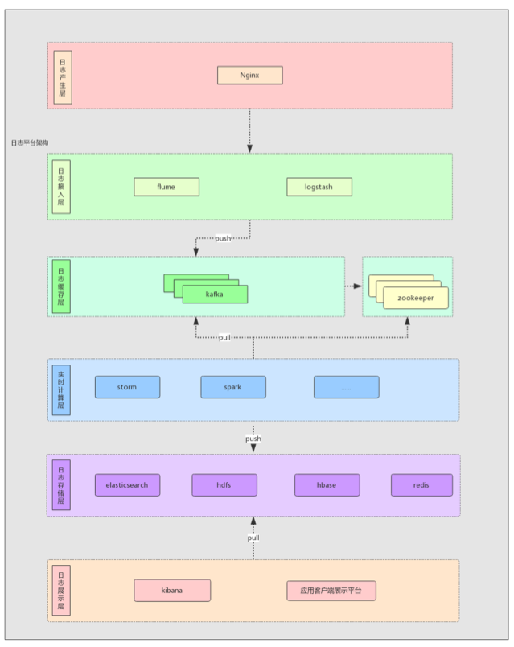

### 3. 基本概念

   kafka是一个分布式的，分区的消息(官方称之为commit log)服务。它提供一个消息系统应该具备的功能，但是确有着独 特的设计。
   可以这样来说，Kafka借鉴了JMS规范的思想，但是确并没有完全遵循JMS规范。

#### 3.1 kafka基础的消息(Message)相关术语:

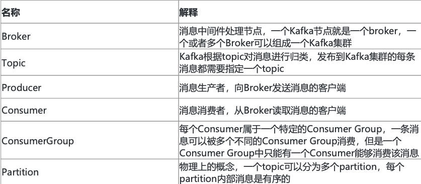


##### 3.1.1 Messages And Batches

Kafka 的基本数据单元被称为 message(消息)，为减少网络开销，提高效率，多个消息会被放入同一批次 (Batch) 中后再写入。

##### 3.1.2 Topics And Partitions

Kafka 的消息通过 Topics(主题) 进行分类，一个主题可以被分为若干个 Partitions(分区)，一个分区就是一个提交日志 (commit log)。
消息以追加的方式写入分区，然后以先入先出的顺序读取。Kafka 通过分区来实现数据的冗余和伸缩性，分区可以分布在不同的服务器上，
这意味着一个 Topic 可以横跨多个服务器，以提供比单个服务器更强大的性能。

由于一个 Topic 包含多个分区，因此无法在整个 Topic 范围内保证消息的顺序性，但可以保证消息在单个分区内的顺序性。

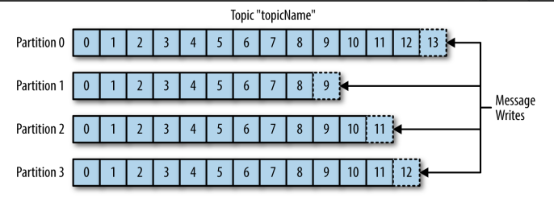

##### 3.1.3 Producers 生产者

   生产者负责创建消息。一般情况下，生产者在把消息均衡地分布到在主题的所有分区上，而并不关心消息会被写到哪个分区。如果我们想要把消息写到指定的分区，
   可以通过自定义分区器来实现。

##### 3.1.4 Consumers 消费者

   消费者是消费者群组的一部分，消费者负责消费消息。消费者可以订阅一个或者多个主题，并按照消息生成的顺序来读取它们。
   消费者通过检查消息的偏移量 (offset) 来区分读取过的消息。偏移量是一个不断递增的数值，在创建消息时，Kafka 会把它添加到其中，
   在给定的分区里，每个消息的偏移量都是唯一的。消费者把每个分区最后读取的偏移量保存在 Zookeeper 或 Kafka 上，如果消费者关闭或者重启，
   它还可以重新获取该偏移量，以保证读取状态不会丢失。

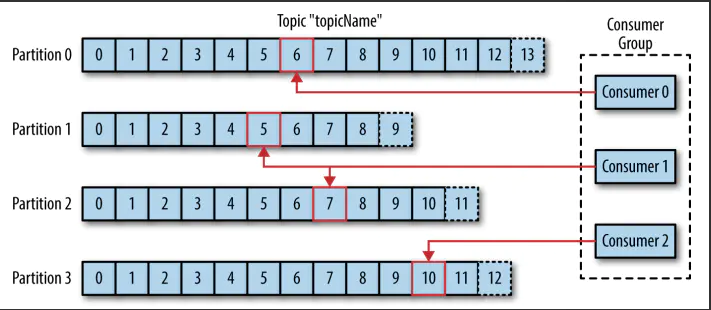

   一个分区只能被同一个消费者群组里面的一个消费者读取，但可以被不同消费者群组中所组成的多个消费者共同读取。多个消费者群组中消费者共同读取同一个主题时，
   彼此之间互不影响。

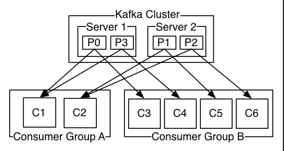

##### 3.1.5 Brokers And Clusters

   一个独立的 Kafka 服务器被称为 Broker。Broker 接收来自生产者的消息，为消息设置偏移量，并提交消息到磁盘保存。Broker 为消费者提供服务，
   对读取分区的请求做出响应，返回已经提交到磁盘的消息。

   Broker 是集群 (Cluster) 的组成部分。每一个集群都会选举出一个 Broker 作为集群控制器 (Controller)，集群控制器负责管理工作，
   包括将分区分配给 Broker 和监控 Broker。

   在集群中，一个分区 (Partition) 从属一个 Broker，该 Broker 被称为分区的首领 (Leader)。一个分区可以分配给多个 Brokers，这个时候会发生分区复制。
   这种复制机制为分区提供了消息冗余，如果有一个 Broker 失效，其他 Broker 可以接管领导权。

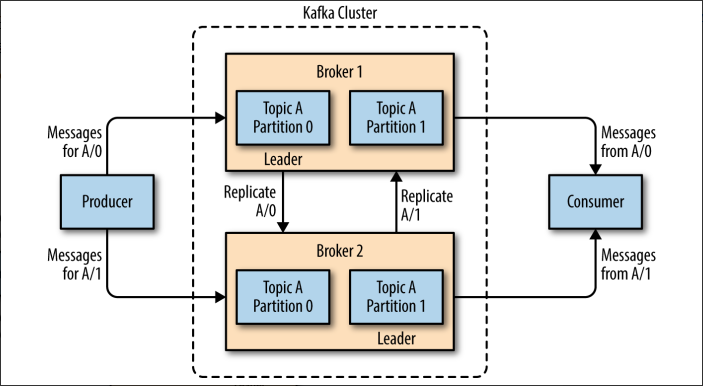

#### 3.2 kafka 架构图

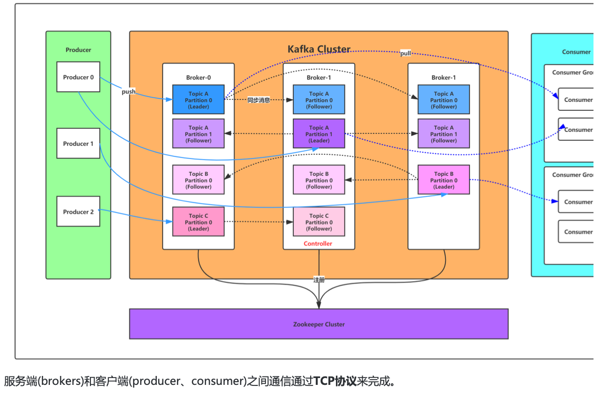

### 4. kafka 安装 

#### 4.1 安装前的环境准备

   由于Kafka是用Scala语言开发的，运行在JVM上，因此在安装Kafka之前需要先安装JDK。

   kafka依赖zookeeper，所以需要先安装zookeeper

```
wget https://mirror.bit.edu.cn/apache/zookeeper/zookeeper‐3.5.8/apache‐zookeeper‐3.5.8‐bin.tar.gz
tar‐zxvfapache‐zookeeper‐3.5.8‐bin.tar.gz

cd apache‐zookeeper‐3.5.8‐bin
cp conf/zoo_sample.cfgconf/zoo.cfg

# 启动zookeeper
bin/zkServer.shstart
bin/zkCli.sh
ls/#查看zk的根目录相关节点
```

#### 4.2 下载安装包 

下载2.4.1 release版本，并解压:

```
wget https://mirror.bit.edu.cn/apache/kafka/2.4.1/kafka_2.11‐2.4.1.tg  z#2.11是scala的版本，2.4.1是kafka的版本 

tar‐xzvf kafka_2.11‐2.4.1.tgz

cd kafka_2.11‐2.4.1
 
```

#### 4.3 修改配置

  修改配置文件config/server.properties:

```
#broker.id属性在kafka集群中必须要是唯一
broker.id=0

#kafka部署的机器ip和提供服务的端口号
listeners=PLAINTEXT://192.168.65.60:9092  #kafka的消息存储文件

log.dir=/usr/local/data/kafka‐logs

#kafka连接zookeeper的地址
zookeeper.connect=192.168.65.60:2181
```

```shell
# 云服务器 配置 外网访问 
host.name=10.0.8.19 ## 内网ip
listeners=PLAINTEXT://10.0.8.19:9092  ## 内网ip+端口
advertised.listeners=PLAINTEXT://106.52.11.222:9092  ## 外网ip+端口
```

#### 4.4 启动服务

   启动脚本语法:kafka-server-start.sh [-daemon] server.properties 可以看到，server.properties的配置路径是一个强制的参数，
   -daemon表示以后台进程运行，否则ssh客户端退出后， 就会停止服务。(注意，在启动kafka时会使用linux主机名关联的ip地址，
   所以需要把主机名和linux的ip映射配置到本地 host里，用vim /etc/hosts)
   
```shell
# 启动kafka，运行日志在logs目录的server.log文件里
bin/kafka-server-start.sh -daemon config/server.properties #后台启动，不会打印日志到控制台或者用
bin/kafka-server-start.sh config/server.properties &

# 我们进入zookeeper目录通过zookeeper客户端查看下zookeeper的目录树
bin/zkCli.sh
ls/#查看zk的根目录kafka相关节点
ls/brokers/ids#查看kafka节点

# 停止kafka
bin/kafka-server-stop.sh
```

   

#### 4.5 创建主题

   现在我们来创建一个名字为“test”的Topic，这个topic只有一个partition，并且备份因子也设置为1:
   
```shell
bin/kafka-topics.sh --create --zookeeper 127.0.0.1:2181 --replication-factor 1 --partitions 1 --topic test
```

   现在我们可以通过以下命令来查看kafka中目前存在的topic
   
```shell
c
```

   除了我们通过手工的方式创建Topic，当producer发布一个消息到某个指定的Topic，这个Topic如果不存在，就自动创建。

#### 4.6 删除主题   

```shell
bin/kafka-topics.sh --delete --topic test --zookeeper 127.0.0.1:2181
```

#### 4.7 发送消息

   kafka自带了一个producer命令客户端，可以从本地文件中读取内容，或者我们也可以以命令行中直接输入内容，并将这 些内容以消息的形式发送到kafka集群中。
   在默认情况下，每一个行会被当做成一个独立的消息。 首先我们要运行发布消息的脚本，然后在命令中输入要发送的消息的内容:
   
```shell
bin/kafka-console-producer.sh --broker-list 127.0.0.1:9092 --topic test
>this is kafka a msg
>this is kafka a another msg
```

#### 4.8 消费消息

  对于consumer，kafka同样也携带了一个命令行客户端，会将获取到内容在命令中进行输出，默认是消费最新的消息:
  
```shell
bin/kafka-console-consumer.sh --bootstrap-server 127.0.0.1:9092 --topic test
```

   如果想要消费之前的消息可以通过--from-beginning参数指定，如下命令:
   
```shell
bin/kafka-console-consumer.sh --bootstrap-server 127.0.0.1:9092 --from-beginning --topic test
```

   如果你是通过不同的终端窗口来运行以上的命令，你将会看到在producer终端输入的内容，很快就会在consumer的终端窗口上显示出来。

   以上所有的命令都有一些附加的选项;当我们不携带任何参数运行命令的时候，将会显示出这个命令的详细用法。
   
##### 4.8.1 消费多主题

```shell
bin/kafka-console-consumer.sh --bootstrap-server 127.0.0.1:9092 --whitelist "test|test-2"
```

##### 4.8.2 单播消息

  一条消息只能被某一个消费者消费的模式，类似queue模式，只需让所有消费者在同一个消费组里即可 分别在两个客户端执行如下消费命令，
  然后往主题里发送消息，结果只有一个客户端能收到消息

```shell
bin/kafka-console-consumer.sh --bootstrap-server 127.0.0.1:9092 --consumer-property group.id=testGroup --topic test
```

##### 4.8.3 多播消息

   一条消息能被多个消费者消费的模式，类似publish-subscribe模式费，针对Kafka同一条消息只能被同一个消费组下的某一个消 费者消费的特性，
   要实现多播只要保证这些消费者属于不同的消费组即可。我们再增加一个消费者，该消费者属于testGroup-2消费 组，结果两个客户端都能收到消息

````shell
bin/kafka-console-consumer.sh --bootstrap-server 127.0.0.1:9092 --consumer-property group.id=testGroup --topic test

bin/kafka-console-consumer.sh --bootstrap-server 127.0.0.1:9092 --consumer-property group.id=testGroup-2 --topic test
````

#### 4.9 查看消费组名

```shell
bin/kafka-consumer-groups.sh --bootstrap-server 127.0.0.1:9092 --list
```

#### 4.10 查看消费组的消费偏移量

```shell
bin/kafka-consumer-groups.sh --bootstrap-server 127.0.0.1:9092 --describe --group testGroup
```

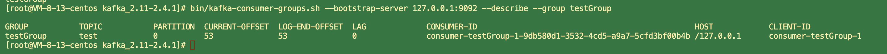

current-offset:当前消费组的已消费偏移量 

log-end-offset:主题对应分区消息的结束偏移量(HW) 

tag:当前消费组未消费的消息数


### 5. 主题 topic 和消息日志log 

   可以理解Topic是一个类别的名称，同类消息发送到同一个Topic下面。对于每一个Topic，下面可以有多个分区(Partition)日志文件:

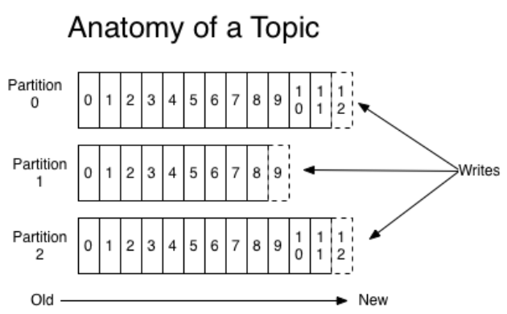

   Partition是一个有序的message序列，这些message按顺序添加到一个叫做commit log的文件中。每个partition中的 消息都有一个唯一的编号，
   称之为offset，用来唯一标示某个分区中的message。 每个partition，都对应一个commit log文件。一个partition中的message的offset都是唯一的，
   但是不同的partition 中的message的offset可能是相同的。 
   
   kafka一般不会删除消息，不管这些消息有没有被消费。 只会根据配置的日志保留时间(log.retention.hours)确认消息多 久被删除，
   默认保留最近一周的日志消息。 kafka的性能与保留的消息数据量大小没有关系，因此保存大量的数据消息日 志信息不会有什么影响。

   每个consumer是基于自己在commit log中的消费进度(offset)来进行工作的。在kafka中，消费offset由consumer自 己来维护;
   一般情况下我们按照顺序逐条消费commit log中的消息，当然我可以通过指定offset来重复消费某些消息， 或者跳过某些消息。 
   这意味kafka中的consumer对集群的影响是非常小的，添加一个或者减少一个consumer，对于集群或者其他consumer 来说，都是没有影响的，
   因为每个consumer维护各自的消费offset。
   
#### 5.1 创建多个分区的主题

```shell
bin/kafka-topics.sh --create --zookeeper 127.0.0.1:2181  --replication-factor 1 --partitions 2 --topic test1
```

#### 5.2 查看topic 的情况

```shell
bin/kafka-topics.sh --describe --zookeeper 127.0.0.1:2181 --topic test1
```

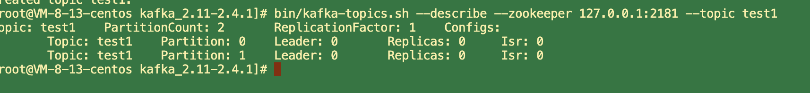

   以下是输出内容的解释，第一行是所有分区的概要信息，之后的每一行表示每一个partition的信息。

      leader节点负责给定partition的所有读写请求。
      replicas 表示某个partition在哪几个broker上存在备份。不管这个节点是不是”leader“，甚至这个节点挂了，也会列出。
      isr 是replicas的一个子集，它只列出当前还存活着的，并且已同步备份了该partition的节点。

   可以进入kafka的数据文件存储目录查看test和test1主题的消息日志文件:

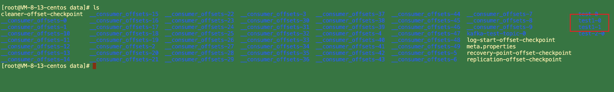

   消息日志文件主要存放在分区文件夹里的以log结尾的日志文件里，如下是test1主题对应的分区0的消息日志:

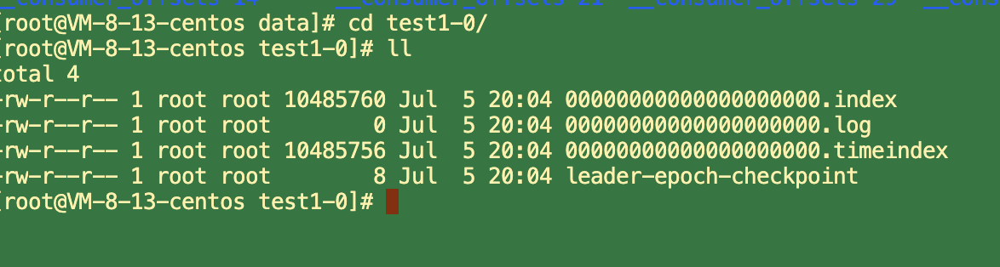

   当然我们也可以通过如下命令增加topic的分区数量(目前kafka不支持减少分区):
   
```shell
bin/kafka-topics.sh -alter --partitions 3 --zookeeper 127.0.0.1:2181 --topic test
```

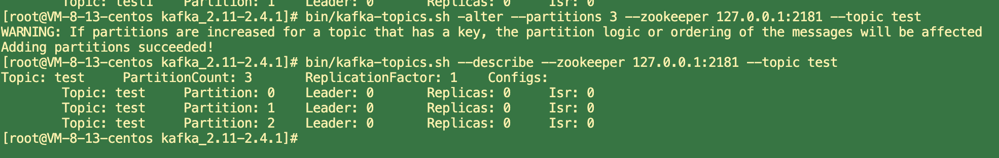

#### 5.3 可以这么来理解Topic，Partition和Broker

   一个topic，代表逻辑上的一个业务数据集，比如按数据库里不同表的数据操作消息区分放入不同topic，订单相关操作消 息放入订单topic，
   用户相关操作消息放入用户topic，对于大型网站来说，后端数据都是海量的，订单消息很可能是非常 巨量的，比如有几百个G甚至达到TB级别，
   如果把这么多数据都放在一台机器上可定会有容量限制问题，那么就可以在 topic内部划分多个partition来分片存储数据，
   不同的partition可以位于不同的机器上，每台机器上都运行一个Kafka的 进程Broker。

#### 5.4 为什么要对Topic下数据进行分区存储?

   1、commit log文件会受到所在机器的文件系统大小的限制，分区之后可以将不同的分区放在不同的机器上，相当于对 数据做了分布式存储，
   理论上一个topic可以处理任意数量的数据。

   2、为了提高并行度。
   
### 6. 集群消费 

   log的partitions分布在kafka集群中不同的broker上，每个broker可以请求备份其他broker上partition上的数据。
   kafka 集群支持配置一个partition备份的数量。

   针对每个partition，都有一个broker起到“leader”的作用，0个或多个其他的broker作为“follwers”的作用。 
   leader处理所有的针对这个partition的读写请求，而followers被动复制leader的结果，不提供读写(主要是为了保证多 副本数据与消费的一致性)。
   如果这个leader失效了，其中的一个follower将会自动的变成新的leader。

#### 6.1 Producers

   生产者将消息发送到topic中去，同时负责选择将message发送到topic的哪一个partition中。通过round-robin做简单的 负载均衡。
   也可以根据消息中的某一个关键字来进行区分。通常第二种方式使用的更多。
   
#### 6.2 Consumers

   传统的消息传递模式有2种:队列( queue) 和(publish-subscribe)

      1. queue模式:多个consumer从服务器中读取数据，消息只会到达一个consumer。
      2. publish-subscribe模式:消息会被广播给所有的consumer。

   Kafka基于这2种模式提供了一种consumer的抽象概念:consumer group。

      1. queue模式:所有的consumer都位于同一个consumer group 下。 
      2. publish-subscribe模式:所有的consumer都有着自己唯一的consumer group。

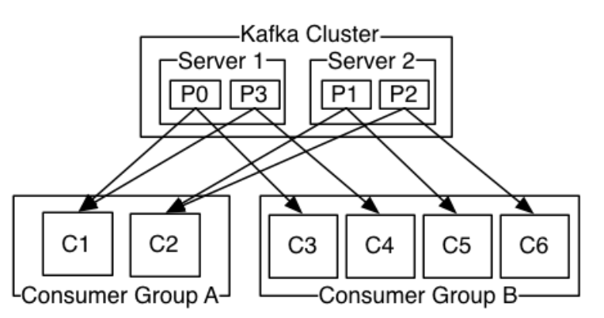

   上图说明:由2个broker组成的kafka集群，某个主题总共有4个partition(P0-P3)，分别位于不同的broker上。
   这个集群 由2个Consumer Group消费， A有2个consumer instances ，B有4个。

   通常一个topic会有几个consumer group，每个consumer group都是一个逻辑上的订阅者( logical subscriber )。
   每个consumer group由多个consumer instance组成，从而达到可扩展和容灾的功能。
   
#### 6.3 消费顺序

   一个partition同一个时刻在一个consumer group中只能有一个consumer instance在消费，从而保证消费顺序。 
   consumer group中的consumer instance的数量不能比一个Topic中的partition的数量多，否则，多出来的 consumer消费不到消息。

   Kafka只在partition的范围内保证消息消费的局部顺序性，不能在同一个topic中的多个partition中保证总的消费顺序 性。

   如果有在总体上保证消费顺序的需求，那么我们可以通过将topic的partition数量设置为1，将consumer group中的 consumer instance数量也设置为1，
   但是这样会影响性能，所以kafka的顺序消费很少用。
   
### 7. kafka 可视化工具 

#### 7.1 kafka-manager

   安装及基本使用可参考：https://www.cnblogs.com/dadonggg/p/8205302.html

#### 7.2 kafkaUI-lite

   安装及基本使用可参考:https://gitee.com/freakchicken/kafka-ui-lite

