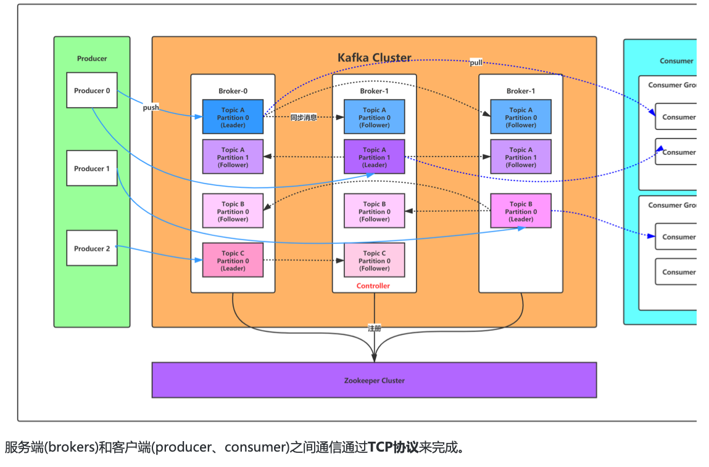

### 1. kafka 设计原理详解 



#### 1.1 Kafka核心总控制器Controller

在Kafka集群中会有一个或者多个broker，其中有一个broker会被选举为控制器（Kafka Controller），它负责管理整个集群中所有分区和副本的状态。

    当某个分区的leader副本出现故障时，由控制器负责为该分区选举新的leader副本。
    当检测到某个分区的ISR集合发生变化时，由控制器负责通知所有broker更新其元数据信息。
    当使用kafka-topics.sh脚本为某个topic增加分区数量时，同样还是由控制器负责让新分区被其他节点感知到。

#### 1.2 Controller选举机制

在kafka集群启动的时候，会自动选举一台broker作为controller来管理整个集群，选举的过程是集群中每个broker都会尝试在zookeeper上创建一个 
/controller 临时节点，zookeeper会保证有且仅有一个broker能创建成功，这个broker就会成为集群的总控器controller。

当这个controller角色的broker宕机了，此时zookeeper临时节点会消失，集群里其他broker会一直监听这个临时节点，发现临时节点消失了，
就竞争再次创建临时节点，就是我们上面说的选举机制，zookeeper又会保证有一个broker成为新的controller。

具备控制器身份的broker需要比其他普通的broker多一份职责，具体细节如下：

    1. 监听broker相关的变化。为Zookeeper中的/brokers/ids/节点添加BrokerChangeListener，用来处理broker增减的变化。
    
    2. 监听topic相关的变化。为Zookeeper中的/brokers/topics节点添加TopicChangeListener，用来处理topic增减的变化；
    为Zookeeper中的/admin/delete_topics节点添加TopicDeletionListener，用来处理删除topic的动作。

    3. 从Zookeeper中读取获取当前所有与topic、partition以及broker有关的信息并进行相应的管理。对于所有topic所对应的Zookeeper中的/brokers/topics/[topic]节点添加PartitionModificationsListener，用来监听topic中的分区分配变化。
    
    4. 更新集群的元数据信息，同步到其他普通的broker节点中。

#### 1.3 Partition副本选举Leader机制

   controller感知到分区leader所在的broker挂了(controller监听了很多zk节点可以感知到broker存活)，controller会从ISR列表(参数unclean.leader.election.enable=false的前提下)
   里挑第一个broker作为leader(第一个broker最先放进ISR列表，可能是同步数据最多的副本)，如果参数unclean.leader.election.enable为true，
   代表在ISR列表里所有副本都挂了的时候可以在ISR列表以外的副本中选leader，这种设置，可以提高可用性，但是选出的新leader有可能数据少很多。

   副本进入ISR列表有两个条件：

        1. 副本节点不能产生分区，必须能与zookeeper保持会话以及跟leader副本网络连通

        2. 副本能复制leader上的所有写操作，并且不能落后太多。(与leader副本同步滞后的副本，是由 replica.lag.time.max.ms 配置决定的，
        超过这个时间都没有跟leader同步过的一次的副本会被移出ISR列表)

#### 1.4 消费者消费消息的offset记录机制

   每个consumer会定期将自己消费分区的offset提交给kafka内部topic：__consumer_offsets，提交过去的时候，key是consumerGroupId+topic+分区号，value就是当前offset的值，
   kafka会定期清理topic里的消息，最后就保留最新的那条数据

   因为__consumer_offsets可能会接收高并发的请求，kafka默认给其分配50个分区(可以通过offsets.topic.num.partitions设置)，这样可以通过加机器的方式抗大并发。

   通过如下公式可以选出consumer消费的offset要提交到__consumer_offsets的哪个分区

   公式：hash(consumerGroupId)  %  __consumer_offsets主题的分区数

#### 1.5 消费者Rebalance机制

   rebalance就是说如果消费组里的消费者数量有变化或消费的分区数有变化，kafka会重新分配消费者消费分区的关系。比如consumer group中某个消费者挂了，此时会自动把分配给他的分区交给其他的消费者，
   如果他又重启了，那么又会把一些分区重新交还给他。

   注意：rebalance只针对subscribe这种不指定分区消费的情况，如果通过assign这种消费方式指定了分区，kafka不会进行rebanlance。

   如下情况可能会触发消费者rebalance

    1. 消费组里的consumer增加或减少了
    2. 动态给topic增加了分区
    3. 消费组订阅了更多的topic

   rebalance过程中，消费者无法从kafka消费消息，这对kafka的TPS会有影响，如果kafka集群内节点较多，比如数百个，那重平衡可能会耗时极多，所以应尽量避免在系统高峰期的重平衡发生。

#### 1.6 消费者Rebalance分区分配策略：

   主要有三种rebalance的策略：range、round-robin、sticky。

   Kafka 提供了消费者客户端参数partition.assignment.strategy 来设置消费者与订阅主题之间的分区分配策略。默认情况为range分配策略。

   假设一个主题有10个分区(0-9)，现在有三个consumer消费：

   *range*策略就是按照分区序号排序，假设 n＝分区数／消费者数量 = 3， m＝分区数%消费者数量 = 1，那么前 m 个消费者每个分配 n+1 个分区，后面的（消费者数量－m ）个消费者每个分配 n 个分区。

   比如分区0~3给一个consumer，分区4~6给一个consumer，分区7~9给一个consumer。

   *round-robin* 策略就是轮询分配，比如分区0、3、6、9给一个consumer，分区1、4、7给一个consumer，分区2、5、8给一个consumer

   *sticky* 策略初始时分配策略与round-robin类似，但是在rebalance的时候，需要保证如下两个原则。

    1）分区的分配要尽可能均匀 。
    2）分区的分配尽可能与上次分配的保持相同。

   当两者发生冲突时，第一个目标优先于第二个目标 。这样可以最大程度维持原来的分区分配的策略。

   比如对于第一种range情况的分配，如果第三个consumer挂了，那么重新用sticky策略分配的结果如下：

    consumer1除了原有的0~3，会再分配一个7
    consumer2除了原有的4~6，会再分配8和9

#### 1.7 Rebalance过程如下

   当有消费者加入消费组时，消费者、消费组及组协调器之间会经历以下几个阶段。


##### 1.7.1 第一阶段：选择组协调器

   *组协调器GroupCoordinator*：每个consumer group都会选择一个broker作为自己的组协调器coordinator，负责监控这个消费组里的所有消费者的心跳，以及判断是否宕机，然后开启消费者rebalance。

   consumer group中的每个consumer启动时会向kafka集群中的某个节点发送 FindCoordinatorRequest 请求来查找对应的组协调器GroupCoordinator，并跟其建立网络连接。

   *组协调器选择方式：*

    consumer消费的offset要提交到__consumer_offsets的哪个分区，这个分区leader对应的broker就是这个consumer group的coordinator

##### 1.7.2 第二阶段：加入消费组JOIN GROUP

   在成功找到消费组所对应的 GroupCoordinator 之后就进入加入消费组的阶段，在此阶段的消费者会向 GroupCoordinator 发送 JoinGroupRequest 请求，并处理响应。
   然后GroupCoordinator 从一个consumer group中选择第一个加入group的consumer作为leader(消费组协调器)，把consumer group情况发送给这个leader，
   接着这个leader会负责制定分区方案。

##### 1.7.3 第三阶段（ SYNC GROUP)

   consumer leader通过给GroupCoordinator发送SyncGroupRequest，接着GroupCoordinator就把分区方案下发给各个consumer，他们会根据指定分区的leader broker进行网络连接以及消息消费。

#### 1.8 producer发布消息机制剖析

##### 1.8.1 写入方式

  producer 采用 push 模式将消息发布到 broker，每条消息都被 append 到 patition 中，属于顺序写磁盘（顺序写磁盘效率比随机写内存要高，保障 kafka 吞吐率）。

##### 1.8.2 消息路由

   producer 发送消息到 broker 时，会根据分区算法选择将其存储到哪一个 partition。其路由机制为：

    1. 指定了 patition，则直接使用；
    2. 未指定 patition 但指定 key，通过对 key 的 value 进行hash 选出一个 patition
    3. patition 和 key 都未指定，使用轮询选出一个 patition。

##### 1.8.3 写入流程 


   1. producer 先从 zookeeper 的 "/brokers/.../state" 节点找到该 partition 的 leader
   
   2. producer 将消息发送给该 leader
   
   3. leader 将消息写入本地 log
   
   4. followers 从 leader pull 消息，写入本地 log 后 向leader 发送 ACK
   
   5. leader 收到所有 ISR 中的 replica 的 ACK 后，增加 HW（high watermark，最后 commit 的 offset） 并向 producer 发送 ACK

#### 1.9 日志分段存储

   Kafka 一个分区的消息数据对应存储在一个文件夹下，以topic名称+分区号命名，消息在分区内是分段(segment)存储，每个段的消息都存储在不一样的log文件里，这种特性方便old segment file快速被删除，
   kafka规定了一个段位的 log 文件最大为 1G，做这个限制目的是为了方便把 log 文件加载到内存去操作：

```
# 部分消息的offset索引文件，kafka每次往分区发4K(可配置)消息就会记录一条当前消息的offset到index文件，
# 如果要定位消息的offset会先在这个文件里快速定位，再去log文件里找具体消息
00000000000000000000.index
# 消息存储文件，主要存offset和消息体
00000000000000000000.log
# 消息的发送时间索引文件，kafka每次往分区发4K(可配置)消息就会记录一条当前消息的发送时间戳与对应的offset到timeindex文件，
# 如果需要按照时间来定位消息的offset，会先在这个文件里查找
00000000000000000000.timeindex

00000000000005367851.index
00000000000005367851.log
00000000000005367851.timeindex

00000000000009936472.index
00000000000009936472.log
00000000000009936472.timeindex
```

   这个 9936472 之类的数字，就是代表了这个日志段文件里包含的起始 Offset，也就说明这个分区里至少都写入了接近 1000 万条数据了。

   Kafka Broker 有一个参数，log.segment.bytes，限定了每个日志段文件的大小，最大就是 1GB。

   一个日志段文件满了，就自动开一个新的日志段文件来写入，避免单个文件过大，影响文件的读写性能，这个过程叫做 log rolling，正在被写入的那个日志段文件，叫做 active log segment。

#### 1.10 zookeeper节点数据图


### 2. 线上问题优化

#### 2.1 消息丢失情况

##### 2.1.1 消息发送端：

  （1）acks=0： 表示producer不需要等待任何broker确认收到消息的回复，就可以继续发送下一条消息。性能最高，但是最容易丢消息。大数据统计报表场景，对性能要求很高，对数据丢失不敏感的情况可以用这种。
  
  （2）acks=1： 至少要等待leader已经成功将数据写入本地log，但是不需要等待所有follower是否成功写入。就可以继续发送下一条消息。这种情况下，如果follower没有成功备份数据，而此时leader又挂掉，则消息会丢失。

  （3）acks=-1或all： 这意味着leader需要等待所有备份(min.insync.replicas配置的备份个数)都成功写入日志，这种策略会保证只要有一个备份存活就不会丢失数据。这是最强的数据保证。一般除非是金融级别，或跟钱打交道的场景才会使用这种配置。当然如果min.insync.replicas配置的是1则也可能丢消息，跟acks=1情况类似。

##### 2.1.2 消息消费端：

   如果消费这边配置的是自动提交，万一消费到数据还没处理完，就自动提交offset了，但是此时你consumer直接宕机了，未处理完的数据丢失了，下次也消费不到了。

#### 2.2 消息重复消费

##### 2.2.1 消息发送端：

   发送消息如果配置了重试机制，比如网络抖动时间过长导致发送端发送超时，实际broker可能已经接收到消息，但发送方会重新发送消息

##### 2.2.2 消息消费端：

   如果消费这边配置的是自动提交，刚拉取了一批数据处理了一部分，但还没来得及提交，服务挂了，下次重启又会拉取相同的一批数据重复处理

   一般消费端都是要做消费幂等处理的。

#### 2.3 消息乱序

   如果发送端配置了重试机制，kafka不会等之前那条消息完全发送成功才去发送下一条消息，这样可能会出现，发送了1，2，3条消息，第一条超时了，后面两条发送成功，再重试发送第1条消息，
   这时消息在broker端的顺序就是2，3，1了

   所以，是否一定要配置重试要根据业务情况而定。也可以用同步发送的模式去发消息，当然acks不能设置为0，这样也能保证消息发送的有序。

   kafka保证全链路消息顺序消费，需要从发送端开始，将所有有序消息发送到同一个分区，然后用一个消费者去消费，但是这种性能比较低，可以在消费者端接收到消息后将需要保证顺序消费
   的几条消费发到内存队列(可以搞多个)，一个内存队列开启一个线程顺序处理消息。

#### 2.4 消息积压

   1）线上有时因为发送方发送消息速度过快，或者消费方处理消息过慢，可能会导致broker积压大量未消费消息。

     此种情况如果积压了上百万未消费消息需要紧急处理，可以修改消费端程序，让其将收到的消息快速转发到其他topic(可以设置很多分区)，然后再启动多个消费者同时消费新主题的不同分区。

   2）由于消息数据格式变动或消费者程序有bug，导致消费者一直消费不成功，也可能导致broker积压大量未消费消息。

     此种情况可以将这些消费不成功的消息转发到其它队列里去(类似死信队列)，后面再慢慢分析死信队列里的消息处理问题。

#### 2.5 延时队列

   延时队列存储的对象是延时消息。所谓的“延时消息”是指消息被发送以后，并不想让消费者立刻获取，而是等待特定的时间后，消费者才能获取这个消息进行消费，延时队列的使用场景有很多， 比如 ：

    1）在订单系统中， 一个用户下单之后通常有 30 分钟的时间进行支付，如果 30 分钟之内没有支付成功，那么这个订单将进行异常处理，这时就可以使用延时队列来处理这些订单了。
    2）订单完成1小时后通知用户进行评价。

   实现思路：发送延时消息时先把消息按照不同的延迟时间段发送到指定的队列中（topic_1s，topic_5s，topic_10s，...topic_2h，这个一般不能支持任意时间段的延时），
   然后通过定时器进行轮训消费这些topic，查看消息是否到期，如果到期就把这个消息发送到具体业务处理的topic中，队列中消息越靠前的到期时间越早，具体来说就是定时器在一次消费过程中，
   对消息的发送时间做判断，看下是否延迟到对应时间了，如果到了就转发，如果还没到这一次定时任务就可以提前结束了。

#### 2.6 消息回溯

   如果某段时间对已消费消息计算的结果觉得有问题，可能是由于程序bug导致的计算错误，当程序bug修复后，这时可能需要对之前已消费的消息重新消费，可以指定从多久之前的消息回溯消费，
   这种可以用consumer的offsetsForTimes、seek等方法指定从某个offset偏移的消息开始消费，参见上节课的内容。

#### 2.7 分区数越多吞吐量越高吗

   可以用kafka压测工具自己测试分区数不同，各种情况下的吞吐量

```shell
# 往test里发送一百万消息，每条设置1KB
# throughput 用来进行限流控制，当设定的值小于 0 时不限流，当设定的值大于 0 时，当发送的吞吐量大于该值时就会被阻塞一段时间
bin/kafka-producer-perf-test.sh --topic test --num-records 1000000 --record-size 1024 --throughput -1 --producer-props bootstrap.servers=192.168.65.60:9092 acks=1
```


   网络上很多资料都说分区数越多吞吐量越高 ， 但从压测结果来看，分区数到达某个值吞吐量反而开始下降，实际上很多事情都会有一个临界值，当超过这个临界值之后，很多原本符合既定逻辑的走向又会变得不同。
   一般情况分区数跟集群机器数量相当就差不多了。

   当然吞吐量的数值和走势还会和磁盘、文件系统、 I/O调度策略等因素相关。

   注意：如果分区数设置过大，比如设置10000，可能会设置不成功，后台会报错"java.io.IOException : Too many open files"。

   异常中最关键的信息是“ Too many open flies”，这是一种常见的 Linux 系统错误，通常意味着文件描述符不足，它一般发生在创建线程、创建 Socket、打开文件这些场景下 。
   在 Linux系统的默认设置下，这个文件描述符的个数不是很多 ，通过 ulimit -n 命令可以查看：一般默认是1024，可以将该值增大，比如：ulimit -n 65535

#### 2.8 消息传递保障
 
   at most once(消费者最多收到一次消息，0--1次)：acks = 0 可以实现。

   at least once(消费者至少收到一次消息，1--多次)：ack = all 可以实现。
   
   exactly once(消费者刚好收到一次消息)：at least once 加上消费者幂等性可以实现，还可以用kafka生产者的幂等性来实现。

   *kafka生产者的幂等性*：因为发送端重试导致的消息重复发送问题，kafka的幂等性可以保证重复发送的消息只接收一次，只需在生产者加上参数 props.put(“enable.idempotence”, true) 即可，
   默认是false不开启。

   具体实现原理是，kafka每次发送消息会生成PID和Sequence Number，并将这两个属性一起发送给broker，broker会将PID和Sequence Number跟消息绑定一起存起来，下次如果生产者重发相同消息，
   broker会检查PID和Sequence Number，如果相同不会再接收。

    PID：每个新的 Producer 在初始化的时候会被分配一个唯一的 PID，这个PID 对用户完全是透明的。生产者如果重启则会生成新的PID。

    Sequence Number：对于每个 PID，该 Producer 发送到每个 Partition 的数据都有对应的序列号，这些序列号是从0开始单调递增的。

#### 2.9 kafka的事务

   Kafka的事务不同于Rocketmq，Rocketmq是保障本地事务(比如数据库)与mq消息发送的事务一致性，Kafka的事务主要是保障一次发送多条消息的事务一致性(要么同时成功要么同时失败)，
   一般在kafka的流式计算场景用得多一点，比如，kafka需要对一个topic里的消息做不同的流式计算处理，处理完分别发到不同的topic里，这些topic分别被不同的下游系统消费(比如hbase，redis，es等)，
   这种我们肯定希望系统发送到多个topic的数据保持事务一致性。Kafka要实现类似Rocketmq的分布式事务需要额外开发功能。

kafka的事务处理可以参考官方文档：https://kafka.apache.org/24/javadoc/index.html?org/apache/kafka/clients/producer/KafkaProducer.html

```
Properties props = new Properties();
 props.put("bootstrap.servers", "localhost:9092");
 props.put("transactional.id", "my-transactional-id");
 Producer<String, String> producer = new KafkaProducer<>(props, new StringSerializer(), new StringSerializer());
 //初始化事务
 producer.initTransactions();

 try {
     //开启事务
     producer.beginTransaction();
     for (int i = 0; i < 100; i++){
         //发到不同的主题的不同分区
         producer.send(new ProducerRecord<>("hdfs-topic", Integer.toString(i), Integer.toString(i)));
         producer.send(new ProducerRecord<>("es-topic", Integer.toString(i), Integer.toString(i)));
         producer.send(new ProducerRecord<>("redis-topic", Integer.toString(i), Integer.toString(i)));
     }
     //提交事务
     producer.commitTransaction();
 } catch (ProducerFencedException | OutOfOrderSequenceException | AuthorizationException e) {
     // We can't recover from these exceptions, so our only option is to close the producer and exit.
     producer.close();
 } catch (KafkaException e) {
     // For all other exceptions, just abort the transaction and try again.
     //回滚事务
     producer.abortTransaction();
 }
 producer.close();
```

#### 2.10 kafka高性能的原因

   磁盘顺序读写：kafka消息不能修改以及不会从文件中间删除保证了磁盘顺序读，kafka的消息写入文件都是追加在文件末尾，不会写入文件中的某个位置(随机写)保证了磁盘顺序写。

   数据传输的零拷贝

   读写数据的批量batch处理以及压缩传输

   数据传输零拷贝原理：


### 3. 线上环境规划


#### 3.1 参数设置 

kafka是scala语言开发，运行在JVM上，需要对JVM参数合理设置

修改bin/kafka-start-server.sh中的jvm设置，假设机器是32G内存，可以如下设置：

```shell
export KAFKA_HEAP_OPTS="-Xmx16G -Xms16G -Xmn10G -XX:MetaspaceSize=256M -XX:+UseG1GC -XX:MaxGCPauseMillis=50 -XX:G1HeapRegionSize=16M"
```

   这种大内存的情况一般都要用G1垃圾收集器，因为年轻代内存比较大，用G1可以设置GC最大停顿时间，不至于一次minor gc就花费太长时间，当然，因为像kafka，rocketmq，es这些中间件，写数据到磁盘会用到操作系统的page cache，所以JVM内存不宜分配过大，需要给操作系统的缓存留出几个G。

