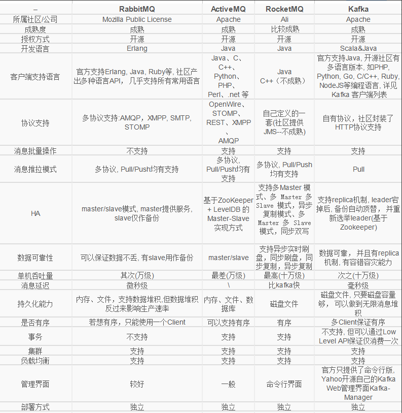

### 什么要使用MQ消息中间件?
   
   解耦、异步、削峰

### 使用了消息队列会有什么缺点?
   
   系统可用性降低、系统复杂性增加

### 消息队列常用的使用场景
   
   一发一存一消费，没有最好的消息队列中间件(简称消息中间件)，只有最合适的消息中间件。
   
   **非实时性：** 当不需要立即获得结果，但是并发量又需要进行控制的时候，差不多就是需要使用消息队列的时候。主要解决了应用耦合、异步处理、流量削锋等问题。
   
   **应用耦合：** 多应用间通过消息队列对同一消息进行处理，避免调用接口失败导致整个过程失败；（如：订单->库存）
   
   **异步处理：** 多应用对消息队列中同一消息进行处理，应用间并发处理消息，相比串行处理，减少处理时间；(点对多场景，广播场景(注册发短信，发邮件)等等)
   
   **限流削峰：** 应用于秒杀或抢购活动中，避免流量过大导致应用系统挂掉的情况；(根据服务承受度设置队列大小，超过了就返回活动结束了，咱们经常各大商城秒杀，心里还没有点B数吗)减少压力,避免服务挂掉。
   
   **消息驱动的系统：** 系统分为消息队列、消息生产者、消息消费者，生产者负责产生消息，消费者(可能有多个)负责对消息进行处理；(分工处理(各自对应相应的队列)，灵活应用(收到就处理/定时处理))

### 两种模式：
   
   点对点：每个消息只有一个消费者（Consumer），不可重复消费(一旦被消费，消息就不再在消息队列中)
   
   发布/订阅：微信公众号(Topic)，大伙(订阅者)订阅关注之后，微信公众号运营平台(发布者)发布信息后，大伙微信就都收到信息了，这里其实还分pull/push的。一个是主动推送，一个是被动拉取
   
    基于发布/订阅模式做扩展就是横向扩展，多个队列及消费分组订阅(提高消费能力)
   
   pull：主动权在于消费方，优点是按需消费(吃自助餐，能吃多少拿多少)，而且服务端队列堆积的消息处理也相对简单(不用记录状态啊，状态都消费端)；缺点就是消息延迟(不知道啥时候去拉取更新)，这时候有小伙伴会问，那为啥不叫服务端通知一下呢(有句话叫不在其位不谋其政，服务端通知必然要记录通知状态和增加之间的通信带宽；当然也可以根据实际情况来选择和push组合起来用(男女搭配干活不累嘛)来提高消息的实时性)
   
   push：主动权就在服务方了，优点是实时性高，服务端可以统一管理来进行负载，不过也容易导致慢消费(就得考虑消费方受不受得了，毕竟你说你了解，但也只有对方才清楚你有多了解)；缺点就是发送消息的状态是集中式管理，压力大啊(要分发消息还要记录状态还要做备份，又当爹来又当妈，你说累不累)
   
    对于顺序消息，这种场景有限且成本太高的方式就得慎重考虑了，对那种全局有序但允许出现小误差的场景(日志推送)，pull模式就非常适合了(所以说kafka为啥常用于日志处理、大数据等方面)，要问为什么？自己去领悟
   

### 实际开发中消息中间件选型基于几个方面
    
   1.功能：这个就多了，优先级队列、延迟队列(划分不同的延迟队列来避免重新排序消耗性能，缺点嘛自己悟)、死信队列(放没有推送成功的)、消费模式(pull/push)、广播消费、消息回溯(可追溯嘛，不然被卖了都不知道是谁)、消息堆积+持久化、消息追踪(链路条，方便定位)、消息过滤(根据规则过滤啊，不同类别消息发送到不同topic)、多协议支持(通用性)、跨语言支持(流行程度)、流量控制(嘿嘿嘿，上面有)、消息顺序性(还要再说一遍？)、安全机制(身份认证，权限认证(读写))、消息幂等性(承诺知道不，答应人家的事就一定要做到)、事务性消息(不想说)等
   
   2.性能：一般是指其吞吐量(统一大小的消息体和不同大小的消息体生产和消耗能力)，性能和功能很多时候是相悖的，鱼和熊掌不可兼得。
   
   3.高可靠、高可用：先说可靠，主要在于消息的持久化这一块(消息只要写入就一定会被消费，不会因为故障导致数据丢失(这个就很好测试出来了吧))。如果是从系统的角度来看就得从整体的维度去衡量了(不能单单只靠消息中间件本身，要从生产端、服务端、消费端三个维度去保障)。
     
   再说可用，主要在于一个是对外部服务的依赖性(像kafka依赖zookeeper)，依赖也分强依赖和弱依赖，一个在于本身的备份机制所带来的保障性(像主从复制这种备份啊，增加多个slave来加强保障同时也会存在资源浪费，大部分时候Slave可能是空闲的)。
   
   4.运维：通常有审核评估啊、监控啊、报警提醒啊、容灾啊、扩容啊、升级部署等等，一方面看中间件支撑的维度，一方面就看结合自动化运维的难易度
   
   5.社区力度及生态发展：这个好理解吧，使用开源框架最开始基本上愉快的奔跑，但时不时的总会掉坑里，能不能爬出来一方面看自身的实力，一方面就看社区的力度了
   
   6.成本： 尽量贴合团队自身的技术栈体系，让一个C栈的团队去深挖zeroMQ总比scala编写kafka要容易的多

### Kafka、RabbitMQ、RocketMQ、消息中间件的对比
   
   

### RabbitMQ
   
   **基于erlang开发**
   
   是采用Erlang语言实现的AMQP协议的消息中间件，最初起源于金融系统，用于在分布式系统中存储转发消息。RabbitMQ发展到今天，被越来越多的人认可，这和它在可靠性、可用性、扩展性、功能丰富等方面的卓越表现是分不开的。
   
   优点：
   
       由于erlang语言的特性，mq性能较好，高并发；
       健壮、稳定、易用、跨平台、支持多种语言、文档齐全；
       有消息确认机制和持久化机制，可靠性高；
       高度可定制的路由；
       管理界面较丰富，在互联网公司也有较大规模的应用；
       社区活跃度高；
   
   缺点：
   
       尽管结合erlang语言本身的并发优势，性能较好，但是不利于做二次开发和维护；
       实现了代理架构，意味着消息在发送到客户端之前可以在中央节点上排队。此特性使得RabbitMQ易于使用和部署，但是使得其运行速度较慢，因为中央节点增加了延迟，消息封装后也比较大；
       需要学习比较复杂的接口和协议，学习和维护成本较高；
   
### ActiveMQ
   
   基于java开发
   
   是Apache出品的、采用Java语言编写的完全基于JMS1.1规范的面向消息的中间件，为应用程序提供高效的、可扩展的、稳定的和安全的企业级消息通信。不过由于历史原因包袱太重，目前市场份额没有后面三种消息中间件多，其最新架构被命名为Apollo,(京东的消息中间件就是基于activeMQ开发的)
   
   优点：
   
       跨平台(JAVA编写与平台无关有，ActiveMQ几乎可以运行在任何的JVM上)
       可以用JDBC：可以将数据持久化到数据库
       支持JMS ：支持JMS的统一接口;
       支持自动重连；
       有安全机制：支持基于shiro，jaas等多种安全配置机制，可以对Queue/Topic进行认证和授权
       监控完善：拥有完善的监控，包括Web Console，JMX，Shell命令行，Jolokia的REST API；
       界面友善：提供的Web Console可以满足大部分情况，还有很多第三方的组件可以使用，如hawtio；
   
   缺点：
   
       社区活跃度不及RabbitMQ高；
       会出莫名其妙的问题，会丢失消息；
       不适合用于上千个队列的应用场景；
   
### RocketMQ

   **基于java开发（阿里消息中间件）**
    
   是阿里开源的消息中间件，目前已经捐献个Apache基金会，它是由Java语言开发的，具备高吞吐量、高可用性、适合大规模分布式系统应用等特点，经历过双11的洗礼，实力不容小觑。
    
   优点：
    
    单机支持 1 万以上持久化队列
    RocketMQ 的所有消息都是持久化的，先写入系统 pagecache(页高速缓冲存储器)，然后刷盘，可以保证内存与磁盘都有一份数据，访问时，直接从内存读取。
    模型简单，接口易用（JMS 的接口很多场合并不太实用）
    性能非常好，可以大量堆积消息在broker(集群中包含一个或多个服务器，这些服务器被称为broker)中；
    支持多种消费，包括集群消费、广播消费等。
    各个环节分布式扩展设计，主从HA(高可用性集群)；
    开发度较活跃，版本更新很快。
    
   缺点：
    
    支持的客户端语言不多，目前是java及c++，其中c++不成熟；
    RocketMQ社区关注度及成熟度也不及前两者；
    没有web管理界面，提供了一个CLI(命令行界面)管理工具带来查询、管理和诊断各种问题；
    没有在 mq 核心中去实现JMS等接口；

### kafka
   
   **基于Scala和Java开发**
   
   起初是由LinkedIn公司采用Scala语言开发的一个分布式、多分区、多副本且基于zookeeper协调的分布式消息系统，现已捐献给Apache基金会。它是一种高吞吐量的分布式发布订阅消息系统，以可水平扩展和高吞吐率而被广泛使用。目前越来越多的开源分布式处理系统如Cloudera、Apache Storm、Spark、Flink等都支持与Kafka集成。
   
   优点：
   
       客户端语言丰富，支持java、.net、php、ruby、python、go等多种语言；
       性能卓越，单机写入TPS约在百万条/秒，消息大小10个字节；
       提供完全分布式架构, 并有replica机制, 拥有较高的可用性和可靠性, 理论上支持消息无限堆积；
       支持批量操作；
       消费者采用Pull方式获取消息, 消息有序, 通过控制能够保证所有消息被消费且仅被消费一次;
       有优秀的第三方Kafka Web管理界面Kafka-Manager；
       在日志领域比较成熟，被多家公司和多个开源项目使用；
   
   缺点：
   
       Kafka单机超过64个队列/分区，Load会发生明显的飙高现象，队列越多，load越高，发送消息响应时间变长
       使用短轮询方式，实时性取决于轮询间隔时间；
       消费失败不支持重试；
       支持消息顺序，但是一台代理宕机后，就会产生消息乱序；
       社区更新较慢；
   
   
   