### Mybatis技术本质
   
   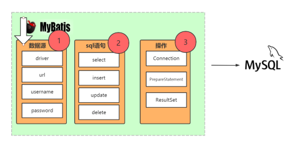
   
### Mybatis源码分析

#### Mybatis源码分析之解析数据源：
   
   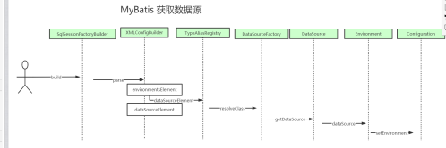
    
   mybatis是如何获取数据库源的 (主要是解析mybatis-config.xml 文件,并将结果保存到Configuration对象):
   》org.apache.ibatis.session.SqlSessionFactoryBuilder.build(java.io.InputStream)
    》org.apache.ibatis.builder.xml.XMLConfigBuilder.parse
     》org.apache.ibatis.builder.xml.XMLConfigBuilder.parseConfiguration
        》org.apache.ibatis.builder.xml.XMLConfigBuilder.environmentsElement
           》org.apache.ibatis.builder.xml.XMLConfigBuilder.dataSourceElement
              》org.apache.ibatis.session.Configuration.setEnvironment#######

#### Mybatis解析SQL语句：
   
   Mappers文件有几种方式？？？ （四种方式 resource、url、class、package）
   
   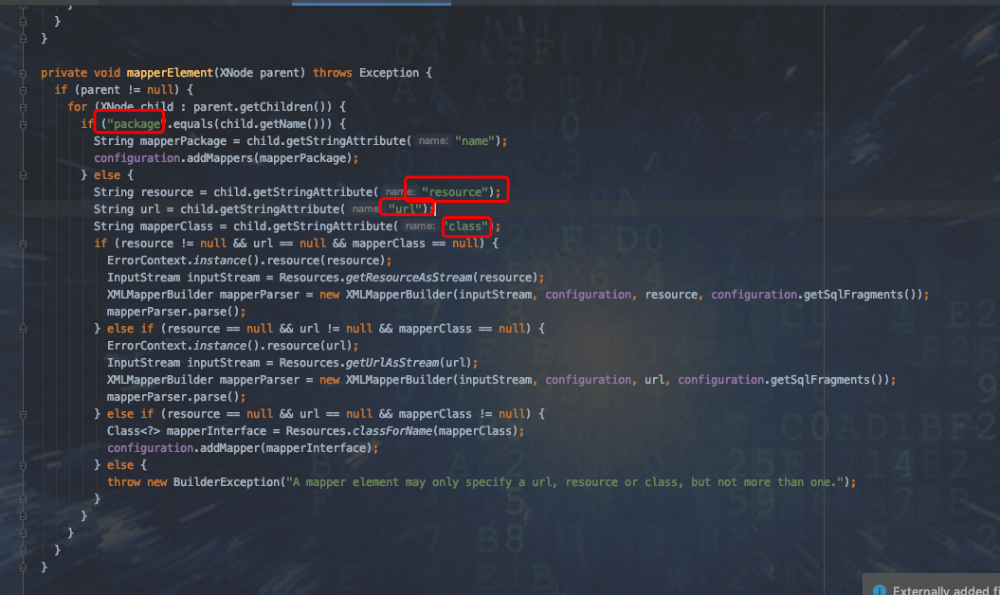
   
   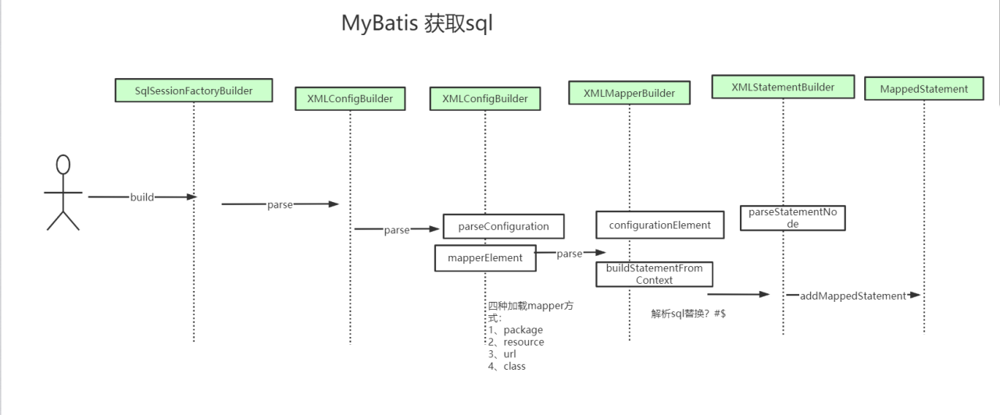
   
   mybatis是如何获取SQL语句：
    org.apache.ibatis.session.SqlSessionFactoryBuilder.build(java.io.InputStream)
      》org.apache.ibatis.builder.xml.XMLConfigBuilder.parse
        》org.apache.ibatis.builder.xml.XMLConfigBuilder.parseConfiguration
          》org.apache.ibatis.builder.xml.XMLConfigBuilder.mapperElement （解析 xml ）
       	    》org.apache.ibatis.builder.xml.XMLMapperBuilder.configurationElement
              》org.apache.ibatis.builder.xml.XMLStatementBuilder.parseStatementNode
     			》org.apache.ibatis.session.Configuration.addMappedStatement######

#### Mybatis源码分析之解析操作：
  
  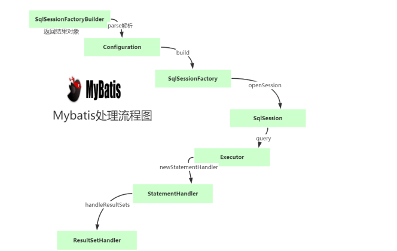
  
  mybatis是如何操作的 
  org.apache.ibatis.session.defaults.DefaultSqlSessionFactory.openSession()
     》org.apache.ibatis.session.Configuration.newExecutor(org.apache.ibatis.transaction.Transaction, org.apache.ibatis.session.ExecutorType)
      》org.apache.ibatis.executor.SimpleExecutor
       》org.apache.ibatis.session.defaults.DefaultSqlSession.selectOne(java.lang.String, java.lang.Object)
        》org.apache.ibatis.session.defaults.DefaultSqlSession.selectList(java.lang.String, java.lang.Object)
          》org.apache.ibatis.executor.CachingExecutor.query(org.apache.ibatis.mapping.MappedStatement, java.lang.Object, org.apache.ibatis.session.RowBounds, org.apache.ibatis.session.ResultHandler)
            》org.apache.ibatis.executor.CachingExecutor.query(org.apache.ibatis.mapping.MappedStatement, java.lang.Object, org.apache.ibatis.session.RowBounds, org.apache.ibatis.session.ResultHandler, org.apache.ibatis.cache.CacheKey, org.apache.ibatis.mapping.BoundSql)
             》org.apache.ibatis.executor.BaseExecutor.queryFromDatabase
               》org.apache.ibatis.executor.SimpleExecutor.doQuery
                 》org.apache.ibatis.executor.statement.PreparedStatementHandler.query
                   》org.apache.ibatis.executor.resultset.DefaultResultSetHandler.handleResultSets
  
   
#### Annotation注解@Select源码分析:

   org.apache.ibatis.session.SqlSessionFactoryBuilder.build(java.io.InputStream)　
   　＞org.apache.ibatis.builder.xml.XMLConfigBuilder
       >org.apache.ibatis.builder.xml.XMLConfigBuilder.mapperElement
           >org.apache.ibatis.session.Configuration.addMapper
             >org.apache.ibatis.binding.MapperRegistry.addMapper
               >org.apache.ibatis.binding.MapperRegistry.addMapper
                 >org.apache.ibatis.builder.annotation.MapperAnnotationBuilder.parseStatement
                   >org.apache.ibatis.builder.annotation.MapperAnnotationBuilder.getSqlSourceFromAnnotations
                     >org.apache.ibatis.builder.annotation.MapperAnnotationBuilder.buildSqlSourceFromStrings
                       >org.apache.ibatis.builder.SqlSourceBuilder.parse

#### Mybatis源码分析之SelectOne和自定义方法区别：
    
   com.WLZ.mapper.BlogMapper#selectBlog
   
   org.apache.ibatis.session.SqlSession#selectOne(java.lang.String)
   
   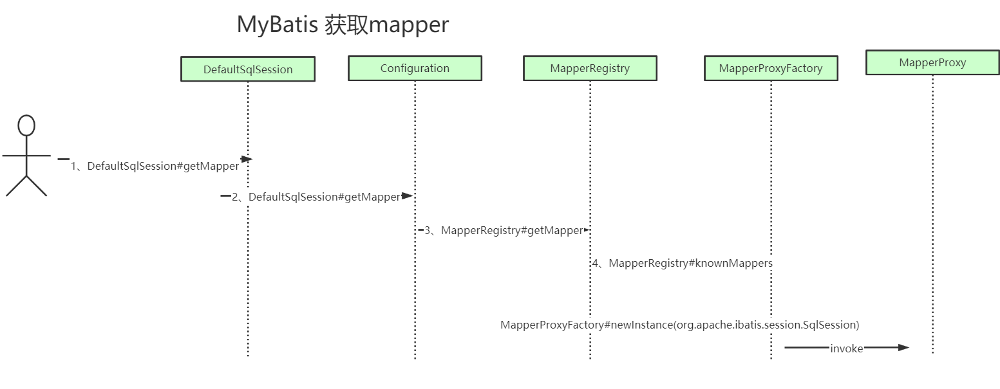

   
mybatis自带的selectone和我们自定义源码

   org.apache.ibatis.session.defaults.DefaultSqlSession.getMapper
     >org.apache.ibatis.session.Configuration.getMapper
       >org.apache.ibatis.binding.MapperRegistry.getMapper
        >org.apache.ibatis.binding.MapperProxyFactory.newInstance(org.apache.ibatis.session.SqlSession)
          >Proxy.newProxyInstance(mapperInterface.getClassLoader(), new Class[] { mapperInterface }, mapperProxy);  Spring AOP   cglib java动态代理
            >org.apache.ibatis.binding.MapperProxy.invoke
            
   
   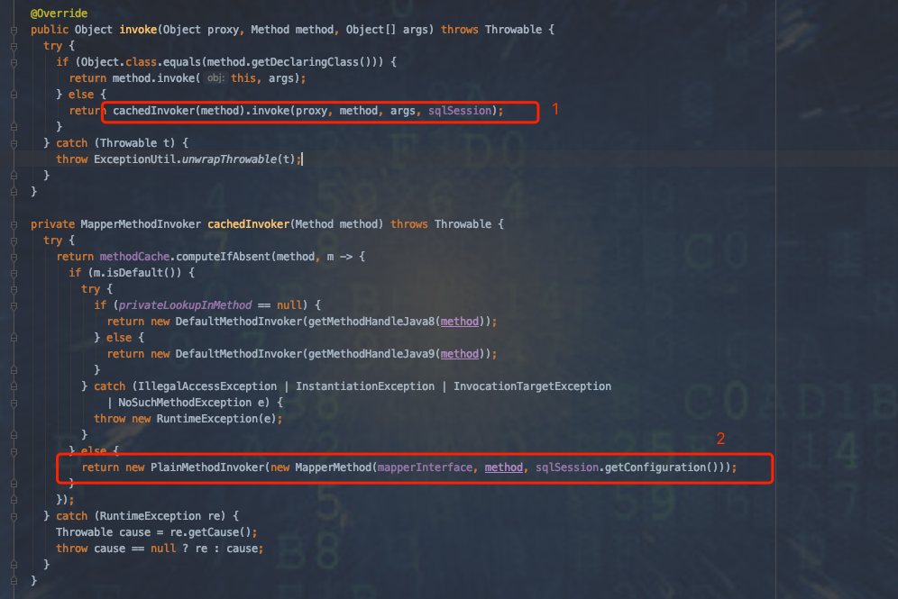
   
   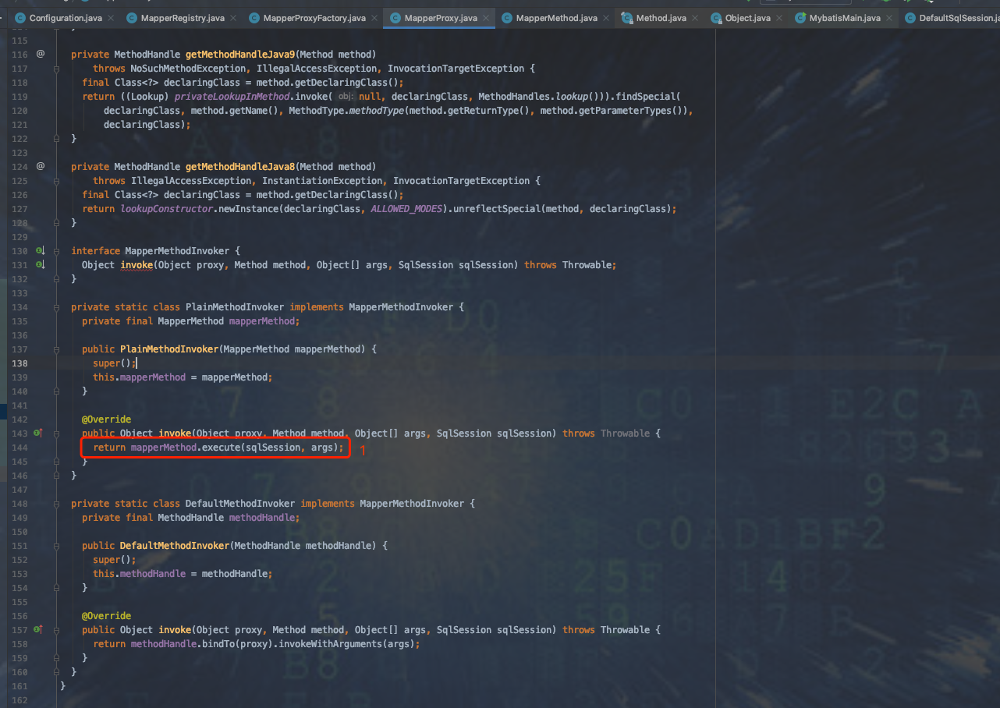
    
#### Mybatis Xml和Annotation|优缺点
   
  Annotaion方式：
   
   1、不适合比较复杂的sql 比如关联查询
   
   2、不方便（收集）管理sql
   
  Xml方法：
   
   1、xml繁琐、麻烦
   
   2、条件不确定的查询
   
   3、容易出错写错，特殊字符转义
   
### Mybatis全局配置详解：

#### plugin 插件
    
   用途：分页、监控、日志、记录sql、数据埋点
   
##### Sql记录、统计慢sql
   
  Sql解析原理：
   
   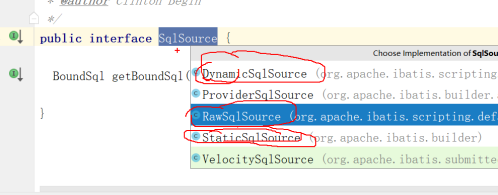
   
##### Plugin 源码分析

   org.apache.ibatis.session.SqlSessionFactoryBuilder.build(java.io.InputStream)　
   　＞org.apache.ibatis.builder.xml.XMLConfigBuilder
       >org.apache.ibatis.builder.xml.XMLConfigBuilder.pluginElement
         >org.apache.ibatis.session.Configuration.addInterceptor
           >org.apache.ibatis.plugin.InterceptorChain
             >bat.ke.qq.com.SqlPrintInterceptor.plugin
               >org.apache.ibatis.plugin.Plugin 动态代理
                 >bat.ke.qq.com.SqlPrintInterceptor.intercept
   executor = (Executor) interceptorChain.pluginAll(executor);
   
#### #{}和${}的区别是什么？
  
    #{}是预编译处理，${}是字符串替换。
  
    Mybatis在处理#{}时，会将sql中的#{}替换为?号，调用PreparedStatement的set方法来赋值；可以有效的防止SQL注入，提高系统安全性
  
    Mybatis在处理${}时，就是把${}替换成变量的值。
    
 sql 中 # 号 替换为？源码
   
  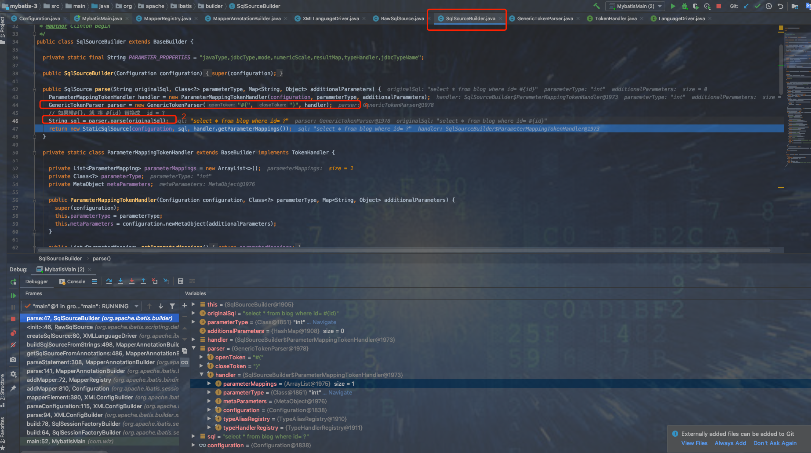
    
### 执行期主要类

   mybatis在执行期间，主要有四大核心接口对象：
   
   1、执行器Executor，执行器负责整个SQL执行过程的总体控制。
   
   2、参数处理器ParameterHandler，参数处理器负责PreparedStatement入参的具体设置。
   
   3、语句处理器StatementHandler，语句处理器负责和JDBC层具体交互，包括prepare语句，执行语句，以及调用ParameterHandler.parameterize()设置参数。
   
   4、结果集处理器ResultSetHandler，结果处理器负责将JDBC查询结果映射到java对象。

#### mybatis 三种种执行器
  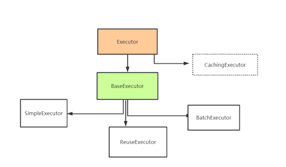
  
##### SIMPLE：
   
   ExecutorType.SIMPLE：这个执行器类型不做特殊的事情。它为每个语句的每次执行创建一个新的预处理语句。
   
   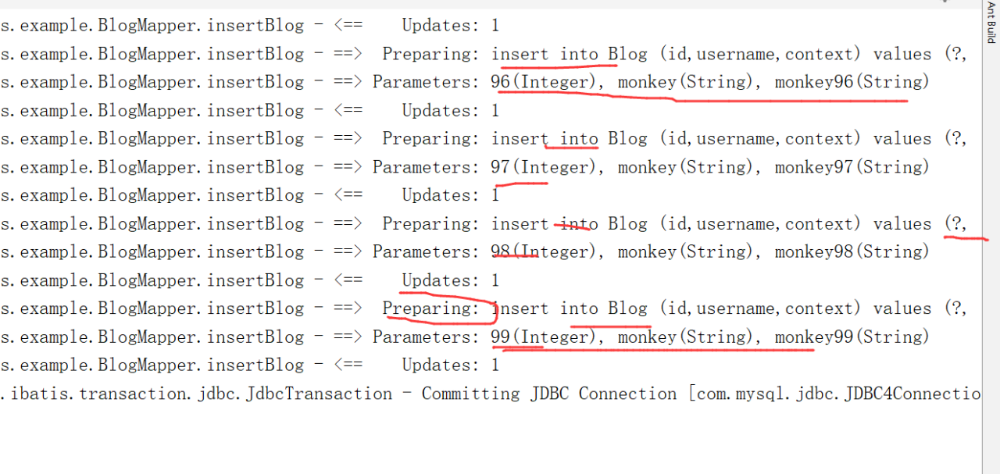
   
##### REUSE
   ExecutorType.REUSE：这个执行器类型会复用预处理语句。
   
   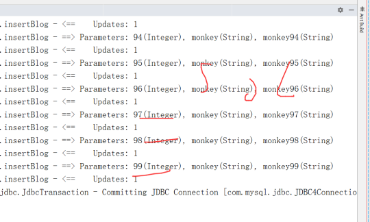

##### BATCH

   ExecutorType.BATCH：这个执行器会批量执行所有更新语句，也就是jdbc addBatch API的facade模式。
   
   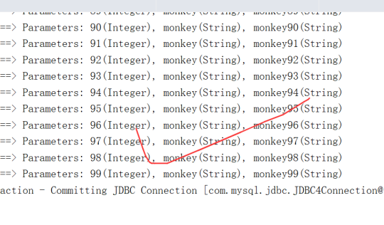
   
所以这三种类型的执行器可以说时应用于不同的负载场景下，除了SIMPLE类型外，另外两种要求对系统有较好的架构设计，当然也提供了更多的回报。

#### Mybatis处理器
   
   参数处理器ParameterHandler
   
   DefaultParameterHandler为具体实现类
   
   org.apache.ibatis.scripting.defaults.DefaultParameterHandler#setParameters

#### 语句处理器StatementHandler

   比如设置超时时间、结果集每次提取大小等操作
   
   org.apache.ibatis.executor.statement.BaseStatementHandler#prepare

#### 结果集处理器ResultSetHandler
　
   结果集处理器,顾名知义,就是用了对查询结果集进行处理的,目标是将JDBC结果集映射为业务对象
    
   接口中定义的三个接口分别用于处理常规查询的结果集,游标查询的结果集以及存储过程调用的出参设置
    
   org.apache.ibatis.executor.resultset.DefaultResultSetHandler
   
### Mybatis缓存：
   
   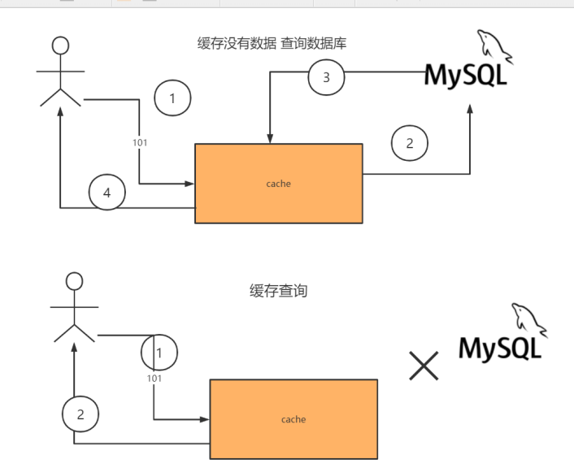

#### 一级缓存：
   
   mybatis提供了基本实现org.apache.ibatis.cache.impl.PerpetualCache，内部采用原始HashMap实现。第二个需要知道的方面是mybatis有一级缓存和二级缓存。
   一级缓存是SqlSession级别的缓存，不同SqlSession之间的缓存数据区域（HashMap）是互相不影响，MyBatis默认支持一级缓存，不需要任何的配置，
   默认情况下(一级缓存的有效范围可通过参数localCacheScope参数修改，取值为SESSION或者STATEMENT)，在一个SqlSession的查询期间，
   只要没有发生commit/rollback或者调用close()方法，那么mybatis就会先根据当前执行语句的CacheKey到一级缓存中查找，如果找到了就直接返回，不到数据库中执行。
   其实现在代码BaseExecutor.query()中
   
   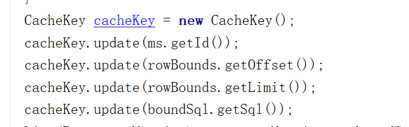

#### 二级缓存：
  
   二级缓存是mapper级别的缓存，多个SqlSession去操作同一个mapper的sql语句，多个SqlSession可以共用二级缓存，二级缓存是跨SqlSession。
   二级缓存默认不启用，需要通过在Mapper中明确设置cache，它的实现在CachingExecutor的query()方法中，如下所示：

```
@Override
  public <E> List<E> query(MappedStatement ms, Object parameterObject, RowBounds rowBounds, ResultHandler resultHandler, CacheKey key, BoundSql boundSql)
      throws SQLException {
    Cache cache = ms.getCache();
    if (cache != null) {
      flushCacheIfRequired(ms);
      if (ms.isUseCache() && resultHandler == null) {
        ensureNoOutParams(ms, parameterObject, boundSql);
        @SuppressWarnings("unchecked")
        // 如果二级缓存中找到了记录就直接返回,否则到DB查询后进行缓存
        List<E> list = (List<E>) tcm.getObject(cache, key);
        if (list == null) {
          list = delegate.<E> query(ms, parameterObject, rowBounds, resultHandler, key, boundSql);
          tcm.putObject(cache, key, list); // issue #578 and #116
        }
        return list;
      }
    }
    return delegate.<E> query(ms, parameterObject, rowBounds, resultHandler, key, boundSql);
  }
```