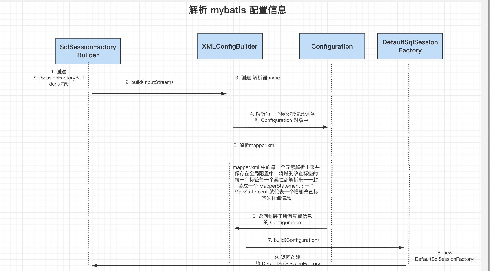
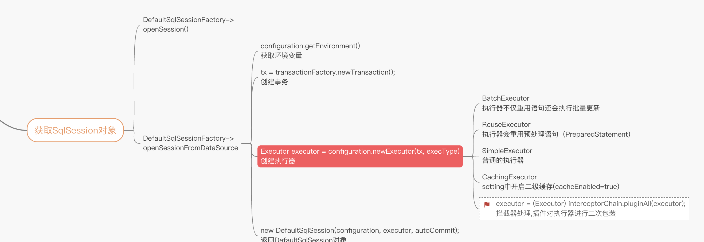
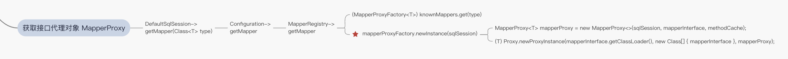
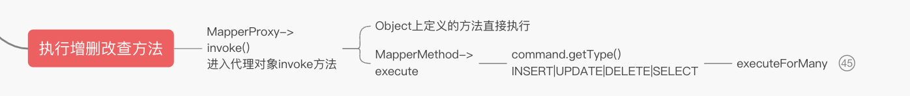

### 1. Mybatis技术本质
   
   
   
### 2. Mybatis源码分析

#### 2.1 mybatis 解析 



SqlSessionFactory sqlSessionFactory = new SqlSessionFactoryBuilder().build(inputStream);

#####  2.1.1 Mybatis源码分析之解析数据源：
   
   
    
   mybatis是如何获取数据库源的 (主要是解析mybatis-config.xml 文件,并将结果保存到Configuration对象):

   》org.apache.ibatis.session.SqlSessionFactoryBuilder.build(java.io.InputStream)
    》org.apache.ibatis.builder.xml.XMLConfigBuilder.parse
     》org.apache.ibatis.builder.xml.XMLConfigBuilder.parseConfiguration
        》org.apache.ibatis.builder.xml.XMLConfigBuilder.environmentsElement
           》org.apache.ibatis.builder.xml.XMLConfigBuilder.dataSourceElement
              》org.apache.ibatis.session.Configuration.setEnvironment#######

```java
public class XMLConfigBuilder extends BaseBuilder {
    /**
     *  获取数据源
     * @param context
     * @throws Exception
     */
    private void environmentsElement(XNode context) throws Exception {
        if (context != null) {
            if (environment == null) {
                environment = context.getStringAttribute("default");
            }
            for (XNode child : context.getChildren()) {
                String id = child.getStringAttribute("id");
                if (isSpecifiedEnvironment(id)) {
                    TransactionFactory txFactory = transactionManagerElement(child.evalNode("transactionManager"));
                    // 获取数据源节点 dataSource
                    DataSourceFactory dsFactory = dataSourceElement(child.evalNode("dataSource"));
                    DataSource dataSource = dsFactory.getDataSource();
                    Environment.Builder environmentBuilder = new Environment.Builder(id)
                            .transactionFactory(txFactory)
                            .dataSource(dataSource);
                    // 将读取到到的数据源信息 set 到 configuration 对象
                    configuration.setEnvironment(environmentBuilder.build());
                }
            }
        }
    }
    
    private DataSourceFactory dataSourceElement(XNode context) throws Exception {
        if (context != null) {
            String type = context.getStringAttribute("type");
            Properties props = context.getChildrenAsProperties();
            DataSourceFactory factory = (DataSourceFactory) resolveClass(type).getDeclaredConstructor().newInstance();
            factory.setProperties(props);
            return factory;
        }
        throw new BuilderException("Environment declaration requires a DataSourceFactory.");
    }
    
}
```

##### 2.1.2 Mybatis解析SQL语句：
   
   Mappers文件有几种方式？？？ （四种方式 resource、url、class、package）
   
   
   
   
   
   mybatis是如何获取SQL语句：

    org.apache.ibatis.session.SqlSessionFactoryBuilder.build(java.io.InputStream)
      》org.apache.ibatis.builder.xml.XMLConfigBuilder.parse
        》org.apache.ibatis.builder.xml.XMLConfigBuilder.parseConfiguration
          》org.apache.ibatis.builder.xml.XMLConfigBuilder.mapperElement （解析 xml ）
       	    》org.apache.ibatis.builder.xml.XMLMapperBuilder.configurationElement
              》org.apache.ibatis.builder.xml.XMLStatementBuilder.parseStatementNode
     			》org.apache.ibatis.session.Configuration.addMappedStatement######

```java
public class XMLConfigBuilder extends BaseBuilder {
    /**
     * 解析映射器 （获取sql 语句）
     *  四种引用 resource、url、class、<package/>
     *    <package/> 和 resource、url、class 不能共存 先寻找package
     *
     * @param parent
     * @throws Exception
     */
    private void mapperElement(XNode parent) throws Exception {
        if (parent != null) {
            for (XNode child : parent.getChildren()) {
                // 包名 多个文件
                if ("package".equals(child.getName())) {
                    String mapperPackage = child.getStringAttribute("name");
                    // 批量将 mapper 添加到map 中
                    configuration.addMappers(mapperPackage);
                } else {
                    String resource = child.getStringAttribute("resource");
                    String url = child.getStringAttribute("url");
                    String mapperClass = child.getStringAttribute("class");
                    if (resource != null && url == null && mapperClass == null) {
                        ErrorContext.instance().resource(resource);
                        InputStream inputStream = Resources.getResourceAsStream(resource);
                        XMLMapperBuilder mapperParser = new XMLMapperBuilder(inputStream, configuration, resource, configuration.getSqlFragments());
                        // 解析 mapper 文件
                        mapperParser.parse();
                    } else if (resource == null && url != null && mapperClass == null) {
                        ErrorContext.instance().resource(url);
                        InputStream inputStream = Resources.getUrlAsStream(url);
                        XMLMapperBuilder mapperParser = new XMLMapperBuilder(inputStream, configuration, url, configuration.getSqlFragments());
                        mapperParser.parse();
                    } else if (resource == null && url == null && mapperClass != null) {
                        Class<?> mapperInterface = Resources.classForName(mapperClass);
                        configuration.addMapper(mapperInterface);
                    } else {
                        throw new BuilderException("A mapper element may only specify a url, resource or class, but not more than one.");
                    }
                }
            }
        }
    }
}
```

```java
public class XMLMapperBuilder extends BaseBuilder {
    
    public void parse() {
        if (!configuration.isResourceLoaded(resource)) {
            configurationElement(parser.evalNode("/mapper"));
            configuration.addLoadedResource(resource);
            bindMapperForNamespace();
        }

        parsePendingResultMaps();
        parsePendingCacheRefs();
        parsePendingStatements();
    }
}
```


####  2.2 mybatis 执行sql 
 
  
  
  mybatis是如何操作的 
  org.apache.ibatis.session.defaults.DefaultSqlSessionFactory.openSession()
     》org.apache.ibatis.session.Configuration.newExecutor(org.apache.ibatis.transaction.Transaction, org.apache.ibatis.session.ExecutorType)
      》org.apache.ibatis.executor.SimpleExecutor
       》org.apache.ibatis.session.defaults.DefaultSqlSession.selectOne(java.lang.String, java.lang.Object)
        》org.apache.ibatis.session.defaults.DefaultSqlSession.selectList(java.lang.String, java.lang.Object)
          》org.apache.ibatis.executor.CachingExecutor.query(org.apache.ibatis.mapping.MappedStatement, java.lang.Object, org.apache.ibatis.session.RowBounds, org.apache.ibatis.session.ResultHandler)
            》org.apache.ibatis.executor.CachingExecutor.query(org.apache.ibatis.mapping.MappedStatement, java.lang.Object, org.apache.ibatis.session.RowBounds, org.apache.ibatis.session.ResultHandler, org.apache.ibatis.cache.CacheKey, org.apache.ibatis.mapping.BoundSql)
             》org.apache.ibatis.executor.BaseExecutor.queryFromDatabase
               》org.apache.ibatis.executor.SimpleExecutor.doQuery
                 》org.apache.ibatis.executor.statement.PreparedStatementHandler.query
                   》org.apache.ibatis.executor.resultset.DefaultResultSetHandler.handleResultSets

##### 2.2.1 Mybatis源码分析之获取 SqlSession



SqlSession session = sqlSessionFactory.openSession();

org.apache.ibatis.session.defaults.DefaultSqlSessionFactory.openSession()  

```java
public class DefaultSqlSessionFactory implements SqlSessionFactory {
    private SqlSession openSessionFromDataSource(ExecutorType execType, TransactionIsolationLevel level, boolean autoCommit) {
        Transaction tx = null;
        try {
            final Environment environment = configuration.getEnvironment();
            final TransactionFactory transactionFactory = getTransactionFactoryFromEnvironment(environment);
            tx = transactionFactory.newTransaction(environment.getDataSource(), level, autoCommit);
            final Executor executor = configuration.newExecutor(tx, execType);
            return new DefaultSqlSession(configuration, executor, autoCommit);
        } catch (Exception e) {
            closeTransaction(tx); // may have fetched a connection so lets call close()
            throw ExceptionFactory.wrapException("Error opening session.  Cause: " + e, e);
        } finally {
            ErrorContext.instance().reset();
        }
    }
}
```

```java
public class Configuration {
    public Executor newExecutor(Transaction transaction, ExecutorType executorType) {
        executorType = executorType == null ? defaultExecutorType : executorType;
        executorType = executorType == null ? ExecutorType.SIMPLE : executorType;
        Executor executor;
        if (ExecutorType.BATCH == executorType) {
            executor = new BatchExecutor(this, transaction);
        } else if (ExecutorType.REUSE == executorType) {
            executor = new ReuseExecutor(this, transaction);
        } else {
            executor = new SimpleExecutor(this, transaction);
        }
        if (cacheEnabled) {
            executor = new CachingExecutor(executor);
        }
        executor = (Executor) interceptorChain.pluginAll(executor);
        return executor;
    }
}
```


##### 2.2.2 Mybatis源码分析之获取 接口代理对象 MapperProxy



BlogMapper blogMapper = session.getMapper(BlogMapper.class);

```java
public class MapperRegistry {
    public <T> T getMapper(Class<T> type, SqlSession sqlSession) {
        final MapperProxyFactory<T> mapperProxyFactory = (MapperProxyFactory<T>) knownMappers.get(type);
        if (mapperProxyFactory == null) {
            throw new BindingException("Type " + type + " is not known to the MapperRegistry.");
        }
        try {
            return mapperProxyFactory.newInstance(sqlSession);
        } catch (Exception e) {
            throw new BindingException("Error getting mapper instance. Cause: " + e, e);
        }
    }
}
```

```java
public class MapperProxyFactory<T> {
    public T newInstance(SqlSession sqlSession) {
        final MapperProxy<T> mapperProxy = new MapperProxy<>(sqlSession, mapperInterface, methodCache);
        return newInstance(mapperProxy);
    }

    protected T newInstance(MapperProxy<T> mapperProxy) {
        /**
         *
         */
        return (T) Proxy.newProxyInstance(mapperInterface.getClassLoader(), new Class[] { mapperInterface }, mapperProxy);
    }
}
```

##### 2.2.3 Mybatis源码分析之 执行增删改查方法 MapperProxy



Blog blog = blogMapper.selectBlog(1);

```java
public class MapperProxy<T> implements InvocationHandler, Serializable {
    public Object invoke(Object proxy, Method method, Object[] args) throws Throwable {
        try {
            if (Object.class.equals(method.getDeclaringClass())) {
                return method.invoke(this, args);
            } else {
                // PlainMethodInvoker.invoke()
                return cachedInvoker(method).invoke(proxy, method, args, sqlSession);
            }
        } catch (Throwable t) {
            throw ExceptionUtil.unwrapThrowable(t);
        }
    }
    private static class PlainMethodInvoker implements MapperMethodInvoker {
        private final MapperMethod mapperMethod;

        public PlainMethodInvoker(MapperMethod mapperMethod) {
            super();
            this.mapperMethod = mapperMethod;
        }

        @Override
        public Object invoke(Object proxy, Method method, Object[] args, SqlSession sqlSession) throws Throwable {
            // 执行 增删改查 MapperMethod.execute() 
            return mapperMethod.execute(sqlSession, args);
        }
    }
}
```

```java
public class MapperMethod {
    public Object execute(SqlSession sqlSession, Object[] args) {
        Object result;
        switch (command.getType()) {
            case INSERT: {
                Object param = method.convertArgsToSqlCommandParam(args);
                result = rowCountResult(sqlSession.insert(command.getName(), param));
                break;
            }
            case UPDATE: {
                Object param = method.convertArgsToSqlCommandParam(args);
                result = rowCountResult(sqlSession.update(command.getName(), param));
                break;
            }
            case DELETE: {
                Object param = method.convertArgsToSqlCommandParam(args);
                result = rowCountResult(sqlSession.delete(command.getName(), param));
                break;
            }
            case SELECT:
                if (method.returnsVoid() && method.hasResultHandler()) {
                    executeWithResultHandler(sqlSession, args);
                    result = null;
                } else if (method.returnsMany()) {
                    result = executeForMany(sqlSession, args);
                } else if (method.returnsMap()) {
                    result = executeForMap(sqlSession, args);
                } else if (method.returnsCursor()) {
                    result = executeForCursor(sqlSession, args);
                } else {
                    Object param = method.convertArgsToSqlCommandParam(args);
                    result = sqlSession.selectOne(command.getName(), param);
                    if (method.returnsOptional()
                            && (result == null || !method.getReturnType().equals(result.getClass()))) {
                        result = Optional.ofNullable(result);
                    }
                }
                break;
            case FLUSH:
                result = sqlSession.flushStatements();
                break;
            default:
                throw new BindingException("Unknown execution method for: " + command.getName());
        }
        if (result == null && method.getReturnType().isPrimitive() && !method.returnsVoid()) {
            throw new BindingException("Mapper method '" + command.getName()
                    + " attempted to return null from a method with a primitive return type (" + method.getReturnType() + ").");
        }
        return result;
    }
}
```

#### 2.3 Annotation注解@Select源码分析:

   org.apache.ibatis.session.SqlSessionFactoryBuilder.build(java.io.InputStream)　
   　＞org.apache.ibatis.builder.xml.XMLConfigBuilder
       >org.apache.ibatis.builder.xml.XMLConfigBuilder.mapperElement
           >org.apache.ibatis.session.Configuration.addMapper
             >org.apache.ibatis.binding.MapperRegistry.addMapper
               >org.apache.ibatis.binding.MapperRegistry.addMapper
                 >org.apache.ibatis.builder.annotation.MapperAnnotationBuilder.parseStatement
                   >org.apache.ibatis.builder.annotation.MapperAnnotationBuilder.getSqlSourceFromAnnotations
                     >org.apache.ibatis.builder.annotation.MapperAnnotationBuilder.buildSqlSourceFromStrings
                       >org.apache.ibatis.builder.SqlSourceBuilder.parse

```java
public class MapperAnnotationBuilder {
    public void parse() {
        String resource = type.toString();
        if (!configuration.isResourceLoaded(resource)) {
            // 加载xml 映射文件
            loadXmlResource();
            configuration.addLoadedResource(resource);
            assistant.setCurrentNamespace(type.getName());
            parseCache();
            parseCacheRef();
            for (Method method : type.getMethods()) {
                if (!canHaveStatement(method)) {
                    continue;
                }
                if (getSqlCommandType(method) == SqlCommandType.SELECT && method.getAnnotation(ResultMap.class) == null) {
                    parseResultMap(method);
                }
                try {
                    // 解析接口中方法上的注解  @Select 等
                    parseStatement(method);
                } catch (IncompleteElementException e) {
                    configuration.addIncompleteMethod(new MethodResolver(this, method));
                }
            }
        }
        parsePendingMethods();
    }

    void parseStatement(Method method) {
        Class<?> parameterTypeClass = getParameterType(method);
        LanguageDriver languageDriver = getLanguageDriver(method);
        // 解析 接口上方法 的注解
        SqlSource sqlSource = getSqlSourceFromAnnotations(method, parameterTypeClass, languageDriver);
       // 省略  .....
    }

    private SqlSource getSqlSourceFromAnnotations(Method method, Class<?> parameterType, LanguageDriver languageDriver) {
        try {
            // 判断注解的类型 是@Selete 还是 @Insert 等
            Class<? extends Annotation> sqlAnnotationType = getSqlAnnotationType(method);
            Class<? extends Annotation> sqlProviderAnnotationType = getSqlProviderAnnotationType(method);
            if (sqlAnnotationType != null) {
                if (sqlProviderAnnotationType != null) {
                    throw new BindingException("You cannot supply both a static SQL and SqlProvider to method named " + method.getName());
                }
                Annotation sqlAnnotation = method.getAnnotation(sqlAnnotationType);
                final String[] strings = (String[]) sqlAnnotation.getClass().getMethod("value").invoke(sqlAnnotation);
                // 解析 接口上方法的注解 @Select 等
                return buildSqlSourceFromStrings(strings, parameterType, languageDriver);
            } else if (sqlProviderAnnotationType != null) {
                Annotation sqlProviderAnnotation = method.getAnnotation(sqlProviderAnnotationType);
                return new ProviderSqlSource(assistant.getConfiguration(), sqlProviderAnnotation, type, method);
            }
            return null;
        } catch (Exception e) {
            throw new BuilderException("Could not find value method on SQL annotation.  Cause: " + e, e);
        }
    }
    
    private SqlSource buildSqlSourceFromStrings(String[] strings, Class<?> parameterTypeClass, LanguageDriver languageDriver) {
        return languageDriver.createSqlSource(configuration, String.join(" ", strings).trim(), parameterTypeClass);
    }
}
```

```java
public class RawSqlSource implements SqlSource {
    public RawSqlSource(Configuration configuration, String sql, Class<?> parameterType) {
        SqlSourceBuilder sqlSourceParser = new SqlSourceBuilder(configuration);
        Class<?> clazz = parameterType == null ? Object.class : parameterType;
        // 解析 接口上的 @Select 语句 
        sqlSource = sqlSourceParser.parse(sql, clazz, new HashMap<>());
    }
}
```

#### 2.4 Mybatis源码分析之SelectOne和自定义方法区别：
    
   com.WLZ.mapper.BlogMapper#selectBlog
   
   org.apache.ibatis.session.SqlSession#selectOne(java.lang.String)
   
   

   
mybatis自带的selectone和我们自定义源码

   org.apache.ibatis.session.defaults.DefaultSqlSession.getMapper
     >org.apache.ibatis.session.Configuration.getMapper
       >org.apache.ibatis.binding.MapperRegistry.getMapper
        >org.apache.ibatis.binding.MapperProxyFactory.newInstance(org.apache.ibatis.session.SqlSession)
          >Proxy.newProxyInstance(mapperInterface.getClassLoader(), new Class[] { mapperInterface }, mapperProxy);  Spring AOP   cglib java动态代理
            >org.apache.ibatis.binding.MapperProxy.invoke
            
   
   
   
   
    
### 3. Mybatis Xml和Annotation|优缺点
   
  Annotaion方式：
   
   1、不适合比较复杂的sql 比如关联查询
   
   2、不方便（收集）管理sql
   
  Xml方法：
   
   1、xml繁琐、麻烦
   
   2、条件不确定的查询
   
   3、容易出错写错，特殊字符转义
   
### 4. Mybatis全局配置详解：

#### 4.1 plugin 插件
    
   用途：分页、监控、日志、记录sql、数据埋点
   
##### 4.1.1 Sql记录、统计慢sql
   
  Sql解析原理：
   
   
   
##### 4.1.2 Plugin 源码分析

   org.apache.ibatis.session.SqlSessionFactoryBuilder.build(java.io.InputStream)　
   　＞org.apache.ibatis.builder.xml.XMLConfigBuilder
       >org.apache.ibatis.builder.xml.XMLConfigBuilder.pluginElement
         >org.apache.ibatis.session.Configuration.addInterceptor
           >org.apache.ibatis.plugin.InterceptorChain
             >bat.ke.qq.com.SqlPrintInterceptor.plugin
               >org.apache.ibatis.plugin.Plugin 动态代理
                 >bat.ke.qq.com.SqlPrintInterceptor.intercept
   executor = (Executor) interceptorChain.pluginAll(executor);
   
#### 4.2 #{}和${}的区别是什么？
  
    #{}是预编译处理，${}是字符串替换。
  
    Mybatis在处理#{}时，会将sql中的#{}替换为?号，调用PreparedStatement的set方法来赋值；可以有效的防止SQL注入，提高系统安全性
  
    Mybatis在处理${}时，就是把${}替换成变量的值。
    
 sql 中 # 号 替换为？源码
   
  
    
### 5. 执行期主要类

   mybatis在执行期间，主要有四大核心接口对象：
   
   1、执行器Executor，执行器负责整个SQL执行过程的总体控制。
   
   2、参数处理器ParameterHandler，参数处理器负责PreparedStatement入参的具体设置。
   
   3、语句处理器StatementHandler，语句处理器负责和JDBC层具体交互，包括prepare语句，执行语句，以及调用ParameterHandler.parameterize()设置参数。
   
   4、结果集处理器ResultSetHandler，结果处理器负责将JDBC查询结果映射到java对象。

#### 5.1 mybatis 三种种执行器
  
  
##### 5.1.1 SIMPLE：
   
   ExecutorType.SIMPLE：这个执行器类型不做特殊的事情。它为每个语句的每次执行创建一个新的预处理语句。
   
   
   
##### 5.1.2 REUSE
   ExecutorType.REUSE：这个执行器类型会复用预处理语句。
   
   

##### 5.1.3 BATCH

   ExecutorType.BATCH：这个执行器会批量执行所有更新语句，也就是jdbc addBatch API的facade模式。
   
   
   
所以这三种类型的执行器可以说时应用于不同的负载场景下，除了SIMPLE类型外，另外两种要求对系统有较好的架构设计，当然也提供了更多的回报。

#### 5.2 Mybatis处理器
   
   参数处理器ParameterHandler
   
   DefaultParameterHandler为具体实现类
   
   org.apache.ibatis.scripting.defaults.DefaultParameterHandler#setParameters

#### 5.3  语句处理器StatementHandler

   比如设置超时时间、结果集每次提取大小等操作
   
   org.apache.ibatis.executor.statement.BaseStatementHandler#prepare

#### 5.4 结果集处理器ResultSetHandler
　
   结果集处理器,顾名知义,就是用了对查询结果集进行处理的,目标是将JDBC结果集映射为业务对象
    
   接口中定义的三个接口分别用于处理常规查询的结果集,游标查询的结果集以及存储过程调用的出参设置
    
   org.apache.ibatis.executor.resultset.DefaultResultSetHandler
   
### 6. Mybatis缓存：
   
   

#### 6.1 一级缓存：
   
   mybatis提供了基本实现org.apache.ibatis.cache.impl.PerpetualCache，内部采用原始HashMap实现。第二个需要知道的方面是mybatis有一级缓存和二级缓存。
   一级缓存是SqlSession级别的缓存，不同SqlSession之间的缓存数据区域（HashMap）是互相不影响，MyBatis默认支持一级缓存，不需要任何的配置，
   默认情况下(一级缓存的有效范围可通过参数localCacheScope参数修改，取值为SESSION或者STATEMENT)，在一个SqlSession的查询期间，
   只要没有发生commit/rollback或者调用close()方法，那么mybatis就会先根据当前执行语句的CacheKey到一级缓存中查找，如果找到了就直接返回，不到数据库中执行。
   其实现在代码BaseExecutor.query()中
   
   

#### 6.2 二级缓存：
  
   二级缓存是mapper级别的缓存，多个SqlSession去操作同一个mapper的sql语句，多个SqlSession可以共用二级缓存，二级缓存是跨SqlSession。
   二级缓存默认不启用，需要通过在Mapper中明确设置cache，它的实现在CachingExecutor的query()方法中，如下所示：

```
@Override
  public <E> List<E> query(MappedStatement ms, Object parameterObject, RowBounds rowBounds, ResultHandler resultHandler, CacheKey key, BoundSql boundSql)
      throws SQLException {
    Cache cache = ms.getCache();
    if (cache != null) {
      flushCacheIfRequired(ms);
      if (ms.isUseCache() && resultHandler == null) {
        ensureNoOutParams(ms, parameterObject, boundSql);
        @SuppressWarnings("unchecked")
        // 如果二级缓存中找到了记录就直接返回,否则到DB查询后进行缓存
        List<E> list = (List<E>) tcm.getObject(cache, key);
        if (list == null) {
          list = delegate.<E> query(ms, parameterObject, rowBounds, resultHandler, key, boundSql);
          tcm.putObject(cache, key, list); // issue #578 and #116
        }
        return list;
      }
    }
    return delegate.<E> query(ms, parameterObject, rowBounds, resultHandler, key, boundSql);
  }
```